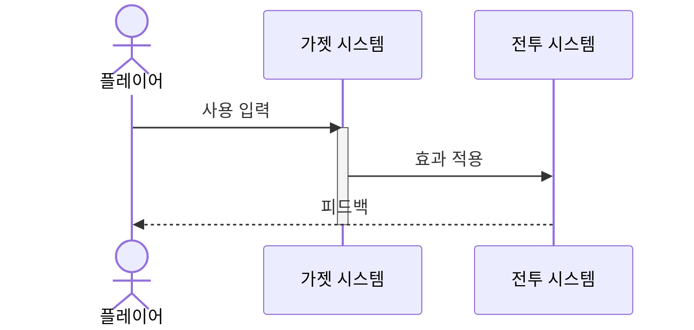

# [가젯 이름] (Gadget Name)

## 1. 개요 (Concept)

### 1.1. Intent (의도)

* **What are you trying to fix?**
  * [이 가젯이 해결하는 전투/생존 문제를 서술합니다.]

### 1.2. Reasoning (설계 의도)

* **[핵심 키워드]:** [이 가젯의 존재 이유 한 줄 요약]
* **[Risk & Reward]:** [리스크와 리턴의 균형 설명]

### 1.3. Cursed Problem Check

* **Promise:** [약속 A] vs [약속 B]
* **Sacrifice:** [희생/제약 명시]

---

## 2. 메커닉 (Mechanics)

> **공통 조작:** 가젯의 기본 조작 방식은 `[System_Gadgets.md](../System_Gadgets.md)` 참조.

### 2.1. 특수 메커닉 (Unique Mechanics)

* **[동작 1]:** [구체적 행동 서술]
* **[동작 2]:** [구체적 행동 서술]
* **최대 설치/소지:** [수량 제한]

### 2.2. 피드백 (Feedback)

* **시각:** [VFX, UI 표시]
* **청각:** [SFX 효과]
* **UI:** [HUD 변화]

---

## 3. 규칙 (Rules)

### 3.1. 발동 조건 (Activation Conditions)

* **설치/사용:** [조건]
* **대상:** [적 플레이어 / 좀비 / 구조물 등]

### 3.2. 효과 범위 및 지속 시간

* **범위:** [반경 m]
* **지속 시간:** [초/영구]

### 3.3. 대미지 처리 로직

* **대미지:** [수치 또는 "없음"]
* **Dealer Tag:** [태그명]

---

## 4. 데이터 & 파라미터 (Parameters)

> **Data Link:** 기본 수치는 `[Content_Stats_Gadget_GadgetList.csv](../../Sheets/Content_Stats_Gadget_GadgetList.csv)` → `[GAD_XXX_XXX]` 참조.

```yaml
gadget_id: GAD_[CAT]_[NAME]
display_name: "[English Name]"
description: "[한국어 설명]"
tier: 1
category: "[OFF/DEF/UTL/SUP]"
type: "[Throwable/Deployable/Consumable/Tool]"
dealer_tag: "[태그 또는 None]"

# 성능 데이터
effect_radius_m: 0
duration_s: 0
max_stack: 0
placement_limit: 0
```

---

## 5. 실전 시나리오 (Combat Scenarios)

### 5.1. 주요 사용 상황

* **[상황 1]:** [구체적 전술 설명]
* **[상황 2]:** [구체적 전술 설명]

### 5.2. 전술적 응용 예시

* **[콤보 이름]:** [다른 가젯/시스템과의 조합]

---

## 6. 가젯 간 상호작용 (Gadget Interactions)

### 6.1. 시너지 (Synergy)

* **[가젯명]:** [시너지 설명]

### 6.2. 카운터 (Counter)

* **[가젯명 (적)]:** [카운터 방법]

---

## 7. 예외 처리 (Edge Cases)

### 7.1. 실패 케이스

* **[상황]:** [처리 방법]

### 7.2. 네트워크 이슈

* **판정 기준:** [서버/클라이언트]

---

## 🎯 검증 기준 (Verification Checklist)

* [ ] [핵심 효과가 의도대로 동작하는가?]
* [ ] [가젯 간 시너지/카운터가 성립하는가?]
* [ ] [GadgetList CSV의 ID와 일치하는가?]

---

## 다이어그램 (Diagrams)

> 가젯 문서는 최소 1개의 sequenceDiagram을 포함하세요.

### [필수] 발동 시퀀스



---

## 코칭 질문 (Follow-up Questions)

**Q1.** [밸런스 - "이 가젯의 효과 대비 획득 비용이 적절한가? 너무 강하거나 약하지 않은가?"]

**Q2.** [전술 깊이 - "이 가젯만의 고유한 전술적 니치가 있는가? 기존 가젯과 역할이 겹치지 않는가?"]

**Q3.** [UX/접근성 - "초보 플레이어도 이 가젯의 용도를 직관적으로 이해할 수 있는가? 피드백이 충분한가?"]
