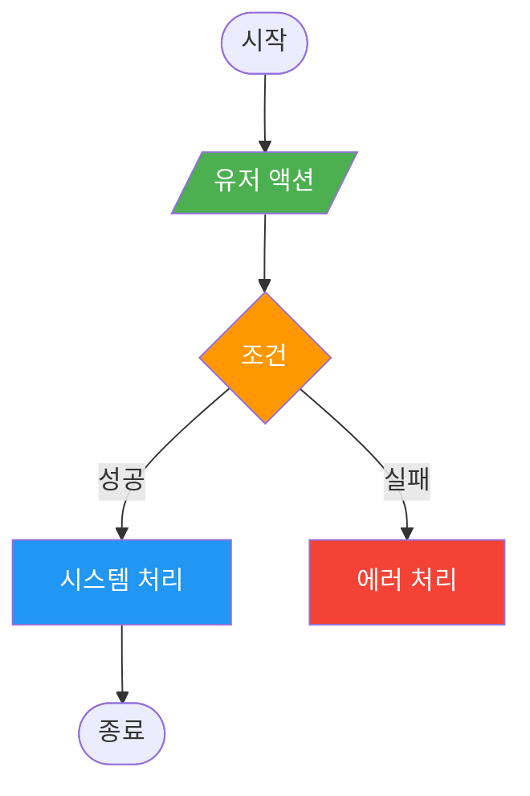
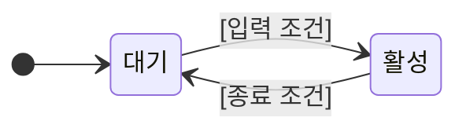
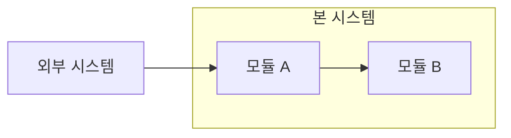

# [시스템 이름] (System Name)

## 🏗️ 구현 현황 (Implementation Status)

> **최근 업데이트:** [YYYY-MM-DD]
> **문서 상태:** `작성 중 (Draft)` / `진행 중 (Living)` / `완료 (Stable)`

| 기능 ID | 분류 | 기능명 (Feature Name) | 우선순위 | 목표 스프린트 | 구현 상태 | 비고 (Notes) |
| :--- | :--- | :--- | :---: | :---: | :--- | :--- |
| **[PREFIX-01-A]** | 시스템 | **[기능명]** | P1 | S1 | 📅 대기 | [설명] |

---

## 0. 필수 참고 자료 (Mandatory References)

* **Writing Standards:** `Design/Documents/GDD_Writing_Rules.md`
* **Project Definition:** `Design/Documents/Project_Vision_Z.md`
* **[관련 시스템]:** `Design/Documents/[관련 문서명].md`

---

## 1. 개요 (Concept)

### 1.1. Intent (의도)

* **What are you trying to fix?**
  * [이 시스템이 해결하고자 하는 문제나 제공하고자 하는 핵심 재미를 서술합니다.]

### 1.2. Reasoning (설계 의도)

* **Why this approach?**
  * [왜 이 방식을 선택했는지, 다른 대안보다 나은 점은 무엇인지 설명합니다.]

### 1.3. Cursed Problem Check

* **Promise:** [플레이어에게 주는 약속 A] vs [약속 B]
* **Sacrifice:** [충돌 시 무엇을 희생하거나 제약할지 명시]

### 1.4. Risk & Reward Analysis

```yaml
risk_reward:
  risk: "[플레이어가 이 행동 시 감수하는 위험]"
  reward: "[성공 시 얻는 보상]"
  peak_moment: "[최대 리스크 = 최대 리턴 순간]"
```

---

## 2. 메커닉 (Mechanics)

### 2.1. [핵심 메커닉 이름]

* **Player Action:** 플레이어는 [행동] 할 수 있다.
* **System Reaction:** 시스템은 [조건] 시 [반응] 한다.
* **Effect:** 그 결과로 [효과]가 발생한다.

### 2.2. 피드백 (Feedback)

* **시각:** [화면 효과, UI 변화]
* **청각:** [사운드 효과]
* **촉각:** [컨트롤러 진동 등]

---

## 3. 규칙 (Rules)

### 3.1. [규칙 이름]

* **조건 (Condition):** [규칙이 적용되는 구체적 조건]
* **처리 (Process):** [구체적인 처리 로직]
* **결과 (Effect):** [처리 결과]

### 3.2. 상호작용 규칙 (Interaction Rules)

* **[다른 시스템명]:** [상호작용 정의]
* **참조:** `[System_관련.md](링크)`

---

## 4. 데이터 & 파라미터 (Parameters)

### 4.1. Config Data

```yaml:config_name
# 이 데이터는 예시이며, 실제 밸런싱은 CSV에서 관리합니다.
base_value: 100
multiplier: 1.5
cooldown_s: 5.0
```

### 4.2. Linked Data

* **[데이터 이름]:** `[Content_System_XXX.csv](../../Sheets/Content_System_XXX.csv)`

---

## 5. 예외 처리 (Edge Cases)

### 5.1. [예외 상황 이름]

* **상황:** [네트워크 단절, 동시 입력, 자원 부족 등]
* **처리:** [해당 상황에서의 시스템 동작 정의]

---

## 🎯 검증 기준 (Verification Checklist)

* [ ] [핵심 기능이 의도대로 동작하는가?]
* [ ] [Risk & Reward가 명확히 체감되는가?]
* [ ] [다른 시스템과의 상호작용이 일관적인가?]

---

## 다이어그램 (Diagrams)

> System 문서는 최소 2개의 Mermaid 다이어그램을 포함하세요.

### [필수] 유저 플로우 (flowchart TD)



### [필수] 상태 전이 (stateDiagram-v2)



### [선택] 시스템 관계 (graph LR)



---

## 코칭 질문 (Follow-up Questions)

**Q1.** [Risk & Reward - "플레이어가 감수하는 리스크가 명확한가?"]

**Q2.** [3대 기둥 - "이 시스템이 캠핑카/총기 제작/자원 전략 중 어디에 기여하는가?"]

**Q3.** [밸런스 - "이 시스템이 다른 시스템과 충돌하지 않는가?"]
