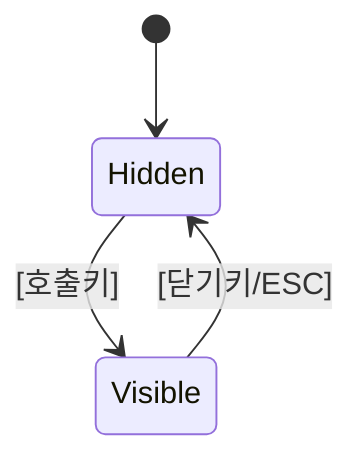

# [UI 이름] (UI Module Name)

## 🏗️ 구현 현황 (Implementation Status)

> **최근 업데이트:** [YYYY-MM-DD]
> **문서 상태:** `작성 중 (Draft)` / `진행 중 (Living)` / `완료 (Stable)`

| 기능 ID | 분류 | 기능명 (Feature Name) | 우선순위 | 목표 스프린트 | 구현 상태 | 비고 (Notes) |
| :--- | :--- | :--- | :---: | :---: | :--- | :--- |
| **[UI-XX-A]** | 모듈 | **[기능명]** | P1 | S1 | 📅 대기 | [설명] |

---

## 0. 필수 참고 자료 (Mandatory References)

* **Writing Standards:** `Design/Documents/GDD_Writing_Rules.md`
* **HUD Layout:** `Design/Documents/UI_HUD_Layout.md`
* **Style Tokens:** `Design/Sheets/Content_UI_HUD_StyleTokens.csv`
* **[관련 시스템]:** `Design/Documents/[관련_System_문서].md`

---

## 1. 디자인 가이드라인 (Design Guidelines)

### 1.1. Design Philosophy

* **[핵심 원칙 1]:** [Diegetic / Minimalism / Industrial Grunge 등에서 선택하여 구체화]
* **[핵심 원칙 2]:** [이 UI 모듈 고유의 디자인 철학]

### 1.2. 스타일 파라미터 (Style Parameters)

* **Font:** [StyleTokens 참조 또는 직접 지정]
* **Colors:**
  * **Normal:** [색상코드 + 용도]
  * **Active:** [색상코드 + 용도]
  * **Disabled:** [색상코드 + 용도]

---

## 2. 화면 구성 (Screen Layout)

### 2.1. 와이어프레임 (Wireframe)

<!-- 와이어프레임 이미지 또는 텍스트 묘사 -->
<!--  -->

```
┌──────────────────────────────┐
│        [Header Area]         │
├──────────────────────────────┤
│                              │
│        [Content Area]        │
│                              │
├──────────────────────────────┤
│        [Action Area]         │
└──────────────────────────────┘
```

### 2.2. 요소별 상세 (Element Details)

| 요소 (Element) | 위치 (Position) | 내용 (Content) | 상호작용 (Interaction) |
| :--- | :--- | :--- | :--- |
| **[요소명]** | [위치] | [표시 내용] | [입력 방법] |

---

## 3. 조작 규칙 (Interaction Rules)

### 3.1. 입력 바인딩 (Input Binding)

* **호출:** `[Key]` → UI 열기/닫기
* **참조:** `[System_Controls_Keybindings.md](링크)`

### 3.2. 상태 전이 (State Transitions)



---

## 4. 데이터 바인딩 (Data Binding)

### 4.1. 데이터 소스 (Data Source)

* **[데이터명]:** `[Content_XXX.csv](../../Sheets/Content_XXX.csv)`

### 4.2. 표시 규칙 (Display Rules)

* [CSV의 어떤 컬럼이 UI의 어떤 요소에 바인딩되는지 명시]

---

## 5. 피드백 규칙 (Feedback Rules)

### 5.1. 시각 피드백

* **[상태]:** [색상 변화, 애니메이션 등]

### 5.2. 청각 피드백

* **[액션]:** [SFX 이름 또는 ID]

---

## 6. 예외 처리 (Edge Cases)

### 6.1. [예외 상황]

* **상황:** [데이터 없음, 네트워크 지연 등]
* **처리:** [대체 표시, fallback 동작]

---

## 🎨 프로토타입 (Prototype)

* **파일:** `[Prototypes/xxx_prototype.html](../../Prototypes/xxx_prototype.html)`
* **상태:** [최신 / 구버전 / 미제작]

---

## 🎯 검증 기준 (Verification Checklist)

* [ ] [UI가 의도대로 표시되는가?]
* [ ] [StyleTokens와 일관된 색상/폰트를 사용하는가?]
* [ ] [입력이 정상 동작하는가?]

---

## 코칭 질문 (Follow-up Questions)

**Q1.** [가독성 - "이 UI에서 가장 중요한 정보가 시선이 처음 닿는 곳에 있는가?"]

**Q2.** [상태 표현 - "모든 시스템 상태가 UI에 시각적으로 표현되는가? 숨겨진 상태는 없는가?"]

**Q3.** [일관성 - "이 UI의 조작 패턴이 다른 UI 모듈과 일관적인가? StyleTokens를 준수하는가?"]
