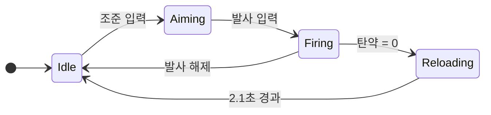

> gdd-writer 스킬의 GDD 작성 시 자주 발생하는 실수 모음. Bad/Good 예시와 수정 방법 포함.

# GDD 작성 실수 모음 (Common Mistakes)

## 개요 (Overview)

GDD 작성 시 반복적으로 발생하는 실수 12가지를 정리한다. 각 항목에 Bad 예시, Good 예시, 수정 방법을 포함한다.

---

## 실수 1: 범위 과대 (Scope Creep)

하나의 문서에서 너무 많은 시스템을 다루려는 실수.

**Bad 예시**:
```
## 전투 시스템 (Combat System)
사격, 근접, 투척, 방어, 회피, 부위 데미지, 넉백, 상태이상을 모두 설명한다.
```

**Good 예시**:
```
## 사격 시스템 (Shooting System)
본 문서는 원거리 사격의 히트 판정과 데미지 계산만 다룬다.
근접 전투: System_Combat_Melee.md 참조
투척 시스템: System_Combat_Throwable.md 참조
```

**수정 방법**: 문서당 하나의 핵심 동사(Verb)만 다룬다. 관련 시스템은 별도 문서로 분리하고 상호 참조 링크를 건다.

---

## 실수 2: 감상문 작성 (Subjective Writing)

구현 스펙 대신 감상이나 기대를 서술하는 실수.

**Bad 예시**:
```
이 시스템은 플레이어에게 긴장감 넘치는 전투 경험을 선사하며,
팀원과 함께 적을 물리치는 성취감이 굉장할 것이다.
```

**Good 예시**:
```
### Risk & Reward
- 리스크: 재장전 중 2.1초간 무방비 상태
- 보상: 재장전 완료 시 30발 확보
- 피크 모멘트: 탄약 5발 이하에서 "쏠 것인가, 재장전할 것인가" 판단
```

**수정 방법**: "재미있다", "긴장감", "성취감" 등 감상적 표현을 제거한다. 대신 어떤 메커닉이 어떤 상황을 만드는지 구체적으로 기술한다.

---

## 실수 3: 모호한 표현 (Vague Language)

"적절히", "빠르게", "많은" 등 수량화 불가능한 표현 사용.

**Bad 예시**:
```
- 적절한 데미지를 준다
- 빠르게 이동한다
- 많은 자원을 소비한다
```

**Good 예시**:
```
- 기본 데미지 45 (헤드샷 배율 1.5x)
- 이동 속도 5.5 m/s (달리기 7.2 m/s)
- Scrap Parts 120개 소비
```

**수정 방법**: 모든 형용사/부사를 수치로 대체한다. 수치가 미정이면 `TBD(결정 필요)` 표기 후 YAML 블록에 플레이스홀더를 남긴다.

---

## 실수 4: 수치 하드코딩 (Hardcoded Values)

파라미터 수치를 본문에 직접 삽입하는 실수.

**Bad 예시**:
```
## 메커닉 (Mechanics)
벽의 HP는 500이고 건설 시간은 3초이다. 최대 건설 거리는 10m이다.
```

**Good 예시**:
```
## 메커닉 (Mechanics)
벽의 HP, 건설 시간, 최대 건설 거리는 아래 파라미터 섹션 참조.

## 데이터 & 파라미터 (Parameters)
```yaml
Wall_HP: 500              # 단위: HP
Build_Time_s: 3.0         # 단위: 초
Max_Build_Distance_m: 10  # 단위: m
# SSoT: ../../Sheets/Content_System_Build_BuildingBlocks.csv
```

**수정 방법**: 본문에서 수치를 제거하고 "파라미터 섹션 참조"로 대체한다. 모든 수치는 YAML 코드 블록 또는 CSV에만 존재한다.

---

## 실수 5: 예외 처리 누락 (Missing Edge Cases)

Happy Path(정상 흐름)만 기술하고 예외 상황을 무시하는 실수.

**Bad 예시**:
```
## 메커닉 (Mechanics)
플레이어가 발사 버튼을 누르면 총이 발사되고 적에게 데미지를 준다.
```

**Good 예시**:
```
## 예외 처리 (Edge Cases)

### 탄약 0 상태
- 조건: 잔여 탄약 0에서 발사 버튼 입력
- 처리: 공이치기 소리 재생, 재장전 프롬프트 표시
- 결과: 0.3초 입력 무시

### 네트워크 지연 (> 200ms)
- 조건: 클라이언트-서버 지연 200ms 초과
- 처리: 클라이언트 예측 후 서버 검증
- 결과: 불일치 시 서버 판정 우선

### 동시 사격 (동일 틱)
- 조건: 같은 서버 틱에 양쪽 적중
- 처리: 트레이드 킬 허용
- 결과: 양쪽 HP 동시 감소
```

**수정 방법**: 최소 3개 시나리오(네트워크 단절/지연, 동시 입력, 자원 부족/경계값)를 반드시 포함한다.

---

## 실수 6: 폐기 용어 사용 (Deprecated Terms)

Glossary.md에서 폐기된 용어를 사용하는 실수.

**Bad 예시**:
```
Scrap Metal을 수집하여 Plasma 코어와 결합한다.
Diamond 등급 무기를 제작할 수 있다.
```

**Good 예시**:
```
Scrap Parts를 수집하여 Core Module과 결합한다.
Tier 3 무기를 제작할 수 있다.
```

**수정 방법**: 아래 폐기 용어 목록을 확인하고 공식 용어로 대체한다.

| 폐기 용어 | 공식 용어 |
| :-------- | :-------- |
| Plasma | (용도에 따라) Core Module |
| Diamond | (등급이면) Tier 표기 / (공격 패턴이면) Diamond 사용 가능 |
| Emerald | Tier 표기 |
| Plastic | 해당 없음 |
| Uranium | 해당 없음 |
| Scrap Metal | Scrap Parts |

---

## 실수 7: 스마트 따옴표 (Smart Quotes)

에디터의 자동 변환으로 스마트 따옴표가 삽입되는 실수.

**Bad 예시**:
```
\u201c플레이어\u201d가 \u201c총\u201d을 \u201c제작\u201d한다
```

**Good 예시**:
```
"플레이어"가 "총"을 "제작"한다
```

**수정 방법**: 에디터의 스마트 따옴표 자동 변환을 비활성화한다. 직선 따옴표(`"`, `'`)만 사용한다.

---

## 실수 8: 테이블 내 Bold (Bold in Tables)

테이블 셀 내부에 `**Bold**` 마크다운을 사용하는 실수.

**Bad 예시**:
```markdown
| **기능명** | **데미지** | **비고** |
| **사격** | **45** | **기본** |
```

**Good 예시**:
```markdown
| 기능명 | 데미지 | 비고 |
| :----- | :----: | :--- |
| 사격   |   45   | 기본 |
```

**수정 방법**: 테이블 셀에서 `**` 제거. 강조가 필요하면 문장 구조로 해결하거나 blockquote(`>`) 내에서만 Bold 사용.

---

## 실수 9: 헤더 5단계 이상 (Deep Headers)

헤더를 5단계(`#####`) 이상으로 사용하는 실수.

**Bad 예시**:
```markdown
## 전투 시스템
### 사격
#### 히트 판정
##### 부위별 배율      <-- 5단계 금지
###### 헤드샷          <-- 6단계 금지
```

**Good 예시**:
```markdown
## 전투 시스템 (Combat System)
### 사격 (Shooting)
#### 히트 판정 (Hit Detection)

부위별 배율:
- 머리: 1.5x
- 몸통: 1.0x
- 사지: 0.75x
```

**수정 방법**: 최대 4단계(`####`)까지만 사용. 5단계가 필요하면 목록(`-`)이나 Bold로 대체한다.

---

## 실수 10: CSV 링크 누락 (Missing CSV Links)

SSoT 원칙을 위반하고 CSV 참조 링크를 넣지 않는 실수.

**Bad 예시**:
```
기본 데미지는 파라미터 참조.
```

**Good 예시**:
```
기본 데미지는 [Content_Stats_Weapon_RangeList.csv](../../Sheets/Content_Stats_Weapon_RangeList.csv) -> WEP_RNG_AR_01 참조.
```

**수정 방법**: YAML 파라미터 블록에 `# SSoT: ../../Sheets/Content_XXX.csv` 주석을 추가하고, 본문에서도 CSV 링크를 명시한다.

---

## 실수 11: Mermaid 다이어그램 누락 (Missing Diagrams)

텍스트만으로 복잡한 흐름이나 상태 전이를 설명하려는 실수.

**Bad 예시**:
```
플레이어가 조준하면 사격 가능 상태가 되고, 발사하면 탄약이 줄고,
탄약이 0이면 재장전 상태가 되며, 재장전이 끝나면 다시 대기 상태로 돌아간다.
```

**Good 예시**:


**수정 방법**: 상태 전이는 stateDiagram-v2, 유저 플로우는 flowchart TD, 시간순 상호작용은 sequenceDiagram을 사용한다.

---

## 실수 12: 3대 기둥 미연결 (Unlinked to Pillars)

시스템의 존재 이유가 3대 기둥과 연결되지 않는 실수.

**Bad 예시**:
```
## 개요 (Concept)
날씨 시스템은 비, 눈, 안개 등 다양한 날씨를 구현한다.
```

**Good 예시**:
```
## 개요 (Concept)

### Intent
날씨 시스템은 캠핑카 방어 난이도를 동적으로 조절하여
"캠핑카를 지켜야 할 애착 대상" 기둥을 강화한다.

### 3대 기둥 연결
- 캠핑카: 폭풍 시 캠핑카 내구도 감소 -> 수리 자원 소비 -> 방어 긴장감
- 자원 전략: 날씨별 탐색 효율 변동 -> 탐색 시점 선택의 전략적 가치
```

**수정 방법**: 개요(Concept) 섹션에 3대 기둥 중 최소 1개와의 연결을 명시한다. 연결이 없으면 시스템 존재 이유를 재검토한다.
