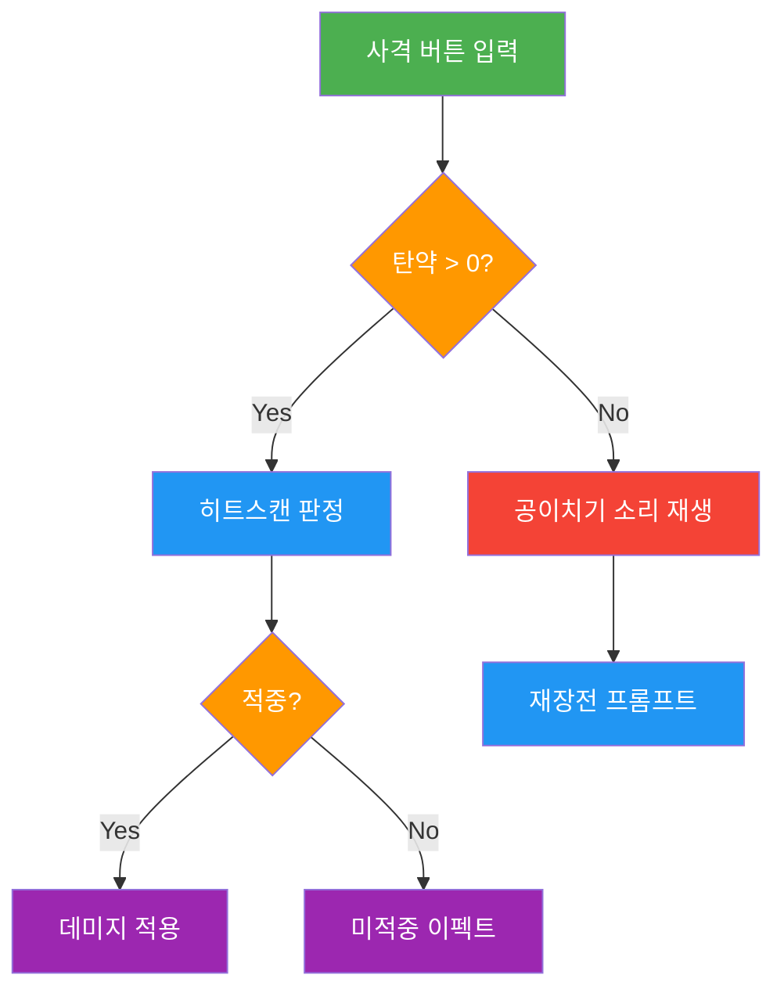
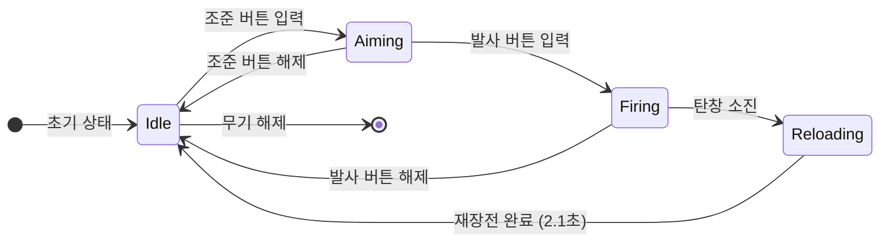
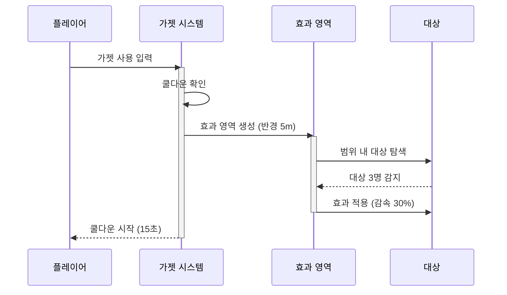
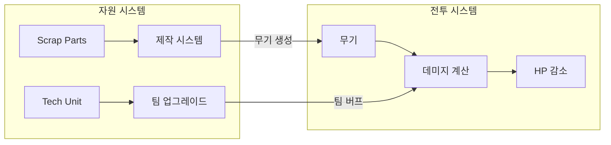
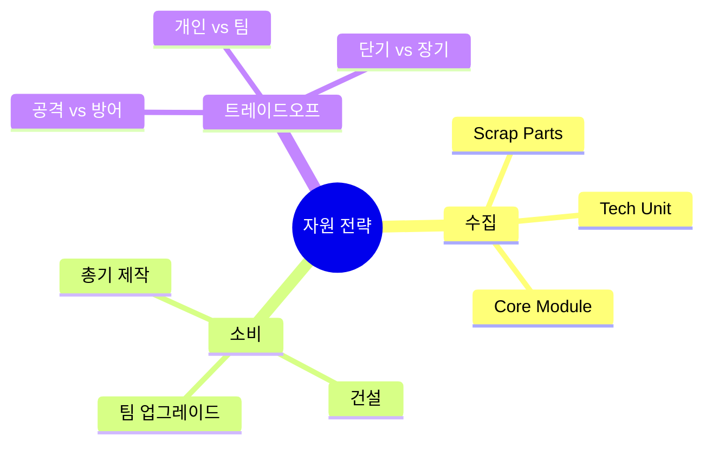
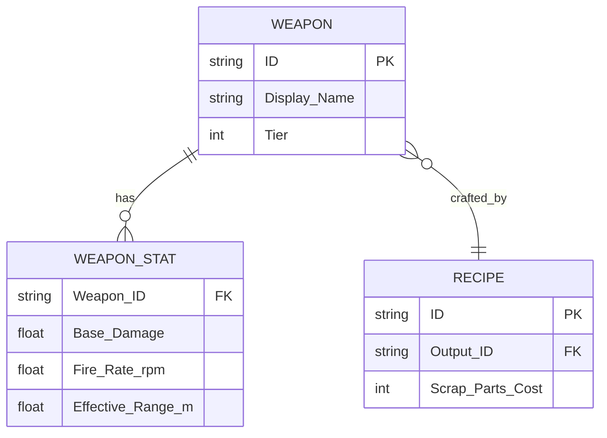
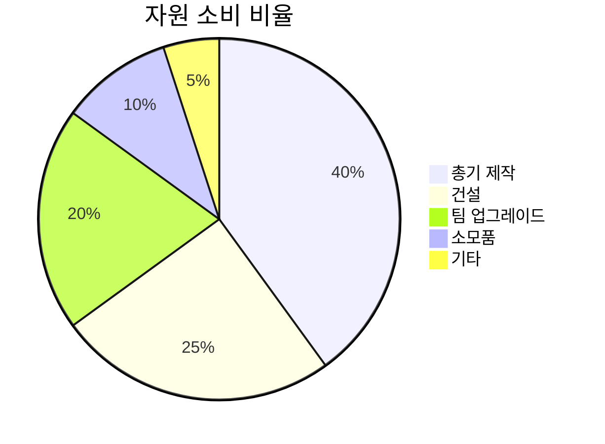
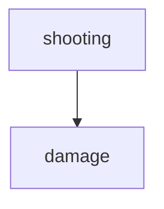
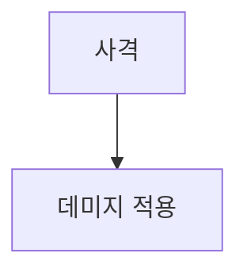

> gdd-writer 스킬의 Mermaid 다이어그램 표기법 및 문서 유형별 매핑 가이드.

# Mermaid 다이어그램 가이드 (Mermaid Diagram Guide)

## 1. 문서별 필수 다이어그램 매핑 (Document-Diagram Mapping)

각 문서 유형에 따라 사용해야 할 Mermaid 다이어그램 유형이 정해져 있다.

### System_*.md

| 다이어그램 유형 | 필수 여부 | 용도 |
| :------------- | :-------: | :--- |
| flowchart TD | 필수 | 유저 플로우 (입력 -> 처리 -> 결과) |
| stateDiagram-v2 | 필수 | 상태 전이 (Idle -> Active -> Cooldown) |
| graph LR | 선택 | 시스템 간 관계 (입출력 데이터 흐름) |

### Gadget_*.md

| 다이어그램 유형 | 필수 여부 | 용도 |
| :------------- | :-------: | :--- |
| sequenceDiagram | 필수 | 발동 -> 효과 -> 종료 타임라인 |
| flowchart TD | 필수 | 발동 조건 분기 (성공/실패/쿨다운) |

### UI_*.md

| 다이어그램 유형 | 필수 여부 | 용도 |
| :------------- | :-------: | :--- |
| stateDiagram-v2 | 필수 | UI 상태 전이 (Hidden -> Visible -> Focused) |

### Design_*.md

| 다이어그램 유형 | 필수 여부 | 용도 |
| :------------- | :-------: | :--- |
| mindmap | 선택 | 설계 원칙 관계도 |

### Content_*.md

| 다이어그램 유형 | 필수 여부 | 용도 |
| :------------- | :-------: | :--- |
| erDiagram | 선택 | 데이터 엔티티 관계 |

---

## 2. Mermaid 유형별 작성 규칙 (Type-Specific Rules)

### 2-1. flowchart TD (유저 플로우)

**용도**: 플레이어 행동의 흐름을 위에서 아래로 표현한다.

**규칙**:
- 방향: TD (Top-Down)
- 노드 수: 15개 이하
- classDef로 색상 구분 필수
- 조건 분기는 다이아몬드(`{}`) 사용

**색상 구분 (classDef)**:
- `userAction`: 유저 액션 (초록, `fill:#4CAF50,color:#fff`)
- `systemProcess`: 시스템 처리 (파랑, `fill:#2196F3,color:#fff`)
- `condition`: 조건 분기 (주황, `fill:#FF9800,color:#fff`)
- `error`: 에러/실패 (빨강, `fill:#f44336,color:#fff`)
- `result`: 결과/효과 (보라, `fill:#9C27B0,color:#fff`)

**예시**:


**범례**: 초록=유저 액션, 파랑=시스템 처리, 주황=조건 분기, 빨강=에러, 보라=결과

---

### 2-2. stateDiagram-v2 (상태 전이)

**용도**: 시스템 또는 오브젝트의 상태 변화를 표현한다.

**규칙**:
- direction: LR (Left-Right) 권장
- 노드 수: 12개 이하
- 전이 조건 라벨 필수 (화살표 위에 조건 명시)
- `[*]`로 시작/종료 상태 표기

**예시**:


---

### 2-3. sequenceDiagram (시퀀스)

**용도**: 액터 간 시간순 상호작용을 표현한다. 가젯 발동 흐름에 필수.

**규칙**:
- activate/deactivate 사용하여 활성 구간 명시
- 액터 수: 3~5개
- 메시지 수: 3~5개 왕복
- 액터 이름: 한국어, participant ID는 영문

**예시**:


---

### 2-4. graph LR (시스템 관계)

**용도**: 시스템 간 데이터 흐름과 의존 관계를 표현한다.

**규칙**:
- 방향: LR (Left-Right)
- subgraph로 시스템 경계 표시
- 화살표 라벨에 데이터 유형 명시

**예시**:


---

### 2-5. mindmap (마인드맵)

**용도**: 설계 원칙이나 개념의 관계를 시각화한다.

**규칙**:
- 깊이: 최대 3단계
- 루트 노드: 시스템명 또는 설계 원칙명
- 가지: 하위 개념 또는 구성 요소

**예시**:


---

### 2-6. erDiagram (ER 다이어그램)

**용도**: 데이터 엔티티 간 관계를 표현한다. Content_*.md에서 CSV 구조를 시각화할 때 사용.

**규칙**:
- PK(Primary Key), FK(Foreign Key) 표시
- 관계 유형 명시: `||--||` (1:1), `||--o{` (1:N), `}o--o{` (N:M)
- 엔티티명: 영문 Pascal_Case

**예시**:


---

### 2-7. pie (파이 차트)

**용도**: 비율 분포를 시각화한다.

**규칙**:
- 세그먼트: 6개 이하
- 제목 필수

**예시**:


---

## 3. 한국어 라벨 규칙 (Korean Label Rules)

### 노드/액터 이름

- 표시 라벨: 한국어 사용
- 내부 ID: 영문 사용

**Bad 예시**:


**Good 예시**:


### 화살표 라벨

- 조건: 한국어 (`|탄약 > 0|`)
- 데이터 유형: 영문 허용 (`|HP 값|`)

---

## 4. 범례 필수 규칙 (Legend Requirement)

모든 flowchart에는 다이어그램 하단에 색상별 의미를 범례로 표기한다.

**형식**:
```markdown
> 범례: 초록=유저 액션, 파랑=시스템 처리, 주황=조건 분기, 빨강=에러, 보라=결과
```

다이어그램 직후에 blockquote 형식으로 삽입한다.

---

## 5. 다이어그램 배치 규칙 (Placement Rules)

- flowchart TD: 메커닉(Mechanics) 섹션에 배치
- stateDiagram-v2: 규칙(Rules) 섹션에 배치
- sequenceDiagram: 메커닉(Mechanics) 섹션에 배치
- graph LR: 개요(Concept) 또는 규칙(Rules) 섹션에 배치
- mindmap: 개요(Concept) 섹션에 배치
- erDiagram: 데이터 & 파라미터(Parameters) 섹션에 배치
- pie: 데이터 & 파라미터(Parameters) 섹션에 배치

---

## 6. 복잡도 관리 규칙 (Complexity Control)

다이어그램이 복잡해지면 가독성이 급격히 떨어진다.

| 유형 | 최대 노드 | 최대 화살표 | 초과 시 조치 |
| :--- | :-------: | :---------: | :----------- |
| flowchart TD | 15 | 20 | subgraph로 분리 |
| stateDiagram-v2 | 12 | 15 | 복합 상태(state) 사용 |
| sequenceDiagram | 5 액터 | 10 메시지 | 시나리오 분리 |
| graph LR | 10 | 15 | subgraph 분리 |
| mindmap | 3단계 | - | 하위 맵 분리 |
| erDiagram | 8 엔티티 | 12 관계 | 도메인별 분리 |
| pie | 6 세그먼트 | - | "기타" 병합 |
