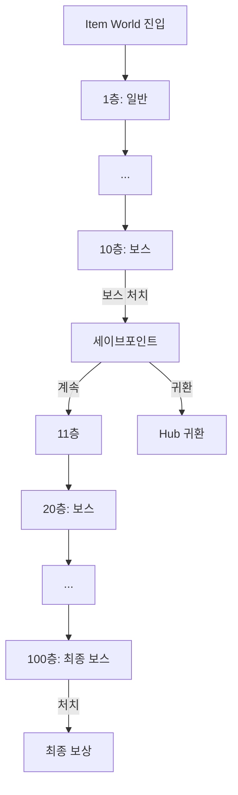
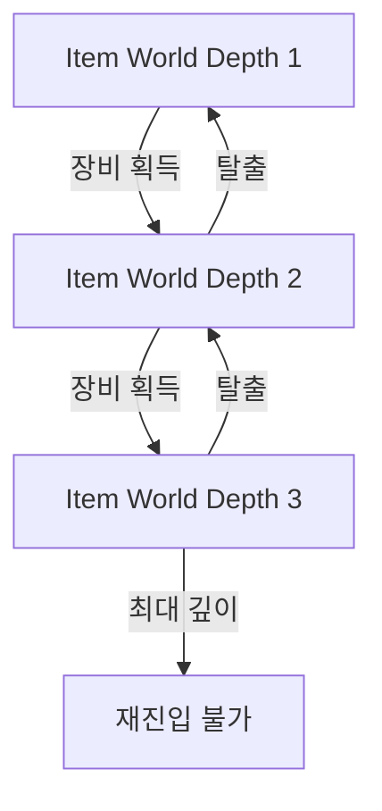

# [아이템월드 시스템/설계명] ([Item World System/Design Name])

## 0. 필수 참고 자료 (Mandatory References)

* Project Overview: `Reference/게임 기획 개요.md`
* Writing Rules: `.claude/skills/metroidvania-gdd/references/writing-rules.md`
* Item World Reference: `Reference/디스가이아 시스템 분석.md`
* Item World Reverse GDD: `Reference/Disgaea_ItemWorld_Reverse_GDD.md`
* Level Generation: `Reference/Spelunky-LevelGeneration-ReverseGDD.md`
* [관련 문서]: `[경로]`

---

## 구현 현황 (Implementation Status)

> 최근 업데이트: YYYY-MM-DD
> 문서 상태: `작성 중 (Draft)` / `진행 중 (Living)` / `완료 (Stable)`

| 기능 ID | 분류 | 기능명 (Feature Name) | 우선순위 | 구현 상태 | 비고 (Notes) |
| :--- | :--- | :--- | :---: | :--- | :--- |
| IW-01-A | 시스템 | [기능명] | P1 | 작성 중 | [비고] |

---

### 적용 공간 (Applicable Space)

| 공간 | 적용 여부 | 비고 |
| :--- | :---: | :--- |
| World | X | - |
| Item World | O | 메인 적용 대상 |
| Hub | X | 진입/귀환 인터페이스만 |

---

## 1. 개요 (Concept)

### 의도 (Intent)

> [이 시스템이 Item World에서 존재하는 이유]

### 근거 (Reasoning)

> - Item World 야리코미: [핵심 기여]
> - Metroidvania 탐험: [Item World 내 탐험 요소]
> - Online 멀티플레이: [파티 플레이 연동]

### 저주받은 문제 점검 (Cursed Problem Check)

> CP-2 (야리코미 깊이 vs 접근성): [이 설계의 균형점]
> CP-5 (시드 재현성 vs 신선함): [이 설계의 접근법]

### 위험과 보상 (Risk & Reward)

> 실패 시나리오: [반복감, 보상 부족]
> 성공 시나리오: ["한 판 더"의 중독성, 성장 실감]
> 피크 모먼트: [레어 Innocent 획득, 보스 처치, 깊은 층 도달]

---

## 2. 층 구조 (Floor Structure)

### 층 유형 정의

| 층 유형 | 출현 패턴 | 특징 |
| :--- | :--- | :--- |
| 일반층 | 기본 | 몬스터 + 보상 + 탈출 포탈 |
| 보스층 | 매 N층 | 보스 전투 + 보장 보상 |
| 이벤트층 | 랜덤 | 특수 이벤트 (상점, NPC, 퍼즐) |
| 세이브포인트 | 매 M층 | 진행 저장 + 귀환 선택 |

### 층 진행 흐름도 (Floor Progression)



---

## 3. 시드 생성 규칙 (Seed Generation)

```yaml
# 시드 생성 파라미터
Seed_Formula: "hash(Item_ID + Item_Level + Floor_Number)"
Max_Recursive_Depth: 3          # 재귀 진입 최대 깊이
Room_Template_Pool_Size: 0      # 룸 템플릿 총 수
Rooms_Per_Floor_Min: 0          # 최소 룸 수
Rooms_Per_Floor_Max: 0          # 최대 룸 수
```

### 시드 결정 요소

| 요소 | 영향 |
| :--- | :--- |
| Item_ID | 기본 맵 구조 |
| Item_Level | 난이도 스케일링 |
| Floor_Number | 층별 변주 |
| [추가 요소] | [영향] |

---

## 4. 보상 시스템 (Reward System)

### 층별 보상 테이블

```yaml
# 보상 파라미터
Normal_Floor_EXP_Base: 0        # _exp
Boss_Floor_EXP_Multiplier: 0.0  # _x
Innocent_Drop_Rate_Normal: 0.0  # _%
Innocent_Drop_Rate_Boss: 0.0    # _% (보장 여부)
Depth_Bonus_Per_10F: 0.0        # _% (10층마다 추가 보너스)
```

### 보상 스케일링

| 층 구간 | 난이도 배율 | EXP 배율 | Innocent 등급 |
| :--- | :--- | :--- | :--- |
| 1~10 | 1.0x | 1.0x | Common |
| 11~30 | [값] | [값] | [등급] |
| 31~50 | [값] | [값] | [등급] |
| 51~70 | [값] | [값] | [등급] |
| 71~90 | [값] | [값] | [등급] |
| 91~100 | [값] | [값] | [등급] |

> SSoT: `[CSV 경로]`

---

## 5. 재귀 진입 (Recursive Entry)

### 재귀 규칙

- 재귀 진입: Item World 내에서 획득한 장비의 Item World에 재진입
- 최대 깊이: Max_Recursive_Depth 참조
- 깊이별 난이도 보정: [규칙]



---

## 6. 멀티플레이 연동 (Multiplayer Integration)

| 항목 | 솔로 | 파티 (2~4p) |
| :--- | :--- | :--- |
| 난이도 스케일링 | 기본 | [스케일링 규칙] |
| 보상 분배 | 전부 획득 | [분배 규칙] |
| 부활 메카닉 | [규칙] | [규칙] |
| 탈출 조건 | 개인 | [전원/개인] |

---

## 7. 예외 처리 (Edge Cases)

| # | 상황 | 처리 |
| :--- | :--- | :--- |
| EC-1 | 재귀 깊이 초과 시도 | [처리] |
| EC-2 | Item World 진행 중 장비 삭제/판매 | [처리] |
| EC-3 | 파티원 접속 해제 중 보스전 | [처리] |
| EC-4 | 동일 시드에서 다른 결과 발생 | [처리] |
| EC-5 | 자동사냥 중 보스층 도달 | [처리] |

---

## 검증 기준 (Verification Checklist)

* [ ] 층 구조 정의 완전 (일반/보스/이벤트/세이브)
* [ ] 시드 생성 규칙 명시
* [ ] 보상 테이블 YAML 분리
* [ ] 재귀 진입 규칙 명시
* [ ] 멀티플레이 스케일링 정의
* [ ] Edge Case 최소 3개
* [ ] Mermaid 다이어그램 최소 1개
* [ ] 3대 기둥 정렬 확인
