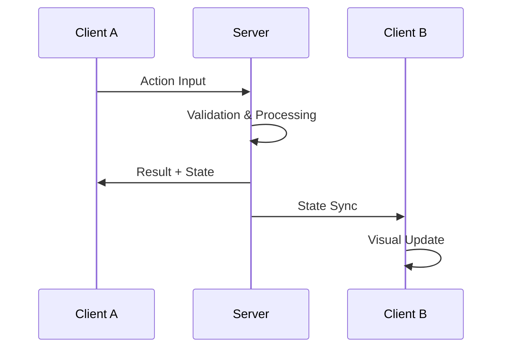

# [멀티플레이 시스템명] ([Multiplayer System Name])

## 0. 필수 참고 자료 (Mandatory References)

* Project Overview: `Reference/게임 기획 개요.md`
* Writing Rules: `.claude/skills/metroidvania-gdd/references/writing-rules.md`
* [관련 문서]: `[경로]`

---

## 구현 현황 (Implementation Status)

> 최근 업데이트: YYYY-MM-DD
> 문서 상태: `작성 중 (Draft)` / `진행 중 (Living)` / `완료 (Stable)`

| 기능 ID | 분류 | 기능명 (Feature Name) | 우선순위 | 구현 상태 | 비고 (Notes) |
| :--- | :--- | :--- | :---: | :--- | :--- |
| MP-01-A | 멀티플레이 | [기능명] | P1 | 작성 중 | [비고] |

---

### 적용 공간 (Applicable Space)

| 공간 | 적용 여부 | 비고 |
| :--- | :---: | :--- |
| World | O/X | [인원 제한: 1~2p] |
| Item World | O/X | [인원 제한: 1~4p] |
| Hub | O/X | [인원: 무제한] |

---

## 1. 개요 (Concept)

### 의도 (Intent)

> [이 멀티플레이 시스템의 목적]

### 근거 (Reasoning)

> - Online 멀티플레이: [핵심 기여]
> - "혼자서도 재미있고 함께하면 더 재미있다" 원칙 적용: [방법]

### 저주받은 문제 점검 (Cursed Problem Check)

> CP-3 (자동사냥 편의 vs 플레이 가치): [해당 시]
> CP-4 (솔로 밸런스 vs 파티 밸런스): [이 설계의 균형점]

---

## 2. 네트워크 아키텍처 (Network Architecture)

### 권한 모델 (Authority Model)

| 시스템 | 권한 | 이유 |
| :--- | :--- | :--- |
| 이동 | 클라이언트 예측 + 서버 보정 | 반응성 |
| 전투 판정 | 서버 | 치트 방지 |
| 아이템 드롭 | 서버 | 치트 방지 |
| UI/이펙트 | 클라이언트 | 성능 |

### 통신 흐름 (Communication Flow)



---

## 3. 파티 시스템 (Party System)

### 공간별 파티 규칙

```yaml
# 파티 파라미터
World_Max_Party: 2              # _명
ItemWorld_Max_Party: 4          # _명
Hub_Max_Visible: 0              # _명 (화면 내 최대 표시)
Party_Invite_Range: 0           # _m (초대 가능 거리, Hub)
Party_Teleport_Cooldown: 0     # _s (파티원 합류 쿨다운)
```

### 난이도 스케일링

| 파티 인원 | HP 배율 | ATK 배율 | 보상 배율 |
| :--- | :--- | :--- | :--- |
| 1 (솔로) | 1.0x | 1.0x | 1.0x |
| 2 | [값] | [값] | [값] |
| 3 | [값] | [값] | [값] |
| 4 | [값] | [값] | [값] |

---

## 4. 동기화 규칙 (Synchronization Rules)

### 동기화 우선순위

P1: [최우선 동기화 항목 - 예: 캐릭터 위치, HP]
P2: [중요 동기화 - 예: 전투 판정, 아이템 드롭]
P3: [저우선 - 예: 이펙트, 환경 변화]

### 레이턴시 허용 범위

```yaml
Max_Acceptable_Latency: 0      # _ms
Interpolation_Buffer: 0        # _ms
Server_Tick_Rate: 0             # _hz
Client_Send_Rate: 0             # _hz
```

---

## 5. 접속 해제/재접속 (Disconnect/Reconnect)

| 상황 | 처리 | 시간 제한 |
| :--- | :--- | :--- |
| 일시적 끊김 | [처리] | [N]초 |
| 장시간 끊김 | [처리] | [N]분 |
| 의도적 퇴장 | [처리] | - |
| 보스전 중 끊김 | [처리] | [N]초 |

---

## 6. 보상 분배 (Reward Distribution)

| 보상 유형 | 분배 방식 | 비고 |
| :--- | :--- | :--- |
| EXP | [방식] | [비고] |
| 아이템 드롭 | [방식] | [비고] |
| Innocent | [방식] | [비고] |
| 골드 | [방식] | [비고] |

---

## 7. 예외 처리 (Edge Cases)

| # | 상황 | 처리 |
| :--- | :--- | :--- |
| EC-1 | 파티 리더 접속 해제 | [처리] |
| EC-2 | 보스전 중 파티원 전원 사망 | [처리] |
| EC-3 | 파티원 간 레벨 차이가 극심 | [처리] |
| EC-4 | 네트워크 지연으로 동기화 실패 | [처리] |
| EC-5 | 치트 의심 행동 감지 | [처리] |

---

## 검증 기준 (Verification Checklist)

* [ ] 권한 모델 정의 (서버/클라이언트)
* [ ] sequenceDiagram 포함
* [ ] 파티 인원별 스케일링 테이블
* [ ] 접속 해제/재접속 처리 정의
* [ ] 보상 분배 규칙 명시
* [ ] 레이턴시 허용 범위 명시
* [ ] Edge Case 최소 3개
