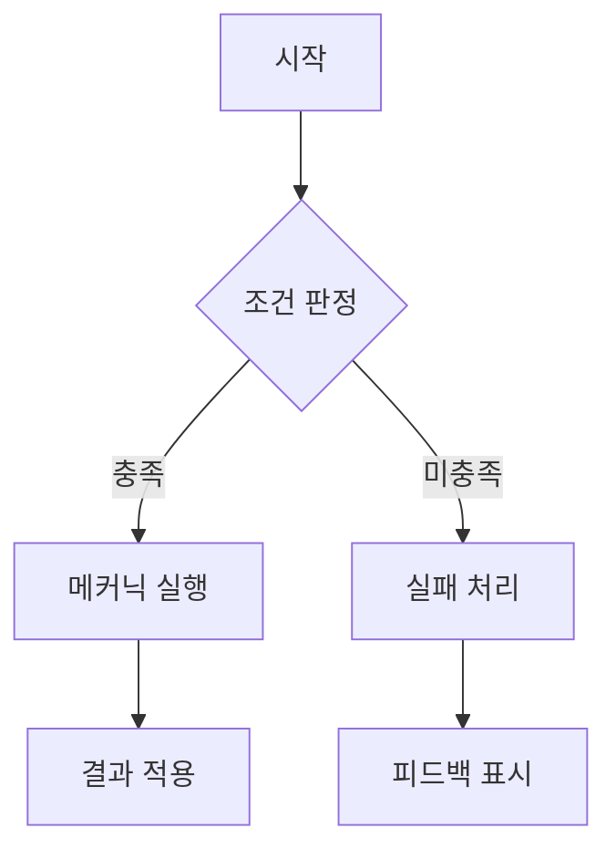
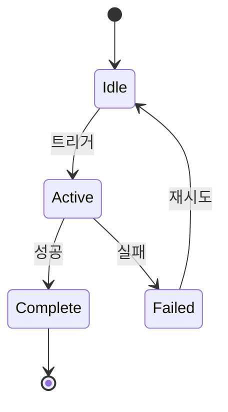

# [시스템명] ([System Name])

## 0. 필수 참고 자료 (Mandatory References)

* Project Overview: `Reference/게임 기획 개요.md`
* Writing Rules: `.claude/skills/metroidvania-gdd/references/writing-rules.md`
* [관련 시스템]: `[관련 문서 경로]`

---

## 구현 현황 (Implementation Status)

> 최근 업데이트: YYYY-MM-DD
> 문서 상태: `작성 중 (Draft)` / `진행 중 (Living)` / `완료 (Stable)`

| 기능 ID | 분류 | 기능명 (Feature Name) | 우선순위 | 구현 상태 | 비고 (Notes) |
| :--- | :--- | :--- | :---: | :--- | :--- |
| [PREFIX]-01-A | 시스템 | [기능명] | P1 | 작성 중 | [비고] |

---

### 적용 공간 (Applicable Space)

| 공간 | 적용 여부 | 비고 |
| :--- | :---: | :--- |
| World | O/X | [설명] |
| Item World | O/X | [설명] |
| Hub | O/X | [설명] |

---

## 1. 개요 (Concept)

### 의도 (Intent)

> [이 시스템이 존재하는 이유. "왜 이것을 만드는가?"]

### 근거 (Reasoning)

> [3대 기둥 중 어디에 기여하는가?]
> - Metroidvania 탐험: [관련성]
> - Item World 야리코미: [관련성]
> - Online 멀티플레이: [관련성]

### 저주받은 문제 점검 (Cursed Problem Check)

> [CP-1~CP-7 중 관련 딜레마 식별 및 트레이드오프 명시]
> - 관련 CP: CP-[N] ([문제명])
> - 이 설계의 선택: [어떤 축을 선택했는가]
> - 완화 전략: [트레이드오프를 어떻게 줄이는가]

### 위험과 보상 (Risk & Reward)

> 실패 시나리오: [이 시스템이 실패하면 어떤 문제가 생기는가]
> 성공 시나리오: [이 시스템이 성공하면 어떤 경험을 제공하는가]
> 피크 모먼트: [플레이어가 가장 짜릿함을 느끼는 순간]

---

## 2. 메커닉 (Mechanics)

### [메커닉 이름] ([Mechanic Name])

| 단계 | 설명 |
| :--- | :--- |
| Action | 플레이어가 [행동]을 한다 |
| Reaction | [시스템 반응]이 발생한다 |
| Effect | [최종 결과]가 적용된다 |

[공간: World / Item World / Hub]

### [추가 메커닉...]

---

## 3. 규칙 (Rules)

### 우선순위별 규칙 (Priority-ordered Rules)

P1:
- Condition: [조건]
- Process: [처리 과정]
- Result: [결과]

P2:
- Condition: [조건]
- Process: [처리 과정]
- Result: [결과]

### 게이트 조건 (Gate Conditions)

| 게이트 종류 | 조건 | 해제 방법 |
| :--- | :--- | :--- |
| 스탯 게이트 | [스탯] >= [값] | 레벨업/장비 |
| 능력 게이트 | [능력] 보유 | 보스 처치/이벤트 |
| 진행도 게이트 | [조건] 충족 | 퀘스트/스토리 |

---

## 4. 파라미터 (Parameters)

```yaml
# [시스템명] 핵심 파라미터
Parameter_Name_1: 0       # _[단위] [설명]
Parameter_Name_2: 0.0     # _[단위] [설명]
Parameter_Name_3: true    # [설명]
```

> SSoT: `[CSV 파일 경로]`

---

## 5. 예외 처리 (Edge Cases)

| # | 상황 | 처리 |
| :--- | :--- | :--- |
| EC-1 | 네트워크 지연 중 해당 액션 발생 | [처리 방법] |
| EC-2 | 동시 입력 (같은 프레임에 충돌하는 입력) | [처리 방법] |
| EC-3 | 관련 자원 부족 상태에서 시도 | [처리 방법] |
| EC-4 | [게임 특화 예외] | [처리 방법] |

---

## 시스템 흐름도 (System Flowchart)



## 상태 다이어그램 (State Diagram)



---

## 검증 기준 (Verification Checklist)

* [ ] 3대 기둥 중 최소 1개 정렬 확인
* [ ] 3-Space 분류 명시 확인
* [ ] Edge Case 최소 3개 기술
* [ ] YAML 파라미터 분리 (하드코딩 없음)
* [ ] Mermaid 다이어그램 최소 1개
* [ ] Action → Reaction → Effect 형식 준수
* [ ] Condition → Process → Result 형식 준수
