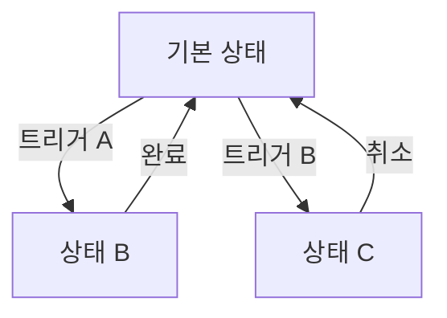

# [UI 시스템명] ([UI System Name])

## 0. 필수 참고 자료 (Mandatory References)

* Project Overview: `Reference/게임 기획 개요.md`
* Writing Rules: `.claude/skills/metroidvania-gdd/references/writing-rules.md`
* [관련 시스템]: `[경로]`

---

## 구현 현황 (Implementation Status)

> 최근 업데이트: YYYY-MM-DD
> 문서 상태: `작성 중 (Draft)` / `진행 중 (Living)` / `완료 (Stable)`

| 기능 ID | 분류 | 기능명 (Feature Name) | 우선순위 | 구현 상태 | 비고 (Notes) |
| :--- | :--- | :--- | :---: | :--- | :--- |
| UI-01-A | UI | [기능명] | P1 | 작성 중 | [비고] |

---

### 적용 공간 (Applicable Space)

| 공간 | 적용 여부 | 비고 |
| :--- | :---: | :--- |
| World | O/X | [설명] |
| Item World | O/X | [설명] |
| Hub | O/X | [설명] |

---

## 1. 개요 (Concept)

### 의도 (Intent)

> [이 UI가 존재하는 이유. 전달해야 할 핵심 정보]

### 설계 원칙

> - 정보 우선순위: [가장 중요한 정보 → 덜 중요한 정보]
> - 조작 환경: [PC/모바일/양쪽]
> - 참고 UI: [레퍼런스 게임의 유사 UI]

---

## 2. 화면 구성 (Screen Layout)

### 구성 요소 목록

| 요소 ID | 요소명 | 위치 | 데이터 소스 | 인터랙션 |
| :--- | :--- | :--- | :--- | :--- |
| E-01 | [요소명] | [위치 설명] | [바인딩 데이터] | [클릭/호버/드래그] |
| E-02 | [요소명] | [위치] | [데이터] | [인터랙션] |

### 레이아웃 설명

```
+------------------------------------------+
|  [헤더 영역]                              |
|------------------------------------------|
|  [좌측 패널]   |   [메인 콘텐츠]   | [우측] |
|                |                   |       |
|                |                   |       |
|------------------------------------------|
|  [하단 액션 바]                           |
+------------------------------------------+
```

---

## 3. 데이터 바인딩 (Data Binding)

| UI 요소 | 데이터 키 | 형식 | 갱신 주기 | 출처 |
| :--- | :--- | :--- | :--- | :--- |
| [요소명] | [Player.HP] | [정수/실수/텍스트] | [실시간/이벤트] | [서버/클라이언트] |

---

## 4. 상태별 UI 변화 (State Transitions)



### 상태 정의

| 상태 | 표시 요소 | 비활성 요소 | 진입 조건 |
| :--- | :--- | :--- | :--- |
| 기본 | [요소 목록] | [요소 목록] | - |
| [상태 B] | [요소 목록] | [요소 목록] | [조건] |

---

## 5. 인터랙션 플로우 (Interaction Flow)

### [핵심 플로우명]

1. 플레이어가 [행동]
2. UI가 [반응]
3. 확인/취소 선택
4. [결과 반영]

---

## 6. 예외 처리 (Edge Cases)

| # | 상황 | UI 표시 |
| :--- | :--- | :--- |
| EC-1 | 데이터 로딩 중 | [로딩 표시 방법] |
| EC-2 | 데이터 없음 (빈 목록) | [빈 상태 표시] |
| EC-3 | 네트워크 오류 | [에러 표시] |

---

## 검증 기준 (Verification Checklist)

* [ ] 화면 구성 요소 목록 완전
* [ ] 데이터 바인딩 명세
* [ ] 상태별 UI 변화 flowchart
* [ ] 인터랙션 플로우 정의
* [ ] 빈 상태/에러 상태 처리
* [ ] 3-Space 적용 범위 명시
