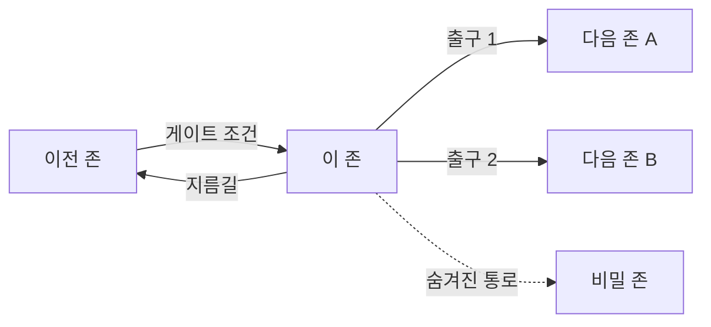
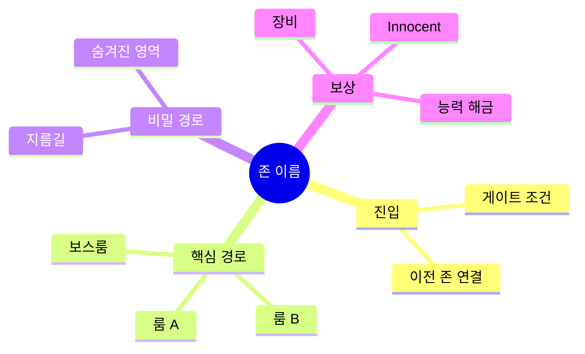

# [존/맵 이름] ([Zone/Map Name])

## 0. 필수 참고 자료 (Mandatory References)

* Project Overview: `Reference/게임 기획 개요.md`
* Writing Rules: `.claude/skills/metroidvania-gdd/references/writing-rules.md`
* Metroidvania Reference: `Reference/캐슬바니아 시스템 분석.md`
* [관련 문서]: `[경로]`

---

## 구현 현황 (Implementation Status)

> 최근 업데이트: YYYY-MM-DD
> 문서 상태: `작성 중 (Draft)` / `진행 중 (Living)` / `완료 (Stable)`

| 기능 ID | 분류 | 기능명 (Feature Name) | 우선순위 | 구현 상태 | 비고 (Notes) |
| :--- | :--- | :--- | :---: | :--- | :--- |
| WLD-01-A | 월드 | [기능명] | P1 | 작성 중 | [비고] |

---

### 적용 공간 (Applicable Space)

| 공간 | 적용 여부 | 비고 |
| :--- | :---: | :--- |
| World | O | 메인 적용 대상 |
| Item World | X | - |
| Hub | X | - |

---

## 1. 개요 (Concept)

### 의도 (Intent)

> [이 존이 존재하는 이유. 전체 월드에서의 역할]

### 근거 (Reasoning)

> [3대 기둥 중 어디에 기여하는가]
> - Metroidvania 탐험: [구체적 기여]
> - Item World 야리코미: [연동 포인트]
> - Online 멀티플레이: [협력/경쟁 요소]

### 저주받은 문제 점검 (Cursed Problem Check)

> CP-1 (게이트 좌절 vs 탐험 자유): [이 존에서의 균형점]

---

## 2. 존 정보 (Zone Information)

### 기본 정보

| 항목 | 값 |
| :--- | :--- |
| 존 코드 | [ZONE_CODE] |
| 테마 | [시각/분위기 테마] |
| 권장 레벨 | [Lv.X ~ Lv.Y] |
| 진입 조건 | [게이트 조건] |
| 인접 존 | [연결된 존 목록] |
| 크기 (룸 수) | [N개 룸] |

### 존 연결도 (Zone Connection Map)



---

## 3. 게이트 구조 (Gate Structure)

### 진입 게이트 (Entry Gates)

| 게이트 ID | 종류 | 조건 | 대체 조건 | 연결 |
| :--- | :--- | :--- | :--- | :--- |
| GATE-01 | 스탯 | STR >= [값] | 능력: [대체 능력] | [출발 존] → [이 존] |
| GATE-02 | 능력 | [능력명] 보유 | 스탯: [대체 스탯] | [위치] |

### 내부 게이트 (Internal Gates)

| 게이트 ID | 종류 | 조건 | 해제 시 접근 가능 영역 |
| :--- | :--- | :--- | :--- |
| IGATE-01 | 능력 | [능력] | [영역 설명] |

---

## 4. 룸 구성 (Room Layout)

### 핵심 룸 목록

| 룸 ID | 이름 | 유형 | 특수 요소 |
| :--- | :--- | :--- | :--- |
| R-01 | [룸 이름] | 전투/퍼즐/탐험/안전 | [특수 요소] |
| R-02 | [룸 이름] | [유형] | [특수 요소] |

### 숨겨진 영역 (Hidden Areas)

| 영역 | 발견 조건 | 보상 | 재방문 가치 |
| :--- | :--- | :--- | :--- |
| [영역명] | [조건] | [보상 내용] | [새 능력 획득 후 추가 보상] |

---

## 5. 몬스터 배치 (Monster Placement)

```yaml
# 존 몬스터 파라미터
Monster_Level_Min: 0          # _lv
Monster_Level_Max: 0          # _lv
Elite_Spawn_Rate: 0.0         # _%
Boss_Name: "[보스명]"
Boss_Location: "[룸 ID]"
```

> SSoT: `[몬스터 CSV 경로]`

---

## 6. 재방문 콘텐츠 (Revisit Content)

| 해금 능력/스탯 | 접근 가능 영역 | 새 보상 |
| :--- | :--- | :--- |
| [능력/스탯] | [영역] | [보상] |

---

## 존 구조 맵 (Zone Mindmap)



---

## 검증 기준 (Verification Checklist)

* [ ] 존 연결도 (graph LR) 다이어그램 포함
* [ ] 게이트 조건 명시 (최소 2가지 해제 방법)
* [ ] 재방문 콘텐츠 정의
* [ ] 숨겨진 영역 최소 1개
* [ ] 몬스터 배치 파라미터 YAML
* [ ] 3대 기둥 정렬 확인
