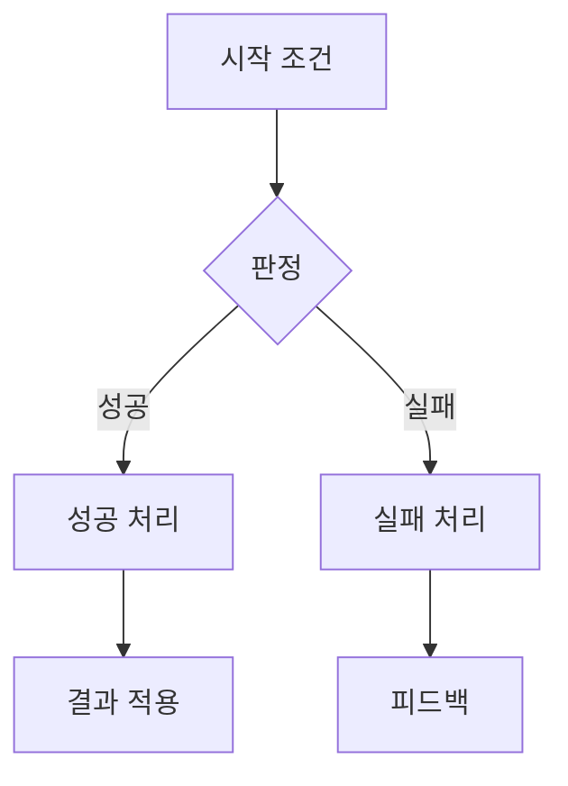
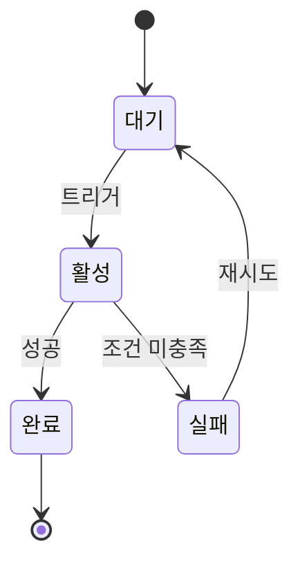
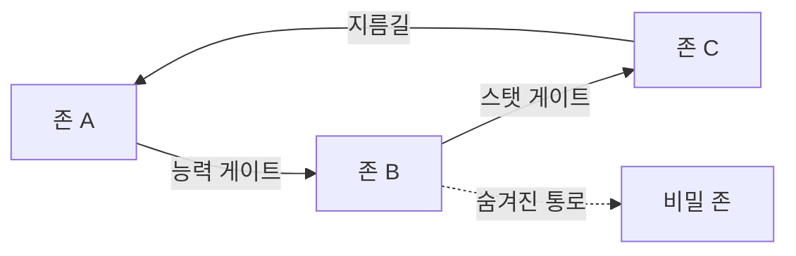
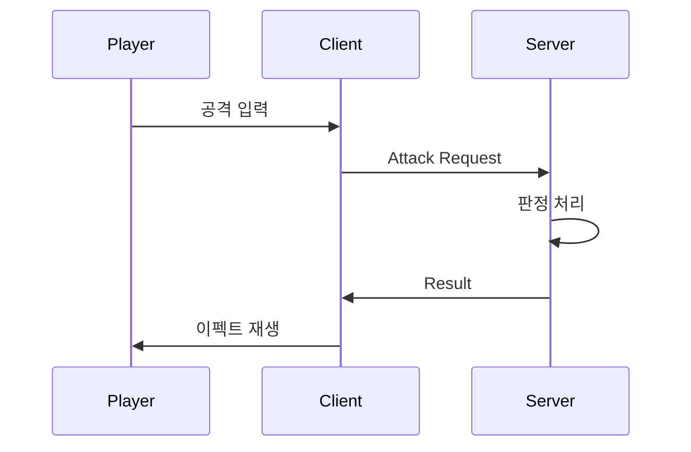
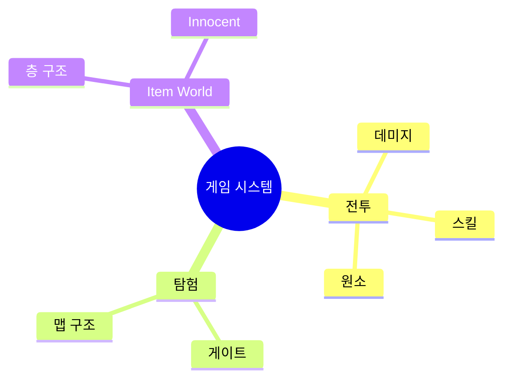
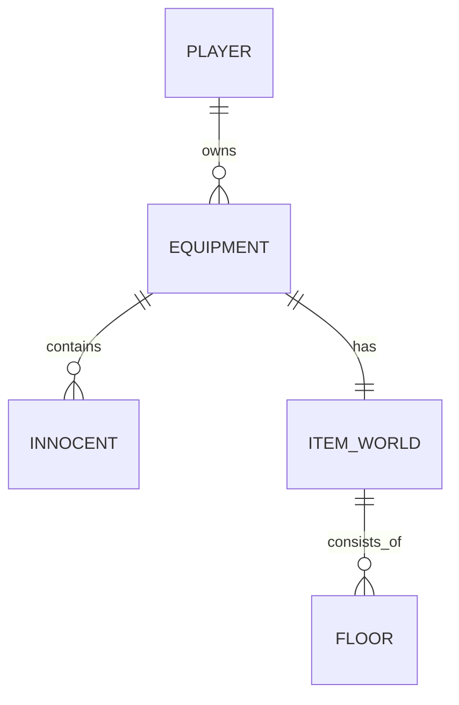
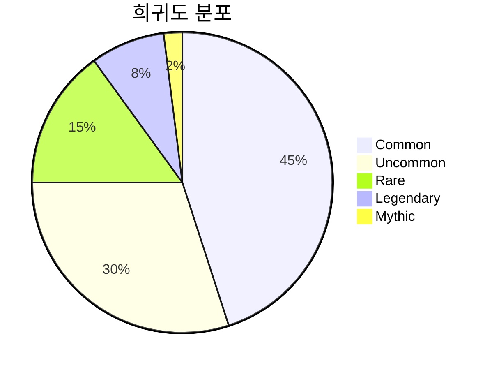

# Mermaid 다이어그램 가이드 (Mermaid Diagram Guide)

## 1. 문서 유형별 필수/권장 다이어그램

| 문서 유형 | 필수 다이어그램 | 권장 다이어그램 |
| :--- | :--- | :--- |
| SYS (시스템) | flowchart TD, stateDiagram-v2 | sequenceDiagram, graph LR |
| WLD (월드) | graph LR (존 연결도) | mindmap |
| IW (아이템월드) | flowchart TD (층 진행) | sequenceDiagram |
| BAL (밸런스) | - (테이블로 대체 가능) | graph LR (수식 관계도) |
| MP (멀티플레이) | sequenceDiagram | flowchart TD |
| CNT (콘텐츠) | pie (분포도) | erDiagram |
| UI | flowchart TD (상태 전이) | - |
| GDD (범용) | flowchart TD | - |

---

## 2. 다이어그램 유형별 작성 규칙

### flowchart TD (상하 흐름도)

용도: 시스템 로직 흐름, 상태 전이, 진행 순서

규칙:
- 노드 수: 최대 15개
- 분기: 최대 3단계 깊이
- 한글 라벨 사용 (영문 병기 가능)
- 시작/종료 노드 명확

### stateDiagram-v2 (상태 다이어그램)

용도: 객체/시스템의 상태 변화

규칙:
- 상태 수: 최대 10개
- 전이 조건을 간결하게 기술
- [*]로 시작/종료 표시

### graph LR (좌우 관계도)

용도: 존 연결, 시스템 관계, 데이터 흐름

규칙:
- 노드 수: 최대 20개
- 점선(-.->)은 약한 관계 또는 조건부 연결
- 실선(-->)은 강한 관계 또는 필수 연결

### sequenceDiagram (시퀀스 다이어그램)

용도: 클라이언트-서버 통신, 시간 순서 상호작용

규칙:
- 참여자(participant): 최대 5개
- 메시지: 간결한 동사형
- 비동기는 ->>>, 동기는 ->>

### mindmap (마인드맵)

용도: 존 구조, 시스템 개요, 기능 분류

규칙:
- 깊이: 최대 4단계
- 가지 수: 단계당 최대 5개

### erDiagram (ER 다이어그램)

용도: 데이터 구조, 엔티티 관계

규칙:
- 엔티티: 최대 10개
- 관계 표기: ||--o{ (1:N), ||--|| (1:1)

### pie (파이 차트)

용도: 분포, 비율 시각화

규칙:
- 항목: 최대 7개
- 퍼센트 합계: 100

---

## 3. 공통 규칙

- 한글 라벨 사용 (필요 시 영문 병기)
- 다이어그램 위에 제목 헤더 필수 (`### 다이어그램 이름`)
- 복잡도 제한: 한 다이어그램에 노드 20개 초과 시 분할
- 범례(Legend): 색상/스타일 구분이 있으면 범례 추가
- 배치: 관련 텍스트 바로 아래에 배치

---

## 4. 색상 코딩 (classDef)

| 클래스 | 용도 | 색상 |
| :--- | :--- | :--- |
| success | 성공/완료/활성 | 녹색 |
| danger | 실패/에러/금지 | 빨간색 |
| info | 정보/참고 | 파란색 |
| warning | 경고/주의/조건부 | 노란색 |
