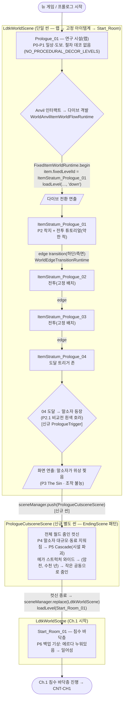

# ECHORIS — Ch.0 프롤로그 (Prologue)

> **준거 상위 (Authority):** T-03, D-20, CNT-PROG, CNT-STR-001
> **문서 ID:** CNT-CH0
> **작성:** 2026-06-03 (CNT-EXP-001 §0막 흡수)
> **위상:** 진행 마스터(CNT-PROG) Ch.0 의 상세 비트시트. 구조 권위는 CNT-PROG, 서사 권위는 시놉시스 v3.2.
> **분량:** 약 5분. 플레이 가능 콜드 오픈(Half-Life 구조).

---

## 0. 목적

프롤로그는 한 번에 네 가지를 세운다.

1. 빌더·말소자·메가 스트럭처의 **기원**(Cascade).
2. 에르다가 왜 **미등재 백업 아웃사이더**인지.
3. 동료 중 일부가 왜 **에코**가 되었는지(러스트본 시드).
4. **시그니처 메카닉(다이브)** 을 첫 5분에 플레이로 노출.

진짜 원인은 끝내 불가지로 둔다(불가지 보존 — 응답 없는 고독).

### 비목표

- 세계관 설명 금지. 실험의 목적을 길게 설명하지 않는다 — 일상으로 보여준다.
- 다이브 루프 완주 금지 — 말소자 호러로 찢기며, 완전한 강화·귀환 루프는 본편 Ch.1 [7] 첫 진짜 다이브로 아낀다.

---

> **구현 플로우차트는 §8 참조** (씬·레벨·트리거 단위).

## 1. 비트 시퀀스

> Half-Life 콜드 오픈: 재앙 전 짧은 플레이 가능 구간 → 재앙 → 먼 미래 깨어남. 시간 라벨은 참고용(구조 권위는 CNT-PROG).

**P0 (~0:20) — 평온·낯섦**
- 시각: 검은 화면 → 연구 시설 내부가 밝아온다. 깨끗한 흰 벽, 단정한 장비(메가 스트럭처 이전의 세계 — 처음이자 마지막으로 보이는 "정상" 공간).
- 사운드: 낮은 기계 험, 일상 소음.
- 메커닉·목표: 입력 대기 → 도보 시작. 시설 안을 걷는다.

**P1 일상 (~1:00) — 정·소속**
- 시각: 동료들이 실험 준비. 에르다가 사이를 지난다. 3명 차등 각인 — 러스트본(강, 알아보고 짧고 따뜻한 농담), 이리(중, 진입 두려움 스침), 이름 없는 동료(약, 등만).
- 사운드: 동료 대화 단편(내용 불명, 톤만).
- 메커닉·목표: 도보. 러스트본 1회 인터랙트, 이리 1회 스침 → 진입 장치까지 이동.

**P2 진입 — 플레이 가능 다이브 (~3:00) — 기대·긴장·첫 전투**
- 시각: 진입 장치 가동 → 다이브 전환 연출 → 한 무기의 에코 1지층 착지.
- 사운드: 가동음 → 다이브 전환음 → 위상 앰비언스.
- 메커닉·목표: 장치 조작 → 간단 전투 튜토리얼(이동·점프·검 콤보·회피, 약한 적 1-2체). 1지층 진행.

**P2.1 말소자 첫 등장 (~3:30) — 불가해·압도**
- 시각: 말소자가 처음 모습을 드러낸다 — 흰색 언캐니 인간형 호러(비교전 위협). 교전 성립 안 함. 특정 이벤트 희귀 등장.
- 사운드: 불쾌한 정적/저주파, 시공 굉음 전조.
- 메커닉·목표: 위협 관찰(전투 없음).

**P3 The Sin / 아웃 (~4:00) — 불가해·무력**
- 시각: 말소자가 위상을 찢는다(격파 불가 무증오 절멸) + 연구 시설 파괴 = Cascade. 에르다 아웃. 플레이어 수행과 무관한 외부 사건(패배 아님). 화면 가장자리 왜곡, 경보.
- 사운드: 경보, 왜곡된 저주파, 굉음 진입.
- 메커닉: 조작 불능(연출).

**P4 말소자 (~4:40) — 공포·무력**
- 시각: 말소자 대규모 출몰. 첫 말소자 노출 — 형체를 온전히 보여주지 않는다(이해 불가능성·고독). 동료들이 차례로 지워진다. 러스트본이 에르다 쪽으로 손을 뻗는다.
- 사운드: 굉음 진입(이후 작품의 기본 사운드스케이프가 될 시공 굉음의 첫 등장).
- 메커닉·목표: 도주 도보(전투 불가, 회피만). 출구로 달린다.

**P5 붕괴 (~5:00) — 상실**
- 시각: 본부 파괴 = Cascade 시작. 러스트본이 지워지는 마지막 순간, 그의 의식이 한 무기로 빨려든다(시각 암시만 — 그 무기가 P6 에서 에르다 손에 쥐어진 검). 다른 동료들도 제각기 다른 무기·잔해로 흩어져 빨려든다(흩어진 에코 서브라인 시드). 에르다 원본도 휩쓸린다.
- 사운드: 굉음 절정 → 급정적.

**(암전)**
- 검은 화면. 텍스트 없음. 시공 굉음만 아주 멀리, 점점 작아지며 — 수천 년이 흐른다. 굉음 페이드 → 무음.

**P6 복원 → Ch.1 — 혼란·고립**
- 시각: 백업 복원. 시체 더미(자기 이전 복원 잔해) 위에서 깨어남. UI 한 줄 "백업 복원 완료." 손에 검 한 자루.
- 사운드: 멀리 시공 굉음 재등장(이제 세계의 상수).
- 메커닉·목표: 첫 입력 가능. 일어선다. → **CNT-CH1** 로 연결.

---

## 2. 설계 노트

- **각인의 경제성:** 2-3분 안에 동료 전체를 알릴 수 없다. 3명만 차등 각인 — 러스트본(강, 따뜻한 상호작용 + 손 뻗기), 이리(중, 진입 두려움 스침), 이름 없는 동료(약, 등만). 본편 Ch.1 [7]에서 러스트본 "그 동료였구나" 재인지가 작동.
- **흩어진 실험 팀 에코 서브라인:** P5에서 동료 의식이 제각기 다른 무기로 흩어진다. 본편 다이브 일부 에코 = 그 동료들. 러스트본(시작 검) → 이리(Ch.4 낯선 검, 등재의 길을 택한 backup) → 이름 없는 동료(중반 다이브)로 점진 재회. "나 혼자만 깨어난 게 아니었다." 정보 덤프 없이 환경 단서·검 음성으로만(신파 차단 #4).
- **이리 정합:** 이리 = 같은 실험 팀 동료의 backup. 에르다처럼 복원되었으나 등재의 길을 택함(거울 동료). P1의 "진입을 두려워하던 동료"가 그 씨앗.
- **말소자 첫 노출 = 불가지·고독 원칙:** 형체를 다 보여주지 않는다. 절멸의 무감정·불가해함만. 말소자는 이후에도 희귀·특정 이벤트로만 등장 — 일반 몬스터(드론, 평범한 환경 생물)와 별개 (DEC-044).
- **신파 차단:** 동료들의 죽음에 lament BGM 금지. 굉음과 급정적만. 러스트본 손 뻗기는 클로즈업 금지 — 와이드로.
- **진짜 원인 불가지:** P3의 "정체불명의 무언가"는 끝내 설명되지 않는다(Cascade 절충, 불가지 보존 — 응답 없는 고독).
- **조작 학습:** P0~P1 이동·인터랙트, P2 다이브에서 코어 전투(검 콤보·회피, 약한 적)를 첫 학습. 시그니처 메카닉(다이브)과 전투를 첫 5분에 노출(Metroid "맛보기"/Bloodstained 샤드 원칙). 말소자는 비교전 호러이므로 좌절 리스크 0. 본편 Ch.1의 전투는 *재학습*이 아니라 백업 복원 후 무력 상태의 재맥락화.
- **아웃의 외부화(가이드 §1.2 #3):** "선택의 결과 부재" 함정은 자연 해소 — 플레이어는 말소자와 교전하지 않는다. 초반 약한 적 전투는 정상 결과를 갖고, 말소자의 절멸은 분리된 외부 불가지 사건(패배 아님). "내가 진 게 아니다"가 명확.

---

## 3. 메커닉 도입 (Ch.0)

| 순서 | 메커닉 | 비고 |
| :--- | :--- | :--- |
| 1 | 이동·도보 | P0~P1 |
| 2 | 인터랙트 | P1 (러스트본/장치) |
| 3 | 다이브(전환) | P2 진입 장치 격발 |
| 4 | 코어 전투 (검 콤보·회피) | P2 약한 적 1-2체 |
| 5 | 회피 도주 | P4 (말소자, 전투 불가) |

---

## 4. 감독 노트 (Ch.0)

- **카메라:** P1 도보 = 일반 횡스크롤. P4~P5 = 와이드(러스트본 손 뻗기 클로즈업 금지). P6 깨어남 = 1인칭 가까운 3인칭.
- **사운드:** 시공 굉음의 *첫 등장*이 P4. 이후 작품 전체의 기본 사운드스케이프가 됨. 동료 죽음에 lament 금지.
- **비주얼:** P0~P1 연구 시설 = 처음이자 마지막 "정상"(깨끗한 흰 벽) — 본편의 회색·청색 메가 스트럭처와 강한 대비. 말소자 = 흰색 언캐니(Design_Art_Direction §14.4).
- **UI:** P6 "백업 복원 완료" 한 줄 외 UI 부재(에르다 자기 부재 정합).

---

## 5. 종료 → Ch.1 연결

P6 백업 기상 = Ch.1 (침수 바닥층) 의 오프닝. 손에 쥔 검 = 러스트본 에코가 든 시작 검. CNT-CH1 으로 이어진다.

---

## 6. 검증 (Ch.0)

| 항목 | 결과 |
| :--- | :--- |
| 시놉시스 v3.2 정합 | PASS — 프롤로그 0막 P-1~P-6, 말소자 단일 호러 이벤트 |
| DEC-043 정합 | PASS — 플레이 가능 다이브 + 말소자 호러로 아웃 |
| DEC-044 정합 | PASS — P2 약한 적 = 드론(말소자 아님), P2.1 말소자 = 흰색 호러 |
| Bad Writing 회피 | PASS — 정보 덤프 없음, 일상→재앙 show, 아웃 외부화 |
| 고독·불가지 4원칙 | PASS — 불가지·무력·점진 노출·응답의 부재 |

---

## 7. 차기 작업

1. 말소자 흰색 언캐니 32px 스프라이트 (Design_Art_Direction §14.4 사양).
2. P2 다이브 위상 1지층 레벨(약한 적 배치 + 출구).
3. P2.1~P3 말소자 등장·위상 찢기 연출 사양(정적·사운드 부재·왜곡).
4. P5 동료 에코 산란 연출(흩어진 에코 서브라인 시드).

---

## 8. 구현 플로우차트 (씬·레벨)

> 코드 실측 기반(2026-06-04). 랩·고정 아이템계·Start_Room 은 모두 `LdtkWorldScene` 안의 LDtk 레벨이며 **절차 생성 없이 직접 로드**된다(`WorldFixedItemWorldFlowRuntime` → `loadLevel`). 컷신만 별도 씬.

### 8.1 흐름도

### 8.2 노드 상세

| 노드 | 씬 | LDtk 레벨 | 진입 트리거 | 렌더 | CNT-CH0 비트 | 신규/기존 |
| :--- | :--- | :--- | :--- | :--- | :--- | :--- |
| 랩 | LdtkWorldScene | `Prologue_01` | 뉴 게임 | 핸드크래프트, 절차 데코 없음 | P0-P1 | 기존(레벨 존재) |
| 다이브 격발 | LdtkWorldScene | — | Anvil 인터랙트 | 다이브 전환 연출 | P2 진입 | 기존(Anvil·Fixed flow) |
| 1지층 | LdtkWorldScene | `ItemStratum_Prologue_01` | `fixedLevelId` 로드 | 고정 레벨 직접 로드, **랜덤 없음** | P2 전투 | 기존(레벨 존재) |
| 2-3지층 | LdtkWorldScene | `ItemStratum_Prologue_02/03` | edge transition | 고정 배치 그대로 | P2 전투 | 기존(레벨 존재) |
| 4지층 | LdtkWorldScene | `ItemStratum_Prologue_04` | edge transition | 고정 배치 + 도달 트리거 존 | P2.1 직전 | 기존 레벨 + **신규 트리거** |
| 말소자 등장 | LdtkWorldScene | `ItemStratum_Prologue_04` | 04 도달 트리거 | 흰색 언캐니 호러 스폰(비교전) | P2.1 | **신규** |
| 위상 찢김 | LdtkWorldScene | — | 말소자 연출 종료 | 화면 왜곡·조작 불능 | P3 | **신규 연출** |
| 줌인 컷신 | **PrologueCutsceneScene** | — | push (씬 전환) | 월드 와이드 → 줌인, Cascade | P4-P5 + 암전 | **신규 씬** |
| 기상 | LdtkWorldScene | `Start_Room_01` | 컷신 종료 → replace+loadLevel | 에르다 누워있음 → 일어섬 | P6 | 기존 레벨 + **신규 기상 상태** |

### 8.3 신규 제작 항목

1. **PrologueTrigger (04 도달):** `ItemStratum_Prologue_04` 에 LDtk 트리거 존 1개. 진입 시 (a) 일반 출구/edge 비활성, (b) 말소자 스폰, (c) 비교전 위협 시퀀스 시작. (참조: 기존 `WorldDialogueTriggerRuntime`/`WorldBossLockRuntime` 패턴.)
2. **말소자 스폰 + 위협 연출(P2.1~P3):** 비교전. 흰색 언캐니 호러 등장(`Design_Art_Direction §14.4`) → 위상 찢김 화면 연출(왜곡·조작 불능). 전투 AI 불필요.
3. **PrologueCutsceneScene (신규 씬):** `EndingScene` 을 패턴 모델로. 전체 월드 와이드 → 줌인(메가 스트럭처 형성·Cascade) → 암전(수천 년) → 작은 공동으로 줌인. 종료 시 `sceneManager.replace(new LdtkWorldScene(...))` + `loadLevel('Start_Room_01')`. (줌 기법은 기존 `ItemWorldGrowthSnapshotController` 의 RenderTexture 캡처+스케일 재사용 가능.)
4. **Start_Room_01 기상 상태:** 에르다 누워있는 스폰 포즈 → 첫 입력 시 일어섬(P6). 옵션 B 사운드 콜드 오픈(검 속 러스트본 잔향 "에르다...") 동반.

### 8.4 LDtk 오서링 요구사항

- `ItemStratum_Prologue_01→02→03→04` 는 ItemStratum 월드에서 **edge transition 으로 연결되도록 인접 배치**(또는 각 레벨 출구가 다음 레벨로 연결). 4지층은 **단방향**(되돌아가기 차단) 권장 — Cascade 직전 긴장.
- 4지층에 PrologueTrigger 존 + 말소자 스폰 포인트 1개.
- `Prologue_01` 에 Anvil 엔티티 1개(기존). 다이브 아이템의 `fixedLevelId = ItemStratum_Prologue_01`.

### 8.5 미해결 / 확인 필요

- **01→04 이동 방식:** edge transition(인접 레벨) 가정. trapdoor/portal 중첩 방식을 원하면 변경 — 현재 fixed flow 는 단일 레벨 진입만 검증됨(다지층 fixed 연쇄는 신규 검증 필요).
- **컷신 "줌인" 대상:** 메가 스트럭처 와이드에서 *작은 공동(Start_Room)* 으로 줌인 = Opening 옵션 C 의 시네마틱. 와이드 소스 아트 필요(또는 절차 합성).
- **씬 전환 방식:** 컷신 → Start_Room 은 `replace`(LdtkWorldScene 재생성) vs 동일 씬 내 `loadLevel`. 백업 기상이 새 게임 상태이므로 `replace` 권장.
