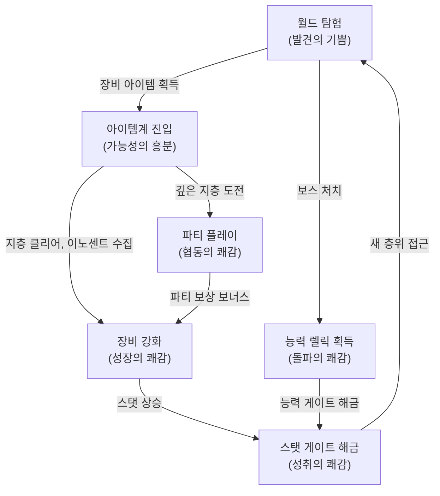
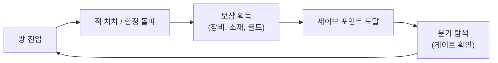

# Core Loop Design: 순환 구조 설계 철학 (D-02)

## 0. 필수 참고 자료 (Mandatory References)

* Project Vision: `Documents/Terms/Project_Vision_Abyss.md`
* Writing Standards: `Documents/Terms/GDD_Writing_Rules.md`
* Glossary: `Documents/Terms/Glossary.md`
* Game Overview: `Reference/게임 기획 개요.md`
* GDD Roles: `Documents/Terms/GDD_Roles.md`
* 3-Space Architecture (D-01): `Documents/Design/Design_Architecture_3Space.md`
* 디스가이아 시스템 분석: `Reference/디스가이아 시스템 분석.md`
* 캐슬바니아 시스템 분석: `Reference/캐슬바니아 시스템 분석.md`
* 아이템계 역기획서: `Reference/Disgaea_ItemWorld_Reverse_GDD.md`
* 메트로베니아 디자인 심층 분석: `Reference/Metroidvania Game Design Deep Dive.md`

---

## 1. 개요 (Overview)

### 1-1. 문서 목적

본 문서는 Project Abyss의 핵심 순환 구조(Core Loop)가 어떤 철학 위에 설계되었는지를 정의한다. 순환의 각 고리가 플레이어에게 부여해야 할 감정, 순환이 끊기지 않기 위한 원칙, 그리고 세션 길이에 따른 순환 경로를 다룬다.

### 1-2. 한 줄 요약

> "탐험하면 아이템이 쏟아지고, 아이템을 키우면 새로운 세계가 열린다. 이 순환이 멈추지 않는 한, 플레이어는 떠나지 않는다."

### 1-3. 3대 기둥 정렬

| 기둥 | Core Loop에서의 역할 |
| :--- | :--- |
| 메트로베니아 탐험 | 순환의 시작점이자 종착점. 새 층위 탐험이 순환을 기동시키고, 강화된 장비로 돌아오는 것이 순환을 완성한다 |
| 아이템계 야리코미 | 순환의 엔진. 아이템계에서의 강화 활동이 다음 탐험을 가능하게 하는 동력을 생산한다 |
| 온라인 멀티플레이 | 순환의 가속기. 파티 플레이가 아이템계 깊은 지층 공략을 현실적으로 만들어 순환 속도를 높인다 |

---

## 2. 설계 의도 (Design Intent)

### 2-1. 분해 (Deconstruct)

| 참고 게임 | 재미 요소 |
| :--- | :--- |
| 월하의 야상곡 | 능력 획득 후 이전에 갈 수 없던 층위에 도달하는 순간의 쾌감 |
| 디스가이아 | 아이템계 모든 지층을 돌파하며 장비가 점진적으로 강해지는 야리코미 만족감 |
| 디아블로 시리즈 | 더 좋은 장비를 위해 더 높은 난이도에 도전하는 파밍 루프 |

### 2-2. 분석 (Analyze)

세 게임의 순환 구조가 성공하는 이유는 동일하다. 플레이어가 현재 순환 고리에서 획득한 보상이 다음 순환 고리의 진입 조건이 된다는 점이다. 월하의 야상곡에서 능력은 다음 층위의 열쇠이고, 디스가이아에서 아이템 레벨은 더 깊은 지층의 생존 조건이며, 디아블로에서 장비는 더 높은 토먼트의 입장권이다.

핵심 본질: 보상이 곧 다음 도전의 자격이 되는 구조. 보상이 단순한 숫자 증가에 그치면 순환이 무의미해지고, 보상이 질적으로 새로운 경험을 열어야 순환이 지속된다.

### 2-3. 재구축 (Rebuild)

Project Abyss는 이 본질을 이중 게이트(능력 게이트 + 스탯 게이트)로 재구축한다.

| 기존 방식 | Project Abyss의 독창적 변형 |
| :--- | :--- |
| 능력 게이트만 존재 (순수 메트로베니아) | 능력 게이트 + 스탯 게이트 이중 구조. 탐험만으로는 모든 곳에 갈 수 없고, 아이템계에서 장비를 강화해야 한다 |
| 아이템 강화가 자기 완결적 (순수 야리코미) | 아이템계에서 강화한 장비가 월드의 스탯 게이트를 해금. 강화의 목적이 외부(월드)에 존재한다 |
| 파밍과 탐험이 같은 공간 (디아블로) | 3-Space 분리로 파밍(아이템계)과 탐험(월드)의 감정을 분리하여 각각의 순수한 재미를 보존한다 |

---

## 3. 대순환: 전체 그림 (Macro Loop)

### 3-1. 대순환 다이어그램



### 3-2. 대순환의 5단계

| 단계 | 행위 | 공간 | 획득물 | 다음 단계로의 연결 |
| :--- | :--- | :--- | :--- | :--- |
| 1. 탐험 | 미지의 층위를 돌아다니며 맵을 밝힌다 | World | 장비 아이템, 월드 소재 | 획득한 장비가 아이템계 진입의 소재가 된다 |
| 2. 진입 | 획득한 장비의 아이템계에 들어간다 | Item World | 아이템 EXP, 이노센트 | 지층 클리어가 장비 강화로 이어진다 |
| 3. 강화 | 지층을 클리어하고 이노센트를 수집한다 | Item World | 스탯 상승, 이노센트 복종 | 장비 스탯이 스탯 게이트 임계값에 도달한다 |
| 4. 해금 | 강화된 스탯으로 게이트를 통과한다 | World | 새 층위 접근권 | 새 층위에서 더 높은 등급의 아이템이 나온다 |
| 5. 재탐험 | 더 넓은 세계를 탐험한다 | World | 더 높은 레어리티 장비 | 1단계로 복귀. 더 깊은 아이템계가 열린다 |

### 3-3. 대순환의 핵심 법칙

> **설계 원칙:** 순환의 매 고리는 반드시 다음 고리의 진입 조건을 생산해야 한다. 어느 고리든 다음 고리로의 동기가 사라지면 순환이 정지한다.

검증 방법: 순환의 각 전환점에서 "왜 플레이어가 다음 단계로 이동하는가?"를 답할 수 없으면 설계에 결함이 있다.

| 전환점 | 동기 질문 | 정답 |
| :--- | :--- | :--- |
| 탐험 -> 아이템계 | 왜 아이템계에 들어가는가? | 획득한 장비를 강화하지 않으면 다음 스탯 게이트를 통과할 수 없기 때문 |
| 아이템계 -> 월드 | 왜 아이템계에서 나오는가? | 강화된 스탯으로 해금되는 새 층위가 있고, 그곳에 더 좋은 장비가 있기 때문 |
| 월드 -> 허브 | 왜 허브에 가는가? | 이노센트 합성, 장비 정리, 파티 매칭 등 준비를 하면 다음 순환이 효율적이기 때문 |

---

## 4. 소순환: 공간별 내부 루프 (Micro Loop)

각 공간은 대순환과 별개로 자체적인 미니 루프를 가진다. 이 소순환이 해당 공간 내에서의 지속적 플레이 동기를 제공한다.

### 4-1. 월드 소순환



| 소순환 요소 | 감정 | 리스크 | 리턴 |
| :--- | :--- | :--- | :--- |
| 방 진입 | 긴장, 호기심 | 미지의 적 배치 | 새로운 공간 발견 |
| 적 처치 | 집중, 타격 쾌감 | 사망 시 세이브 포인트 복귀 | 골드, 소재 드랍 |
| 분기 탐색 | 기대, 아쉬움 | 시간 투자 | 숨겨진 방, 숏컷, 게이트 너머의 보상 |

### 4-2. 아이템계 소순환


| 소순환 요소 | 감정 | 리스크 | 리턴 |
| :--- | :--- | :--- | :--- |
| 지층 진입 | 집중, 긴장 | 전멸 시 진행 손실 | 아이템 EXP 누적 |
| 이노센트 조우 | 흥분, 기대 | 야생 이노센트는 강력한 적 | 복종 시 스탯 보너스 2배 |
| 탈출 판단 | 고민, 욕심 vs 안전 | 더 가면 보상이 크지만 전멸 위험 | Mr. Gency's Exit 사용 여부 |

아이템계 소순환의 핵심은 "더 가느냐, 여기서 탈출하느냐"의 리스크-리턴 판단이다. 이 판단이 각 지층의 보스를 처치할 때마다 반복되며, 야리코미의 긴장감을 유지한다.

### 4-3. 허브 소순환


허브 소순환은 전투가 없는 준비와 사교의 공간이다. 허브에서 보내는 시간이 다음 순환의 효율을 높이므로, 허브 방문 자체가 순환의 일부로 기능한다.

---

## 5. 순환 고리별 감정 설계 (Emotional Design)

### 5-1. 감정 순환 맵

각 순환 전환점에서 플레이어가 느껴야 할 감정을 정의한다. 이 감정이 다음 고리로의 동기가 된다.

| 전환 | 목표 감정 | 감정의 핵심 | 유도 메커니즘 |
| :--- | :--- | :--- | :--- |
| 탐험 -> 획득 | 발견의 기쁨 | "이런 곳에 이런 게 있었다니!" | 숨겨진 보물상자, 비밀 방, 레어 드랍 연출 |
| 획득 -> 강화 | 가능성의 흥분 | "이 아이템을 어디까지 키울 수 있을까?" | 아이템계 미리보기(지층 수, 보스 정보), 이노센트 슬롯 확인 |
| 강화 -> 해금 | 성취의 쾌감 | "드디어 그 벽을 넘었다!" | 스탯 게이트 해금 연출(봉인 해제 이펙트, 전용 SFX) |
| 해금 -> 탐험 | 새로운 시작 | "저 너머에 뭐가 있을까?" | 새 층위 진입 시 맵 안개 해제, 새 BGM 전환, 미지의 풍경 노출 |

### 5-2. 감정 곡선 (Emotional Curve)

하나의 대순환을 완주했을 때의 감정 흐름:

```
[허브: 안도/준비]
    |
    v
[월드 입구: 기대/긴장] --> [탐험: 호기심] --> [보스 조우: 스릴]
    |
    v
[보스 처치: 성취] --> [아이템 확인: 흥분] --> [아이템계 진입: 집중]
    |
    v
[지층 클리어 반복: 몰입] --> [깊은 지층: 긴장/위기] --> [탈출 판단: 고민]
    |
    v
[성과 확정: 만족] --> [스탯 게이트 해금: 쾌감] --> [새 층위 진입: 경이]
    |
    v
[허브 복귀: 안도/자랑] --> 다음 순환
```

### 5-3. 감정 설계 원칙

> **설계 원칙:** 연속된 두 감정은 반드시 대비(Contrast)를 이루어야 한다. 긴장 뒤에는 안도가, 집중 뒤에는 흥분이 와야 한다. 동일한 감정이 연속되면 감각이 둔화된다.

| 원칙 | 적용 |
| :--- | :--- |
| 긴장-안도 대비 | 보스전(긴장) 직후 세이브 포인트와 보상 연출(안도) |
| 반복-돌파 대비 | 아이템계 지층 클리어 반복(루틴) 중 이노센트 조우(돌발) |
| 고독-사교 대비 | 월드 솔로 탐험(고독) 후 허브 복귀(사교) |

---

## 6. 순환 안티패턴과 해결책 (Anti-Patterns & Solutions)

순환이 끊기는 대표적인 상황과 그 해결책을 정의한다.

### 6-1. 스탯 게이트 벽에 부딪힘

| 항목 | 내용 |
| :--- | :--- |
| 증상 | 다음 층위의 스탯 게이트 임계값에 한참 미달. 월드에서 할 수 있는 것이 없다고 느낌 |
| 원인 | 스탯 게이트 임계값과 현재 층위에서 획득 가능한 장비의 잠재력 사이 간극이 과도함 |
| 해결책 | 아이템계로의 유도. HUD에 "이 장비를 아이템계에서 강화하면 게이트를 해금할 수 있습니다" 안내 표시. 현재 보유 장비의 아이템계 진입이 스탯 게이트 해금의 최단 경로가 되도록 수치 설계 |
| 검증 기준 | 현재 층위 최고 등급 장비의 아이템계를 적정 지층까지 클리어하면 다음 스탯 게이트를 통과할 수 있어야 한다 |

### 6-2. 아이템계 고착 (아이템계만 도는 상태)

| 항목 | 내용 |
| :--- | :--- |
| 증상 | 아이템계의 파밍 루프가 자기 완결적이 되어 월드로 돌아갈 이유가 없음 |
| 원인 | 아이템계 내부 보상만으로 충분히 강해지며, 월드 탐험의 보상이 매력적이지 않음 |
| 해결책 | 월드 전용 보상 설계. 능력 렐릭은 월드에서만 획득 가능하고, 능력 게이트 너머의 아이템계 진입 소재(고급 장비)는 월드에서만 드랍된다. 아이템계의 특정 지층 이상 진입에 월드 소재가 필요한 잠금 장치를 설정한다 |
| 검증 기준 | 아이템계만으로는 달성 불가능한 목표(능력 게이트 해금, 특정 레어리티 장비 획득)가 존재해야 한다 |

### 6-3. 성장 정체감

| 항목 | 내용 |
| :--- | :--- |
| 증상 | 장비가 이미 충분히 강하고, 더 강화해도 체감 차이가 미미함 |
| 원인 | 성장 곡선의 수확 체감(Diminishing Returns)이 과도하거나, 새로운 목표가 보이지 않음 |
| 해결책 | 더 높은 레어리티 장비 획득과 이노센트 최적화로 제2의 성장 곡선 제공. 새로운 아이템계 지층 도전과 이노센트 합성으로 기존 장비를 넘어서는 성장 경로를 제시한다. 레어리티 승급에 따른 외형 변화(아우라, 이펙트)를 부여하여 시각적 성취감을 제공한다 |
| 검증 기준 | 최고 레벨 장비에도 이노센트 최적화와 레어리티 승급을 통한 추가 성장 여지가 남아있어야 한다 |

### 6-4. 멀티플레이 접근 장벽

| 항목 | 내용 |
| :--- | :--- |
| 증상 | 깊은 지층 아이템계는 파티가 필요하지만, 파티를 구하기 어려움 |
| 원인 | 매칭 풀 부족, 레벨/장비 격차로 인한 거부 |
| 해결책 | 아이템계 자동 매칭 시스템 + NPC 동료 시스템. 매칭이 안 되면 AI 동료로 파티를 채워 솔로 진행이 가능하도록 한다. "혼자서도 재미있고 함께하면 더 재미있다" 원칙 적용 |
| 검증 기준 | 솔로 플레이어도 아이템계 모든 지층까지 도달할 수 있어야 한다 (난이도는 높지만 불가능하지 않음) |

---

## 7. 세션 길이별 순환 설계 (Session-Based Loop Design)

플레이어의 가용 시간에 따라 의미 있는 순환 경험을 제공해야 한다.

### 8-1. 짧은 세션 (15분)

| 항목 | 내용 |
| :--- | :--- |
| 추천 활동 | 아이템계 1지층 도전, 허브 이노센트 관리 |
| 순환 경험 | 소순환 1회 (아이템계 1지층 클리어 -> 보스 처치 -> 아이템 EXP 확정) |
| 성취감 보장 | 각 지층의 보스 처치 + 세이브 포인트. 15분 안에 최소 1회의 명확한 성과를 보장한다 |
| 플랫폼 | PC 웹 브라우저 (짧은 시간 세션) |

### 8-2. 중간 세션 (45분)

| 항목 | 내용 |
| :--- | :--- |
| 추천 활동 | 아이템계 2~3지층 연속 도전, 월드 새 층위 진입 시도, 파티 매칭 아이템계 |
| 순환 경험 | 소순환 2-3회 또는 대순환의 절반 (탐험 -> 획득 -> 강화) |
| 성취감 보장 | 세션 종료 시 장비 스탯의 체감 가능한 상승. HUD에 세션 시작 대비 성장치를 표시한다 |
| 플랫폼 | PC 평일 저녁 |

### 8-3. 긴 세션 (2시간 이상)

| 항목 | 내용 |
| :--- | :--- |
| 추천 활동 | 대순환 완주. 월드 탐험 -> 아이템 획득 -> 아이템계 깊은 지층 도전 -> 스탯 게이트 해금 -> 새 층위 진입 |
| 순환 경험 | 대순환 1-2회 완주 |
| 성취감 보장 | 새 층위 진입 또는 레어리티 승급 같은 질적 변화. 양적 성장(숫자 증가)이 아닌 질적 전환(새 경험)을 제공한다 |
| 플랫폼 | PC 주말 |

### 8-4. 세션 설계 원칙

> **설계 원칙:** 어떤 세션 길이에서든, 플레이어는 "다음에 하면 될 것"이 명확히 보이는 상태에서 게임을 종료해야 한다.

이를 위한 메커니즘:

| 메커니즘 | 설명 |
| :--- | :--- |
| 목표 큐 시스템 | HUD에 현재 가장 가까운 스탯 게이트, 다음 아이템계 보스 층, 미탐험 층위를 표시한다 |
| 세이브 포인트 간격 | 월드는 평균 5-10분, 아이템계는 10층(약 15분) 간격으로 세이브 포인트를 배치한다 |
| 이어하기 안내 | 로그아웃 시 "다음 목표: [구체적 목표]" 메시지를 표시한다 |

---

## 9. 순환 구조와 3-Space의 관계

순환 구조는 3-Space 분리 모델 위에서 작동한다. 각 공간이 순환의 특정 역할을 담당하며, 공간 간 이동이 곧 순환의 전환이다.

### 9-1. 공간별 순환 역할

| 공간 | 순환에서의 역할 | 순환 전환 트리거 |
| :--- | :--- | :--- |
| World | 순환의 시작과 종결. 탐험 -> 획득 -> 해금 -> 재탐험 | 장비 획득 시 아이템계 진입 유도, 스탯 게이트 도달 시 다음 층위 안내 |
| Item World | 순환의 엔진. 획득 -> 강화 | 보스 지층 클리어 후 탈출 유도(월드 귀환), 깊은 지층에서 파티 매칭 유도(허브) |
| Hub | 순환의 정비소. 정리 -> 준비 -> 재출발 | 시설 이용 완료 시 다음 목표 추천, 파티 매칭 완료 시 아이템계 직행 |

### 9-2. 공간 간 전환과 순환의 자연스러움

공간 전환이 순환의 흐름을 끊지 않도록 설계해야 한다.

| 전환 | 자연스러운 흐름 | 끊기는 흐름 (안티패턴) |
| :--- | :--- | :--- |
| World -> Item World | 장비 획득 직후 "이 장비의 아이템계에 들어가시겠습니까?" 즉시 진입 옵션 | 허브로 돌아가서 메뉴를 찾아 아이템계에 진입해야 하는 구조 |
| Item World -> World | 보스 지층 클리어 후 "스탯 게이트 해금 가능" 알림 + 월드 귀환 옵션 | 모든 지층까지 가야만 탈출할 수 있는 구조 |
| World -> Hub | 세이브 포인트에서 허브 워프 | 월드 입구까지 걸어서 돌아가야 하는 구조 |

3-Space 아키텍처의 상세 설계는 `Documents/Design/Design_Architecture_3Space.md`를 참조한다.

---

## 10. 저주받은 문제 (Cursed Problems)

Core Loop 설계에서 근본적으로 상충하는 약속들과 그 해결 방향을 명시한다.

### 10-1. 탐험의 자유 vs 성장의 강제

| 항목 | 내용 |
| :--- | :--- |
| 상충 | 메트로베니아는 "어디든 갈 수 있는 자유"를 약속하지만, 스탯 게이트는 "이만큼 강해져야 갈 수 있다"를 강제한다 |
| 해결 방향 | 능력 게이트로 열리는 경로(자유)와 스탯 게이트로 열리는 경로(성장)를 분리 배치. 모든 층위에 능력 게이트만으로 도달 가능한 최소 경로(Critical Path)가 존재하되, 스탯 게이트 너머에 더 좋은 보상을 배치한다 |
| 희생 | 완전한 탐험 자유를 일부 희생. 스탯 게이트 층위는 탐험 범위의 보너스 영역으로 위치시킨다 |

### 10-2. 야리코미 깊이 vs 접근성

| 항목 | 내용 |
| :--- | :--- |
| 상충 | 야리코미(무한 성장)는 코어 유저에게 깊이를 제공하지만, 미드코어 유저에게는 압도적으로 느껴진다 |
| 해결 방향 | 아이템계의 의무 구간(메인 순환에 필요한 최소 지층)과 선택 구간(야리코미 극한 도전)을 분리. 스탯 게이트 해금에 필요한 강화는 아이템계의 초반 지층에서 달성 가능하게 설계하고, 최심층 지층 및 재귀적 진입은 야리코미 전용 보상으로 유인한다 |
| 희생 | 야리코미를 완수하지 않아도 메인 스토리 진행이 가능. 극한 성장은 선택적 쾌감으로 존재한다 |

---

## 11. 검증 체크리스트

- [ ] 대순환의 5단계(탐험-진입-강화-해금-재탐험)가 모두 구체적 메커닉으로 연결되어 있는가?
- [ ] 각 순환 전환점에서 플레이어의 동기가 명확한가? ("왜 다음 단계로 가는가?"에 답할 수 있는가?)
- [ ] 소순환(월드/아이템계/허브)이 각 공간 내에서 독립적으로 재미를 제공하는가?
- [ ] 감정 곡선에서 동일한 감정이 연속되지 않고 대비(Contrast)가 존재하는가?
- [ ] 안티패턴(스탯 벽, 아이템계 고착, 성장 정체)에 대한 해결 메커니즘이 설계되어 있는가?
- [ ] 15분/45분/2시간 세션 모두에서 최소 1회의 의미 있는 성취가 가능한가?
- [ ] 세션 종료 시 "다음에 할 것"이 명확히 보이는가?
- [ ] 이중 게이트(능력 + 스탯)가 탐험과 야리코미 순환을 상호 강화하는가?
- [ ] 3-Space 간 전환이 순환의 흐름을 끊지 않는가?
- [ ] Cursed Problems의 희생 항목이 3대 기둥의 핵심 판타지를 훼손하지 않는가?
- [ ] 솔로 플레이어도 대순환을 완주할 수 있는가? (멀티플레이 없이도 순환이 작동하는가?)

---

문서 버전: v1.0
마지막 업데이트: 2026-03-23
