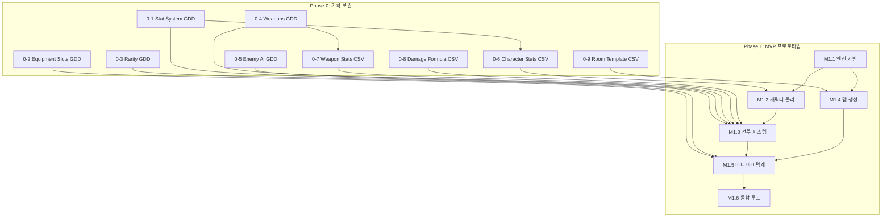

# Project Abyss: 전체 개발 로드맵 (Development Roadmap)

> **최근 업데이트:** 2026-03-23
> **문서 상태:** `작성 중 (Draft)`

---

## 현황 요약

| 항목 | 상태 |
| :--- | :--- |
| GDD 문서 | 21/65 완료 (32.3%) |
| CSV 데이터 시트 | 4/11 완료 |
| 코드 | 0줄 (기획 단계) |
| 완료된 GDD | Vision, GDD_Roles, Sheets_Rules, Glossary, 3C(3), Combat(3), ProcGen(2), Growth_Stats, Equipment(2), Enemy_AI, Design(5) |
| Phase 0 | ✅ 완료 (10/10) |

---

## 전체 로드맵 개요

```
Phase 0 (기획 보완)     ──▶  Phase 1 (MVP 프로토타입)  ──▶  Phase 2 (알파)  ──▶  Phase 3 (베타)  ──▶  Phase 4 (런칭)
기획 최소 단위 확정          핵심 루프 검증                 성장/탐험 루프       멀티+야리코미        라이브 서비스
~2주                        ~8주                          ~12주               ~16주               ~12주
```

---

## Phase 0: MVP 기획 보완 (MVP를 만들기 위한 최소 기획)

### 목표
> Phase 1 코딩을 시작하기 위해 **반드시 필요한 기획만** 추가 작성한다.

### 현재 완료된 문서 vs MVP에 필요한 문서

```
[완료] T-01  Project Vision         ← MVP 충분
[완료] SYS-3C-01 Character          ← MVP 충분 (물리 파라미터 확정)
[완료] SYS-3C-02 Camera             ← MVP 충분
[완료] SYS-3C-03 Control            ← MVP 충분 (키보드 우선, 모바일 후순위)
[완료] SYS-CMB-01 Action            ← MVP 충분 (기본 공격 + 대시 + 스킬)
[완료] SYS-CMB-02 Damage            ← MVP 충분 (기본 공식)
[완료] SYS-WLD-05 World ProcGen     ← MVP 충분 (Room Grid + Chunk)
[완료] SYS-IW-02 IW Floor Gen       ← MVP 충분 (지층 생성 파이프라인)

[완료] SYS-LVL-01 Stat System       ← ✅ 6대 스탯, Lv 1~10 성장 공식, HP/MP 파생
[완료] SYS-EQP-01 Equipment Slots   ← ✅ 무기 1슬롯, 착용/해제, 스탯 합산
[완료] SYS-EQP-02 Rarity System     ← ✅ 5등급 배율, 드랍 확률, 아이템계 지층 수
[완료] SYS-MON-01 Enemy AI          ← ✅ Skeleton/Ghost 2종, 7-state FSM
[완료] SYS-CMB-03 Weapons & Slots   ← ✅ 검 3타 콤보, 히트박스, 8카테고리

[완료] Content_Stats_Character_Base.csv   ← ✅ Lv 1~10 기본 스탯
[완료] Content_Stats_Weapon_List.csv      ← ✅ 검 5레어리티
[완료] Content_System_Damage_Formula.csv  ← ✅ 3타입 계수
[완료] Content_Level_RoomTemplate.csv     ← ✅ 13개 템플릿
```

### Phase 0 작업 목록 (MVP 최소 기획 단위)

| # | 작업 | 산출물 | 상태 | 내용 |
| :--- | :--- | :--- | :---: | :--- |
| 0-1 | **스탯 시스템 GDD** | `System/System_Growth_Stats.md` | ✅ | 6대 스탯 정의, Lv 1~10 성장 공식, HP/MP 파생 공식 |
| 0-2 | **장비 슬롯 GDD** | `System/System_Equipment_Slots.md` | ✅ | MVP 무기 1슬롯, 착용 규칙, 스탯 합산 공식 |
| 0-3 | **레어리티 GDD** | `System/System_Equipment_Rarity.md` | ✅ | 5등급 배율(x1.0~x3.0), 이노센트 슬롯, 지층 수, 드랍 연출 |
| 0-4 | **무기 시스템 GDD** | `System/System_Combat_Weapons.md` | ✅ | 검 1종 3타 콤보, 히트박스, 8무기 카테고리 정의 |
| 0-5 | **적 AI GDD** | `System/System_Enemy_AI.md` | ✅ | Skeleton(근접)/Ghost(원거리) 7-state FSM |
| 0-6 | **캐릭터 기본 스탯 CSV** | `Sheets/Content_Stats_Character_Base.csv` | ✅ | Lv 1~10 기본 스탯 테이블 |
| 0-7 | **무기 스탯 CSV** | `Sheets/Content_Stats_Weapon_List.csv` | ✅ | 검 5레어리티 스탯 |
| 0-8 | **데미지 공식 CSV** | `Sheets/Content_System_Damage_Formula.csv` | ✅ | Physical/Magical/True 3타입 계수 |
| 0-9 | **Room 템플릿 CSV** | `Sheets/Content_Level_RoomTemplate.csv` | ✅ | Castle 10개 + ItemWorld 3개 = 13 템플릿 |
| 0-10 | **용어집** | `Terms/Glossary.md` | ✅ | 38개 핵심 용어 + Quick Reference |

**Phase 0 완료:** ✅ 10/10 항목 완료 (2026-03-23) → Phase 1 코딩 시작 가능

---

## Phase 1: MVP 프로토타입 — "한 판의 재미"

### 목표
> **1개 구역 + 1지층짜리 미니 아이템계**에서 "탐험 → 아이템 획득 → 아이템계 진입 → 장비 강화" 순환이 돌아가는가?

### MVP 범위 정의 (What's IN / What's OUT)

| 포함 (IN) | 제외 (OUT) |
| :--- | :--- |
| 캐릭터 이동/점프/대시 | 벽 점프, 이중 점프, 변신 |
| 기본 공격 3타 콤보 (검) | 스킬 슬롯, 자동 조준 |
| 적 2종 (근접/원거리) | 보스, 상태이상, 원소 |
| 1개 구역 (5x5 Room Grid) | 7개 구역, 구역 간 이동 |
| 아이템 드랍 (검 1종, 5레어리티) | 전체 장비 슬롯, 방어구 |
| 미니 아이템계 (1지층 + 보스 1개) | 전체 지층, 이노센트, 지오 이펙트 |
| 데미지 숫자 표시 | DPS 미터, 전투 로그 |
| 키보드 조작 | 모바일, 게임패드 |
| 싱글 플레이 | 멀티플레이, 허브 |
| 로컬 세이브 (localStorage) | 서버, DB, 계정 |

### Phase 1 마일스톤 분해

```
M1.1 ──▶ M1.2 ──▶ M1.3 ──▶ M1.4 ──▶ M1.5 ──▶ M1.6
엔진     캐릭터    전투      맵 생성   아이템계   통합
기반     물리      시스템    시스템    미니       루프
1주      1.5주    1.5주     1.5주    1.5주      1주
```

#### M1.1 — 엔진 기반 (Week 1)

| ID | 작업 | 상세 | 완료 기준 |
| :--- | :--- | :--- | :--- |
| M1.1-1 | 프로젝트 초기화 | Vite + TypeScript + PixiJS v8 보일러플레이트 | `npm run dev`로 빈 캔버스 표시 |
| M1.1-2 | 게임 루프 구축 | PixiJS Ticker 기반 고정 60fps 루프 | deltaTime 기반 update/render 분리 |
| M1.1-3 | 입력 시스템 | 키보드 입력 매니저 (KeyDown/KeyUp 추적) | 동시 키 입력 정확히 감지 |
| M1.1-4 | 타일맵 렌더링 | @pixi/tilemap으로 16px 그리드 렌더링 | 30x20 타일 화면 정상 표시 |
| M1.1-5 | 카메라 시스템 | Lerp 기반 Smooth Follow + 룸 경계 | 캐릭터 추적, 룸 전환 시 스냅 |
| M1.1-6 | 에셋 로더 | 스프라이트시트 + 타일셋 로딩 파이프라인 | 플레이스홀더 에셋 로딩 성공 |

#### M1.2 — 캐릭터 물리 (Week 2~3)

| ID | 작업 | 상세 | 완료 기준 |
| :--- | :--- | :--- | :--- |
| M1.2-1 | 기본 이동 | 가속/감속 곡선 (3~4프레임 가속) | 좌우 이동이 자연스러움 |
| M1.2-2 | 점프 | 고정 높이 점프 + 중력 | 3타일 높이 점프, 자연스러운 포물선 |
| M1.2-3 | Coyote Time + Jump Buffer | 150ms 허용 | 절벽 끝에서 떨어진 직후 점프 가능 |
| M1.2-4 | 대시 | i-frame 150ms + 쿨다운 2초 | 대시 중 무적, 쿨다운 표시, 3타 후딜 캔슬 |
| M1.2-5 | 타일맵 충돌 | AABB 기반 + 원웨이 플랫폼 | 벽/바닥 관통 없음 |
| M1.2-6 | 캐릭터 상태 머신 | Idle/Run/Jump/Fall/Dash/Attack/Hit/Death | 상태 전이 정상 작동 |

#### M1.3 — 전투 시스템 (Week 3~4)

| ID | 작업 | 상세 | 완료 기준 |
| :--- | :--- | :--- | :--- |
| M1.3-1 | 히트박스/허트박스 | AABB 충돌 판정 시스템 | 공격 판정 정확히 발생 |
| M1.3-2 | 기본 공격 3타 콤보 | 검 모션 3타 자동 연결 | 연타 시 1→2→3타 자연스러운 연결 |
| M1.3-3 | 공중 공격 | 공중 전방/하방 공격 | 하방 공격 바운스 |
| M1.3-4 | 데미지 계산 | ATK - DEF 감산 + 랜덤 분산 | 데미지 숫자 정확히 계산/표시 |
| M1.3-5 | 피격 처리 | 히트스턴 + 넉백 + 무적 시간 | 피격 시 경직 + 넉백 자연스러움 |
| M1.3-6 | 히트스탑 | 2~4프레임 정지 | 타격 시 히트스탑으로 타격감 |
| M1.3-7 | 적 AI (기본) | 근접형: 접근→공격, 원거리형: 거리유지→사격 | 2종 적이 각자 패턴대로 행동 |
| M1.3-8 | 적 스폰/사망 | 스폰 포인트 + 사망 이펙트 + 드랍 | 적 처치 시 아이템 드랍 |

#### M1.4 — 맵 생성 시스템 (Week 4~5)

| ID | 작업 | 상세 | 완료 기준 |
| :--- | :--- | :--- | :--- |
| M1.4-1 | Room Grid 생성기 | 5x5 그리드 + 방 연결 | 시드 기반 일관된 그리드 생성 |
| M1.4-2 | Critical Path 알고리즘 | 입구 → 출구 경로 보장 | 모든 시드에서 클리어 가능 |
| M1.4-3 | Room Type 배정 | Type 0~3 분류 + 출입구 방향 | 방 간 이동이 자연스러움 |
| M1.4-4 | Chunk 시스템 | 최소 10개 Chunk 템플릿 조립 | Room 내부 지형이 다양하게 생성 |
| M1.4-5 | 오브젝트 배치 | 적/아이템 스폰 포인트 배치 | 생성된 맵에 적/아이템 정상 배치 |
| M1.4-6 | 룸 전환 | 룸 간 이동 + 카메라 전환 | 화면 전환 매끄러움 |

#### M1.5 — 미니 아이템계 (Week 5~6)

| ID | 작업 | 상세 | 완료 기준 |
| :--- | :--- | :--- | :--- |
| M1.5-1 | 아이템 데이터 구조 | 아이템 ID, 레어리티, 스탯, 레벨 | 아이템 오브젝트 생성/저장 |
| M1.5-2 | 장비 장착 시스템 | 무기 슬롯 1개 착용/해제 | 장비 변경 시 스탯 반영 |
| M1.5-3 | 아이템계 진입/탈출 | 아이템 선택 → 던전 생성 → 진입 | 월드 ↔ 아이템계 전환 |
| M1.5-4 | 지층 생성 (1지층) | IW Floor Gen의 미니 버전 (3x3 Grid) | 1지층 + 보스 1개 생성 |
| M1.5-5 | 지층 클리어 보상 | 아이템 경험치 + 아이템 레벨업 | 지층 클리어 시 장비 스탯 상승 확인 |
| M1.5-6 | 미니 보스 | 아이템 장군 1종 (강화된 적) | 보스 처치 시 아이템 스탯 +5% |

#### M1.6 — 통합 루프 검증 (Week 7~8)

| ID | 작업 | 상세 | 완료 기준 |
| :--- | :--- | :--- | :--- |
| M1.6-1 | 순환 루프 연결 | 월드 탐험 → 아이템 드랍 → 아이템계 → 강화 → 월드 복귀 | 전체 순환 1회 완주 가능 |
| M1.6-2 | HUD 최소 구현 | HP바, 데미지 숫자, 미니맵(룸 위치), 장비 정보 | 필수 정보 화면에 표시 |
| M1.6-3 | 인벤토리 UI | 아이템 목록, 장착/해제, 아이템계 진입 버튼 | 아이템 관리 가능 |
| M1.6-4 | 세이브/로드 | localStorage 기반 진행 저장 | 새로고침 후 이어하기 가능 |
| M1.6-5 | 밸런스 1차 튜닝 | 적 체력, 데미지, 드랍률, 아이템계 보상 조정 | 10분 플레이에 순환 2~3회 체험 |
| M1.6-6 | 플레이테스트 | 내부 테스트 + 피드백 수집 | "한 판 더" 동기 발생 여부 확인 |

### Phase 1 완료 기준 (Go/No-Go)

- [ ] 캐릭터가 월드를 탐험하며 적을 처치할 수 있다
- [ ] 적 처치 시 장비 아이템이 드랍된다
- [ ] 드랍된 아이템의 아이템계(1지층)에 진입할 수 있다
- [ ] 아이템계 지층 클리어로 장비가 강해진다
- [ ] 강해진 장비로 더 어려운 적을 처치할 수 있다
- [ ] 위 순환을 반복하고 싶은 동기가 발생한다

---

## Phase 2: 알파 — "성장과 탐험의 쾌감"

### 목표
> 7개 구역 연결 + 능력/스탯 게이트 + 아이템계 전체 지층 + 이노센트 기초

### 추가 기획 필요 (Phase 0 이후)

| 문서 | 용도 |
| :--- | :--- |
| SYS-WLD-01 Map Structure | 7개 구역 연결 그래프 |
| SYS-WLD-03 Ability Gating | 능력 게이트 (이단점프, 벽점프, 안개 변신) |
| SYS-WLD-04 Stat Gating | 스탯 게이트 (STR/INT/DEX 문) |
| SYS-IW-01 IW Core | 아이템계 전체 규칙 |
| SYS-INC-01 Innocent Core | 이노센트 기본 시스템 |
| SYS-LVL-02 Level & Experience | 레벨/경험치 곡선 |
| SYS-LVL-03 Skill Tree | 스킬 트리 (최소 10개 스킬) |
| SYS-MON-02 Boss Design | 보스 5종 설계 |
| SYS-CMB-04 SubWeapon | 서브웨폰 시스템 |
| SYS-CMB-05 Elements | 원소 상성 6종 |

### 주요 마일스톤

| 마일스톤 | 핵심 내용 |
| :--- | :--- |
| M2.1 월드 확장 | 7개 구역 연결, 구역별 바이옴 Chunk 풀, 워프 포인트 |
| M2.2 게이팅 시스템 | 능력 게이트 3종 (이단점프/벽점프/안개 변신) + 스탯 게이트 3종 (STR/INT/VIT) |
| M2.3 보스 시스템 | 구역 보스 3종 + 아이템계 보스 3등급 |
| M2.4 장비 확장 | 무기 4종 + 방어구 3부위 + 장신구 |
| M2.5 아이템계 전체 지층 | 지층별 보스, 레어리티별 지층 수 제한 |
| M2.6 이노센트 기초 | 이노센트 5종, 야생/복종, 장비 이동 |
| M2.7 스킬 시스템 | 스킬 슬롯 4개, 스킬 10종, 쿨다운 |
| M2.8 밸런스 & QA | 성장 곡선, 난이도 곡선, 플레이테스트 |

---

## Phase 3: 베타 — "함께 파밍하는 재미"

### 목표
> 멀티플레이(1~4인 아이템계) + 전 지층 + 허브 + 자동 사냥

### 추가 기획 필요

| 문서 | 용도 |
| :--- | :--- |
| SYS-MP-01 Multi Architecture | 클라이언트-서버 아키텍처 |
| SYS-MP-02 Party System | 파티 생성/매칭 |
| SYS-MP-03 Network Sync | 물리/전투 동기화 |
| SYS-ECO-01 Resources | 자원 순환 밸런스 |
| SYS-ECO-03 Auto Hunt | 자동 사냥 3단계 |
| SYS-HUB-01 Facilities | 허브 시설 (상점, 대장간, 이노센트 팜) |
| SYS-IW-03~06 | 아이템계 고급 (보스, 재귀, 이벤트, 지오) |
| SYS-INC-02~03 | 이노센트 팜, 듀얼 이노센트 |
| 전체 UI 문서 (UI-01~06) | HUD, 인벤토리, 맵, 파티 UI |

### 주요 마일스톤

| 마일스톤 | 핵심 내용 |
| :--- | :--- |
| M3.1 서버 구축 | Node.js + WebSocket + PostgreSQL + Redis |
| M3.2 네트워크 동기화 | 서버 권위 모델 + 클라이언트 예측 + 롤백 |
| M3.3 파티 시스템 | 파티 생성/초대/매칭 + 역할 분담 |
| M3.4 아이템계 전 지층 | 전체 지층 + 4등급 보스 + 미스터리 룸 |
| M3.5 이노센트 완성 | 전체 이노센트 + 팜 + 합성 + 듀얼 |
| M3.6 허브 | 허브 공간 + NPC/상점 + 이노센트 팜 시설 |
| M3.7 자동 사냥 | 3단계 자동 사냥 + 수동 정복 선행 조건 |
| M3.8 모바일 대응 | 가상 패드 + 터치 최적화 + 반응형 UI |

---

## Phase 4: 런칭 — "장기 운영"

### 목표
> 시즌 시스템 + 거래소 + 이벤트 + 길드 + 라이브 운영 파이프라인

### 주요 마일스톤

| 마일스톤 | 핵심 내용 |
| :--- | :--- |
| M4.1 시즌 시스템 | 3~6개월 시즌 리셋, 월드 재시드 |
| M4.2 거래소 | 플레이어 간 아이템/이노센트 거래 |
| M4.3 길드 | 길드 생성, 길드 레이드 |
| M4.4 이벤트 | 시즌 이벤트, 한정 보상 |
| M4.5 콘텐츠 확장 | 역전 성, 심연 구역, 추가 무기/스킬 |
| M4.6 라이브 운영 | 모니터링, 밸런스 패치, CS |

---

## MVP 최소 기획 단위 상세 — Phase 0 체크리스트

### 1. 추가 작성 필요한 GDD (5개)

#### GDD-NEW-01: 스탯 시스템 (`System/System_Growth_Stats.md`)

**MVP에 필요한 범위만:**
- 6대 스탯 정의 (STR, INT, DEX, VIT, SPD, LCK)
- 기본 스탯 공식: `FinalStat = BaseStat + EquipStat + InnocentBonus`
- Lv 1~10 성장 테이블 (MVP 레벨 캡 = 10)
- 스탯이 데미지 공식에 반영되는 방식 (SYS-CMB-02 연동)

**Phase 2에서 추가할 것:**
- Lv 11~100 성장 곡선
- 전생 시스템
- 스탯 게이트 임계값
- 스킬 트리 스탯 연동

#### GDD-NEW-02: 장비 슬롯 (`System/System_Equipment_Slots.md`)

**MVP에 필요한 범위만:**
- 슬롯 1개: 무기 (검)
- 착용/해제 규칙
- 장비 스탯 → 캐릭터 스탯 합산 공식
- 아이템 데이터 구조: `{id, name, type, rarity, level, baseStats, innocents[]}`

**Phase 2에서 추가할 것:**
- 전체 6슬롯 (무기, 보조무기, 머리, 갑옷, 망토, 장신구x2)
- 세트 효과
- 아이템 전생

#### GDD-NEW-03: 레어리티 시스템 (`System/System_Equipment_Rarity.md`)

**MVP에 필요한 범위만:**
- 5등급 정의 (Normal ~ Ancient)
- 등급별 스탯 배율 (x1.0 ~ x3.0)
- 등급별 드랍 확률
- 아이템계 지층 수 제한 (MVP에서는 1지층 고정이지만 데이터는 정의)

#### GDD-NEW-04: 무기 시스템 MVP (`System/System_Combat_Weapons.md`)

**MVP에 필요한 범위만:**
- 검 (Sword) 1종만 정의
  - 기본 공격 모션 3타 (속도, 사거리, 히트박스 크기)
  - 공중 공격 모션
  - 기본 ATK 스탯

**Phase 2에서 추가할 것:**
- 무기 8종 (창, 도끼, 채찍, 지팡이, 너클, 활, 대검)
- 무기별 고유 모션 차이

#### GDD-NEW-05: 적 AI MVP (`System/System_Enemy_AI.md`)

**MVP에 필요한 범위만:**
- 근접형 (Skeleton): 감지 → 접근 → 공격 → 대기
- 원거리형 (Ghost): 감지 → 거리 유지 → 사격 → 회피
- 스폰/사망 규칙
- HP/ATK/DEF 기본 스탯

**Phase 2에서 추가할 것:**
- 적 10종+
- 보스 AI (복합 패턴)
- 난이도별 스케일링

### 2. 추가 작성 필요한 CSV (4개)

#### CSV-01: `Sheets/Content_Stats_Character_Base.csv`
```
Level,HP,STR,INT,DEX,VIT,SPD,LCK,ExpToNext
1,100,10,8,9,10,8,5,100
2,120,12,10,11,12,9,6,150
...
10,280,28,24,26,28,20,14,800
```

#### CSV-02: `Sheets/Content_Stats_Weapon_List.csv`
```
WeaponID,Name,Type,Rarity,BaseATK,AtkSpeed,Range,HitboxW,HitboxH
sword_normal_01,시작의 검,Sword,Normal,15,1.0,48,40,32
sword_magic_01,강철 장검,Sword,Magic,20,1.0,48,40,32
...
```

#### CSV-03: `Sheets/Content_System_Damage_Formula.csv`
```
FormulaID,Type,Expression,MinDamage,RandomMin,RandomMax,CritBase,CritCap
physical,Physical,(ATK * SkillMult) - DEF,1,0.9,1.1,1.5,3.0
magical,Magical,(INT * SkillMult) - RES,1,0.9,1.1,1.5,3.0
```

#### CSV-04: `Sheets/Content_Level_RoomTemplate.csv`
```
TemplateID,Biome,Width,Height,ExitTop,ExitBottom,ExitLeft,ExitRight,Difficulty,Tags
room_castle_01,Castle,320,192,true,false,true,true,1,basic;corridor
room_castle_02,Castle,320,192,false,true,true,true,1,basic;pit
...
```

### 3. 추가 작성 필요한 메타 문서 (1개)

#### META-01: 용어집 MVP (`Terms/Glossary.md`)
- Phase 1에서 사용되는 핵심 용어 30개 정의
- 각 용어의 영문 키, 한글명, 정의, 관련 문서

---

## Phase 0 → Phase 1 의존성 맵



---

## 전체 문서 추가 목록 총괄

### Phase 0 (MVP 직전) — 10건

| # | 유형 | 경로 | 상태 |
| :---: | :--- | :--- | :---: |
| 1 | GDD | `System/System_Growth_Stats.md` | 신규 |
| 2 | GDD | `System/System_Equipment_Slots.md` | 신규 |
| 3 | GDD | `System/System_Equipment_Rarity.md` | 신규 |
| 4 | GDD | `System/System_Combat_Weapons.md` | 신규 |
| 5 | GDD | `System/System_Enemy_AI.md` | 신규 |
| 6 | CSV | `Sheets/Content_Stats_Character_Base.csv` | 신규 |
| 7 | CSV | `Sheets/Content_Stats_Weapon_List.csv` | 신규 |
| 8 | CSV | `Sheets/Content_System_Damage_Formula.csv` | 신규 |
| 9 | CSV | `Sheets/Content_Level_RoomTemplate.csv` | 신규 |
| 10 | META | `Terms/Glossary.md` | 신규 |

### Phase 2 (알파 직전) — 10건 GDD + 6건 CSV

| # | 유형 | 경로 | 상태 |
| :---: | :--- | :--- | :---: |
| 11 | GDD | `System/System_World_MapStructure.md` | 신규 |
| 12 | GDD | `System/System_World_AbilityGating.md` | 신규 |
| 13 | GDD | `System/System_World_StatGating.md` | 신규 |
| 14 | GDD | `System/System_ItemWorld_Core.md` | 신규 |
| 15 | GDD | `System/System_Innocent_Core.md` | 신규 |
| 16 | GDD | `System/System_Growth_LevelExp.md` | 신규 |
| 17 | GDD | `System/System_Growth_SkillTree.md` | 신규 |
| 18 | GDD | `System/System_Enemy_BossDesign.md` | 신규 |
| 19 | GDD | `System/System_Combat_SubWeapon.md` | 신규 |
| 20 | GDD | `System/System_Combat_Elements.md` | 신규 |
| 21 | CSV | `Sheets/Content_System_Innocent_Pool.csv` | 신규 |
| 22 | CSV | `Sheets/Content_System_Monster_Pool.csv` | 신규 |
| 23 | CSV | `Sheets/Content_Level_Zone_Config.csv` | 신규 |
| 24 | CSV | `Sheets/Content_System_Skill_List.csv` | 신규 |
| 25 | CSV | `Sheets/Content_System_IW_BossTable.csv` | 신규 |
| 26 | CSV | `Sheets/Content_System_LevelExp_Curve.csv` | 신규 |

### Phase 3 (베타 직전) — 15건 GDD + UI

| # | 유형 | 경로 | 상태 |
| :---: | :--- | :--- | :---: |
| 27 | GDD | `System/System_Multi_Architecture.md` | 신규 |
| 28 | GDD | `System/System_Multi_Party.md` | 신규 |
| 29 | GDD | `System/System_Multi_NetworkSync.md` | 신규 |
| 30 | GDD | `System/System_Multi_GhostMessage.md` | 신규 |
| 31 | GDD | `System/System_Economy_Resources.md` | 신규 |
| 32 | GDD | `System/System_Economy_Trade.md` | 신규 |
| 33 | GDD | `System/System_Economy_AutoHunt.md` | 신규 |
| 34 | GDD | `System/System_Hub_Facilities.md` | 신규 |
| 35 | GDD | `System/System_Hub_NPCShop.md` | 신규 |
| 36 | GDD | `System/System_ItemWorld_Boss.md` | 신규 |
| 37 | GDD | `System/System_ItemWorld_Recursion.md` | 신규 |
| 38 | GDD | `System/System_ItemWorld_Events.md` | 신규 |
| 39 | GDD | `System/System_ItemWorld_GeoEffects.md` | 신규 |
| 40 | GDD | `System/System_Innocent_Farm.md` | 신규 |
| 41 | GDD | `System/System_Innocent_Dual.md` | 신규 |
| 42~47 | UI | `UI/UI_HUD_Layout.md` 외 5건 | 신규 |

### Design 문서 (Phase별 배정) — 12건

| # | 유형 | 경로 | Phase | 상태 |
| :---: | :--- | :--- | :---: | :---: |
| — | Design | `Design/Design_Architecture_3Space.md` | 완료 | ✅ |
| — | Design | `Design/Design_CoreLoop_Circulation.md` | 완료 | ✅ |
| — | Design | `Design/Design_Difficulty_Progression.md` | 완료 | ✅ |
| — | Design | `Design/Design_Combat_Philosophy.md` | 완료 | ✅ |
| — | Design | `Design/Design_Level_Standards.md` | 완료 | ✅ |
| 12 | Design | `Design/Design_Metroidvania_Philosophy.md` | Phase 1 | ⬜ |
| 13 | Design | `Design/Design_Yarikomi_Philosophy.md` | Phase 1 | ⬜ |
| 14 | Design | `Design/Design_Progression_Reward.md` | Phase 1 | ⬜ |
| 15 | Design | `Design/Design_Narrative_Worldbuilding.md` | Phase 2 | ⬜ |
| 42 | Design | `Design/Design_Online_Principles.md` | Phase 3 | ⬜ |
| 43 | Design | `Design/Design_Economy_FaucetSink.md` | Phase 3 | ⬜ |
| 70 | Design | `Design/Design_Season_LiveService.md` | Phase 4 | ⬜ |

---

## 즉시 다음 행동 (Next Action)

**Phase 0 완료** — 10개 항목 모두 작성 완료 (2026-03-23)

**다음 행동: Phase 1 코딩 시작**

1. `M1.1` 엔진 기반 — Vite + TypeScript + PixiJS v8 프로젝트 초기화
2. `M1.2` 캐릭터 물리 — 이동/점프/대시 (SYS-3C-01 기반)
3. `M1.3` 전투 시스템 — 기본 공격 + 데미지 (SYS-CMB-01~03 기반)

**Phase 1 병행 기획 (코딩 중 작성):**
- SYS-CMB-07 Hit Feedback (M1.3 중 병행)
- D-04 Metroidvania Philosophy (M1.4 중 병행)
- D-05 Yarikomi Philosophy (M1.5 중 병행)
- D-11 Progression & Reward (M1.6 전 작성)
