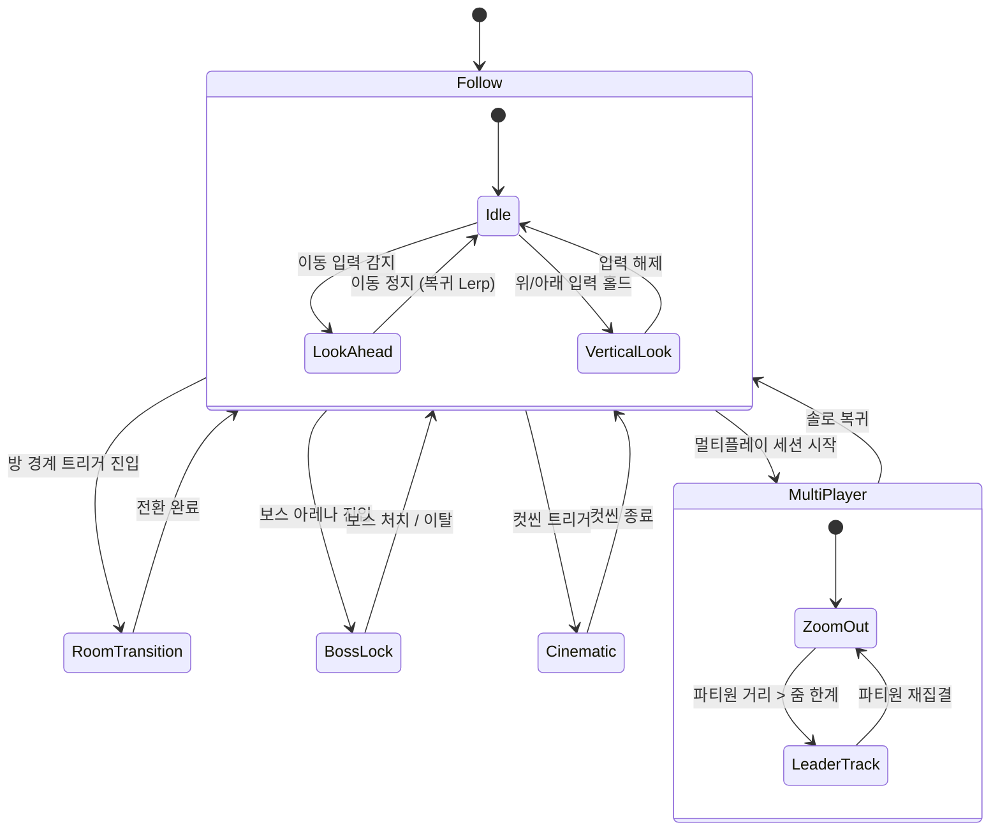

# 카메라 시스템 (Camera System)

## 🏗️ 구현 현황 (Implementation Status)

> **최근 업데이트:** 2026-03-23
> **문서 상태:** `작성 중 (Draft)`
> **2-Space:** 전체
> **기둥:** 탐험

| 기능 ID    | 분류   | 기능명 (Feature Name)             | 우선순위 | 구현 상태   | 비고 (Notes)              |
| :--------- | :----- | :-------------------------------- | :------: | :---------- | :------------------------ |
| CAM-01-A   | 시스템 | Follow Mode (Lerp 추적)          |    P1    | ⬜ 제작 필요 | 기본 탐험 카메라           |
| CAM-02-A   | 시스템 | Dead Zone 처리                    |    P1    | ⬜ 제작 필요 | Follow Mode 하위 기능      |
| CAM-03-A   | 시스템 | Look Ahead (이동 방향 선행)       |    P1    | ⬜ 제작 필요 | 할로우 나이트 참조         |
| CAM-04-A   | 시스템 | Vertical Look (상하 확인)         |    P2    | ⬜ 제작 필요 | 위/아래 입력 홀드          |
| CAM-05-A   | 시스템 | Room Transition (방 전환)         |    P1    | ⬜ 제작 필요 | 월하의 야상곡 참조         |
| CAM-06-A   | 시스템 | Boss Lock (보스전 고정)           |    P1    | ⬜ 제작 필요 | 보스 아레나 전용           |
| CAM-07-A   | 시스템 | Camera Shake (화면 흔들림)        |    P2    | ⬜ 제작 필요 | 데드셀 참조                |
| CAM-08-A   | 시스템 | Cinematic Mode (컷씬/연출)        |    P2    | ⬜ 제작 필요 | 스크립트 드리븐            |
| CAM-09-A   | 시스템 | Camera Bounds (맵 경계 제한)      |    P1    | ⬜ 제작 필요 | AABB 클램프               |
| CAM-10-A   | 시스템 | MultiPlayer Camera (멀티플레이)   |    P2    | ⬜ 제작 필요 | 줌 아웃 + 리더 추적        |

---

## 0. 필수 참고 자료 (Mandatory References)

* Writing Standards: `Documents/Terms/GDD_Writing_Rules.md`
* Project Definition: `Documents/Terms/Project_Vision_Abyss.md`
* 레퍼런스 — 캐슬배니아 월하의 야상곡: 룸 기반 고정 카메라 + 스크롤 전환
* 레퍼런스 — 할로우 나이트: Look Ahead + 부드러운 Lerp 추적
* 레퍼런스 — 데드셀: 빠른 전투 시 카메라 흔들림과 타격감 연출
* 레퍼런스 — GMTK "How to Make a Good 2D Camera": 데드존, Look Ahead, 스무딩 이론
* 기술 스택: PixiJS v8 + TypeScript

---

## 1. 개요 (Concept)

### 1-1. 의도 (Intent)

카메라는 플레이어가 게임 세계를 인지하는 유일한 창이다. ECHORIS에서 카메라 시스템은 두 가지 핵심 경험을 동시에 충족해야 한다.

1. **탐험감**: 미지의 공간을 발견하는 긴장과 호기심. 카메라가 너무 넓으면 미지가 사라지고, 너무 좁으면 공간 파악이 불가능하다.
2. **전투감**: 적의 위치와 공격 패턴을 읽고 대응하는 쾌감. 카메라가 흔들리지 않으면 타격이 밋밋하고, 과도하면 시인성이 무너진다.

### 1-2. 근거 (Reasoning)

횡스크롤 메트로배니아는 "보이지 않는 곳에서 오는 위협"이 핵심 긴장 요소다. 카메라의 시야 범위, 이동 방향 선행, 상하 확인 기능은 플레이어에게 정보 수집 도구를 제공하되, 그 도구의 한계가 곧 게임의 긴장감이 된다.

### 1-3. 2-Space별 카메라 규칙이 다른 이유 (Why Per-Space Rules)

ECHORIS는 3개의 공간(World, Item Dungeon, Hub)을 가진다. 각 공간의 목적이 다르므로 카메라 규칙도 달라야 한다.

| 2-Space          | 목적               | 카메라 특성                                      |
| :--------------- | :----------------- | :----------------------------------------------- |
| World (월드)     | 탐험 + 전투        | Follow Mode 기본, Room Transition 활성, Look Ahead 활성 |
| Item Dungeon     | 고밀도 전투 + 파밍 | 줌 아웃 가능, 멀티플레이 카메라 활성, 빠른 Shake  |
| Hub (거점)       | 사교 + 준비        | 고정 카메라 또는 넓은 시야, Shake 비활성           |

### 1-4. 저주받은 문제 점검 (Cursed Problem Check)

| 문제                                     | 대응                                                    |
| :--------------------------------------- | :------------------------------------------------------ |
| Lerp 추적이 저프레임에서 끊김            | `deltaTime` 기반 보간으로 프레임 독립 처리               |
| 좁은 방에서 카메라가 맵 밖을 노출        | Camera Bounds(AABB 클램프)로 뷰포트를 맵 내부에 고정     |
| 멀티플레이 줌 아웃 시 캐릭터가 점처럼 작음 | 최소 줌 스케일(0.7)을 강제하고, UI 네임플레이트로 보완   |
| Room Transition 중 플레이어 조작 입력    | 전환 중 입력 큐잉, 전환 완료 후 일괄 처리                |

### 1-5. 리스크와 보상 (Risk & Reward)

| 리스크                                | 보상                                         |
| :------------------------------------ | :------------------------------------------- |
| 카메라 모드 전환이 잦으면 어지러움 유발 | 모드별 전환 Lerp를 두어 부드러운 블렌딩 보장  |
| 데드존이 크면 반응이 느린 느낌          | 탐험 시 안정감 제공, 전투 시 데드존 축소 전환 |
| Look Ahead가 빠른 방향 전환 시 떨림    | 방향 전환 시 Lerp 감쇠 적용으로 떨림 제거     |

---

## 2. 메커닉 (Mechanics)

### 2-1. 카메라 모드 전환 다이어그램 (Camera Mode State Diagram)



### 2-2. 모드별 행동 정의 (Action-Reaction-Effect)

#### Follow Mode (일반 탐험)

| 단계     | 내용                                                         |
| :------- | :----------------------------------------------------------- |
| Action   | 플레이어가 이동한다                                          |
| Reaction | 카메라가 데드존 밖으로 나간 캐릭터를 Lerp로 추적한다         |
| Effect   | 캐릭터가 화면 중앙 부근에 유지되며, 미세한 지연이 탐험 몰입감을 준다 |

#### Look Ahead (이동 방향 선행)

| 단계     | 내용                                                              |
| :------- | :---------------------------------------------------------------- |
| Action   | 플레이어가 좌/우로 이동한다                                       |
| Reaction | 카메라 목표점이 이동 방향으로 `look_ahead_distance`만큼 이동한다   |
| Effect   | 진행 방향의 지형/적이 미리 보여 대응 시간이 확보된다               |

#### Vertical Look (상하 확인)

| 단계     | 내용                                                                   |
| :------- | :--------------------------------------------------------------------- |
| Action   | 플레이어가 위 또는 아래 입력을 `vertical_look_delay_ms` 이상 홀드한다   |
| Reaction | 카메라가 해당 방향으로 `vertical_look_distance`만큼 이동한다            |
| Effect   | 낙하 지점이나 상부 플랫폼을 미리 확인하여 탐험 판단을 돕는다           |

#### Room Transition (방 이동 전환)

| 단계     | 내용                                                        |
| :------- | :---------------------------------------------------------- |
| Action   | 플레이어가 방 경계 트리거에 진입한다                         |
| Reaction | 카메라가 현재 방에서 다음 방으로 전환 애니메이션을 수행한다   |
| Effect   | 새로운 방의 전체 구조가 공개되며, 탐험 발견감을 제공한다      |

#### Boss Lock (보스전 고정)

| 단계     | 내용                                                       |
| :------- | :--------------------------------------------------------- |
| Action   | 플레이어가 보스 아레나에 진입한다                           |
| Reaction | 카메라가 아레나 중심에 고정되고 `boss_zoom_scale`로 줌한다  |
| Effect   | 보스와 플레이어 모두 시야에 잡히며, 전투 집중도가 높아진다  |

#### Cinematic (컷씬/연출)

| 단계     | 내용                                                  |
| :------- | :---------------------------------------------------- |
| Action   | 스크립트가 Cinematic 트리거를 발동한다                 |
| Reaction | 카메라가 지정된 경로/대상을 따라 이동한다              |
| Effect   | 스토리 연출, NPC 등장, 환경 변화를 시네마틱으로 전달   |

#### MultiPlayer (멀티플레이)

| 단계     | 내용                                                                  |
| :------- | :-------------------------------------------------------------------- |
| Action   | 2인 이상 파티원이 같은 공간에 존재한다                                 |
| Reaction | 카메라가 모든 파티원을 포함하도록 줌 아웃한다 (`multiplayer_zoom_min`) |
| Effect   | 파티원 전체의 위치가 화면에 표시되어 협동 전투가 가능하다              |

---

## 3. 규칙 (Rules)

### 3-1. Smooth Follow (부드러운 추적)

카메라 위치는 매 프레임 다음 공식으로 갱신한다.

```
camera.x += (target.x - camera.x) * follow_lerp * (deltaTime / 16.67)
camera.y += (target.y - camera.y) * follow_lerp * (deltaTime / 16.67)
```

- `follow_lerp`는 0에서 1 사이의 값이다. 0에 가까울수록 느리게, 1에 가까울수록 즉시 추적한다.
- `deltaTime / 16.67`은 60fps 기준 프레임 독립 보간을 위한 정규화 계수다.
- 데드존(Dead Zone) 내부에서는 카메라가 이동하지 않는다. 캐릭터가 데드존 경계를 넘을 때만 추적이 시작된다.

#### 데드존 규칙

- 데드존은 화면 중앙 기준 `dead_zone_x * 2` (가로), `dead_zone_y * 2` (세로) 크기의 직사각형이다.
- 캐릭터 피벗(발 위치 기준)이 데드존 내부에 있으면 카메라는 정지한다.
- 캐릭터 피벗이 데드존 경계를 넘으면, 넘은 거리만큼 카메라 목표가 이동한다.

### 3-2. Look Ahead (이동 방향 선행)

- 플레이어가 좌 또는 우로 이동 중일 때, 카메라 목표점이 이동 방향으로 `look_ahead_distance` 픽셀만큼 이동한다.
- Look Ahead 오프셋은 `look_ahead_lerp`로 서서히 적용된다 (즉시 점프 금지).
- 플레이어가 정지하면, Look Ahead 오프셋이 `look_ahead_lerp`로 0까지 복귀한다.
- 플레이어가 방향을 빠르게 전환하면, 기존 오프셋이 먼저 0으로 감쇠된 뒤 새 방향으로 적용된다 (방향 전환 떨림 방지).

### 3-3. Vertical Look (상하 확인)

- 위 또는 아래 입력을 `vertical_look_delay_ms` 이상 연속 홀드하면 활성화된다.
- 활성화 시 카메라 Y축 목표가 `vertical_look_distance` 픽셀만큼 해당 방향으로 이동한다.
- 이동 입력이 동시에 감지되면 Vertical Look를 비활성화하고 Follow Mode로 복귀한다.
- 입력 해제 시 `follow_lerp` 속도로 원래 위치에 복귀한다.

### 3-4. Room Transition (방 전환)

방 전환은 3가지 방식 중 방 설계자가 지정한 방식을 사용한다.

| 전환 방식   | 동작                                                      | 사용 조건                  |
| :---------- | :-------------------------------------------------------- | :------------------------- |
| Scroll      | 카메라가 현재 위치에서 다음 방의 시작점까지 직선 이동한다  | 인접한 방, 수평/수직 연결  |
| Fade        | 현재 화면 페이드 아웃 → 다음 방 페이드 인                 | 비인접 방, 워프 연결       |
| Cut         | 즉시 전환 (보간 없음)                                     | 빠른 연속 전환이 필요한 방 |

- Scroll 방식의 전환 시간은 `room_transition_duration_ms`를 따른다.
- Fade 방식은 `room_transition_duration_ms / 2`로 페이드 아웃, 나머지 절반으로 페이드 인한다.
- 전환 중 플레이어 입력은 큐에 저장하고, 전환 완료 직후 순서대로 처리한다.
- 전환 중 캐릭터 물리 시뮬레이션은 유지하되, 입력 기반 행동만 큐잉한다.

### 3-5. Camera Shake (화면 흔들림)

Camera Shake는 타격, 폭발, 착지 등 임팩트 이벤트에 적용한다.

- 흔들림은 X, Y 각각 독립적인 랜덤 오프셋으로 적용한다.
- 초기 강도는 `shake_max_intensity` 픽셀이며, 매 프레임 `shake_decay_rate`를 곱하여 감쇠한다.
- 감쇠 공식: `intensity = intensity * shake_decay_rate`
- 강도가 0.5 픽셀 미만이 되면 Shake를 종료하고 오프셋을 0으로 리셋한다.
- 다중 Shake가 동시에 발생하면, 가장 큰 강도를 사용한다 (가산 아님, 최대값 선택).

#### Shake 강도 등급

| 등급   | 강도 (px) | 사용 예시                |
| :----- | --------: | :----------------------- |
| Light  |         2 | 일반 근접 타격, 소형 폭발 |
| Medium |         5 | 강공격, 중형 폭발         |
| Heavy  |         8 | 보스 패턴, 대형 폭발      |

### 3-6. Camera Bounds (맵 경계 제한)

- 각 방(Room)은 AABB(Axis-Aligned Bounding Box)로 카메라 이동 범위를 정의한다.
- 카메라 뷰포트의 좌상단이 AABB의 좌상단보다 작아지지 않도록 클램프한다.
- 카메라 뷰포트의 우하단이 AABB의 우하단보다 커지지 않도록 클램프한다.
- 방 크기가 뷰포트보다 작을 경우, 카메라를 방 중앙에 고정한다 (스크롤 비활성).

```
clampedX = clamp(camera.x, bounds.left + halfViewW, bounds.right - halfViewW)
clampedY = clamp(camera.y, bounds.top + halfViewH, bounds.bottom - halfViewH)
```

### 3-7. 멀티플레이 카메라 (MultiPlayer Camera)

#### 2인 협동 (Co-op)

- 카메라 목표점은 두 플레이어의 중간점(midpoint)이다.
- 두 플레이어 사이 거리에 비례하여 줌 아웃한다.
- 줌 스케일은 `multiplayer_zoom_min`(0.7)에서 `multiplayer_zoom_max`(1.0) 사이로 클램프한다.
- 줌 스케일 공식: `scale = clamp(baseViewportWidth / requiredWidth, zoom_min, zoom_max)`

#### 4인 아이템계 (Item Dungeon)

- 파티 리더의 위치를 카메라 목표로 사용한다.
- 다른 파티원이 화면 밖으로 나가면, 해당 파티원 위치에 화면 가장자리 표시(Edge Indicator)를 렌더링한다.
- 줌 아웃은 2인과 동일한 범위를 사용하되, 리더와 가장 먼 파티원의 거리를 기준으로 적용한다.
- 리더가 사망하면 생존한 파티원 중 가장 가까운 플레이어가 카메라 목표가 된다.

### 3-8. 아이템계 vs 월드 카메라 차이 (Item Dungeon vs World Camera)

| 항목               | World (월드)          | Item Dungeon (아이템계)    |
| :----------------- | :-------------------- | :------------------------- |
| 기본 모드          | Follow (솔로)        | MultiPlayer (파티 기반)    |
| Look Ahead         | 활성                  | 활성                       |
| Room Transition    | Scroll / Fade         | Cut (빠른 전환 우선)       |
| Camera Shake       | 표준 감쇠             | 1.5배 강도 (타격감 강조)   |
| 줌 범위            | 고정 (1.0)            | 0.7-1.0 (동적)          |
| Vertical Look      | 활성                  | 비활성 (전투 집중)         |
| Boss Lock          | 활성                  | 활성                       |

---

## 4. 데이터 및 파라미터 (Parameters)

```yaml
camera:
  # --- 뷰포트 (Viewport) ---
  viewport_width: 480          # 기본 뷰포트 너비 (px, 30 타일 기준)
  viewport_height: 270         # 기본 뷰포트 높이 (px, 약 17 타일 기준)
  tile_size: 16                # 1 타일 크기 (px)

  # --- Follow Mode ---
  follow_lerp: 0.08            # 추적 보간 비율 (0~1, 프레임 독립)
  dead_zone_x: 32              # 데드존 반폭 (px)
  dead_zone_y: 24              # 데드존 반높이 (px)

  # --- Look Ahead ---
  look_ahead_distance: 64      # 이동 방향 선행 거리 (px)
  look_ahead_lerp: 0.05        # 선행 오프셋 보간 비율

  # --- Vertical Look ---
  vertical_look_distance: 80   # 상하 확인 이동 거리 (px)
  vertical_look_delay_ms: 500  # 입력 홀드 활성화 지연 (ms)

  # --- Room Transition ---
  room_transition_duration_ms: 300  # 방 전환 기본 시간 (ms)
  room_transition_fade_ratio: 0.5   # Fade 방식 시 아웃/인 비율

  # --- Camera Shake ---
  shake_max_intensity: 8       # 최대 흔들림 강도 (px)
  shake_decay_rate: 0.9        # 프레임당 감쇠 계수
  shake_min_threshold: 0.5     # 흔들림 종료 임계값 (px)
  item_dungeon_shake_multiplier: 1.5  # 아이템계 Shake 강도 배수

  # --- Boss Lock ---
  boss_zoom_scale: 1.2         # 보스전 줌 스케일 (1.0 = 기본)
  boss_lock_lerp: 0.06         # 보스 카메라 전환 보간 비율

  # --- MultiPlayer ---
  multiplayer_zoom_min: 0.7    # 멀티플레이 최소 줌 (최대 줌 아웃)
  multiplayer_zoom_max: 1.0    # 멀티플레이 최대 줌 (기본)
  multiplayer_midpoint_lerp: 0.1  # 중간점 추적 보간 비율
  edge_indicator_margin: 16    # 화면 가장자리 표시 여백 (px)

  # --- Cinematic ---
  cinematic_default_speed: 120  # 시네마틱 카메라 기본 이동 속도 (px/s)
  cinematic_ease: "easeInOutCubic"  # 기본 이징 함수
```

---

## 5. 예외 처리 (Edge Cases)

### 5-1. 해상도 변경 (Resolution Change)

- 브라우저 창 크기 변경 또는 전체 화면 전환 시, 뷰포트를 기본 해상도(480x270)로 유지하고 CSS 스케일링으로 렌더링한다.
- PixiJS의 `renderer.resize()`를 호출한 뒤, Camera Bounds를 재계산한다.
- 종횡비가 16:9에서 벗어나면, 짧은 축에 레터박스(검은 띠)를 적용한다.
- 해상도 변경 시 진행 중인 Room Transition이나 Shake를 중단하지 않는다. 변경된 뷰포트 크기로 남은 애니메이션을 이어간다.

### 5-2. 맵 경계 코너 (Map Boundary Corner)

- 플레이어가 맵 코너에 위치하면 X축과 Y축 클램프가 동시에 적용된다.
- Look Ahead 오프셋이 클램프 영역 밖을 가리키면, 클램프가 우선 적용되어 Look Ahead 효과가 자연스럽게 무시된다.
- 코너에서 데드존이 맵 경계와 겹치면, 데드존 크기를 맵 내부로 축소하여 카메라가 경계 밖을 노출하지 않도록 한다.

### 5-3. 순간이동 / 워프 (Teleport / Warp)

- 워프 시 카메라는 Lerp 추적을 사용하지 않고 Fade 전환을 강제 적용한다.
- 워프 전 위치에서 페이드 아웃 → 워프 후 위치에서 페이드 인 순서로 처리한다.
- 워프 직후 1프레임 동안 카메라 위치를 목표 위치에 즉시 스냅한다 (Lerp 잔여 오프셋 방지).
- 같은 방 내부의 짧은 거리 워프(200px 미만)는 Fade 대신 빠른 Lerp(0.3)로 처리한다.

### 5-4. 네트워크 지연 시 카메라 보간 (Network Latency Interpolation)

- 멀티플레이 시 원격 플레이어의 위치는 서버 틱 간격(기본 50ms)으로 수신한다.
- 원격 플레이어 위치는 클라이언트에서 선형 보간(Linear Interpolation)으로 부드럽게 표시한다.
- 보간 버퍼는 2틱분(100ms)을 유지하여, 1틱 패킷 손실에도 부드러운 이동을 보장한다.
- 200ms 이상 패킷이 미수신되면, 마지막 수신 속도 벡터로 외삽(Extrapolation)한다.
- 300ms 이상 패킷이 미수신되면, 해당 플레이어의 위치를 카메라 목표 계산에서 제외하고, 로컬 플레이어만 추적한다.
- 재접속(패킷 재수신) 시 급격한 위치 점프를 방지하기 위해 500ms에 걸쳐 Lerp로 복귀한다.

### 5-5. 성능 최적화 (Performance Considerations)

- 카메라 업데이트는 PixiJS의 `Ticker`에 등록하여 렌더 루프와 동기화한다.
- 카메라 위치 변경 시 `Container.position`만 갱신하고, 개별 스프라이트 변환은 하지 않는다.
- Camera Bounds 체크와 Shake 오프셋 적용은 단일 패스에서 처리한다 (이중 변환 방지).
- 화면 밖 오브젝트는 카메라 뷰포트 기준으로 컬링(culling)한다. 뷰포트 + 1타일 여백 범위 밖의 오브젝트는 렌더링에서 제외한다.

---

## 🎯 검증 기준 (Verification Checklist)

* [ ] Follow Mode에서 캐릭터가 데드존 안에 있을 때 카메라가 정지하는가
* [ ] Follow Mode에서 데드존 밖으로 이동 시 Lerp 추적이 프레임 독립적으로 동작하는가
* [ ] Look Ahead가 이동 방향으로 정확히 `look_ahead_distance` 픽셀까지 이동하는가
* [ ] 방향 전환 시 Look Ahead 떨림이 발생하지 않는가
* [ ] Vertical Look가 `vertical_look_delay_ms` 이후에만 활성화되는가
* [ ] Room Transition 중 플레이어 입력이 큐잉되고, 전환 후 정상 처리되는가
* [ ] Camera Bounds가 뷰포트를 맵 경계 안에 정확히 클램프하는가
* [ ] 방 크기가 뷰포트보다 작을 때 카메라가 방 중앙에 고정되는가
* [ ] Camera Shake가 `shake_min_threshold` 미만에서 정확히 종료되는가
* [ ] 다중 Shake 발생 시 최대값이 선택되는가 (가산 아님)
* [ ] Boss Lock에서 보스와 플레이어 모두 화면에 포함되는가
* [ ] 2인 멀티플레이에서 줌 아웃이 `multiplayer_zoom_min`을 초과하지 않는가
* [ ] 4인 아이템계에서 리더 사망 시 카메라가 올바른 대체 목표로 전환되는가
* [ ] 워프 시 Fade 전환 후 카메라 위치가 정확히 스냅되는가 (잔여 오프셋 없음)
* [ ] 네트워크 300ms 이상 끊김 시 카메라가 로컬 플레이어만 추적하는가
* [ ] 브라우저 창 리사이즈 시 레터박스가 올바르게 적용되는가
* [ ] 아이템계에서 Shake 강도가 1.5배로 적용되는가
