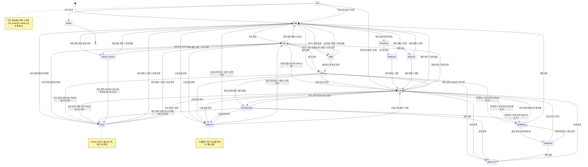

# 캐릭터 물리 & 상태 머신 (Character Physics & State Machine)

## 구현 현황 (Implementation Status)

> **최근 업데이트:** 2026-03-23
> **문서 상태:** `작성 중 (Draft)`
> **3-Space:** 전체 (World + Item World + Hub)
> **기둥:** 탐험 + 야리코미 + 멀티플레이

| 기능 ID    | 분류   | 기능명 (Feature Name)              | 우선순위 | 구현 상태    | 비고 (Notes)              |
| :--------- | :----- | :--------------------------------- | :------: | :----------- | :------------------------ |
| CHR-01-A   | 시스템 | 기본 이동 (가속/감속)              |    P1    | 📅 대기      | PixiJS Ticker 기반        |
| CHR-01-B   | 시스템 | 고정 높이 점프                     |    P1    | 📅 대기      | 직관적 조작 최적화        |
| CHR-01-C   | 시스템 | Coyote Time / Jump Buffer         |    P1    | 📅 대기      | 관대한 허용 시간          |
| CHR-02-C   | 시스템 | 슬라이드 (Slide)                   |    P2    | 📅 대기      | 좁은 통로 진입용          |
| CHR-02-D   | 시스템 | 대시 (Dash)                        |    P1    | 📅 대기      | i-frame 회피, 쿨다운 2초  |
| CHR-03-A   | 시스템 | 벽 슬라이드 (Wall Slide)           |    P1    | 📅 대기      | 능력 해금 후 사용 가능    |
| CHR-03-B   | 시스템 | 벽 점프 (Wall Jump)                |    P1    | 📅 대기      | 능력 해금 후 사용 가능    |
| CHR-04-A   | 시스템 | 이중 점프 (Double Jump)            |    P2    | 📅 대기      | 언락 가능 어빌리티        |
| CHR-05-A   | 시스템 | 히트박스/허트박스 시스템            |    P1    | 📅 대기      | AABB 기반, 넓은 히트박스  |
| CHR-05-B   | 시스템 | 피격/넉백 처리                     |    P1    | 📅 대기      | 히트스턴 + 넉백 벡터      |
| CHR-06-A   | 시스템 | 변신 시스템 (Transform)            |    P3    | 📅 대기      | Mist Form / Bat Form      |
| CHR-07-A   | 시스템 | 멀티플레이 물리 동기화             |    P1    | 📅 대기      | 서버 권위 모델            |
| CHR-08-A   | 시스템 | 타일맵 충돌 / 원웨이 플랫폼       |    P1    | 📅 대기      | 16px 그리드 기반          |
| CHR-09-A   | 시스템 | 스킬 슬롯 시스템 (SkillCast)       |    P1    | 📅 대기      | 스킬 버튼 기반 직관 조작  |
| CHR-09-B   | 시스템 | 자동 조준 보조 (Auto-Aim Assist)   |    P1    | 📅 대기      | 전투 쾌적성 향상          |

---

## 0. 필수 참고 자료 (Mandatory References)

* Project Definition: `Documents/Terms/Project_Vision_Abyss.md`
* 레퍼런스 분석 - 월하의 야상곡: 알루카드 이동/점프 물리
* 레퍼런스 분석 - 메이플스토리 / 던전파이터: 스킬 슬롯 기반 직관 조작
* 기술 스택: PixiJS v8 + TypeScript (웹 브라우저 PC, 60fps 타겟)
* 단위 기준: 16px = 1 타일 (tile), 속도 단위 = px/frame (60fps 기준)

---

## 1. 개요 (Concept)

### 설계 의도 (Intent)

Project Abyss의 캐릭터 물리는 "스킬 슬롯 기반의 직관적 전투"를 지향한다. 플레이어는 복잡한 타이밍 입력 없이 스킬 버튼과 이동키만으로 전투와 탐험을 수행할 수 있어야 하며, 숙련도는 "스킬 조합 선택"과 "위치 선정"에서 발현되는 구조를 만든다.

**핵심 설계 목표:**

* 키보드와 게임패드 모두에서 쾌적한 조작감을 보장한다.
* 기본 공격은 자동 콤보 3타로 진행되어 별도 타이밍 입력이 불필요하다.
* 자동 조준 보조를 통해 조준 부담을 최소화한다.

### 3대 기둥 정렬 (Design Pillar Alignment)

| 기둥                  | 캐릭터 물리에서의 구현                                                |
| :-------------------- | :-------------------------------------------------------------------- |
| 탐험가 (Explorer)     | 벽 점프, 이중 점프, 변신을 통한 비선형 맵 탐색 경로 확보             |
| 장인 (Craftsperson)   | 아이템계에서 획득한 장비가 물리 파라미터를 직접 변경 (이속, 점프력 등) |
| 모험가 (Adventurer)   | 멀티플레이 환경에서 동일한 물리 규칙 하에 협동/경쟁 가능             |

### 설계 이유 (Reasoning)

* **가속/감속 곡선 채택 이유**: 즉시 최대속도(데드셀 방식)는 반응성이 높지만 무게감이 없다. 짧은 가속 구간(3~4프레임)을 두어 캐릭터에 무게감을 부여하면서도 조작 지연을 체감하지 못하게 한다.
* **고정 높이 점프 채택 이유**: 고정 높이 점프는 "누르면 뛴다"라는 단순한 멘탈 모델을 제공하여 입력 복잡도를 제거한다. 높이 변화가 필요한 구간은 이중 점프(능력 해금)로 해결한다.
* **Coyote Time 채택 이유**: 플랫폼 끝에서 떨어진 직후에도 점프를 허용하면 "분명 눌렀는데 안 뛰었다"는 불만을 제거한다. 150ms는 입력 지연과 반응 편차를 감안하여 넉넉하게 설정한 값이다.
* **스킬 슬롯 기반 조작 채택 이유**: 스킬 슬롯에 원하는 능력을 배치하고 버튼 하나로 발동하는 구조가 접근성과 전투 깊이를 동시에 확보한다. 정밀 타이밍 입력 대신 "어떤 스킬을 언제 사용할 것인가"라는 판단이 전투의 핵심이 된다.

### 저주받은 문제 점검 (Cursed Problem Check)

| 문제                                     | 해결 방향                                                  |
| :--------------------------------------- | :--------------------------------------------------------- |
| 벽 점프 무한 상승                        | 벽 점프 후 동일 벽 재접촉 시 0.1초 쿨다운 적용            |
| 네트워크 지연 시 물리 불일치             | 서버 권위 모델 + 클라이언트 예측 + 서버 보정 롤백          |
| 프레임 드랍 시 벽 관통                   | 연속 충돌 검사(Continuous Collision Detection) 적용         |
| 대시 i-frame이 전투를 너무 쉽게 만들지 않는가 | 2초 쿨다운으로 남용 방지. 대시는 1회 회피 기회이지 무한 무적이 아니다. 보스의 다단 히트 공격은 대시 1회로 완전 회피 불가 |
| 조작이 쉬우면 전투가 단조로워지지 않는가 | 스킬 조합의 시너지 깊이로 전략성 확보. 쉬운 조작은 "진입 장벽"을 낮추고, 스킬 빌드 선택이 "숙련 천장"을 높인다 |

### 위험과 보상 (Risk & Reward)

| 행동          | 위험 (Risk)                        | 보상 (Reward)                          |
| :------------ | :--------------------------------- | :------------------------------------- |
| 벽 점프       | 벽 반대 방향 강제 이동 8프레임     | 수직 맵 빠른 탐색, 적 회피             |
| 이중 점프     | 공중 기동 자원 소진                | 높은 플랫폼 도달, 공중 적 접근         |
| 대시          | 쿨다운 2초 소비, 공중 대시 1회 제한 | i-frame으로 적 공격 회피, 위치 재설정, 콤보 후딜 캔슬 |
| 스킬 시전     | 스킬별 시전 경직 + MP 소비 + 쿨다운 소비     | 높은 범위/위력, 스킬 조합 시너지       |

---

## 2. 메커닉 (Mechanics)

### 캐릭터 상태 머신 (Character State Machine)



### 행동 동사 구조 (Verb Structure)

각 상태에서의 플레이어 행동을 Action - Reaction - Effect 구조로 정의한다.

| 행동 (Action)           | 반응 (Reaction)                              | 효과 (Effect)                                    |
| :---------------------- | :------------------------------------------- | :----------------------------------------------- |
| 이동 키/패드 입력       | 캐릭터 가속 시작 (0 - 최대속도)              | 수평 이동, 방향 전환 시 감속 후 재가속           |
| 점프 키 누름            | 상승력 즉시 적용 (고정 높이)                 | 수직 상승, 항상 동일한 높이까지 도달             |
| 벽 방향 이동 (공중)     | 벽 접촉 판정 시 하강 속도 감소 (능력 해금 후) | 벽 슬라이드 진입, 느린 하강                      |
| 벽 슬라이드 중 점프     | 벽 반대 방향 + 상방 힘 적용 (능력 해금 후)   | 대각선 이탈, 8프레임간 입력 무시                 |
| 공격 키 입력 (지상)     | 자동 콤보 3타 순차 실행 (넓은 히트박스)      | 접촉 적에 데미지, 타이밍 입력 불필요             |
| 공격 키 입력 (공중)     | 히트박스 활성화 (전방/하방, 넓은 히트박스)   | 접촉 적에 데미지, 하방 공격 시 바운스            |
| 스킬 슬롯 입력          | 장착된 스킬 시전 + 자동 조준 보조 적용       | 스킬별 고유 효과, 쿨다운 시작                    |
| 대시 입력               | 바라보는 방향으로 고속 이동 (i-frame 적용)   | 64px 이동, 적 공격 회피, 콤보 후딜 캔슬 가능     |
| 피격                    | 히트스턴 + 넉백 벡터 적용                    | 일시 조작 불능, HP 감소                          |
| 변신 입력               | 변신 애니메이션 재생 (12프레임)              | 물리 파라미터 교체, 새로운 이동 규칙 적용        |

---

## 3. 규칙 (Rules)

### 이동 규칙 (Movement Rules)

#### 가속/감속 곡선 (Acceleration Curve)

1. 이동 입력 시 캐릭터 수평 속도는 매 프레임 `acceleration` 값만큼 증가한다.
2. `move_speed_max`에 도달하면 속도는 고정된다.
3. 이동 입력 해제 시 매 프레임 `deceleration` 값만큼 감속한다.
4. 속도가 `0.1px/frame` 이하가 되면 속도를 0으로 고정하고 Idle 상태로 전이한다.
5. 방향 전환 시: 현재 속도에 `deceleration`을 적용하여 0까지 감속한 후, 반대 방향으로 `acceleration`을 적용한다. 총 전환 시간은 약 6~8프레임이다.
6. 공중 이동 시 `acceleration`과 `deceleration` 값에 `air_control_multiplier`를 곱한다.

#### 중력 (Gravity)

1. 공중 상태(Jump, Fall, DoubleJump, WallJump, Attack_Air)에서 매 프레임 `gravity` 값만큼 하강 속도가 증가한다.
2. 하강 속도는 `fall_speed_max`를 초과하지 않는다.
3. 상승 중 천장 충돌 시 수직 속도를 즉시 0으로 설정한다.

### 점프 규칙 (Jump Rules)

#### 고정 높이 점프 (Fixed Height Jump)

1. 점프 키를 누르면 수직 속도에 `-jump_force` (상방)를 즉시 적용한다.
2. 점프 높이는 항상 고정이다 (약 4타일 = 64px). 버튼 유지 시간과 무관하게 동일한 높이까지 상승한다.
3. 점프 키를 떼더라도 상승 속도에 별도 감쇠를 적용하지 않는다 (Jump Cut 없음).
4. "누르면 뛴다"라는 단순한 멘탈 모델을 제공한다.

#### Coyote Time

1. 캐릭터가 지면에서 이탈(걸어서 떨어짐)한 순간부터 `coyote_time_ms` (150ms) 동안 지면 점프가 허용된다.
2. Coyote Time은 점프로 이탈한 경우에는 적용하지 않는다 (걸어서 떨어진 경우에만 적용).
3. Coyote Time 내에 점프 입력이 들어오면 즉시 Jump 상태로 전이한다.
4. 150ms는 입력 지연과 반응 편차를 감안하여 관대하게 설정한 값이다.

#### Jump Buffering

1. 공중에서 착지 전 `jump_buffer_ms` (250ms) 이내에 점프 입력이 있었다면, 착지 즉시 점프를 실행한다.
2. Jump Buffer는 착지 프레임에 한 번만 소비된다.
3. Jump Buffer와 Coyote Time은 동시에 활성화될 수 없다.
4. 250ms는 입력 지연과 반응 편차를 흡수하기 위한 값이다.

#### 이중 점프 (Double Jump)

1. 공중에서 점프 입력 시, 이중 점프 어빌리티가 언락되어 있고 이중 점프를 아직 사용하지 않았다면 이중 점프를 실행한다.
2. 이중 점프 시 현재 수직 속도를 0으로 리셋한 후 `-double_jump_force`를 적용한다.
3. 이중 점프 횟수는 지면 착지 또는 벽 점프 시 초기화된다.
4. 이중 점프도 고정 높이이다 (1차 점프보다 약간 낮은 고정 높이).

### 슬라이드 규칙 (Slide Rules)

1. 지상에서 하단 입력 + 이동 입력 시 슬라이드 상태로 전이한다.
2. 슬라이드 중 허트박스 높이가 절반(16px - 8px)으로 줄어든다.
3. 슬라이드 속도: `slide_speed` (일반 이동보다 빠름).
4. 슬라이드 지속 시간: `slide_duration_ms`.
5. 슬라이드 중 머리 위에 타일이 있으면 슬라이드 상태가 강제 유지된다 (좁은 통로 통과).
6. 슬라이드 중 점프 입력 시 슬라이드를 캔슬하고 Jump로 전이한다 (머리 위 타일 없는 경우에만).

### 대시 규칙 (Dash Rules)

1. 대시 입력 시 캐릭터가 바라보는 방향으로 `dash_distance`(64px)를 `dash_duration_ms`(150ms) 동안 이동한다.
2. 대시 중 `dash_i_frame_ms`(150ms) 동안 무적이 적용된다 (대시 전체가 무적).
3. 대시 종료 후 `dash_cooldown_ms`(2000ms) 쿨다운이 시작된다.
4. 지상 대시: 지면 위에서 수평 이동한다.
5. 공중 대시: 수평 이동하며, 대시 중 중력을 무시한다. 1회 제한이며 착지 시 리셋된다.
6. 3타 후딜(combo_end_lag) 중 대시 입력 시 후딜을 캔슬하고 즉시 Dash 상태로 전이한다.
7. Hit 상태(피격 경직) 중에는 대시 사용이 불가하다.
8. 벽에 충돌하면 대시가 즉시 종료된다 (쿨다운은 소비).

### 벽 슬라이드/점프 규칙 (Wall Slide / Wall Jump Rules)

#### 벽 슬라이드 (Wall Slide)

1. 공중 상태에서 벽 방향으로 이동 입력 + 벽 접촉 시 벽 슬라이드 상태로 전이한다.
2. 벽 슬라이드 중 하강 속도는 `wall_slide_speed`로 제한된다 (일반 낙하보다 느림).
3. 이동 입력을 해제하거나 벽에서 떨어지면 Fall 상태로 전이한다.
4. 벽 슬라이드 중 벽 방향 반대로 이동 입력 시 벽에서 이탈하며 Fall 상태로 전이한다.

#### 벽 점프 (Wall Jump)

1. 벽 슬라이드 중 점프 입력 시 벽 반대 방향으로 `wall_jump_force_x`, 상방으로 `wall_jump_force_y`를 적용한다.
2. 벽 점프 후 `wall_jump_lock_frames` 프레임 동안 플레이어의 수평 입력을 무시한다. 이 기간 동안 벽 반대 방향으로의 관성이 유지된다.
3. 동일 벽에서 연속 벽 점프 방지: 벽 점프 후 동일 벽에 재접촉 시 `wall_jump_same_wall_cooldown_ms` 쿨다운을 적용한다.
4. 벽 점프 시 이중 점프 횟수가 초기화된다.

### 히트박스/허트박스 규칙 (Hitbox / Hurtbox Rules)

#### 허트박스 (Hurtbox) - 피격 판정 영역

| 상태               | 허트박스 크기 (px)   | 오프셋 (px)       |
| :----------------- | :------------------- | :----------------- |
| Idle / Run / Jump  | 12 x 28              | 중심 기준 (0, -14) |
| Slide              | 12 x 14              | 중심 기준 (0, -7)  |
| Dash               | 없음 (i-frame)       | -                  |
| SkillCast          | 12 x 28              | 중심 기준 (0, -14) |

#### 히트박스 (Hitbox) - 공격 판정 영역

| 공격 종류           | 히트박스 크기 (px)   | 오프셋 (px)              | 활성 프레임  |
| :------------------ | :------------------- | :----------------------- | :----------- |
| 자동 콤보 1타       | 29 x 19              | 전방 (14, -14)           | 3~8프레임    |
| 자동 콤보 2타       | 34 x 19              | 전방 (16, -14)           | 3~8프레임    |
| 자동 콤보 3타       | 38 x 24              | 전방 (18, -14)           | 4~10프레임   |
| 공중 공격           | 29 x 24              | 전방 (14, -10)           | 3~9프레임    |
| 하방 공격           | 19 x 29              | 하방 (0, 4)              | 활성 유지    |
| 슬라이드 공격       | 24 x 14              | 전방 (12, -6)            | 전체 지속    |

#### 히트 판정 규칙

1. 히트박스와 허트박스의 AABB(Axis-Aligned Bounding Box) 겹침으로 판정한다.
2. 동일 공격의 히트박스는 동일 대상에 1회만 적중한다 (히트 리스트 관리).
3. 히트 판정은 매 프레임 수행한다.
4. 멀티 히트 공격의 경우 히트 간격을 `multi_hit_interval_frames` 프레임으로 제한한다.

### 스킬 시전 규칙 (SkillCast Rules)

1. 스킬 슬롯 버튼(최대 4개) 입력 시 해당 슬롯에 장착된 스킬을 시전한다.
2. 스킬 시전 중 이동 가능 여부는 스킬별 `movement_during_cast` 설정에 따른다:
   * `free`: 이동 속도 제한 없이 시전 가능
   * `slow`: 이동 속도 50% 감속 상태로 시전
   * `lock`: 시전 중 이동 불가 (제자리 고정)
3. 스킬 시전 중 피격 시: 스킬 시전이 캔슬되고 Hit 상태로 전이한다. 이미 발사된 투사체는 유효하다.
4. 각 스킬은 개별 MP 비용과 쿨다운을 가진다. MP가 부족하거나 쿨다운 중에는 해당 슬롯 입력을 무시한다.
5. 공중에서도 스킬 시전이 가능하다. 공중 시전 시 중력은 정상 적용된다.
6. 기본 공격과 대시는 MP를 소비하지 않는다.

### 자동 조준 보조 규칙 (Auto-Aim Assist Rules)

1. 스킬 시전 시 `auto_aim_range_tiles` (8타일) 반경 내에서 가장 가까운 적을 자동으로 타겟팅한다.
2. 자동 조준 탐지 각도: 캐릭터 전방 `auto_aim_angle_deg` (45도) 원뿔 범위 내의 적만 대상으로 한다.
3. 탐지 범위 내에 적이 없으면 캐릭터가 바라보는 방향으로 스킬을 시전한다.
4. 기본 공격(자동 콤보)에도 자동 조준 보조가 적용된다: 전방 넓은 히트박스가 좌우 약간의 각도 보정을 수행한다.
5. 자동 조준은 벽/장애물을 관통하지 않는다 (Line of Sight 검사 적용).
6. 멀티플레이 환경에서 자동 조준 대상 선택은 클라이언트에서 수행하되, 실제 히트 판정은 서버에서 검증한다.

### 충돌 처리 규칙 (Collision Rules)

#### 타일맵 충돌 (Tilemap Collision)

1. 충돌 판정은 캐릭터의 충돌 박스(허트박스와 별개)를 기준으로 수행한다.
2. 충돌 박스 크기: 10 x 28 px (허트박스보다 약간 작음, 캐릭터 외곽이 타일에 살짝 겹쳐 보이도록).
3. 이동 시 수평/수직 축을 분리하여 순차적으로 충돌 검사한다 (X축 먼저, Y축 다음).
4. 충돌 시 해당 축의 속도를 0으로 설정하고 타일 경계로 위치를 보정한다.

#### 원웨이 플랫폼 (One-Way Platform)

1. 캐릭터의 하단 경계가 플랫폼 상단보다 위에 있고, 하강 중일 때만 충돌을 적용한다.
2. 상승 중이거나 캐릭터 하단이 플랫폼 상단보다 아래에 있으면 충돌을 무시한다.
3. 하단 입력 시 현재 서 있는 원웨이 플랫폼의 충돌을 `platform_drop_ignore_ms` 동안 무시하여 아래로 내려갈 수 있다.

#### 연속 충돌 검사 (Continuous Collision Detection)

1. 프레임당 이동 거리가 충돌 박스 크기의 절반을 초과하면 연속 충돌 검사를 활성화한다.
2. 이동 경로를 세분화(substep)하여 중간 지점에서도 충돌을 검사한다.
3. substep 수: `ceil(이동 거리 / (충돌 박스 최소 축 / 2))`.

### 멀티플레이 물리 동기화 규칙 (Multiplayer Physics Sync Rules)

#### 동기화 모델: 서버 권위 (Server Authoritative)

1. 클라이언트는 입력을 서버에 전송하고 동시에 로컬에서 예측 시뮬레이션을 실행한다.
2. 서버는 수신된 입력을 기반으로 물리를 시뮬레이션하고, 결과 상태를 클라이언트에 브로드캐스트한다.
3. 클라이언트는 서버 상태를 수신하면 로컬 예측과 비교한다.

#### 클라이언트 예측 & 서버 보정 (Client Prediction & Server Reconciliation)

1. 클라이언트는 모든 입력에 순차적 시퀀스 번호를 부여한다.
2. 서버 상태 수신 시, 해당 시퀀스 이전의 입력은 폐기한다.
3. 서버 위치와 클라이언트 예측 위치의 차이가 `sync_threshold_px`를 초과하면 서버 위치로 스냅한다.
4. 차이가 `sync_threshold_px` 이하이면 `sync_lerp_factor`로 보간하여 부드럽게 보정한다.

#### 상태 동기화 주기

1. 서버 - 클라이언트 상태 업데이트: `sync_tick_rate_ms` 간격 (기본 50ms = 20Hz).
2. 클라이언트 - 서버 입력 전송: 매 프레임 (16.67ms = 60Hz).
3. 피격/사망 등 중요 이벤트는 즉시 전송한다 (tick과 무관).

---

## 4. 데이터 & 파라미터 (Parameters)

### 기본 물리 파라미터 (Base Physics Parameters)

```yaml
character_physics:
  # --- 이동 (Movement) ---
  move_speed_max: 3.2            # px/frame, 60fps 기준 (약 192 px/s)
  acceleration: 0.8              # px/frame^2, 최대 속도 도달까지 4프레임
  deceleration: 1.0              # px/frame^2, 정지까지 약 3프레임
  air_control_multiplier: 0.65   # 공중 가속/감속에 곱하는 계수
  turn_deceleration: 1.6         # px/frame^2, 방향 전환 시 감속 (일반 감속보다 빠름)

  # --- 중력 & 낙하 (Gravity & Fall) ---
  gravity: 0.52                  # px/frame^2
  fall_speed_max: 9.6            # px/frame (약 576 px/s)
  fast_fall_multiplier: 1.5      # 하단 입력 시 중력 배수

  # --- 점프 (Jump) ---
  jump_force: 8.4                # px/frame (상방, 음수로 적용), 고정 높이 약 4타일(64px)
  coyote_time_ms: 150            # ms, 지면 이탈 후 점프 허용 시간 (입력 지연 감안)
  jump_buffer_ms: 250            # ms, 착지 전 점프 입력 버퍼 (입력 지연 감안)
  double_jump_force: 7.6         # px/frame (상방, 1차 점프보다 약간 낮은 고정 높이)

  # --- 슬라이드 (Slide) ---
  slide_speed: 4.8               # px/frame (약 288 px/s, 일반 이동의 1.5배)
  slide_duration_ms: 400         # ms (약 24프레임)

  # --- 대시 (Dash) ---
  dash_distance: 64              # px (약 4타일)
  dash_duration_ms: 150          # ms (약 9프레임)
  dash_i_frame_ms: 150           # ms (대시 전체 무적)
  dash_cooldown_ms: 2000         # ms (2초)
  dash_air_max_count: 1          # 공중 대시 최대 횟수 (착지 시 리셋)

  # --- 벽 슬라이드/점프 (Wall Slide / Wall Jump) ---
  wall_slide_speed: 1.6          # px/frame (일반 낙하의 약 1/6)
  wall_jump_force_x: 5.0         # px/frame (벽 반대 수평 방향)
  wall_jump_force_y: 7.8         # px/frame (상방, 1차 점프와 유사)
  wall_jump_lock_frames: 8       # 프레임, 벽 점프 후 입력 무시
  wall_jump_same_wall_cooldown_ms: 100  # ms, 동일 벽 재접촉 시 쿨다운

  # --- 피격 (Hit) ---
  hit_stun_duration_ms: 300      # ms, 피격 경직
  knockback_force: 4.0           # px/frame, 넉백 초기 속도
  knockback_decay: 0.85          # 매 프레임 넉백 속도에 곱하는 감쇠 계수
  invincibility_after_hit_ms: 500  # ms, 피격 후 무적 시간

  # --- 변신 (Transform) ---
  transform_startup_frames: 12   # 변신 시작 애니메이션 프레임 수
  mist_form_speed: 2.4           # px/frame, 안개 형태 이동 속도
  mist_form_duration_max_ms: 3000  # ms, 안개 형태 최대 지속
  bat_form_speed: 3.6            # px/frame, 박쥐 형태 이동 속도 (전방향)
  bat_form_duration_max_ms: 4000   # ms, 박쥐 형태 최대 지속

  # --- 충돌 박스 (Collision) ---
  collision_box_width: 10        # px
  collision_box_height: 28       # px
  platform_drop_ignore_ms: 200   # ms, 원웨이 플랫폼 하단 이탈 시 충돌 무시

  # --- 히트 판정 (Hit Detection) ---
  multi_hit_interval_frames: 10  # 멀티 히트 공격의 최소 히트 간격

  # --- 스킬 시전 (SkillCast) ---
  skill_cast:
    auto_aim_range_tiles: 8      # 타일, 자동 조준 탐지 반경
    auto_aim_angle_deg: 45       # 도, 전방 원뿔 탐지 각도
    movement_during_cast: "per_skill"  # 스킬별 개별 설정 (free / slow / lock)
    slow_cast_speed_multiplier: 0.5    # slow 모드 시 이동 속도 배수
    max_skill_slots: 4           # 최대 스킬 슬롯 수

  # --- MP (마력) ---
  mp_base: 100                     # 기본 MP (레벨 1 기준)
  mp_growth_per_level: 5           # 레벨당 MP 증가량
  mp_int_scaling: 0.3              # INT 1포인트당 최대MP 증가 비율
```

### 멀티플레이 동기화 파라미터 (Multiplayer Sync Parameters)

```yaml
multiplayer_sync:
  sync_tick_rate_ms: 50          # ms, 서버 상태 브로드캐스트 주기 (20Hz)
  input_send_rate_ms: 16         # ms, 클라이언트 입력 전송 주기 (60Hz)
  sync_threshold_px: 4.0         # px, 이 이상 차이 시 스냅 보정
  sync_lerp_factor: 0.15         # 보간 계수 (스냅 미만 차이 시)
  input_buffer_size: 64          # 클라이언트 입력 버퍼 크기 (롤백용)
  max_prediction_frames: 10      # 최대 예측 프레임 수
  desync_force_snap_px: 32.0     # px, 이 이상 차이 시 강제 스냅 (보간 없이)
```

### 수치 산출 근거 (Parameter Rationale)

| 파라미터                | 산출 근거                                                                             |
| :---------------------- | :------------------------------------------------------------------------------------ |
| move_speed_max: 3.2     | 16px 타일 기준, 초당 12타일 이동. 화면 폭 320px(20타일)을 약 1.7초에 횡단             |
| acceleration: 0.8       | 3.2 / 0.8 = 4프레임(67ms)에 최대 속도. 즉각 반응과 무게감의 균형점                    |
| gravity: 0.52           | 점프 정점 도달 시간: 8.4 / 0.52 = 약 16프레임(267ms). 할로우 나이트 유사 체공 시간    |
| jump_force: 8.4         | 최대 점프 높이: 8.4^2 / (2 * 0.52) = 약 67.8px = 4.2타일. 3~4타일 간격 플랫폼 설계 기준 |
| coyote_time_ms: 150     | 9프레임. 입력 지연(50~100ms) + 여유분. 쾌적 조작 보장                                  |

---

## 5. 예외 처리 (Edge Cases)

### 네트워크 지연 시 캐릭터 물리 (Network Latency)

| 시나리오                                | 처리 방식                                                                          |
| :-------------------------------------- | :--------------------------------------------------------------------------------- |
| RTT 100ms 이하                          | 클라이언트 예측 + 서버 보간으로 처리. 체감 지연 없음                               |
| RTT 100~300ms                           | 예측 프레임 수 증가 (최대 10프레임). 보정 시 보간 속도를 높임 (lerp 0.15 - 0.3)    |
| RTT 300ms 초과                          | 경고 UI 표시. 물리 시뮬레이션은 로컬 예측 우선, 서버 보정은 강제 스냅              |
| 패킷 손실                               | 입력을 3프레임 연속 묶어 전송 (redundant input). 서버는 마지막 유효 입력으로 시뮬레이션 |
| 서버 연결 끊김 (5초 이상)               | 로컬 물리 유지 + 재접속 시 서버 상태로 전체 동기화                                 |

### 동시 입력 처리 (Simultaneous Input)

| 시나리오                                | 처리 방식                                                        |
| :-------------------------------------- | :--------------------------------------------------------------- |
| 공격 + 이동 동시 입력                   | 자동 콤보 중 이동 가능 (이동하며 공격)                           |
| 스킬 + 공격 동시 입력                   | 스킬 우선. 스킬 시전 중 공격 입력 무시                           |
| 좌 + 우 동시 입력                       | 마지막 입력 방향 우선 (SOCD: Last Input Priority)                |
| 상 + 하 동시 입력                       | 중립 처리 (입력 없음과 동일)                                     |

### 벽 끼임 처리 (Wall Stuck Prevention)

| 시나리오                                | 처리 방식                                                        |
| :-------------------------------------- | :--------------------------------------------------------------- |
| 두 벽 사이에 끼임                       | 충돌 해소 루틴: 매 프레임 상방 1px 이동 시도, 실패 시 좌/우 탈출 경로 탐색 |
| 이동 플랫폼에 끼임                      | 캐릭터를 플랫폼 위로 밀어냄. 밀어낼 수 없으면 플랫폼 관통 허용  |
| 벽 점프 중 천장 충돌                    | 수직 속도 0으로 설정, 수평 속도 유지. 벽 슬라이드로 전이 가능    |
| 슬라이드 중 좁은 공간 진입 후 해제 시도 | 머리 위 타일 감지. 타일 존재 시 슬라이드 상태 강제 유지          |

### 프레임 드랍 시 물리 보정 (Frame Drop Compensation)

| 시나리오                                | 처리 방식                                                                              |
| :-------------------------------------- | :------------------------------------------------------------------------------------- |
| 단일 프레임 드랍 (1프레임 스킵)         | delta time 기반 물리 적용. 해당 프레임의 이동량을 2배로 계산                            |
| 연속 프레임 드랍 (3프레임 이상 스킵)    | 최대 delta time 캡 적용: `max_delta_ms = 50` (3프레임분). 이를 초과하면 50ms로 고정     |
| 프레임 드랍 중 충돌 관통 방지           | 연속 충돌 검사(CCD) 활성화 기준: 이동 거리 > 충돌 박스 최소 축의 50%                    |
| 프레임 드랍 중 i-frame 타이밍           | i-frame은 실시간 기준(ms)으로 관리. 프레임 드랍 시에도 정확한 시간 보장                 |
| 프레임 드랍 중 입력 손실                | 입력은 프레임과 독립적으로 이벤트 큐에 저장. 다음 물리 업데이트 시 큐의 모든 입력 처리  |

### 게임패드 입력 예외 (Gamepad Input Edge Cases)

| 시나리오                                | 처리 방식                                                        |
| :-------------------------------------- | :--------------------------------------------------------------- |
| 게임패드 스틱 드리프트 (의도치 않은 미세 입력) | 데드존(deadzone) 15% 적용. 스틱 변위 15% 미만은 입력 없음 처리   |
| 입력 씹힘 (프레임 경계)                 | 입력을 프레임 독립적 이벤트 큐에 저장. 다음 물리 업데이트에서 처리 |

### 자동 조준 예외 (Auto-Aim Edge Cases)

| 시나리오                                | 처리 방식                                                        |
| :-------------------------------------- | :--------------------------------------------------------------- |
| 조준 대상이 시전 중 사망/사라짐         | 시전 시작 시 타겟 고정(lock-on). 타겟 소멸 시 마지막 위치 방향으로 발사 |
| 조준 대상이 벽 뒤로 이동               | Line of Sight 검사 실패 시 타겟 해제. 전방 직선 방향으로 전환    |
| 범위 내 적이 다수일 때                  | 가장 가까운 적 우선. 거리 동일 시 캐릭터 전방 중심선에 가까운 적 우선 |
| 자동 조준과 수동 방향 입력 충돌         | 이동 패드 입력이 있으면 자동 조준을 무시하고 입력 방향으로 시전   |

### 스킬 시전 중 피격 예외 (SkillCast Hit Cancellation)

| 시나리오                                | 처리 방식                                                        |
| :-------------------------------------- | :--------------------------------------------------------------- |
| 시전 모션 중 피격                       | 스킬 캔슬, Hit 상태로 전이. 쿨다운은 소비하지 않음 (시전 실패 보호) |
| 투사체 발사 후 피격                     | 이미 발사된 투사체는 유효. 후속 효과(폭발, 지속 등)도 유지       |
| 채널링(지속 시전) 스킬 중 피격          | 채널링 즉시 중단. 채널링 비례 효과는 중단 시점까지의 비율로 적용 |

### 변신 상태 예외 (Transform Edge Cases)

| 시나리오                                | 처리 방식                                                        |
| :-------------------------------------- | :--------------------------------------------------------------- |
| 변신 중 피격                            | 변신 시작 애니메이션 12프레임 중에는 피격 가능. 변신 완료 후에는 형태별 규칙 적용 |
| 좁은 공간에서 변신 해제                 | 해제 후 충돌 박스가 공간에 맞지 않으면 변신 해제 불가 (슬라이드 끼임과 동일 규칙) |
| 변신 지속 시간 종료                     | 강제 해제. 해제 불가 공간이면 가장 가까운 유효 위치로 텔레포트    |
| 멀티플레이에서 변신 동기화              | 변신 시작/종료를 이벤트로 서버에 전송. 서버가 유효성 검증 후 브로드캐스트 |

---

## 검증 기준 (Verification Checklist)

* [ ] 고정 높이 점프가 정상 동작하는가: 버튼 유지 시간과 무관하게 항상 약 4타일
* [ ] Coyote Time(150ms)이 걸어서 떨어진 경우에만 적용되는가
* [ ] Jump Buffer(250ms)가 착지 시 1회만 소비되는가
* [ ] 벽 점프 후 8프레임간 수평 입력이 무시되는가 (능력 해금 후)
* [ ] 동일 벽 연속 벽 점프 쿨다운(100ms)이 적용되는가
* [ ] 대시 시 i-frame(150ms)이 대시 전체 구간에 적용되는가
* [ ] 대시 쿨다운(2초)이 대시 종료 후 시작되는가
* [ ] 공중 대시가 1회 제한이며 착지 시 리셋되는가
* [ ] 3타 후딜(combo_end_lag) 중 대시로 캔슬 가능한가
* [ ] 대시 중 벽 충돌 시 즉시 종료되는가 (쿨다운 소비)
* [ ] Hit 상태에서 대시 입력이 무시되는가
* [ ] 슬라이드 중 머리 위 타일이 있으면 해제 불가인가
* [ ] 원웨이 플랫폼 하단 이탈이 하단 입력으로 동작하는가
* [ ] 연속 충돌 검사가 고속 이동 시 활성화되는가
* [ ] 프레임 드랍 시 delta time 캡(50ms)이 적용되는가
* [ ] 멀티플레이 보정 임계값(4px 보간, 32px 강제 스냅)이 정상 동작하는가
* [ ] 모든 상태에서 Hit 상태로 전이 가능한가
* [ ] 동시 입력 우선순위가 규칙대로 처리되는가 (스킬 > 공격 > 이동)
* [ ] 변신 해제 시 공간 검증이 수행되는가
* [ ] 자동 콤보 3타가 공격 버튼 1회 입력으로 순차 실행되는가
* [ ] 자동 조준이 8타일 반경 / 전방 45도 내 가장 가까운 적을 타겟팅하는가
* [ ] 자동 조준 대상이 사라졌을 때 마지막 위치 방향으로 발사되는가
* [ ] 스킬 시전 중 피격 시 스킬이 캔슬되고 쿨다운이 소비되지 않는가
* [ ] 게임패드 스틱 데드존(15%)이 적용되는가
* [ ] 멀티 터치(이동 + 스킬 동시)가 정상 동작하는가
* [ ] MP가 INT 스탯에 비례하여 증가하는가
* [ ] 스킬 시전 시 MP가 소비되고, MP 부족 시 시전 불가인가
* [ ] 기본 공격과 대시가 MP를 소비하지 않는가
