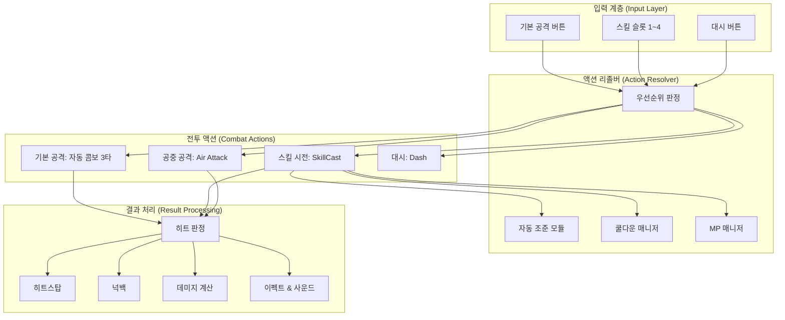
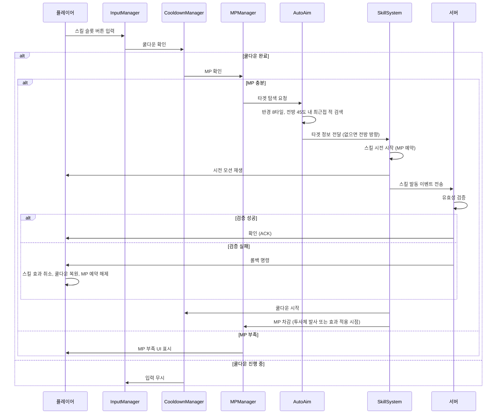

# 전투 액션 시스템 (Combat Action System)

## 구현 현황 (Implementation Status)

> **최근 업데이트:** 2026-03-23
> **문서 상태:** `작성 중 (Draft)`
> **3-Space:** World + Item World
> **기둥:** 탐험 + 야리코미

| 기능 ID    | 분류       | 기능명 (Feature Name)                | 우선순위 | 구현 상태    | 비고 (Notes)                  |
| :--------- | :--------- | :----------------------------------- | :------: | :----------- | :---------------------------- |
| CMB-01-A   | 기본 공격  | 자동 콤보 시스템 (3타)               |    P1    | 📅 대기      | 무기별 모션 차이               |
| CMB-01-B   | 기본 공격  | 공중 공격 (Air Attack)               |    P1    | 📅 대기      | 전방 + 하방 공격               |
| CMB-02-A   | 스킬       | 스킬 시전 프레임워크                 |    P1    | 📅 대기      | 4슬롯 + MP 소비 + 쿨다운 + 자동 조준 |
| CMB-02-B   | 스킬       | 스킬 카테고리별 발동 규칙            |    P1    | 📅 대기      | 근접/원거리/범위/버프          |
| CMB-02-C   | 스킬       | 스킬 시너지 시스템                   |    P2    | 📅 대기      | 원소 연계, 디버프 활용         |
| CMB-04-A   | 피격       | 피격 경직 (Hitstun) 시스템           |    P1    | 📅 대기      | 경직 + 넉백 + 무적             |
| CMB-04-B   | 피격       | 슈퍼 아머 (Super Armor)              |    P2    | 📅 대기      | 보스/강화 적 전용               |
| CMB-05-A   | 타격감     | 히트스탑 (Hitstop) 시스템            |    P1    | 📅 대기      | 2~4프레임 정지                 |
| CMB-05-B   | 타격감     | 넉백 물리 시스템                     |    P1    | 📅 대기      | 무게 기반 넉백 벡터            |
| CMB-06-A   | 전투 흐름  | 전투 상태 관리 (Combat State)        |    P1    | 📅 대기      | In-Combat / Out-of-Combat     |
| CMB-06-B   | 전투 흐름  | 자동 사냥 전투 AI                    |    P2    | 📅 대기      | 자동 사냥 모드 전투 로직       |

---

## 0. 필수 참고 자료 (Mandatory References)

* Writing Standards: `Documents/Terms/GDD_Writing_Rules.md`
* Project Definition: `Documents/Terms/Project_Vision_Abyss.md`
* 캐릭터 물리: `Documents/System/System_3C_Character.md`
* 조작 체계: `Documents/System/System_3C_Control.md`
* 데미지 시스템: `Documents/System/System_Combat_Damage.md`
* Game Overview: `Reference/게임 기획 개요.md`

---

## 1. 개요 (Concept)

### 1.1. 설계 의도 (Intent)

Project Abyss의 전투 액션 시스템은 다음 한 문장으로 정의한다:

> "버튼 하나로 시작하고, 스킬 조합으로 깊어지는 전투"

모바일 가상 패드와 PC 키보드 모두에서 동일한 전투 경험을 제공하는 것이 최우선 목표이다. 개별 액션은 단일 버튼 입력으로 완결되며, 전투의 깊이는 "어떤 스킬을 언제 사용할 것인가"라는 판단에서 발생한다.

### 1.2. 설계 근거 (Reasoning)

| 결정                           | 근거                                                                                      |
| :----------------------------- | :---------------------------------------------------------------------------------------- |
| 자동 콤보 3타                  | 모바일 터치에서 타이밍 기반 콤보는 불안정. 연타만으로 콤보 진행이 전투 흐름을 끊지 않음    |
| 스킬 4슬롯 원터치              | 방향키 조합 스킬(커맨드)은 가상 패드에서 오입력률이 높음. 단일 버튼 = 단일 스킬로 1:1 매핑 |
| 자동 조준                      | 터치 환경에서 정밀 조준 불가. 전투 쾌적성과 몰입감을 위해 타겟팅을 자동화                  |
| 백스텝/슬라이딩 공격 제거      | 방향키+버튼 동시 조합은 터치에서 오입력 유발. 단일 버튼 원칙에 위배                       |

### 1.3. 3대 기둥 정렬 (Pillar Alignment)

| 기둥                           | 전투 액션에서의 구현                                                                |
| :----------------------------- | :---------------------------------------------------------------------------------- |
| Metroidvania 탐험              | 해금 능력(이중 점프, 벽 점프)이 전투에서도 활용 가능. 수직 기동성으로 전투 공간 확장 |
| Item World 야리코미            | 무기 종류에 따른 기본 공격 모션 차이. 장비 성장이 스킬 위력/범위에 직접 반영         |
| Online 멀티플레이              | 역할 분담(탱커/딜러/서포터)이 스킬 빌드로 결정. 파티 시너지가 전투 깊이를 제공      |

### 1.4. 저주받은 문제 검증 (Cursed Problem Check)

| 문제                                                | 해결 방향                                                                           |
| :-------------------------------------------------- | :---------------------------------------------------------------------------------- |
| 자동 콤보가 전투를 단조롭게 만들지 않는가            | 기본 공격은 "딜 채우기"용. 진짜 전투는 스킬 4개의 조합/순서/타이밍 관리에서 발생    |
| 스킬 4개로 전투 다양성이 충분한가                    | 무기별 기본 공격 차이 + 스킬 수십 종 중 4개 선택 = 빌드 다양성. 슬롯 제한이 곧 전략 |
| 자동 조준이 플레이어 스킬을 무의미하게 만들지 않는가 | 자동 조준은 타겟 선택만 자동화. 위치 선정, 스킬 타이밍, 쿨다운 관리는 플레이어 판단 |
| 자동 사냥에서 스킬 AI가 직접 플레이보다 효율적이면?  | 자동 사냥 AI의 스킬 사용 효율에 상한(60%)을 설정. 직접 플레이 유인을 유지           |

### 1.5. 위험과 보상 (Risk & Reward)

| 행동              | 위험 (Risk)                            | 보상 (Reward)                         |
| :---------------- | :------------------------------------- | :------------------------------------ |
| 기본 공격 연타    | 사거리 내 진입 필요, 3타 후딜 존재     | 안정적 DPS, 쿨다운 없는 지속 딜       |
| 스킬 시전 (free)  | MP 소비 + 쿨다운 소비                            | 높은 즉시 데미지 + 이동 유지          |
| 스킬 시전 (slow)  | MP 소비 + 쿨다운 소비 + 이동 속도 50% 감소       | 중범위 강공격                         |
| 스킬 시전 (lock)  | MP 소비 + 쿨다운 소비 + 이동 불가 + 피격 위험    | 최대 범위/위력 스킬                   |
| 공중 공격         | 착지 타이밍 노출                       | 상공 회피 + 하방 공격 바운스          |
| 스킬 연계 (콤보)  | 복수 MP + 쿨다운 동시 소비                  | 원소 연계 보너스, 디버프 중첩 활용    |
| 대시 (회피)       | 쿨다운 2초 소비, 공중 1회 제한         | i-frame으로 적 공격 회피, 3타 후딜 캔슬로 안전한 이탈 |

---

## 2. 메커닉 (Mechanics)

### 2.1. 전투 액션 구조도 (Combat Action Architecture)



### 2.2. 기본 공격 (Basic Attack)

기본 공격은 플레이어의 주요 지속 딜링 수단이다. 스킬 쿨다운 사이를 채우는 역할을 한다.

#### 자동 콤보 시스템 (Auto Combo System)

```mermaid
stateDiagram-v2
    [*] --> Idle

    Idle --> Combo1 : 공격 버튼 입력
    Combo1 --> Combo2 : 공격 버튼 입력 (combo_window_ms 이내)
    Combo2 --> Combo3 : 공격 버튼 입력 (combo_window_ms 이내)
    Combo3 --> CooldownLag : 3타 완료

    Combo1 --> Idle : combo_window_ms 초과 (입력 없음)
    Combo2 --> Idle : combo_window_ms 초과 (입력 없음)
    CooldownLag --> Idle : combo_end_lag_ms 경과

    note right of Combo1 : 1타: 전방 수평 타격\n히트박스 29x19px
    note right of Combo2 : 2타: 전방 수평 타격 (확장)\n히트박스 34x19px
    note right of Combo3 : 3타: 전방 강타격 (넓은 범위)\n히트박스 38x24px
    note right of CooldownLag : 3타 후 경직\ncombo_end_lag_ms 동안 공격 불가
```

* 공격 버튼을 반복 입력하면 1타 -> 2타 -> 3타가 자동으로 연결된다.
* 각 타격 간격은 `combo_window_ms`(400ms) 이내에 다음 입력이 있어야 연결된다.
* 각 타격 사이에 `basic_attack_interval_ms`(300ms)의 최소 간격이 존재한다. 이 간격 내 입력은 버퍼에 저장되어 간격 종료 시 즉시 실행된다.
* 3타 완료 후 `combo_end_lag_ms`(600ms) 동안 기본 공격이 불가하다. 스킬은 사용 가능하다. 이 후딜은 전투 리듬의 "숨 쉴 틈"이자 적의 반격 기회를 보장하는 설계 장치이다(`Design_Combat_Philosophy.md` 참조).
* 콤보 진행 중 이동이 가능하다 (이동 속도 80%).

#### 무기별 기본 공격 모션 (Weapon-Specific Attack Motions)

| 무기 카테고리 | 1타              | 2타              | 3타                  | 특성                  |
| :------------ | :--------------- | :--------------- | :------------------- | :-------------------- |
| 검 (Sword)    | 수평 베기        | 대각 베기        | 수평 대회전          | 표준형, 밸런스        |
| 창 (Spear)    | 전방 찌르기      | 대각 올려치기    | 전방 돌진 찌르기     | 긴 사거리, 좁은 범위  |
| 도끼 (Axe)    | 수직 내려치기    | 횡 스윙         | 대지 강타 (충격파)   | 느림, 높은 단발 딜    |
| 채찍 (Whip)   | 전방 채찍질      | 상방 채찍질      | 전방 연속 채찍       | 넓은 사거리, 낮은 딜  |
| 지팡이 (Staff)| 전방 에너지볼    | 전방 관통 빔     | 전방 확산탄          | 원거리, 마법 피해     |
| 너클 (Knuckle)| 좌잽             | 우스트레이트     | 어퍼컷 (띄우기)      | 최단 사거리, 최고 DPS |
| 활 (Bow)      | 전방 화살 1발    | 전방 화살 2발    | 전방 관통 화살       | 원거리, 연사          |
| 대검 (Greatsword)| 대회전        | 수직 강타        | 전방 돌진 대회전     | 넓은 범위, 느린 속도  |

각 무기의 히트박스 크기, 활성 프레임, 피해 배율은 `Content_Stats_Weapon_List.csv`에서 참조한다.

### 2.3. 공중 공격 (Air Attack)

* 공중 상태(Jump, Fall, DoubleJump)에서 공격 버튼 입력 시 공중 공격을 실행한다.
* 공중 공격은 콤보가 아닌 단일 타격이다.
* 공중 공격 종류:
  * **전방 공격**: 기본. 캐릭터 전방 히트박스(29x24px) 활성화.
  * **하방 공격**: 아래 방향 입력 + 공격 버튼. 캐릭터 하방 히트박스(19x29px) 활성화. 적 또는 지면에 닿으면 캐릭터가 위로 바운스한다 (`air_attack_bounce_force`).
* 공중 공격 후 착지까지 추가 공격이 불가하다 (공중 공격 1회 제한).

### 2.4. 스킬 시전 (SkillCast)

스킬은 전투의 핵심 깊이를 제공하는 메인 액션이다. 상세 규칙은 `System_3C_Control.md`의 스킬 슬롯 시스템과 연동된다.

#### 스킬 카테고리 (Skill Categories)

| 카테고리         | 설명                                | 이동 설정  | 쿨다운 범위   | MP 소비 범위 | 예시                        |
| :--------------- | :---------------------------------- | :--------- | :------------ | :----------- | :-------------------------- |
| 근접 액티브      | 캐릭터 주변/전방에 즉시 피해        | free       | 3~6초         | 15~30        | 검기 방출, 어퍼컷, 회전 베기 |
| 원거리 액티브    | 투사체 발사, 자동 조준 적용         | free/slow  | 5~10초        | 25~45        | 파이어볼, 빙결 화살, 전격   |
| 범위 액티브      | 넓은 범위에 피해 또는 상태이상      | slow/lock  | 8~15초        | 40~70        | 대지 강타, 메테오, 블리자드 |
| 버프 액티브      | 자신 또는 파티원에게 일시적 강화    | free       | 10~15초       | 30~50        | 공격력 증가, 속도 증가, 보호막 |
| 소환 액티브      | 일정 시간 동안 소환물 배치          | free       | 12~15초       | 50~70        | 포탑, 함정, 소환수          |

#### 스킬 시전 흐름 (SkillCast Flow)



#### 스킬 시전 규칙

1. 스킬 슬롯 버튼 입력 시, 해당 슬롯에 장착된 스킬의 쿨다운이 완료 상태여야 시전한다.
2. 스킬 시전 중 다른 스킬은 사용할 수 없다 (스킬 시전 시간 종료 후 다음 스킬 가능).
3. 스킬 시전 중 피격 시 스킬이 캔슬되고 Hit 상태로 전이한다. 시전 모션 중 피격이면 쿨다운을 소비하지 않는다 (시전 실패 보호). 투사체 발사 후 피격이면 쿨다운을 소비한다.
4. 각 스킬은 `movement_during_cast` 속성에 따라 시전 중 이동 규칙이 결정된다 (free / slow / lock).
5. 공중에서도 스킬 시전이 가능하다. 공중 시전 시 중력은 정상 적용된다.
6. 스킬 시전 시 해당 스킬의 MP 비용을 소비한다. MP가 부족하면 시전하지 않고 'MP 부족' UI를 표시한다.
7. 시전 모션 중 피격으로 스킬이 캔슬된 경우, MP를 소비하지 않는다 (쿨다운과 동일한 시전 실패 보호). 투사체 발사 후 피격 시 MP는 소비된다.
8. 기본 공격과 대시는 MP를 소비하지 않는다.

### 2.5. 피격 시스템 (Hit Reaction System)

#### 피격 경직 (Hitstun)

피격 시 대상은 `hitstun_duration_ms` 동안 모든 행동이 불가한 Hit 상태에 진입한다.

| 피격 원인          | 경직 시간 (ms) | 비고                                    |
| :----------------- | :------------- | :-------------------------------------- |
| 기본 공격 1~2타    | 200            | 짧은 경직, 콤보 연결을 위한 최소 경직   |
| 기본 공격 3타      | 350            | 피니시 타격, 긴 경직                    |
| 스킬 (일반)        | 300            | 스킬별 개별 설정 가능                   |
| 스킬 (대형)        | 500            | lock 스킬의 강력한 경직                 |
| 보스 공격          | 400~600        | 보스별 개별 설정                        |

#### 넉백 (Knockback)

피격 시 공격 방향으로 넉백이 적용된다.

1. 넉백 초기 속도: 공격의 `knockback_force` 값.
2. 넉백 방향: 공격자 -> 피격자 방향의 수평 벡터. 특정 공격은 수직 성분을 포함한다 (띄우기).
3. 넉백 감쇠: 매 프레임 `knockback_decay`(0.85)를 곱하여 감속.
4. 넉백 중 벽 충돌: 벽에 닿으면 넉백 즉시 정지. 추가 벽 충돌 피해는 없다.
5. 무게 계수: 대상의 `weight` 값이 넉백 초기 속도에 반비례한다. `actual_knockback = knockback_force / weight`.

#### 무적 시간 (Invincibility After Hit)

1. 피격 경직 종료 후 `invincibility_after_hit_ms`(500ms) 동안 피격 판정을 무시한다.
2. 무적 시간 중 캐릭터가 점멸(깜빡임) 이펙트를 표시한다 (100ms 간격).

#### 슈퍼 아머 (Super Armor)

일부 보스 및 강화 적은 슈퍼 아머 상태를 보유한다.

1. 슈퍼 아머 상태에서는 피격 경직이 적용되지 않는다 (공격을 맞아도 행동이 중단되지 않음).
2. 넉백은 `super_armor_knockback_reduction`(0.2) 배율로 감소한다.
3. 데미지는 정상 적용된다.
4. 슈퍼 아머 게이지: 일정 피해를 누적하면 슈퍼 아머가 깨진다 (`super_armor_hp`). 깨진 후 `super_armor_break_stun_ms` 동안 무방비 상태.

### 2.6. 히트스탑 (Hitstop)

타격감을 제공하는 핵심 피드백 요소이다.

1. 공격이 적에 적중하면 공격자와 피격자 모두 `hitstop_frames` 동안 프레임이 정지한다.
2. 히트스탑 동안 게임 로직(쿨다운, 버프 지속 시간 등)은 정상 진행된다. 물리(이동, 중력)만 정지한다.
3. 히트스탑 프레임 수는 공격의 위력에 비례한다.

| 공격 강도       | 히트스탑 (프레임) | 적용 상황                         |
| :-------------- | :---------------- | :-------------------------------- |
| 약 (Light)      | 2                 | 기본 공격 1~2타                   |
| 중 (Medium)     | 3                 | 기본 공격 3타, 일반 스킬          |
| 강 (Heavy)      | 4                 | 대형 스킬, 보스 공격              |
| 극강 (Critical) | 6                 | 크리티컬 히트, 슈퍼 아머 파괴     |

### 2.7. 전투 상태 관리 (Combat State)

| 상태                | 진입 조건                           | 해제 조건                              | 효과                              |
| :------------------ | :---------------------------------- | :------------------------------------- | :-------------------------------- |
| Out-of-Combat       | 기본 상태                           | -                                      | HP 자동 회복 활성화               |
| In-Combat            | 적에게 피해를 주거나 받음, 대시 사용 | 마지막 전투 행동 후 `combat_exit_ms` 경과 | HP 자동 회복 비활성화            |

* `combat_exit_ms`(5000ms): 마지막 전투 행동(피격/공격) 후 5초간 추가 전투 행동이 없으면 Out-of-Combat로 전이.
* Out-of-Combat 상태에서 HP가 `hp_regen_threshold`(70%) 이하이면 초당 `hp_regen_rate`(최대HP의 2%)로 회복한다.
* 아이템계(Item World)에서는 Out-of-Combat HP 회복이 적용되지 않는다 (자원 관리 난이도 유지).
* Out-of-Combat 상태에서 MP가 `mp_regen_threshold`(50%) 이하이면 초당 `mp_regen_rate`(최대MP의 3%)로 회복한다.
* 아이템계(Item World)에서는 Out-of-Combat MP 회복이 적용되지 않는다 (자원 관리 난이도 유지). MP 회복은 포션, 미스터리 룸(병원), MP 회복 이노센트를 통해서만 가능하다.

### 2.8. 자동 사냥 전투 AI (Auto-Hunt Combat AI)

자동 사냥 모드에서의 전투 행동을 정의한다. 자동 사냥 해금 조건은 `System_Economy_AutoHunt.md`에서 정의한다.

#### 자동 사냥 AI 행동 우선순위

```text
1. HP가 30% 이하: 회복 스킬 사용 (있을 경우) 또는 안전 구역 이동
1.5. MP가 20% 이하: MP 포션 사용 불가 (자동 사냥 아이템 사용 금지). 기본 공격 위주 전환
2. 적의 공격 예고(Tell) 감지 시 대시 회피 시도 (쿨다운 완료 시)
3. 적이 사거리 내: 스킬 쿨다운 완료된 것부터 순차 사용
4. 모든 스킬 쿨다운 중: 기본 공격 실행
5. 적이 사거리 밖: 가장 가까운 적에게 이동
6. 적이 없음: 다음 스폰 지점으로 이동
```

#### 자동 사냥 AI 제한

| 항목                 | 제한                                  | 이유                          |
| :------------------- | :------------------------------------ | :---------------------------- |
| 스킬 사용 효율       | 최적 타이밍 대비 60%                  | 직접 플레이 유인 유지         |
| 원소 연계            | 연계 조합을 고려하지 않음             | 전략적 플레이와 차별화        |
| 아이템 사용          | 자동 사냥 중 소비 아이템 사용 불가    | 자원 소비 관리                |
| 대시 회피            | 자동 사냥 AI는 대시 타이밍 정확도가 60%로 제한 | 수동 플레이 유인 유지         |
| MP 관리              | MP 20% 이하 시 스킬 사용 중단, 기본 공격 전환 | MP 고갈로 인한 무력화 방지    |

---

## 3. 규칙 (Rules)

### 3.1. 전투 행동 우선순위 (Combat Action Priority)

동일 프레임에 복수 전투 행동이 요청될 때의 우선순위:

```text
스킬(Skill) > 기본 공격(Basic Attack)
```

* 스킬 시전 중에는 기본 공격이 불가하다.
* 기본 공격 콤보 중 스킬 입력 시 콤보를 캔슬하고 스킬을 시전한다.

### 3.2. 히트 판정 규칙 (Hit Detection Rules)

1. 공격의 히트박스와 대상의 허트박스가 AABB 방식으로 겹치면 히트로 판정한다.
2. 동일 공격의 히트박스는 동일 대상에 1회만 적중한다 (히트 리스트 관리).
3. 히트 판정은 매 프레임 수행한다.
4. 멀티 히트 공격(채찍 연속 타격, 범위 지속 스킬 등)은 `multi_hit_interval_frames`(10프레임) 간격으로 히트 리스트를 초기화한다.
5. 멀티플레이 환경에서 히트 판정은 공격자의 클라이언트에서 1차 판정 후, 서버에서 최종 검증한다.

### 3.3. 공격 상성 규칙 (Attack Interaction Rules)

| 상황                        | 결과                                                |
| :-------------------------- | :-------------------------------------------------- |
| 플레이어 공격 vs 적 공격    | 양쪽 모두 피해 적용 (공격은 상쇄되지 않음)          |
| 플레이어 투사체 vs 적 투사체 | 양쪽 투사체 소멸 (상쇄)                            |
| 플레이어 공격 vs 슈퍼아머 적 | 플레이어 공격 피해 적용, 적 경직 없음              |

### 3.4. 콤보 연결 규칙 (Combo Connection Rules)

1. 기본 공격 콤보는 자동 연결이므로 타이밍 입력이 불필요하다.
2. 기본 공격 3타 후 스킬로 연결하는 것은 가능하다 (`combo_end_lag_ms` 중에도 스킬 발동 가능).
3. 스킬 후 기본 공격으로 연결할 때, 스킬 시전 종료 직후 공격 입력으로 1타부터 시작한다.
4. 별도의 콤보 카운터나 콤보 보너스 시스템은 두지 않는다. 전투 깊이는 스킬 조합과 원소 시너지에서 발생한다. 스킬 연계(예: 빙결 상태 적에게 물리 강타 시 추가 피해)가 사실상 콤보 보너스를 대체한다.
5. 3타 완료 후 `combo_end_lag_ms` 경직 중 대시 입력 시 경직을 즉시 캔슬하고 Dash 상태로 전이한다. 이는 적의 반격을 회피하면서 안전하게 이탈하는 핵심 전술이다.

### 3.5. 스킬 시너지 규칙 (Skill Synergy Rules)

특정 스킬 조합은 추가 효과를 발생시킨다. 상세 원소 시스템은 `System_Combat_Elements.md`에서 정의한다.

| 시너지 조건                      | 추가 효과                                        |
| :------------------------------- | :----------------------------------------------- |
| 화염 스킬 -> 빙결 상태 적        | 증기 폭발: 범위 피해 + 빙결 해제                 |
| 번개 스킬 -> 수분 상태 적        | 감전 확산: 주변 적에게 연쇄 피해                 |
| 빙결 스킬 -> 화염 상태 적        | 열충격: 방어력 30% 감소 디버프                   |
| 물리 넉백 -> 벽 충돌             | 벽꿩 피해: 추가 고정 피해 발생                   |
| 띄우기 -> 공중 스킬              | 에어 콤보: 공중 피해 20% 보너스                  |

### 3.6. 멀티플레이 전투 규칙 (Multiplayer Combat Rules)

1. 아군 공격은 아군에게 피해를 주지 않는다 (No Friendly Fire).
2. 보스의 어그로(Aggro)는 누적 피해량 기반이다. 가장 많은 피해를 준 플레이어를 우선 타겟으로 한다.
3. 어그로 전환: 탱커 스킬(도발)로 강제 어그로 획득 가능.
4. 파티원이 피격 경직 중일 때 아군의 버프 스킬이 적용될 수 있다.
5. 아이템계에서 파티 전멸 시 현재 층 처음부터 재시작한다.

---

## 4. 데이터 & 파라미터 (Parameters)

### 4.1. 기본 공격 파라미터 (Basic Attack Parameters)

```yaml
basic_attack:
  # --- 콤보 시스템 (Combo System) ---
  combo_count: 3                       # 자동 콤보 최대 타수
  combo_window_ms: 400                 # 다음 타격 입력 허용 시간
  basic_attack_interval_ms: 300        # 각 타격 간 최소 간격
  combo_end_lag_ms: 600                # 3타 완료 후 공격 불가 경직
  combo_move_speed_multiplier: 0.8     # 콤보 진행 중 이동 속도 배율

  # --- 무기 공통 히트박스 (Weapon Common Hitbox) ---
  # 무기별 상세 수치는 Content_Stats_Weapon_List.csv 참조
  combo1_hitbox: { w: 29, h: 19, offset_x: 14, offset_y: -14 }
  combo2_hitbox: { w: 34, h: 19, offset_x: 16, offset_y: -14 }
  combo3_hitbox: { w: 38, h: 24, offset_x: 18, offset_y: -14 }

  # --- 공중 공격 (Air Attack) ---
  air_attack_hitbox: { w: 29, h: 24, offset_x: 14, offset_y: -10 }
  air_down_attack_hitbox: { w: 19, h: 29, offset_x: 0, offset_y: 4 }
  air_attack_bounce_force: 6.0         # px/frame, 하방 공격 바운스 상승력
  air_attack_limit: 1                  # 착지 전 공중 공격 최대 횟수

  # --- 피해 배율 (Damage Multiplier) ---
  combo1_damage_multiplier: 1.0        # 1타 피해 = ATK * 1.0
  combo2_damage_multiplier: 1.1        # 2타 피해 = ATK * 1.1
  combo3_damage_multiplier: 1.5        # 3타 피해 = ATK * 1.5
  air_attack_damage_multiplier: 1.2    # 공중 공격 피해
  air_down_damage_multiplier: 1.8      # 하방 공격 피해 (리스크 높음)

  # --- 대시 (Dash Combat) ---
  dash_cancel_combo_end_lag: true    # 3타 후딜 중 대시 캔슬 허용
  dash_auto_hunt_accuracy: 0.6      # 자동 사냥 AI 대시 회피 정확도 (60%)
```

### 4.2. 히트 리액션 파라미터 (Hit Reaction Parameters)

```yaml
hit_reaction:
  # --- 피격 경직 (Hitstun) ---
  hitstun_light_ms: 200                # 약공격 경직
  hitstun_medium_ms: 300               # 중공격 경직
  hitstun_heavy_ms: 500                # 강공격 경직
  hitstun_boss_ms: 400                 # 보스 공격 경직 (기본)

  # --- 넉백 (Knockback) ---
  knockback_force_light: 2.5           # px/frame, 약공격 넉백
  knockback_force_medium: 4.0          # px/frame, 중공격 넉백
  knockback_force_heavy: 6.5           # px/frame, 강공격 넉백
  knockback_decay: 0.85                # 매 프레임 감쇠 계수
  knockback_min_threshold: 0.3         # px/frame, 이 이하 시 넉백 종료

  # --- 무적 시간 (Invincibility) ---
  invincibility_after_hit_ms: 500      # 피격 후 무적
  invincibility_blink_interval_ms: 100 # 무적 중 점멸 간격

  # --- 무게 계수 (Weight) ---
  player_weight: 1.0                   # 플레이어 기본 무게
  enemy_weight_min: 0.5                # 적 최소 무게 (작은 적, 넉백 큼)
  enemy_weight_max: 5.0                # 적 최대 무게 (보스급, 넉백 작음)

  # --- 슈퍼 아머 (Super Armor) ---
  super_armor_knockback_reduction: 0.2 # 슈퍼 아머 시 넉백 배율
  super_armor_break_stun_ms: 1500      # 슈퍼 아머 파괴 시 무방비 시간
```

### 4.3. 히트스탑 파라미터 (Hitstop Parameters)

```yaml
hitstop:
  light_frames: 2                      # 약공격 히트스탑
  medium_frames: 3                     # 중공격 히트스탑
  heavy_frames: 4                      # 강공격 히트스탑
  critical_frames: 6                   # 크리티컬 히트스탑
  max_frames: 8                        # 히트스탑 최대 프레임 (누적 방지)
```

### 4.4. 전투 상태 파라미터 (Combat State Parameters)

```yaml
combat_state:
  combat_exit_ms: 5000                 # 전투 종료 판정까지 대기 시간
  hp_regen_threshold: 0.7              # Out-of-Combat HP 회복 임계값 (70%)
  hp_regen_rate_per_sec: 0.02          # 초당 HP 회복률 (최대HP의 2%)
  hp_regen_in_item_world: false        # 아이템계에서 자연 회복 비활성화
  mp_regen_threshold: 0.5              # Out-of-Combat MP 회복 임계값 (50%)
  mp_regen_rate_per_sec: 0.03          # 초당 MP 회복률 (최대MP의 3%)
  mp_regen_in_item_world: false        # 아이템계에서 MP 자연 회복 비활성화
```

### 4.5. 자동 사냥 AI 파라미터 (Auto-Hunt AI Parameters)

```yaml
auto_hunt_ai:
  skill_efficiency: 0.6                # 최적 대비 스킬 사용 효율 (60%)
  hp_retreat_threshold: 0.3            # HP 30% 이하 시 후퇴
  target_search_range_tiles: 12        # 적 탐색 반경
  idle_move_to_spawn: true             # 적 없을 시 스폰 지점으로 이동
  item_use_allowed: false              # 자동 사냥 중 아이템 사용 불가
  mp_skill_cutoff_threshold: 0.2       # MP 20% 이하 시 스킬 사용 중단
```

---

## 5. 예외 처리 (Edge Cases)

### 5.1. 공격 중 피격 충돌 (Attack-Hit Collision)

| 시나리오                                | 처리 방식                                                           |
| :-------------------------------------- | :------------------------------------------------------------------ |
| 기본 공격 1타 모션 중 피격              | 공격 캔슬, Hit 상태 전이. 1타 히트박스가 이미 적중했으면 그 피해 유효 |
| 스킬 시전 모션 중 피격                  | 스킬 캔슬, Hit 상태 전이. 쿨다운 미소비 (시전 실패 보호)            |
| 스킬 투사체 발사 후 피격                | Hit 상태 전이. 투사체는 유효 유지. 쿨다운 소비                      |
| 히트스탑 중 다른 적의 공격              | 히트스탑 중에는 추가 피격 판정 무시 (히트스탑 = 일시적 무적)        |
| 넉백 중 추가 공격                       | 무적 시간(500ms) 중이면 무시. 무적 종료 후면 새 Hit 적용            |
| 대시 중 피격 판정                       | 대시 i-frame 동안 모든 피격 판정 무시. 대시 종료 직후부터 정상 판정  |
| 대시 방향 벽 충돌                       | 대시 즉시 종료, 쿨다운은 소비. 벽에 고정 피해 없음                  |
| 대시와 넉백 동시 발생                   | 대시 우선. 대시 중에는 넉백이 적용되지 않음                         |
| 스킬 시전 모션 중 MP 소비 타이밍        | 스킬 시전 모션 시작 시점에서는 MP를 예약만 하고, 투사체 발사 또는 효과 적용 시점에 실제 차감한다. 모션 중 피격으로 캔슬 시 예약 해제 (MP 미소비) |

### 5.2. 자동 조준 예외 (Auto-Aim Edge Cases)

| 시나리오                                | 처리 방식                                                           |
| :-------------------------------------- | :------------------------------------------------------------------ |
| 스킬 시전 중 타겟 사망                  | 시전 시점 타겟 고정(lock-on). 타겟 소멸 시 마지막 위치 방향으로 발사 |
| 타겟이 벽 뒤로 이동                     | Line of Sight 실패 시 타겟 해제, 전방 직선 방향으로 전환            |
| 범위 내 적 다수                         | 최근접 적 우선. 거리 동일 시 캐릭터 전방 중심선에 가까운 적 우선    |
| 이동 입력 + 스킬 동시                   | 이동 입력 방향이 있으면 자동 조준 무시, 입력 방향으로 시전          |
| 아군 NPC가 범위 내                      | 아군은 자동 조준 대상에서 제외. 적만 타겟팅                         |

### 5.3. 멀티플레이 전투 동기화 예외 (Multiplayer Sync Edge Cases)

| 시나리오                                | 처리 방식                                                           |
| :-------------------------------------- | :------------------------------------------------------------------ |
| 클라이언트 히트 판정 vs 서버 불일치     | 서버 판정 우선. 클라이언트 예측 히트를 롤백                         |
| 두 플레이어가 동시에 적 처치            | 서버에서 먼저 도착한 처치 이벤트 우선. 후발 처치는 무효 처리        |
| 네트워크 지연으로 보스 페이즈 전환 불일치 | 서버 페이즈 상태를 권위로 사용. 클라이언트 페이즈 강제 동기화     |
| 파티원 접속 끊김 중 보스전              | 끊긴 파티원의 캐릭터를 AI가 대행 (기본 공격만 수행). 30초 내 재접속 시 복귀 |
| 어그로 테이블 동기화                    | 서버에서 어그로 테이블을 관리하고 주기적으로 브로드캐스트 (1초 간격) |

### 5.4. 자동 사냥 예외 (Auto-Hunt Edge Cases)

| 시나리오                                | 처리 방식                                                           |
| :-------------------------------------- | :------------------------------------------------------------------ |
| 자동 사냥 중 보스 등장                  | 자동 사냥 일시 중지, 보스 경고 UI 표시, 플레이어 수동 조작 요구     |
| 자동 사냥 중 HP 0                       | 자동 사냥 종료, 세이브 포인트 복귀                                  |
| 자동 사냥 중 네트워크 단절              | 자동 사냥 즉시 중지, 재접속 후 자동 사냥 재개하지 않음              |
| 자동 사냥 AI가 이동 불가 지형에 갇힘    | 5초간 이동 실패 시 가장 가까운 세이브 포인트로 텔레포트             |
| 자동 사냥 중 MP 고갈                    | 기본 공격으로 전환. MP 자연 회복 대기 (월드). 아이템계에서는 MP 회복 수단이 없으면 기본 공격만 수행 |

### 5.5. 공중 전투 예외 (Air Combat Edge Cases)

| 시나리오                                | 처리 방식                                                           |
| :-------------------------------------- | :------------------------------------------------------------------ |
| 하방 공격 바운스 중 천장 충돌           | 수직 속도 0으로 설정, 바운스 취소                                   |
| 하방 공격으로 원웨이 플랫폼 통과 시도   | 하방 공격은 원웨이 플랫폼을 관통하지 않음. 플랫폼 위에서 바운스     |
| 공중 공격 중 벽 점프 가능 여부          | 공중 공격 히트박스 활성 중에는 벽 점프 불가. 공격 종료 후 가능      |
| 공중 스킬 시전 중 착지                  | 스킬 시전 완료 후 착지 처리. 시전 중 착지해도 스킬은 캔슬되지 않음  |

---

## 검증 기준 (Verification Checklist)

* [ ] 기본 공격 3타 자동 콤보가 연타만으로 정상 연결되는가
* [ ] 콤보 윈도우(400ms) 초과 시 콤보가 리셋되는가
* [ ] 3타 후 경직(600ms) 동안 기본 공격이 불가하고 스킬은 사용 가능한가
* [ ] 무기 종류에 따라 기본 공격 모션과 히트박스가 차별화되는가
* [ ] 공중 공격이 1회로 제한되고 착지 시 초기화되는가
* [ ] 하방 공격 적중 시 바운스가 정상 동작하는가
* [ ] 스킬 시전 모션 중 피격 시 쿨다운이 소비되지 않는가 (시전 실패 보호)
* [ ] 자동 조준이 8타일/45도 내 최근접 적을 정확히 타겟팅하는가
* [ ] 히트스탑이 공격 강도에 따라 차별화되어 동작하는가
* [ ] 넉백이 무게 계수에 반비례하여 적용되는가
* [ ] 슈퍼 아머가 경직을 무시하고 넉백을 감소시키는가
* [ ] 슈퍼 아머 파괴 시 무방비 시간(1500ms)이 적용되는가
* [ ] 피격 후 무적 시간(500ms)이 정상 적용되는가
* [ ] In-Combat / Out-of-Combat 전환이 5초 기준으로 정상 동작하는가
* [ ] Out-of-Combat HP 회복이 70% 이하에서만 작동하는가
* [ ] 아이템계에서 HP 자연 회복이 비활성화되는가
* [ ] 자동 사냥 AI의 스킬 효율이 60%로 제한되는가
* [ ] 멀티플레이에서 아군 공격이 아군에게 피해를 주지 않는가
* [ ] 보스 어그로가 누적 피해량 기반으로 동작하는가
* [ ] 멀티플레이 히트 판정이 서버에서 최종 검증되는가
* [ ] 3타 후딜 중 대시 입력 시 즉시 Dash 상태로 전이하는가
* [ ] 대시 i-frame 동안 모든 피격 판정이 무시되는가
* [ ] 대시 쿨다운이 2초이며, 쿨다운 중 대시 입력이 무시되는가
* [ ] 공중 대시가 착지 전 1회만 가능한가
* [ ] 스킬 시전 시 MP가 정상적으로 소비되는가
* [ ] MP 부족 시 스킬 시전이 불가하고 'MP 부족' UI가 표시되는가
* [ ] 시전 모션 중 피격 시 MP가 소비되지 않는가 (시전 실패 보호)
* [ ] 기본 공격과 대시가 MP를 소비하지 않는가
* [ ] Out-of-Combat MP 회복이 50% 이하에서만 작동하는가
* [ ] 아이템계에서 MP 자연 회복이 비활성화되는가
* [ ] 자동 사냥 AI가 MP 20% 이하 시 기본 공격으로 전환하는가
