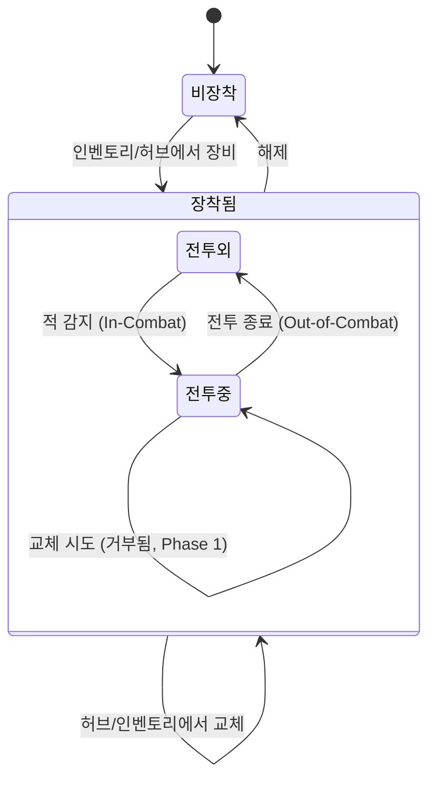

# 무기 시스템 (Combat Weapons System)

## 구현 현황 (Implementation Status)

> 최근 업데이트: 2026-03-23
> 문서 상태: `작성 중 (Draft)`
> 3-Space: 전체 (World + Item World + Hub)
> 기둥: 야리코미

| 기능 ID    | 분류         | 기능명 (Feature Name)                    | 우선순위 | 구현 상태 | 비고 (Notes)                                 |
| :--------- | :----------- | :--------------------------------------- | :------: | :-------- | :------------------------------------------- |
| WPN-01-A   | 무기 체계    | 무기 카테고리 8종 정의                   |    P1    | 대기      | 검/창/도끼/채찍/지팡이/너클/활/대검           |
| WPN-01-B   | 무기 체계    | 무기 차별화 3축 (사거리/속도/범위)       |    P1    | 대기      | Design_Combat_Philosophy.md D-09-E 연동       |
| WPN-02-A   | 검 (MVP)     | 검 3타 콤보 모션                         |    P0    | 대기      | 1타 수평/2타 대각/3타 대회전                  |
| WPN-02-B   | 검 (MVP)     | 검 히트박스 정의                         |    P0    | 대기      | 지상 3타 + 공중 전방/하방                     |
| WPN-02-C   | 검 (MVP)     | 검 레어리티별 기본 ATK                   |    P0    | 대기      | Common~Mythic 5등급                           |
| WPN-03-A   | 무기 슬롯    | 무기 1개 장착 규칙                       |    P0    | 대기      | 동시 다중 장착 불가                           |
| WPN-03-B   | 무기 교체    | 전투 중 무기 교체 불가 (MVP)             |    P1    | 대기      | Phase 2에서 교체 허용으로 변경 예정            |
| WPN-04-A   | 나머지 7종   | 창/도끼/채찍/지팡이/너클/활/대검 구현    |    P2    | 대기      | Phase 2 구현                                  |
| WPN-04-B   | 무기 스킬    | 무기별 고유 스킬 연동                    |    P2    | 대기      | Phase 2 구현                                  |

---

## 0. 필수 참고 자료 (Mandatory References)

* Writing Standards: `Documents/Terms/GDD_Writing_Rules.md`
* Project Vision: `Documents/Terms/Project_Vision_Abyss.md`
* 전투 액션 시스템: `Documents/System/System_Combat_Action.md` (자동 콤보 상세, 무기 모션 테이블)
* 전투 설계 철학: `Documents/Design/Design_Combat_Philosophy.md` (무기 차별화 3축, 타격감 원칙)
* 데미지 시스템: `Documents/System/System_Combat_Damage.md`
* 장비 슬롯: `Documents/System/System_Equipment_Slots.md`
* 장비 레어리티: `Documents/System/System_Equipment_Rarity.md`
* 아이템계 역기획서: `Reference/Disgaea_ItemWorld_Reverse_GDD.md`
* 캐슬바니아 시스템 분석: `Reference/캐슬바니아 시스템 분석.md`
* Game Overview: `Reference/게임 기획 개요.md`
* 무기 수치 데이터: `Sheets/Content_Stats_Weapon_List.csv` (히트박스, 프레임, 배율 SSoT)

---

## 1. 개요 (Concept)

### 1.1. 설계 의도 (Intent)

Project Abyss의 무기 시스템은 다음 한 문장으로 정의한다:

> "무기 하나를 고르는 순간, 전투의 언어가 결정된다"

무기는 단순한 ATK 수치 컨테이너가 아니다. 무기 카테고리가 기본 공격의 사거리, 타격 속도, 커버 범위를 전부 결정하며, 이는 플레이어의 전투 포지셔닝과 위험 감수 방식에 직접 영향을 미친다. 검을 든 캐릭터와 창을 든 캐릭터는 같은 스킬을 사용해도 서로 다른 방식으로 싸운다.

야리코미 기둥과의 정렬: 아이템계에서 획득·강화된 무기가 전투 경험의 핵심 차별화 요소가 된다. 무기 레어리티가 오를수록 ATK가 증가하고, ATK 증가는 스탯 게이트 해금으로 이어져 탐험 범위가 확장된다. 이 순환이 야리코미의 동력이다.

### 1.2. 설계 근거 (Reasoning)

| 결정                             | 근거                                                                                                                       |
| :------------------------------- | :------------------------------------------------------------------------------------------------------------------------- |
| 무기 카테고리 8종으로 고정        | 월하의 야상곡 분석 결과, 무기 종류가 많을수록 학습 비용이 상승한다. 8종은 다양성과 학습 비용의 균형점이다                   |
| MVP는 검 1종만 구현              | 핵심 콤보 루프의 재미 검증이 Phase 1 목표다. 검은 3축 모두 중간값이어서 다른 무기 밸런스의 기준점(Baseline)이 된다         |
| 무기 1개 장착 제한               | 동시 다중 장착을 허용하면 빌드 복잡도가 급증하고, 아이템계에서 "어느 무기를 강화할 것인가"라는 야리코미의 핵심 선택이 희석된다 |
| 전투 중 교체 불가 (MVP)          | Phase 1에서 무기 교체 로직 구현 비용 대비 재미 기여가 낮다. 교체 허용은 Phase 2에서 야리코미와 연계하여 설계한다           |
| 차별화 3축: 사거리/속도/범위     | 3축은 독립 변수이면서 상호 트레이드오프 관계다. 축 하나를 올리면 다른 축에 제약이 생겨 자연스러운 무기 개성이 형성된다     |

### 1.3. 3대 기둥 정렬 (Pillar Alignment)

| 기둥                    | 무기 시스템에서의 구현                                                                                    |
| :---------------------- | :-------------------------------------------------------------------------------------------------------- |
| 메트로베니아 탐험       | 무기 종류(근/원거리)가 특정 지형 지물이나 적 배치에서의 접근 방식을 결정. 능력 게이트는 아니나 전술 선택지를 넓힘 |
| 아이템계 야리코미       | 무기마다 고유한 아이템계를 보유. 무기 레어리티 승급 = ATK 성장 = 새 구역 접근. 야리코미의 직접 동력          |
| 온라인 멀티플레이       | 파티 내 무기 구성이 역할 분담을 형성. 근접 딜러(검/너클) + 원거리 딜러(활/지팡이) + 유틸(채찍)의 자연스러운 포지션 |

### 1.4. 저주받은 문제 검증 (Cursed Problem Check)

| 문제                                                             | 해결 방향                                                                                                                         |
| :--------------------------------------------------------------- | :-------------------------------------------------------------------------------------------------------------------------------- |
| 무기 1개 제한이 빌드 다양성을 제한하지 않는가                     | 빌드 다양성은 무기 종류가 아닌 "어떤 스킬 4개를 선택하는가"에서 확보한다. 무기는 기본 공격의 언어만 결정한다                       |
| 검이 너무 밸런스 잡혀 있어 다른 무기 선택 동기가 약해지지 않는가  | 검은 기준점(Baseline)이다. 창은 더 안전한 원거리를 원할 때, 너클은 극한 DPS를 원할 때, 대검은 군중제어를 원할 때 선택된다. 상황별 최적 무기가 다르다 |
| 전투 중 교체 불가가 답답하지 않은가                               | 적 조합보다 플레이어의 빌드 숙련도가 전투를 결정하는 구조로 설계한다. "내가 가진 무기로 어떻게 이길 것인가"가 전투의 중심 질문이다  |
| 검 MVP 이후 다른 무기 추가 시 밸런스 붕괴 위험                    | 검의 파라미터를 Baseline(값 1.0)으로 고정하고, 다른 무기를 상대적 배율로 설계한다. 새 무기 추가 시 배율 조정만으로 밸런스 유지 가능 |

### 1.5. 위험과 보상 (Risk & Reward)

| 행동                          | 위험 (Risk)                                               | 보상 (Reward)                                           |
| :---------------------------- | :-------------------------------------------------------- | :------------------------------------------------------ |
| 근접 무기(검/너클) 선택       | 적과의 거리를 좁혀야 하므로 피격 위험 높음                 | 높은 DPS, 확실한 타격감                                  |
| 원거리 무기(활/지팡이) 선택   | 낮은 단타 데미지, 투사체 회피 적 상대 시 효율 저하         | 안전 거리 유지, 대형 적 상대 시 전략적 우위              |
| 도끼/대검 선택 (느린 무기)    | 느린 속도로 인해 콤보 중 반격 노출 시간이 길다             | 높은 단발 데미지, 넓은 히트박스으로 다수 적 동시 처리    |
| 고레어리티 무기 아이템계 진입 | 높은 층수, 강한 적, 전멸 시 진행 손실                      | 높은 ATK, 더 많은 이노센트 슬롯, 레어리티 승급 가능성   |
| 동일 무기 장기 사용            | 다른 무기 아이템계를 탐험하지 못함                         | 해당 무기 아이템계 숙련, 특정 이노센트 라인 완성 가능    |

---

## 2. 메커닉 (Mechanics)

### 2.1. 무기 카테고리 체계 (Weapon Category System)

8종의 무기 카테고리는 차별화 3축(사거리/속도/범위)으로 각자의 위치를 갖는다. 각 축은 1(최저)부터 5(최고)까지의 등급으로 표현한다.

| 카테고리        | 사거리 | 속도 | 범위 | DPS 위치       | 기본 공격 특성                  | 구현 Phase |
| :-------------- | :----: | :--: | :--: | :------------- | :------------------------------ | :--------: |
| 검 (Sword)      |   3    |  3   |  3   | 중간           | 표준형, 모든 축 밸런스           | Phase 1    |
| 창 (Spear)      |   5    |  3   |  2   | 중간           | 긴 사거리, 좁은 범위, 찌르기 특화 | Phase 2    |
| 도끼 (Axe)      |   2    |  1   |  3   | 높은 단발 딜   | 느림, 수직 공격, 충격파 연계     | Phase 2    |
| 채찍 (Whip)     |   4    |  2   |  4   | 낮음           | 넓은 사거리, 다단 히트, 낮은 딜  | Phase 2    |
| 지팡이 (Staff)  |   5    |  3   |  4   | 원거리 마법    | 원거리 투사체, 마법 피해 전용    | Phase 2    |
| 너클 (Knuckle)  |   1    |  5   |  2   | 최고 DPS       | 최단 사거리, 최고 공격 속도      | Phase 2    |
| 활 (Bow)        |   5    |  4   |  2   | 원거리 연사    | 원거리 투사체, 연사 특화         | Phase 2    |
| 대검 (Greatsword)|  3    |  1   |  5   | 높은 광역 딜   | 최대 범위, 최저 속도, 광역 제압   | Phase 2    |

### 2.2. 무기 차별화 3축 정의 (3-Axis Differentiation)

무기 카테고리는 사거리, 속도, 범위 세 축의 고유한 조합으로 차별화된다. 이 세 축은 독립 변수이며, 축 하나가 극단값일 때 다른 축이 제약을 받는 자연스러운 트레이드오프 관계를 형성한다.

| 축           | 정의                                                                   | 플레이에서의 의미                                                    |
| :----------- | :--------------------------------------------------------------------- | :------------------------------------------------------------------- |
| 사거리(Range) | 기본 공격 히트박스의 캐릭터 기준 최대 도달 거리                        | 사거리가 길수록 안전하게 공격할 수 있으나, 일반적으로 DPS가 낮아진다  |
| 속도(Speed)  | 1타에서 3타까지 완료되는 콤보 사이클의 총 시간. 짧을수록 빠름           | 속도가 빠를수록 DPS가 높아지나, 사거리와 범위가 줄어드는 경향이 있다  |
| 범위(Area)   | 히트박스가 커버하는 수직/수평 면적. 다수 적 동시 히트 가능성            | 범위가 넓을수록 군중 처리에 유리하나, 단타 위력이 낮아지는 경향이 있다 |

### 2.3. 검(Sword) 기본 공격 상세 (Sword Basic Attack Detail)

검은 Phase 1 MVP 무기이며, 3축 모두 중간값을 가지는 Baseline 무기이다. 다른 모든 무기 카테고리의 파라미터는 검의 수치를 기준으로 상대적 배율로 설계된다.

#### 지상 3타 콤보 모션

| 타격 | 모션명       | 방향          | 히트박스 (px) | 특징                                                    |
| :--- | :----------- | :------------ | :------------ | :------------------------------------------------------ |
| 1타  | 수평 베기    | 전방 수평     | 29 x 19       | 빠른 진입 타격. 콤보 시작의 기준 타격                    |
| 2타  | 대각 베기    | 전방 대각(하) | 34 x 19       | 1타보다 수평 범위 확장. 낮게 위치한 적 포함               |
| 3타  | 수평 대회전  | 전방 광역     | 38 x 24       | 3축 최대 범위. 강타 판정. 콤보 마무리. 이후 후딜 발생     |

콤보 흐름 규칙은 `System_Combat_Action.md` 2.2절(자동 콤보 시스템)을 따른다.

#### 공중 공격 모션

| 종류          | 입력 조건                   | 히트박스 (px) | 특징                                                  |
| :------------ | :-------------------------- | :------------ | :---------------------------------------------------- |
| 공중 전방 공격 | 공중 상태 + 공격 버튼       | 29 x 24       | 전방 타격. 지상 1타보다 수직 범위 소폭 확장            |
| 공중 하방 공격 | 공중 상태 + 하방 입력 + 공격 | 19 x 29       | 하방 타격. 적 또는 지면 충돌 시 캐릭터 상방 바운스 발생 |

### 2.4. 무기 슬롯 및 교체 규칙 (Weapon Slot & Swap Rules)

플레이어는 무기 슬롯 1개를 보유하며, 한 번에 무기 1개만 장착할 수 있다.



| 상태        | 무기 장착 | 무기 교체 | 근거                                                       |
| :---------- | :-------: | :-------: | :--------------------------------------------------------- |
| 허브        | 가능      | 가능      | 전투 외 공간. 제약 없음                                     |
| 월드(전투외) | 가능      | 가능      | In-Combat 진입 전까지 허용                                  |
| 월드(전투중) | 불가      | 불가      | MVP 단순화. 무기 선택을 진입 전 의사결정으로 고정           |
| 아이템계(전투외) | 가능  | 가능      | 층간 이동 시 허용                                           |
| 아이템계(전투중) | 불가  | 불가      | MVP 단순화. Phase 2에서 교체 허용으로 변경 예정             |

---

## 3. 규칙 (Rules)

### 3.1. 무기 장착 규칙 (Weapon Equip Rules)

1. 플레이어는 무기 슬롯 1개를 보유한다. 동시에 2개 이상의 무기를 장착할 수 없다.
2. 무기 슬롯이 비어 있는 상태에서는 기본 공격 버튼 입력이 무시된다. (맨주먹 공격 없음)
3. 무기 장착/해제는 인벤토리 UI 또는 허브의 장비 창에서만 수행할 수 있다.
4. 무기 장착 즉시 기본 공격 모션이 해당 무기의 모션으로 전환된다.

### 3.2. 전투 중 교체 불가 규칙 (No Mid-Combat Swap Rules, MVP)

1. In-Combat 상태(적 감지 범위 내)에서 무기 교체 시도 시, 시스템이 이를 거부하고 UI 피드백(아이콘 잠금 표시)을 반환한다.
2. 전투 중 교체 불가 상태는 Out-of-Combat 전환 후 3초 경과 시 해제된다. (전투 종료 딜레이, `out_of_combat_delay_s` 파라미터)
3. Phase 2에서 전투 중 교체를 허용할 경우, 교체 모션 중 이동 속도 감소 및 무적 해제 페널티를 부여하여 리스크를 확보한다.

### 3.3. 검 콤보 히트박스 활성화 규칙 (Sword Hitbox Activation Rules)

히트박스 활성화와 비활성화는 프레임 단위로 정의된다. 구체적인 활성/비활성 프레임은 `Sheets/Content_Stats_Weapon_List.csv`의 `active_frames` 컬럼을 따른다.

1. 각 타격의 히트박스는 해당 타격 모션의 활성 프레임(Active Frames) 동안에만 판정된다.
2. 동일 타격(같은 타 번호)의 히트박스는 하나의 적에게 1회만 판정된다. (다단 히트 없음, 검 기준)
3. 3타 히트박스는 1타, 2타보다 수평/수직 범위가 넓으며, 후딜(`combo_end_lag_ms`) 진입 전까지만 유효하다.
4. 공중 공격 히트박스는 착지 또는 추가 입력(다른 공격/스킬/대시)이 발생하면 즉시 비활성화된다.
5. 공중 하방 공격이 적 또는 지형에 닿으면 히트박스를 즉시 비활성화하고 바운스 물리를 적용한다.

### 3.4. 무기 레어리티와 ATK 규칙 (Weapon Rarity & ATK Rules)

1. 무기 카테고리별 기본 ATK는 레어리티가 상승할수록 증가한다. 레어리티 체계는 `System_Equipment_Rarity.md`를 따른다.
2. 기본 ATK는 이노센트, 강화, 세공이 적용되기 전의 순수 수치이다.
3. 레어리티가 동일한 경우, 무기 카테고리 간 기본 ATK는 동일하다. 카테고리 간 전투 성능 차이는 히트박스 크기, 콤보 속도, 다단 히트 횟수를 통해 발생하며 ATK 수치로는 발생하지 않는다.
4. 검의 레어리티별 기본 ATK는 섹션 4.1의 파라미터를 따른다.

### 3.5. 3-Space별 무기 작동 규칙 (Per-Space Weapon Rules)

| 공간        | 적용 규칙                                                                                                      |
| :---------- | :------------------------------------------------------------------------------------------------------------- |
| 월드        | 무기의 기본 ATK가 스탯 게이트 해금에 직접 참여. 장비된 무기의 ATK가 플레이어 STR 스탯에 합산됨                  |
| 아이템계    | 장비된 무기의 ATK가 적용된 상태로 진입. 아이템계 내 획득 무기는 귀환 후 인벤토리에 등록. 전투 규칙은 월드와 동일 |
| 허브        | 전투 없음. 무기 장착/해제/확인만 허용. ATK는 다른 플레이어에게 표시되는 장비 정보에 포함됨                      |

---

## 4. 데이터 & 파라미터 (Parameters)

### 4.1. 검(Sword) 레어리티별 기본 ATK

```yaml
# 검(Sword) 레어리티별 기본 ATK
# SSoT: Sheets/Content_Stats_Weapon_List.csv
# 다른 무기 카테고리는 동일 레어리티에서 검과 동일한 기본 ATK를 가진다.
# 카테고리 간 성능 차이는 hitbox, combo_speed, hit_count으로만 발생한다.

sword_base_atk_by_rarity:
  Common:    15
  Uncommon:  20
  Rare:      26
  Legendary: 33
  Mythic:    45
```

### 4.2. 검(Sword) 히트박스 파라미터

```yaml
# 검(Sword) 히트박스 정의 (단위: px)
# width: 전방(수평) 방향 크기
# height: 수직 방향 크기
# offset_x: 캐릭터 중심에서 히트박스 중심까지의 수평 거리 (방향에 따라 부호 반전)
# SSoT: Sheets/Content_Stats_Weapon_List.csv

sword_hitboxes:
  combo_1:
    width: 29
    height: 19
    offset_x: 14   # 캐릭터 전방
    offset_y: 0    # 캐릭터 중심 수직 기준

  combo_2:
    width: 34
    height: 19
    offset_x: 17
    offset_y: -4   # 대각 하방 성분 반영 (2px 아래)

  combo_3:
    width: 38
    height: 24
    offset_x: 19
    offset_y: 0    # 수평 대회전, 수직 중심

  air_forward:
    width: 29
    height: 24
    offset_x: 14
    offset_y: 0

  air_downward:
    width: 19
    height: 29
    offset_x: 0
    offset_y: -14  # 캐릭터 하방
```

### 4.3. 무기 카테고리 차별화 3축 기준값

```yaml
# 무기 차별화 3축 기준값 (검이 Baseline = 1.0)
# 다른 카테고리 수치는 검 대비 상대적 배율이다.
# Phase 2 구현 시 이 배율을 기반으로 히트박스와 프레임을 역산한다.
# SSoT: Sheets/Content_Stats_Weapon_List.csv

weapon_axis_multiplier:
  Sword:
    range:  1.0   # Baseline
    speed:  1.0   # Baseline
    area:   1.0   # Baseline

  Spear:
    range:  1.7   # 긴 사거리
    speed:  1.0
    area:   0.6   # 좁은 범위

  Axe:
    range:  0.7
    speed:  0.4   # 매우 느림
    area:   1.0

  Whip:
    range:  1.4
    speed:  0.7
    area:   1.4   # 넓은 범위

  Staff:
    range:  1.8   # 원거리 투사체
    speed:  1.0
    area:   1.3

  Knuckle:
    range:  0.3   # 최단 사거리
    speed:  1.8   # 최고 속도
    area:   0.6

  Bow:
    range:  1.8
    speed:  1.4   # 연사
    area:   0.6

  Greatsword:
    range:  1.0
    speed:  0.3   # 최저 속도
    area:   1.8   # 최대 범위
```

### 4.4. 전투 중 교체 관련 파라미터

```yaml
# 전투 중 교체 불가 및 Out-of-Combat 전환 파라미터

weapon_swap_rules:
  mid_combat_swap_allowed: false        # MVP: 전투 중 교체 불가

  out_of_combat_delay_s: 3.0            # In-Combat 해제 후 교체 가능해지기까지의 유예 시간(초)

  # Phase 2 교체 허용 시 페널티 (참고용, 현재 미구현)
  phase2_swap_move_speed_ratio: 0.3     # 교체 모션 중 이동 속도 비율
  phase2_swap_animation_s: 0.8         # 교체 모션 시간(초)
  phase2_swap_invincible: false         # 교체 모션 중 무적 여부
```

### 4.5. 검 DPS 위치 산출 기준

```yaml
# 검의 DPS 위치는 3축 평균값을 기준으로 산출한다.
# DPS 위치 = (사거리 배율 + 속도 배율 + 범위 배율) / 3
# 검(Sword): (1.0 + 1.0 + 1.0) / 3 = 1.0 (중간, Baseline)
# 비교:
#   Knuckle:    (0.3 + 1.8 + 0.6) / 3 = 0.9  -> 속도 특화형, 실제 DPS는 공속 덕분에 최고
#   Greatsword: (1.0 + 0.3 + 1.8) / 3 = 1.03 -> 광역 특화형, 다수 동시 히트 시 최고 광역 딜
# DPS 실측은 더미 테스트 기준으로 Sheets/Content_Stats_Weapon_List.csv에 기록한다.

sword_dps_position: "중간 (사거리 중간, 속도 중간, 범위 중간)"
```

---

## 5. 예외 처리 (Edge Cases)

### 5.1. 무기 미장착 상태 예외

| 상황                                | 처리                                                                               |
| :---------------------------------- | :--------------------------------------------------------------------------------- |
| 무기 미장착 상태에서 기본 공격 입력  | 입력 무시. UI 피드백(무기 슬롯 깜빡임)으로 미장착 상태를 안내한다                   |
| 무기 미장착 상태에서 스킬 사용       | 스킬 효과는 정상 발동된다. 기본 공격 모션과 독립적이다                               |
| 무기 미장착 상태에서 아이템계 진입   | 진입 가능하나, 기본 공격이 작동하지 않으므로 스킬만으로 전투해야 한다. 진입 시 경고 UI 표시 |

### 5.2. 콤보 도중 무기 교체 시도 (Phase 2 이후)

| 상황                                      | 처리                                                                                 |
| :---------------------------------------- | :----------------------------------------------------------------------------------- |
| 콤보 진행 중(1타/2타 상태)에서 교체 시도  | 현재 타격 완료 후 콤보 초기화. 교체 모션 진행.                                        |
| 3타 후딜 중 교체 시도                     | 후딜 종료 전 교체 모션 시작 가능. 후딜과 교체 모션 시간은 중복되지 않고 순차 처리된다 |
| 교체 모션 중 피격                         | 교체 모션 중단, 무기는 이전 무기 상태로 복구된다                                      |

### 5.3. 공중 하방 공격 바운스 예외

| 상황                                        | 처리                                                                                      |
| :------------------------------------------ | :---------------------------------------------------------------------------------------- |
| 공중 하방 공격이 천장에 막힌 경우            | 바운스 물리 미적용. 일반 착지로 처리한다                                                  |
| 공중 하방 공격으로 적을 처치한 경우          | 바운스 물리 정상 적용. 처치된 적의 히트박스 소멸 후 착지 판정으로 전환된다                 |
| 연속 공중 하방 공격 시도 (바운스 후 재시도)  | 바운스 후 공중 상태로 전환. 공중 공격 횟수 제한(`air_attack_count = 1`)이 리셋된다. 착지 전까지 1회 추가 사용 가능 |
| 하방 공격이 아이템계 층 경계(바닥)에 닿는 경우 | 바운스 물리 적용 후 착지 판정. 층 이탈하지 않는다                                        |

### 5.4. 레어리티 승급 중 ATK 변동 예외

| 상황                                              | 처리                                                                            |
| :------------------------------------------------ | :------------------------------------------------------------------------------ |
| 아이템계 진입 중 레어리티 승급 발생               | 승급은 아이템계 탈출 후 적용된다. 진입 중에는 진입 시점의 ATK를 유지한다         |
| 이노센트 복종으로 ATK 보너스 중첩 시 스탯 게이트 초과 | 스탯 게이트는 기본 ATK + 이노센트 보너스 합산값으로 판정한다. 실시간으로 재계산  |
| 동일 무기가 인벤토리에 중복 보유된 경우            | 장착된 무기와 인벤토리 무기는 별개 인스턴스로 취급한다. 레어리티/이노센트가 다를 수 있음 |

### 5.5. 3-Space 전환 시 무기 상태 예외

| 상황                                        | 처리                                                                                     |
| :------------------------------------------ | :--------------------------------------------------------------------------------------- |
| 아이템계 진입 시 무기 교체 상태             | 허브/월드에서 마지막으로 장착된 무기 상태로 진입                                          |
| 아이템계에서 강제 탈출 (파티 전멸) 시       | 탈출 시점의 무기 장착 상태를 유지한다. 아이템계 내 획득 미회수 무기는 손실된다            |
| 허브에서 월드 진입 시 무기 미장착 상태      | 진입은 허용하되, 진입 경고 UI를 표시한다. 강제 장착은 없다                               |

---

## 검증 기준 (Validation Criteria)

### Phase 1 검증 목표

Phase 1 종료 시 다음 항목을 검증해야 한다:

| 검증 항목                                       | 기준                                                                              | 측정 방법                                    |
| :---------------------------------------------- | :-------------------------------------------------------------------------------- | :------------------------------------------- |
| 검 3타 콤보의 타격감                             | 5인 플레이 테스트 중 4인 이상이 "타격감이 있다"고 응답                             | 플레이 테스트 설문                            |
| 검 히트박스 정직성                               | 시각적으로 맞은 것처럼 보이는 공격의 95% 이상이 실제 판정 발생                    | 히트박스 시각화 디버그 도구로 확인            |
| 무기 1개 제한의 답답함 여부                      | 5인 테스트 중 2인 이하가 "다른 무기로 교체하고 싶었다"고 응답                      | 플레이 테스트 설문                            |
| 검 레어리티별 ATK 차이 체감                      | Common -> Legendary 진행 시 데미지 증가가 육안으로 확인 가능                       | 더미 대상 동일 타격 데미지 수치 비교          |
| 3타 후딜 중 전투 리듬 자연스러움                 | 5인 테스트 중 3인 이상이 후딜을 "답답하다"고 응답할 경우 `combo_end_lag_ms` 재조정 | 플레이 테스트 설문 + 전투 로그 분석           |

### 저주받은 문제 최종 검증

| 저주받은 문제                                              | 검증 질문                                                                       | 합격 기준                                             |
| :--------------------------------------------------------- | :------------------------------------------------------------------------------ | :---------------------------------------------------- |
| 검이 밸런스 잡혀서 오히려 개성이 없다                       | Phase 1 테스트 후 "검으로 싸우는 느낌이 독특하다"고 응답하는가                   | 5인 중 3인 이상 긍정 응답                              |
| 무기 1개 제한이 야리코미 동기를 훼손한다                    | "무기를 강화하고 싶다는 욕구가 생겼는가" 질문 응답                               | 5인 중 4인 이상 긍정 응답                              |
| 히트박스 29x19가 너무 작아 전투가 불편하다                  | Common 검 장착 후 일반 적 5마리 연속 처치 성공률                                 | 첫 플레이 기준 80% 이상 성공                           |
| 3타 구성이 1, 2타와 3타를 분리해서 사용하는 메타를 만드는가 | "3타 전에 대시로 이탈하는 전략을 사용했는가" 응답                                | 50% 이하 (3타 완료를 주로 사용하는 것이 자연스러운 설계) |
