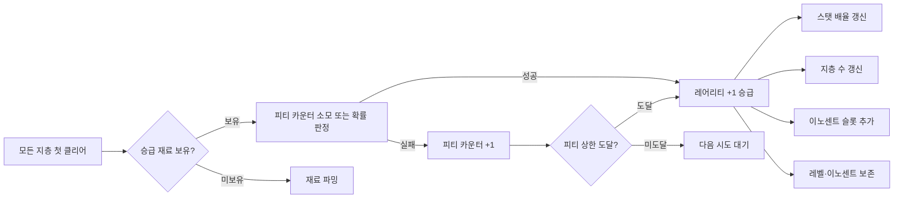

# 장비 성장 경로 시스템 (Equipment Growth Path System) — SYS-EQP-03

## 구현 현황 (Implementation Status)

> **최근 업데이트:** 2026-03-29
> **문서 상태:** `작성 중 (Draft)`
> **2-Space:** Item World (주), World (부)
> **기둥:** 야리코미 (주), 메트로베니아 탐험 (부)

| 기능 ID   | 분류     | 기능명 (Feature Name)                       | 우선순위 | 구현 상태    | 비고 (Notes)                                              |
| :-------- | :------- | :------------------------------------------ | :------: | :----------- | :-------------------------------------------------------- |
| EGP-01-A  | 레벨     | 아이템 레벨 시스템 (0-99)                   |    P1    | 대기         | 레어리티별 레벨 상한 분리                                 |
| EGP-01-B  | 레벨     | 아이템 EXP 수급 및 레벨업 처리              |    P1    | 대기         | `System_ItemWorld_Core.md` EXP 테이블 연동                |
| EGP-02-A  | 성장     | 보스 처치 → 영구 스탯 보너스 지급           |    P1    | 대기         | `permanentBonus` 공식 구현. `System_ItemWorld_Core.md`    |
| EGP-02-B  | 성장     | 레벨별 기본 스탯 성장 적용                  |    P1    | 대기         | `ItemStat(level) = BaseStat × (1 + level × 0.05)` 공식   |
| EGP-03-A  | 승급     | 레어리티 승급 조건 판정 및 확률 처리        |    P2    | 대기         | Phase 2. 전 지층 클리어 + 승급 재료 소모                  |
| EGP-03-B  | 승급     | 승급 시 슬롯/지층/배율 갱신                 |    P2    | 대기         | 이노센트·레벨 보존 필수                                   |
| EGP-04-A  | 이노센트 | 이노센트 슬롯 추가 (보스 처치 보상)         |    P2    | 대기         | Phase 2. 아이템 왕 처치 조건                              |
| EGP-06-A  | 진화     | 특수 진화 경로 (Ancient 전용 Anchor 패스)   |    P2    | 대기         | Phase 2. 심연 파수꾼 조건                                 |
| EGP-07-A  | UI       | 아이템 성장 경로 UI (대장간 강화 화면)      |    P2    | 대기         | 에르다 대사 "이 검을 한 번 더 벼리면…" 연출 포함          |

---

## 0. 필수 참고 자료 (Mandatory References)

* Writing Standards: `Documents/Terms/GDD_Writing_Rules.md`
* Project Vision: `Documents/Terms/Project_Vision_Abyss.md`
* Glossary: `Documents/Terms/Glossary.md`
* 레어리티 시스템: `Documents/System/System_Equipment_Rarity.md` (SYS-EQP-01)
* 장비 슬롯 시스템: `Documents/System/System_Equipment_Slots.md` (SYS-EQP-02)
* 아이템계 코어: `Documents/System/System_ItemWorld_Core.md` (SYS-IW-01) — 아이템 레벨·EXP·보스 보너스 공식 SSoT
* 이노센트 시스템: `Documents/System/System_Innocent_Core.md` (Phase 2)
* 성장 경제 연구: `Documents/Research/Disgaea_ItemWorld_GrowthEconomy.md`
* 레어리티 데이터: `Sheets/Content_System_Rarity_Table.csv`
* 성장 파라미터: `Sheets/Content_Equipment_Growth_Params.csv`
* Game Overview: `Reference/게임 기획 개요.md`
* 아이템계 역기획서: `Reference/Disgaea_ItemWorld_Reverse_GDD.md`

---

## 1. 개요 (Concept)

### 1.1. 설계 의도 (Intent)

> **"이 검을 한 번 더 벼리면 다음 등급으로 올라갈 수 있어."**
>
> — 에르다 벤-나흐트, 허브 대장간에서

Project Abyss의 장비 성장 경로 시스템은 다음 한 문장으로 정의한다:

> "장비는 드랍된 순간이 아니라, 플레이어가 직접 아이템계를 정복하며 성장시킨 순간에 진정한 가치를 갖는다"

일반 RPG에서 장비는 드랍 즉시 완성품이다. Project Abyss에서는 다르다. 드랍된 Rare 검은 잠재력의 씨앗이며, 플레이어가 그 내부의 지층을 하나씩 정복할수록 레벨이 오르고, 보스를 처치할수록 스탯이 영구적으로 강화되며, 모든 지층을 클리어하는 순간 다음 레어리티로의 승급 기회가 열린다. "내가 직접 키운 장비"라는 감정적 애착이 야리코미의 핵심 판타지다.

성장 경로는 세 개의 축으로 구성된다:
1. **아이템 레벨 성장** — 지층 탐험 EXP로 레벨이 오르며 기본 스탯이 선형 증가한다
2. **보스 처치 영구 보너스** — 기억의 문을 쓰러뜨릴 때마다 스탯이 영구적으로 증가한다
3. **레어리티 승급** — 모든 지층을 클리어하면 다음 등급으로 올라가 새로운 깊이가 열린다

### 1.2. 설계 근거 (Reasoning)

| 결정 | 근거 | 기각된 대안 |
| :--- | :--- | :--- |
| 아이템 레벨 상한을 레어리티별로 분리 (Normal 10, Ancient 99) | 레어리티별 성장 천장 차이가 야리코미 동기를 만든다. Normal을 아무리 키워도 Ancient의 잠재력에는 못 미친다 | 단일 레벨 상한 — 레어리티 차이가 희석됨 |
| 보스 처치 = 영구 스탯 보너스 (취소 불가) | 리스크를 감수한 대가가 명확해야 한다. "한 번 더 들어가면 영구 강화"가 "한 번 더" 심리의 핵심 연료 | 세션마다 초기화 — 반복 동기 소멸 |
| 레어리티 승급 = 확률 기반 (100% 아님) | 100% 보장은 단순 체크리스트가 된다. 확률이 있어야 "이번에 될까"의 기대 감정이 살아난다. 단, 피티(Pity) 시스템으로 무한 실패 방지 | 100% 승급 보장 — 달성 즉시 목표 소멸, 쾌감 감소 |
| 승급 시 이노센트·레벨 보존 | 야리코미 노력의 가치를 보존해야 한다. 승급을 위해 쌓은 모든 것이 증발하면 승급 자체가 패널티 | 승급 시 리셋 — 파밍 무효화, 이탈 유발 |
| 이노센트 슬롯 추가 = 보스 처치 보상 연계 | 이노센트 슬롯 확장이 아이템계 진입의 독립적 목표가 된다. "이 검의 왕을 잡으면 슬롯 +1" | 슬롯 고정 — 야리코미 목표 단조화 |
| 에르다 대사를 성장 UI에 통합 | 장인의 서사가 시스템에 녹아 있어야 한다. 강화 화면이 단순 수치 확인이 아닌 감정적 의식(ritual)이 된다 | 순수 수치 UI — 야리코미와 내러티브의 분리 |

### 1.3. 3대 기둥 정렬 (Pillar Alignment)

| 기둥 | 장비 성장 경로에서의 구현 |
| :--- | :--- |
| 메트로베니아 탐험 | 성장한 장비의 스탯이 스탯 게이트를 해금. "저 절벽은 ATK 30 이상이면 건널 수 있어" → 아이템계에서 보스를 잡아 스탯을 올려야 탐험 가능 |
| 아이템계 야리코미 | 성장 경로 전체가 아이템계 진입 동기. 레벨업·보스 보너스·승급 기회 모두 아이템계 안에서만 획득. "한 번 더 들어가서 왕을 잡자" |
| 온라인 멀티플레이 | Legendary/Ancient 아이템계 최심층 보스는 파티 협동이 현실적으로 유리. 성장 목표를 파티원과 공유하며 함께 달성하는 사회적 보상 |

### 1.4. 저주받은 문제 검증 (Cursed Problem Check)

| 긴장 | 위험 A | 위험 B | 설계의 선택 |
| :--- | :--- | :--- | :--- |
| 성장의 깊이 vs 신규 유저 접근성 | 성장 경로가 복잡하면 신규 이탈 | 단순하면 야리코미 매력 소멸 | 레벨 성장(선형, 직관적)과 보스 보너스(즉시 가시화)는 단순. 레어리티 승급(확률 + 조건)은 숙련 유저 목표 |
| 영구 성장 vs 반복 동기 | 영구 강화가 누적되면 콘텐츠 진부화 | 초기화하면 파밍 무의미 | 레벨 상한·보스 보너스 상한이 존재. 상한 도달 후 "더 강한 레어리티"로 이동 유도 |
| 승급 확률 vs 박탈감 | 낮은 확률 = 끝없는 실패감 | 높은 확률 = 기대감 소멸 | 피티 시스템(N회 실패 후 보장)으로 박탈감 방지. 기본 확률은 의도적 긴장감 유지 |
| Normal 장비 가치 vs 고레어리티 파밍 | Normal이 쓸모없으면 초반 경험 공허 | Normal로 족하면 고레어리티 추구 동기 소멸 | Normal 이노센트를 Rare에 이식 가능(Phase 2). Normal 아이템계 경험이 고레어리티 진입 전 학습 단계 |

### 1.5. 위험과 보상 (Risk & Reward)

| 전략 | 위험 (Risk) | 보상 (Reward) |
| :--- | :--- | :--- |
| Normal 장비 레벨 Max (10) 달성 | 레벨 상한이 낮아 스탯 성장 한계 명확 | 빠른 달성, 이노센트 슬롯 초기 확보, 승급 발판 |
| Ancient 장비 레벨 99 파밍 | 4지층 + 심연, 최고 난이도, 장시간 파밍 | ×2.0 스탯 배율 + 보스 보너스 누적 = 최종 빌드 |
| 레어리티 승급 즉시 시도 | 재료 소모 + 실패 가능성 | 레어리티 배율 증가 + 지층 수 확장 + 이노센트 슬롯 추가 |
| 보스 반복 처치 (Double Killing 금지) | 재진입 리스크, 탈출 제단 미보장 | 해당 보스의 영구 스탯 보너스는 1회만 (중복 차단) |

---

## 2. 메커닉 (Mechanics)

### 2.1. 성장 경로 개요

장비 아이템의 성장은 세 레이어로 분리된다. 각 레이어는 독립적으로 작동하며, 최종 스탯에 순서대로 합산된다.

```
FinalEquipStat =
  (BaseStat × RarityMultiplier)         ← 레어리티 레이어
  × (1 + itemLevel × 0.05)             ← 레벨 성장 레이어
  + permanentBossBonus                  ← 보스 처치 영구 보너스 레이어
  + innocentBonus                       ← 이노센트 레이어 (Phase 2)
```

> `BaseStat` SSoT: `Sheets/Content_Stats_Weapon_List.csv`
> `RarityMultiplier` SSoT: `Sheets/Content_System_Rarity_Table.csv`
> `permanentBossBonus` 계산: `System_ItemWorld_Core.md` §3.2
> `innocentBonus` 계산: `System_Innocent_Core.md` (Phase 2)

### 2.2. 아이템 레벨 시스템

#### 레벨 범위 및 레어리티별 상한

모든 장비는 아이템 레벨 0에서 시작한다. 레어리티가 높을수록 도달 가능한 최대 레벨이 높아진다.

| 레어리티 | 레벨 범위 | 최대 스탯 배율 (레벨 보정만) | 비고 |
| :--- | :---: | :---: | :--- |
| Normal | 0-10 | ×1.50 | 2지층 클리어 시 도달 가능 |
| Magic | 0-15 | ×1.75 | 3지층 클리어 시 도달 가능 |
| Rare | 0-15 | ×1.75 | 3지층 클리어 시 도달 가능 |
| Legendary | 0-20 | ×2.00 | 4지층 클리어 시 도달 가능 |
| Ancient | 0-99 | ×5.95 | 심연 파밍으로 장기 성장 가능 (Phase 2) |

> Ancient의 레벨 상한 99는 심연 파수꾼 반복 처치로만 도달 가능하다. 레벨 20까지는 4지층 클리어로 달성하며, 20 이후는 심연 페이즈 전용 파밍 구간이다.

#### 레벨업 조건

아이템 레벨은 아이템계 내에서 획득하는 **아이템 EXP**가 누적되어 상승한다. EXP 수급원과 레벨별 요구량은 외부 데이터로 관리한다.

**EXP 수급원 요약:**

| 수급원 | 기본 EXP | 참조 |
| :--- | :---: | :--- |
| 일반 몬스터 처치 | 30 | `stratumDef.expMultiplier` 보정 |
| 방 클리어 (전 적 처치) | 120 | 클리어 보너스 |
| 방 통과 (미클리어) | 60 | 탐험 보상 |
| 보스 처치 | 600 | 지층별 배율 적용 |

> 상세 EXP 테이블 및 지층별 배율: `System_ItemWorld_Core.md` §3.1
> 레벨별 EXP 요구량 수치: `Sheets/Content_Equipment_Growth_Params.csv`

#### 레벨업 공식

```
ItemStat(level) = BaseStat × (1 + level × GrowthRate)
```

| 파라미터 | 기본값 | 관리 위치 | 카테고리 |
| :--- | :---: | :--- | :--- |
| `GrowthRate` | 0.05 | `Sheets/Content_Equipment_Growth_Params.csv` | Curve 노브 |

레벨 성장은 순수 선형이다. 예측 가능한 성장이 야리코미 목표 설정을 돕는다.

**예시 (BaseStat ATK = 15, Rare 검):**

```
레벨  0 → ATK 15 × (1 + 0   × 0.05) = 15
레벨  5 → ATK 15 × (1 + 5   × 0.05) = 18 (반올림 없음, 정수 처리)
레벨 15 → ATK 15 × (1 + 15  × 0.05) = 26 (상한)
```

### 2.3. 보스 처치 → 영구 스탯 보너스

아이템계의 보스(기억의 문)를 처치할 때마다 해당 장비의 스탯이 영구적으로 증가한다. 이 보너스는 사망·탈출·재진입과 무관하게 보존된다.

#### 영구 보너스 공식

```
permanentBonus = BaseStat × (0.05 + itemLevel / 400) × bossTierMultiplier
```

| 파라미터 | 설명 | 범위 |
| :--- | :--- | :--- |
| `BaseStat` | 해당 스탯의 기준값 | `Sheets/Content_Stats_Weapon_List.csv` |
| `itemLevel` | 처치 시점의 현재 아이템 레벨 | 0-99 |
| `bossTierMultiplier` | 보스 등급 배율 | ×1 - ×4 (아래 테이블) |

| 보스 등급 | `bossTierMultiplier` | 예시 (BaseStat=100, level=10) |
| :--- | :---: | :--- |
| 아이템 장군 (Tier 1) | ×1 | +7.5 |
| 아이템 왕 (Tier 2) | ×2 | +15.0 |
| 아이템 신 (Tier 3) | ×3 | +22.5 |
| 아이템 대신 (Tier 4) | ×4 | +30.0 |

> 상세 보스 스케일링 수치: `System_ItemWorld_Core.md` §3.2

#### 중복 처치 규칙

동일 장비의 동일 보스는 **최초 1회만** 영구 보너스를 지급한다. 재진입 후 같은 보스를 재처치해도 추가 보너스가 없다. 이는 디스가이아 D3 이후 "더블 킬링" 남용을 방지한 설계를 채택한 것이다.

```yaml
bossKillRecord:
  itemId: "sword_001"
  killedBosses:
    - stratumIndex: 1   # 장군 처치 완료
      tier: 1
      bonusApplied: true
    - stratumIndex: 2   # 왕 미처치
      tier: 2
      bonusApplied: false
```

> `bossKillRecord`는 `ItemWorldProgress` 데이터 구조에 포함된다. SSoT: `System_ItemWorld_Core.md` §2.1

### 2.4. 레어리티 승급 — Phase 2

#### 승급 개요

아이템계의 모든 지층을 처음으로 클리어(각 지층 보스 최초 처치)하면 허브 대장간에서 레어리티 승급이 가능해진다. 에르다가 에코로 강화된 무기를 두드리며 다음 등급의 가능성을 확인하는 의식(ritual)이다.



#### 승급 확률 및 피티 시스템

| 승급 구간 | 기본 확률 | 피티 상한 (보장 횟수) | 피티 카운터 초기화 조건 |
| :--- | :---: | :---: | :--- |
| Normal → Magic | 80% | 3회 실패 후 보장 | 승급 성공 시 |
| Magic → Rare | 60% | 5회 실패 후 보장 | 승급 성공 시 |
| Rare → Legendary | 35% | 8회 실패 후 보장 | 승급 성공 시 |
| Legendary → Ancient | 15% | 15회 실패 후 보장 | 승급 성공 시 |

> 피티 카운터는 아이템 단위로 저장된다. 동일 아이템의 동일 승급 시도가 누적된다.
> 수치 수정 위치: `Sheets/Content_Equipment_Growth_Params.csv`

#### 승급 재료

승급에 필요한 재료는 아이템계 보스 드랍과 월드 탐험을 통해 수급된다. 재료 목록은 Phase 2 콘텐츠 설계 시 확정하며, 현재는 추상 참조(`upgradeMatId`)로만 정의한다.

```yaml
upgrade_material:
  Normal→Magic: { id: "mat_echo_shard_1", qty: 3 }
  Magic→Rare: { id: "mat_echo_shard_2", qty: 3 }
  Rare→Legendary: { id: "mat_memory_fragment", qty: 5 }
  Legendary→Ancient: { id: "mat_abyss_core", qty: 5 }
```

> 재료 획득 경로: `Documents/System/System_ItemWorld_Core.md` §2.4 보스 드랍 테이블

#### 승급 시 보존/변경 항목

| 항목 | 승급 시 처리 |
| :--- | :--- |
| 아이템 이름 | 레어리티 접두사 교체 (예: "검" → "마법 검") |
| 아이템 레벨 | **보존** — 현재 레벨 유지 |
| permanentBossBonus | **보존** — 누적된 영구 보너스 유지 |
| 이노센트 (복종 상태) | **보존** — 기존 이노센트 유지, 추가 슬롯만 개방 |
| 이노센트 슬롯 수 | 상위 레어리티 기준으로 증가 |
| 아이템계 지층 수 | 상위 레어리티 기준으로 증가 |
| 스탯 배율 | 상위 레어리티 `RarityMultiplier`로 갱신 |
| 레벨 상한 | 상위 레어리티 기준으로 증가 |

> "승급은 성장의 재시작이 아니라, 더 높은 곳으로 가는 발판이다."

### 2.5. 이노센트 슬롯 확장

Phase 2에서 이노센트 슬롯은 두 가지 경로로 확장된다.

| 확장 경로 | 조건 | 추가 슬롯 수 |
| :--- | :--- | :---: |
| 레어리티 승급 | 승급 성공 | 상위 레어리티 기준 슬롯 수로 증가 |
| 아이템 왕 처치 | 아이템계 내 아이템 왕(Tier 2) 최초 처치 | +1 슬롯 (레어리티 상한 초과 불가) |

> 레어리티별 이노센트 슬롯 상한: `System_Equipment_Rarity.md` §2.1

슬롯 추가는 즉시 적용되며, 이미 복종된 이노센트에게는 영향이 없다. 빈 슬롯은 야생 이노센트 포획 또는 이식으로 채울 수 있다.

### 2.6. 장비 진화 경로 — Phase 2

레어리티 승급과 레벨 성장 외에, Ancient 장비는 **심연 진화(Abyss Evolution)** 경로를 통해 추가 잠재력을 열 수 있다.

| 진화 단계 | 조건 | 효과 |
| :--- | :--- | :--- |
| 1단계: 기억 각성 | Ancient 레벨 20 달성 + 심연 파수꾼 최초 처치 | 심연 페이즈 해금, 레벨 상한 99로 확장 |
| 2단계: 심연 각인 | Ancient 레벨 50 달성 | 고유 이펙트 추가 (무기별 고유 시각 효과) |
| 3단계: 기억의 완성 | Ancient 레벨 99 달성 | 칭호 "기억의 완성(Perfected Memory)" 부여, 특수 이노센트 슬롯 +1 |

> 심연 페이즈 상세 규칙: `System_ItemWorld_Core.md` §2.2 지층 테이블 (Ancient 심연 행)

---

## 3. 규칙 (Rules)

### 3.1. 아이템 레벨 규칙

| 규칙 ID | 규칙 | 예외 |
| :--- | :--- | :--- |
| EGP-R01 | 아이템 레벨은 아이템계 진입 시에만 상승한다. 월드 탐험이나 허브 활동으로는 상승하지 않는다 | 없음 |
| EGP-R02 | 아이템 레벨은 레어리티별 최대 레벨을 초과할 수 없다 | Ancient는 심연 진화 단계별로 상한이 확장된다 |
| EGP-R03 | 레벨 성장에 따른 스탯 증가는 장비 착용 시 즉시 반영된다 | 없음 |
| EGP-R04 | 레어리티 승급 후에도 아이템 레벨은 초기화되지 않는다 | 없음 |
| EGP-R05 | 재방문 클리어 지층에서 획득 EXP는 ×0.5 감소한다 | 첫 클리어는 감소 없음 |

### 3.2. 보스 처치 보너스 규칙

| 규칙 ID | 규칙 | 예외 |
| :--- | :--- | :--- |
| EGP-R10 | 보스 처치 영구 스탯 보너스는 해당 장비에 귀속된다. 장비를 교체해도 다른 장비로 이전되지 않는다 | 없음 |
| EGP-R11 | 동일 장비의 동일 지층 보스는 최초 1회만 영구 보너스를 지급한다. 재진입 후 재처치해도 추가 보너스 없음 | 없음 |
| EGP-R12 | 보스 처치 보너스는 사망 탈출·강제 종료 등 어떤 방식으로 아이템계를 나가더라도 취소되지 않는다 | 없음 |
| EGP-R13 | 보스 처치 즉시 보너스가 적용된다. 아이템계 탈출 전에 이미 반영된다 | 없음 |
| EGP-R14 | 파티 플레이 시 보스 처치 보너스는 진입한 아이템의 소유자(Owner)에게만 적용된다 | 없음 |

### 3.3. 레어리티 승급 규칙

| 규칙 ID | 규칙 | 예외 |
| :--- | :--- | :--- |
| EGP-R20 | 레어리티 승급은 해당 아이템의 모든 지층을 최초 클리어한 후에만 시도할 수 있다 | 없음 |
| EGP-R21 | 승급 시도는 허브 대장간에서만 가능하다. 필드나 아이템계 내부에서는 불가 | 없음 |
| EGP-R22 | 승급은 Ancient에서 멈춘다. Ancient는 더 이상 승급이 없으며 심연 진화 경로로 전환된다 | 없음 |
| EGP-R23 | 승급 실패 시 재료는 소모되지 않는다. 피티 카운터만 +1 증가한다 | 없음 |
| EGP-R24 | 피티 카운터가 상한에 도달하면 다음 시도는 100% 성공한다. 이후 피티 카운터는 0으로 초기화된다 | 없음 |
| EGP-R25 | 승급으로 증가한 이노센트 슬롯은 야생 이노센트 자동 배정이 아닌 빈 슬롯으로 개방된다 | 없음 |

---

## 4. 수치 설계 (Numerical Design)

### 4.1. 전체 성장 시뮬레이션

Rare 검(BaseStat ATK=15)을 기준으로, 각 성장 단계에서의 최종 ATK를 시뮬레이션한다.

**전제:**
- Rare `RarityMultiplier` = 1.7
- 보스 처치: 장군 2회(지층1·2) + 신 1회(지층3)
- 레벨: 15 (상한)
- 이노센트 없음 (Phase 1 기준)

```
기준 스탯:
  BaseStat ATK = 15

레어리티 레이어:
  EquipStat = 15 × 1.7 = 25

레벨 성장 레이어 (level=15):
  LevelBonus = 25 × (1 + 15 × 0.05) = 25 × 1.75 = 43

보스 처치 영구 보너스 (처치 시점 level=10 가정):
  장군 Tier1 = 25 × (0.05 + 10/400) × 1 = 25 × 0.075 = 1.875 → 2 (소수 반올림)
  장군 Tier1 = 2 (지층2도 동일 장군이면 1회만 — EGP-R11 적용)
  신  Tier3  = 25 × 0.075 × 3 = 5.625 → 6
  permanentBossBonus = 2 + 6 = 8

FinalEquipStat ATK = 43 + 8 = 51
```

레벨 0, 보스 미처치(드랍 직후) 대비: `25 → 51` (×2.04)

### 4.2. 레벨 요구 EXP 참조

레벨별 누적 EXP 요구량의 설계 원칙:

```yaml
# EXP 곡선 타입: 선형(Linear) + 일정 오프셋
# 공식: Required_EXP(level) = BaseEXP + level × IncrementEXP
# 단, 레어리티별 BaseEXP 배율 적용

exp_curve_type: linear_with_offset
base_exp_per_level: 200          # Feel 노브 — 튜닝 우선
increment_per_level: 50          # Curve 노브 — 완만한 가속
rarity_exp_multiplier:
  normal:    1.0
  magic:     1.2
  rare:      1.4
  legendary: 1.7
  ancient:   2.0
```

> 실제 테이블: `Sheets/Content_Equipment_Growth_Params.csv`

### 4.3. 승급 수치 파라미터

```yaml
rarity_upgrade:
  normal_to_magic:
    base_chance: 0.80
    pity_limit: 3
  magic_to_rare:
    base_chance: 0.60
    pity_limit: 5
  rare_to_legendary:
    base_chance: 0.35
    pity_limit: 8
  legendary_to_ancient:
    base_chance: 0.15
    pity_limit: 15
```

> 수치 수정 위치: `Sheets/Content_Equipment_Growth_Params.csv`

---

## 5. 예외 처리 (Edge Cases)

### 5.1. 레벨 상한 초과 방지

- `itemLevel`이 레어리티별 `maxLevel`에 도달하면 EXP 수급이 중단된다. 초과 EXP는 버려진다.
- Ancient 장비가 심연 진화 1단계(레벨 20)에 도달하기 전에 레벨 20 이상의 EXP를 획득해도, 진화 조건 달성 전까지 레벨 20으로 고정된다. 잉여 EXP는 조건 달성 직후 적용된다.

### 5.2. 승급 시 레벨 상한 초과

- Rare 아이템(레벨 상한 15)이 레벨 15 상태에서 Legendary(레벨 상한 20)로 승급되면, 레벨 15가 유지된 채 상한만 20으로 확장된다. 승급 후 레벨 20까지 추가 성장이 가능하다.

### 5.3. 보스 보너스 저장 실패 (네트워크 단절)

- 보스 처치 보너스는 처치 즉시 서버에 기록된다. 처치 후 0.5초 이내 네트워크 단절이 발생한 경우, 클라이언트에서 로컬 큐에 보존 후 재접속 시 서버에 적용(Pending Commit 방식).
- 단절 발생 시 중복 커밋 방지를 위해 보스 ID + 처치 타임스탬프를 복합 키로 중복 검사한다.

### 5.4. 피티 카운터의 장비 거래/분해

- 장비가 분해되면 피티 카운터는 초기화된다. 피티 카운터는 장비 소유자가 아닌 장비 자체에 귀속된다.

### 5.5. Ancient 레벨 99 이후

- 레벨 99는 하드캡이다. 심연 진화 3단계 달성 후에는 더 이상 레벨이 오르지 않는다. 심연 페이즈 재진입으로 이노센트 추가 파밍만 가능하다.
- "레벨 99 달성" 이후 목표 부재는 이노센트 최적화·세트 효과 탐구(Phase 2)·신규 장비 파밍으로 유도한다.

### 5.6. 승급 조건 판정 중 아이템계 재진입

- 승급 가능 여부(모든 지층 클리어)는 `bossKillRecord`의 `clearedStrata` 배열로 판정한다. 판정 시점에 허브 대장간 진입 시 서버가 검증한다.
- 아이템계 진입 중에는 승급 시도가 불가하다. 장비가 잠금 상태(in-use)이기 때문이다. `System_ItemWorld_Core.md` §2.1 장착 해제/잠금 규칙 참조.

### 5.7. 분수 스탯 처리

- 모든 `permanentBossBonus` 계산 결과는 소수 반올림(round half up)하여 정수로 저장한다.
- 레벨 성장 공식 `BaseStat × (1 + level × GrowthRate)` 결과도 정수 처리한다. 이때 레어리티 배율 적용 후 최종값을 한 번에 정수 처리하여 중간 반올림 오차 누적을 방지한다.

---

## 6. 의존성 (Dependencies)

### 6.1. 이 시스템이 받는 것 (Inputs)

| 시스템 | 제공 데이터 | 참조 문서 |
| :--- | :--- | :--- |
| 아이템계 코어 (SYS-IW-01) | 아이템 EXP, 보스 처치 이벤트, `ItemWorldProgress`, `bossKillRecord` | `System_ItemWorld_Core.md` |
| 장비 레어리티 (SYS-EQP-01) | `RarityMultiplier`, 레어리티별 이노센트 슬롯 상한, 레어리티별 지층 수 | `System_Equipment_Rarity.md` |
| 장비 슬롯 (SYS-EQP-02) | `BaseStat`, 장비 착용/해제 상태 | `System_Equipment_Slots.md` |
| 이노센트 (Phase 2) | `innocentBonus` 합산값 | `System_Innocent_Core.md` |
| 스탯 게이트 | 성장한 EquipStat이 게이트 판정에 사용됨 | `Documents/Design/Design_Architecture_2Space.md` |

### 6.2. 이 시스템이 제공하는 것 (Outputs)

| 수신 시스템 | 제공 데이터 | 용도 |
| :--- | :--- | :--- |
| 장비 슬롯 (SYS-EQP-02) | `FinalEquipStat` (레벨+보스보너스+이노센트 합산) | 캐릭터 스탯 계산 |
| 데미지 시스템 | `FinalEquipStat.atk` | 전투 데미지 계산 |
| 스탯 게이트 | `FinalEquipStat` 각 스탯 | 게이트 해금 판정 |
| 월드 스탯 게이트 | `FinalEquipStat.atk` | 새 구역 개방 여부 판정 (ATK 단일 게이트) |
| 허브 강화 UI | 아이템 레벨, `permanentBossBonus`, 승급 가능 여부, 피티 카운터 | 대장간 화면 표시 |

### 6.3. 연동 계약 (Integration Contract)

```yaml
provides:
  - FinalEquipStat:
      type: "Record<StatType, number>"
      computed_on: "equip / level-up / boss-kill / upgrade"

  - itemLevel:
      type: number
      range: "0 ~ maxLevel (rarity-based)"

  - upgradeReady:
      type: boolean
      condition: "allStrataClearedFirst AND material sufficient"

consumes:
  - from: System_ItemWorld_Core
    events: ["BOSS_KILL", "EXP_GAIN", "ITEM_WORLD_CLEAR"]

  - from: System_Equipment_Rarity
    data: ["rarityMultiplier", "maxLevel", "maxInnocentSlots"]
```

---

## 7. 튜닝 노브 (Tuning Knobs)

| 파라미터 | 기본값 | 범위 | 카테고리 | 근거 |
| :--- | :---: | :--- | :--- | :--- |
| `GrowthRate` | 0.05 | 0.03-0.08 | Curve | 레벨당 5% 선형 성장. 디스가이아 D1 원본 공식 직접 채택 |
| `bassBonusBaseCoefficient` | 0.05 | 0.03-0.08 | Curve | 보스 보너스 공식의 기저 계수. 낮추면 보스 보상 약화, 높이면 성장 가속 |
| `bossLevelScaleCoefficient` | 0.0025 (=1/400) | 0.001-0.004 | Curve | 레벨이 높을수록 보스 보너스 증가. 파밍 깊이 vs 보상 밸런스 |
| `expBasePerLevel` | 200 | 100-400 | Feel | 레벨 1당 기본 EXP 요구량. 낮을수록 빠른 성장 |
| `expIncrementPerLevel` | 50 | 0-150 | Curve | 레벨당 추가 EXP 증분. 0이면 완전 선형 |
| `rarityExpMultiplier_ancient` | 2.0 | 1.5-3.0 | Curve | Ancient 레벨 1-99 구간 파밍 세션 길이 조정 |
| `upgradeChance_legendary_to_ancient` | 0.15 | 0.08-0.25 | Gate | 최고 희귀도 승급 확률. 야리코미 최종 목표 긴장감 조정 |
| `pityLimit_legendary_to_ancient` | 15 | 8-20 | Gate | Legendary → Ancient 최대 실패 허용 횟수. 박탈감 방지 상한 |

> 모든 파라미터 SSoT: `Sheets/Content_Equipment_Growth_Params.csv`
> 느낌(Feel) 노브는 플레이테스트 직관으로 조정. 곡선(Curve) 노브는 수학 모델로 조정. 게이트(Gate) 노브는 세션 길이 목표(평균 45분 세션)를 기준으로 조정.

---

## 8. 에르다의 대장장이 서사 (Forge Narrative)

### 8.1. 허브 대장간 강화 연출

장비 성장 경로의 핵심 UI는 단순한 수치 확인창이 아니다. 에르다가 에코로 장비를 두드리며 성장 상태를 확인하는 의식(ritual)이다.

**에르다 대사 테이블 (강화 화면 진입 시):**

| 조건 | 에르다 대사 |
| :--- | :--- |
| 레벨 상한 미달성 시 | "이 녀석, 아직 더 자랄 여지가 있어." |
| 보스 미처치 지층 존재 시 | "기억의 문을 아직 부수지 못한 곳이 있네." |
| 레벨 상한 달성, 전 지층 클리어 | "이 검을 한 번 더 벼리면 다음 등급으로 올라갈 수 있어." |
| 승급 성공 시 | "...변했어. 같은 검인데 다른 검이 됐어." |
| 승급 실패 시 | "아직 준비가 안 됐나 봐. 조금만 더." |
| Ancient 레벨 99 달성 시 | "...완성됐어. 이게 이 검이 간직하고 싶었던 기억의 전부야." |

> 대사 전체 목록과 보이스 연출 지침: (DEPRECATED) <!-- Content_Erda_Dialogue.md — 대화 시스템 DEPRECATED -->

### 8.2. 강화 화면 UI 정보 표시

```
[장비 이름] (레어리티 색상)
아이템 레벨: 12 / 15 ━━━━━━━━━━━━░░░ 78%
보스 처치: ■■□ (장군 ✓, 왕 ✓, 신 ✗)
이노센트 슬롯: ●●●○ (3/4 채움)
승급 조건: 지층 클리어 3/3 ✓ | 재료 ✓ → [승급 시도]
```

> UI 상세 스펙: (Phase 2 제작 예정) <!-- UI_HUD_Forge.md -->

---

## 9. 수락 기준 (Acceptance Criteria)

### 9.1. 기능 기준 (Functional Criteria)

| 항목 | 판정 기준 |
| :--- | :--- |
| 레벨 성장 | 아이템계 진입 → 몬스터/보스 처치 → EXP 수급 → 레벨업 → `FinalEquipStat` 즉시 갱신 확인 |
| 레벨 상한 | 레어리티별 최대 레벨 초과 시 EXP 수급이 중단되고, 레벨이 상한에서 고정되는 것 확인 |
| 보스 보너스 | 보스 처치 즉시 `permanentBossBonus` 갱신, 사망 후 재접속 시에도 보너스 보존 확인 |
| 중복 보너스 방지 | 동일 지층 보스 재처치 시 `permanentBossBonus` 변화 없음 확인 |
| 레어리티 승급 | 조건 미충족 시 UI에서 [승급 시도] 버튼 비활성화, 조건 충족 후 활성화 확인 |
| 피티 카운터 | 실패 횟수가 정확히 누적되고, 상한 도달 시 강제 성공하는 것 확인 |
| 승급 후 레벨 보존 | 승급 전 레벨 = 승급 후 레벨이 동일한 것 확인 |
| 이노센트 슬롯 추가 | 아이템 왕 처치 시 슬롯 +1, 최대 슬롯 상한 초과하지 않는 것 확인 |

### 9.2. 경험 기준 (Experiential Criteria)

다음 플레이테스트 시나리오를 통해 경험을 검증한다:

| 시나리오 | 목표 경험 | 검증 방법 |
| :--- | :--- | :--- |
| Normal 장비를 레벨 10까지 파밍 | "내가 키운 장비"라는 애착감. 레벨업 순간 수치 변화가 즉시 인지됨 | 플레이어 관찰. "레벨이 오른 것 알았나?" 인터뷰 |
| 보스 처치 후 영구 스탯 확인 | "이 보스를 잡았더니 영구적으로 강해졌어"라는 명확한 인과 인지 | 허브 복귀 후 장비 화면 열람 여부 관찰 |
| Rare → Legendary 승급 실패 3회 후 성공 | 실패의 긴장감, 성공의 환희. 피티가 작동하여 과도한 박탈감 없음 | 표정/반응 관찰. "몇 번 더 하고 싶나?" 인터뷰 |
| "이 검을 한 번 더 벼리면" 에르다 대사 발생 | 대사가 다음 목표를 자연스럽게 안내. 강화 화면이 의식(ritual)으로 느껴짐 | 대사 발생 후 즉시 아이템계 진입 여부 관찰 |

### 9.3. 밸런스 기준

- Phase 1 기준: Normal 장비 레벨 10 달성에 소요되는 세션 수는 **2-3 세션** (세션당 평균 45분)이어야 한다.
- 보스 보너스가 레벨 성장 보너스의 **30-50%** 수준이어야 한다. 보스 보너스가 지나치게 크면 레벨 성장의 가치가 희석된다.
- Legendary → Ancient 승급 기대 시도 횟수(피티 포함): **평균 5회, 최대 15회** 이내.
