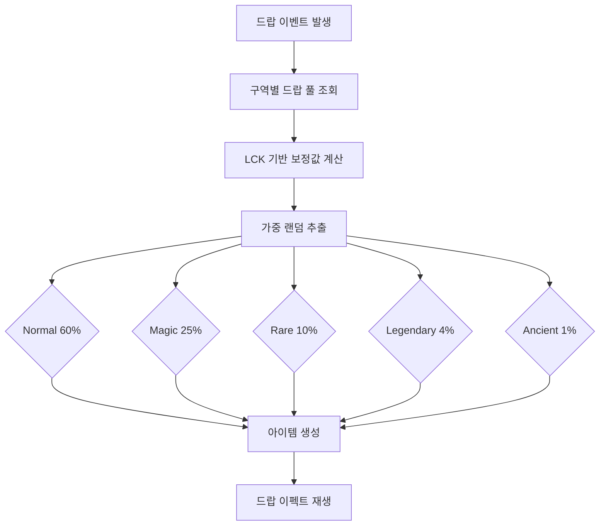
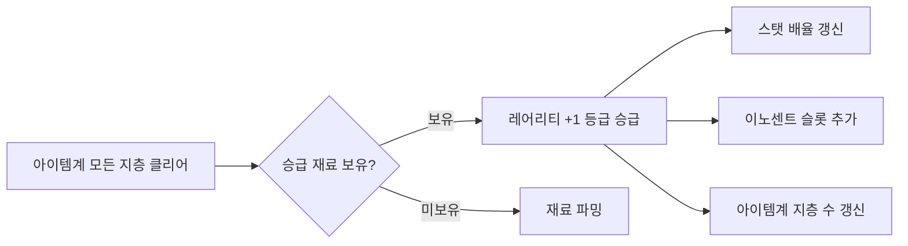

# 장비 레어리티 시스템 (Equipment Rarity System)

## 구현 현황 (Implementation Status)

> 최근 업데이트: 2026-03-23
> 문서 상태: `작성 중 (Draft)`
> 3-Space: 전체 (World - 드랍, Item World - 아이템계 지층/승급, Hub - 장비 관리)
> 기둥: 야리코미

| 기능 ID  | 분류       | 기능명 (Feature Name)                  | 우선순위 | 구현 상태 | 비고 (Notes)                          |
| :------- | :--------- | :------------------------------------- | :------: | :-------- | :------------------------------------ |
| RAR-01-A | 등급       | 5등급 레어리티 정의                    |    P1    | 대기      | Normal~Ancient 디아블로 체계 적용     |
| RAR-01-B | 등급       | 레어리티별 스탯 배율 적용              |    P1    | 대기      | EquipStat * Rarity_Multiplier         |
| RAR-02-A | 아이템계   | 레어리티별 아이템계 지층 수 정의       |    P1    | 대기      | MVP: 1지층 고정, 데이터는 전체 정의   |
| RAR-02-B | 아이템계   | 아이템계 진입 규칙 (레어리티 연동)     |    P1    | 대기      | 지층 수 상한 및 보스 배치 연동        |
| RAR-03-A | 이노센트   | 레어리티별 이노센트 슬롯 수 정의       |    P1    | 대기      | Phase 2 이노센트 시스템 연동          |
| RAR-04-A | 드랍       | 레어리티별 드랍 확률 가중치 정의       |    P1    | 대기      | 드랍 풀 확률 계산 기준                |
| RAR-04-B | 드랍       | 드랍 이펙트 (레어리티별 시각 효과)     |    P1    | 대기      | 색상/파티클 차별화                    |
| RAR-05-A | 시각       | 아이템 이름 색상 (레어리티별)          |    P1    | 대기      | UI 컬러 코드 적용                     |
| RAR-06-A | 승급       | 레어리티 승급 (Rarity Upgrade)         |    P2    | 대기      | Phase 2 아이템계 모든 지층 클리어 보상 |
| RAR-07-A | 필터       | 인벤토리 레어리티 필터                 |    P2    | 대기      | Legendary 이상 자동 표시 옵션         |

---

## 0. 필수 참고 자료 (Mandatory References)

* Writing Standards: `Documents/Terms/GDD_Writing_Rules.md`
* Project Vision: `Documents/Terms/Project_Vision_Abyss.md`
* Glossary: `Documents/Terms/Glossary.md`
* 장비 슬롯 시스템: `Documents/System/System_Equipment_Slots.md`
* 이노센트 시스템: `Documents/System/System_Innocent_Core.md`
* 아이템계 코어: `Documents/System/System_ItemWorld_Core.md`
* 데미지 시스템: `Documents/System/System_Combat_Damage.md`
* 레어리티 데이터: `Sheets/Content_System_Rarity_Table.csv`
* 장비 드랍 테이블: `Sheets/Content_Drop_Equipment_Table.csv`
* Game Overview: `Reference/게임 기획 개요.md`
* 아이템계 역기획서: `Reference/Disgaea_ItemWorld_Reverse_GDD.md`

---

## 1. 개요 (Concept)

### 1.1. 설계 의도 (Intent)

Project Abyss의 레어리티 시스템은 다음 한 문장으로 정의한다:

> "레어리티는 단순한 강함의 등급이 아니라, 그 아이템이 품고 있는 세계의 깊이다"

Common 검 하나를 드랍받는 순간과, 처음으로 Legendary 검이 화면에 쏟아지는 순간은 다른 감정이어야 한다. 그리고 Legendary 검을 손에 쥔 플레이어는 "이 검의 아이템계 모든 지층을 클리어하면 어떤 이노센트가 기다리고 있을까"를 자연스럽게 떠올려야 한다. 레어리티는 아이템계 야리코미 깊이의 지표이자, 플레이어의 다음 목표를 제시하는 나침반이다.

### 1.2. 설계 근거 (Reasoning)

| 결정                             | 근거                                                                                       |
| :------------------------------- | :----------------------------------------------------------------------------------------- |
| 5등급 체계 (Normal ~ Ancient)    | 디아블로 시리즈의 레어리티 체계 채택. 직관적 색상(흰→파→노→주→초)으로 등급 인지         |
| Normal 드랍률 60%                | 초반 플레이어가 성장을 계속 느끼려면 Normal이 주류여야 함. 희소성은 상위 등급에 집중       |
| Ancient 드랍률 1%                | 야리코미의 궁극 목표. 드랍 자체가 이벤트급이 되어야 감정 반응 극대화                      |
| 이노센트 슬롯 레어리티 비례 증가 | 고레어리티 아이템을 얻어도 이노센트를 채우지 않으면 잠재력 절반. 파밍 동기를 유지          |
| 아이템계 지층 수 레어리티 비례 증가 | 고레어리티 아이템계는 더 많은 지층과 어려운 던전. 강함의 대가로 더 많은 노력이 필요      |
| MVP는 1지층 고정, 데이터는 전체 정의 | 핵심 루프 검증이 우선. 지층 로직은 나중에 활성화되도록 데이터는 미리 준비                |
| Legendary 이상 자동 사냥 드랍 금지 | 핵심 금지 규칙 준수. `Project_Vision_Abyss.md` Never-Do Rules 참조                      |

### 1.3. 3대 기둥 정렬 (Pillar Alignment)

| 기둥                  | 레어리티 시스템에서의 구현                                                                 |
| :-------------------- | :----------------------------------------------------------------------------------------- |
| Metroidvania 탐험     | 고레어리티 장비의 높은 EquipStat이 스탯 게이트를 해금. 새 구역을 여는 열쇠                 |
| Item World 야리코미   | 레어리티가 아이템계 지층 수와 이노센트 슬롯 수를 결정. 고레어리티 = 더 깊은 야리코미       |
| Online 멀티플레이     | Legendary/Mythic 아이템계는 파티 협동 콘텐츠로 설계. 장비 자랑/거래의 사회적 가치         |

### 1.4. 저주받은 문제 검증 (Cursed Problem Check)

| 문제                                                   | 해결 방향                                                                                       |
| :----------------------------------------------------- | :---------------------------------------------------------------------------------------------- |
| Ancient 드랍률 1%가 너무 낮아 박탈감을 주지 않는가?    | LCK 스탯으로 드랍률 보정 가능. 파밍 자체가 재미가 되도록 아이템계 이노센트 보상 설계           |
| Normal 아이템이 Rare 드랍 후 쓸모없어지지 않는가?      | Normal 아이템계의 이노센트를 고레어리티 아이템에 이식 가능 (Phase 2). 수집 가치 유지            |
| 고레어리티 집중 드랍 구간이 생기면 레어리티 의미가 퇴색되지 않는가? | 특정 구역/보스별 드랍 풀을 별도 정의. 전체 풀이 아닌 구역별 풀에서 확률 적용              |
| Ancient 아이템계 4지층 + 심연이 진입 장벽이 되어 콘텐츠 이탈을 유발하지 않는가? | 아이템계 중간 탈출(탈출 아이템) 시스템. 진행 일부 보존으로 부담 완화 |
| 레어리티 승급이 기존 파밍 노력을 무효화하지 않는가?    | 승급은 레어리티 배율만 증가. 이노센트, 기존 아이템 레벨은 유지하여 파밍 가치 보존              |

### 1.5. 위험과 보상 (Risk & Reward)

| 전략                        | 위험 (Risk)                                  | 보상 (Reward)                                         |
| :-------------------------- | :------------------------------------------- | :---------------------------------------------------- |
| Normal 장비 완전 강화        | 고레어리티 대비 스탯 열세                    | 짧은 아이템계(2지층), 빠른 이노센트 확보, 낮은 부담   |
| Legendary 즉시 아이템계 진입 | 4지층 클리어 부담, 파티 필요 가능성          | x2.2 스탯 배율 + 6 이노센트 슬롯, 스탯 게이트 해금  |
| Ancient 획득 추구 파밍       | 1% 확률, 장시간 월드 파밍 필요               | x3.0 최대 스탯, 8 이노센트 슬롯, 최종 빌드 달성      |
| 레어리티 승급 전략           | 모든 지층 클리어 선행 필요                   | 기존 이노센트 유지 + 레어리티 배율 상승               |

---

## 2. 메커닉 (Mechanics)

### 2.1. 레어리티 등급 체계 (Rarity Tier System) — Diablo Style

> 디아블로 시리즈의 등급 체계를 채택한다. 색상과 명칭은 디아블로 3/4 기준.

| 등급      | 코드 키    | 색상명 | Hex 코드 | 스탯 배율 | 이노센트 슬롯 | 아이템계 지층 수                         | 드랍 확률 비중 |
| :-------- | :--------- | :----- | :------- | :-------- | :------------ | :--------------------------------------- | :------------- |
| Normal    | `normal`   | 흰색   | #FFFFFF  | x1.0      | 2             | 2 지층 (4×4 고정)                        | 60%            |
| Magic     | `magic`    | 파란색 | #6969FF  | x1.3      | 3             | 3 지층 (4×4 고정)                        | 25%            |
| Rare      | `rare`     | 노란색 | #FFFF00  | x1.7      | 4             | 3 지층 (4×4 고정)                        | 10%            |
| Legendary | `legendary`| 주황색 | #FF8000  | x2.2      | 6             | 4 지층 (4×4 고정)                        | 4%             |
| Ancient   | `ancient`  | 초록색 | #00FF00  | x3.0      | 8             | 4 지층 + 심연 (4×4 고정)                 | 1%             |

Ancient 아이템계 심연(Abyss) 페이즈: 4지층 클리어 후 진입 가능한 심연 단계. 보너스 이노센트 등장, 이노센트 밀도 증가. 상세 규칙은 `System_ItemWorld_Core.md` 참조.

> **디아블로 색상 대응표:**
> Normal(White) = D3 Common, Magic(Blue) = D3 Magic, Rare(Yellow) = D3 Rare, Legendary(Orange) = D3 Legendary, Ancient(Green) = D3 Set/Ancient

### 2.2. 스탯 배율 적용 공식 (Rarity Multiplier Application)

장비 스탯에 레어리티 배율을 적용하는 방식:

```
EquipStat_Final = baseStats[stat] * Rarity_Multiplier
```

예시 - 검 ATK 계산:

```
Normal    검 ATK: 15 * 1.0 = 15
Magic     검 ATK: 15 * 1.3 = 19  (소수점 버림)
Rare      검 ATK: 15 * 1.7 = 25
Legendary 검 ATK: 15 * 2.2 = 33
Ancient   검 ATK: 15 * 3.0 = 45
```

위 계산에서 15는 해당 장비의 `baseStats.atk` 값이다. 레어리티 배율은 `Sheets/Content_System_Rarity_Table.csv`에서 관리하며, baseStats는 `Sheets/Content_Stats_Weapon_List.csv`에서 관리한다.

### 2.3. 드랍 확률 계산 메커닉 (Drop Rate Mechanic)

드랍 발생 시 레어리티 결정 절차:



LCK 보정은 전체 드랍률을 상향 이동시키며, 구역별 드랍 풀에서 확률이 적용된다. 상세 LCK 보정 공식은 `System_Combat_Damage.md` 참조.

### 2.4. 드랍 이펙트 (Drop Visual Effects)

| 등급      | 드랍 이펙트                                   | 이름 색상   | 드랍 사운드         |
| :-------- | :-------------------------------------------- | :---------- | :------------------ |
| Normal    | 흰 빛 소멸 후 아이템 출현                     | #FFFFFF     | 짧은 획득음         |
| Magic     | 파란 파티클 소량 + 아이템 출현                | #6969FF     | 획득음 + 짧은 멜로디 |
| Rare      | 노란 파티클 + 작은 광원 효과                  | #FFFF00     | 멜로디 + 효과음     |
| Legendary | 주황 파티클 폭발 + 화면 일시 정지 0.2초 + 광원 | #FF8000    | 팡파레 짧은 버전    |
| Ancient   | 초록 폭발 + 화면 플래시 + 큰 광원 + 이름 강조 표시 | #00FF00 | 팡파레 풀버전 + 글로우 |

Legendary 이상은 인근 파티원 화면에도 드랍 알림 표시 (Phase 3 멀티 연동).

### 2.5. 아이템계 진입 규칙 (Item World Entry by Rarity)

| 등급      | 아이템계 지층 수 | 보스 배치                                         | 비고                              |
| :-------- | :--------------- | :------------------------------------------------ | :-------------------------------- |
| Normal    | 2 지층           | 지층 1: 아이템 장군, 지층 2: 아이템 장군          | MVP: 1지층 고정 (데이터는 전체 정의) |
| Magic     | 3 지층           | 지층 1~2: 아이템 장군, 지층 3: 아이템 왕          |                                   |
| Rare      | 3 지층           | 지층 1: 아이템 장군, 지층 2: 아이템 왕, 지층 3: 아이템 신 |                           |
| Legendary | 4 지층           | 지층 1~2: 아이템 장군, 지층 3: 아이템 왕, 지층 4: 아이템 신 | 파티 권장 (지층 3+)       |
| Ancient   | 4 지층 + 심연    | 지층 1~2: 장군, 지층 3: 왕, 지층 4: 아이템 대신 + 심연 | 파티 강력 권장              |

MVP 1지층 고정 규칙: Phase 1에서는 모든 레어리티의 아이템계가 1지층(4×4)으로 고정된다. 단, 데이터 구조는 위 테이블의 전체 지층 수로 정의하여 Phase 2 활성화 시 코드 변경 없이 데이터 수정만으로 전환 가능하도록 설계한다.

### 2.6. 레어리티 승급 메커닉 (Rarity Upgrade) - Phase 2

특정 조건 달성 시 아이템을 다음 등급으로 승급할 수 있다:



승급 시 보존되는 요소:

- 아이템 이름 (등급 접두사 추가)
- 기존 이노센트 (슬롯 수 유지 + 추가 슬롯 개방)
- 현재 아이템 레벨

승급 후 변경되는 요소:

- 레어리티 등급 및 스탯 배율
- 이노센트 슬롯 수 (상위 등급 기준으로 증가)
- 아이템계 최대 지층 수

승급은 Ancient에서 멈춘다. Ancient 이상 등급은 없다.

---

## 3. 규칙 (Rules)

### 3.1. 레어리티 드랍 규칙 (Drop Rules)

| 규칙 ID | 규칙                                                         | 예외                                |
| :------ | :----------------------------------------------------------- | :---------------------------------- |
| RAR-R01 | 드랍 확률은 구역별 드랍 풀을 기준으로 적용                   | 보스 전용 드랍 풀은 별도 정의       |
| RAR-R02 | Legendary 이상은 자동 사냥 드랍 불가                         | 없음 (핵심 금지 규칙)               |
| RAR-R03 | LCK 스탯은 드랍 확률 보정에만 적용. 등급 자체를 강제하지 않음 | 없음                               |
| RAR-R04 | Ancient 드랍은 특정 고난이도 구역 또는 보스 전용 풀에서만 발생 | 이벤트 드랍 풀 별도 정의 가능       |
| RAR-R05 | 드랍된 아이템의 레어리티는 픽업 전까지 변경 불가             | 없음                                |

### 3.2. 아이템계 지층 규칙 (Item World Strata Rules)

| 규칙 ID | 규칙                                                       | 예외                                      |
| :------ | :--------------------------------------------------------- | :---------------------------------------- |
| RAR-R10 | 레어리티별 최대 지층 수는 `RAR_STRATA_CAP` 파라미터 기준   | MVP: `RAR_MVP_STRATA_OVERRIDE = 1` 적용   |
| RAR-R11 | 이미 클리어한 지층은 재진입 시 지층 카운트 유지             | 아이템계 완전 초기화 아이템 사용 시 제외   |
| RAR-R12 | Ancient 심연 페이즈는 4지층 클리어 후 진입 가능             | 심연 내 이노센트 밀도는 별도 정의          |
| RAR-R13 | 아이템계 도중 사망 시 현재 지층부터 재시작 (진행 일부 손실) | 탈출 아이템 사용 시 진행 보존 후 탈출      |

### 3.3. 이노센트 슬롯 규칙 (Innocent Slot Rules)

| 규칙 ID | 규칙                                             | 예외                                           |
| :------ | :----------------------------------------------- | :--------------------------------------------- |
| RAR-R20 | 이노센트 슬롯 수는 레어리티에 의해 결정           | 레어리티 승급 시 상위 등급 슬롯 수로 증가 (Phase 2) |
| RAR-R21 | 슬롯 초과 이노센트는 장착 불가                   | 이노센트 이식 시 슬롯 여유 확인 필수            |
| RAR-R22 | 이노센트 슬롯의 InnocentBonus는 장비 착용 시에만 활성화 | 창고 보관 중 아이템은 InnocentBonus 비활성     |

### 3.4. 시각 표현 규칙 (Visual Rules)

| 규칙 ID | 규칙                                               | 예외                              |
| :------ | :------------------------------------------------- | :-------------------------------- |
| RAR-R30 | 아이템 이름은 레어리티 색상으로 표시               | 시스템 메시지는 흰색 유지         |
| RAR-R31 | Legendary 이상 드랍 시 화면 연출 필수              | 설정에서 이펙트 강도 조절 가능    |
| RAR-R32 | 인벤토리에서 레어리티 색상은 배경이 아닌 이름 텍스트에만 적용 | 아이템 아이콘 테두리에도 색상 적용 가능 (UI 문서 참조) |

---

## 4. 데이터 & 파라미터 (Parameters)

### 4.1. 레어리티 테이블 파라미터 (Rarity Table Parameters)

```yaml
rarity_table:
  Normal:
    id: "normal"
    display_name: "노멀"
    diablo_equivalent: "D3 Common (White)"
    stat_multiplier: 1.0
    innocent_slots: 2
    item_world_strata: 2             # 지층 수 (4×4 고정)
    drop_weight: 60          # 드랍 가중치 합계 100 기준
    name_color_hex: "#FFFFFF"
    drop_particle: "fx_drop_normal"
    drop_sound: "sfx_drop_normal"

  Magic:
    id: "magic"
    display_name: "매직"
    diablo_equivalent: "D3 Magic (Blue)"
    stat_multiplier: 1.3
    innocent_slots: 3
    item_world_strata: 3             # 지층 수 (4×4 고정)
    drop_weight: 25
    name_color_hex: "#6969FF"
    drop_particle: "fx_drop_magic"
    drop_sound: "sfx_drop_magic"

  Rare:
    id: "rare"
    display_name: "레어"
    diablo_equivalent: "D3 Rare (Yellow)"
    stat_multiplier: 1.7
    innocent_slots: 4
    item_world_strata: 3             # 지층 수 (4×4 고정)
    drop_weight: 10
    name_color_hex: "#FFFF00"
    drop_particle: "fx_drop_rare"
    drop_sound: "sfx_drop_rare"

  Legendary:
    id: "legendary"
    display_name: "레전더리"
    diablo_equivalent: "D3 Legendary (Orange)"
    stat_multiplier: 2.2
    innocent_slots: 6
    item_world_strata: 4             # 지층 수 (4×4 고정)
    drop_weight: 4
    name_color_hex: "#FF8000"
    drop_particle: "fx_drop_legendary"
    drop_sound: "sfx_drop_legendary"
    screen_freeze_ms: 200    # 드랍 시 화면 정지 시간 (밀리초)

  Ancient:
    id: "ancient"
    display_name: "에인션트"
    diablo_equivalent: "D3 Ancient/Set (Green)"
    stat_multiplier: 3.0
    innocent_slots: 8
    item_world_strata: 4             # 지층 수 (4×4 고정) + 심연
    item_world_abyss_phase: true
    drop_weight: 1
    name_color_hex: "#00FF00"
    drop_particle: "fx_drop_ancient"
    drop_sound: "sfx_drop_ancient"
    screen_flash: true
```

### 4.2. MVP 오버라이드 파라미터 (MVP Override Parameters)

```yaml
mvp_overrides:
  RAR_MVP_STRATA_OVERRIDE: 1         # MVP에서 모든 레어리티 아이템계를 1지층(4×4)으로 고정
  RAR_MVP_STRATA_ENABLED: true       # true: 1지층 고정 적용 / false: 등급별 지층 수 적용
  # Phase 2 활성화 시: RAR_MVP_STRATA_ENABLED를 false로 변경만 하면 전체 지층 시스템 활성화
```

### 4.3. 드랍 관련 파라미터 (Drop Rate Parameters)

```yaml
drop_rate_params:
  RAR_TOTAL_WEIGHT: 100             # 전체 가중치 합계 (변경 금지)
  RAR_LCK_BONUS_PER_POINT: 0.002   # LCK 1당 상위 등급 드랍 확률 보정 (0.2%)
  RAR_LCK_BONUS_CAP: 0.20          # LCK 보정 상한 (최대 +20%)
  RAR_LEGENDARY_AUTO_HUNT_DROP: false  # Legendary 이상 자동사냥 드랍 허용 여부 (반드시 false 유지)
  RAR_ANCIENT_BOSS_ONLY: true       # Ancient를 보스 전용 드랍 풀에서만 발생 여부
```

### 4.4. 레어리티 승급 파라미터 (Upgrade Parameters) - Phase 2

```yaml
rarity_upgrade_params:
  RAR_UPGRADE_REQUIRE_ALL_STRATA: true  # 승급 조건: 아이템계 해당 레어리티 모든 지층 클리어
  RAR_UPGRADE_MATERIAL_REQUIRED: true  # 승급 재료 아이템 필요 여부 (Phase 2 정의)
  RAR_UPGRADE_MAX_TIER: "Ancient"   # 최상위 등급. 이 이상 승급 불가
  # 승급 재료 목록은 Sheets/Content_System_RarityUpgrade_Material.csv 참조
```

### 4.5. 참조 데이터 시트 (Referenced Data Sheets)

| 시트 경로                                          | 포함 데이터                           |
| :------------------------------------------------- | :------------------------------------ |
| `Sheets/Content_System_Rarity_Table.csv`           | 레어리티 5등급 전체 파라미터 테이블   |
| `Sheets/Content_Drop_Equipment_Table.csv`          | 구역별 장비 드랍 풀 및 확률           |
| `Sheets/Content_System_RarityUpgrade_Material.csv` | 레어리티 승급 재료 목록 (Phase 2)     |
| `Sheets/Content_Stats_Weapon_List.csv`             | 무기 baseStats (레어리티 배율 적용 전) |

---

## 5. 예외 처리 (Edge Cases)

### 5.1. 드랍 관련 예외

| 케이스                                        | 처리 방식                                                              |
| :-------------------------------------------- | :--------------------------------------------------------------------- |
| 드랍 가중치 합계가 100 미만인 경우             | 나머지 가중치를 Common에 추가하여 총합 100 유지. 개발 로그 경고 기록  |
| 구역 드랍 풀에 Ancient가 정의되지 않은 경우    | Ancient 드랍 없음으로 처리. 오류 아님                                  |
| LCK 보정 적용 후 Ancient 비율이 0이 되는 경우 | Ancient 최소 가중치 0.1 보장 (RAR_ANCIENT_MIN_WEIGHT 파라미터)        |
| 자동 사냥 중 Legendary 드랍 코드 경로 진입    | 서버에서 차단. 클라이언트 로그 + 서버 감사 로그 기록. 아이템 미지급   |

### 5.2. 아이템계 지층 관련 예외

| 케이스                                              | 처리 방식                                                                    |
| :-------------------------------------------------- | :--------------------------------------------------------------------------- |
| MVP 1지층 고정 중 데이터에 지층 수가 2로 정의된 경우 | `RAR_MVP_STRATA_OVERRIDE = 1`이 적용되어 1지층으로 진입. 데이터 값 무시     |
| 아이템계 도중 아이템 레어리티 승급 발생 (Phase 2)    | 현재 아이템계 완료 후 승급 적용. 진행 중 지층 수 변경 없음                  |
| Ancient 심연 페이즈에서 탈출 아이템 미보유 사망       | 아이템계 처음(지층 1)으로 복귀. 심연 이노센트는 손실                        |

### 5.3. 시각 표현 관련 예외

| 케이스                               | 처리 방식                                                              |
| :----------------------------------- | :--------------------------------------------------------------------- |
| 모바일 환경에서 Legendary 이펙트 성능 저하 | 파티클 수 50% 감소 + 화면 정지 제거. 사운드는 유지              |
| 접근성 모드 (색맹 지원)               | 색상 외 등급 기호 추가 표시: Normal(○), Magic(◎), Rare(★), Legendary(★★), Ancient(★★★) |
| 아이템 이름이 너무 길어 색상 표시 잘림 | 말줄임표 처리. 툴팁에서 전체 이름 + 레어리티 색상 풀 표시            |

### 5.4. 레어리티 데이터 무결성 예외

| 케이스                               | 처리 방식                                                              |
| :----------------------------------- | :--------------------------------------------------------------------- |
| 알 수 없는 레어리티 값               | Normal으로 폴백. 개발 로그 경고 기록                                  |
| stat_multiplier가 0 이하인 경우       | 1.0으로 폴백. 개발 로그 에러 기록                                     |
| innocent_slots가 음수인 경우          | 0으로 폴백. 이노센트 슬롯 없음 처리                                   |

---

## 검증 기준 (Verification Checklist)

- [ ] 5등급 레어리티(Normal~Ancient)의 드랍 가중치 합이 항상 100인가?
- [ ] Normal 검 Lv1의 ATK 15에 레어리티 배율을 적용한 결과가 `System_Combat_Damage.md`의 데미지 공식에 정확히 반영되는가?
- [ ] MVP에서 모든 레어리티의 아이템계가 1지층으로 고정되며, `RAR_MVP_STRATA_ENABLED = false` 설정만으로 전체 지층 시스템으로 전환 가능한가?
- [ ] Legendary 이상 아이템이 자동 사냥 드랍 풀에서 완전히 제외되어 있는가? (`Project_Vision_Abyss.md` Never-Do Rules 준수)
- [ ] 레어리티별 이노센트 슬롯 수가 `System_Equipment_Slots.md`의 아이템 데이터 구조(innocents[])와 일관되게 연동되는가?
- [ ] 드랍 이펙트(색상, 파티클, 사운드)가 레어리티별로 명확히 차별화되어 있는가?
- [ ] LCK 보정이 드랍 확률에 적용될 때 상한(`RAR_LCK_BONUS_CAP`)이 동작하는가?
- [ ] 이 시스템이 야리코미 기둥의 핵심 경험("이 아이템계 모든 지층을 클리어하면 레어리티 승급 가능")을 명확히 지원하는가?
