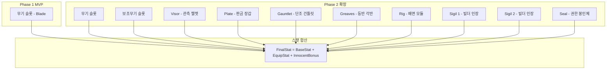
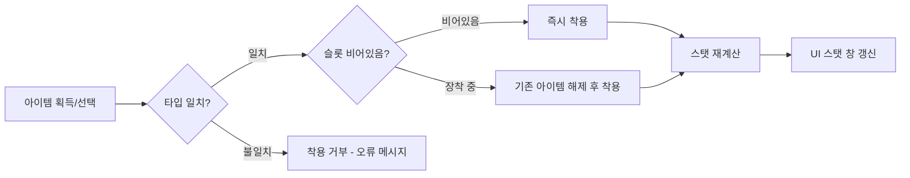

# 장비 슬롯 시스템 (Equipment Slots System)

## 구현 현황 (Implementation Status)

> 최근 업데이트: 2026-04-18
> 문서 상태: `작성 중 (Draft)`
> 2-Space: 전체 (World - 탐험/장비 관리, Item World - 아이템 획득/강화)
> 기둥: 야리코미
> 분류 결정: `memory/wiki/decisions/DEC-026.md` (장비 슬롯 sci-fi 리네이밍)

| 기능 ID  | 분류     | 기능명 (Feature Name)               | 우선순위 | 구현 상태 | 비고 (Notes)                        |
| :------- | :------- | :---------------------------------- | :------: | :-------- | :---------------------------------- |
| EQP-01-A | 슬롯     | 무기 슬롯 (MVP: Blade 1종)          |    P1    | 대기      | Phase 1 MVP 범위                    |
| EQP-01-B | 슬롯     | 전체 8슬롯 (무기/보조/Visor/Plate/Gauntlet/Greaves/Rig/Sigil x2/Seal) | P2 | 대기 | Phase 2 추가 (DEC-026 리네이밍 반영) |
| EQP-02-A | 착용     | 아이템 착용 규칙                    |    P1    | 대기      | 타입 일치 검증                      |
| EQP-02-B | 착용     | 아이템 해제 규칙                    |    P1    | 대기      | 빈 슬롯 복귀                        |
| EQP-03-A | 스탯합산 | 장비 스탯 → 캐릭터 스탯 합산        |    P1    | 대기      | FinalStat = Base + Equip + Innocent |
| EQP-03-B | 스탯합산 | 이노센트 보너스 합산                |    P2    | 대기      | Phase 2 이노센트 시스템 연동        |
| EQP-04-A | 데이터   | 아이템 데이터 구조 정의             |    P1    | 대기      | id/name/type/rarity/level/stats     |
| EQP-05-A | 세트효과 | 세트 장비 착용 보너스               |    P2    | 대기      | Phase 2 추가                        |
| EQP-07-A | UI       | 장비창 HUD                          |    P1    | 대기      | 슬롯 UI 표시                        |

---

## 0. 필수 참고 자료 (Mandatory References)

* Writing Standards: `Documents/Terms/GDD_Writing_Rules.md`
* Project Vision: `Documents/Terms/Project_Vision_Abyss.md`
* Glossary: `Documents/Terms/Glossary.md`
* 레어리티 시스템: `Documents/System/System_Equipment_Rarity.md`
* 데미지 시스템: `Documents/System/System_Combat_Damage.md`
* 이노센트 시스템: `Documents/System/System_Innocent_Core.md`
* 스탯 성장 시스템: `Documents/System/System_Growth_Stats.md`
* 아이템계 코어: `Documents/System/System_ItemWorld_Core.md`
* 장비 목록 데이터: `Sheets/Content_Stats_Weapon_List.csv`
* 장비 스탯 데이터: `Sheets/Content_Stats_Equipment_Base.csv`
* Game Overview: `Reference/게임 기획 개요.md`
* 아이템계 역기획서: `Reference/Disgaea_ItemWorld_Reverse_GDD.md`

---

## 1. 개요 (Concept)

### 1.1. 설계 의도 (Intent)

ECHORIS의 장비 슬롯 시스템은 다음 한 문장으로 정의한다:

> "아이템이 캐릭터의 일부가 되어, 아이템을 강화하는 것이 곧 나 자신을 강화하는 것이다"

장비 슬롯은 단순한 스탯 교체 창이 아니다. 각 장비 아이템은 내부에 아이템계(던전)를 품고 있으며, 플레이어는 그 아이템을 착용함으로써 그 장비의 강함을 전투에서 직접 증명한다. "이 검은 내가 모든 지층을 직접 클리어하며 키운 검"이라는 감정적 애착이 야리코미의 핵심 판타지이다.

### 1.2. 설계 근거 (Reasoning)

| 결정                        | 근거                                                                                   |
| :-------------------------- | :------------------------------------------------------------------------------------- |
| MVP는 무기 슬롯 1개만       | 핵심 루프(전투 - 아이템계 - 강화)가 작동하는지 검증이 우선. 슬롯 수는 나중에 확장     |
| 타입 제한 착용 규칙         | 무기 슬롯에 갑옷을 착용하는 오류 방지. 직관적 규칙이 학습 곡선을 줄임                 |
| 이노센트 보너스를 합산에 포함 | 이노센트가 장비에 귀속되므로, 장비를 착용해야 이노센트 효과도 활성화. 착용의 가치 강화 |
| 세트 효과를 Phase 2로 연기  | MVP에서 세트 조합 가짓수가 없음. 콘텐츠 볼륨 확보 후 도입이 적절                      |
| Cloak → Rig, Ring/Amulet → Sigil/Seal 리네이밍 (DEC-026) | 메가스트럭처 sci-fi 세계관에 판타지 용어(Cloak/Ring/Amulet) 충돌. Rig=배면 장착 모듈, Sigil=빌더 문양 인장, Seal=상위 빌더 권한 봉인체 |

### 1.3. 3대 기둥 정렬 (Pillar Alignment)

| 기둥                  | 장비 슬롯 시스템에서의 구현                                                              |
| :-------------------- | :--------------------------------------------------------------------------------------- |
| Metroidvania 탐험     | 장비 ATK/INT가 스탯 게이트 해금 조건. ATK 게이트(물리 장벽) + INT 게이트(마법 봉인). 더 강한 장비 = 새 구역 접근 가능 |
| Item World 야리코미   | 착용 중인 장비의 아이템계 진입 가능. 장비 강화 = 이노센트 보너스 증가 = 더 높은 스탯    |
| Online 멀티플레이     | 파티원의 장비 슬롯 구성이 역할을 결정 (탱커: 갑옷 특화, DPS: 무기 특화)                 |

### 1.4. 저주받은 문제 검증 (Cursed Problem Check)

| 문제                                               | 해결 방향                                                                               |
| :------------------------------------------------- | :-------------------------------------------------------------------------------------- |
| 장비 교체 시 이노센트 보너스가 사라지는 것이 억울하지 않은가? | 이노센트는 아이템에 귀속(아이템 전용 데이터). 교체 시 명확히 안내. Phase 2에서 이노센트 이식 비용 시스템 도입 |
| 착용 슬롯이 너무 많으면 관리 부담이 커지지 않는가?  | MVP 1슬롯, Phase 2 6슬롯으로 단계적 확장. UI는 착용 전 스탯 비교 지원                   |
| 저레어리티 장비는 고레어리티로 교체하면 버려지지 않는가? | 저레어리티도 아이템계 진입 후 이노센트를 고레어리티 아이템에 이식 가능 (Phase 2). 수집 가치 유지 |

### 1.5. 위험과 보상 (Risk & Reward)

| 전략                     | 위험 (Risk)                              | 보상 (Reward)                                  |
| :----------------------- | :--------------------------------------- | :--------------------------------------------- |
| 고레어리티 장비 착용     | 아이템계 전 지층 클리어 부담             | 최대 스탯 배율 + 이노센트 슬롯 8개             |
| 저레어리티 장비 강화 유지 | 고레어리티 대비 스탯 열세               | 이미 키운 이노센트 활용 가능, 아이템계 지층 부담 감소 |
| 여러 슬롯 고르게 강화    | 각 아이템계에 드는 시간 분산             | 균형 잡힌 스탯, 세트 효과 활성화 가능           |
| 한 슬롯(무기)에 집중     | 방어 스탯 부족                           | 최고 공격 스탯, 빠른 지층 클리어                |

---

## 2. 메커닉 (Mechanics)

### 2.1. 장비 슬롯 구조 (Slot Architecture)



### 2.2. 스탯 합산 공식 (Stat Aggregation Formula)

장비 착용 시 캐릭터의 최종 스탯은 다음 공식으로 산출된다:

```
FinalStat = BaseStat + EquipStat + InnocentBonus
```

| 항목          | 정의                                             | 산출 방식                              |
| :------------ | :----------------------------------------------- | :------------------------------------- |
| BaseStat      | 캐릭터 고유 기본 스탯 (레벨 보정 포함)           | `System_Growth_Stats.md` 참조          |
| EquipStat     | 착용한 모든 장비의 해당 스탯 합산                | 장비 baseStats 합산 * 레어리티 배율    |
| InnocentBonus | 착용 장비에 귀속된 이노센트들의 보너스 스탯 합산 | `System_Innocent_Core.md` 참조         |

세부 확장 공식 (Phase 2, 버프 포함):

```
FinalStat = (BaseStat + LevelBonus) + sum(EquipStat_i * Rarity_Multiplier_i) + sum(InnocentBonus_i) + BuffBonus
```

### 2.3. 착용 흐름 (Equip Flow)



### 2.4. 해제 흐름 (Unequip Flow)

- 인벤토리가 가득 찬 경우 해제 불가 (인벤토리 공간 확보 요청)
- 해제 즉시 해당 장비의 EquipStat 및 InnocentBonus 제거
- 스탯 재계산 후 UI 갱신

### 2.5. 아이템계 진입 규칙 (Item World Entry)

장비가 슬롯에 착용 중이어도 아이템계 진입 가능하다. 단, 아이템계 진입 시 해당 아이템을 "탐험 대상 아이템"으로 선택하며, 이는 해제와 별개이다.

- 착용 중 아이템계 진입: 허용. 탐험 중 스탯은 유지됨
- 착용 해제 없이 직접 아이템계 진입 가능
- 아이템계 내부에서 해당 아이템 레벨 상승 시 스탯 실시간 반영

---

## 3. 규칙 (Rules)

### 3.1. 착용 규칙 (Equip Rules)

| 규칙 ID | 규칙                                             | 예외                          |
| :------ | :----------------------------------------------- | :---------------------------- |
| EQP-R01 | 슬롯 타입과 아이템 타입이 일치해야 착용 가능     | 없음                          |
| EQP-R02 | 동일 슬롯에 동시에 2개 이상 착용 불가            | 없음                          |
| EQP-R03 | 착용 즉시 스탯 재계산 발생                       | 없음                          |
| EQP-R04 | 아이템계 탐험 중에도 착용/해제 가능 (월드 세이브 포인트 복귀 후) | 아이템계 내부에서의 조작은 월드 세이브 포인트 복귀 후 적용 |
| EQP-R05 | 저주받은 장비(Cursed Item)는 해제 불가 (Phase 2) | Phase 2 정의. MVP 미적용      |

### 3.2. 해제 규칙 (Unequip Rules)

| 규칙 ID | 규칙                                            | 예외                         |
| :------ | :---------------------------------------------- | :--------------------------- |
| EQP-R10 | 해제 시 인벤토리에 빈 공간이 1 이상 필요        | 없음                         |
| EQP-R11 | 해제 즉시 EquipStat 및 InnocentBonus 제거       | 없음                         |
| EQP-R12 | 해제 후 스탯이 스탯 게이트 기준치 미달이 되어도 현재 위치에서 강제 이동 없음 | 월드 이동 시 게이트 재검증   |

### 3.3. Phase별 슬롯 개방 규칙 (Phase Slot Unlock)

| Phase   | 개방 슬롯                              | 비고                             |
| :------ | :------------------------------------- | :------------------------------- |
| Phase 1 | 무기 슬롯 1개 (Blade)                  | MVP 범위. Blade 1종만 지원       |
| Phase 2 | 무기, 보조무기, Visor, Plate, Gauntlet, Greaves, Rig, Sigil×2, Seal | 총 10슬롯. 세트 효과 추가 |
| Phase 3 | Phase 2 유지 + 특수 슬롯 검토          | 특수 슬롯 확장 검토              |

### 3.4. 세트 효과 규칙 (Set Effect Rules) - Phase 2

- 동일 세트의 장비를 지정 개수 이상 착용 시 추가 스탯 또는 고유 효과 발동
- 세트 구성 요건 및 효과는 `Sheets/Content_Stats_SetEffect_List.csv` 참조
- MVP에서는 정의하지 않음

---

## 4. 데이터 & 파라미터 (Parameters)

### 4.1. 아이템 데이터 구조 (Item Data Structure)

모든 장비 아이템은 다음 구조를 따른다:

```yaml
item_data_structure:
  id: "ITM_WPN_BLADE_001"          # 아이템 고유 ID (문자열)
  name: "Starter Blade"            # 표시 이름
  type: "weapon"                   # 슬롯 타입: weapon / sub_weapon / visor / plate / gauntlet / greaves / rig / sigil / seal
  rarity: "Normal"                 # 등급: Normal / Magic / Rare / Legendary / Ancient
  level: 1                         # 현재 아이템 레벨 (아이템계 지층 클리어로 증가)
  baseStats:
    atk: 15                        # 기본 공격력 (Normal 검 Lv1 기준)
    def: 0
    int: 0
    vit: 0
    dex: 0
    spd: 0
    lck: 0
  innocents: []                    # 귀속된 이노센트 배열 (System_Innocent_Core.md 참조)
  itemWorldStrata: 2               # 아이템계 최대 지층 수 (레어리티에 따라 결정)
  currentItemWorldStratum: 0       # 현재 클리어된 아이템계 지층 수
  setId: null                      # 세트 ID (Phase 2, 미사용 시 null)
```

### 4.2. 슬롯 파라미터 (Slot Parameters)

```yaml
equipment_slots:
  phase1:
    slots:
      - id: "weapon"
        name: "무기"
        allowed_types: ["weapon"]
        count: 1
    total_slots: 1

  phase2:
    slots:
      - id: "weapon"
        name: "Weapon"
        allowed_types: ["weapon"]
        count: 1
      - id: "sub_weapon"
        name: "Sub Weapon"
        allowed_types: ["sub_weapon"]
        count: 1
      - id: "visor"
        name: "Visor"
        allowed_types: ["visor"]
        count: 1
      - id: "plate"
        name: "Plate"
        allowed_types: ["plate"]
        count: 1
      - id: "gauntlet"
        name: "Gauntlet"
        allowed_types: ["gauntlet"]
        count: 1
      - id: "greaves"
        name: "Greaves"
        allowed_types: ["greaves"]
        count: 1
      - id: "rig"
        name: "Rig"
        allowed_types: ["rig"]
        count: 1
      - id: "sigil"
        name: "Sigil"
        allowed_types: ["sigil"]
        count: 2
      - id: "seal"
        name: "Seal"
        allowed_types: ["seal"]
        count: 1
    total_slots: 10  # 무기 2 + 장비 5(Visor/Plate/Gauntlet/Greaves/Rig) + 장신구 3(Sigil×2 + Seal)
```

### 4.3. MVP 기준 수치 (MVP Base Values)

```yaml
mvp_base_values:
  character_base_stats:
    hp: 100
    mp: 100
    str: 10
    int: 8
    dex: 9
    vit: 10
    spd: 8
    lck: 5

  blade_normal_lv1:
    id: "ITM_WPN_BLADE_NORMAL_001"
    name: "Starter Blade"
    type: "weapon"
    rarity: "Normal"
    level: 1
    baseStats:
      atk: 15    # Normal Blade 기본 ATK. System_Equipment_Rarity.md 배율 x1.0 적용
    itemWorldDepth: 30

  stat_gate_example:
    zone_b_atk_gate: 20    # ATK 20 이상 시 B구역 통과 가능 (MVP 예시)
    # 장비 ATK 합산으로 달성해야 하는 값
```

### 4.4. 참조 데이터 시트 (Referenced Data Sheets)

| 시트 경로                                   | 포함 데이터                        |
| :------------------------------------------ | :--------------------------------- |
| `Sheets/Content_Stats_Weapon_List.csv`      | 무기 목록, 기본 스탯, 레어리티     |
| `Sheets/Content_Stats_Equipment_Base.csv`   | 전체 장비 기본 스탯 테이블         |
| `Sheets/Content_Stats_SetEffect_List.csv`   | 세트 효과 목록 (Phase 2)           |

---

## 5. 예외 처리 (Edge Cases)

### 5.1. 착용 관련 예외

| 케이스                               | 처리 방식                                                               |
| :----------------------------------- | :---------------------------------------------------------------------- |
| 인벤토리 가득 찬 상태에서 교체 시도  | "인벤토리 공간이 부족합니다" 경고 표시. 기존 장비 유지                  |
| 아이템계 탐험 중 착용 슬롯 변경 시도 | 아이템계 탐험 중 착용 변경 불가. 월드 세이브 포인트 복귀 후 가능 안내                 |
| 타입 불일치 착용 시도                | "해당 슬롯에 착용할 수 없는 아이템입니다" 표시. 착용 거부               |
| 동일 아이템을 2개 슬롯에 착용 시도   | 동일 아이템 ID는 1개 슬롯에만 착용 가능. 두 번째 착용 시 기존 슬롯에서 이동 처리 |

### 5.2. 스탯 게이트 관련 예외

| 케이스                                      | 처리 방식                                                              |
| :------------------------------------------ | :--------------------------------------------------------------------- |
| 장비 해제 후 스탯 게이트 기준치 미달         | 현재 위치 유지. 해당 게이트 구역 재진입 시 통과 불가 안내             |
| 게이트 통과 중 장비 해제 (연출 도중)         | 게이트 통과 완료 처리 후 해제 반영. 연출 중단 없음                    |
| 이노센트 제거 후 InnocentBonus 하락으로 미달 | 장비 해제 규칙 동일 적용. 재진입 시 게이트 재검증                     |

### 5.3. 데이터 무결성 예외

| 케이스                          | 처리 방식                                                              |
| :------------------------------ | :--------------------------------------------------------------------- |
| 알 수 없는 아이템 타입           | 서버 로드 시 타입 검증. 알 수 없는 타입은 착용 불가 처리               |
| 아이템 데이터 손상 (innocents 배열 null) | null 안전 처리. InnocentBonus = 0으로 폴백                      |
| 레어리티 없는 아이템 데이터      | Normal으로 폴백 처리. 개발 로그에 경고 기록                           |

---

## 검증 기준 (Verification Checklist)

- [ ] FinalStat = BaseStat + EquipStat + InnocentBonus 공식이 모든 슬롯에 일관되게 적용되는가?
- [ ] 타입 불일치 착용 시도가 명확한 오류 메시지와 함께 거부되는가?
- [ ] 장비 착용/해제 시 스탯 UI가 즉시 갱신되는가?
- [ ] 아이템 데이터 구조(id, name, type, rarity, level, baseStats, innocents[])가 모든 아이템에 완전하게 정의되어 있는가?
- [ ] MVP Blade Normal Lv1의 ATK 15가 전투 데미지 공식에 정확히 반영되는가? (`System_Combat_Damage.md` 연동)
- [ ] Phase 2 슬롯 10종(무기 2 + Visor/Plate/Gauntlet/Greaves/Rig + Sigil×2/Seal)이 DEC-026 리네이밍을 따르는가?
- [ ] 장비 해제 후 스탯 게이트 미달 상태에서 게이트 구역 재진입 시 차단이 동작하는가?
- [ ] Phase 2 슬롯(세트 효과)은 데이터 구조만 정의되고 Phase 1에서 기능이 활성화되지 않는가?
- [ ] 이 시스템이 야리코미 기둥(아이템계 강화 - 스탯 상승 - 탐험 확장)의 순환 구조를 강화하는가?
