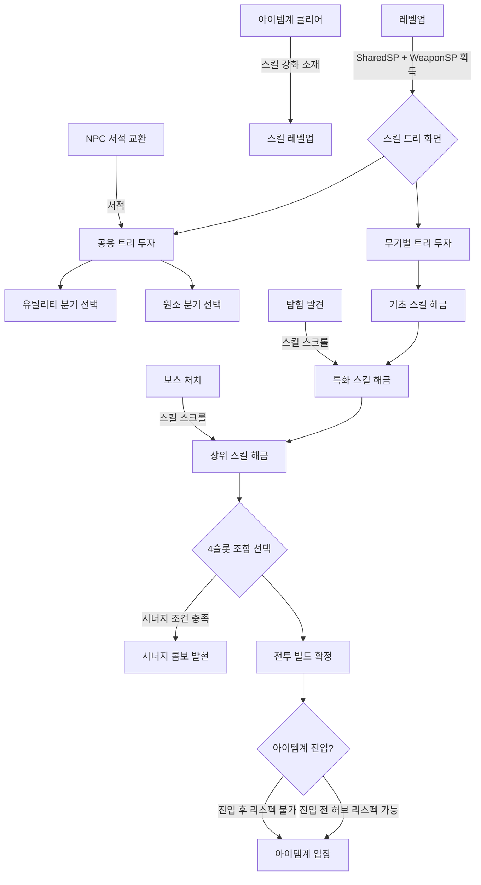

# 스킬 트리 시스템 (Skill Tree System) — SYS-LVL-03

## 구현 현황 (Implementation Status)

> 최근 업데이트: 2026-03-29
> 문서 상태: `작성 중 (Draft)`
> 3-Space: 전체 (World + Item World + Hub)
> 기둥: 메트로베니아 탐험 + 아이템계 야리코미 + 온라인 멀티플레이

| 기능 ID   | 분류         | 기능명                               | 우선순위 | 구현 상태 | 비고                                     |
| :-------- | :----------- | :----------------------------------- | :------: | :-------- | :--------------------------------------- |
| SKL-01-A  | 트리 구조    | 공용 트리 (유틸리티/원소 분기)       |    P1    | 대기      | 무기 교체 시에도 유지되는 캐릭터 정체성  |
| SKL-01-B  | 트리 구조    | 검 전용 트리 (MVP 구현)              |    P1    | 대기      | Phase 1 검증 무기                        |
| SKL-01-C  | 트리 구조    | 나머지 7종 무기별 트리               |    P2    | 대기      | Phase 2 구현                             |
| SKL-02-A  | SP 시스템    | SP 획득 및 소비 규칙                 |    P1    | 대기      | 레벨업 SP = 핵심 획득 경로              |
| SKL-02-B  | SP 시스템    | SP 총량 부족 설계                    |    P1    | 대기      | 전 스킬 최대화 불가 = 선택 강제         |
| SKL-03-A  | 스킬 획득    | 레벨업 SP 투자 시스템                |    P1    | 대기      | 레벨당 SP 지급                          |
| SKL-03-B  | 스킬 획득    | 보스 처치 / 탐험 스킬 스크롤         |    P1    | 대기      | 희귀 스킬 해금                          |
| SKL-03-C  | 스킬 획득    | 아이템계 보상 스킬 강화 소재         |    P2    | 대기      | 야리코미 동기                           |
| SKL-03-D  | 스킬 획득    | NPC 스킬 서적 교환                   |    P2    | 대기      | 허브 경제 참여 유인                     |
| SKL-04-A  | 스킬 깊이    | 스킬 레벨 시스템 (Lv 1-5 MVP)       |    P1    | 대기      | SP 재투자로 스킬 강화                   |
| SKL-04-B  | 스킬 깊이    | 공중/지상 발동 차별화                |    P2    | 대기      | 같은 스킬, 공중 발동 시 다른 효과       |
| SKL-04-C  | 스킬 깊이    | 시너지 콤보 (2스킬 장착 시 발현)     |    P2    | 대기      | Hades 듀오 부운 참조                    |
| SKL-04-D  | 스킬 깊이    | 이노센트 스킬 수정 연동              |    P2    | 대기      | System_Innocent_Core.md 연동            |
| SKL-05-A  | 스케일링     | SkillDamage 공식 구현                |    P1    | 대기      | SkillBase × 스탯 × 레벨 × 원소보너스   |
| SKL-06-A  | 리스펙       | 허브 NPC 리스펙 시스템               |    P1    | 대기      | Dead Cells식 점진 비용                  |
| SKL-06-B  | 리스펙       | 아이템계 리스펙 불가 규칙            |    P1    | 대기      | 진입 전 빌드 확정 강제                  |

---

## 0. 필수 참고 자료 (Mandatory References)

- Writing Standards: `Documents/Terms/GDD_Writing_Rules.md`
- Project Vision: `Documents/Terms/Project_Vision_Abyss.md`
- Glossary: `Documents/Terms/Glossary.md`
- 스킬 시스템 리서치: `Documents/Research/SkillSystem_ActionRPG_Research.md`
- 전투 액션 시스템: `Documents/System/System_Combat_Action.md` — 4슬롯, 5카테고리, 원소 시너지
- 성장 스탯 시스템: `Documents/System/System_Growth_Stats.md` — 6대 스탯, FinalStat 공식
- 레벨과 경험치 시스템: `Documents/System/System_Growth_LevelExp.md` — 레벨 곡선, SP 획득
- 성장과 보상 설계: `Documents/Design/Design_Progression_Reward.md` — 성장 곡선, 야리코미 곡선
- 무기 시스템: `Documents/System/System_Combat_Weapons.md` — 8종 무기 정의
- 이노센트 시스템: `Documents/System/System_Innocent_Core.md` — 스킬 수정 연동
- 스킬 수치 데이터: `Sheets/Content_Skills_Weapon.csv` — 무기별 스킬 목록 (SSoT)
- 스킬 수치 데이터: `Sheets/Content_Skills_Shared.csv` — 공용 스킬 목록 (SSoT)
- Game Overview: `Reference/게임 기획 개요.md`

---

## 1. 개요 (Concept)

### 1.1. 설계 의도 (Intent)

Project Abyss의 스킬 트리 시스템은 다음 한 문장으로 정의한다:

> "무기를 고르면 전투의 언어가 결정되고, 스킬 트리를 고르면 그 언어의 방언이 결정된다"

스킬 트리는 세 가지 설계 목표를 동시에 달성해야 한다.

- 무기 8종 간 개성: 검을 든 빌드와 대검을 든 빌드는 전투 경험이 근본적으로 달라야 한다.
- 야리코미 깊이: SP는 항상 부족하다. 플레이어는 "무엇을 포기하고 무엇을 선택할 것인가"를 지속적으로 고민해야 한다.
- 캐릭터 정체성: 무기를 교체해도 공용 트리에 투자한 이동/생존/원소 역량은 유지된다.

4개 스킬 슬롯이라는 제약 안에서 수십 종의 스킬 중 4개를 선택하는 것이 빌드 다양성의 핵심이다. 스킬 트리는 그 선택지의 풀(pool)을 결정하는 구조다.

### 1.2. 설계 근거 (Reasoning)

| 결정 | 근거 | 레퍼런스 |
| :--- | :--- | :--- |
| 무기별 분기 + 공용 트리 하이브리드 | 무기 교체 = 사실상 전직. 8종 무기가 8개 빌드 방향을 결정. 공용 트리가 캐릭터 아이덴티티 담당 | 메이플스토리(전직), PoE(공유 패시브 트리) |
| SP 총량 부족 설계 | 모든 스킬 최대화 불가 = 선택의 무게 발생. 빌드 비교와 최적화가 야리코미의 지식 파밍 동기가 됨 | DFO (SP 부족이 빌드를 결정) |
| 공용 원소 분기 | System_Combat_Action.md에 정의된 원소 시너지(화염↔빙결, 번개+수분 등)를 스킬 트리 레이어에서 강화 | Hades(신별 테마 특화) |
| 리스펙 점진 비용 | 실험을 허용하되 남용을 억제. 초기 리스펙은 저렴하여 신규 플레이어의 실수 교정 가능. 반복 리스펙은 비용 상한으로 제어 | Dead Cells(1,000 → 8,000 상한) |
| 아이템계 리스펙 불가 | 진입 전 빌드 확정 = 준비 단계의 전략적 긴장감 강화. 아이템계 내에서 빌드 흔들림 방지 | — |
| 스킬 레벨 시스템 | 같은 스킬에 추가 SP 투자로 강화. "어떤 스킬을 높은 레벨로 올릴 것인가"가 추가 선택 레이어 | DFO(SP 투자 레벨업) |

### 1.3. 3대 기둥 정렬 (Pillar Alignment)

| 기둥 | 스킬 트리 시스템에서의 구현 |
| :--- | :--- |
| 메트로베니아 탐험 | 공용 유틸리티 분기의 탐험 스킬(벽 감지, 비밀방 발견 보조 등)이 탐험 범위에 직접 기여. 보스 처치로 희귀 스킬 스크롤 획득 = 능력 게이트와 연계 |
| 아이템계 야리코미 | 아이템계 보상으로 스킬 강화 소재 획득. 스킬 레벨 최대화를 위해 아이템계 반복 진입 동기 발생. 이노센트가 스킬 효과를 수정하여 야리코미 깊이 추가 |
| 온라인 멀티플레이 | 빌드별 파티 역할 자연 분화. 도발/보호막 스킬(탱커) + 범위 공격 스킬(딜러) + 버프/디버프(서포터) 조합이 협동의 시너지를 만듦 |

### 1.4. 저주받은 문제 검증 (Cursed Problem Check)

| 문제 | 위험 | 해결 방향 |
| :--- | :--- | :--- |
| SP 부족이 신규 플레이어를 좌절시키지 않는가 | 선택지가 너무 많을 때 선택 마비(Paradox of Choice) 발생 | 공용 트리의 기본 스킬 3개를 Lv 1-5 구간에서 자동 제안. 첫 빌드는 "추천 경로"를 명시 |
| 특정 스킬 조합이 지배적(dominant) 전략이 되지 않는가 | PoE의 사례처럼 메타 스킬 2-3종이 모든 다른 선택을 무의미하게 만듦 | 비대칭 설계: 빌드별 명확한 강점/약점. 같은 스킬이 상황(보스전/군중전/아이템계)에 따라 가치 변동 |
| 무기 교체 시 투자한 무기별 SP가 낭비로 느껴지지 않는가 | 무기를 바꿀 때마다 이전 투자가 사라지면 무기 다양성 탐험 의지 저하 | 무기별 스킬 레벨은 무기에 귀속하여 유지. 무기 교체 시 이전 무기의 스킬 레벨은 보존 |
| 공용 트리와 무기별 트리의 SP 경쟁이 너무 심하지 않는가 | 공용 트리에 투자하면 무기별 트리가 약해지고 그 반대도 마찬가지인 딜레마 | SP 풀을 공용/무기별 두 풀로 분리하여 각 영역의 투자가 독립 운영 |

### 1.5. 위험과 보상 (Risk & Reward)

| 행동 | 위험 (Risk) | 보상 (Reward) |
| :--- | :--- | :--- |
| 무기별 스킬에 SP 집중 | 공용 유틸리티/원소 부족. 이동성 및 생존성 저하 | 해당 무기 전투 효율 극대화, 빌드 정체성 강화 |
| 공용 원소 분기에 SP 집중 | 무기 고유 스킬이 약함. 기본 공격 의존도 증가 | 어떤 무기를 들어도 강력한 원소 시너지 발동. 파티 기여 높음 |
| 스킬 레벨 1개에 몰빵 | 슬롯 다양성 소실. 다른 상황 대응 스킬 부재 | 해당 스킬의 위력/범위 극대화. 단일 패턴 숙련 빌드 |
| 스킬 레벨 분산 투자 | 어느 스킬도 최고 위력에 도달 못함 | 다양한 상황 대응. 4슬롯 전체의 고른 전투력 유지 |
| 아이템계 진입 전 빌드 미확정 | 부적합한 빌드로 진입 시 지층 클리어 실패 위험 | (없음. 이것이 준비 단계 긴장감의 핵심) |
| 리스펙 반복 사용 | 비용 증가로 허브 골드 소모 가속 | 빌드 실험 가능. 현재 컨텐츠에 최적화된 빌드로 전환 |

---

## 2. 핵심 규칙 (Core Rules)

### 2.1. 스킬 트리 구조

스킬 트리는 공용 트리(Shared Tree)와 무기별 트리(Weapon Tree) 두 층으로 구성된다.

```
[공용 트리] — 무기 교체 시 유지됨
├── 유틸리티 분기 (Utility Branch)
│   ├── 이동 스킬 (이중 대시, 공중 체공 연장, 방향 전환 대시)
│   ├── 생존 스킬 (보호막, HP 흡혈, 부활 일회 효과)
│   └── 탐험 스킬 (LCK 보조, 비밀방 감지 범위 증가)
└── 원소 분기 (Elemental Branch)
    ├── 화염 계열 (화상 상태이상, 빙결 해제 + 폭발)
    ├── 빙결 계열 (빙결 상태이상, 둔화 효과)
    ├── 번개 계열 (감전, 수분 상태 대상 범위 확산)
    └── 암흑 계열 (디버프, 흡혈, 광역 약화)

[무기별 트리] — 해당 무기 장착 시에만 접근 가능
├── 검 트리 (Sword Tree) — Phase 1 MVP
├── 창 트리 (Spear Tree) — Phase 2
├── 도끼 트리 (Axe Tree) — Phase 2
├── 채찍 트리 (Whip Tree) — Phase 2
├── 지팡이 트리 (Staff Tree) — Phase 2
├── 너클 트리 (Knuckle Tree) — Phase 2
├── 활 트리 (Bow Tree) — Phase 2
└── 대검 트리 (Greatsword Tree) — Phase 2
```

#### 각 트리의 노드 구성

무기별 트리 1종당 스킬 노드 수:

| 노드 유형 | 수량 | 설명 |
| :--- | :---: | :--- |
| 기초 스킬 노드 | 4개 | 진입 비용 낮음. 트리 초반 배치. 핵심 공격/이동 패턴 정의 |
| 특화 스킬 노드 | 6개 | 기초 노드 이후 개방. 역할(딜/탱/서포) 방향 결정 |
| 상위 스킬 노드 | 4개 | 특화 노드 2개 이상 선행 투자 필요. 강력하고 고유한 효과 |
| 시너지 노드 | 2개 | 특정 조합 스킬 2개 동시 장착 시 자동 발현. 슬롯 소비 없음 |

공용 트리 노드 수:

| 분기 | 노드 수 | 설명 |
| :--- | :---: | :--- |
| 유틸리티 분기 | 12개 | 이동/생존/탐험 각 4개 |
| 원소 분기 | 16개 | 화염/빙결/번개/암흑 각 4개 |
| 합계 | 28개 | — |

#### SP 풀 분리

```yaml
sp_pool:
  shared_pool:   # 공용 트리 전용 SP
    source: "레벨업 시 자동 배분 (레벨당 SharedSP 지급)"
    note: "무기 교체와 무관하게 유지"
  weapon_pool:   # 무기별 트리 전용 SP
    source: "레벨업 시 자동 배분 (레벨당 WeaponSP 지급) + 스킬 스크롤 + 아이템계 보상"
    note: "각 무기별로 독립된 WeaponSP 풀. 무기 A의 SP는 무기 B에 사용 불가"
```

> 설계 원칙: SP 풀을 두 층으로 분리하는 이유는 공용 트리와 무기 트리 간 경쟁을 제거하기 위함이다. 플레이어는 "내 캐릭터를 어떻게 만들 것인가"(공용)와 "이 무기로 어떻게 싸울 것인가"(무기별)를 독립적으로 결정한다.

### 2.2. SP 획득 규칙

#### 획득 경로

| 획득 경로 | SP 유형 | 3-Space | 수량 | 설계 의도 |
| :--- | :--- | :--- | :--- | :--- |
| 레벨업 | SharedSP + WeaponSP | 전체 | 레벨당 SharedSP `SP_Shared_Per_Level`, WeaponSP `SP_Weapon_Per_Level` | 성장의 주 경로. 매 레벨 선택 발생 |
| 보스 처치 스크롤 | WeaponSP 또는 특수 스킬 해금 | World + Item World | 보스별 고정 | 목표 부여. 희귀 스킬 접근 유인 |
| 아이템계 보상 | 스킬 강화 소재 | Item World | 지층 보스별 | 야리코미 동기. 아이템계 클리어가 스킬 강화로 연결 |
| NPC 스킬 서적 | WeaponSP 또는 특수 스킬 해금 | Hub | 교환 비용 비례 | 허브 경제 참여 유인. 골드/이노센트 소모 |

#### SP 총량 설계 (SP 부족 원칙)

MVP(Lv 1-10) 기준 SP 총량 설계:

```yaml
sp_budget_mvp:
  total_shared_sp_at_lv10: "SP_Shared_Max_MVP"   # 공용 트리 최대 투자 가능량
  total_weapon_sp_at_lv10: "SP_Weapon_Max_MVP"   # 무기별 트리 최대 투자 가능량
  shared_tree_full_cost: "SP_Shared_Full_Cost"   # 공용 트리 전체 해금 비용
  weapon_tree_full_cost: "SP_Weapon_Full_Cost"   # 무기별 트리 전체 해금 비용
  design_constraint: "total_sp < full_cost × 0.7"
  # 총 SP가 모든 스킬을 최대화하는 데 필요한 비용의 70% 이하여야 한다.
  # 이 비율이 유지될 때 선택의 의미가 살아있다.
```

> 설계 원칙: SP가 넉넉하면 스킬 트리는 "할 일 목록"이 된다. SP가 부족해야 스킬 트리는 "정체성 선언"이 된다. 야리코미 플레이어는 스킬 최적화를 지식 파밍의 대상으로 삼는다.

구체적 수치는 `Sheets/Content_Skills_SP_Budget.csv` 참조.

### 2.3. 스킬 획득 및 해금 규칙

#### 기본 해금 경로 (레벨 기반)

특정 스킬 노드는 최소 캐릭터 레벨 조건을 갖는다.

| 노드 유형 | 최소 레벨 조건 | SP 비용 범위 |
| :--- | :--- | :--- |
| 기초 스킬 노드 | 없음 (Lv 1부터 접근) | `SP_Skill_Basic_Min` - `SP_Skill_Basic_Max` |
| 특화 스킬 노드 | Lv 3 이상 + 기초 노드 1개 이상 투자 | `SP_Skill_Spec_Min` - `SP_Skill_Spec_Max` |
| 상위 스킬 노드 | Lv 7 이상 + 특화 노드 2개 이상 투자 | `SP_Skill_Upper_Min` - `SP_Skill_Upper_Max` |
| 시너지 노드 | 해당 스킬 2개 동시 장착 시 자동 발현 | 0 (조건 충족 시 무료) |

#### 특수 해금 경로 (보스/탐험/NPC)

모든 스킬 노드가 SP 투자만으로 해금되는 것은 아니다. 아래 유형은 먼저 스크롤/서적을 획득해야 SP 투자가 가능해진다.

| 해금 방식 | 스킬 예시 | 획득 조건 | 설계 목적 |
| :--- | :--- | :--- | :--- |
| 보스 스킬 스크롤 | "결계 파쇄 베기" (검 상위 스킬) | 특정 월드 보스 처치 | 보스 도전 동기. 목표 부여 |
| 탐험 발견 스크롤 | "공중 회전 베기" (검 특화) | 숨겨진 방 내 보물함 | 탐험 보상. 메트로베니아 기둥 강화 |
| NPC 서적 교환 | "공용 유틸: 응급 대피" | 허브 NPC 골드/아이템 교환 | 허브 경제 참여 유인 |
| 아이템계 지층 보상 | 스킬 강화 소재 (기존 스킬 레벨 상한 해제) | 아이템계 지층 보스 처치 | 야리코미 동기 |

### 2.4. 스킬 레벨 시스템

하나의 스킬 노드에 SP를 추가 투자하여 스킬의 레벨을 올릴 수 있다.

#### 스킬 레벨 규칙

| 항목 | 규칙 |
| :--- | :--- |
| 레벨 범위 | Lv 1 - 5 (MVP). Phase 2에서 Lv 10까지 확장 |
| 레벨업 조건 | SP 추가 투자 (누적 비용 방식) |
| 레벨업 효과 | 스킬 기본 피해(SkillBase) 증가 + 특정 레벨 임계점에서 효과 변경 |
| 효과 변경 임계점 | Lv 3: 부수 효과 추가 (상태이상 확률 등). Lv 5: 범위/사거리 증가 또는 쿨다운 감소 |

예시 (검 기초 스킬 "검기 방출"):

| 스킬 레벨 | SkillBase 배율 | 추가 효과 |
| :--- | :--- | :--- |
| Lv 1 | 1.0 | 전방 투사체 1발 |
| Lv 2 | 1.1 | — |
| Lv 3 | 1.2 | 피격 시 5% 확률 출혈 상태이상 부여 |
| Lv 4 | 1.35 | — |
| Lv 5 | 1.5 | 투사체 2발로 증가 (분기 발사) |

구체적 배율은 `Sheets/Content_Skills_Weapon.csv` 참조.

### 2.5. 공중/지상 발동 차별화 규칙

일부 스킬은 공중 발동 시 효과가 달라진다. 이 차별화는 전투 공간 활용과 전략 깊이를 추가한다.

#### 적용 범위

모든 스킬이 공중/지상 차별화를 갖지 않는다. 아래 유형의 스킬만 차별화를 가진다.

| 차별화 유형 | 예시 스킬 | 지상 효과 | 공중 효과 |
| :--- | :--- | :--- | :--- |
| 방향 전환형 | 돌진 스킬 | 수평 돌진 + 히트박스 | 사선 돌진 + 공중 콤보 연장 |
| 낙하형 | 충격파 스킬 | 전방 범위 충격파 | 하방 충격 + 착지 시 추가 범위 |
| 버프형 | 속도 강화 | 지상 이동속도 증가 | 공중 체공 시간 연장 |

이 규칙은 Phase 2 구현 대상이다. MVP에서는 모든 스킬이 지상/공중 동일 효과로 동작한다.

### 2.6. 시너지 콤보 규칙

특정 두 스킬을 동시에 장착하면 시너지 효과가 자동 발현된다. 슬롯을 추가 소비하지 않는다.

#### 발현 조건

- 해당 두 스킬이 4개 슬롯 중 어느 위치에든 동시에 장착된 상태
- 두 스킬 중 하나라도 슬롯에서 제거하면 시너지 효과가 즉시 사라짐

예시 시너지:

| 스킬 A | 스킬 B | 시너지 효과 |
| :--- | :--- | :--- |
| 화염 슬래시 | 원소 분기: 화염 파열 | 화상 상태 적에게 추가 폭발 피해 |
| 빙결 화살 | 번개 일격 | 빙결 상태 적이 감전 범위로 작용 |
| 방어 보호막 | 반격 카운터 | 보호막 적중 시 반격 쿨다운 50% 감소 |

구체적 시너지 목록은 `Sheets/Content_Skills_Synergy.csv` 참조.

### 2.7. 리스펙 규칙

#### 허용 조건

| 위치 | 리스펙 가능 여부 | 조건 |
| :--- | :--- | :--- |
| 허브 NPC "기억의 서기" | 가능 | 골드 비용 지불 |
| 월드 필드 | 불가 | — |
| 아이템계 진입 중 | 불가 | 진입 전 빌드 확정 = 준비 긴장감의 핵심 |
| 아이템계 대기실 (진입 전) | 가능 | 허브 NPC와 동일 비용 |

#### 리스펙 비용 구조 (Dead Cells 참조)

리스펙 횟수가 누적될수록 비용이 증가하며, 일정 상한에서 고정된다.

```yaml
respec_cost:
  base_gold: "RESPEC_BASE_GOLD"            # 첫 리스펙 비용
  cost_multiplier: "RESPEC_COST_MULT"      # 누적 횟수마다 곱해지는 배율
  cost_cap: "RESPEC_COST_CAP"              # 상한. 이 이상 오르지 않음
  # 예시 구조: 1,000 → 2,000 → 4,000 → 8,000(상한)
  counter_reset: "매 새 세션(로그인 주기) 카운터 1 감소"
  # 매일 접속 시 리스펙 비용이 조금씩 내려가서 장기 미접속 패널티 방지
```

구체적 수치는 `Sheets/Content_System_Respec.csv` 참조.

#### 리스펙 범위

- SharedSP와 WeaponSP는 각각 독립적으로 리스펙 가능 ("공용 리스펙" / "무기 리스펙" 분리)
- 공용 리스펙 비용과 무기별 리스펙 비용은 각자 독립 카운터를 가짐
- 리스펙 시 해당 SP 풀의 투자가 전액 환급되고, 스킬이 모두 초기화됨
- 특수 해금 스크롤로 개방한 노드는 리스펙 후에도 개방 상태 유지 (스크롤은 재소모 불필요)

---

## 3. 수치 설계 (Numerical Design)

### 3.1. 스킬 데미지 공식

모든 스킬 데미지는 아래 기본 공식으로 산출한다.

```
SkillDamage = SkillBase × (1 + PrimaryStat × ScalingCoeff) × SkillLevelMult × ElementBonus
```

변수 정의:

| 변수 | 정의 | 입력 범위 | 출처 |
| :--- | :--- | :--- | :--- |
| SkillBase | 스킬 고유 기본 피해 수치 | 양의 정수 | `Sheets/Content_Skills_Weapon.csv` |
| PrimaryStat | 스킬의 주 스케일링 스탯 FinalStat 값 | Lv1~Max | `System_Growth_Stats.md` §2.2 |
| ScalingCoeff | 스탯 1단위당 피해 반영 계수. 스킬별 개별 정의 | 0.01 - 0.05 | `Sheets/Content_Skills_Weapon.csv` |
| SkillLevelMult | 스킬 레벨에 따른 피해 배율 | 1.0(Lv1) - 1.5(Lv5), 이후 확장 | §2.4 스킬 레벨 테이블 |
| ElementBonus | 원소 시너지 적용 시 추가 배율 | 1.0(기본) / 1.2(약점) / 1.5(시너지 반응) | `System_Combat_Action.md` §원소 시너지 |

#### 예시 계산 (Lv 5 캐릭터, 검 기초 스킬 "검기 방출" Lv 3)

가정값: SkillBase = 25, PrimaryStat(STR) = 18 (FinalStat), ScalingCoeff = 0.03, SkillLevelMult = 1.2, ElementBonus = 1.0

```
SkillDamage = 25 × (1 + 18 × 0.03) × 1.2 × 1.0
            = 25 × (1 + 0.54) × 1.2
            = 25 × 1.54 × 1.2
            = 25 × 1.848
            = 46.2 → 46 (소수점 버림)
```

원소 시너지 발동 시 (빙결 상태 적에게 화염 공격, ElementBonus = 1.5):

```
SkillDamage = 25 × 1.54 × 1.2 × 1.5 = 69.3 → 69
```

#### 스탯별 주 스케일링 스킬 분류

| 주 스케일링 스탯 | 스킬 유형 | ScalingCoeff 기본값 |
| :--- | :--- | :--- |
| STR | 근접 물리 공격 스킬 | 0.03 |
| INT | 마법/원소 공격 스킬, 버프 | 0.03 |
| DEX | 원거리/투사체 스킬, 크리티컬 특화 | 0.025 |
| VIT | 생존 스킬 (흡혈, 보호막 수치) | 0.02 |

> 설계 원칙: ScalingCoeff를 낮게 유지하면(0.02-0.05) 스탯이 오를수록 스킬 피해가 선형에 가깝게 증가한다. 지수적 성장은 후반 밸런스 붕괴의 주요 원인이므로 계수를 보수적으로 설정하고, 피해 체감은 SkillBase와 SkillLevelMult에서 확보한다.

### 3.2. 무기별 스킬 트리 개요 (Phase 2 목표 스펙)

#### 검 트리 (MVP — Phase 1 구현 대상)

| 노드 | 스킬명 | 유형 | 주 스탯 | 파티 역할 | 해금 조건 |
| :--- | :--- | :--- | :--- | :--- | :--- |
| 기초 1 | 검기 방출 | 원거리 액티브 | STR | 딜러 | Lv 1 |
| 기초 2 | 도약 참격 | 근접 액티브 (공중) | STR | 딜러 | Lv 1 |
| 기초 3 | 파훼 베기 | 근접 액티브 (방어 무시) | STR | 딜러 | Lv 1 |
| 기초 4 | 검의 맹세 | 버프 (ATK 증가) | STR | 서포터 보조 | Lv 1 |
| 특화 A | 회선 베기 | 범위 액티브 | STR | 군중제어 딜러 | Lv 3 + 기초 1 투자 |
| 특화 B | 꿰뚫기 | 근접 액티브 (관통) | DEX | 리치 딜러 | Lv 3 + 기초 3 투자 |
| 특화 C | 강화 도약 | 이동 + 공격 | STR | 기동 딜러 | Lv 3 + 기초 2 투자 |
| 특화 D | 무사의 기개 | 버프 (방어 증가) | VIT | 탱커 보조 | Lv 3 + 기초 4 투자 |
| 특화 E | 검기 폭발 | 범위 액티브 | INT+STR | 하이브리드 | Lv 3 + 기초 1 투자 |
| 특화 F | 흡혈 베기 | 근접 액티브 (흡혈) | STR | 생존 딜러 | Lv 3 + 기초 3 투자 |
| 상위 A | 결계 파쇄 베기 | 범위 액티브 (슈퍼아머 무시) | STR | 대보스 특화 | Lv 7 + 특화 A, B 투자 + 보스 스크롤 |
| 상위 B | 검기 폭풍 | 범위 액티브 (AoE) | INT | 마검 특화 | Lv 7 + 특화 C, E 투자 |
| 상위 C | 검의 각성 | 버프 (전 스탯 일시 상승) | STR | 바스트 버퍼 | Lv 7 + 특화 D, F 투자 |
| 상위 D | 절초 (絶招) | 근접 액티브 (최대 피해) | STR | 최종 기술 | Lv 7 + 특화 A, B, C 중 2개 투자 |
| 시너지 1 | 검기 연폭 | 시너지 (장착 조건 충족 시 자동) | — | — | "검기 방출" + "검기 폭발" 동시 장착 |
| 시너지 2 | 흡혈 폭발 | 시너지 | — | — | "흡혈 베기" + "검기 폭발" 동시 장착 |

나머지 7종 무기 트리의 스킬 목록은 `Sheets/Content_Skills_Weapon.csv` 참조.

### 3.3. 공용 트리 개요

#### 유틸리티 분기

| 노드 | 스킬명 | 유형 | 주 스탯 | 탐험/전투 효과 | 해금 조건 |
| :--- | :--- | :--- | :--- | :--- | :--- |
| 이동 1 | 빠른 대시 | 패시브 | SPD | 대시 쿨다운 `DASH_CD_REDUCTION` 감소 | SharedSP 투자 |
| 이동 2 | 공중 연속 대시 | 패시브 | SPD | 공중 대시 2회 허용 | 이동 1 투자 후 |
| 이동 3 | 방향 전환 대시 | 패시브 | DEX | 대시 방향을 공중에서 자유 지정 | 이동 2 투자 후 |
| 이동 4 | 대시 강화 | 패시브 | DEX | 대시 i-frame 지속 시간 연장 | 이동 1 투자 후 |
| 생존 1 | 생명 흡수 | 패시브 | VIT | 스킬 적중 시 피해량의 `LIFESTEAL_RATIO` HP 회복 | SharedSP 투자 |
| 생존 2 | 위기 보호막 | 패시브 | VIT | HP 20% 이하 시 자동 보호막 1회 (쿨다운 `SHIELD_COOLDOWN`초) | 생존 1 투자 후 |
| 생존 3 | 불굴의 의지 | 패시브 | VIT | 사망 대신 HP 1로 생존 1회 (아이템계 한정, 세션당 1회) | 생존 2 투자 후 |
| 생존 4 | 응급 대피 | 액티브 | — | 현재 아이템계에서 즉시 탈출 (쿨다운 `ESCAPE_COOLDOWN`초) | NPC 서적 획득 후 |
| 탐험 1 | 날카로운 감각 | 패시브 | LCK | 비밀방 감지 범위 증가 | SharedSP 투자 |
| 탐험 2 | 행운의 손 | 패시브 | LCK | 보물함 추가 보상 확률 `LUCK_BONUS_RATE` 증가 | 탐험 1 투자 후 |
| 탐험 3 | 기억의 공명 | 패시브 | LCK | 아이템계 진입 시 이노센트 출현 확률 `INNOCENT_RATE_BONUS` 증가 | 탐험 2 투자 후 |
| 탐험 4 | 심연의 나침반 | 패시브 | LCK | 현재 지층의 보스 방향 표시 (아이템계 전용) | 탐험 1 투자 후 |

#### 원소 분기

| 노드 | 스킬명 | 원소 | 효과 | 해금 조건 |
| :--- | :--- | :--- | :--- | :--- |
| 화염 1 | 화염 각인 | 화염 | 스킬 피해의 `FIRE_BURN_RATIO` 화상 상태이상 부여 확률 | SharedSP 투자 |
| 화염 2 | 폭발 반응 | 화염 | 빙결 해제 시 추가 폭발 피해 발생 | 화염 1 투자 후 |
| 화염 3 | 화염 증폭 | 화염 | 화상 상태 적에게 추가 피해 `FIRE_AMP_RATIO` | 화염 2 투자 후 |
| 화염 4 | 불꽃 파열 | 화염 | 화상 상태 이상이 주변 적에게 확산 | 화염 3 투자 후 |
| 빙결 1 | 냉기 각인 | 빙결 | 스킬 피해의 `ICE_CHILL_RATIO` 둔화 부여 확률 | SharedSP 투자 |
| 빙결 2 | 완전 빙결 | 빙결 | 둔화 적에게 추가 피해 시 빙결 상태이상 발생 | 빙결 1 투자 후 |
| 빙결 3 | 빙결 연장 | 빙결 | 빙결 지속 시간 `ICE_DURATION_BONUS` 증가 | 빙결 2 투자 후 |
| 빙결 4 | 빙결 폭쇄 | 빙결 | 빙결 상태 적을 공격하면 파편 범위 피해 발생 | 빙결 3 투자 후 |
| 번개 1 | 전류 각인 | 번개 | 스킬 피해의 `THUNDER_SHOCK_RATIO` 감전 부여 확률 | SharedSP 투자 |
| 번개 2 | 전도 반응 | 번개 | 수분(물/빙결 해제 후) 상태 적에게 번개 범위 확산 | 번개 1 투자 후 |
| 번개 3 | 연쇄 번개 | 번개 | 감전 상태 적 공격 시 주변 1-3 적에게 연쇄 피해 | 번개 2 투자 후 |
| 번개 4 | 과부하 | 번개 | 연쇄 번개 발동 시 추가 스턴 부여 | 번개 3 투자 후 |
| 암흑 1 | 암흑 각인 | 암흑 | 스킬 피해의 `DARK_DEBUFF_RATIO` 방어력 감소 디버프 부여 | SharedSP 투자 |
| 암흑 2 | 암흑 흡수 | 암흑 | 암흑 속성 스킬 적중 시 HP `DARK_LIFESTEAL` 흡수 | 암흑 1 투자 후 |
| 암흑 3 | 저주의 낙인 | 암흑 | 디버프 상태 적에게 추가 피해 `DARK_CURSE_AMP` | 암흑 2 투자 후 |
| 암흑 4 | 공허의 붕괴 | 암흑 | 사망 시 주변 광역 암흑 폭발 | 암흑 3 투자 후 |

구체적 수치는 `Sheets/Content_Skills_Shared.csv` 참조.

### 3.4. 무기-파티 역할 매트릭스

| 무기 | 주력 스킬 방향 | 자연 파티 역할 | 추천 원소 분기 |
| :--- | :--- | :--- | :--- |
| 검 | 근접 액티브 + 유틸리티 | 밸런스 딜러 | 화염 또는 암흑 |
| 창 | 근접 액티브 (장거리) + 범위 | 리치 딜러 | 번개 |
| 도끼 | 범위 액티브 + 슈퍼아머 | 탱크 딜러 | 빙결 |
| 채찍 | 원거리 액티브 + 디버프 | 컨트롤러/서포터 | 암흑 |
| 지팡이 | 원거리/범위 + 버프 | 마법 딜러/서포터 | 화염 또는 번개 |
| 너클 | 근접 액티브 (초근접) + 이동 | 근접 버스트 딜러 | 번개 또는 암흑 |
| 활 | 원거리 + 소환(트랩) | 원거리 딜러 | 빙결 또는 번개 |
| 대검 | 범위 + 슈퍼아머 | AoE 탱크 | 화염 또는 빙결 |

---

## 4. 흐름 (Flow)

### 4.1. 스킬 트리 접근 흐름



### 4.2. 플레이어 성장 단계별 스킬 트리 경험

| 단계 | 구간 | 스킬 트리 경험 | 설계 목표 |
| :--- | :--- | :--- | :--- |
| 급성장기 | Lv 1-4 | 기초 스킬 해금. 전투 패턴 형성. SP 소비가 거의 모든 스킬을 커버 | "나는 계속 강해지고 있다" |
| 안정기 | Lv 5-7 | 특화 스킬 해금. SP 부족 체감 시작. "어느 방향으로 특화할 것인가" 결정 | "나는 내 빌드를 만들고 있다" |
| 확정기 | Lv 8-10 | 상위 스킬 1-2개 접근 가능. 빌드 정체성 확정. 시너지 탐구 | "나만의 전투 방식이 있다" |
| 야리코미기 | Lv 10 이후 | 스킬 레벨 최대화가 목표. 아이템계 보상이 스킬 강화 소재를 공급 | "한 스킬을 더 올리기 위해 지층을 다시 돌아야 한다" |

### 4.3. 파티 구성에서의 빌드 시너지

아이템계 협동에서 4인 파티가 각 역할 전문 빌드를 구성할 때의 시너지 흐름:

```mermaid
graph LR
    T[탱커 - 도발/보호막] -->|어그로 집중| B[보스]
    B -->|탱커에게 공격 집중| T
    D[물리 딜러 - 근접 특화] -->|STR 최대화 근접 피해| B
    M[마법 딜러 - INT + 원소| -->|원소 시너지 시동| B
    S[서포터 - 버프/디버프] -->|파티 ATK 증가 버프| D
    S -->|적 방어력 감소 디버프| B
    M -->|빙결 상태 부여| D
    D -->|빙결 + 물리 타격 = 빙결 폭쇄| B
```

혼자서도 재미있는 설계 원칙에 따라, 솔로 플레이어는 공용 원소 분기와 무기별 유틸리티 스킬을 혼합하여 단독으로 원소 시너지를 발동할 수 있다.

---

## 5. 연동 (Integration)

### 5.1. 연동 시스템 목록

| 연동 대상 | 방향 | 연동 내용 |
| :--- | :--- | :--- |
| `System_Combat_Action.md` | 양방향 | 스킬 트리에서 해금된 스킬이 4슬롯에 장착됨. 슬롯 발동 규칙, MP 소비, 쿨다운은 Combat Action이 처리 |
| `System_Growth_Stats.md` | 수신 | PrimaryStat(FinalStat)을 SkillDamage 공식에 사용. 스탯 변화가 스킬 위력에 즉시 반영 |
| `System_Growth_LevelExp.md` | 수신 | 레벨업 시 SP(SharedSP + WeaponSP) 지급. 레벨 조건이 스킬 노드 개방 요건 |
| `System_Combat_Weapons.md` | 양방향 | 장착 중인 무기 카테고리가 접근 가능한 무기별 트리를 결정. 무기 교체 시 이전 무기 SP는 해당 무기에 귀속 유지 |
| `System_Innocent_Core.md` | 수신 | 이노센트가 특정 스킬의 효과를 수정 (원소 추가, 범위 확대, 쿨다운 감소 등). PoE 서포트 젬과 유사한 역할 |
| `System_Combat_Damage.md` | 송신 | SkillDamage 계산 결과를 Combat Damage 시스템에 전달. 방어력 적용, 크리티컬 계산은 Combat Damage가 처리 |
| `Design_Progression_Reward.md` | 참조 | 성장 단계별(급성장기/안정기/야리코미기) 스킬 획득 곡선이 성장 곡선 철학과 정렬 |
| `System_ItemWorld_Core.md` | 양방향 | 아이템계 진입 전 빌드 확정 요건. 아이템계 지층 보상이 스킬 강화 소재 공급 |

### 5.2. 데이터 의존성

스킬 트리 시스템이 읽는 데이터:

```yaml
reads_from:
  - "Sheets/Content_Skills_Weapon.csv"     # 무기별 스킬 정의, SkillBase, ScalingCoeff
  - "Sheets/Content_Skills_Shared.csv"     # 공용 스킬 정의
  - "Sheets/Content_Skills_Synergy.csv"    # 시너지 콤보 조건과 효과
  - "Sheets/Content_Skills_SP_Budget.csv"  # SP 풀 총량, 노드별 SP 비용
  - "Sheets/Content_System_Respec.csv"     # 리스펙 비용 구조

writes_to:
  - "ActiveSkillSet"          # 현재 장착된 4슬롯 스킬 목록 (런타임)
  - "ActiveSynergies"         # 발현 중인 시너지 콤보 목록 (런타임)
  - "SkillLevelTable"         # 스킬별 현재 레벨 (저장 데이터)
  - "SPAllocationTable"       # 스킬별 SP 투자량 (저장 데이터)
```

### 5.3. 3-Space별 동작 차이

| 항목 | World | Item World | Hub |
| :--- | :--- | :--- | :--- |
| 스킬 사용 | 가능 | 가능 | 불가 (전투 없음) |
| 스킬 트리 화면 접근 | 가능 (전투 외 상태) | 불가 (진입 후) | 가능 |
| 리스펙 | 불가 | 불가 | 가능 (NPC "기억의 서기") |
| 스킬 스크롤 획득 | 보스 처치, 탐험 발견 | 지층 보스 처치 보상 | NPC 교환 |
| SP 획득 | 레벨업 | 레벨업 (아이템계 EXP ×0.7 배율) | 없음 |

### 5.4. 예외 처리 (Edge Cases)

| 상황 | 처리 방침 |
| :--- | :--- |
| 아이템계 진입 중 접속 끊김 | 재접속 시 진입 전 빌드 상태 복원. 진행 중이던 지층의 Enemy 상태도 서버 저장 상태로 복원 |
| 시너지 조합이 4슬롯 중 하나를 바꿀 때 | 해당 스킬이 슬롯에서 제거되는 순간 시너지 즉시 비활성화. 클라이언트와 서버 양쪽에서 동시 체크 |
| 스킬 스크롤 중복 획득 | 이미 해금된 스킬의 스크롤을 다시 획득 시 "스킬 강화 소재"로 자동 변환 |
| 무기 교체 시 장착된 스킬 슬롯 처리 | 새 무기로 교체하면 이전 무기 전용 스킬은 슬롯에서 자동 제거됨. 공용 스킬은 유지됨. 플레이어에게 교체 전 경고 알림 제공 |
| SP 투자 없이 시너지 조건만 충족 | 시너지는 스킬 해금(노드 최소 투자) 조건 우선. 스킬 레벨 0은 시너지 발현 불가 |
| 아이템계 "불굴의 의지" 중복 발동 | 세션당 1회 제한. 동일 세션에서 두 번째 사망은 일반 처리. 세션 = 아이템계 진입부터 탈출/전멸까지 |
| 리스펙 카운터 오버플로우 | 비용은 RESPEC_COST_CAP에서 상한 고정. 카운터는 계속 증가 가능하나 실제 비용에는 CAP 적용 |
| SkillDamage 공식 결과가 음수 | PrimaryStat 최소값 제한(1 이상)과 SkillBase 양수 보장으로 발생 불가. 방어적 어설션으로 0 미만 시 1로 클램프 |

---

> 설계 메모 (Phase 2 준비):
>
> 공중/지상 발동 차별화(SKL-04-B)는 `System_Combat_Action.md`의 공중 공격 시스템과 정렬이 필요하다. Phase 2에서 Combat Action 시스템에 "스킬 발동 시 플레이어 상태(공중/지상) 전달" 기능을 추가해야 한다.
>
> 이노센트 스킬 수정(SKL-04-D)은 `System_Innocent_Core.md`의 이노센트 타입 정의 이후 상세 설계 가능하다. 현재 이 문서에서는 "이노센트가 스킬에 부착되어 효과를 수정한다"는 상위 계약만 정의한다.
