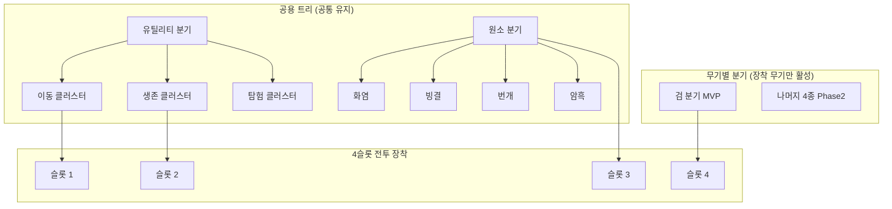
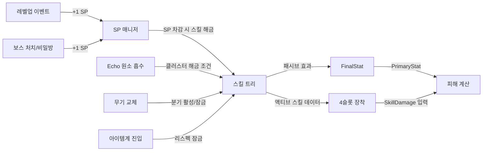

> **⚠️ DEPRECATED:** 이 시스템은 스코프 축소로 삭제되었습니다. 스킬은 무기 내장 스킬로 대체됩니다. 전투 스킬 슬롯은 System_Combat_Action.md에서 관리합니다.

# ~~스킬 트리 시스템 (Skill Tree System) — SYS-LVL-03~~

## 구현 현황 (Implementation Status)

> 최근 업데이트: 2026-04-01
> 문서 상태: `작성 중 (Draft)`
> 3-Space: World (주), Item World (제한), Hub (리스펙 전용)
> 기둥: 야리코미 (주), 메트로베니아 탐험 (부), 온라인 멀티플레이 (부)

| 기능 ID    | 분류           | 기능명 (Feature Name)                            | 우선순위 | 구현 상태 | 비고 (Notes)                                      |
| :--------- | :------------- | :----------------------------------------------- | :------: | :-------- | :------------------------------------------------ |
| SKL-01-A   | 트리 구조      | 공용 트리 — 유틸리티 분기 (이동/생존/탐험)       |    P1    | 📅 대기   | 무기 교체 후에도 유지되는 캐릭터 아이덴티티       |
| SKL-01-B   | 트리 구조      | 공용 트리 — 원소 분기 (화/빙/뇌/암)              |    P1    | 📅 대기   | Echo 원소 해금 순서와 연동 (Section 2.3)          |
| SKL-01-C   | 트리 구조      | 무기별 분기 — 검 전용 스킬 트리                  |    P0    | 📅 대기   | MVP Phase 검 우선 구현                            |
| SKL-01-D   | 트리 구조      | 무기별 분기 — 나머지 4종 스킬 트리               |    P2    | 📅 대기   | Phase 2에서 대검/단검/활/지팡이                    |
| SKL-02-A   | SP 시스템      | 레벨업 SP 획득 (1SP/레벨)                        |    P1    | 📅 대기   | System_Growth_LevelExp.md 연동                    |
| SKL-02-B   | SP 시스템      | 탐험 보너스 SP 획득 경로 3종                     |    P2    | 📅 대기   | 보스 처치 / 비밀방 / NPC 교환                     |
| SKL-02-C   | SP 시스템      | SP 총량 희소성 — 전체 스킬 최대 불가 설계        |    P1    | 📅 대기   | DFO SP 부족 패턴 차용                             |
| SKL-03-A   | 스킬 스케일링  | SkillDamage 공식 구현                            |    P1    | 📅 대기   | Section 4.1 공식. FinalStat 연동                  |
| SKL-03-B   | 스킬 스케일링  | SkillLevel 1-5 효과 상승 테이블                  |    P1    | 📅 대기   | Sheets/Content_System_SkillTree.csv SSoT          |
| SKL-04-A   | 4슬롯 깊이     | 스킬 레벨 시스템 (SP 투자로 Lv1-5 MVP)           |    P1    | 📅 대기   | Phase 2에서 Lv 10까지 확장                        |
| SKL-04-B   | 4슬롯 깊이     | 공중/지상 스킬 차별화 효과                       |    P2    | 📅 대기   | 스킬 발동 공중 상태 감지                          |
| SKL-04-C   | 4슬롯 깊이     | 2-스킬 시너지 콤보 시스템                        |    P2    | 📅 대기   | 슬롯 A+B 동시 장착 조건부 보너스                  |
| SKL-05-A   | 획득 경로      | 레벨업 SP로 스킬 해금                            |    P1    | 📅 대기   | 기본 경로                                         |
| SKL-05-B   | 획득 경로      | 월드 탐험 — 희귀 스킬 스크롤 드랍                |    P2    | 📅 대기   | 보스 처치/비밀방 보상                             |
| SKL-05-C   | 획득 경로      | 아이템계 보상 — 스킬 변이 스톤                   |    P2    | 📅 대기   | 이노센트 스킬 수정자 연동                         |
| SKL-05-D   | 획득 경로      | 허브 NPC 교환 — 스킬 서적                        |    P2    | 📅 대기   | 허브 경제 참여 유인                               |
| SKL-06-A   | 리스펙         | 허브 NPC 리스펙 — 점진적 비용 증가               |    P1    | 📅 대기   | Dead Cells식 증가 상한 방식                       |
| SKL-06-B   | 리스펙         | 아이템계 내 리스펙 불가 규칙                     |    P1    | 📅 대기   | 진입 전 빌드 확정 = 준비의 중요성                 |

---

## 0. 필수 참고 자료 (Mandatory References)

- Writing Standards: `Documents/Terms/GDD_Writing_Rules.md`
- Project Vision: `Documents/Terms/Project_Vision_Abyss.md`
- Glossary: `Documents/Terms/Glossary.md`
- 전투 액션 시스템: `Documents/System/System_Combat_Action.md` — 4슬롯, 5카테고리, 원소 시너지
- 무기 시스템: `Documents/System/System_Combat_Weapons.md` — 5종 무기, 시그니처 메커닉
- 성장 스탯 시스템: `Documents/System/System_Growth_Stats.md` — 6대 스탯, FinalStat 공식
- 레벨/경험치 시스템: `Documents/System/System_Growth_LevelExp.md` — SP 획득 기반, 레벨 커브
- 성장과 보상 철학: `Documents/Design/Design_Progression_Reward.md` — 성장 곡선, 야리코미 철학
- 스킬 시스템 리서치: `Documents/Research/SkillSystem_ActionRPG_Research.md` — 7개 게임 분석
- 스킬 트리 수치 데이터: `Sheets/Content_System_SkillTree.csv` (스킬 ID, SP 비용, 효과 수치 SSoT)

---

## 1. 개요 (Concept)

### 1.1. 설계 의도 (Intent)

Project Abyss의 스킬 트리 시스템은 다음 한 문장으로 정의한다:

> "무기 하나를 고른 순간 전투 언어가 결정되고, SP 총량의 희소성이 빌드를 결정하며, 이노센트가 그 빌드를 세상에 하나뿐인 것으로 만든다."

4개의 스킬 슬롯은 단순한 버튼 4개가 아니다. 스킬 레벨, 이노센트 수정, 공중/지상 차별화, 시너지 콤보라는 4개의 깊이 레이어가 쌓여 동일한 슬롯 구성이라도 플레이어마다 전혀 다른 전투 경험을 만든다. SP는 절대로 모든 스킬을 최대화할 수 없는 총량으로 설계된다 — 이 희소성이 모든 빌드 선택에 무게를 부여한다.

### 1.2. 분해 - 분석 - 재구축 (Deconstruct-Analyze-Rebuild)

#### 분해 (Deconstruct)

| 참고 게임 | 차용 요소 | 차용 이유 |
| :--- | :--- | :--- |
| DFO | SP 부족 설계 — 모든 스킬을 최대화 불가 | 선택의 무게를 강제하는 가장 검증된 방법 |
| Dead Cells | 리스펙 점진적 비용 증가 (상한 고정) | 실험 허용, 남용 억제 균형 |
| Hollow Knight | 노치 예산 시스템 — 강력할수록 비용이 높아 나머지 빌드를 압박 | 상호배타적 선택의 긴장감 |
| Hades | 2-부운 시너지 — 특정 조합이 합보다 큰 결과 | 탐험의 이유를 만드는 숨겨진 보상 |
| 메이플스토리 | 무기 = 사실상 전직 역할 | 무기 교체가 성장 체감을 만드는 구조 |

#### 분석 (Analyze)

SP 희소성의 본질은 "나는 이것을 포기해서 저것을 얻는다"는 선택에서 발생하는 자기 표현이다. 선택이 없으면 빌드가 없고, 빌드가 없으면 야리코미의 "내 장비"에 해당하는 "내 빌드" 판타지가 붕괴한다. 리서치 문서의 SDT 역량(Competence) 원칙과 정렬된다 — 플레이어가 빌드 선택의 결과를 직접 전투에서 읽어낼 때 성장 체감이 완성된다.

#### 재구축 (Rebuild)

| 원형 | Project Abyss의 독창적 변형 |
| :--- | :--- |
| DFO의 SP 부족 | 무기별 트리(5종) + 공용 트리(2분기)로 분리. 무기 교체 시 무기별 SP는 잠금, 공용 SP는 유지 |
| Dead Cells 리스펙 | 허브 NPC 전용. 아이템계 내 리스펙 불가로 진입 전 준비의 중요성 강조 |
| Hades 듀오 부운 | 4슬롯 중 특정 2스킬 동시 장착 시 시너지 효과 발동 — 슬롯 조합이 숨겨진 빌드를 만든다 |
| PoE 서포트 젬 | 이노센트가 스킬 슬롯에 부착되어 원소/효과를 부여 — 복잡도 없이 커스터마이즈 깊이 확보 |

### 1.3. 3대 기둥 정렬 (Pillar Alignment)

| 기둥 | 스킬 트리에서의 구현 |
| :--- | :--- |
| 메트로베니아 탐험 | 유틸리티 분기의 이동/탐험 스킬이 월드 탐험 범위를 확장. Air Dash, Wall Grip이 능력 게이트와 연동 |
| 아이템계 야리코미 | 아이템계 보상(스킬 변이 스톤)으로 스킬 효과 변형 가능. 이노센트가 스킬 수정자 역할 수행 |
| 온라인 멀티플레이 | 무기별 분기가 파티 역할 자연 분화를 유도. 공용 원소 분기로 파티 원소 시너지 체인 설계 가능 |

### 1.4. 저주받은 문제 검증 (Cursed Problem Check)

| 문제 | 위험 | 해결 방향 |
| :--- | :--- | :--- |
| SP 희소성 vs 빌드 실험 자유 | 너무 희소하면 리스펙 없이 게임이 망가진다 | 허브 NPC 리스펙 제공 (비용 상한 존재). 실험은 허용, 무한 교체는 억제 |
| 5종 무기별 트리 vs 무기 교체 자유 | 무기를 자주 교체하면 무기별 스킬이 무의미해진다 | 무기 교체 시 해당 무기 SP는 잠금 상태로 보존. 재장착 시 즉시 복원 |
| 4슬롯 제한 vs 빌드 다양성 | 슬롯 4개로는 깊이가 부족하다 | 슬롯 외 패시브 노드 + 스킬 레벨 + 이노센트 수정 3중 레이어로 보완 |
| 아이템계 리스펙 불가 vs 진입 부담 | 잘못된 빌드로 진입 시 전멸 위험 | 진입 전 스킬 미리보기 UI 필수. 아이템계 내 스킬 슬롯 재배치(위치 변경)는 허용 |
| 스킬 트리 UI 복잡도 | 트리 탐색이 복잡할 수 있음 | 허브 접속 시 전용 스킬 트리 화면. 스크롤/탭 기반 UI. 전투 중 트리 UI 접근 불가 |

### 1.5. 위험과 보상 (Risk & Reward)

| 선택 | 위험 (Risk) | 보상 (Reward) |
| :--- | :--- | :--- |
| 무기별 트리에 SP 집중 | 공용 트리 부족으로 이동/생존 스킬 약화 | 해당 무기 전용 고위력 스킬 최대화 |
| 공용 원소 분기 집중 | 무기 고유 스킬 빈약으로 기본 공격 의존 | 원소 시너지 극대화, 파티 시너지 시동 역할 |
| SP를 패시브 노드에 분산 | 액티브 스킬 위력이 평범 | 상시 적용 스탯 보너스, 스킬 비용 감소 |
| 리스펙 반복 (허브) | 비용 누적 증가 | 최적 빌드 탐색, 보스 특성에 맞는 빌드 전환 |
| 아이템계 진입 시 빌드 확정 | 잘못된 빌드로 지층 전체 어려움 | 준비된 플레이어에게 전략적 우위 |

---

## 2. 메커닉 (Mechanics)

### 2.1. 스킬 트리 구조도 (Skill Tree Architecture)

스킬 트리는 "무기별 분기 + 공용 트리" 하이브리드 구조이다.

```
전체 스킬 트리
├── [공용 트리] — 무기 교체와 무관하게 유지
│   ├── 유틸리티 분기 (Utility Branch)
│   │   ├── 이동 클러스터 (Movement Cluster)
│   │   ├── 생존 클러스터 (Survival Cluster)
│   │   └── 탐험 클러스터 (Exploration Cluster)
│   └── 원소 분기 (Element Branch)
│       ├── 화염 클러스터 (Fire Cluster)
│       ├── 빙결 클러스터 (Ice Cluster)
│       ├── 번개 클러스터 (Lightning Cluster)
│       └── 암흑 클러스터 (Dark Cluster)
│
└── [무기별 분기] — 장착 무기에 따라 활성화 (5종)
    ├── 검 분기 (Sword Branch) — MVP P0
    ├── 대검 분기 (Greatsword Branch) — Phase 2
    ├── 단검 분기 (Dagger Branch) — Phase 2
    ├── 활 분기 (Bow Branch) — Phase 2
    └── 지팡이 분기 (Staff Branch) — Phase 2
```



### 2.2. 공용 트리 — 유틸리티 분기 (Utility Branch)

유틸리티 분기는 무기와 무관하게 모든 상황에 적용되는 스킬을 제공한다. 메트로베니아 탐험 기둥과 직결된다.

#### 이동 클러스터 (Movement Cluster)

| 스킬 ID | 스킬명 (영문) | 효과 | SP 비용 | 선행 조건 |
| :--- | :--- | :--- | :---: | :--- |
| UTL-MV-01 | Dash Extend | 대시 거리 `mv_dash_ext`% 증가, 대시 쿨다운 50ms 감소 | 2 | 없음 |
| UTL-MV-02 | Air Dash | 공중 대시 1회 추가 (총 2회) | 3 | UTL-MV-01 |
| UTL-MV-03 | Wall Grip | 벽에 `mv_wall_hold_s`초 매달리기 가능 | 3 | UTL-MV-01 |
| UTL-MV-04 | Phantom Step | 대시 직후 `mv_phantom_dur`초 동안 이동속도 `mv_phantom_spd`% 유지 | 2 | UTL-MV-01 |

> **설계 원칙:** 이동 클러스터는 탐험 능력 게이트와 연동된다. UTL-MV-02 Air Dash와 UTL-MV-03 Wall Grip은 특정 월드 지형을 통과하기 위한 조건이 된다(Phase 2). 스킬 트리 투자가 탐험 범위를 직접 확장하는 유일한 분기이다.

#### 생존 클러스터 (Survival Cluster)

| 스킬 ID | 스킬명 (영문) | 효과 | SP 비용 | 선행 조건 |
| :--- | :--- | :--- | :---: | :--- |
| UTL-SV-01 | Iron Will | MaxHP `sv_hp_bonus`% 증가 (패시브) | 2 | 없음 |
| UTL-SV-02 | Second Wind | 사망 직전 HP 1로 생존. 쿨다운 `sv_revival_cd`초 | 4 | UTL-SV-01 |
| UTL-SV-03 | Lifesteal Aura | 기본 공격 적중 시 피해량의 `sv_lifesteal_rate`% HP 회복 | 3 | UTL-SV-01 |
| UTL-SV-04 | Barrier Shell | `sv_barrier_cd`초마다 피해 `sv_barrier_hp` 흡수 보호막 자동 생성 | 3 | UTL-SV-02 또는 UTL-SV-03 |

#### 탐험 클러스터 (Exploration Cluster)

| 스킬 ID | 스킬명 (영문) | 효과 | SP 비용 | 선행 조건 |
| :--- | :--- | :--- | :---: | :--- |
| UTL-EX-01 | Keen Eye | 미니맵에 숨겨진 방 위치 희미하게 표시 | 2 | 없음 |
| UTL-EX-02 | Treasure Sense | 아이템 드랍 반경 `ex_sense_r`px 내 탐지 표시 (아이템계 적용) | 2 | 없음 |
| UTL-EX-03 | Ancient Reading | 룬 퍼즐/고대 비문 해독 속도 50% 증가 | 2 | UTL-EX-01 |
| UTL-EX-04 | Lucky Find | LCK 스탯 `ex_lck_bonus` 영구 증가 (패시브) | 3 | UTL-EX-02 |

> **설계 원칙:** 탐험 클러스터는 전투 직접 기여가 없다. 이것을 선택한 플레이어는 전투 스킬을 포기하고 탐험/파밍 효율을 택한 것이다. 바틀의 탐험가(Explorer) 플레이어 유형을 위한 전용 분기.

### 2.3. 공용 트리 — 원소 분기 (Element Branch)

원소 분기는 Echo의 원소 인챈트 시스템(`System_Combat_Action.md`)과 직접 연동된다. 원소를 Echo가 흡수한 경우에만 해당 클러스터에 SP 투자가 가능하다.

| 클러스터 | 해금 조건 | 원소 시너지 대상 |
| :--- | :--- | :--- |
| 화염 클러스터 | 기본 해금 (Echo 초기 원소) | 빙결 적을 녹여 수분 지형 생성 |
| 빙결 클러스터 | 빙결 속성 보스 처치 + Echo 원소 흡수 | 번개 + 수분 감전 범위 확대 |
| 번개 클러스터 | 번개 속성 보스 처치 + Echo 원소 흡수 | 수분/빙결 상태 적에게 연쇄 피해 |
| 암흑 클러스터 | 암흑 속성 보스 처치 + Echo 원소 흡수 | 광역 디버프, 생명력 흡수 |

각 클러스터는 4개 노드로 구성된다(Mastery 패시브 포함). 상세 스킬 목록은 `Sheets/Content_System_SkillTree.csv` 참조.

#### 화염 클러스터 (Fire Cluster) — 예시

| 스킬 ID | 스킬명 (영문) | 효과 | SP 비용 | 선행 조건 |
| :--- | :--- | :--- | :---: | :--- |
| EL-FR-01 | Flame Coat | 화염 인챈트 시 공격에 `el_burn_tick`회 화상 도트 추가 | 2 | 없음 |
| EL-FR-02 | Ignition Burst | 화상 상태 적 공격 시 폭발 (범위 `el_burst_r`px, 피해 `el_burst_dmg`) | 3 | EL-FR-01 |
| EL-FR-03 | Molten Edge | 화염 인챈트 지속 시간 `el_fire_ext`% 연장 | 2 | EL-FR-01 |
| EL-FR-04 | Inferno Mastery | 화염 원소 피해 `el_fire_mastery`% 증가 (패시브) | 3 | EL-FR-02, EL-FR-03 |

### 2.4. 무기별 분기 — 검 분기 (Sword Branch, MVP)

무기별 분기는 해당 무기 장착 시에만 활성화된다. 각 분기는 액티브 스킬 4개와 패시브 노드 4개로 구성된다.

#### 검 분기 구조

```
검 분기 (Sword Branch)
├── 액티브 스킬 노드 (3개 — 4슬롯 장착 가능)
│   ├── Blade Rush        (근접 돌진기)
│   ├── Cleave Arc        (전방 부채꼴 범위기)
│   └── Rising Slash      (띄우기 + 에어 콤보 시동기)
└── 패시브 노드 (3개 — 상시 적용)
    ├── Combo Mastery     (3타 피니셔 피해 강화)
    ├── Sword Reach       (검 공격 히트박스 확장)
    └── Finisher Crit     (3타 피니셔 크리티컬 확률 증가)
```

#### 검 분기 스킬 상세

| 스킬 ID | 스킬명 (영문) | 유형 | 시전 이동 | 쿨다운 | MP 비용 | 주력 스탯 | 선행 조건 |
| :--- | :--- | :--- | :--- | :--- | :--- | :--- | :--- |
| SW-ACT-01 | Blade Rush | 근접 액티브 | free | `sw_rush_cd`초 | `sw_rush_mp` | STR | 없음 |
| SW-ACT-02 | Cleave Arc | 범위 액티브 | slow | `sw_cleave_cd`초 | `sw_cleave_mp` | STR | SW-ACT-01 |
| SW-ACT-03 | Rising Slash | 근접 액티브 | free | `sw_rise_cd`초 | `sw_rise_mp` | STR, DEX | SW-ACT-02 |
| SW-PAS-01 | Combo Mastery | 패시브 | — | — | — | STR | SW-ACT-01 |
| SW-PAS-03 | Sword Reach | 패시브 | — | — | — | — | 없음 |
| SW-PAS-04 | Finisher Crit | 패시브 | — | — | — | LCK | SW-PAS-01 |

#### 무기별 분기 스킬 설계 원칙 (5종)

| 무기 | 액티브 스킬 테마 | 파티 역할 경향 | 주력 스탯 |
| :--- | :--- | :--- | :--- |
| 검 (Sword) | 돌진, 범위기, 버프, 에어 콤보 시동 | 밸런스 딜러 | ATK |
| 대검 (Greatsword) | 충격파, 회전 광역, 대기 충전기 | AoE 딜러 | ATK |
| 단검 (Dagger) | 배후 강타, 연속 찌르기, 회피 강화 | 암살 딜러 | ATK |
| 활 (Bow) | 다중 화살, 트랩 설치, 카이팅 강화 | 원거리 물리 딜러 | ATK |
| 지팡이 (Staff) | 원소 투사체, 원소 장 설치, 보호막 | 마법 딜러/서포터 | INT |

### 2.5. SP 시스템 (Skill Point System)

#### SP 획득 경로

| 획득 경로 | SP 획득량 | 3-Space | 빈도 | 설계 의도 |
| :--- | :---: | :--- | :--- | :--- |
| 레벨업 | 1 SP / 레벨 | World | 매 레벨 | 기본 성장 경로. MVP Lv1-10 기준 9 SP |
| 월드 보스 처치 (최초 1회) | 1 SP | World | 보스당 1회 | 탐험 동기 강화 |
| 비밀방 발견 (최초 1회) | 1 SP | World | 방당 1회 | 탐험 범위 확장 보상 |
| 아이템계 전 지층 최초 클리어 | 1 SP | Item World | 아이템당 1회 | 야리코미 동기 |
| 허브 NPC 스킬 서적 교환 | 1 SP / 서적 | Hub | 소모성 | 허브 경제 참여 유인 |

#### SP 총량 희소성 (Phase 1 MVP 기준 분석)

| 획득 경로 | 예상 획득량 |
| :--- | :---: |
| 레벨업 SP (Lv1-10) | 9 SP |
| 월드 보스 처치 | 3-5 SP |
| 비밀방 발견 | 2-4 SP |
| Phase 1 합계 | 14-18 SP |

전체 스킬 트리 최대 투자 요구량은 약 40 SP로 설계한다. 플레이어는 총량의 35-45%만 투자할 수 있으며, 이 희소성이 모든 빌드 선택에 의미를 부여한다.

#### SP 분배 규칙

1. SP는 공용 트리와 현재 장착 중인 무기 분기에만 투자 가능하다.
2. 무기를 교체하면 이전 무기 분기에 투자한 SP는 "잠금" 상태로 보존된다. 해당 무기를 재장착하면 즉시 복원된다.
3. 공용 트리 SP는 무기 교체와 무관하게 항상 유지된다.
4. SP는 환급되지 않는다. 리스펙은 허브 NPC를 통해서만 가능하다.

### 2.6. 4슬롯 깊이 레이어 (4-Slot Depth Layers)

4개의 스킬 슬롯은 다음 4개 레이어를 통해 깊이를 확보한다.

| 레이어 | 구현 방법 | Phase | 설명 |
| :--- | :--- | :--- | :--- |
| 스킬 레벨 | SP 추가 투자 (Lv1-5) | Phase 1 | 같은 스킬이 투자량에 따라 피해/효과 상승 |
| 이노센트 수정 | 이노센트 스킬 슬롯 부착 | Phase 2 | 이노센트가 스킬에 원소/추가 효과 부여 |
| 공중/지상 차별화 | 발동 상태 감지 | Phase 2 | 같은 스킬이 공중 발동 시 다른 효과 |
| 시너지 콤보 | 2스킬 동시 장착 조건 | Phase 2 | 특정 2스킬 조합 시 숨겨진 보너스 활성 |

---

## 3. 규칙 (Rules)

### 3.1. 스킬 해금 규칙

#### 기본 해금 조건

플레이어는 스킬 트리 UI에서 다음 조건을 모두 충족한 스킬을 해금할 수 있다:

1. 해당 스킬의 선행 조건 스킬이 이미 해금되어 있다.
2. 충분한 SP를 보유하고 있다 (기본 해금 비용: 1 SP).
3. 해당 무기 분기 스킬인 경우, 그 무기가 현재 장착되어 있거나 이미 해당 무기 분기에 SP를 투자한 이력이 있다.
4. 원소 클러스터 스킬인 경우, Echo가 해당 원소를 이미 흡수하였다.

#### 스킬 레벨업

해금된 액티브 스킬은 추가 SP를 투자하여 레벨을 올릴 수 있다. MVP Phase에서 최대 레벨은 5이다.

| 스킬 레벨 | 누적 SP 투자 | 추가 SP | 효과 |
| :---: | :---: | :---: | :--- |
| 1 | 1 SP | — | 해금. 기본 효과 적용 |
| 2 | 2 SP | +1 | 피해량 또는 효과 수치 증가 |
| 3 | 3 SP | +1 | 쿨다운 5% 감소 또는 범위 증가 |
| 4 | 5 SP | +2 | 추가 효과 부여 (스킬별 상이) |
| 5 | 7 SP | +2 | 최대 효과. 비주얼 강화 연출 추가 |

> **설계 원칙:** Lv4-5의 추가 SP 비용(+2)이 다른 스킬 해금 비용(1 SP)과 경쟁한다. "깊이 (한 스킬 Lv5) vs 넓이 (두 스킬 Lv3)" 트레이드오프가 이 설계의 핵심이다.

#### 원소 클러스터 해금 조건

원소 클러스터는 SP 보유만으로는 해금할 수 없다. Echo가 해당 원소를 흡수한 이후에만 SP 투자가 가능하다.

| 클러스터 | 해금 조건 | 해금 불가 시 UI 표시 |
| :--- | :--- | :--- |
| 화염 클러스터 | 기본 해금 (Echo 초기 상태) | — |
| 빙결 클러스터 | 빙결 보스 처치 후 Echo 흡수 | "Echo가 빙결 원소를 흡수하지 않았습니다" |
| 번개 클러스터 | 번개 보스 처치 후 Echo 흡수 | "Echo가 번개 원소를 흡수하지 않았습니다" |
| 암흑 클러스터 | 암흑 보스 처치 후 Echo 흡수 | "Echo가 암흑 원소를 흡수하지 않았습니다" |

### 3.2. 4슬롯 장착 규칙

1. 해금된 액티브 스킬은 슬롯 1-4 중 어느 위치에나 자유롭게 장착한다.
2. 패시브 스킬은 슬롯에 장착하지 않으며 해금 즉시 상시 적용된다.
3. 동일 스킬을 복수 슬롯에 중복 장착할 수 없다.
4. 공용 트리 스킬과 무기별 스킬을 자유롭게 혼합하여 장착할 수 있다.
5. 슬롯 장착 순서는 전투 발동 순서에 영향을 주지 않는다 (쿨다운/MP 상태만이 발동을 결정).

#### 공중/지상 차별화 (Phase 2)

일부 스킬은 공중 상태에서 발동 시 효과가 달라진다. 차별화 여부는 스킬 설명 UI에 명시된다.

| 발동 상태 | 판정 조건 | 효과 변화 예시 |
| :--- | :--- | :--- |
| 지상 발동 | 캐릭터가 지면 콜리더에 접촉 중 | 기본 효과 |
| 공중 발동 | 점프/낙하 상태 (지면 비접촉) | 범위 축소 + 피해 증가, 또는 하방 공격으로 전환 |

#### 2-스킬 시너지 콤보 (Phase 2)

특정 2개 스킬을 동시에 슬롯에 장착하면 숨겨진 시너지 효과가 자동 활성화된다.

| 스킬 A | 스킬 B | 시너지 효과 |
| :--- | :--- | :--- |
| SW-ACT-01 Blade Rush | EL-FR-01 Flame Coat | 돌진 시 화염 궤적 생성. 궤적 통과 적에게 `syn_trail_burn_tick`회 화상 |
| SW-ACT-04 Rising Slash | UTL-MV-02 Air Dash | 공중으로 띄운 직후 Air Dash 발동 시 추격 타격 발생 (피해 `syn_chase_dmg`) |

전체 시너지 콤보 목록은 `Sheets/Content_System_SkillTree.csv`의 SynergyCombo 시트 참조.

### 3.3. 리스펙 규칙

#### 허브 NPC 리스펙

- 허브 특정 NPC("Skill Purifier Oren")를 통해 스킬 트리 전체를 초기화할 수 있다.
- 리스펙 시 공용 트리와 모든 무기 분기의 SP가 전부 환급된다.
- 리스펙 비용은 Gold로 지불하며, 누적 사용 횟수에 따라 점진적으로 증가한다.

| 리스펙 횟수 | 비용 (Gold) |
| :---: | :---: |
| 1회 | `respec_cost_1` |
| 2회 | `respec_cost_2` |
| 3회 | `respec_cost_3` |
| 4회 이상 | `respec_cost_cap` (상한 고정) |

구체적 수치는 `Sheets/Content_System_SkillTree.csv`의 RespecCost 시트 참조. Dead Cells의 1000→2000→4000→8000(상한) 패턴을 Project Abyss 경제 규모에 맞게 조정한다.

#### 아이템계 리스펙 불가

아이템계 진입 후에는 스킬 트리 변경이 완전히 불가하다.

| 상황 | 스킬 트리 변경 | 스킬 슬롯 재배치 (위치 변경) |
| :--- | :--- | :--- |
| 허브 | 가능 (Gold 비용) | 자유 |
| 월드 | 불가 | 가능 |
| 아이템계 진입 후 | 불가 | 불가 |

> **설계 원칙:** 아이템계 진입 전 빌드 확정이 준비 단계의 전략적 의미를 부여한다. 리스크와 리턴 원칙 — 준비한 플레이어에게 더 높은 생존율을 제공하는 비대칭 보상.

---

## 4. 공식 (Formulas)

### 4.1. 스킬 피해 공식 (Skill Damage Formula)

```
SkillDamage = SkillBase × (1 + PrimaryStat × ScalingCoeff) × SkillLevelMult × ElementBonus
```

| 변수 | 정의 | 범위 | 출처 |
| :--- | :--- | :--- | :--- |
| SkillBase | 스킬 고유 기본 피해량 | 스킬별 상이 | `Sheets/Content_System_SkillTree.csv` |
| PrimaryStat | 스킬의 주력 스탯 최종값 (FinalStat 기준) | 6대 스탯 중 1개 | `System_Growth_Stats.md` §2.2 |
| ScalingCoeff | 스킬별 스탯 반영 계수 | 0.01-0.05 | `Sheets/Content_System_SkillTree.csv` |
| SkillLevelMult | 스킬 레벨에 따른 피해 배율 | 1.0(Lv1) - 1.8(Lv5) | Section 4.2 테이블 |
| ElementBonus | 원소 시너지 배율 | 1.0(기본) - 1.5(강 시너지) | Section 4.3 테이블 |

#### 예시 계산

전제: Lv5 에르다, Normal 검 장착, Blade Rush (Lv3) 사용, 원소 시너지 없음

```
PrimaryStat(STR):
  BaseStat = 18 (Lv5 테이블, System_Growth_LevelExp.md §2.1)
  EquipStat = 18 × 1.0 = 18 (Normal 배율)
  InnocentBonus = 0
  FinalSTR = 36

SkillDamage = 25 × (1 + 36 × 0.03) × 1.30 × 1.0
            = 25 × 2.08 × 1.30
            = 67.6 ≈ 68
```

### 4.2. 스킬 레벨 배율 테이블 (SkillLevelMult)

| 스킬 레벨 | SkillLevelMult | 피해 증가율 | 누적 SP | 부가 효과 |
| :---: | :---: | :---: | :---: | :--- |
| 1 | 1.00 | 기준 | 1 | 해금. 기본 효과 |
| 2 | 1.15 | +15% | 2 | 쿨다운 5% 감소 |
| 3 | 1.30 | +30% | 3 | 범위 또는 효과 시간 증가 |
| 4 | 1.50 | +50% | 5 | 추가 효과 부여 (스킬별 상이) |
| 5 | 1.80 | +80% | 7 | 최대 효과 + 비주얼 강화 |

> **설계 원칙:** Lv1에서 Lv5까지 피해가 80% 증가한다. 스킬 Lv5 하나(7 SP 총투자)는 Lv1 스킬 7개를 해금하는 것과 SP 비용이 같다. 이 등가 관계가 "깊이 vs 넓이" 선택을 경제적으로 의미있게 만든다.

### 4.3. 원소 보너스 배율 테이블 (ElementBonus)

| 시너지 조건 | ElementBonus | 조건 예시 |
| :--- | :---: | :--- |
| 시너지 없음 | 1.0 | 원소 불일치 또는 중성 상태 적 |
| 약 원소 시너지 | 1.2 | 화염 인챈트로 화염 약점 적 타격 |
| 중 원소 시너지 | 1.35 | 빙결 상태 적에게 화염 스킬 사용 |
| 강 원소 시너지 | 1.5 | 수분 상태 적에게 번개 스킬 사용 |

원소 시너지 상세 조합 매트릭스는 `Documents/System/System_Combat_Action.md` 원소 시너지 섹션 참조.

### 4.4. 패시브 스킬 효과 적용 방식

| 효과 유형 | 적용 방식 | 예시 |
| :--- | :--- | :--- |
| 피해 보너스 (%) | SkillDamage 최종 결과에 덧셈 | Combo Mastery: 3타 피니셔 피해 +`sw_combo_bonus`% |
| 크리티컬 확률 | FinalStat 파생 Crit_Chance에 덧셈 | Finisher Crit: 3타 피니셔 Crit_Chance +15% |
| 히트박스 확장 | 무기 히트박스 수치에 곱셈 | Sword Reach: 히트박스 범위 ×1.1 |
| 스탯 보너스 | FinalStat에 덧셈 | Lucky Find: LCK +`ex_lck_bonus` |

패시브 효과가 복수인 경우, 동일 효과 유형의 패시브는 덧셈 합산 후 최종 1회 적용한다. 중첩 곱셈 방식은 사용하지 않는다.

---

## 5. 데이터 & 파라미터 (Parameters)

모든 수치 파라미터는 `Sheets/Content_System_SkillTree.csv`에서 관리한다. GDD 본문에는 파라미터명만 기재하며, 구체적 수치는 CSV가 SSoT이다.

### 5.1. 스킬별 기본 파라미터 (YAML 예시)

```yaml
# 검 분기 — Blade Rush (SW-ACT-01)
id: SW-ACT-01
name: Blade Rush
type: Active
category: Melee
move_type: free
base_sp_cost: 1
skill_base_damage: sw_rush_base      # 범위: 20-35
primary_stat: STR
scaling_coeff: sw_rush_coeff         # 범위: 0.02-0.04
cooldown_s: sw_rush_cd               # 범위: 3-5초
mp_cost: sw_rush_mp                  # 범위: 10-15
hitbox_w_px: sw_rush_hitbox_w
hitbox_h_px: sw_rush_hitbox_h
dash_distance_px: sw_rush_dist       # 범위: 120-180px
```

```yaml
# 유틸리티 분기 — Second Wind (UTL-SV-02)
id: UTL-SV-02
name: Second Wind
type: Passive (조건부 발동)
base_sp_cost: 4
prerequisite: UTL-SV-01
revival_hp: 1                        # 고정값
cooldown_s: sv_revival_cd            # 범위: 120-180초
```

```yaml
# 리스펙 비용 파라미터
respec_cost_1: 500
respec_cost_2: 1000
respec_cost_3: 2000
respec_cost_cap: 4000
```

### 5.2. 조정 범위 가이드

| 파라미터 유형 | 범위 | 조정 방법 | 목적 |
| :--- | :--- | :--- | :--- |
| ScalingCoeff | 0.01-0.05 | 플레이테스트로 조정 | 스탯 투자 대비 스킬 위력 체감 |
| 쿨다운 | 3-15초 | 스킬 카테고리별 하한 준수 | 전투 리듬 |
| MP 비용 | 5-40 | MaxMP 대비 비율로 검증 | 연속 스킬 사용 가능 횟수 |
| SkillLevelMult 간격 | 고정 테이블 | 플레이테스트 후 개별 조정 | 레벨업 체감 |
| 리스펙 비용 | 500-4000 Gold | 경제 시스템 균형과 연동 | 실험 허용 vs 남용 억제 |

### 5.3. SP 밸런스 튜닝 노브

| 파라미터 | 기본값 | 범위 | 효과 |
| :--- | :---: | :--- | :--- |
| 레벨당 SP 획득 | 1 | 1-2 | 높이면 다양성 증가, 낮추면 선택 압박 강화 |
| 전체 스킬 노드 수 (Phase 1) | 40 | 35-50 | 희소성 조절 핵심 변수 |
| 패시브 노드 비율 | 40% | 30-50% | 전투 직접 기여 vs 간접 강화 균형 |
| 스킬 최대 레벨 (MVP) | 5 | 3-7 | 투자 깊이 vs 다양성 트레이드오프 |

---

## 6. 예외 처리 (Edge Cases)

### 6.1. SP 관련 예외

| 예외 상황 | 처리 방침 |
| :--- | :--- |
| SP 0인 상태에서 스킬 해금 시도 | 해금 버튼 비활성화. 조건 미달 상태 시각 표시 |
| 무기 소실 후 해당 무기 분기 스킬 슬롯 장착 상태 | 해당 슬롯 강제 해제. SP는 잠금 보존. UI 알림 |
| 동일 효과 패시브 복수 장착 | 동일 효과 유형은 덧셈 합산. 중복 곱셈 금지 |

### 6.2. 리스펙 관련 예외

| 예외 상황 | 처리 방침 |
| :--- | :--- |
| 리스펙 후 SP 재분배 시 선행 조건 불충족 스킬이 슬롯 장착 중 | 해당 스킬 슬롯 자동 해제. SP 환급. 해제된 스킬 목록 UI 고지 |
| 아이템계 진입 중 연결 끊김 후 재접속 | 진입 직전 스킬 구성 복원. 아이템계 내 변경 없음 |
| 리스펙 비용 Gold 부족 | 리스펙 불가. 부족한 Gold량 UI 표시 |

### 6.3. 원소 클러스터 예외

| 예외 상황 | 처리 방침 |
| :--- | :--- |
| 원소 미해금 클러스터 SP 투자 시도 | 투자 불가. 해금 조건 메시지 표시 |
| Echo 원소는 보스 처치로 영구 해금 | 제거 불가. 해금 취소 케이스 발생하지 않음 |

### 6.4. 시너지 콤보 예외

| 예외 상황 | 처리 방침 |
| :--- | :--- |
| 시너지 조건 스킬 중 하나가 슬롯에서 제거됨 | 시너지 효과 즉시 비활성화. 재장착 시 즉시 복원 |
| 이노센트 수정이 시너지와 충돌 | 시너지 효과 우선 적용. 이노센트 수정은 시너지 결과에 추가 |

### 6.5. 스케일링 극값 처리

| 상황 | 처리 |
| :--- | :--- |
| PrimaryStat = 0 | SkillDamage = SkillBase × SkillLevelMult × ElementBonus. 최소값 1 보장 |
| 복수 원소 시너지 조건 동시 충족 | 가장 높은 ElementBonus 하나만 적용 (중복 곱셈 금지) |
| ScalingCoeff가 CSV 상한 초과 | CSV 정의 상한값으로 클리핑 |

### 6.6. 멀티플레이 환경 예외

| 예외 상황 | 처리 방침 |
| :--- | :--- |
| 파티원 동일 스킬 시너지 조건 | 시너지는 개인 슬롯 기준. 파티원 스킬은 자신의 시너지 조건에 영향 없음 |
| 파티원 이탈 후 해당 파티원 버프 스킬 효과 | 지속 시간 종료까지 유지 후 소멸 |
| 서버 동기화 지연 중 스킬 발동 | 클라이언트 낙관적 처리 후 서버 검증. 불일치 시 서버 값 우선 |

---

## 7. 의존성 (Dependencies)

### 7.1. 이 시스템이 의존하는 시스템

| 시스템 | 의존 내용 | 연동 방향 |
| :--- | :--- | :--- |
| `System_Combat_Action.md` | 4슬롯 구조, 스킬 5카테고리, MP/쿨다운 프레임워크, 원소 인챈트 | 스킬 트리가 전투 액션 슬롯에 스킬 데이터를 공급 |
| `System_Combat_Weapons.md` | 5종 무기 정의, 시그니처 메커닉 | 무기 장착/교체 이벤트가 무기별 분기 활성화/잠금을 결정 |
| `System_Growth_Stats.md` | FinalStat 공식, 6대 스탯 | 스킬 트리가 FinalStat 값을 PrimaryStat으로 수신 |
| `System_Growth_LevelExp.md` | 레벨업 이벤트 | 레벨 시스템이 SP 지급 이벤트를 스킬 트리에 전달 |
| `System_Innocent_Core.md` | 이노센트 스킬 수정자 (Phase 2) | 이노센트가 스킬 슬롯에 부착되어 효과 변경 |
| `System_ItemWorld_Core.md` | 아이템계 진입/퇴장 이벤트 | 아이템계가 진입 시 스킬 트리 변경 잠금 신호 전달 |
| `System_Combat_Damage.md` | 최종 피해 계산 | 스킬 트리가 SkillDamage를 피해 계산 시스템에 입력 |

### 7.2. 이 시스템에 의존하는 시스템

| 시스템 | 의존 내용 |
| :--- | :--- |
| `System_World_MapStructure.md` | 유틸리티 분기 이동 스킬(UTL-MV-02, UTL-MV-03)이 특정 지형 통과 조건으로 참조됨 |
| `UI_SkillTree.md` (미작성) | 스킬 트리 시각화, 슬롯 장착 인터페이스, 리스펙 UI |
| `Design_Progression_Reward.md` | SP 획득 속도가 성장 곡선 3단계(급성장/안정/야리코미)와 정렬되어야 함 |

### 7.3. 데이터 흐름 다이어그램



---

## 8. 검증 기준 (Acceptance Criteria)

### 8.1. 기능 검증 (Functional Criteria)

| 검증 항목 | 검증 방법 | 합격 기준 |
| :--- | :--- | :--- |
| SP 획득 및 차감 | 레벨업 후 SP 카운터 확인 | 레벨업 시 정확히 +1 SP 반영 |
| 스킬 해금 선행 조건 | 선행 조건 없이 상위 노드 해금 시도 | 해금 불가하며 UI에 조건 명시 |
| 무기 교체 시 SP 보존 | 검 → 활 교체 후 검 재장착 | 검 분기 SP 100% 복원 확인 |
| 원소 클러스터 해금 조건 | 빙결 보스 처치 전 빙결 클러스터 투자 시도 | 투자 불가, 조건 메시지 표시 |
| 리스펙 비용 증가 | 4회차 리스펙 비용 확인 | `respec_cost_cap` 값과 일치 |
| 아이템계 내 리스펙 불가 | 아이템계 진입 후 스킬 트리 변경 시도 | 변경 UI 비활성화 확인 |
| SkillDamage 공식 계산 | Lv5 캐릭터, Normal 검, Blade Rush Lv3, 원소 없음 | 계산값이 Section 4.1 예시와 ±5% 이내 |
| 2-스킬 시너지 발동 | 시너지 조합 2스킬 슬롯 장착 후 전투 | 시너지 효과 UI 표시 및 실제 전투 적용 확인 |
| 패시브 상시 적용 | 패시브 해금 후 전투 스탯 확인 | 패시브 효과가 스탯 패널 및 전투 수치에 반영 |

### 8.2. 경험 검증 (Experiential Criteria)

| 검증 항목 | 플레이테스트 방법 | 합격 기준 |
| :--- | :--- | :--- |
| SP 희소성 체감 | Lv10 도달 후 트리 UI 탐색 5분 | "원하는 스킬을 모두 올릴 수 없다"는 선택 압박 체감 보고 |
| 빌드 다양성 | 5명 플레이어가 독립적으로 Lv10 빌드 구성 | 5개 빌드가 서로 다른 스킬 구성 보유 |
| 무기 교체 체감 | 검 Lv10 빌드 → 활로 교체 후 전투 | "전혀 다른 전투 스타일"로 느껴진다는 인터뷰 응답 |
| 리스펙 활용률 | 플레이어 리스펙 사용 횟수 추적 | 전체 플레이어의 20-40%가 최소 1회 리스펙 사용 |
| 시너지 발견 쾌감 | 숨겨진 시너지 처음 발동 시 반응 관찰 | 긍정적 반응(탄성, 재시도) 확인 |
| 아이템계 진입 전 준비 행동 | 아이템계 진입 직전 5분간 행동 추적 | 50% 이상 플레이어가 스킬 확인 후 진입 |
| 탐험 연동 체감 | UTL-MV-02 Air Dash 해금 후 탐험 반응 | "이제 저기 올라갈 수 있다" 발견 반응 언급 |

### 8.3. 밸런스 검증 (Balance Criteria)

| 지표 | 목표값 | 측정 방법 |
| :--- | :--- | :--- |
| 지배적 스킬 집중 비율 | 단일 스킬 슬롯 장착률 60% 미만 | 슬롯 장착 통계 |
| 스킬 Lv5 보유 수 | 플레이어당 평균 1-2개 (Lv10 도달 시) | 레벨 분포 히스토그램 |
| 무기별 분기 사용 분산 | 단일 무기 집중 플레이어 50% 미만 | 무기 장착 통계 |
| 공용 트리 참여율 | 플레이어 80% 이상 공용 트리에 최소 3 SP 투자 | SP 분배 통계 |

---

## 검증 체크리스트 (Final Checklist)

- [ ] 3대 기둥(탐험/야리코미/멀티플레이) 모두에 정렬되어 있는가?
- [ ] SP 총량 설계가 전체 스킬 최대화를 방지하는가?
- [ ] 무기 교체 시 SP 보존 규칙이 명확히 정의되어 있는가?
- [ ] 원소 분기가 Echo 원소 흡수 순서와 정렬되어 있는가?
- [ ] 리스펙 비용 상한이 Dead Cells 패턴 기반으로 정의되어 있는가?
- [ ] 아이템계 내 리스펙 불가 규칙이 아이템계 코어 시스템과 충돌하지 않는가?
- [ ] SkillDamage 공식이 FinalStat 공식과 정확히 연동되는가?
- [ ] 모든 수치 파라미터가 `Sheets/Content_System_SkillTree.csv`를 참조하는가?
- [ ] 게임 내 스킬명/UI 레이블이 모두 영문으로 작성되어 있는가?
- [ ] 스킬 트리 UI가 허브에서만 접근 가능하도록 설계되어 있는가?
