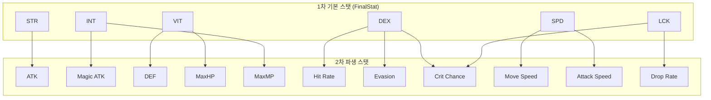

# 성장 스탯 시스템 (Growth Stats System)

## 구현 현황 (Implementation Status)

> **최근 업데이트:** 2026-03-23
> **문서 상태:** `작성 중 (Draft)`
> **3-Space:** 전체 (World + Item World + Hub)
> **기둥:** 전체

| 기능 ID    | 분류       | 기능명 (Feature Name)                   | 우선순위 | 구현 상태 | 비고 (Notes)                       |
| :--------- | :--------- | :-------------------------------------- | :------: | :-------- | :--------------------------------- |
| STAT-01-A  | 스탯 정의  | 6대 기본 스탯 시스템                    |    P1    | 📅 대기   | STR/INT/DEX/VIT/SPD/LCK            |
| STAT-01-B  | 스탯 정의  | 2차 파생 스탯 (ATK/DEF/RES 등)          |    P1    | 📅 대기   | 1차 스탯에서 산출                  |
| STAT-02-A  | 공식       | FinalStat 합산 공식                     |    P1    | 📅 대기   | Base + Equip + Innocent            |
| STAT-02-B  | 공식       | MaxHP 산출 공식                         |    P1    | 📅 대기   | VIT 기반                           |
| STAT-02-C  | 공식       | MaxMP 산출 공식                         |    P1    | 📅 대기   | INT + 레벨 기반                    |
| STAT-03-A  | 성장 테이블| Lv 1-10 기본 스탯 성장 곡선             |    P1    | 📅 대기   | MVP 레벨 캡 = 10                   |
| STAT-03-B  | 성장 테이블| 레벨업 경험치 요구량 테이블             |    P1    | 📅 대기   | Sheets/Content_System_LevelExp.csv |
| STAT-04-A  | 전투 연동  | STR → ATK 변환                          |    P1    | 📅 대기   | System_Combat_Damage.md 연동       |
| STAT-04-B  | 전투 연동  | INT → 마법 ATK 및 MaxMP 연동            |    P1    | 📅 대기   | System_Combat_Damage.md 연동       |
| STAT-04-C  | 전투 연동  | DEX → 명중/회피/크리티컬 연동           |    P1    | 📅 대기   | System_Combat_Damage.md 연동       |
| STAT-04-D  | 전투 연동  | VIT → MaxHP 및 DEF 연동                 |    P1    | 📅 대기   | System_Combat_Damage.md 연동       |
| STAT-04-E  | 전투 연동  | SPD → 이동/공격 속도 연동               |    P1    | 📅 대기   | System_3C_Character.md 연동        |
| STAT-04-F  | 전투 연동  | LCK → 드랍률/크리티컬 보조 연동         |    P1    | 📅 대기   | System_Combat_Damage.md 연동       |
| STAT-05-A  | 이노센트   | 이노센트 보너스 합산 처리               |    P1    | 📅 대기   | System_Innocent_Core.md 연동       |
| STAT-06-A  | UI         | 스탯 패널 표시                          |    P1    | 📅 대기   | Documents/UI/ 연동                 |

---

## 0. 필수 참고 자료 (Mandatory References)

- Writing Standards: `Documents/Terms/GDD_Writing_Rules.md`
- Project Definition: `Documents/Terms/Project_Vision_Abyss.md`
- 데미지 시스템: `Documents/System/System_Combat_Damage.md`
- 전투 액션: `Documents/System/System_Combat_Action.md`
- 캐릭터 3C: `Documents/System/System_3C_Character.md`
- 장비 슬롯: `Documents/System/System_Equipment_Slots.md`
- 이노센트 시스템: `Documents/System/System_Innocent_Core.md`
- 스탯 기본값 데이터: `Sheets/Content_Stats_Character_Base.csv`
- 레벨 경험치 곡선 데이터: `Sheets/Content_System_LevelExp_Curve.csv`
- Game Overview: `Reference/게임 기획 개요.md`

---

## 1. 개요 (Concept)

### 1.1. 설계 의도 (Intent)

Project Abyss의 성장 스탯 시스템은 다음 한 문장으로 정의한다:

> "수치 하나 오를 때마다 전투에서 체감되고, 아이템계를 클리어하는 이유가 스탯에 있다"

스탯 시스템은 캐릭터 레벨, 장비, 이노센트라는 세 성장 축을 하나의 공식으로 통합한다. 플레이어가 아이템계 한 지층을 돌파했을 때 STR이 올라 데미지 숫자가 커지는 것을 즉시 체감하는 것이 핵심 설계 목표이다.

### 1.2. 설계 근거 (Reasoning)

| 결정                          | 근거                                                                                       |
| :---------------------------- | :----------------------------------------------------------------------------------------- |
| 6대 스탯 구조                 | 각 스탯이 전투와 탐험에 명확히 기여. 스탯 게이트에 의미를 부여. 빌드 다양성 확보           |
| FinalStat = Base + Equip + Innocent | 세 성장 축의 기여가 눈에 보인다. 어느 축을 올려야 효율적인지 플레이어가 판단 가능  |
| MVP 레벨 캡 = 10              | 프로토타입에서 레벨 설계를 10단계로 압축해 검증. Lv 11-100은 Phase 2에서 확장            |
| 선형 성장 곡선 (MVP)          | 프로토타입 검증 목적. 체감이 단순명확해야 루프가 재미있는지 판별 가능. 곡선은 Phase 2에서 조정 |
| HP/MP를 별도 파생 공식으로    | VIT/INT의 전투 기여를 직접 공식에 반영. 방어적 스탯의 가치를 명시화                        |
| LCK을 독립 스탯으로           | 탐험(비밀방 발견), 파밍(드랍률), 전투(크리티컬) 세 분야에 모두 영향. 야리코미 특화 스탯    |

### 1.3. 3대 기둥 정렬 (Pillar Alignment)

| 기둥                  | 성장 스탯 시스템에서의 구현                                                           |
| :-------------------- | :------------------------------------------------------------------------------------ |
| Metroidvania 탐험     | 스탯 게이트 연동. STR/VIT 등이 특정 수치 이상일 때 새 구역 개방 (Phase 2 확장 설계)   |
| Item World 야리코미   | 아이템계 클리어 → 장비 강화 → EquipStat 상승 → FinalStat 상승 → 더 깊은 지층 진입     |
| Online 멀티플레이     | 파티원 스탯 역할 분담. STR 딜러 / VIT 탱커 / INT 마법사 / SPD 버퍼 등 빌드 다양성     |

### 1.4. 저주받은 문제 검증 (Cursed Problem Check)

| 문제                                                          | 해결 방향                                                                        |
| :------------------------------------------------------------ | :------------------------------------------------------------------------------- |
| 이노센트 스태킹으로 특정 스탯이 폭주하지 않는가              | 이노센트 레벨 상한 + 슬롯 수 상한으로 이노센트 보너스 총량 제어 (System_Innocent_Core.md) |
| 레벨 캡 이후 성장 동기가 사라지지 않는가                     | MVP에서 캡(Lv 10) 도달 후 장비/이노센트 성장으로 계속 진행. 레벨 캡은 Phase 2에서 확장   |
| STR 극대화로 다른 5개 스탯이 무의미해지지 않는가             | 각 스탯이 전투 외 탐험/파밍에도 기여. 스탯 게이트로 복수 스탯 성장을 강제          |
| SPD 극대화로 게임 조작이 불가능해지지 않는가                 | SPD 스탯 상한(Phase 2)과 이동/공격속도 변환 계수로 실질 속도에 상한을 설정         |
| 장비 교체 시 이노센트 보너스가 사라지는 것이 손실이 너무 크지 않은가 | 이노센트는 장비에 귀속. 교체 비용 설계로 의사결정 긴장감 부여 (System_Innocent_Core.md) |

### 1.5. 위험과 보상 (Risk & Reward)

| 성장 선택            | 위험 (Risk)                                   | 보상 (Reward)                                         |
| :------------------- | :-------------------------------------------- | :---------------------------------------------------- |
| STR 집중 투자        | VIT 부족으로 피격 시 빠른 사망                | 최고 물리 ATK, 빠른 파밍 속도                         |
| VIT 집중 투자        | 낮은 딜로 긴 전투 시간, 파밍 효율 저하        | 높은 MaxHP, 보스전 생존성                             |
| INT 집중 투자        | 물리 공격력 부재, 근접 적에게 취약            | 마법 ATK 극대화, 높은 MaxMP로 스킬 연속 사용          |
| LCK 집중 투자        | 기본 전투 스탯 부족, 평균 딜 낮음             | 크리티컬 폭발 딜, 높은 드랍률, 비밀방 발견 확률 증가  |
| 균형 분배            | 어느 분야에서도 극한 성능에 도달하지 못함     | 모든 상황 대응, 스탯 게이트 통과 용이                 |

---

## 2. 메커닉 (Mechanics)

### 2.1. 6대 기본 스탯 정의

Project Abyss의 모든 전투, 탐험, 성장 계산은 다음 6대 기본 스탯을 기반으로 한다.

| 스탯 ID | 스탯명        | 영문       | 주요 역할                                             | 2차 파생 스탯                  |
| :------ | :------------ | :--------- | :---------------------------------------------------- | :----------------------------- |
| STR     | 힘            | Strength   | 물리 공격력 (ATK) 결정                                | ATK                            |
| INT     | 지력          | Intellect  | 마법 공격력, MaxMP 결정                               | Magic ATK, MaxMP               |
| DEX     | 민첩          | Dexterity  | 명중률, 회피율, 크리티컬 확률 결정                    | Hit Rate, Evasion, Crit Chance |
| VIT     | 체력          | Vitality   | MaxHP, 물리 방어력 (DEF) 결정                         | MaxHP, DEF                     |
| SPD     | 속도          | Speed      | 이동 속도, 공격 속도 결정                             | Move Speed, Attack Speed       |
| LCK     | 행운          | Luck       | 드랍률, 크리티컬 배율 보조, 비밀방 발견 확률 결정     | Drop Rate, Crit Bonus          |

#### STR (힘)

- 근접 무기 및 물리 스킬의 기반 공격력(ATK)에 직접 기여한다.
- `ATK = STR * str_to_atk_ratio`
- 물리 데미지 공식: `Physical_Damage = max(1, (ATK * SkillMult) - DEF)`
- STR은 3대 기둥 중 메트로베니아 탐험 스탯 게이트(Phase 2)의 핵심 변수이다.

#### INT (지력)

- 마법 스킬의 기반 공격력(Magic ATK)과 MaxMP를 동시에 결정한다.
- `Magic_ATK = INT * int_to_matk_ratio`
- `MaxMP = mp_base + (Level * mp_growth_per_level) + (INT * mp_int_scaling)`
- INT가 높을수록 MP가 많아 스킬을 더 자주 사용할 수 있다.

#### DEX (민첩)

- 공격이 빗나가지 않을 확률(명중률)과 적 공격을 회피할 확률(회피율)을 결정한다.
- 크리티컬 확률의 기본값(Base_Crit_Rate)에 추가 보너스를 제공한다.
- `Hit_Rate = hit_base + (DEX * dex_to_hit)`
- `Evasion_Rate = (DEX * dex_to_evasion)`
- `Crit_Chance_Bonus = DEX * dex_to_crit`

#### VIT (체력)

- MaxHP와 물리 방어력(DEF)의 핵심 스탯이다.
- `MaxHP = base_hp + (VIT * hp_vit_scaling)`
- `DEF = VIT * vit_to_def`
- VIT가 낮으면 환경 지형 대미지(독 지대, 용암 등)로 인한 스탯 게이트에서 막힌다(Phase 2).

#### SPD (속도)

- 캐릭터의 이동 속도와 공격 모션의 속도(공격 속도)를 결정한다.
- `Move_Speed = base_move_speed + (SPD * spd_to_move)`
- `Attack_Speed = base_attack_speed + (SPD * spd_to_attack)`
- SPD는 System_3C_Character.md에서 정의된 이동 시스템과 직접 연동된다.

#### LCK (행운)

- 아이템 드랍률, 크리티컬 배율 보조, 비밀방 발견 확률을 보조한다.
- 야리코미 특화 스탯으로, 파밍 효율과 전투 잠재력을 동시에 높인다.
- `Drop_Rate = base_drop_rate * (1 + LCK * lck_to_drop)`
- 크리티컬 확률 및 배율 상세는 System_Combat_Damage.md의 섹션 2.4를 따른다.

### 2.2. FinalStat 합산 구조

캐릭터의 최종 스탯은 세 성장 축의 합산으로 결정된다.

```
FinalStat = BaseStat + EquipStat + InnocentBonus
```

| 구성 요소     | 정의                                              | 데이터 출처                          |
| :------------ | :------------------------------------------------ | :----------------------------------- |
| BaseStat      | 레벨에 따라 증가하는 캐릭터 고유 기본값           | Sheets/Content_Stats_Character_Base.csv |
| EquipStat     | 장착한 장비의 스탯 합산 (레어리티 배율 포함)       | Sheets/Content_Stats_Weapon_List.csv |
| InnocentBonus | 복종 상태의 이노센트가 부여하는 스탯 보너스 합산  | Sheets/Content_System_Innocent_Pool.csv |

#### 장비 스탯 산출 (EquipStat)

장비 스탯은 레어리티 배율을 적용한 후 합산한다.

```
EquipStat = sum(Equipment_Base_Stat * Rarity_Multiplier)  for all equipped items
```

| 레어리티   | 스탯 배율 |
| :--------- | :-------- |
| Normal     | 1.0       |
| Magic      | 1.3       |
| Rare       | 1.7       |
| Legendary  | 2.2       |
| Ancient    | 3.0       |

### 2.3. HP / MP 파생 공식

#### MaxHP

```
MaxHP = base_hp + (VIT * hp_vit_scaling)
```

- `base_hp`: Lv 1 기본값 100
- `hp_vit_scaling`: VIT 1당 MaxHP 증가량 (파라미터 섹션에서 정의)
- Lv 1에서 VIT = 10이고 base_hp = 100이면, MaxHP = 100 + (10 * hp_vit_scaling)

#### MaxMP

```
MaxMP = mp_base + (Level * mp_growth_per_level) + (INT * mp_int_scaling)
```

- `mp_base` = 100
- `mp_growth_per_level` = 5
- `mp_int_scaling` = 0.3
- Lv 1에서 INT = 8이면, MaxMP = 100 + (1 * 5) + (8 * 0.3) = 107.4 → 107 (floor 처리)

### 2.4. 2차 파생 스탯 산출 흐름



---

## 3. 규칙 (Rules)

### 3.1. 스탯 합산 순서

1. BaseStat를 레벨 테이블에서 조회한다.
2. 장착된 모든 장비의 스탯을 레어리티 배율 적용 후 합산하여 EquipStat을 구한다.
3. 복종 상태인 이노센트의 보너스를 모두 합산하여 InnocentBonus를 구한다.
4. `FinalStat = BaseStat + EquipStat + InnocentBonus`
5. FinalStat을 기반으로 2차 파생 스탯 (ATK, DEF, MaxHP, MaxMP 등)을 계산한다.
6. 버프/디버프는 2차 파생 스탯 계산 이후에 별도 적용한다 (런타임).

### 3.2. 스탯 계산 시점

| 시점                    | 처리 내용                                             |
| :---------------------- | :---------------------------------------------------- |
| 레벨업 시               | BaseStat 테이블에서 신규 값으로 재계산                |
| 장비 장착/해제 시       | EquipStat 재합산 후 FinalStat 갱신                    |
| 이노센트 상태 변경 시   | InnocentBonus 재합산 후 FinalStat 갱신                |
| 전투 중 버프/디버프 발생 | FinalStat 기반 2차 파생 스탯에 배율 적용 (런타임)     |

### 3.3. 스탯 표시 규칙

- 스탯 패널에는 FinalStat을 표시한다.
- 항목별로 BaseStat / EquipStat / InnocentBonus 분해 값을 툴팁으로 제공한다.
- 소수점 이하 값은 표시하지 않는다 (floor 처리). 단, MaxHP/MaxMP는 소수 없이 정수로 표시한다.

### 3.4. 스탯 값 범위

- 모든 FinalStat은 0 미만이 될 수 없다 (하한 = 0).
- MVP(Lv 1-10) 범위에서 스탯 상한(Cap)은 별도 설정하지 않는다. Phase 2에서 레벨 확장 시 정의한다.

### 3.5. 장비 미착용 상태

- EquipStat = 0으로 처리한다.
- FinalStat = BaseStat + InnocentBonus로 계산된다.

---

## 4. 데이터 & 파라미터 (Parameters)

### 4.1. 전역 스탯 파라미터

```yaml
# System_Growth_Stats: 전역 파라미터
# MVP (Phase 1) 기준값. Phase 2 확장 시 이 파일에서 수정한다.

stat_formula:
  # FinalStat 합산
  final_stat: "BaseStat + EquipStat + InnocentBonus"

hp_formula:
  base_hp: 100                # Lv 1 기본 MaxHP
  hp_vit_scaling: 10          # VIT 1당 MaxHP 증가량
  # MaxHP = 100 + (VIT * 10)
  # Lv 1: VIT=10 → MaxHP = 100 + 100 = 200

mp_formula:
  mp_base: 100                # 기본 MaxMP (레벨/스탯 독립 고정값)
  mp_growth_per_level: 5      # 레벨 1당 MaxMP 증가량
  mp_int_scaling: 0.3         # INT 1당 MaxMP 증가량
  # MaxMP = 100 + (Level * 5) + (INT * 0.3)
  # Lv 1: INT=8 → MaxMP = 100 + 5 + 2.4 = 107 (floor)

stat_to_secondary:
  str_to_atk: 1.0             # STR 1당 ATK 증가량
  int_to_matk: 1.0            # INT 1당 Magic ATK 증가량
  vit_to_def: 0.5             # VIT 1당 DEF 증가량
  dex_to_hit: 1.0             # DEX 1당 명중률 증가 (%)
  dex_to_evasion: 0.5         # DEX 1당 회피율 증가 (%)
  dex_to_crit: 0.1            # DEX 1당 크리티컬 확률 증가 (%)
  spd_to_move: 0.2            # SPD 1당 이동속도 배율 증가
  spd_to_attack: 0.1          # SPD 1당 공격속도 배율 증가
  lck_to_drop: 0.002          # LCK 1당 드랍률 배율 증가
  # Drop_Rate = base_drop_rate * (1 + LCK * 0.002)

critical_system:
  base_crit_rate: 5.0         # 기본 크리티컬 확률 (%)
  crit_per_lck: 0.1           # LCK 1당 크리티컬 확률 증가 (%)
  crit_chance_cap: 50.0       # 크리티컬 확률 상한 (%)
  base_crit_multiplier: 1.5   # 기본 크리티컬 배율
  multi_per_lck: 0.001        # LCK 1당 크리티컬 배율 증가
  crit_multiplier_cap: 3.0    # 크리티컬 배율 상한

rarity_multiplier:
  Normal: 1.0
  Magic: 1.3
  Rare: 1.7
  Legendary: 2.2
  Ancient: 3.0

damage_variance:
  min: 0.9
  max: 1.1

damage_floor: 1               # 최소 데미지 보장값

level_cap_mvp: 10             # MVP 레벨 상한
```

### 4.2. Lv 1-10 기본 스탯 성장 테이블

Lv 1 기준값: HP 100, MP 107, STR 10, INT 8, DEX 9, VIT 10, SPD 8, LCK 5

레벨당 증가량은 스탯 ID별 `growth_per_level`에 따라 선형으로 누적된다.

```yaml
# 레벨당 BaseStat 증가량 (growth_per_level)
base_stat_growth:
  STR: 2    # 레벨당 +2
  INT: 2    # 레벨당 +2
  DEX: 2    # 레벨당 +2
  VIT: 2    # 레벨당 +2
  SPD: 1    # 레벨당 +1
  LCK: 1    # 레벨당 +1
```

| Level | STR | INT | DEX | VIT | SPD | LCK | MaxHP (Base) | MaxMP        |
| :---- | :-- | :-- | :-- | :-- | :-- | :-- | :----------- | :----------- |
| 1     | 10  | 8   | 9   | 10  | 8   | 5   | 200          | 107          |
| 2     | 12  | 10  | 11  | 12  | 9   | 6   | 220          | 115          |
| 3     | 14  | 12  | 13  | 14  | 10  | 7   | 240          | 124          |
| 4     | 16  | 14  | 15  | 16  | 11  | 8   | 260          | 132          |
| 5     | 18  | 16  | 17  | 18  | 12  | 9   | 280          | 140          |
| 6     | 20  | 18  | 19  | 20  | 13  | 10  | 300          | 148          |
| 7     | 22  | 20  | 21  | 22  | 14  | 11  | 320          | 157          |
| 8     | 24  | 22  | 23  | 24  | 15  | 12  | 340          | 165          |
| 9     | 26  | 24  | 25  | 26  | 16  | 13  | 360          | 173          |
| 10    | 28  | 26  | 27  | 28  | 17  | 14  | 380          | 182          |

> MaxHP = 100 + (VIT * 10)
> MaxMP = 100 + (Level * 5) + (INT * 0.3), floor 처리

```yaml
# 레벨별 BaseStat 전체 테이블
level_base_stats:
  1:  { STR: 10, INT: 8,  DEX: 9,  VIT: 10, SPD: 8,  LCK: 5  }
  2:  { STR: 12, INT: 10, DEX: 11, VIT: 12, SPD: 9,  LCK: 6  }
  3:  { STR: 14, INT: 12, DEX: 13, VIT: 14, SPD: 10, LCK: 7  }
  4:  { STR: 16, INT: 14, DEX: 15, VIT: 16, SPD: 11, LCK: 8  }
  5:  { STR: 18, INT: 16, DEX: 17, VIT: 18, SPD: 12, LCK: 9  }
  6:  { STR: 20, INT: 18, DEX: 19, VIT: 20, SPD: 13, LCK: 10 }
  7:  { STR: 22, INT: 20, DEX: 21, VIT: 22, SPD: 14, LCK: 11 }
  8:  { STR: 24, INT: 22, DEX: 23, VIT: 24, SPD: 15, LCK: 12 }
  9:  { STR: 26, INT: 24, DEX: 25, VIT: 26, SPD: 16, LCK: 13 }
  10: { STR: 28, INT: 26, DEX: 27, VIT: 28, SPD: 17, LCK: 14 }
```

### 4.3. Lv 1 예시 캐릭터 스탯 계산

```yaml
# Lv 1, 장비 미착용, 이노센트 없음 기준
example_lv1_no_equip:
  level: 1
  BaseStat:
    STR: 10
    INT: 8
    DEX: 9
    VIT: 10
    SPD: 8
    LCK: 5
  EquipStat: 0
  InnocentBonus: 0
  FinalStat:
    STR: 10
    INT: 8
    DEX: 9
    VIT: 10
    SPD: 8
    LCK: 5
  derived:
    ATK: 10          # STR * 1.0
    Magic_ATK: 8     # INT * 1.0
    DEF: 5           # VIT * 0.5
    MaxHP: 200       # 100 + (10 * 10)
    MaxMP: 107       # floor(100 + (1 * 5) + (8 * 0.3))
    Hit_Rate: 9.0    # DEX * 1.0 (%)
    Evasion: 4.5     # DEX * 0.5 (%)
    Crit_Chance: 5.9 # 5 + (DEX * 0.1) = 5 + 0.9
    Drop_Rate: 1.01  # 1 + (LCK * 0.002)
```

```yaml
# Lv 5, Normal 검 (STR+10) 장착, 이노센트 없음 기준
example_lv5_normal_sword:
  level: 5
  BaseStat:
    STR: 18
    INT: 16
    DEX: 17
    VIT: 18
    SPD: 12
    LCK: 9
  EquipStat:
    STR: 10          # Normal 검 기본 STR+10 * 1.0
  InnocentBonus: 0
  FinalStat:
    STR: 28          # 18 + 10
    INT: 16
    DEX: 17
    VIT: 18
    SPD: 12
    LCK: 9
  derived:
    ATK: 28          # STR * 1.0
    Magic_ATK: 16    # INT * 1.0
    DEF: 9           # VIT * 0.5
    MaxHP: 280       # 100 + (18 * 10)
    MaxMP: 140       # floor(100 + (5 * 5) + (16 * 0.3))
    Crit_Chance: 6.7 # 5 + (DEX * 0.1) = 5 + 1.7
```

### 4.4. Phase 2 확장 예약 파라미터

```yaml
# Phase 2에서 추가 정의 예정 (MVP에서는 미사용)
phase2_reserved:
  level_cap_phase2: 100
  stat_gate_thresholds:
    STR_gate_example: 50      # STR >= 50 시 특정 물리 장벽 해제
    INT_gate_example: 40      # INT >= 40 시 마법 봉인 해제
    VIT_gate_example: 60      # VIT >= 60 시 독 지대 통과
    DEX_gate_example: 50      # DEX >= 50 시 기동성 관문 통과
    SPD_gate_example: 30      # SPD >= 30 시 시간제한 관문 통과
    LCK_gate_example: 20      # LCK >= 20 시 숨겨진 경로 발견 확률 해금
  reincarnation: false        # 전생 시스템 - Phase 2
  skill_tree_stat_bonus: false # 스킬 트리 스탯 연동 - Phase 2
  growth_curve: linear        # MVP는 선형. Phase 2에서 지수/계단형 검토
```

---

## 5. 예외 처리 (Edge Cases)

### 5.1. 스탯 하한 처리

| 상황                                    | 처리 방법                                                   |
| :-------------------------------------- | :---------------------------------------------------------- |
| 디버프로 FinalStat이 0 미만이 될 경우   | FinalStat = 0으로 클램핑. 공격력 0이면 고정 데미지 1 적용  |
| 장비 해제 후 EquipStat 제거 시 음수 방지 | EquipStat은 항상 0 이상. 음수 장비 스탯은 존재하지 않는다  |
| InnocentBonus가 음수인 경우             | 저주(Curse) 이노센트 구현 전까지 InnocentBonus는 0 이상만 허용 |

### 5.2. MaxHP / MaxMP 최솟값

| 상황                               | 처리 방법                                 |
| :--------------------------------- | :---------------------------------------- |
| VIT = 0으로 MaxHP가 base_hp 미만   | MaxHP = base_hp (100) 보장               |
| INT = 0이고 Lv 1에서 MaxMP 계산    | MaxMP = mp_base + mp_growth_per_level = 105 |
| MaxMP < mp_base인 경우             | MaxMP = mp_base (100) 보장               |

### 5.3. 장비 중복 스탯 처리

- 동일 스탯을 부여하는 장비를 복수 장착한 경우 각 EquipStat을 단순 합산한다.
- 스택 배율 우대 없음 (선형 합산). 이 규칙은 이노센트 보너스에도 동일 적용된다.

### 5.4. 레벨 테이블 범위 초과

| 상황                            | 처리 방법                                              |
| :------------------------------ | :----------------------------------------------------- |
| 레벨이 10 초과 (MVP 캡 초과)    | BaseStat을 Lv 10 값으로 고정. 경험치 획득 중단         |
| 레벨이 0 이하인 경우            | 발생 불가. 최소 레벨 = 1로 강제 설정                   |
| 테이블 조회 실패 (데이터 누락)  | Lv 1 BaseStat으로 폴백(fallback). 에러 로그 기록        |

### 5.5. 소수점 처리

- 모든 파생 스탯 계산에서 최종 값에 `floor()` 를 적용한다.
- MaxHP, MaxMP, ATK, DEF는 정수로 저장하고 표시한다.
- Hit Rate, Evasion, Crit Chance는 소수점 1자리까지 표시한다 (내부 계산은 float 유지).

---

## 검증 기준 (Validation Criteria)

### 기능 검증

| 검증 항목                                            | 기대 결과                                                     |
| :--------------------------------------------------- | :------------------------------------------------------------ |
| Lv 1 캐릭터, 장비/이노센트 없음                      | FinalStat = BaseStat. MaxHP = 200, MaxMP = 107               |
| Lv 1에서 Normal 검 (STR+10) 장착                     | FinalStat STR = 20, ATK = 20, 장비 해제 시 STR = 10 복귀     |
| 레벨업 시 BaseStat 증가                               | Lv 1→2: STR 10→12, VIT 10→12, MaxHP 200→220                  |
| Lv 10 도달 후 추가 경험치 획득                        | BaseStat Lv 10 값 고정, 경험치 획득 없음                      |
| Lv 10에서 Ancient 검 (STR+50) 장착                    | FinalStat STR = 78, ATK = 78                                  |
| VIT = 0 상태에서 MaxHP 계산                           | MaxHP = 100 (base_hp 보장)                                    |
| 디버프로 STR -20 적용, FinalStat STR = 10             | FinalStat STR = 0 (하한 클램핑), ATK = 0, 실제 데미지 최소 1 |

### 체감 검증

| 검증 항목                                        | 기대 결과                                                  |
| :----------------------------------------------- | :--------------------------------------------------------- |
| 아이템계 1지층 클리어 후 장비 강화 체감           | EquipStat 증가 → 데미지 수치 가시적 상승                   |
| Lv 1 대비 Lv 10의 전투 체감 차이                 | STR 10→28, ATK 10→28, 데미지 약 2.8배 상승 체감            |
| LCK 5 대비 LCK 14의 드랍률 차이 체감             | Drop_Rate 1.01 → 1.028, 장기 파밍에서 드랍 빈도 차이 인식  |
| Normal → Ancient 레어리티 승급 시 스탯 차이       | 동일 기본 장비 STR+10 기준: Normal 10 → Ancient 30 (+200%)  |

### 연동 검증

| 검증 항목                              | 연동 문서                      |
| :------------------------------------- | :----------------------------- |
| ATK → 물리 데미지 공식 입력값 일치     | System_Combat_Damage.md        |
| Magic ATK → 마법 데미지 공식 입력값 일치 | System_Combat_Damage.md      |
| SPD → 이동/공격 속도 반영 여부         | System_3C_Character.md         |
| LCK → 크리티컬 확률/배율 반영 여부     | System_Combat_Damage.md        |
| EquipStat → 레어리티 배율 적용 여부    | System_Equipment_Slots.md      |
| InnocentBonus → 복종 상태 이노센트 합산 | System_Innocent_Core.md       |
