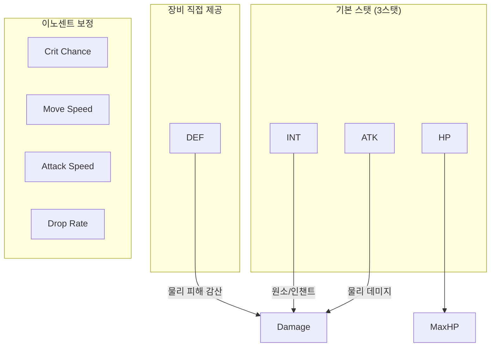

# 성장 스탯 시스템 (Growth Stats System)

## 구현 현황 (Implementation Status)

> **최근 업데이트:** 2026-03-23
> **문서 상태:** `작성 중 (Draft)`
> **2-Space:** 전체 (World + Item World + Hub)
> **기둥:** 전체

| 기능 ID    | 분류       | 기능명 (Feature Name)                   | 우선순위 | 구현 상태 | 비고 (Notes)                       |
| :--------- | :--------- | :-------------------------------------- | :------: | :-------- | :--------------------------------- |
| STAT-01-A  | 스탯 정의  | 3스탯 (ATK/INT/HP) 시스템              |    P1    | 📅 대기   | ATK/INT/HP (6스탯에서 단순화)       |
| STAT-01-B  | 스탯 정의  | 2차 파생 스탯 (ATK/DEF/RES 등)          |    P1    | 📅 대기   | 1차 스탯에서 산출                  |
| STAT-02-A  | 공식       | FinalStat 합산 공식                     |    P1    | 📅 대기   | Base + Equip + Innocent            |
| STAT-02-B  | 공식       | MaxHP 산출 공식                         |    P1    | 📅 대기   | 레벨 + 장비 HP 기반                |
| STAT-03-A  | 성장 테이블| Lv 1-10 기본 스탯 성장 곡선             |    P1    | 📅 대기   | MVP 레벨 캡 = 10                   |
| STAT-03-B  | 성장 테이블| 레벨업 경험치 요구량 테이블             |    P1    | 📅 대기   | Sheets/Content_System_LevelExp.csv |
| STAT-04-A  | 전투 연동  | ATK → 전투 데미지 연동                   |    P1    | 📅 대기   | System_Combat_Damage.md 연동       |
| STAT-04-B  | 전투 연동  | INT → 원소/인챈트 데미지 연동           |    P1    | 📅 대기   | System_Combat_Damage.md 연동       |
| STAT-04-C  | 전투 연동  | ~~DEX → 명중/회피/크리티컬~~ (삭제)     |    —     | ❌ 폐기   | 이노센트로 대체                    |
| STAT-04-D  | 전투 연동  | HP → MaxHP 연동                          |    P1    | 📅 대기   | 레벨 + 장비 HP 합산               |
| STAT-04-E  | 전투 연동  | ~~SPD → 이동/공격 속도~~ (삭제)          |    —     | ❌ 폐기   | 이노센트로 대체                    |
| STAT-04-F  | 전투 연동  | ~~LCK → 드랍률/크리티컬~~ (삭제)         |    —     | ❌ 폐기   | 이노센트로 대체                    |
| STAT-05-A  | 이노센트   | 이노센트 보너스 합산 처리               |    P1    | 📅 대기   | System_Innocent_Core.md 연동       |
| STAT-06-A  | UI         | 스탯 패널 표시                          |    P1    | 📅 대기   | Documents/UI/ 연동                 |

---

## 0. 필수 참고 자료 (Mandatory References)

- Writing Standards: `Documents/Terms/GDD_Writing_Rules.md`
- Project Definition: `Documents/Terms/Project_Vision_Abyss.md`
- 데미지 시스템: `Documents/System/System_Combat_Damage.md`
- 전투 액션: `Documents/System/System_Combat_Action.md`
- 캐릭터 3C: `Documents/System/System_3C_Character.md`
- 장비 슬롯: `Documents/System/System_Equipment_Slots.md`
- 이노센트 시스템: `Documents/System/System_Innocent_Core.md`
- 스탯 기본값 데이터: `Sheets/Content_Stats_Character_Base.csv`
- 레벨 경험치 곡선 데이터: `Sheets/Content_System_LevelExp_Curve.csv`
- Game Overview: `Reference/게임 기획 개요.md`

---

## 1. 개요 (Concept)

### 1.1. 설계 의도 (Intent)

Project Abyss의 성장 스탯 시스템은 다음 한 문장으로 정의한다:

> "수치 하나 오를 때마다 전투에서 체감되고, 아이템계를 클리어하는 이유가 스탯에 있다"

스탯 시스템은 캐릭터 레벨, 장비, 이노센트라는 세 성장 축을 하나의 공식으로 통합한다. 플레이어가 아이템계 한 지층을 돌파했을 때 ATK가 올라 데미지 숫자가 커지는 것을 즉시 체감하는 것이 핵심 설계 목표이다.

### 1.2. 설계 근거 (Reasoning)

| 결정                          | 근거                                                                                       |
| :---------------------------- | :----------------------------------------------------------------------------------------- |
| 3스탯 (ATK/INT/HP) 구조       | 각 스탯이 전투와 탐험에 명확히 기여. ATK 스탯 게이트에 의미를 부여                         |
| FinalStat = Base + Equip + Innocent | 세 성장 축의 기여가 눈에 보인다. 어느 축을 올려야 효율적인지 플레이어가 판단 가능  |
| MVP 레벨 캡 = 10              | 프로토타입에서 레벨 설계를 10단계로 압축해 검증. Lv 11-100은 Phase 2에서 확장            |
| 선형 성장 곡선 (MVP)          | 프로토타입 검증 목적. 체감이 단순명확해야 루프가 재미있는지 판별 가능. 곡선은 Phase 2에서 조정 |
| HP를 기본 스탯으로             | 레벨 + 장비에서 직접 제공. 생존력의 가치를 명시화                                          |
| 크리티컬/드랍률은 이노센트로   | 이노센트 파밍의 가치를 높이고 기본 스탯 구조를 단순화. 야리코미 특화                        |

### 1.3. 3대 기둥 정렬 (Pillar Alignment)

| 기둥                  | 성장 스탯 시스템에서의 구현                                                           |
| :-------------------- | :------------------------------------------------------------------------------------ |
| Metroidvania 탐험     | ATK 스탯 게이트 연동. ATK가 특정 수치 이상일 때 새 구역 개방 (Phase 2 확장 설계)      |
| Item World 야리코미   | 아이템계 클리어 → 장비 강화 → EquipStat 상승 → FinalStat 상승 → 더 깊은 지층 진입     |
| Online 멀티플레이     | 파티원 역할 분담. ATK 딜러 / HP 탱커 / INT 마법사 등 빌드 다양성 (이노센트로 세분화)  |

### 1.4. 저주받은 문제 검증 (Cursed Problem Check)

| 문제                                                          | 해결 방향                                                                        |
| :------------------------------------------------------------ | :------------------------------------------------------------------------------- |
| 이노센트 스태킹으로 특정 스탯이 폭주하지 않는가              | 이노센트 레벨 상한 + 슬롯 수 상한으로 이노센트 보너스 총량 제어 (System_Innocent_Core.md) |
| 레벨 캡 이후 성장 동기가 사라지지 않는가                     | MVP에서 캡(Lv 10) 도달 후 장비/이노센트 성장으로 계속 진행. 레벨 캡은 Phase 2에서 확장   |
| ATK 극대화로 다른 스탯이 무의미해지지 않는가                 | HP가 생존에 필수, INT가 원소 게이트 해금에 필수. 이노센트로 세부 빌드 분화          |
| ~~SPD 극대화~~ (삭제됨)                                      | 이동/공격속도는 이노센트로만 보정. 상한은 이노센트 레벨 캡으로 제어               |
| 장비 교체 시 이노센트 보너스가 사라지는 것이 손실이 너무 크지 않은가 | 이노센트는 장비에 귀속. 교체 비용 설계로 의사결정 긴장감 부여 (System_Innocent_Core.md) |

### 1.5. 위험과 보상 (Risk & Reward)

| 성장 선택            | 위험 (Risk)                                   | 보상 (Reward)                                         |
| :------------------- | :-------------------------------------------- | :---------------------------------------------------- |
| ATK 집중 투자        | HP 부족으로 피격 시 빠른 사망                 | 최고 물리 ATK, 빠른 파밍 속도                         |
| HP 집중 투자         | 낮은 딜로 긴 전투 시간, 파밍 효율 저하        | 높은 MaxHP, 보스전 생존성                             |
| INT 집중 투자        | 물리 공격력 부재, 근접 적에게 취약            | 원소/인챈트 극대화, 마법 봉인 게이트 통과              |
| 이노센트 특화        | 기본 전투 스탯 분산, 평균 딜 낮음             | 크리티컬/드랍률/이동속도 보정으로 파밍 효율 극대화     |
| 균형 분배            | 어느 분야에서도 극한 성능에 도달하지 못함     | 모든 상황 대응, 스탯 게이트 통과 용이                 |

---

## 2. 메커닉 (Mechanics)

### 2.1. 3대 기본 스탯 정의

Project Abyss의 모든 전투, 탐험, 성장 계산은 다음 3대 기본 스탯을 기반으로 한다.

| 스탯 ID | 스탯명        | 영문       | 주요 역할                                             | 비고                           |
| :------ | :------------ | :--------- | :---------------------------------------------------- | :----------------------------- |
| ATK     | 공격력        | Attack     | 물리 공격력 결정. 스탯 게이트 핵심 변수                | 장비 ATK + 캐릭터 기본 ATK     |
| INT     | 지력          | Intellect  | 원소/인챈트 데미지 결정                                | 장비 INT + 캐릭터 기본 INT     |
| HP      | 체력          | Hit Points | MaxHP 결정. 생존력                                     | 레벨 + 장비 HP 합산            |
| ~~DEX~~ | ~~민첩~~      | —          | ~~삭제: 이노센트로 대체~~                              | 크리티컬/명중/회피 → 이노센트  |
| ~~VIT~~ | ~~체력~~      | —          | ~~삭제: HP로 통합~~                                    | MaxHP, DEF → HP + 장비 DEF    |
| ~~SPD~~ | ~~속도~~      | —          | ~~삭제: 이노센트로 대체~~                              | 이동/공격속도 → 이노센트       |
| ~~LCK~~ | ~~행운~~      | —          | ~~삭제~~                                               | 드랍률/크리티컬 → 이노센트     |

#### ATK (공격력)

- 근접 무기 및 물리 스킬의 기반 공격력에 직접 기여한다.
- 물리 데미지 공식: `Physical_Damage = max(1, (ATK * SkillMult) - DEF)`
- ATK는 3대 기둥 중 메트로베니아 탐험 스탯 게이트의 핵심 변수이다.

#### INT (지력)

- 원소/인챈트 데미지의 기반이다.
- INT가 높을수록 마법 봉인 게이트를 통과할 수 있다.

#### HP (체력)

- MaxHP를 결정한다. 레벨 기반 HP + 장비 HP로 합산된다.
- `MaxHP = base_hp + (Level * hp_per_level) + equip_hp`
- DEF는 장비에서 직접 제공된다 (별도 스탯 아님).

#### ~~DEX (민첩)~~ — 삭제됨

- 크리티컬/명중/회피는 이노센트로만 보정된다.

#### ~~VIT (체력)~~ — HP로 통합

- MaxHP는 HP 스탯으로, DEF는 장비에서 직접 제공.

#### ~~SPD (속도)~~ — 삭제됨

- 이동/공격속도는 이노센트로만 보정된다.

#### ~~LCK (행운)~~ — 삭제됨

- 드랍률, 크리티컬은 이노센트로만 보정된다.

### 2.2. FinalStat 합산 구조

캐릭터의 최종 스탯은 세 성장 축의 합산으로 결정된다.

```
FinalStat = BaseStat + EquipStat + InnocentBonus
```

| 구성 요소     | 정의                                              | 데이터 출처                          |
| :------------ | :------------------------------------------------ | :----------------------------------- |
| BaseStat      | 레벨에 따라 증가하는 캐릭터 고유 기본값           | Sheets/Content_Stats_Character_Base.csv |
| EquipStat     | 장착한 장비의 스탯 합산 (레어리티 배율 포함)       | Sheets/Content_Stats_Weapon_List.csv |
| InnocentBonus | 복종 상태의 이노센트가 부여하는 스탯 보너스 합산  | Sheets/Content_System_Innocent_Pool.csv |

#### 장비 스탯 산출 (EquipStat)

장비 스탯은 레어리티 배율을 적용한 후 합산한다.

```
EquipStat = sum(Equipment_Base_Stat * Rarity_Multiplier)  for all equipped items
```

| 레어리티   | 스탯 배율 |
| :--------- | :-------- |
| Normal     | 1.0       |
| Magic      | 1.3       |
| Rare       | 1.7       |
| Legendary  | 2.2       |
| Ancient    | 3.0       |

### 2.3. HP 파생 공식

#### MaxHP

```
MaxHP = base_hp + (Level * hp_per_level) + equip_hp
```

- `base_hp`: Lv 1 기본값 100
- `hp_per_level`: 레벨당 HP 증가량 (파라미터 섹션에서 정의)
- Lv 1에서 base_hp = 100이면, MaxHP = 100 + equip_hp

### 2.4. 2차 파생 스탯 산출 흐름



---

## 3. 규칙 (Rules)

### 3.1. 스탯 합산 순서

1. BaseStat를 레벨 테이블에서 조회한다.
2. 장착된 모든 장비의 스탯을 레어리티 배율 적용 후 합산하여 EquipStat을 구한다.
3. 복종 상태인 이노센트의 보너스를 모두 합산하여 InnocentBonus를 구한다.
4. `FinalStat = BaseStat + EquipStat + InnocentBonus`
5. FinalStat을 기반으로 2차 파생 스탯 (ATK, DEF, MaxHP 등)을 계산한다.
6. 버프/디버프는 2차 파생 스탯 계산 이후에 별도 적용한다 (런타임).

### 3.2. 스탯 계산 시점

| 시점                    | 처리 내용                                             |
| :---------------------- | :---------------------------------------------------- |
| 레벨업 시               | BaseStat 테이블에서 신규 값으로 재계산                |
| 장비 장착/해제 시       | EquipStat 재합산 후 FinalStat 갱신                    |
| 이노센트 상태 변경 시   | InnocentBonus 재합산 후 FinalStat 갱신                |
| 전투 중 버프/디버프 발생 | FinalStat 기반 2차 파생 스탯에 배율 적용 (런타임)     |

### 3.3. 스탯 표시 규칙

- 스탯 패널에는 FinalStat을 표시한다.
- 항목별로 BaseStat / EquipStat / InnocentBonus 분해 값을 툴팁으로 제공한다.
- 소수점 이하 값은 표시하지 않는다 (floor 처리). 단, MaxHP는 소수 없이 정수로 표시한다.

### 3.4. 스탯 값 범위

- 모든 FinalStat은 0 미만이 될 수 없다 (하한 = 0).
- MVP(Lv 1-10) 범위에서 스탯 상한(Cap)은 별도 설정하지 않는다. Phase 2에서 레벨 확장 시 정의한다.

### 3.5. 장비 미착용 상태

- EquipStat = 0으로 처리한다.
- FinalStat = BaseStat + InnocentBonus로 계산된다.

---

## 4. 데이터 & 파라미터 (Parameters)

### 4.1. 전역 스탯 파라미터

```yaml
# System_Growth_Stats: 전역 파라미터
# MVP (Phase 1) 기준값. Phase 2 확장 시 이 파일에서 수정한다.

stat_formula:
  # FinalStat 합산
  final_stat: "BaseStat + EquipStat + InnocentBonus"

hp_formula:
  base_hp: 100                # Lv 1 기본 MaxHP
  hp_per_level: 15            # 레벨당 MaxHP 증가량
  # MaxHP = base_hp + (Level * hp_per_level) + equip_hp
  # Lv 1: MaxHP = 100 + equip_hp

critical_system:
  base_crit_rate: 5.0         # 기본 크리티컬 확률 (%)
  # 크리티컬 보정은 이노센트로만 적용
  crit_chance_cap: 50.0       # 크리티컬 확률 상한 (%)
  base_crit_multiplier: 1.5   # 기본 크리티컬 배율
  crit_multiplier_cap: 3.0    # 크리티컬 배율 상한

rarity_multiplier:
  Normal: 1.0
  Magic: 1.3
  Rare: 1.7
  Legendary: 2.2
  Ancient: 3.0

damage_variance:
  min: 0.9
  max: 1.1

damage_floor: 1               # 최소 데미지 보장값

level_cap_mvp: 10             # MVP 레벨 상한
```

### 4.2. Lv 1-10 기본 스탯 성장 테이블

Lv 1 기준값: HP 100, ATK 10, INT 8. 레벨당 증가량은 스탯 ID별 `growth_per_level`에 따라 선형으로 누적된다.

```yaml
# 레벨당 BaseStat 증가량 (growth_per_level)
base_stat_growth:
  ATK: 2    # 레벨당 +2
  INT: 2    # 레벨당 +2
  HP: 15    # 레벨당 +15 (MaxHP 직접)
```

| Level | ATK | INT | HP (MaxHP) |
| :---- | :-- | :-- | :--------- |
| 1     | 10  | 8   | 100        |
| 2     | 12  | 10  | 115        |
| 3     | 14  | 12  | 132        |
| 4     | 16  | 14  | 150        |
| 5     | 18  | 16  | 170        |
| 6     | 20  | 18  | 192        |
| 7     | 22  | 20  | 216        |
| 8     | 24  | 22  | 242        |
| 9     | 27  | 24  | 270        |
| 10    | 30  | 27  | 300        |

> MaxHP = base_hp + (Level * hp_per_level) + equip_hp
> DEF는 장비에서 직접 제공. MP 시스템은 쿨다운으로 대체.

```yaml
# 레벨별 BaseStat 전체 테이블 (3스탯 체계)
level_base_stats:
  1:  { ATK: 10, INT: 8,  HP: 100 }
  2:  { ATK: 12, INT: 10, HP: 115 }
  3:  { ATK: 14, INT: 12, HP: 132 }
  4:  { ATK: 16, INT: 14, HP: 150 }
  5:  { ATK: 18, INT: 16, HP: 170 }
  6:  { ATK: 20, INT: 18, HP: 192 }
  7:  { ATK: 22, INT: 20, HP: 216 }
  8:  { ATK: 24, INT: 22, HP: 242 }
  9:  { ATK: 27, INT: 24, HP: 270 }
  10: { ATK: 30, INT: 27, HP: 300 }
```

### 4.3. Lv 1 예시 캐릭터 스탯 계산

```yaml
# Lv 1, 장비 미착용, 이노센트 없음 기준 (3스탯 체계)
example_lv1_no_equip:
  level: 1
  BaseStat:
    ATK: 10
    INT: 8
    HP: 100
  EquipStat: 0
  InnocentBonus: 0
  FinalStat:
    ATK: 10
    INT: 8
    MaxHP: 100
  # DEF는 장비 없으므로 0. 크리티컬/드랍률은 이노센트 없으므로 기본값.
```

```yaml
# Lv 5, Normal �� (ATK+10) 장착, 이노센트 ��음 기준 (3스탯 체계)
example_lv5_normal_sword:
  level: 5
  BaseStat:
    ATK: 18
    INT: 16
    HP: 170
  EquipStat:
    ATK: 10          # Normal 검 기본 ATK+10 * 1.0
  InnocentBonus: 0
  FinalStat:
    ATK: 28          # 18 + 10
    INT: 16
    MaxHP: 170       # 레벨 기반 HP (장비 HP 없음)
  # DEF는 장비에서 직접 제공. 크리티컬은 이노센트 없으므로 기본 5%.
```

### 4.4. Phase 2 확장 예약 파라미터

```yaml
# Phase 2에서 추가 정의 예정 (MVP에서는 미사용)
phase2_reserved:
  level_cap_phase2: 100
  stat_gate_thresholds:
    ATK_gate_example: 50      # ATK >= 50 시 물리 장벽 해제 (ATK 단일 게이트)
    # INT 게이트는 마법 봉인 해제. 구체적 임계값은 Phase 2에서 정의
  # reincarnation: DEPRECATED (스코프 축소로 삭제)
  # skill_tree_stat_bonus: DEPRECATED (스코프 축소로 삭제 — 스킬은 무기 내장 스킬로 대체)
  growth_curve: linear        # MVP는 선형. Phase 2에서 지수/계단형 검토
```

---

## 5. 예외 처리 (Edge Cases)

### 5.1. 스탯 하한 처리

| 상황                                    | 처리 방법                                                   |
| :-------------------------------------- | :---------------------------------------------------------- |
| 디버프로 FinalStat이 0 미만이 될 경우   | FinalStat = 0으로 클램핑. 공격력 0이면 고정 데미지 1 적용  |
| 장비 해제 후 EquipStat 제거 시 음수 방지 | EquipStat은 항상 0 이상. 음수 장비 스탯은 존재하지 않는다  |
| InnocentBonus가 음수인 경우             | 저주(Curse) 이노센트 구현 전까지 InnocentBonus는 0 이상만 허용 |

### 5.2. MaxHP 최솟값

| 상황                               | 처리 방법                                 |
| :--------------------------------- | :---------------------------------------- |
| HP가 base_hp 미만인 경우            | MaxHP = base_hp (100) 보장               |

### 5.3. 장비 중복 스탯 처리

- 동일 스탯을 부여하는 장비를 복수 장착한 경우 각 EquipStat을 단순 합산한다.
- 스택 배율 우대 없음 (선형 합산). 이 규칙은 이노센트 보너스에도 동일 적용된다.

### 5.4. 레벨 테이블 범위 초과

| 상황                            | 처리 방법                                              |
| :------------------------------ | :----------------------------------------------------- |
| 레벨이 10 초과 (MVP 캡 초과)    | BaseStat을 Lv 10 값으로 고정. 경험치 획득 중단         |
| 레벨이 0 이하인 경우            | 발생 불가. 최소 레벨 = 1로 강제 설정                   |
| 테이블 조회 실패 (데이터 누락)  | Lv 1 BaseStat으로 폴백(fallback). 에러 로그 기록        |

### 5.5. 소수점 처리

- 모든 파생 스탯 계산에서 최종 값에 `floor()` 를 적용한다.
- MaxHP, MaxMP, ATK, DEF는 정수로 저장하고 표시한다.
- Crit Chance는 소수점 1자리까지 표시한다 (내부 계산은 float 유지).

---

## 검증 기준 (Validation Criteria)

### 기능 검증

| 검증 항목                                            | 기대 결과                                                     |
| :--------------------------------------------------- | :------------------------------------------------------------ |
| Lv 1 캐릭터, 장비/이노센트 없음                      | FinalStat = BaseStat. MaxHP = 200, MaxMP = 107               |
| Lv 1에서 Normal 검 (ATK+10) 장착                     | FinalStat ATK = 20, 장비 해제 시 ATK = 10 복귀               |
| 레벨업 시 BaseStat 증가                               | Lv 1→2: ATK 10→12, HP 100→115                                |
| Lv 10 도달 후 추가 경험치 획득                        | BaseStat Lv 10 값 고정, 경험치 획득 없음                      |
| Lv 10에서 Ancient 검 (ATK+50) 장착                    | FinalStat ATK = 80                                            |
| HP가 base_hp 미만인 경우                              | MaxHP = 100 (base_hp 보장)                                    |
| 디버프로 ATK -20 적용, FinalStat ATK = 10             | FinalStat ATK = 0 (하한 클램핑), 실제 데미지 최소 1           |

### 체감 검증

| 검증 항목                                        | 기대 결과                                                  |
| :----------------------------------------------- | :--------------------------------------------------------- |
| 아이템계 1지층 클리어 후 장비 강화 체감           | EquipStat 증가 → 데미지 수치 가시적 상승                   |
| Lv 1 대비 Lv 10의 전투 체감 차이                 | ATK 10→30, 데미지 약 3배 상승 체감                          |
| 이노센트 유무에 따른 드랍률 차이 체감             | 이노센트 보정으로 장기 파밍에서 드랍 빈도 차이 인식          |
| Normal → Ancient 레어리티 승급 시 스탯 차이       | 동일 기본 장비 ATK+10 기준: Normal 10 → Ancient 30 (+200%)  |

### 연동 검증

| 검증 항목                              | 연동 문서                      |
| :------------------------------------- | :----------------------------- |
| ATK → 물리 데미지 공식 입력값 일치     | System_Combat_Damage.md        |
| Magic ATK → 마법 데미지 공식 입력값 일치 | System_Combat_Damage.md      |
| 이노센트 → 이동/공격 속도 반영 여부    | System_3C_Character.md         |
| 이노센트 → 크리티컬/드랍률 반영 여부   | System_Combat_Damage.md        |
| EquipStat → 레어리티 배율 적용 여부    | System_Equipment_Slots.md      |
| InnocentBonus → 복종 상태 이노센트 합산 | System_Innocent_Core.md       |
