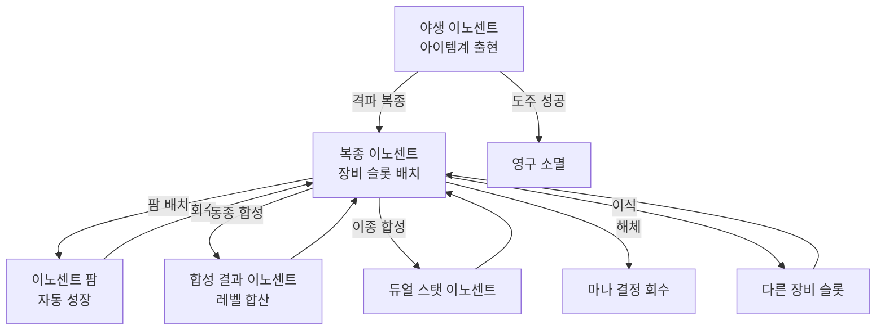

# 이노센트 팜 시스템 (Innocent Farm System) — SYS-INC-02

## 구현 현황 (Implementation Status)

> 최근 업데이트: 2026-03-29
> 문서 상태: `작성 중 (Draft)`
> 3-Space: Hub (팜 시설 주거점), Item World (이노센트 조우/복종 발생)
> 기둥: 야리코미 (주), 온라인 멀티플레이 (부)

| 기능 ID   | 분류   | 기능명 (Feature Name)                           | 우선순위 | 구현 상태  | 비고 (Notes)                                          |
| :-------- | :----- | :---------------------------------------------- | :------: | :--------- | :---------------------------------------------------- |
| INC-F-01  | 팜     | 허브 이노센트 팜 시설 (자동 성장)               |    P2    | 대기       | Hub 내 전용 공간, Phase 2 구현                        |
| INC-F-02  | 팜     | 팜 슬롯 용량 확장 (8 → 24)                     |    P2    | 대기       | 아이템계 클리어 달성 조건으로 해금                    |
| INC-F-03  | 팜     | 자동 번식 (이종 이노센트 배치 → 듀얼 생성)      |    P2    | 대기       | 낮은 확률 랜덤, 세션 복귀 서프라이즈 보상            |
| INC-F-04  | 복종   | 야생 이노센트 포획 조건 및 확률 판정            |    P1    | 대기       | SYS-INC-01 복종 전투 규칙과 연동                      |
| INC-F-05  | 합성   | 동종 이노센트 레벨 합산 합성                    |    P1    | 대기       | 확정 합산, 무료, Hub 합성 NPC 접근 필요               |
| INC-F-06  | 합성   | 이종 합성 (듀얼 스탯 이노센트 생성)             |    P2    | 대기       | 확률 60%, 경량 재화 비용, 레시피 방식                 |
| INC-F-07  | 해체   | 이노센트 해체 (마나 결정 회수)                  |    P2    | 대기       | 복종 이노센트만 해체 가능                             |
| INC-F-08  | 등급   | 이노센트 등급 (Common → Legendary) 분류         |    P1    | 대기       | 조우 연출 차등, 드롭 확률 차등                        |
| INC-F-09  | 슬롯   | 이노센트 슬롯 배치/이식/제거 UI                 |    P1    | 대기       | SYS-INC-01 슬롯 규칙 연동                             |
| INC-F-10  | 멀티   | 동행자 보상 (이노센트 크리스탈 + 조각)          |    P2    | 대기       | 파티 아이템계 진입 시 동행자 전용 보상                |
| INC-F-11  | 거래   | 이노센트 제한 거래 (일반~Rare만 허용)           |    P2    | 대기       | Legendary 이상 귀속(Bound), 거래 수수료 Sink          |
| INC-F-12  | 서사   | 넘버 원 (No.1) 팜/합성/제거 잠금                |    P1    | 대기       | 서사 이노센트 특수 처리, SYS-INC-01 연동              |

---

## 0. 참고 자료 (References)

- Project Vision: `Documents/Terms/Project_Vision_Abyss.md`
- Writing Standards: `Documents/Terms/GDD_Writing_Rules.md`
- Glossary: `Documents/Terms/Glossary.md`
- 이노센트 코어 (SYS-INC-01): `Documents/System/System_Innocent_Core.md` — 야생/복종 이분법, 슬롯 규칙, MVP 타입 정의, 넘버 원
- 아이템계 코어 (SYS-IW-01): `Documents/System/System_ItemWorld_Core.md` — 아이템계 진입/탈출 및 이노센트 드롭
- 경제 설계 철학 (D-07): `Documents/Design/Design_Economy_FaucetSink.md` — 수도꼭지/배수구 순환 모델
- 이노센트 분류 리서치: `Documents/Research/Innocent_Classification_Balance_Research.md` — 스탯형/전투형/파밍형 전체 타입 정의
- 이노센트 성장 경제 리서치: `Documents/Research/Innocent_Growth_Economy_Research.md` — 선형 합산, 소프트 캡, 팜 자동 성장
- 이노센트 전투 행동 리서치: `Documents/Research/Innocent_Combat_Behavior_Research.md` — 야생 이노센트 도주 행동, 조우 빈도
- 이노센트 멀티플레이 소셜 리서치: `Documents/Research/Innocent_Multiplayer_Social_Research.md` — 오너 귀속, 동행자 보상, 거래 제한
- 이노센트 내러티브 리서치: `Documents/Research/Innocent_Narrative_Worldbuilding_Research.md` — "기억이 응결되어 의지가 된 존재"
- 디스가이아 이노센트 리서치: `Documents/Research/Disgaea_ItemWorld_InnocentSystem.md` — 원작 레퍼런스
- 수치 데이터 SSoT: `Sheets/Innocent_Farm_Params.csv` (Phase 2 생성 예정)

---

## 1. 개요 (Concept)

### 1.1. 설계 의도 (Intent)

> "이노센트 팜 시스템은 아이템계 직접 전투로 복종시킨 이노센트를 육성하고 순환시키는 허브 내 성장 인프라다. 야리코미의 핵심 루프인 '수집 → 합성 → 강화 → 아이템계 재진입'의 허브 쪽 축을 담당하며, 팜의 존재가 세션 복귀 동기를 형성한다. 단, 팜이 아이템계 직접 전투를 대체하는 지름길이 되어서는 안 된다."

이노센트 팜 시스템은 세 가지 행위를 하나의 시설로 통합한다:

1. 복종 이노센트의 자동 성장 — 세션 사이 팜에 맡긴 이노센트가 전투 참여 없이 천천히 레벨을 올린다
2. 이노센트 합성 — 같은 종류의 복종 이노센트를 합쳐 레벨을 합산한다
3. 이노센트 번식 — 서로 다른 종류의 이노센트를 배치하면 낮은 확률로 새 이노센트가 태어난다

에르다의 세계관 언어로 표현하면: "대장장이가 혼돈의 기억 조각을 두드려 형태를 잡은 뒤, 그 조각들이 서로 공명하도록 나란히 두는 것." 팜은 복종 이후의 이야기다. 복종시킨 이노센트가 팜에서 다른 이노센트들과 기억을 나누며 성장한다.

### 1.2. 설계 근거 (Reasoning)

| 설계 결정 | 채택 이유 | 기각된 대안 |
| :--- | :--- | :--- |
| 동종 합성 레벨 합산 (확정) | 예측 가능한 장기 목표 형성. "레벨 50짜리 10개 → 레벨 500 하나"라는 역폭식 전략이 야리코미의 핵심 달성감 | 랜덤 합성 결과 — 합성 결과 불확실 시 장기 파밍 계획이 불가능해지고 좌절 누적 |
| 팜 자동 성장 (오프라인 성장 아님) | 팜 성장이 전투 참여 횟수에 비례 → 아이템계 탐험 동기 강화. 방치 게임 느낌 방지 | 오프라인 시간 기반 성장 — 모바일 과금 게임의 "에너지 대기" 느낌, 야리코미와 정반대 |
| 번식으로 듀얼 스탯 이노센트 생성 | 의도적 합성(확률 60%)과 자동 번식(낮은 확률)의 이중 경로. 합성은 통제된 목표, 번식은 세션 복귀 서프라이즈 | 레시피 없이 순수 랜덤 번식 — 목표 없는 랜덤은 수집 의욕보다 좌절을 유발 |
| 이노센트 해체 (마나 결정 회수) | 불필요한 이노센트를 경제 Sink로 처리. 슬롯 정리와 경제 순환을 동시 해결 | 이노센트 삭제(완전 소멸) — 장기 파밍 산물이 흔적 없이 사라지면 심리적 손실 체감 과도 |
| Legendary 이상 거래 금지 (귀속) | 파밍 동기 보존. "최고 이노센트를 사는 게 파밍보다 효율적"이 되면 아이템계 핵심 루프 붕괴 | 모든 이노센트 자유 거래 — Diablo 3 경매장 실패 사례 반복 위험 |
| 동행자 보상 하이브리드 (크리스탈 + 조각) | 단기 보상(크리스탈)과 장기 목표(조각)를 동시 제공. 파티 플레이 유인과 이노센트 희소성 보존을 동시 달성 | 이노센트 복사본 직접 지급 — 동행자 4인 전원 복사본 수령 시 이노센트 공급 과잉, 희소성 붕괴 |

### 1.3. 3대 기둥 정렬 (Pillar Alignment)

| 기둥 | 팜 시스템에서의 구현 |
| :--- | :--- |
| 메트로베니아 탐험 | 이노센트 성장 → 스탯 상승 → 월드 스탯 게이트 해금. 더 높은 스탯 게이트를 위해 더 많은 이노센트를 복종시켜야 하므로 아이템계 진입 동기가 탐험 동기와 연결된다 |
| 아이템계 야리코미 | 팜의 전투 기반 자동 성장이 아이템계 탐험 시간과 비례해 성장 → 직접 플레이할수록 팜이 함께 성장하는 구조. 합성으로 고레벨 이노센트를 만드는 역폭식 파밍이 야리코미의 핵심 장기 목표 |
| 온라인 멀티플레이 | 동행자 보상 시스템이 "남의 아이템계를 도와줄 이유"를 명확히 제공. 허브 이노센트 상점과 제한 거래가 허브 소셜 공간의 경제 활동 기반을 형성 |

### 1.4. 저주받은 문제 검증 (Cursed Problem Check)

| 긴장 | 위험 A | 위험 B | 설계의 선택 |
| :--- | :--- | :--- | :--- |
| 팜 편의성 vs 아이템계 직접 전투 필요성 | 팜이 너무 강력하면 아이템계 진입 없이도 이노센트가 성장 → 야리코미 루프 단락 | 팜이 너무 약하면 "팜에 무언가를 넣는다"는 행위가 의미 없음 | 팜 성장이 전투 횟수에 비례하도록 설계. 오프라인 시간 성장은 없음. 팜은 보조 가속이고 주축은 아이템계 직접 파밍 |
| 합성 인플레 vs 성장 천장 | 소프트 캡 없이 합성하면 야리코미 유저와 캐주얼 유저의 이노센트 격차가 무제한 확대 | 소프트 캡이 너무 낮으면 야리코미 유저가 "더 쌓을 의미 없다"고 이탈 | 소프트 캡 설정. 소프트 캡 이후 추가 합성은 가능하나 스탯 기여 없음. 초고레벨 이노센트의 가치는 "소프트 캡에 도달했다"는 달성감 |
| 이노센트 거래 편의성 vs 파밍 동기 보존 | 자유 거래 허용 시 "직접 파밍보다 구매가 효율적" 상황 발생 → 아이템계 루프 붕괴 | 거래 완전 금지 시 허브 소셜 경제 활동 소멸, 협동 파밍 보상 전달 불가 | Common~Rare는 제한 거래 허용(아이템 오너 귀속 해제 가능). Legendary 이상은 귀속(Bound). Mythic 이노센트는 조각으로만 획득 |
| 넘버 원의 서사적 특수성 vs 시스템 일관성 | 넘버 원이 팜 규칙의 예외라면 플레이어가 "왜 이것만 안 되지?"라는 혼란 체감 | 넘버 원도 동일 규칙 적용 시 서사적 무게가 사라짐 | 넘버 원은 에르다의 망치 에코에 귀속된 서사 이노센트로, 이식/합성/해체/팜 배치가 불가한 존재임을 UI가 명확히 설명 |

### 1.5. 위험과 보상 (Risk & Reward)

| 행위 | 리스크 | 리턴 | 최대 리스크 = 최대 리턴 순간 |
| :--- | :--- | :--- | :--- |
| 야생 이노센트 복종 전투 | 아이템계 내 강화된 적, 복종 실패 없음 / 시간과 체력 소모 | 복종 즉시 레벨 2배 (실효 4배 스탯 체감) | 고레벨 야생 이노센트를 동행자 없이 솔로 격파할 때 |
| 동종 합성 | 합성 재료로 사용된 이노센트 소멸 | 레벨 합산된 단일 이노센트 생성 | 오랫동안 모은 저레벨 이노센트 다수를 한 번에 합쳐 고레벨 단일로 완성하는 순간 |
| 팜 배치 결정 | 팜 슬롯 점유 (다른 이노센트를 넣을 수 없음) | 전투 횟수 비례 자동 성장, 번식 가능성 | 팜이 꽉 찬 상태에서 새 복종 이노센트를 얻었을 때 "무엇을 교체할 것인가" 선택 |
| 파티 동행 (남의 아이템계 도움) | 이노센트는 오너 귀속 (직접 얻지 못함) | 이노센트 크리스탈 + 이노센트 조각 누적 | 유니크 이노센트의 아이템계에서 조각 드롭을 모아 완성하는 장기 목표 달성 |
| 이노센트 해체 | 복종 이노센트 영구 소멸 | 마나 결정 회수 (합성 비용 충당) | 소프트 캡 초과한 중복 이노센트를 해체해 합성 비용을 자급하는 순간 |

---

## 2. 핵심 규칙 (Core Rules)

### 2.1. 야생 이노센트 포획 조건 (복종 상세 규칙)

야생 이노센트는 아이템계 내에서 특정 조건을 만족해야 조우하며, 격파 시 복종 상태로 전환된다. 본 문서의 복종 전투 기본 규칙은 `Documents/System/System_Innocent_Core.md` 섹션 2.5를 따른다. 아래는 팜 시스템 관점에서의 포획 흐름이다.

#### 조우 발생 구조

```
[방 클리어] → [확률 판정]
                ├─ 스탯형 이노센트: 지층 번호 × 5% + 기본 10% (1지층 15%, 4지층 30%)
                ├─ 유니크 이노센트: 지층 번호별 정해진 고정 확률 (1지층 0%, 2지층 10%, 3지층 20%, 4지층 30%)
                ├─ Mythic 이노센트 (최상위 등급): 지층별 절대 수 기준 (하단 표 참조)
                └─ 없음
```

Mythic 이노센트 출현 확률 기준값은 `Documents/Research/Innocent_Combat_Behavior_Research.md` 섹션 1.4 표를 SSoT로 따른다. 요약:

| 지층 번호 | Mythic 이노센트 출현 확률 |
| :--- | :---: |
| 1지층 | 5% |
| 2지층 | 8% |
| 3지층 | 12% |
| 4지층 | 20% |

> 이 수치는 Research 문서 SSoT 기준이다. 공식 파생 수치(예: 지층 × 3% + 2%)는 Research 표와 충돌하므로 사용하지 않는다. 튜닝 변경 시 Research 문서 섹션 1.4 표를 먼저 갱신한 뒤 이 문서를 동기화한다.

야생 이노센트 각성 거리 기준:
- 스탯형 일반: 반경 `Wild_Aggro_Range_Default` 타일 (기본값 5)
- 유니크 이노센트: 반경 `Wild_Aggro_Range_Unique` 타일 (기본값 7) + 특수 이펙트
- Mythic 이노센트: 반경 `Wild_Aggro_Range_Mythic` 타일 (기본값 3)

각성 후 도주 패턴은 `Documents/Research/Innocent_Combat_Behavior_Research.md` 섹션 1.3을 따른다. 요약하면, 이노센트의 기본 이동 속도는 플레이어 기본 이동 속도의 `Innocent_Flee_Speed_Ratio`(기본값 0.75)로 설정되어 정상 플레이어는 추격이 가능하지만 지형 불리 상황에서는 놓칠 수 있다.

#### 포획 성공 조건

- 격파 조건: 이노센트 HP를 0으로 만든다 (실패 없음 — 격파하면 반드시 복종)
- 도주 성공 시: 해당 지층에서 영구 소멸, 재등장 없음
- 도주 방지: 이노센트가 지층 출구(포탈)에 도달하거나 `Innocent_Flee_Timer`(기본값 120초) 초과 시 도주 성공

#### 복종 즉각 효과

복종 확정 순간, 이노센트는 야생 레벨의 2배 레벨로 전환된다 (`Subdued_Level_Multiplier` 기본값 2.0). 실효 스탯 체감은 4배다 (야생 시 0.5배 효과 → 복종 시 1.0배 효과 × 2배 레벨).

```
실효 스탯 배율 = 복종 레벨(야생 × 2) × 1.0 ÷ (야생 레벨 × 0.5)
             = 2배 × (1.0 ÷ 0.5)
             = 4배
```

### 2.2. 이노센트 팜 시설

#### 팜의 위치와 성격

이노센트 팜은 허브(Hub) 내 전용 공간으로 존재한다. 시각적으로 "살아있는" 공간이어야 한다 — 배치된 이노센트들이 화면에 보이며 움직이고, 수가 많을수록 화면 활동량이 증가한다.

팜은 전투 없이 이노센트를 천천히 성장시키는 보조 시설이다. 팜 내 이노센트 레벨업은 아이템계 전투 참여 횟수에 연동된다.

> **"전투 1회" 정의:** 아이템계 내 단일 방에서 적 웨이브 전원을 격파하여 방 클리어를 완료하는 것. 보스 방 클리어도 전투 1회로 계산된다. 방을 클리어하지 않고 탈출하거나 이동만 하는 경우는 전투 완료로 인정되지 않으며 팜 성장 판정이 발생하지 않는다.

```
팜 레벨업 발생 조건:
  아이템계 전투 1회 종료 시 → 팜 내 이노센트 각각에 대해 확률 판정
  레벨업 확률 = Innoc_Farm_Level_Chance (기본값 0.02 = 2%/전투)
  레벨업 성공 → 해당 이노센트 레벨 +1
```

오프라인 시간에 의한 성장은 없다. 팜은 직접 플레이에 대한 보너스로 기능하며, 대기 시간 보상이 아니다.

#### 팜 슬롯 용량 확장

| 단계 | 팜 용량 | 해금 조건 |
| :--- | :-----: | :--- |
| 기본 | 8슬롯 | 허브 팜 시설 첫 접근 시 자동 개방 |
| 확장 1 | 12슬롯 | 아이템계 Normal 등급 장비 이노센트 전원 복종 달성 1회 |
| 확장 2 | 16슬롯 | 아이템계 Rare 등급 장비 최심층(3지층) 클리어 1회 |
| 확장 3 | 20슬롯 | 아이템계 Legendary 등급 장비 최심층(4지층) 클리어 1회 |
| 야리코미 | 24슬롯 | Ancient 등급 장비 심연 지층(4+지층) 클리어 1회 |

팜 슬롯이 꽉 찬 상태에서 배치를 시도하면 기존 이노센트와 교체 선택창이 표시된다. 강제 배치는 없다.

#### 팜 배치 및 회수 규칙

- 배치 가능 조건: 복종(Subdued) 상태 이노센트만 배치 가능. 야생 이노센트는 팜 배치 불가
- 배치된 이노센트는 장비 슬롯에서 제거된 상태로 팜에 존재. 장비 효과는 팜 배치 중 비활성화
- 회수 시: 즉시 회수 가능. 성장된 레벨이 그대로 유지됨
- 넘버 원(No.1): 팜 배치 불가 (에코에 귀속된 서사 이노센트)

**슬롯 점유 규칙:** 팜에 배치된 이노센트의 원래 장비 슬롯은 "In Farm" 마커가 표시된 상태로 점유 상태를 유지한다. 해당 슬롯은 다른 이노센트로 채울 수 없으며, 팜 배치 중 이노센트의 스탯 기여는 0이다 (장비에 효과가 적용되지 않는다). 회수 후에야 슬롯이 정상 활성화되고 스탯 기여가 재개된다.

### 2.3. 이노센트 합성 규칙

#### 동종 합성 (기본 합성)

동종 합성은 Project Abyss 이노센트 성장의 주축이다. 결과는 100% 확정적이며 무료다.

```
합성 조건:
  - 동일 타입 (예: Gladiator + Gladiator)
  - 두 이노센트 모두 복종(Subdued) 상태
  - Hub 합성 NPC 접근 (허브 내 전용 NPC)

합성 결과:
  Result.Level = A.Level + B.Level
  Result.Type  = A.Type (동일)
  Result.State = 복종(Subdued)

예시:
  Gladiator Lv.50 (복종) + Gladiator Lv.30 (복종) → Gladiator Lv.80 (복종)
```

소프트 캡 초과 처리:
- 합산 레벨이 해당 타입의 소프트 캡을 초과하면 초과분은 보존되지 않고 절사된다
- 예: Gladiator 소프트 캡 300. Lv.200 + Lv.150 합성 → Lv.300 (초과분 50 소멸)
- 소프트 캡 달성 자체가 야리코미의 중간 목표점으로 기능한다

합성 불가 조건:

| 상황 | 결과 |
| :--- | :--- |
| 야생 + 야생 | 합성 불가 |
| 야생 + 복종 | 합성 불가 |
| 다른 타입 (Gladiator + Tutor) | 기본 합성 불가 (이종 합성 경로 별도) |
| 넘버 원 + 어떤 이노센트 | 합성 불가 (서사 이노센트 규칙) |

#### 이종 합성 (듀얼 스탯 이노센트 생성)

이종 합성은 두 종류의 단일 스탯 이노센트를 결합해 듀얼 스탯 이노센트를 만드는 고급 합성이다.

```
합성 조건:
  - 지정된 레시피 두 종류 이상 (예: Gladiator + Guardian → Iron Fist)
  - 두 이노센트 모두 복종(Subdued) 상태
  - Hub 합성 NPC 접근
  - 비용: Mana_Crystal × Dual_Synthesis_Cost (기본값 50개)

합성 결과 (확률):
  성공(60%): 듀얼 스탯 이노센트 생성
    Result.Level = (A.Level + B.Level) × Dual_Level_Ratio (기본값 0.4)
    두 재료 이노센트 소멸

  실패(40%): 합성 실패
    두 재료 이노센트 모두 소멸
    Mana_Crystal 비용만 소비됨
    (실패 보상: Mana_Crystal × Dual_Fail_Refund = 기본 10개 반환)

  피티 보장 (연속 실패 구제):
    연속 실패 횟수를 누적 카운터로 추적
    Dual_Synthesis_Pity_Max (기본값 3)회 연속 실패 시 다음 시도는 성공 확정
    성공(확정 또는 일반) 후 카운터 초기화
    피티 카운터는 계정 단위로 저장되며 로그아웃 후에도 유지됨
```

피티 적용 예시:
  1차 시도: 실패 (카운터 1)
  2차 시도: 실패 (카운터 2)
  3차 시도: 실패 (카운터 3 = Dual_Synthesis_Pity_Max 도달)
  4차 시도: 성공 확정 (카운터 초기화)

듀얼 스탯 이노센트는 단일 스탯 이노센트 대비 각 스탯을 0.7배 적용하나 슬롯 1개를 절약하는 트레이드오프다. 레시피 목록은 `Documents/Research/Innocent_Classification_Balance_Research.md` 섹션 1.1을 따른다.

#### 일괄 합성 (UI 편의 기능)

같은 타입의 이노센트 다수를 한 번에 합산하는 UI 기능이다.

```
[이노센트 관리 화면] → [타입 필터 선택] → [같은 타입 전체 선택 또는 개별 선택]
→ "일괄 합성" 버튼 → 합성 미리보기 (최종 레벨 표시) → 확인 → 합성 완료
```

일괄 합성은 내부적으로 순차 2개씩 반복 처리가 아닌, 선택된 모든 이노센트 레벨을 합산 후 단일 결과를 생성한다. 소프트 캡은 최종 결과에만 적용된다.

### 2.4. 이노센트 번식 (자동 생성)

이노센트 번식은 팜에 서로 다른 종류의 이노센트를 배치했을 때 낮은 확률로 새 이노센트가 자동 생성되는 메커니즘이다. 세션 복귀 후 "오늘 뭐 태어났지?"라는 서프라이즈 보상을 제공한다.

```
번식 조건:
  - 팜에 서로 다른 타입 이노센트 2개 이상 배치
  - 팜에 빈 슬롯 1개 이상 존재
  - 전투 1회 완료 시마다 번식 판정 (확률: Innoc_Breed_Chance 기본값 0.005 = 0.5%/전투)

번식 결과:
  탄생 이노센트 종류:
    ├─ 동종 번식: 부모 중 한 쪽 타입 (66%)
    └─ 이종 번식: 두 타입의 듀얼 스탯 이노센트 (34%) — 레시피 조합 가능 시만 적용

  탄생 이노센트 레벨:
    Level_Born = (Parent_A.Level + Parent_B.Level) × Breed_Level_Ratio (기본값 0.05)
    최소 레벨: 1

  탄생 이노센트 상태: 야생(Wild) — 팜에서 태어났어도 야생 상태, 복종은 아이템계 격파로만 가능

  번식 알림: 허브 재접속 시 "이노센트 팜에서 새 이노센트가 태어났습니다" UI 알림 표시
```

팜에서 태어난 이노센트가 야생 상태인 것은 의도적 설계다. "팜에서 태어난 이노센트도 아이템계에 들어가 복종시켜야 한다"는 규칙이 아이템계 진입 동기를 유지한다. 팜이 아이템계의 대체재가 되지 않도록 하는 핵심 장치다.

### 2.5. 이노센트 해체 규칙

불필요한 이노센트를 해체하여 마나 결정(Mana Crystal)을 회수한다. 해체는 되돌릴 수 없다.

```
해체 조건:
  - 복종(Subdued) 상태 이노센트만 해체 가능
  - 야생 이노센트는 해체 불가 (아이템계로 돌아갈 것을 강제하는 설계 — 야생 이노센트는 격파해 복종시키거나 무시하는 두 선택만 존재)
  - 넘버 원(No.1) 해체 불가

해체 회수량:
  Mana_Crystal_Return = Innocent_Level × Dismantle_Ratio (기본값 0.1)
  최소 회수: 1 Mana Crystal
  예시: Lv.100 Gladiator 해체 → 10 Mana Crystal 회수

  소프트 캡 초과 이노센트:
    소프트 캡 이상의 레벨은 해체 계산에 포함되지 않음
    예: Lv.300 (소프트 캡 도달) Gladiator = Lv.300 기준으로 계산
```

### 2.6. 이노센트 슬롯 관리

슬롯 관련 기본 규칙은 `Documents/System/System_Innocent_Core.md` 섹션 2.2를 따른다. 이 섹션은 팜 시스템과 연동되는 이식 및 제거 규칙을 정의한다.

#### 이노센트 이식 (아이템 간 이동)

- 이식 가능 조건: 복종(Subdued) 상태 이노센트만 이식 가능
- 이식 비용: 없음 (무료)
- 이식 후 상태: 복종 상태 유지, 레벨 유지
- 이식 불가: 야생 이노센트, 넘버 원

이식 절차:

```
[장비 A의 이노센트 X 선택] → "이식" 버튼 → [이식 대상 장비 선택]
→ 대상 장비에 빈 슬롯 있음: 즉시 이식
→ 대상 장비 슬롯 꽉 참: 교체할 이노센트 선택 → 교체(기존 이노센트는 인벤토리로 이동)
```

#### 이노센트 제거

- 제거 시 이노센트는 장비에서 분리되어 이노센트 인벤토리로 이동 (소멸하지 않음)
- 이노센트 인벤토리 용량: `Innoc_Inventory_Max` (기본값 100개)
- 인벤토리 초과 시 제거/해체 경고 UI 표시

### 2.7. 이노센트 등급 체계

이노센트 등급은 조우 연출과 드롭 확률에 영향을 미친다. 등급은 이노센트 타입과 독립적이다 — 같은 Gladiator라도 Common에서 Legendary까지 다른 등급으로 등장할 수 있다.

| 등급 | 색상 코드 | 드롭 상대 확률 | 조우 연출 | 스탯 배율 (같은 레벨 기준) |
| :--- | :--- | :---: | :--- | :---: |
| Common | 흰색 #FFFFFF | 기준(100%) | 흰 오라 명멸, 이름 팝업 | ×1.0 |
| Uncommon | 파란색 #6969FF | 30% | 파란 오라, 간단한 파티클 | ×1.2 |
| Rare | 노란색 #FFFF00 | 12% | 노란 오라, 화면 약한 떨림 | ×1.5 |
| Legendary | 주황색 #FF8000 | 3% | 주황 방사 이펙트, 고유 테마 인트로 2~3초 | ×2.0 |
| Mythic | 초록색 #00FF00 | 1% 미만 (층당 0~1) | 전체 화면 플래시, BGM 교체, 테두리 초록 펄스 | 고유 효과 |

> **"Mythic" 명칭 선택 근거:** 최상위 이노센트 등급을 "Unique"로 지칭하면 장비 레어리티 체계의 "Ancient" 등급과 개념 혼동이 발생한다 ("유니크 아이템" vs "유니크 이노센트"). "Mythic"으로 리네임하여 장비 레어리티 5단계(Normal~Ancient)와 이노센트 등급 5단계(Common~Mythic)를 명확히 구분한다.

등급과 레벨은 별개다. Common Lv.300은 Rare Lv.100보다 스탯 기여가 낮을 수 있다 (×1.0 × 300 = 300 vs ×1.5 × 100 = 150 — 이 경우는 Common이 더 강하다). 등급의 주된 의미는 "얻기 어렵다는 희소성 연출"과 "레벨 보너스"이며, 고등급 이노센트는 같은 레벨 대비 더 강하다.

### 2.8. 멀티플레이 이노센트 보상 규칙

#### 오너 귀속 원칙

아이템계에서 획득되는 모든 이노센트는 해당 아이템의 소유자(파티 리더 = 아이템 오너)에게 귀속된다. 격파한 플레이어가 동행자여도 이노센트는 오너의 아이템에 배치된다.

이 원칙의 세계관 근거: 아이템계는 아이템 오너의 "기억 공간"이다. 그 안에 사는 이노센트는 그 공간의 주인에게 속한다.

#### 동행자 보상 시스템

동행자(아이템 오너가 아닌 파티원)는 이노센트 격파 기여 시 아래 보상을 받는다.

```
이노센트 격파 1회 시 동행자 보상:
  항상:   이노센트 크리스탈 +Innoc_Crystal_Base ~ +Innoc_Crystal_Max
            (등급별: Common 1~2, Uncommon 2~4, Rare 4~8, Legendary 8~15, Mythic 15~30)

  확률:   이노센트 조각 드롭
            - Common 조각: 드롭 확률 Innoc_Shard_Chance_Common (기본값 30%)
            - Rare 조각: 드롭 확률 Innoc_Shard_Chance_Rare (기본값 10%)
            - Legendary 조각: 드롭 확률 Innoc_Shard_Chance_Legendary (기본값 3%)
            - Mythic 조각: 드롭 확률 Innoc_Shard_Chance_Mythic (기본값 0.5%)
```

이노센트 크리스탈 용도 (허브 이노센트 상점):

| 용도 | 비용 |
| :--- | :---: |
| Common 이노센트 구매 | 30 크리스탈 |
| Uncommon 이노센트 구매 | 80 크리스탈 |
| 이노센트 팜 확장 (슬롯 +4) | 200 크리스탈 |
| 이노센트 조각 → 특정 조각 변환 (1:1) | 20 크리스탈 |

이노센트 조각 완성 기준:

| 등급 | 필요 조각 수 | 완성 시 획득 |
| :--- | :---: | :--- |
| Common | 5 | Common 이노센트 1개 (야생, 레벨 1) |
| Rare | 15 | Rare 이노센트 1개 (야생, 레벨 1) |
| Legendary | 30 | Legendary 이노센트 1개 (야생, 레벨 1) |
| Mythic | 50 | Mythic 이노센트 1개 (야생, 레벨 1) |

조각으로 완성된 이노센트도 야생 상태다. 복종은 아이템계 직접 전투로만 가능하다.

### 2.9. 이노센트 거래 규칙

| 등급 | 거래 허용 여부 | 규칙 |
| :--- | :--- | :--- |
| Common | 허용 | 허브 거래소에서 자유 거래. 단, 거래 시 수수료 `Trade_Fee_Ratio`(기본값 5%) Sink 적용 |
| Uncommon | 허용 | 동일 |
| Rare | 허용 | 동일. 단, 거래 완료 후 구매자의 아이템에 귀속(Bound) 전환 — 재거래 불가 |
| Legendary | 금지 | 귀속(Bound). 획득 즉시 오너에게만 귀속. 거래 불가 |
| Mythic | 금지 | 귀속(Bound). 조각 완성으로만 획득 가능. 거래 불가 |
| 넘버 원 | 금지 | 서사 이노센트. 거래/이식/해체 전면 불가 |

Legendary 이상을 거래 금지하는 이유는 `Documents/Design/Design_Economy_FaucetSink.md`의 Diablo 3 경매장 교훈에 근거한다. 최고 등급 이노센트가 시장에서 구매 가능해지면 "파밍보다 구매가 합리적"이 되어 아이템계 핵심 루프를 붕괴시킨다.

### 2.10. 넘버 원 (No.1) 특수 처리

넘버 원은 모든 이노센트 규칙에서 예외인 서사 이노센트다. 상세 정의는 `Documents/System/System_Innocent_Core.md` 섹션 2.3-N을 따른다. 팜 시스템 관점의 규칙 요약:

| 행위 | 규칙 |
| :--- | :--- |
| 팜 배치 | 불가 |
| 동종 합성 | 불가 |
| 이종 합성 | 불가 |
| 이식 (다른 아이템으로) | 불가 (에코에 귀속) |
| 해체 | 불가 |
| 거래 | 불가 |
| 스탯 효과 | P1 단계: 없음. P2: 서사 진행 연동 |

UI에서 넘버 원에 위 행위를 시도하면, "이 이노센트는 에코에 깃든 기억입니다. 분리할 수 없습니다."라는 메시지가 표시된다.

---

## 3. 수치 설계 (Formulas & Parameters)

### 3.1. 이노센트 스탯 기여 공식

이노센트가 장비에 부여하는 스탯 보너스는 다음 공식으로 계산된다:

```
야생 이노센트 스탯 기여 = Innocent.Level × Innoc_Wild_Multiplier × TypeBonus
복종 이노센트 스탯 기여 = Innocent.Level × Innoc_Subdued_Multiplier × TypeBonus

Innoc_Wild_Multiplier (기본값 0.5)
Innoc_Subdued_Multiplier (기본값 1.0)
TypeBonus = 이노센트 등급별 배율
  - Common ×1.0, Uncommon ×1.2, Rare ×1.5, Legendary ×2.0, Mythic: 고유 효과

최종 장비 스탯:
FinalStat = BaseStat + EquipStat + Σ(이노센트별 스탯 기여)
```

이 공식은 합연산(가산) 방식이다. 기본 스탯에 더하는 방식으로 곱연산 대비 후반 인플레이션이 완만하다.

### 3.2. 이노센트 타입별 소프트 캡 및 레벨당 효과

상세 수치는 `Documents/Research/Innocent_Classification_Balance_Research.md`를 SSoT로 한다. 핵심 수치 요약:

| 분류 | 이노센트 예시 | 레벨당 효과 | 소프트 캡 | 비고 |
| :--- | :--- | :--- | :---: | :--- |
| 스탯형 단일 | Gladiator(STR), Tutor(INT) | +1/레벨 해당 스탯 | 300 | 야리코미 장기 목표 |
| 스탯형 HP/MP | Dietician(HP), Scholar(MP) | HP+5, MP+2/레벨 | 200 | 비선형 수치라 캡 낮음 |
| 스탯형 SPD/LCK | Sprinter(SPD), Trickster(LCK) | +1/레벨 해당 스탯 | 200 | 폭주 위험으로 캡 낮음 |
| 전투 효과형 | Swift Striker(공격속도), Critical Eye(크리) | +0.5%/레벨 | 60 | % 효과라 캡 낮음 |
| 파밍형 | Statistician(EXP%), Collector(레어리티값) | 타입별 상이 | 500/100 | 경제 인플레이션 제어 |
| 듀얼 스탯 | Iron Fist(STR+VIT), Phantom(DEX+SPD) | ×0.7 각각 | 250/200 | 슬롯 절약 트레이드오프 |
| 서사형 | 넘버 원(No.1) | P1: 없음 | N/A | 수치 보너스 없음 |

소프트 캡 설계 목적: 이노센트 보너스가 캐릭터 총 스탯의 30~40%를 넘지 않도록 제어한다 (30/70 법칙 적용).

### 3.3. 팜 자동 성장 기대값 계산

```
전제: 전투 1회 = 방 1개 클리어 기준
팜 성장 확률/전투: Innoc_Farm_Level_Chance (기본값 0.02)

캐주얼 유저 (일 30분, 전투 약 20회):
  일 기대 레벨업 = 20 × 0.02 = 0.4 레벨/이노센트/일
  주간 기대 = 2.8 레벨/이노센트

코어 유저 (일 2시간, 전투 약 80회):
  일 기대 레벨업 = 80 × 0.02 = 1.6 레벨/이노센트/일
  주간 기대 = 11.2 레벨/이노센트

야리코미 유저 (일 4시간+, 전투 약 160회+):
  주축은 대량 합성. 팜 성장은 보조 가속
  주간 팜 성장 = 22.4 레벨/이노센트 (합성과 병행)
```

팜 성장 속도는 의도적으로 느리게 설계된다. 주 2~3레벨 수준의 팜 성장은 "파밍의 부산물"이지 "주요 성장 경로"가 아니다. 주요 성장 경로는 항상 아이템계 직접 파밍 + 합성이다.

### 3.4. 듀얼 합성 레벨 계산

```
이종 합성 결과 레벨:
  Result.Level = (A.Level + B.Level) × Dual_Level_Ratio (기본값 0.4)

예시:
  Gladiator Lv.100 + Guardian Lv.80 → Iron Fist Lv.72
  계산: (100 + 80) × 0.4 = 72

비고: 듀얼 스탯 이노센트는 두 스탯을 각 ×0.7 효율로 적용
  Lv.72 Iron Fist = STR ×0.7 × 72 + VIT ×0.7 × 72
                  = STR +50.4 + VIT +50.4
  대비: Gladiator Lv.72 단독 = STR +72 (슬롯 1개 사용)
         Iron Fist Lv.72 = STR +50 + VIT +50 (슬롯 1개 사용)
  슬롯 1개로 2종 스탯을 얻지만 개별 단일 스탯보다 낮음 — 트레이드오프
```

### 3.5. 이노센트 경제 순환 지표

이노센트 경제의 Faucet과 Sink를 `Documents/Design/Design_Economy_FaucetSink.md`와 연동하여 정의한다.

| 자원 | Faucet (공급원) | Sink (소비처) |
| :--- | :--- | :--- |
| 이노센트 (야생) | 아이템계 방 클리어 확률 드롭, 팜 번식 | 복종 전투 결과 복종 상태 전환 (야생 소멸) |
| 이노센트 (복종) | 야생 복종 처리, 조각 완성, 상점 구매 | 합성 재료로 소멸, 팜 배치 후 활용, 해체 |
| 마나 결정 | 이노센트 해체, 아이템계 드롭 | 이종 합성 비용, 팜 확장 |
| 이노센트 크리스탈 | 동행자 격파 기여 보상 | 허브 이노센트 상점 교환 |
| 이노센트 조각 | 동행자 격파 확률 드롭, 크리스탈 변환 | 조각 완성(N개 → 이노센트 1개) |

---

## 4. 흐름 (Flow)

### 4.1. 이노센트 생애 주기 (Life Cycle)



### 4.2. 팜 세션 루프 (Session Loop)

```
[아이템계 탐험]
  ↓ 전투 완료 시마다
  ↓ Innoc_Farm_Level_Chance(2%) 판정 → 팜 내 이노센트 레벨업
  ↓ Innoc_Breed_Chance(0.5%) 판정 → 번식 후보 생성
  ↓
[허브 귀환]
  ↓ 수확 알림: "팜에서 N마리가 성장했습니다"
  ↓ 번식 알림: "새 이노센트 X가 태어났습니다"
  ↓
[팜 관리 결정]
  ├─ 성장한 이노센트 회수 → 합성 재료로 활용
  ├─ 번식 이노센트 아이템계 진입해 복종
  ├─ 슬롯 여유 있으면 새 복종 이노센트 배치
  └─ 합성 NPC 방문 → 일괄 합성 실행
  ↓
[아이템계 재진입 동기]
  이노센트 스탯 상승 → 스탯 게이트 근접 확인 → 월드 탐험 재개 동기
```

### 4.3. 파티 플레이 보상 루프

```
[파티 구성 - 허브]
  플레이어 A: 자신의 Legendary 아이템 아이템계 진입 준비
  플레이어 B, C, D: 동행자로 참여
  ↓
[아이템계 진입]
  이노센트 격파 발생:
    → A(오너): 이노센트가 '저주받은 롱소드'에 귀속 (직접 강화)
    → B, C, D(동행자): 이노센트 크리스탈 + 조각 드롭 판정
  ↓
[세션 종료 후 보상 확인]
  A: 장비 이노센트 슬롯이 채워지고 스탯 게이트 달성 여부 확인
  B, C, D: 크리스탈 허브 상점 교환 또는 조각 누적 → 목표 이노센트 진행도 확인
  ↓
[허브 귀환 사이클]
  다음 세션: A의 아이템계로 재도전 or B의 아이템계에서 역할 교환
```

### 4.4. 에르다의 관점 — 서사적 흐름

에르다가 이노센트와 상호작용하는 행위는 대장장이의 작업과 같다.

> "야생 이노센트를 복종시키는 건 대장장이가 혼돈의 재료를 두드려 형태를 잡는 것과 같다."

| 행위 | 에르다의 시각 | 세계관 의미 |
| :--- | :--- | :--- |
| 야생 이노센트 격파 | 방황하는 기억 조각을 두드려 형태를 준다 | 기억의 혼돈을 명확한 의지로 정련 |
| 합성 | 두 기억을 하나의 더 뚜렷한 기억으로 통합 | 과거의 흔적이 하나의 의지로 수렴되는 과정 |
| 팜 배치 | 기억들이 서로 공명하도록 나란히 두는 것 | 기억들이 함께 있으면서 서로를 강화 |
| 해체 | 형태가 흐릿한 기억을 다시 흐름으로 되돌림 | 소멸이 아닌 순환 — 에너지는 보존된다 |

메모리 워크 관계: `Documents/System/System_Innocent_Core.md` 섹션 4-N 참조. 기억의 방랑자와 이노센트의 관계는 이노센트 복종 행위에 도덕적 무게를 부여한다.

---

## 5. 연동 (Dependencies)

### 5.1. 시스템 의존성

| 의존 시스템 | 관계 | 데이터 흐름 | 문서 |
| :--- | :--- | :--- | :--- |
| 이노센트 코어 (SYS-INC-01) | 야생/복종 이분법, 슬롯 수, 기본 타입 정의 | INC-01 → INC-02 (상태·슬롯·타입 정의) | `System_Innocent_Core.md` |
| 아이템계 코어 (SYS-IW-01) | 야생 이노센트 드롭 발생, 복종 전투 공간 | IW → INC-02 (드롭 이벤트 전달) | `System_ItemWorld_Core.md` |
| 장비 레어리티 시스템 | 슬롯 수 결정, 지층 이노센트 밀도 | EQP → INC-02 (슬롯 수 및 등장 풀 정의) | `System_Equipment_Rarity.md` |
| 전투 시스템 | 이노센트 스탯 보너스 적용, 팜 성장 트리거 | INC-02 → CBT (스탯 배열 전달), CBT → INC-02 (전투 완료 이벤트) | `System_Combat_Damage.md` |
| 경제 설계 (D-07) | Faucet/Sink 순환 일관성 | INC-02 ↔ ECO (이노센트 경제 흐름 정의) | `Design_Economy_FaucetSink.md` |
| Hub 공간 설계 | 팜 시설 물리적 배치, 합성 NPC 위치 | HUB → INC-02 (공간 배치 정보) | `Design_Architecture_3Space.md` |
| 캐릭터 스탯 시스템 | 이노센트 스탯 합산이 캐릭터 최종 스탯에 반영 | INC-02 → CHR (스탯 배열 검사) | `System_Growth_Stats.md` |
| 상태 저장 (Persistence) | 이노센트 배치 상태, 팜 상태 DB 저장 | INC-02 ↔ PER (양방향) | 서버 설계 문서 (미작성) |

### 5.2. 통합 계약 (Integration Contract)

이 시스템이 다른 시스템에 제공하는 것:
- 장비 슬롯별 이노센트 스탯 배열 (전투 시스템 소비)
- 팜 성장 이벤트 리스너 등록 (전투 시스템에서 전투 완료 이벤트 수신)
- 이노센트 크리스탈/조각 획득 이벤트 (파티 시스템에서 동행자 보상 트리거)

이 시스템이 다른 시스템에서 요구하는 것:
- 아이템계 시스템의 야생 이노센트 드롭 이벤트 (이노센트 ID, 레벨, 등급, 타입 포함)
- 전투 시스템의 전투 완료 이벤트 (팜 성장 판정 트리거)
- 장비 레어리티 시스템의 슬롯 수 테이블

### 5.3. Phase별 구현 범위

| Phase | 구현 내용 | 문서 기준 기능 ID |
| :--- | :--- | :--- |
| Phase 1 | 복종 전투, 슬롯 배치, 동종 합성 기본, 이식, 이노센트 등급 구분 | INC-F-04, INC-F-05, INC-F-08, INC-F-09, INC-F-12 |
| Phase 2 | 팜 시설 전체, 이종 합성, 해체, 동행자 보상, 거래 제한 | INC-F-01~03, INC-F-06~07, INC-F-10~11 |

---

## 엣지 케이스 (Edge Cases)

| 상황 | 처리 규칙 |
| :--- | :--- |
| 팜이 가득 찬 상태에서 번식 발생 | 번식 대기 상태로 보류. 슬롯에 여유 생길 때까지 대기. 최대 1마리까지 보류 가능. 보류 중 추가 번식 판정은 무시 |
| 소프트 캡 초과 레벨 이노센트 합성 시도 | 합성 자체는 가능. 결과 레벨은 소프트 캡에서 절사. "소프트 캡에 도달했습니다. 초과분은 반영되지 않습니다" UI 경고 표시 |
| 이종 합성 실패 시 재료 소멸 | 두 재료 이노센트 모두 소멸 확정. 확인 전 "재료가 소멸됩니다" 경고 표시. 취소 버튼 제공 |
| 아이템 판매 시 복종 이노센트가 배치되어 있음 | "X개의 이노센트가 배치되어 있습니다. 판매 전 이식 또는 회수하세요" 경고. 강제 판매 차단. 이노센트를 먼저 제거해야 판매 가능 |
| 팜 배치 중 아이템계 재진입 | 팜에 배치된 이노센트는 장비 슬롯 비활성 상태. 아이템계 진입 시 해당 이노센트 스탯 보너스 없이 진입. UI에 "X개 이노센트가 팜에 배치되어 있어 효과가 비활성화됩니다" 경고 |
| 파티 플레이 중 오너 접속 끊김 | 오너 접속 복구 시까지 해당 아이템계 일시 정지. 동행자에게 "아이템 오너의 연결이 끊겼습니다" 표시. 30초 내 재접속 없으면 동행자는 현재 지층 클리어 상태로 강제 탈출 처리 |
| 넘버 원에 팜/합성 시도 | UI 차단 + "이 이노센트는 에코에 깃든 기억입니다. 분리할 수 없습니다" 메시지. 아무런 상태 변화 없음 |
| 이노센트 인벤토리 용량 초과 | 팜 회수 또는 복종 이노센트 획득 시 인벤토리 꽉 참 경고. "X개 슬롯이 가득 찼습니다. 합성 또는 해체로 슬롯을 확보하세요" 표시. 강제 드롭 없음 |
| 듀얼 합성 결과 레벨이 1 미만 | 최소 레벨 1 보장. (A.Level + B.Level) × 0.4 계산 결과가 1 미만이면 자동으로 1 설정 |
| 거래 중 상대방 접속 끊김 | 거래 창 자동 취소. 양쪽 이노센트 원상태 복구. 이노센트 손실 없음 |

---

## 수용 기준 (Acceptance Criteria)

### 기능 기준 (Functional)

- [ ] 팜 배치된 이노센트는 전투 완료 시 `Innoc_Farm_Level_Chance` 확률로 레벨 +1이 발생한다
- [ ] 오프라인 시간(로그아웃 후 재접속)에 팜 성장이 발생하지 않는다
- [ ] 동종 합성 결과 레벨은 A.Level + B.Level과 일치하며, 소프트 캡 초과분은 절사된다
- [ ] 이종 합성은 60% 확률로 성공하며, 결과 레벨은 (A + B) × 0.4 공식을 따른다
- [ ] 이종 합성 실패 시 두 재료 이노센트 모두 소멸, `Dual_Fail_Refund`만큼 마나 결정 반환
- [ ] 야생 이노센트는 팜 배치 불가, 합성 불가, 해체 불가임을 UI가 차단한다
- [ ] 넘버 원에 팜/합성/이식/해체 시도 시 차단 메시지가 표시된다
- [ ] 동행자 이노센트 격파 기여 시 이노센트 크리스탈이 정확한 등급별 범위 내에서 지급된다
- [ ] 이노센트 조각 N개 충족 시 해당 이노센트 1개(야생, 레벨 1)가 생성된다
- [ ] Legendary 이상 이노센트를 거래 시도 시 UI에서 차단된다
- [ ] 팜 슬롯 용량은 해금 조건 달성 시 정해진 단계만큼 확장된다

### 체험 기준 (Experiential)

- [ ] 팜 귀환 알림이 세션 복귀 동기를 만드는가? 플레이테스트 후 "팜을 수확하러 들어왔다"는 발언이 확인되는가?
- [ ] 합성의 보상 느낌: 저레벨 이노센트 여러 개를 일괄 합성해 고레벨 단일을 완성하는 순간 "이 무기가 드디어 완성됐다"는 성취감이 느껴지는가?
- [ ] 동행자 보상이 파티 플레이 동기를 형성하는가? "친구 아이템계를 도와줬는데 나도 뭔가 얻었다"는 체감이 있는가?
- [ ] 이종 합성의 40% 실패율이 "도전의 긴장감"으로 느껴지는가, "불합리한 손실"로 느껴지는가? 플레이테스트 감정 피드백으로 조정
- [ ] 팜이 아이템계 직접 전투의 대체재가 아닌 "보너스"로 인식되는가? 팜만으로 스탯 목표를 달성하려는 플레이 패턴이 관찰되지 않아야 한다

---

## 튜닝 넙 (Tuning Knobs)

### 느낌 넙 (Feel Knobs)

| 파라미터명 | 범위 | 기본값 | 설계 의도 |
| :--- | :--- | :--- | :--- |
| `Innoc_Wild_Multiplier` | 0.3~0.7 | 0.5 | 복종의 2배 보상 명시성 |
| `Subdued_Level_Multiplier` | 1.5x~2.5x | 2.0x | 격파 즉각 보상감 |
| `Wild_Aggro_Range_Default` | 3~8 타일 | 5 | 이노센트와의 조우 긴장감 |
| `Innocent_Flee_Speed_Ratio` | 0.6~0.9 | 0.75 | 도주 이노센트 추격 가능성 |
| `Dual_Synthesis_Cost` | 20~100 | 50 | 이종 합성의 비용 체감 |

### 곡선 넙 (Curve Knobs)

| 파라미터명 | 범위 | 기본값 | 적용 대상 | 비고 |
| :--- | :--- | :--- | :--- | :--- |
| `Innoc_Farm_Level_Chance` | 0.01~0.05 | 0.02 | 팜 자동 성장 속도 | 직접 전투 대비 팜 가속 비율 제어 |
| `Innoc_Breed_Chance` | 0.002~0.01 | 0.005 | 팜 번식 확률 | 서프라이즈 보상 빈도 |
| `Breed_Level_Ratio` | 0.03~0.1 | 0.05 | 번식 이노센트 초기 레벨 | 번식의 경제적 가치 |
| `Dual_Level_Ratio` | 0.3~0.6 | 0.4 | 이종 합성 결과 레벨 | 이종 합성 레벨 효율 |
| `Dismantle_Ratio` | 0.05~0.2 | 0.1 | 해체 마나 결정 회수율 | 경제 Sink 강도 |

### 게이트 넙 (Gate Knobs)

| 파라미터명 | 범위 | 기본값 | 설계 의도 |
| :--- | :--- | :--- | :--- |
| `Innoc_Inventory_Max` | 50~200 | 100 | 인벤토리 정리 압박 강도 |
| `Innocent_Flee_Timer` | 60~180초 | 120초 | 도주 판정 기한 |
| `Trade_Fee_Ratio` | 0.03~0.1 | 0.05 | 거래소 수수료 Sink 강도 |
| `Dual_Synthesis_Success_Rate` | 0.4~0.8 | 0.6 | 이종 합성 성공 확률 |
| `Innoc_Crystal_Base_Common` ~ `Innoc_Crystal_Max_Unique` | 별도 테이블 | 등급별 | 동행자 보상 지급량 |

---

**작성자:** Game Design Team
**최종 검수:** 2026-03-29
**다음 단계:** SYS-INC-01 MVP 플레이테스트 완료 후 Phase 2 팜 시설 프로토타입 제작
