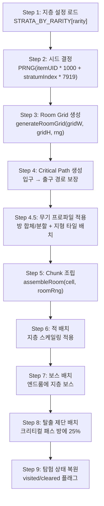

# 아이템계 기억의 지층 생성 시스템 (Item World Memory Strata Generation System)

## 0. 필수 참고 자료 (Mandatory References)

* Project Definition: `Documents/Terms/Project_Vision_Abyss.md`
* 월드 절차적 생성: `Documents/System/System_World_ProcGen.md` (SYS-WLD-05)
* 아이템 레어리티: `Documents/System/System_Equipment_Rarity.md`
* 내러티브 & 세계관: `Documents/Design/Design_Narrative_Worldbuilding.md` (D-12)
* 지층 설정 코드: `game/src/data/StrataConfig.ts` (SSoT)
* 이노센트 시스템: `Documents/System/System_Innocent_Core.md` (Phase 2)

---

## 구현 현황 (Implementation Status)

> **최근 업데이트:** 2026-03-29
> **문서 상태:** `작성 중 (Draft)`
> **3-Space:** Item World
> **기둥:** 야리코미

| 기능 ID       | 분류   | 기능명 (Feature Name)                   | 우선순위 | 구현 상태  | 비고 (Notes)                    |
| :------------ | :----- | :-------------------------------------- | :------: | :--------- | :------------------------------ |
| IWF-01-A      | 시스템 | 시드 기반 지층 생성 파이프라인          |    P1    | ✅ 구현    | StrataConfig + PRNG 기반        |
| IWF-02-A      | 시스템 | 지층별 Room Grid 레이아웃 생성         |    P1    | ✅ 구현    | 4×4 고정, 통합 수직 연결        |
| IWF-03-A      | 시스템 | Critical Path 알고리즘                  |    P1    | ✅ 구현    | 입구 → 출구 경로 보장           |
| IWF-04-A      | 시스템 | Chunk 조립 시스템                       |    P1    | ✅ 구현    | ChunkAssembler 재사용           |
| IWF-05-A      | 시스템 | 적 배치 및 지층별 난이도 스케일링      |    P1    | ✅ 구현    | StratumDef 기반 HP/ATK 배율    |
| IWF-06-A      | 시스템 | 탈출 제단 (Escape Altar)               |    P1    | ✅ 구현    | 안전 귀환 + 진행 보존           |
| IWF-07-A      | 시스템 | 지층별 보스 (기억의 문)                |    P1    | ✅ 구현    | 보스 처치 → 다음 지층 해금      |
| IWF-08-A      | 시스템 | 탐험 상태 영속 (ItemWorldProgress)     |    P1    | ✅ 구현    | visited/cleared/deepestUnlocked |
| IWF-09-A      | 시스템 | 이노센트 배치                           |    P2    | ⬜ 제작 필요 | 야생 이노센트                  |
| IWF-10-A      | 시스템 | 멀티플레이 스케일링                     |    P1    | ⬜ 제작 필요 | 1~4인 체력 보정                |
| ~~IWF-11-A~~ | ~~시스템~~ | ~~DEPRECATED. 재귀 진입 시드 충돌 방지~~ | ~~—~~ | ~~❌ DEPRECATED~~ | ~~재귀적 중첩 진입 삭제~~ |
| IWF-12-A      | 시스템 | 심연 (Abyss) — Ancient 최심층          |    P2    | ⬜ 제작 필요 | 무한 + 닻(Anchor) 시스템       |
| IWF-13-A      | 시스템 | 현실 침식 시각 효과 (Reality Erosion)  |    P2    | ⬜ 제작 필요 | 지층 깊이별 환경 왜곡          |
| IWF-14-A      | 시스템 | 미스터리 룸 / 이벤트                   |    P2    | ⬜ 제작 필요 | 특수 이벤트 방                 |
| IWF-15-A      | 지형   | 얼음 타일 (ID 4)                       |    P1    | ⬜ 제작 필요 | 마찰 ×0.2, 넉백 ×2            |
| IWF-15-B      | 지형   | 가시 타일 (ID 5)                       |    P1    | ⬜ 제작 필요 | HP 10% 고정 피해, 위 넉백      |
| IWF-15-C      | 지형   | 부서지는 바닥 (ID 9)                   |    P1    | ⬜ 제작 필요 | 0.5초 후 붕괴, 5초 재생        |
| IWF-16-A      | 지형   | 거미줄 타일 (ID 6)                     |    P2    | ⬜ 제작 필요 | 속도 ×0.3, 화염 소각           |
| IWF-16-B      | 지형   | 상승 기류 타일 (ID 7)                  |    P2    | ⬜ 제작 필요 | vy -150 지속, 투사체 편향       |
| IWF-16-C      | 지형   | 어둠 타일 (ID 8)                       |    P2    | ⬜ 제작 필요 | 시야 2타일 제한, 스파크 조명    |
| IWF-17-A      | 프로파일 | 무기별 공간 프로파일 적용              |    P1    | ⬜ 제작 필요 | 방 합체/분할 + 지형 배치       |
| IWF-17-B      | 프로파일 | 테마별 지형 배치 규칙                  |    P1    | ⬜ 제작 필요 | T-코드별 지형 확률 테이블       |
| IWF-18-A      | 원소×지형 | 타일 변환 (화/빙/뇌)                 |    P1    | ⬜ 제작 필요 | 화+거미줄, 화/빙+물, 빙+부서지는 바닥 등 |
| IWF-18-B      | 원소×지형 | flood-fill 감전 확산 (뇌+물/얼음)    |    P1    | ⬜ 제작 필요 | BFS, 최대 64타일 상한, 2초 감전 구역 |
| IWF-18-C      | 원소×지형 | 지형 강화 효과 (빙+가시, 화/뇌+기류)  |    P2    | ⬜ 제작 필요 | 상태이상 추가 조건 분기 처리    |
| IWF-19-A      | 지형     | 함몰 가시 (ID 10)                     |    P1    | ⬜ 제작 필요 | 주기적 on/off + 빙 동결 고정   |
| IWF-19-B      | 지형     | 화염 분출기 (ID 11)                   |    P1    | ⬜ 제작 필요 | 주기 분출 + 빙 정지 |
| IWF-19-C      | 지형     | 사라지는 발판 (ID 12)                 |    P1    | ⬜ 제작 필요 | 2초 소멸/3초 재생 + 빙 동결 유지 |
| IWF-19-D      | 지형     | 용암 (ID 13)                          |    P2    | ⬜ 제작 필요 | HP 20% 피해 + 빙 표면 동결 3초 |
| IWF-19-E      | 지형     | 산성 (ID 14)                          |    P2    | ⬜ 제작 필요 | HP 15% + 독 + 뇌 감전 확산(전해질) |
| IWF-19-F      | 지형     | 압력판 (ID 15)                        |    P1    | ⬜ 제작 필요 | 함정 연결 트리거 (1회/반복)    |

---

## 1. 개요 (Concept)

### 1.1. 설계 의도 (Intent)

아이템계(Item World)는 장비 아이템 내부에 존재하는 **기억의 지층(Memory Strata)** 구조의 절차적 던전이다. 인셉션의 "꿈 속의 꿈" 구조에서 영감을 받아, 각 지층은 아이템의 기억이 더 깊어지는 독립된 미니 메트로베니아 맵이다.

> **"아이템의 기억 속으로 다이빙한다. 깊이 들어갈수록 기억은 원초적이 되고, 세계는 더 적대적으로 변한다."**

기존 디스가이아의 "100층 선형 구조"를 대체하는 이유:

| 문제 (100층) | 해법 (기억의 지층) |
| :--- | :--- |
| 선형 반복이 메트로베니아의 비선형 탐험과 충돌 | 각 지층이 비선형 Room Grid — 분기, 비밀방, 루프 |
| 플랫포머에서 "층"이라는 단위가 부자연스러움 | "지층"은 공간의 깊이를 구조적으로 표현 |
| 100개 맵 순차 클리어는 지루함 | 2~4개 지층, 각각이 밀도 있는 탐험 |
| 세션 길이 강제 | 짧은 세션(지층 1 탐험)부터 긴 세션(전 지층 관통)까지 자유 |

### 1.2. 설계 근거 (Reasoning)

| 레퍼런스 | 차용 요소 | Project Abyss 적용 |
| :------- | :-------- | :------------------ |
| 인셉션 (영화) | 꿈의 층위, 시간 팽창, 림보, 킥, 투영체 | 지층 구조, 깊이별 맵 확장, 심연(Abyss), 탈출 제단, 적대도 상승 |
| 디스가이아 시리즈 | 아이템계, 레어리티별 깊이, 이노센트 | 레어리티별 지층 수, 아이템 성장, 이노센트(Phase 2) |
| 할로우 나이트 | 비선형 연결 맵, 깊이 표현 | 각 지층 내 비선형 Room Grid |
| 스펠렁키 | Room Grid + Critical Path + Chunk 조립 | Room Grid 기반 레이아웃 + Critical Path 보장 + Chunk 풀 조립 |
| 에르다의 기억의 두드림 (Echo Strike) | 타격 방식이 시드를 결정 | 에르다가 모루/제단에 Echo를 내려치는 강도와 리듬이 PRNG 시드의 초기값에 영향을 준다. 같은 아이템이라도 에르다가 두드리는 방식에 따라 깨어나는 기억이 달라진다 |

### 1.3. 3대 기둥 정렬

| 기둥 | 기억의 지층에서의 구현 |
| :--- | :--- |
| 메트로베니아 탐험 | 각 지층이 비선형 미니 메트로베니아. 분기 탐험, 비밀방, 되돌아가기 |
| 아이템계 야리코미 | 레어리티 = 지층 수 = 깊이. 여러 번 진입하며 점진적 확장. 무한 파밍 동기 |
| 온라인 멀티플레이 | 깊은 지층은 파티 협동. 탈출 제단 위치 공유. 지층 보스 역할 분담 |

---

## 2. 메커닉 (Mechanics)

### 2.1. 기억의 지층 구조 (Memory Strata Structure)

```
현실 (월드)
  │
  ▼ [아이템계 진입 — "다이빙"]
  │
  ╔══════════════════════════════════════╗
  ║  지층 1: 표층 기억 (Surface Memory)  ║
  ║  ─ 아이템의 가장 최근 기억           ║
  ║  ─ 안정적, 현실에 가까운 환경        ║
  ║  ─ 4×4 Room Grid (표준 16방)        ║
  ╠══════════════════════════════════════╣
  ║      ▼ 보스: 기억의 문 (Gate) ▼     ║
  ╠══════════════════════════════════════╣
  ║  지층 2: 깊은 기억 (Deep Memory)     ║
  ║  ─ 아이템의 핵심 사건                ║
  ║  ─ 환경에 변화 시작 (어둡고 불안정)  ║
  ║  ─ 4×4 Room Grid (구조 변형 시작)   ║
  ╠══════════════════════════════════════╣
  ║      ▼ 보스: 기억의 문 (Gate) ▼     ║
  ╠══════════════════════════════════════╣
  ║  지층 3+: 원초 기억 (Primal Memory)  ║
  ║  ─ 아이템이 만들어진 순간의 기억     ║
  ║  ─ 4×4 Room Grid (심연 침식 변형)   ║
  ╠══════════════════════════════════════╣
  ║      ▼ 최종 보스: 기억의 핵 ▼       ║
  ╠══════════════════════════════════════╣
  ║  ??? 심연 (Abyss) — Ancient 전용    ║
  ║  ─ Phase 2 구현                      ║
  ╚══════════════════════════════════════╝
```

### 2.2. 레어리티별 지층 구성 (Strata by Rarity)

> SSoT: `game/src/data/StrataConfig.ts`

**Grid 크기:** 모든 지층 4×4 고정 (16셀). 레어리티 차이는 **지층 수**로 표현한다.

| 레어리티 | 지층 수 | Grid 크기 | 보스 수 | EXP 배율 (지층별) | 심연 |
| :--- | :---: | :--- | :---: | :--- | :---: |
| Normal | 2 | 4×4 → 4×4 | 1 + 핵 | 1.0x → 1.5x | ✕ |
| Magic | 3 | 4×4 → 4×4 → 4×4 | 2 + 핵 | 1.0x → 1.5x → 2.0x | ✕ |
| Rare | 3 | 4×4 → 4×4 → 4×4 | 2 + 핵 | 1.0x → 1.5x → 2.5x | ✕ |
| Legendary | 4 | 4×4 → 4×4 → 4×4 → 4×4 | 3 + 핵 | 1.0x → 1.5x → 2.5x → 3.5x | ✕ |
| Ancient | 4+심연 | 4×4 → 4×4 → 4×4 → 4×4 + ∞ | 3 + 핵 + 심연 보스 | 1.0x → 1.5x → 2.5x → 3.5x | ✔ |

**4×4 고정 채택 근거:**
- 3×3(9방)은 탐험 선택지 부족, 5×5(25방)은 횡스크롤에서 지루함 유발
- 16방은 지층당 10~15분 세션에 최적 (플레이어 시간 예측 가능)
- Grid 크기 1종으로 생성/밸런싱/테스트 비용 1/3로 절감
- **깊어지는 느낌은 Grid 크기가 아니라 내부 변화로 표현** (§2.2.1 참조)

#### 2.2.1. 지층 깊이별 내부 변화 (Grid 고정, 콘텐츠 변화)

같은 4×4 Grid지만 지층이 깊어질수록 내부가 변한다:

| 지층 | 조명 | 적 밀도 | 환경 변화 | 방 구조 | 느낌 |
| :--- | :--- | :--- | :--- | :--- | :--- |
| 지층 1 | 밝음 | 낮음 (방당 1~2) | 안정적 | 표준 방 16개 | 편안한 탐색 |
| 지층 2 | 어두워짐 | 보통 (방당 2~3) | 함정 등장, 색조 변화 | 일부 방 연결 변형 | 긴장 시작 |
| 지층 3 | 어둡고 불안정 | 높음 (방당 3~4) | 환경 왜곡, 벽 균열 | 분기 증가, 막다른 길 | 미로 속으로 |
| 지층 4 | 심연 침식 | 매우 높음 | 바닥 붕괴, 심연 파티클 | 방 합체/변형 | 세계가 무너짐 |

#### 2.2.2. 폐소↔광장 리듬 패턴 (Claustro-Agora Rhythm) — BLAME! 오마주

> **리서치:** `Research/BLAME_Biomega_WorldDesign_Research.md`, `Research/LevelDesign_ProgressionShape_Research.md`
> BLAME!의 핵심 시각 테크닉은 좁은 터널→거대한 보이드(void)의 극단적 대비. 이 리듬을 4×4 Room Grid 안에서 구현한다.

**원칙:** 같은 4×4 Grid(16셀)지만, 셀 내부의 **천장 높이, 방 폭, 시야 범위**를 극단적으로 대비시켜 "숨 막힘 → 경외 → 숨 막힘" 리듬을 만든다. 방의 "셀 수"가 아닌 **방 내부의 공간감**으로 표현한다.

##### 방 크기 유형 (Room Scale Types)

| 유형 | 코드 | 천장 높이 (타일) | 방 폭 (타일) | 감정 | BLAME! 대응 |
| :--- | :--- | :---: | :---: | :--- | :--- |
| **Crawl (극협)** | `S` | 3~4 | 10~15 | 질식, 긴장 | 파이프 사이 통로 |
| **Standard (표준)** | `M` | 6~7 | 20 | 보통, 전투 적합 | 일반 복도 |
| **Tall (고천장)** | `T` | 12~14 | 20 | 수직 감각, 상승감 | 수직 갱도 |
| **Void (보이드)** | `V` | 14~20 | 30~40 | 경외, 왜소감 | 거대 공동(空洞) |

> **Void 방의 핵심:** 배경 패럴랙스가 5~7레이어로 확장되어 끝없는 깊이를 시사. 캐릭터가 화면의 극히 작은 부분만 차지. 먼 배경에 빌더(유사 존재)의 실루엣이 무언가를 건설하는 모습이 보임.

##### 4×4 Grid 내 리듬 패턴

**패턴 A: "터널 → 보이드 → 터널" (기본 리듬)**

가장 기본적인 BLAME! 리듬. Critical Path를 따라 좁은→넓은→좁은이 교차.

```
4×4 Grid (각 셀의 Scale Type)
┌────┬────┬────┬────┐
│ M  │ S  │ M  │ M  │  Row 0
├────┼────┼────┼────┤
│ S  │ V  │ V  │ S  │  Row 1 — 중앙에 Void 합체
├────┼────┼────┼────┤
│ M  │ S  │ M  │ T  │  Row 2
├────┼────┼────┼────┤
│ M  │ M  │ S  │ M  │  Row 3
└────┴────┴────┴────┘

Critical Path 예:
(0,0)M → (1,0)S[좁아진다] → (1,1)V[탁 트인다!] → (1,2)S[다시 좁아진다] → (2,2)M → (3,2)T[위로!] → (3,3)M → Boss
```

**패턴 B: "점진적 압축 → 폭발적 해방" (Funnel→Void)**

지층 입구에서 보스방까지 점점 좁아지다가, 보스 직전에 거대 보이드가 열림.

```
┌────┬────┬────┬────┐
│ M  │ M  │ M  │ M  │  Row 0 — 표준 시작
├────┼────┼────┼────┤
│ S  │ M  │ S  │ M  │  Row 1 — 좁아지기 시작
├────┼────┼────┼────┤
│ S  │ S  │ S  │ S  │  Row 2 — 극협 구간 (질식감 최대)
├────┼────┼────┼────┤
│ V  │ V  │ V  │ T  │  Row 3 — 보이드 폭발 + 보스 아레나
└────┴────┴────┴────┘

감정 곡선: 편안 → 불안 → 질식 → 경외(보스)
```

**패턴 C: "수직 관통" (Shaft 리듬)**

BLAME!의 수직 이동을 강조. Tall 방이 수직 축을 형성.

```
┌────┬────┬────┬────┐
│ M  │ M  │ T  │ S  │  Row 0
├────┼────┼────┼────┤
│ S  │ M  │ T  │ M  │  Row 1 — T 방이 수직 연결
├────┼────┼────┼────┤
│ M  │ S  │ T  │ S  │  Row 2
├────┼────┼────┼────┤
│ M  │ M  │ V  │ M  │  Row 3 — 수직 하강 끝에 Void
└────┴────┴────┴────┘

T 방 3개가 세로로 이어져 "끝없이 내려가는 갱도" 연출.
마지막에 Void로 터지면서 "바닥에 도달" 감각.
```

**패턴 D: "산재형 보이드" (Deep/Core 지층용)**

깊은 지층에서 사용. 보이드가 여러 개 흩어져 방향 감각 상실.

```
┌────┬────┬────┬────┐
│ V  │ S  │ M  │ S  │  Row 0
├────┼────┼────┼────┤
│ S  │ S  │ S  │ V  │  Row 1
├────┼────┼────┼────┤
│ M  │ V  │ S  │ S  │  Row 2
├────┼────┼────┼────┤
│ S  │ S  │ M  │ V  │  Row 3
└────┴────┴────┴────┘

Void 4개가 대각선으로 산재. S 방이 사이를 연결.
"여기가 어딘지 모르겠다" — BLAME!의 지층 간 구별 불가능 재현.
```

##### 지층 깊이별 리듬 배분

| 지층 깊이 | 주 패턴 | S/M/T/V 비율 | 감정 목표 |
| :--- | :--- | :--- | :--- |
| **Surface (지층 1)** | 패턴 A (기본 리듬) | S:2 M:11 T:1 V:2 | 편안한 탐험 + 가끔 경외 |
| **Mid (지층 2~3)** | 패턴 B (Funnel→Void) | S:5 M:6 T:2 V:3 | 점진적 압박 → 해방 |
| **Deep (지층 3~4)** | 패턴 C (수직 관통) | S:4 M:4 T:5 V:3 | 수직 낙하의 불안, 깊이감 |
| **Core (최심층)** | 패턴 D (산재형) | S:8 M:2 T:2 V:4 | 방향 상실, 고독, 압도 |

> **Core 패턴의 핵심:** BLAME!에서 "광활한 공허가 너무 흔해져 지층 간 구별이 불가능"해지는 감각. Crawl 방이 지배적이되, Void가 불규칙하게 터져 "여기가 어디인가?" 불안을 극대화.

##### Void 방의 시각 연출

Void 방 진입 시 특수 연출:

| 요소 | 연출 |
| :--- | :--- |
| **카메라** | 진입 시 0.5초에 걸쳐 줌아웃 (×0.7). 캐릭터가 화면의 10~15%만 차지 |
| **패럴랙스** | 배경 레이어 5→7개로 증가. 최후방 레이어에 거대 기둥/파이프의 실루엣 |
| **조명** | 캐릭터 주변만 밝고, 방의 경계는 어둠 속에 사라짐 (끝이 보이지 않는 느낌) |
| **오디오** | 리버브 급증 (에코 길이 ×3). 발소리가 끝없이 울려퍼짐 |
| **배경 동작** | 먼 배경에서 무언가(빌더 유사체)가 천천히 이동하는 실루엣 |

##### Crawl 방의 시각 연출

Crawl 방 진입 시:

| 요소 | 연출 |
| :--- | :--- |
| **카메라** | 줌인 (×1.2). 천장이 화면 상단에 닿아 압박감 |
| **패럴랙스** | 배경 레이어 5→2개로 감소. "뒤가 없다" 느낌 |
| **조명** | 전체적으로 어둡고 좁은 빛만. 파이프/기계 사이로 빛 새어듬 |
| **오디오** | 리버브 최소. 기계 진동음. 금속 삐걱거림 |
| **장애물** | 파이프, 케이블, 부서진 기계가 이동 경로를 방해 (회피/점프 필요) |

##### 무기 프로파일과의 결합

무기 카테고리(§2.2.3)의 합체/분할 규칙은 리듬 패턴 위에 적용된다:

| 무기 | 리듬 변형 | 효과 |
| :--- | :--- | :--- |
| 대검 | V 방을 더 크게 합체 (2×2→3×2) | "전장의 보이드" — 더 극단적 광장공포 |
| 단검 | S 방을 더 좁게 분할 | "미로의 극협" — 더 극단적 폐소공포 |
| 창 | M/S를 횡장으로 변환 | "긴 복도" — BLAME!의 1피트마다 문이 있는 복도 |
| 지팡이 | T 방의 높이를 극대화 | "마탑 수직 갱도" — 끝없는 상승감 |
| 활 | V 방에 고저차 지형 추가 | "사냥터 보이드" — 높은 곳에서 내려다보는 왜소감 |

#### 2.2.3. 무기 카테고리별 공간 프로파일 (Weapon Spatial Profile)

4×4 Grid는 고정하되, **무기 카테고리에 따라 방의 형태와 배치가 달라진다.** 이것이 "아이템의 기억이 다른 공간 경험을 만든다"의 핵심 메커니즘이다.

4×4의 16셀은 **합체(Merge)와 분할(Split)**이 가능하다:
- 합체: 인접 셀 2~4개를 합쳐 큰 방 1개로 (대검, 활)
- 분할: 셀 1개를 내부 벽으로 나눠 좁은 방 2~3개로 (단검)
- 표준: 셀 = 방 1:1 (검)

| 무기 카테고리 | 실제 방 수 | 방 비율 | 천장 높이 | 특수 구조 | 공간 성격 | 에르다의 체감 |
| :--- | :---: | :--- | :--- | :--- | :--- | :--- |
| 검 (Sword) | 16 (표준) | 1:1 정방 | 보통 | 없음 | 균형 잡힌 탐험 | "잘 설계된 작업장이네. 동선이 막히질 않아." |
| 대검 (Greatsword) | 6~8 (합체) | 2:1 넓음 | 높음 | 넓은 전장, 소수 강적 | 전장 — 느린 진행, 무거운 타격 | "넓다. 대형 용광로급 공간. 발걸음 소리가 울려." |
| 단검 (Dagger) | 20~24 (분할) | 1:2 좁고 긴 | 낮음 | 좁은 틈새, 막다른 길 | 미로 — 빠른 이동, 급습 | "좁은데 환기는 좋다. 소형 공방 같아." |
| 활 (Bow) | 8~10 (합체) | 2:1 넓음 | 매우 높음 | 고저차 지형, 엄폐물 | 사냥터 — 높은 곳을 잡는 전투 | "천장이 엄청 높아. 이 아이템, 야외 기억을 갖고 있네." |
| 지팡이 (Staff) | 16 (표준) | 불규칙 | 높음 | 부유 플랫폼, 수직 구조 | 마탑 — 위로 오르는 탐험 | "수직 구조물인데... 이거 지지 구조가 말이 안 되잖아." |

**설계 원칙:**
> "같은 4×4 Grid, 같은 T-HOME 테마의 부엌이라도, 검의 부엌과 단검의 부엌은 **걷는 경험이 다르다.** 검의 부엌은 넉넉한 조리대 사이를 걷지만, 단검의 부엌은 좁은 선반 틈새를 뛰어다닌다."

**무기별 전투 인카운터 배치:**

| 무기 | 적 배치 | 인카운터 리듬 | 보스 아레나 |
| :--- | :--- | :--- | :--- |
| 검 | 분산 3~4마리 | 균일 간격 | 표준 방 |
| 대검 | 한 번에 5~7 밀려옴 | 파도(wave) | 합체 대형 아레나 |
| 단검 | 코너 뒤 2~3 밀집 | 급습→급해결 | 좁은 복도 연속 보스 |
| 활 | 여러 높이 4~6 산개 | 고지 점령전 | 넓고 높은 사냥터 |
| 지팡이 | 높은 곳 2~3 강적 | 퍼즐+전투 혼합 | 수직 타워 |

#### 2.2.3. 지형 타일 시스템 (Terrain Tile System)

방 내부의 지형 타일이 이동과 전투 경험을 근본적으로 변화시킨다. 모든 지형은 월드와 아이템계 양쪽에서 사용 가능하다.

**타일 ID 체계:**

> SSoT: `game/src/core/Physics.ts`

| ID | 이름 | 이동 효과 | 전투 효과 | 구현 |
| :---: | :--- | :--- | :--- | :---: |
| 0 | **빈 공간** | 자유 이동 | 표준 | ✅ |
| 1 | **솔리드** | 이동 불가 | 넉백 벽 충돌 정지 | ✅ |
| 2 | **물 (Water)** | 속도 ×0.5, 중력 ×0.3, 부유 느낌 | (미정의 — P2) | ✅ |
| 3 | **원웨이 플랫폼** | 위에서 착지, 아래서 통과 | 표준 | ✅ |
| 4 | **얼음 (Ice)** | 마찰 ×0.2, 관성 이동. 감속 극도로 느림 | 넉백 거리 ×2 (적·플레이어 양쪽) | P1 |
| 5 | **가시 (Spike)** | 접촉 시 고정 피해 (최대 HP `SPIKE_DAMAGE_PERCENT`%) + 위로 약 넉백 | 적도 동일 피해. 넉백으로 적을 밀어넣기 가능 | P1 |
| 6 | **거미줄 (Web)** | 속도 ×0.3, 점프 ×0.5. 공중 진입 시 느린 낙하 | 적도 동일 감속. 화염 공격으로 일시 소각(→ID 0, 10초 후 재생) 가능. **진행 차단 없음** | P2 |
| 7 | **상승 기류 (Updraft)** | vy에 -150 지속 추가. 점프 없이 상승 | 적 투사체 궤도 상향 편향. 공중 체공 시간 증가 | P2 |
| 8 | **어둠 (Darkness)** | 물리 = 빈 공간과 동일. 시야 반경 2타일로 제한 | 적 텔레그래프 안 보임. 히트 스파크(L9)가 순간 조명 역할 | P2 |
| 9 | **부서지는 바닥 (Crumble)** | 밟으면 0.5초 후 ID 0으로 변환(재생 5초) | 대검 충격파로 즉시 파괴. 적도 함께 추락 | P1 |
| 10 | **함몰 가시 (Retractable Spike)** | 주기적으로 돌출/함몰 반복. 돌출 시 ID 5와 동일 피해 | 타이밍 기반 통과. 빙(Ice) 공격 시 돌출 고정 | P1 |
| 11 | **화염 분출기 (Flame Jet)** | 벽/바닥에서 주기적으로 화염 분출. 접촉 시 화상(Burn) | 분출 주기 사이로 통과. 빙(Ice)으로 일시 정지(3초) | P1 |
| 12 | **사라지는 발판 (Vanishing Platform)** | 밟으면 2초 후 소멸, 3초 후 재생. 원웨이처럼 위에서만 착지 | 연속 배치 시 리듬 기반 이동 강제. 빙(Ice)으로 동결 시 영구 유지 | P1 |
| 13 | **용암 (Lava)** | 접촉 시 최대 HP `LAVA_DAMAGE_PERCENT`% 고정 피해 + 화상(Burn). 물처럼 채워진 구역 | 빙(Ice)으로 표면만 동결 → 얼음(ID 4) 위를 걸을 수 있음 (`LAVA_FREEZE_MS`ms 유지 후 재용해) | P2 |
| 14 | **산성 (Acid)** | 접촉 시 최대 HP `ACID_DAMAGE_PERCENT`% 고정 피해 + 독(Poison) `ACID_POISON_SEC`초. 물처럼 채워진 구역 | 빙(Ice)으로 동결 불가 (산성은 어는점이 낮다) | P2 |
| 15 | **압력판 (Pressure Plate)** | 밟으면 연결된 함정 작동 (화살 발사, 가시 돌출, 바닥 붕괴 등) | 시각 단서(색 다른 타일)로 인지. 적/투척물로 대신 기폭 가능. 1회/반복 두 유형 | P1 |

**지형별 상세 규칙:**

**ID 4 — 얼음:**
- `friction = 0.2` (표준 `1.0`). 가속·감속 모두 적용
- 넉백 벡터에 `×2.0` 배율. 적을 벽까지 밀 수 있음
- 적 AI: 얼음 위에서 이동 패턴 불안정 (미끄러짐 시뮬레이션)
- 시각: 반투명 하늘색 타일, 위를 지나갈 때 미끄러지는 파티클

**ID 5 — 가시:**
- 접촉 판정: 엔티티 하단이 가시 타일 상단과 겹칠 때
- 피해: `max(1, maxHP × SPIKE_DAMAGE_PERCENT/100)` 고정. 방어력 무시
- 무적 시간: 피격 후 `SPIKE_INVULN_MS`ms (연속 피해 방지)
- 넉백: vy = -120 (위로 튕김). 가시에서 탈출하는 느낌
- 적용: 솔리드 위에 배치 (바닥 가시) 또는 천장에 배치 (천장 가시)

**ID 6 — 거미줄:**
- 진입 즉시 `speedMult = 0.3`, `jumpMult = 0.5`
- 공중에서 진입 시 `gravity × 0.15` (매우 느린 낙하 = 낙사 방지)
- 화염/뇌 속성 공격 접촉 시 일시 소각: 타일 ID → 0, 불꽃 파티클 재생
- `web_regen_ms: 10000` — 소각 10초 후 자동 재생 (타일 ID → 6 복원)
- **설계 의도:** 거미줄은 진행 차단 타일이 아니라 감속 타일이다. 원소 공격 없이도 느리게나마 통과할 수 있다. 원소 소각은 편의 수단이지 필수 수단이 아니다.

**ID 7 — 상승 기류:**
- 타일 영역 내 모든 엔티티에 `vy += -150 × dt` 지속 적용
- 점프 입력과 중첩 시 `vy` 합산 (매우 높이 뜀)
- 투사체도 영향받음: 화살, 마법 탄환의 궤도 상향 편향
- 시각: 아래→위 방향 파티클 스트림, 투명 타일

**ID 8 — 어둠:**
- 물리 효과 없음. 순수 시각 효과
- 어둠 타일 영역 진입 시 렌더링 마스크 활성화: 플레이어 중심 반경 32px(2타일)만 표시
- 히트 스파크(SYS-CMB-07 L9)가 발생하면 반경 48px 순간 밝아짐 (200ms)
- 적 피격 플래시(L11)도 순간 조명 역할
- 적의 공격 예비 동작(Tell)이 시야 밖이면 표시 안 됨 → SFX(L14 피격 반응)로만 인지

**ID 9 — 부서지는 바닥:**
- 밟는 순간 흔들림 시작 (시각 피드백 0.5초)
- 0.5초 후 타일 ID → 0 + 파편 파티클 낙하
- 5초 후 재생 (타일 ID → 9 복원, 서서히 나타남)
- 대검 카테고리 무기의 충격파(2타 시그니처): 접촉 즉시 파괴 (0.5초 대기 없음)
- 적은 부서지는 바닥을 인식하지 못함 (의도적 — 전략적 함정 유도)

**ID 10 — 함몰 가시 (Retractable Spike):**
- 주기: `retract_cycle_ms: 2000` (1초 돌출, 1초 함몰)
- 돌출 상태: ID 5(가시)와 동일한 피해 판정 (`SPIKE_DAMAGE_PERCENT`% HP 고정, 방어 무시)
- 함몰 상태: ID 0(빈 공간)과 동일. 안전하게 통과 가능
- 시각: 돌출 0.2초 전에 빛남 (텔레그래프). 함몰 시 바닥으로 들어감
- 원소 상호작용: 빙(Ice) 공격 시 **현재 상태에서 동결 고정** (돌출 중 빙결 → 영구 가시, 함몰 중 빙결 → 영구 안전)
- 화(Fire) 공격 시 주기 가속 (cycle ×0.5 = 1초 → 더 위험)

**ID 11 — 화염 분출기 (Flame Jet):**
- 배치: 벽면 또는 바닥에 고정. 분출 방향은 배치에 따라 수평/수직
- 주기: `jet_on_ms: 800, jet_off_ms: 1200` (0.8초 분출, 1.2초 정지)
- 분출 중 접촉: 화상(Burn) 상태이상 즉시 적용 + 최대 HP `FLAME_JET_DAMAGE_PERCENT`% 피해
- 분출 범위: 분출기에서 3타일 직선
- 시각: 정지 중 분출구에서 연기 파티클 (텔레그래프). 분출 시 화염 스프라이트
- 원소 상호작용:
  - 빙(Ice): 분출기 **일시 정지 3초** (내부 연료 동결). 3초 후 자동 재개
  - 화(Fire): 분출 강화 — 범위 3타일 → 5타일 (10초 유지)
- 연쇄: 화염 분출이 거미줄(ID 6)에 닿으면 소각 → ID 0 (자동 연쇄)
- 압력판(ID 15) 연결 가능: 밟으면 분출기 작동/정지 토글

**ID 12 — 사라지는 발판 (Vanishing Platform):**
- 원웨이(ID 3)의 동적 변형. 위에서만 착지 가능
- 밟는 순간 타이머 시작: `vanish_delay_ms: 2000` (2초 후 소멸)
- 소멸 전 텔레그래프: 마지막 0.5초간 깜빡임
- 재생: `regen_delay_ms: 3000` (3초 후 복원. 서서히 나타남)
- 연속 배치 시: Celeste Ch.7 연쇄 붕괴와 유사한 리듬 플랫포밍 구현
- 원소 상호작용:
  - 빙(Ice): **동결 → 영구 유지** (녹을 때까지 사라지지 않음). 화(Fire)로 해빙 시 다시 2초 타이머 시작
  - 화(Fire): **즉시 소멸** (타이머 무시)

**ID 13 — 용암 (Lava):**
- 물(ID 2)과 동일한 액체 구역 형태. 중력 ×0.3 미적용 (용암은 밀도가 높아 빠르게 가라앉음)
- 접촉 피해: `max(1, maxHP × LAVA_DAMAGE_PERCENT/100)` 고정. 방어력 무시
- 접촉 시 화상(Burn) 상태이상 즉시 부여 (`ACID_POISON_SEC`초)
- 무적 시간: `LAVA_INVULN_MS`ms (가시보다 짧음 — 더 위험)
- 시각: 붉은 주황색 액체. 표면에서 기포 파티클
- 원소 상호작용:
  - 빙(Ice): **표면만 동결 → ID 4(얼음) 위를 걸을 수 있음.** `freeze_duration_ms: 3000` (3초 후 재용해 → 위에 있으면 용암 추락). 이것이 용암 구역 횡단의 핵심 전략
  - 뇌(Thunder): 효과 없음 (용암은 전도체가 아님 — 이온화 미발생)
  - 화(Fire): 효과 없음 (이미 화염 상태)

**ID 14 — 산성 (Acid):**
- 물(ID 2)과 동일한 액체 구역 형태. 중력 ×0.3 적용 (산성 액체에서 부유)
- 접촉 피해: `max(1, maxHP × ACID_DAMAGE_PERCENT/100)` 고정. 방어력 무시
- 접촉 시 독(Poison) 상태이상 부여 (`ACID_POISON_SEC`초, HP `ACID_POISON_DPS_PERCENT`%/초 지속 피해)
- 무적 시간: `ACID_INVULN_MS`ms
- 시각: 녹색 불투명 액체. 표면에서 거품 파티클
- 원소 상호작용:
  - 빙(Ice): **동결 불가** (산성은 어는점이 극도로 낮다 — 물리적 직관)
  - 뇌(Thunder): **산성 내 감전 확산** (산성도 전해질 = 도체. flood-fill 적용)
  - 화(Fire): 산성 증기 — 접촉 지점 위 2타일 높이에 독 안개 구역 생성 (5초)

**ID 15 — 압력판 (Pressure Plate):**
- 외형: 바닥 타일과 유사하지만 약간 다른 색상/문양 (시각 단서)
- 작동: 엔티티(플레이어, 적, 투척물)가 위에 올라서면 연결된 함정 작동
- 유형 2가지:
  - `type: "once"` — 1회 작동 후 비활성화 (시각적으로 함몰 상태 유지)
  - `type: "repeat"` — 밟을 때마다 작동. 떼면 정지
- 연결 가능한 함정:

| 연결 대상 | 효과 |
| :--- | :--- |
| 함몰 가시 (ID 10) | 즉시 돌출 (주기 무시) |
| 화염 분출기 (ID 11) | 분출 시작/정지 토글 |
| 부서지는 바닥 (ID 9) | 즉시 붕괴 (원격 기폭) |
| 사라지는 발판 (ID 12) | 즉시 소멸 또는 즉시 재생 (토글) |
| 벽 타일 (ID 1) | 열림/닫힘 (이동 벽. 비밀 통로 개폐) |

- 원소 상호작용: 없음 (압력판은 기계 장치. 원소 영향 안 받음)
- 적 활용: 적을 밀어서 압력판 위에 올려놓기 가능 → 함정 역이용
- 투척물: 돌/아이템을 압력판 위에 던져서 미리 기폭 가능
- 연쇄: 압력판 → 화염 분출기 작동 → 거미줄(ID 6) 소각 → 새 경로 (3단계 연쇄)

---

#### 원소 × 지형 상호작용 시스템 (Element × Terrain Interaction System)

> **설계 원칙 (BotW 방식):** 각 원소에 한 문장의 물리 법칙이 있고, 모든 상호작용은 그 법칙에서 도출된다. 플레이어는 법칙을 배우면 결과를 예측할 수 있다.

##### 원소 법칙 (One Physical Law per Element)

| 원소 | 한 문장 법칙 |
| :--- | :--- |
| **화 (Fire)** | 타오른다. 타오른 것은 부서진다. 열은 물을 증발시킨다. |
| **빙 (Ice)** | 얼린다. 얼어붙은 것은 고체가 된다. 얼어붙은 것은 충격에 박살난다. |
| **뇌 (Thunder)** | 도체를 타고 흐른다. 흐르는 전류는 마비시킨다. |

> **암 (Dark) 제외 이유:** 암은 적 속성 상성(System_Combat_Damage.md §2.5) 전용 원소이다. 지형은 물리 법칙에 의해 변화하는 공간이며, 암은 물리 법칙이 아닌 존재론적 속성이다.

##### 원소 획득 규칙 (Elemental Acquisition Rule)

> **핵심 규칙: 원소 공격은 해당 원소 이노센트를 장비에 장착했을 때만 가능하다. 무기 고유 속성으로는 원소 공격이 불가능하다.**

이 규칙이 위의 모든 원소×지형 상호작용에 선행 조건으로 적용된다. 플레이어가 화 속성 공격으로 거미줄을 소각하려면, 장비에 화(火) 이노센트가 장착되어 있어야 한다.

| 원소 이노센트 | 확정 획득 경로 | 비고 |
| :--- | :--- | :--- |
| 화 (Fire) | 수로의 파수꾼 처치 | 복종 상태로 드랍 |
| 빙 (Ice) | 냉동 수호자 처치 | 복종 상태로 드랍 |
| 뇌 (Thunder) | 폭주한 실험체 처치 | 복종 상태로 드랍 |
| 암 (Dark) | 아이템계 랜덤 드랍 | 지형 상호작용 없음. 적 상성 전용 |

**지형 상호작용과 이노센트의 관계:** 모든 원소×지형 상호작용은 편의 수단이며, 원소 없이도 해당 구역을 통과할 수 있다.

---

##### 지형 변환 매트릭스 (Terrain Transformation Matrix)

타일이 **다른 타일로 영구 또는 일시 변환**되는 상호작용. `→` = 변환 대상 ID.

| 지형 \ 원소 | 화 (Fire) | 빙 (Ice) | 뇌 (Thunder) |
| :---------- | :-------- | :-------- | :------------ |
| **물 (2)** | → ID 0 *(증발, 일시 — `water_regen_ms: 8000`)* | → ID 4 *(동결, 일시 — `ice_melt_ms: 15000`)* | — *(변환 없음, 효과 적용)* |
| **얼음 (4)** | → ID 2 *(해빙, 영구)* | — | — *(변환 없음, 효과 적용)* | — |
| **가시 (5)** | — | 얼음 가시로 강화 *(효과 추가, 비변환)* | — | — |
| **거미줄 (6)** | → ID 0 *(소각, 일시 — `web_regen_ms: 10000`)* | → ID 1 유사 *(동결 고화, 영구)* | → ID 0 *(방전 소각, 일시 — `web_regen_ms: 10000`)* |
| **상승 기류 (7)** | 화염 기류로 강화 *(효과 추가, 비변환)* | → ID 1 *(기류 동결 차단, 영구)* | 플라즈마 기류로 강화 *(효과 추가, 비변환)* |
| **어둠 (8)** | — | — | — |
| **부서지는 바닥 (9)** | → ID 0 *(즉시 붕괴, 대기 0초)* | → ID 1 *(동결 고화, 영구)* | — |
| **함몰 가시 (10)** | 주기 가속 *(cycle ×0.5)* | **현재 상태 동결 고정** *(돌출 중→영구 가시, 함몰 중→영구 안전)* | — |
| **화염 분출기 (11)** | 분출 범위 3→5타일 *(10초)* | **일시 정지 3초** *(연료 동결)* | — |
| **사라지는 발판 (12)** | → 즉시 소멸 *(타이머 무시)* | **동결 → 영구 유지** *(화로 해빙 시 타이머 재시작)* | — |
| **용암 (13)** | — *(이미 화염)* | **표면 동결 → ID 4 (3초 유지 후 재용해)** | — *(비도체)* |
| **산성 (14)** | 산성 증기 *(위 2타일 독 안개 5초)* | — *(동결 불가)* | **산성 내 감전 확산** *(flood-fill, 산성=전해질=도체)* |
| **압력판 (15)** | — | — | — |

**변환 설명:**

- **화 + 물(2) → ID 0 (증발, 일시):** 물은 열에 의해 증발한다. 반경 1타일 범위 증기 피해 발생 후 타일 소멸. `water_regen_ms: 8000` — 8초 후 자동 복원. 빠른 이동 경로를 개척하거나 침수 구역을 일시 제거하는 데 사용 가능.
- **화 + 얼음(4) → ID 2 (해빙):** 얼음은 열에 녹아 물이 된다. 연쇄 반응의 핵심 — 뇌 공격과 조합 가능.
- **빙 + 물(2) → ID 4 (동결, 일시):** 물이 얼어 얼음 타일로 변한다. 도체로 변환되므로 뇌와 즉시 연쇄 가능. `ice_melt_ms: 15000` — 15초 후 자동 해빙(→ ID 2 복원).
- **빙 + 거미줄(6) → ID 1 유사 (동결 고화, 영구):** 거미줄이 얼어붙어 딱딱한 격자 구조물이 된다. 이동은 불가하지만 서 있을 수 있는 발판으로 변환. 충격(강공격 등)에 박살나 → ID 0. 유일하게 거미줄 관련 영구 변환이 허용되는 특수 콤보.
- **빙 + 상승 기류(7) → ID 1 (기류 동결 차단):** 기류 통로가 얼어붙어 완전히 막힌다. 수직 이동 경로 차단. 화 공격으로 해빙 가능 (→ ID 7 복원).
- **빙 + 부서지는 바닥(9) → ID 1 (동결 고화):** 약한 구조물이 얼어붙어 오히려 안전한 영구 발판이 된다. 대검 충격파로 즉시 파괴 가능.
- **뇌 + 거미줄(6) → ID 0 (방전 소각, 일시):** 거미줄은 도체는 아니지만, 강한 전류가 불꽃을 일으켜 소각한다. 화 속성과 동일 결과. `web_regen_ms: 10000` — 10초 후 재생.
- **뇌 + 상승 기류(7) → 플라즈마 기류 강화:** 전류가 기류 통로를 따라 흐르며 이온화된 플라즈마 기류를 형성한다. 내부 엔티티에 지속 감전 상태이상 적용.

---

##### 지형 효과 매트릭스 (Terrain Effect Matrix)

타일은 유지되지만 **추가 효과(상태이상·범위 피해·행동 변화)가 부여**되는 상호작용.

| 지형 \ 원소 | 화 (Fire) | 빙 (Ice) | 뇌 (Thunder) |
| :---------- | :-------- | :-------- | :------------ |
| **물 (2)** | — *(변환됨)* | — *(변환됨)* | **감전 확산** — 연결된 모든 물 타일 flood-fill 감전 구역화 (2초, Shock 상태이상) |
| **얼음 (4)** | — *(변환됨)* | — | **감전 확산** — 연결된 모든 얼음 타일 flood-fill 감전 구역화 (얼음은 도체) |
| **가시 (5)** | — | **얼음 가시** — 접촉 시 HP 10% 고정 피해 + 빙결(Freeze) 상태이상 동시 적용 (2초) | — |
| **거미줄 (6)** | — *(변환됨)* | — *(변환됨)* | — *(변환됨)* |
| **상승 기류 (7)** | **화염 기류** — 기류 내 진입 시 화상(Burn) 상태이상 지속 적용. 기류는 유지 | — *(변환됨)* | **플라즈마 기류** — 기류 내 진입 시 감전(Shock) 상태이상 지속 적용 |
| **어둠 (8)** | — | — | — |
| **부서지는 바닥 (9)** | — *(변환됨)* | — *(변환됨)* | — |

**효과 설명:**

- **뇌 + 물(2) 감전 확산 (flood-fill):** 뇌 공격이 물 타일 한 칸에 닿으면, flood-fill 알고리즘으로 연결된 모든 물 타일이 2초간 감전 구역이 된다. 해당 구역에 진입한 모든 엔티티(플레이어 포함)에 즉시 Shock 상태이상 적용. **이것이 이 시스템의 가장 강력한 체인 연출이다.**
- **뇌 + 얼음(4) 감전 확산 (flood-fill):** 얼음은 물과 마찬가지로 도체다. 연결된 얼음 타일 전체가 감전 구역화된다. 빙(Ice)이 물(2)을 얼음(4)으로 변환한 직후 뇌를 사용하면 이전보다 넓은 범위를 감전시킬 수 있다.
- **화 + 상승 기류(7) 화염 기류:** 기류 통로를 불로 채워 통과 자체가 위험해진다. 에너지 보급로 차단 전술. 화 저항 장비를 갖춘 플레이어는 오히려 기류를 방패 삼아 적 접근을 막을 수 있다.
- **빙 + 가시(5) 얼음 가시:** 기존 가시는 물리 고정 피해만 주었으나, 얼음 가시는 빙결 상태이상을 추가한다. 얼음 가시에 적을 밀어넣으면 즉사급 콤보가 성립한다 (대검의 핵심 전략).

---

##### 연쇄 반응 경로 (Chain Reaction Paths)

> 연쇄 반응은 이 시스템의 핵심이다. 각 반응은 "이거 되나?" → "와, 된다!"의 발견 경험을 목표로 한다.

**체인 1 — 용광로 함정 (T-FORGE 특화)**

```
화 공격 → 거미줄(6) 소각 → ID 0 (경로 개통)
                          ↓
                    기존에 막혀있던 상승 기류(7) 활성화
                          ↓
                    화 공격 → 화염 기류(7) 강화
                          ↓
            기류를 통과하는 적에게 화상(Burn) 상태이상 지속
```

거미줄이 기류 위를 막고 있는 구조에서, 화로 거미줄을 소각하면 기류가 열린다. 그러나 그 기류에 다시 화를 쏘면 화염 기류가 되어 적에게 더 위험한 통로가 된다. 함정을 푸는 행동이 새 함정을 만든다.

---

**체인 2 — 번개 홍수 (T-SEA 특화)**

```
빙(Ice) 공격 → 물(2) 전체 → 얼음(4) 변환
                             ↓
              뇌(Thunder) 공격 → flood-fill 감전 확산
                             ↓
            연결된 모든 얼음(4) 타일 2초간 감전 구역화
                             ↓
                  화(Fire) 공격 → 얼음(4) 해빙 → 물(2) 복원
                             ↓
            뇌(Thunder) 재공격 → 다시 flood-fill 감전 확산
```

물이 많은 구역에서 빙 → 뇌 → 화 → 뇌 순서로 반복하면 광역 감전 트랩을 순환 생성할 수 있다. 파티 플레이에서 역할 분담의 핵심 예시.

---

**체인 3 — 얼음 미끄럼틀 덫 (T-NOBLE 특화)**

```
얼음(4) 자연 배치 (마찰 ×0.2)
           ↓
    빙(Ice) 공격 → 가시(5) 얼음 가시 강화
           ↓
적이 얼음 위에 진입 → 넉백으로 얼음 가시에 밀려들어감
           ↓
        HP 10% 고정 피해 + 빙결(Freeze) 1.5초
```

얼음 지형 + 가시 조합으로 엔티티가 통제력을 잃고 함정에 빠진다. 빙 원소의 핵심 체인.

---

**체인 4 — 기억 붕괴 폭포 (T-UNDEAD 특화)**

```
화(Fire) 공격 → 부서지는 바닥(9) 즉시 붕괴 → ID 0
                               ↓
           바닥 아래 물(2) 노출 (T-UNDEAD 기본 배치)
                               ↓
    뇌(Thunder) 공격 → 물(2) flood-fill 감전 확산
                               ↓
    붕괴된 바닥 아래로 추락한 모든 적 즉시 감전(Shock) 적용
```

부서지는 바닥을 화로 미리 제거하면, 그 아래에 숨겨진 물 구역이 드러난다. 적을 가까이 유인하고 뇌를 쏘면 추락 + 감전의 완벽한 처치 콤보가 성립한다.

---

**체인 5 — 증기 폭발 (System_Combat_Damage.md §5.2 연동)**

```
빙(Ice) 공격 → 물(2) 동결 → 얼음(4) 변환
                              ↓
적이 얼음(4) 위에서 빙결(Freeze) 상태 진입
                              ↓
    화(Fire) 공격 → 얼음(4) 해빙 → 물(2) 복원
                              ↓
      빙결 + 화염 = 증기 폭발 (원소 시너지 발동)
                              ↓
            범위 피해 + 빙결 해제 + 반경 2타일 증기 데미지
```

전투 시스템의 원소 시너지(빙결 상태 + 화염 공격 = 증기 폭발)가 지형 변환과 연동된다. 지형을 바꿔 적에게 시너지를 강제로 발동시키는 전략.

---

**체인 6 — 전기 격자 (T-MILITARY 특화)**

```
뇌(Thunder) 공격 → 상승 기류(7) → 플라즈마 기류 강화
                               ↓
적이 기류를 통과하려 할 때 감전(Shock) 상태이상
                               ↓
감전 상태의 적이 물(2) 타일 진입
                               ↓
뇌(Thunder) 재공격 → 물(2) flood-fill 감전 확산
                               ↓
    적이 헤어나올 수 없는 감전 루프 형성
```

수직 기류 통로를 전기 격자로 만들고, 감전된 적이 물에 빠지도록 유도하면 감전이 끊이지 않는 루프 트랩이 완성된다. 고난이도 전략.

---

##### 무기별 원소 × 지형 창발 전략 (Weapon Emergent Strategies)

| 무기 | 원소 | 지형 | 시그니처 전략 |
| :--- | :--- | :--- | :--- |
| **검 (Sword)** | 빙 (Ice) | 얼음(4) + 가시(5) 인접 | 빙으로 가시를 얼음 가시로 강화한 뒤, 보통 넉백으로 적을 가시로 밀어넣는다. 빙결 + 고정 피해 2중 타격. |
| **단검 (Dagger)** | 뇌 (Thunder) | 물(2) | 연사력으로 물 타일 한 곳에 뇌 공격을 먼저 꽂아 flood-fill 감전을 깔고, 감전 구역 안에서 근접 난전을 유도한다. 감전으로 적 속도가 30% 감소하여 단검의 이동 이점이 극대화된다. |
| **대검 (Greatsword)** | 빙 (Ice) | 얼음(4) + 가시(5) | 빙으로 물을 얼린 뒤, 가시를 얼음 가시로 강화한다. 대검 강공격 넉백 ×2로 적을 얼음 가시에 밀어넣어 빙결 + 고정 피해 극단적 콤보. |
| **지팡이 (Staff)** | 빙 → 뇌 연계 | 물(2) | "번개 홍수" 체인 2의 직접 실행자. 지팡이의 원거리 연사로 빙 → 얼음(4) 변환 후 즉시 뇌 → flood-fill 감전. 파티에서 지팡이 사용자가 이 조합을 맡으면 광역 제어를 독점한다. |
| **활 (Bow)** | 화 (Fire) | 거미줄(6) + 어둠(8) | 어둠 구역에서 화살로 거미줄을 소각하면 파티클 발화 순간 주변이 밝아진다. 정찰용 화살이 동시에 지형 제거와 조명 역할을 겸한다. 어둠 구역 탐색의 핵심 도구. |

---

##### 구현 비용 테이블 (Implementation Cost)

| 상호작용 | 복잡도 | Phase | 기술 메모 |
| :--- | :---: | :---: | :--- |
| 화 + 거미줄(6) → ID 0 | LOW | P1 | 기존 IWF-16-A 화염 소각 로직 재사용 |
| 화 + 부서지는 바닥(9) → 즉시 붕괴 | LOW | P1 | `crumbleDelay = 0` 조건 추가 |
| 빙 + 물(2) → ID 4 동결 | LOW | P1 | `roomData[y][x] = 4` 타일 ID 교체 |
| 화 + 얼음(4) → ID 2 해빙 | LOW | P1 | `roomData[y][x] = 2` 타일 ID 교체 |
| 빙 + 부서지는 바닥(9) → ID 1 고화 | LOW | P1 | `roomData[y][x] = 1` 타일 ID 교체 |
| 화 + 물(2) → ID 0 증발 + 증기 피해 | MED | P1 | 범위 AoE 피해 계산 + 파티클 추가 필요 |
| 빙 + 가시(5) → 얼음 가시 강화 | MED | P1 | 가시 접촉 판정에 Freeze 상태이상 추가 조건 |
| 빙 + 거미줄(6) → 동결 고화 | MED | P2 | 충격 감지 시 → ID 0 변환 로직 필요 |
| 빙 + 상승 기류(7) → ID 1 차단 | MED | P2 | `roomData[y][x] = 1` + 화로 복원 가능하도록 원본 타입 메타 저장 |
| 화 + 상승 기류(7) → 화염 기류 | MED | P2 | 기류 영역 진입 시 Burn 상태이상 추가 조건 |
| 뇌 + 상승 기류(7) → 플라즈마 기류 | MED | P2 | 기류 영역 진입 시 Shock 상태이상 추가 조건 |
| **뇌 + 물(2) flood-fill 감전 확산** | **HIGH** | **P1** | **BFS로 연결된 물 타일 수집 → 감전 구역 등록 → 2초 타이머 관리. 타일 수 상한 필요 (최대 64타일)** |
| **뇌 + 얼음(4) flood-fill 감전 확산** | **HIGH** | **P1** | **물 flood-fill과 동일 로직. 물+얼음 혼합 연결도 전파 가능** |

**flood-fill 감전 구현 메모:**

```
함수 spreadThunderShock(startX, startY, roomData):
  conductors = [2, 4]  // 물(ID 2)과 얼음(ID 4)은 도체
  queue = [(startX, startY)]
  visited = Set()
  shockedTiles = []

  BFS:
    현재 타일이 conductor이면 shockedTiles에 추가
    상하좌우 인접 타일이 conductor이면 queue에 추가
    최대 64타일 상한 (성능 보호)

  shockedTiles 전체를 2초간 감전 구역으로 등록
  해당 구역 진입 엔티티에 Shock 상태이상 즉시 적용
```

---

**지형 × 원소 비상호작용 명시:**

> 아래 조합은 법칙에서 도출되지 않으므로 **의도적으로 제외**한다. 예측 불가능한 예외를 추가하지 않는 것이 BotW 원칙이다.

| 원소 | 지형 | 제외 이유 |
| :--- | :--- | :--- |
| 화, 뇌 | 가시(5) | 가시는 금속/돌 고정 구조물. 열, 전기로 변형되지 않는다 (빙 강화 제외) |
| 화, 빙, 뇌 | 어둠(8) | 어둠은 물리 지형이 아닌 시각 마스크. 물리 원소가 영향을 줄 수 없다 |
| 화, 빙, 뇌 | 빈 공간(0), 솔리드(1), 원웨이(3) | 기본 구조 지형은 변환 불가 (생성 고정 구조물) |

---

**기존 지형 조합 (물리 배치 기반, 원소 무관):**

원소 없이 지형 타일이 인접 배치될 때 발생하는 물리적 조합 효과는 유지된다.

| 조합 | 효과 | 경험 |
| :--- | :--- | :--- |
| 물(2) + 얼음(4) 인접 | 물 표면 위 얼음 = 원웨이 플랫폼처럼 걸을 수 있음 | 물 위를 건너는 숏컷 |
| 물(2) + 상승 기류(7) 수직 | 수면 아래 기류 → 플레이어가 수면 위로 솟구침 | 물속 탈출 메커니즘 |
| 어둠(8) + 가시(5) | 안 보이는 가시. 착지음(SFX) 변화로만 파악 | 극한 긴장 |
| 얼음(4) + 가시(5) 인접 | 미끄러져 가시 위로. 멈출 수 없음 | 경로 계획 강제 |
| 부서지는 바닥(9) + 물(2) 하단 | 바닥 부서지면 물에 빠짐 = 느려지지만 안전 | 리스크 선택 |
| 거미줄(6) + 상승 기류(7) 수직 | 거미줄이 기류를 차단. 소각하면 기류 활성화 | 환경 퍼즐 |
| 어둠(8) + 부서지는 바닥(9) | 어디가 부서질지 모름 | 탐색 긴장 |
| 부서지는 바닥(9) + 가시(5) 하단 | 바닥 부서지면 가시 위로 추락 | 트랩 콤보 |
| 얼음(4) + 상승 기류(7) | 미끄러지며 떠오름 = 통제 불가 이동 | 혼돈의 재미 |

---

**무기 카테고리별 지형 친화도 (원소 포함 확장판):**

| 무기 | 유리한 지형 | 불리한 지형 | 시그니처 원소 전략 |
| :--- | :--- | :--- | :--- |
| 검 | 얼음(4) + 가시(5) 인접 구성 | 특별히 없음 | 빙 → 얼음 가시 강화 후 넉백으로 밀어넣기 |
| 단검 | 어둠(8), 부서지는 바닥(9), 물(2) | 거미줄(6) | 뇌 → 물 flood-fill 감전 후 감전 구역 난전 |
| 대검 | 얼음(4), 가시(5), 물(2), 부서지는 바닥(9) | — | 빙 → 물 동결 후 얼음 가시로 극단적 넉백 콤보. 충격파로 부서지는 바닥 즉시 파괴 |
| 단검 | 어둠(8), 좁은 공간, 거미줄(6) | 넓은 공간 | 어둠에서 배후 접근 용이. 좁은 공간에서 배후 포지셔닝 최적 |
| 활 | 어둠(8), 높은 지형, 거미줄(6) | 물(2) | 화 → 거미줄 소각으로 어둠 조명 + 경로 개척 동시 수행 |
| 지팡이 | 물(2), 얼음(4), 상승 기류(7) | 거미줄(6) | 빙 → 물 동결 → 뇌 flood-fill 감전 확산 (번개 홍수) |

---

**테마별 지형 기본 배치 규칙:**

아이템계 지층 생성 시, 테마 코드에 따라 특정 지형의 출현 확률이 변한다.

| 테마 | 기본 지형 | 확률 높음 | 확률 낮음 | 절대 없음 |
| :--- | :--- | :--- | :--- | :--- |
| T-HOME | 솔리드, 원웨이 | 거미줄 (오래된 부엌) | 가시, 어둠 | 상승 기류 |
| T-MILITARY | 솔리드, 원웨이 | 가시 (함정), 어둠 (야간 순찰) | 물, 거미줄 | — |
| T-FORGE | 솔리드 | 얼음 없음. 가시 (불꽃 파편), 부서지는 바닥 (노후 구조물) | 물, 거미줄 | 얼음 |
| T-FOREST | 솔리드, 원웨이 (나뭇가지) | 거미줄, 물 (개울) | 얼음 | — |
| T-SCHOLAR | 솔리드, 원웨이 (선반) | 어둠 (서고 깊숙한 곳), 거미줄 (오래된 책) | 물, 가시 | — |
| T-TRADE | 솔리드, 원웨이 (화물) | 부서지는 바닥 (낡은 창고), 물 (항구) | 어둠 | — |
| T-NOBLE | 솔리드, 원웨이 | 얼음 (대리석 바닥), 어둠 (비밀 통로) | 가시, 거미줄 | — |
| T-UNDEAD | 솔리드 | 가시 (뼈 파편), 어둠 (카타콤), 부서지는 바닥 (관뚜껑) | 물, 얼음 | 상승 기류 |
| T-WAR | 솔리드 | 가시 (잔해), 부서지는 바닥 (포격 흔적), 어둠 (참호) | 거미줄 | — |
| T-SEA | 물 (기본 대량) | 상승 기류 (해류), 얼음 (심해 냉기) | 가시, 어둠 | 거미줄 |
| **기억의 방랑자 보너스** | *(특수 진입 조건)* | 진입 시 테마 주력 지형 출현 확률 +15%. 추가로 해당 방랑자가 보유한 속성 지형(불 → 가시+부서지는 바닥 / 물 → 물+상승 기류 / 번개 → 어둠+얼음)이 복합 배치됨 | — | — |

#### 2.2.4. 에르다 시점의 지층 경험 (Erda's Stratum Perspective)

에르다 ven-Nacht는 아이템의 기억 속을 걷는 동안 대장장이의 직업적 감수성으로 공간을 읽는다. 지층이 깊어질수록 그 시선은 기술적 호기심에서 무게감으로, 다시 침묵으로 변한다. 이 감정 변화는 내레이션, 환경음, 에르다의 표정 스프라이트 변화로 표현한다.

| 지층 | 에르다의 감정 상태 | 대표 독백 | 연출 방향 |
| :--- | :--- | :--- | :--- |
| 지층 1 — 표층 기억 | **코미디 / 직업적 호기심** | "이 구조물 접합부 상태가 좋은데. 누가 만든 거지?" | 밝은 조명, 에르다 눈 반짝이는 이모트. 대사 톤이 가볍고 빠름 |
| 지층 2 — 깊은 기억 | **의문 / 공감** | "이 기억... 누구의 거지? 혼자 이걸 들고 다녔나." | 조명 살짝 어두워짐, 독백 속도가 느려짐. 벽 텍스처에 낡은 흔적 강조 |
| 지층 3 — 원초 기억 | **무게감 / 경계** | "여기 아래에 뭔가 더 있어. 아직 이름도 없는 것이." | 어두운 조명, 에르다 표정 긴장. 환경음에 저주파 웅얼거림 추가 |
| 지층 4 / 심연 — 최심층·Abyss | **진지 / 경외** | "스승님도 이런 곳까지 왔을까. ...왔겠지." | 침식 파티클 극대화. 독백 없이 긴 정적 후 대사. 에르다 걸음 속도 -10% |

**설계 의도:**
- 지층 1의 코미디 독백은 플레이어를 공간에 빠르게 정착시키는 온보딩 역할을 한다
- 지층 4의 침묵과 스승 언급은 에르다의 서사적 동기를 자연스럽게 드러낸다
- 대사 톤 변화가 난이도 상승 경고를 내러티브로 대신한다 (UI 경고 최소화)

---

**지층 깊이별 특수 지형 밀도 변화:**

깊은 지층일수록 특수 지형 출현 확률이 높아져 난이도와 다양성이 증가한다.

| 지층 | 특수 지형 타일 비율 (방 바닥 면적 대비) | 비고 |
| :--- | :---: | :--- |
| 지층 1 | 5~10% | 특수 지형 맛보기. 1~2종만 등장 |
| 지층 2 | 10~20% | 테마 주력 지형 본격 등장 |
| 지층 3 | 20~30% | 조합 지형 등장 시작 (얼음+가시 등) |
| 지층 4 | 30~40% | 복합 지형 + 심연 침식 |

### 2.3. 생성 파이프라인 (Generation Pipeline)



### 2.4. 시드 체계 (Seed System)

```
지층 Grid 시드: PRNG(itemUID * 1000 + stratumIndex * 7919)
방 내부 시드:   PRNG(itemUID * 10000 + col * 100 + row + stratumIndex * 1000000)
적 스폰 시드:   PRNG(itemUID * 999 + col * 77 + row * 33 + i + stratumIndex * 500000)
```

- 동일 아이템의 동일 지층은 항상 같은 맵을 생성한다 (결정적 생성)
- 지층 인덱스가 시드에 포함되어 지층 간 맵 충돌 없음

### 2.5. 적 스케일링 (Enemy Scaling)

```
enemyHP  = baseHP  * (1 + roomDistance * 0.2) * stratumDef.enemyHpScale
enemyATK = baseATK * (1 + roomDistance * 0.2) * stratumDef.enemyAtkScale
enemyCount = 2 + floor(roomDistance * 0.5) + stratumDef.enemyCountBonus
```

| 지층 | HP 배율 | ATK 배율 | 추가 적 수 | 보스 HP 배율 | 보스 ATK 배율 |
| :--- | :--- | :--- | :--- | :--- | :--- |
| 1 (표층) | ×1.0 | ×1.0 | +0 | ×4 | ×2 |
| 2 (깊은) | ×1.5~1.6 | ×1.3~1.4 | +1 | ×6 | ×2.5 |
| 3 (원초) | ×2.2~2.5 | ×1.8~2.0 | +1~2 | ×8~10 | ×3~3.5 |
| 4 (최심) | ×3.5 | ×2.8 | +3 | ×14 | ×4.5 |

### 2.6. 인셉션 메커닉: 킥과 탈출 제단 (Kick & Escape Altar)

**탈출 제단:**
- 비시작/비보스 크리티컬 패스 방에 25% 확률로 스폰
- UP 키로 상호작용 → 안전 귀환
- 귀환 시: 모든 보상 보존 + `lastSafeStratum` 기록
- 다음 진입 시: `lastSafeStratum` 지층에서 재개

**사망 시:**
- 획득 EXP 30% 손실
- `lastSafeStratum = currentStratum - 1` (이전 지층으로 후퇴)
- 아이템계 종료

### 2.7. 탐험 상태 영속 (Persistent Exploration)

> SSoT: `game/src/items/ItemInstance.ts` — `ItemWorldProgress`

```typescript
interface ItemWorldProgress {
  deepestUnlocked: number;           // 해금된 가장 깊은 지층 인덱스
  visitedRooms: Record<number, string[]>; // 지층별 방문 방 목록
  clearedRooms: Record<number, string[]>; // 지층별 클리어 방 목록
  lastSafeStratum: number;           // 마지막 안전 귀환 지층
}
```

- 방 이동 시 자동 persist (visitedRooms/clearedRooms 갱신)
- 보스 처치 시 `deepestUnlocked` 갱신
- 탈출 제단/사망 시 `lastSafeStratum` 갱신
- `SaveManager`를 통해 localStorage에 영속 저장

### 2.8. 세션 유연성 (Session Flexibility)

```
짧은 세션 (10분):  지층 1 탐험 → 비밀방 발견 → 탈출 제단으로 귀환
보통 세션 (25분):  지층 1 → 보스 돌파 → 지층 2 진입 → 탈출 제단 귀환
긴 세션 (50분+):   지층 1→2→3 관통 → 기억의 핵 보스 도전
야리코미 (∞):      Ancient 심연 반복 진입 (Phase 2)
```

---

## 3. 규칙 (Rules)

### 3.1. 지층 진행 규칙 (Stratum Progression Rules)

| 규칙 ID | 규칙 | 예외 |
| :--- | :--- | :--- |
| IWF-R01 | 보스 처치 시 다음 지층이 영구 해금된다 | 없음 |
| IWF-R02 | 해금된 지층까지만 진입 가능 | 없음 |
| IWF-R03 | 재진입 시 lastSafeStratum에서 시작 | 첫 진입은 항상 지층 1 |
| IWF-R04 | 탈출 제단 사용 시 현재 지층이 lastSafeStratum이 된다 | 없음 |
| IWF-R05 | 사망 시 lastSafeStratum이 1 감소한다 (최소 0) | 지층 1에서 사망 시 0 유지 |
| IWF-R06 | 최종 지층 보스 처치 시 아이템 레벨 +1 보너스 | 없음 |
| IWF-R07 | ESC로 아이템계를 포기할 수 있다 (보상 보존 없음) | 탈출 제단 사용 시 보상 보존 |

### 3.2. Room Grid 규칙 (Room Grid Rules)

| 규칙 ID | 규칙 | 예외 |
| :--- | :--- | :--- |
| IWF-R10 | Grid 크기는 StratumDef.gridWidth/Height로 결정 | 없음 |
| IWF-R11 | Critical Path는 항상 입구→출구 연결 보장 (Always Winnable) | 없음 |
| IWF-R12 | 탐험한 방은 재진입 시 visited/cleared 상태 유지 | 없음 |
| IWF-R13 | 클리어한 방 재방문 시 적이 리스폰되지 않음 | 없음 |

### 3.3. 보스 규칙 (Boss Rules)

| 규칙 ID | 규칙 | 예외 |
| :--- | :--- | :--- |
| IWF-R20 | 각 지층의 엔드룸에 보스 1체 | 없음 |
| IWF-R21 | 보스 스케일: StratumDef.bossHpScale/bossAtkScale | 없음 |
| IWF-R22 | 보스 시각 크기: 1.5 + stratumIndex × 0.2 | 없음 |
| IWF-R23 | 보스 처치 보상: 방 클리어 EXP + BOSS_BONUS_EXP × expMultiplier | 없음 |
| IWF-R24 | 보스 처치 후 출구 활성화 → 다음 지층 하강 또는 아이템계 탈출 | 최종 지층은 탈출 |

### 3.4. 탈출 제단 규칙 (Escape Altar Rules)

| 규칙 ID | 규칙 | 예외 |
| :--- | :--- | :--- |
| IWF-R30 | 비시작/비보스 크리티컬 패스 방에 25% 확률로 스폰 | 없음 |
| IWF-R31 | 결정적 배치 (시드 기반 — 같은 방은 항상 같은 결과) | 없음 |
| IWF-R32 | UP 키로 상호작용 | 없음 |
| IWF-R33 | 사용 시 모든 보상 보존 + 안전 귀환 | 없음 |

---

## 4. 데이터 및 파라미터 (Parameters)

### 4.1. 지층 설정 (Strata Config) — SSoT: `StrataConfig.ts`

```yaml
strata_by_rarity:
  normal:   # 2지층, 4×4 고정
    - { grid: 4x4, enemyHp: 40, enemyAtk: 8,  bonus: +0, bossHp: 160, bossAtk: 16, exp: 1.0x }
    - { grid: 4x4, enemyHp: 50, enemyAtk: 10, bonus: +1, bossHp: 200, bossAtk: 20, exp: 1.5x }
  magic:    # 3지층, 4×4 고정
    - { grid: 4x4, enemyHp: 60,  enemyAtk: 12, bonus: +0, bossHp: 240, bossAtk: 24, exp: 1.0x }
    - { grid: 4x4, enemyHp: 75,  enemyAtk: 15, bonus: +1, bossHp: 300, bossAtk: 30, exp: 1.5x }
    - { grid: 4x4, enemyHp: 90,  enemyAtk: 18, bonus: +1, bossHp: 360, bossAtk: 36, exp: 2.0x }
  rare:     # 3지층, 4×4 고정
    - { grid: 4x4, enemyHp: 90,  enemyAtk: 18, bonus: +0, bossHp: 360, bossAtk: 36, exp: 1.0x }
    - { grid: 4x4, enemyHp: 110, enemyAtk: 22, bonus: +1, bossHp: 440, bossAtk: 44, exp: 1.5x }
    - { grid: 4x4, enemyHp: 130, enemyAtk: 25, bonus: +2, bossHp: 520, bossAtk: 50, exp: 2.5x }
  legendary: # 4지층, 4×4 고정
    - { grid: 4x4, enemyHp: 130, enemyAtk: 25, bonus: +0, bossHp: 520, bossAtk: 50, exp: 1.0x }
    - { grid: 4x4, enemyHp: 155, enemyAtk: 30, bonus: +1, bossHp: 620, bossAtk: 60, exp: 1.5x }
    - { grid: 4x4, enemyHp: 180, enemyAtk: 35, bonus: +2, bossHp: 720, bossAtk: 70, exp: 2.5x }
    - { grid: 4x4, enemyHp: 220, enemyAtk: 42, bonus: +3, bossHp: 880, bossAtk: 84, exp: 3.5x }
  ancient:  # 4지층 + 심연, 4×4 고정
    - { grid: 4x4, enemyHp: 180, enemyAtk: 35, bonus: +0, bossHp: 720,  bossAtk: 70,  exp: 1.0x }
    - { grid: 4x4, enemyHp: 220, enemyAtk: 42, bonus: +1, bossHp: 880,  bossAtk: 84,  exp: 1.5x }
    - { grid: 4x4, enemyHp: 270, enemyAtk: 50, bonus: +2, bossHp: 1080, bossAtk: 100, exp: 2.5x }
    - { grid: 4x4, enemyHp: 330, enemyAtk: 60, bonus: +3, bossHp: 1320, bossAtk: 120, exp: 3.5x }
    # Phase 2: 심연 (Abyss) 추가
```

### 4.2. EXP 기본값 (Base EXP Values)

```yaml
exp_base:
  kill: 30           # 몬스터 처치 기본 EXP
  room_clear: 120    # 방 클리어 기본 EXP
  room_pass: 60      # 방 통과 (미클리어) 기본 EXP
  boss_bonus: 600    # 보스 처치 추가 EXP
  # 실제 EXP = base × stratumDef.expMultiplier
```

### 4.3. 사망 페널티 파라미터 (Death Penalty Parameters)

```yaml
death_penalty:
  exp_loss_ratio: 0.30    # 획득 EXP의 30% 손실
  stratum_rollback: 1     # lastSafeStratum이 1 감소
  minimum_stratum: 0      # 최소 귀환 지층
```

### 4.4. 탈출 제단 파라미터 (Escape Altar Parameters)

```yaml
escape_altar:
  spawn_chance: 0.25          # 적격 방당 25% 확률
  eligible_rooms: "critical_path AND NOT start AND NOT end"
  interaction_key: "JUMP (UP)"
```

### 4.5. 멀티플레이 스케일링 파라미터 (Multiplayer Scaling) — Phase 3

```yaml
multiplayer_scaling:
  party_size_2: { hp: 1.6x, count: +1, reward: 1.2x }
  party_size_3: { hp: 2.2x, count: +2, reward: 1.4x }
  party_size_4: { hp: 2.8x, count: +3, reward: 1.6x }
```

### 4.6. 지형 타일 수치 파라미터 (Terrain Tile Parameters)

```yaml
terrain_params:
  # --- 이동 효과 ---
  ICE_FRICTION:            0.2     # 얼음 마찰 계수 (표준 1.0)
  ICE_KNOCKBACK_MULT:      2.0     # 얼음 위 넉백 배율
  WATER_SPEED_MULT:        0.5     # 물 이동 속도 배율
  WATER_GRAVITY_MULT:      0.3     # 물 중력 배율
  WEB_SPEED_MULT:          0.3     # 거미줄 이동 속도 배율
  WEB_JUMP_MULT:           0.5     # 거미줄 점프 배율
  UPDRAFT_VY:              -150    # 상승 기류 vy 추가값
  DARKNESS_SIGHT_TILES:    2       # 어둠 시야 제한 (타일)

  # --- 피해 ---
  SPIKE_DAMAGE_PERCENT:    10      # 가시 접촉 피해 (최대 HP %)
  SPIKE_INVULN_MS:         500     # 가시 무적 시간 (ms)
  LAVA_DAMAGE_PERCENT:     20      # 용암 접촉 피해 (최대 HP %)
  LAVA_INVULN_MS:          300     # 용암 무적 시간 (ms)
  ACID_DAMAGE_PERCENT:     15      # 산성 접촉 피해 (최대 HP %)
  ACID_POISON_SEC:         3       # 산성 독 지속 시간 (초)
  ACID_POISON_DPS_PERCENT: 2       # 산성 독 초당 피해 (최대 HP %)
  ACID_INVULN_MS:          500     # 산성 무적 시간 (ms)
  FLAME_JET_DAMAGE_PERCENT: 8     # 화염 분출기 접촉 피해 (최대 HP %)

  # --- 타이밍 ---
  CRUMBLE_DELAY_MS:        500     # 부서지는 바닥 붕괴 대기 (ms)
  CRUMBLE_REGEN_MS:        5000    # 부서지는 바닥 재생 시간 (ms)
  RETRACT_CYCLE_MS:        2000    # 함몰 가시 주기 (ms, 1초 돌출 + 1초 함몰)
  FLAME_JET_ON_MS:         800     # 화염 분출 시간 (ms)
  FLAME_JET_OFF_MS:        1200    # 화염 정지 시간 (ms)
  FLAME_JET_RANGE_TILES:   3       # 화염 분출 기본 범위 (타일)
  FLAME_JET_FIRE_BOOST_RANGE: 5   # 화(Fire) 강화 시 확장 범위 (타일)
  FLAME_JET_FIRE_BOOST_MS: 10000  # 화 강화 지속 시간 (ms)
  FLAME_JET_ICE_PAUSE_MS:  3000    # 빙(Ice) 일시 정지 시간 (ms)
  VANISH_DELAY_MS:         2000    # 사라지는 발판 소멸 대기 (ms)
  VANISH_REGEN_MS:         3000    # 사라지는 발판 재생 시간 (ms)
  LAVA_FREEZE_MS:          3000    # 용암 표면 동결 유지 시간 (ms)
  WEB_REGEN_MS:            10000   # 거미줄 소각 후 재생 시간 (ms)
  WATER_EVAP_REGEN_MS:     8000    # 물 증발 후 재생 시간 (ms)
  ICE_MELT_MS:             15000   # 물→얼음 동결 해빙 시간 (ms)
  ELECTRO_DURATION_MS:     2000    # 감전 구역 지속 시간 (ms)
  ELECTRO_MAX_TILES:       64      # flood-fill 감전 최대 타일 수
  ACID_STEAM_HEIGHT_TILES: 2       # 산성 증기 높이 (타일)
  ACID_STEAM_DURATION_MS:  5000    # 산성 증기 지속 시간 (ms)
```

---

## 5. 예외 처리 (Edge Cases)

### 5.1. 탐험 상태 관련

| 케이스 | 처리 |
| :--- | :--- |
| worldProgress가 없는 기존 아이템 | `getOrCreateWorldProgress()`가 자동 초기화 |
| SaveData v1 (worldProgress 없음) | v2 로딩 시 worldProgress = undefined → 자동 초기화 |
| 지층 설정보다 높은 deepestUnlocked | `Math.min(lastSafeStratum, deepestUnlocked)`로 클램프 |
| 새로고침 중 아이템계 진행 손실 | 방 이동마다 persistRoomState(), 월드 복귀 시 autoSave() |

### 5.2. 전투 관련

| 케이스 | 처리 |
| :--- | :--- |
| 사망 시 지층 1인 경우 | lastSafeStratum = 0 (지층 1부터 재시작) |
| 보스 처치 중 사망 | 보스 미처치 처리, 사망 페널티 적용 |
| 클리어한 방 재방문 | 적 리스폰 없음, 빈 방 |

### 5.3. 아이템 관련

| 케이스 | 처리 |
| :--- | :--- |
| 탐사 중 아이템 거래/분해 시도 | 차단 — "탐사 중인 아이템은 변경할 수 없습니다" |
| 레어리티 승급 후 지층 수 변경 | 기존 worldProgress 유지, 새 지층은 미해금 상태 |

---

## 월드 ProcGen과의 비교 (World ProcGen Comparison)

| 비교 항목 | 월드 ProcGen (SYS-WLD-05) | 기억의 지층 (본 문서) |
| :--- | :--- | :--- |
| 생성 스코프 | 오버월드 전체 맵 | 아이템 내부 다층 던전 |
| 매크로 구조 | 고정 (핸드크래프트 지역 배치) | 절차적 (레어리티별 지층 수) |
| 마이크로 구조 | 절차적 (지형 변주) | 절차적 (Room Grid + Chunk 조립) |
| 시드 체계 | 월드 시드 1개 | PRNG(itemUID + stratumIndex) |
| 지속성 | 영구 저장 | 영속 탐험 상태 (ItemWorldProgress) |
| 멀티플레이 | 동일 월드 공유 | 파티 리더 아이템에 종속 (1~4인) |
| 깊이 표현 | 구역 레벨 밴드 | 지층 인덱스 × 스케일링 배율 |

---

## 검증 기준 (Verification Checklist)

- [ ] 포탈 진입 → 지층 1 로드 → HUD에 "Stratum 1/N" 표시
- [ ] 엔드룸 보스 처치 → 출구 진입 → "Stratum 2 — Deeper..." 토스트 + 지층 2 로드
- [ ] 지층 2에서 탈출 제단 사용 → 안전 귀환 + 재진입 시 지층 2에서 시작
- [ ] 사망 시 → EXP 30% 감소 + 이전 지층으로 후퇴 + 아이템계 종료
- [ ] 최종 지층 보스 클리어 → 아이템 레벨 +1 + 아이템계 종료
- [ ] 새로고침 후 같은 아이템 재진입 → 탐험 상태(visited/cleared) 유지
- [ ] Normal 아이템 = 2 지층, Legendary 아이템 = 4 지층 확인
- [ ] 미니맵에 지층 깊이 점 표시기 확인
- [ ] 지층별 적 HP/ATK 스케일링이 StrataConfig와 일치
