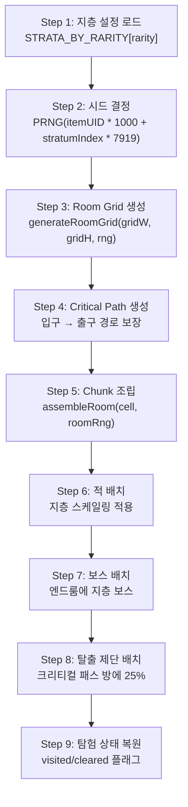

# 아이템계 기억의 지층 생성 시스템 (Item World Memory Strata Generation System)

## 0. 필수 참고 자료 (Mandatory References)

* Project Definition: `Documents/Terms/Project_Vision_Abyss.md`
* 월드 절차적 생성: `Documents/System/System_World_ProcGen.md` (SYS-WLD-05)
* 아이템 레어리티: `Documents/System/System_Equipment_Rarity.md`
* 내러티브 & 세계관: `Documents/Design/Design_Narrative_Worldbuilding.md` (D-12)
* 지층 설정 코드: `game/src/data/StrataConfig.ts` (SSoT)
* 이노센트 시스템: `Documents/System/System_Innocent_Core.md` (Phase 2)

---

## 구현 현황 (Implementation Status)

> **최근 업데이트:** 2026-03-24
> **문서 상태:** `작성 중 (Draft)`
> **3-Space:** Item World
> **기둥:** 야리코미

| 기능 ID       | 분류   | 기능명 (Feature Name)                   | 우선순위 | 구현 상태  | 비고 (Notes)                    |
| :------------ | :----- | :-------------------------------------- | :------: | :--------- | :------------------------------ |
| IWF-01-A      | 시스템 | 시드 기반 지층 생성 파이프라인          |    P1    | ✅ 구현    | StrataConfig + PRNG 기반        |
| IWF-02-A      | 시스템 | 지층별 Room Grid 레이아웃 생성         |    P1    | ✅ 구현    | 3x3 ~ 5x5 레어리티별           |
| IWF-03-A      | 시스템 | Critical Path 알고리즘                  |    P1    | ✅ 구현    | 입구 → 출구 경로 보장           |
| IWF-04-A      | 시스템 | Chunk 조립 시스템                       |    P1    | ✅ 구현    | ChunkAssembler 재사용           |
| IWF-05-A      | 시스템 | 적 배치 및 지층별 난이도 스케일링      |    P1    | ✅ 구현    | StratumDef 기반 HP/ATK 배율    |
| IWF-06-A      | 시스템 | 탈출 제단 (Escape Altar)               |    P1    | ✅ 구현    | 안전 귀환 + 진행 보존           |
| IWF-07-A      | 시스템 | 지층별 보스 (기억의 문)                |    P1    | ✅ 구현    | 보스 처치 → 다음 지층 해금      |
| IWF-08-A      | 시스템 | 탐험 상태 영속 (ItemWorldProgress)     |    P1    | ✅ 구현    | visited/cleared/deepestUnlocked |
| IWF-09-A      | 시스템 | 이노센트 배치                           |    P2    | ⬜ 제작 필요 | 야생 이노센트                  |
| IWF-10-A      | 시스템 | 멀티플레이 스케일링                     |    P1    | ⬜ 제작 필요 | 1~4인 체력 보정                |
| IWF-11-A      | 시스템 | 재귀 진입 시드 충돌 방지               |    P2    | ⬜ 제작 필요 | 최대 깊이 3                    |
| IWF-12-A      | 시스템 | 심연 (Abyss) — Ancient 최심층          |    P2    | ⬜ 제작 필요 | 무한 + 닻(Anchor) 시스템       |
| IWF-13-A      | 시스템 | 현실 침식 시각 효과 (Reality Erosion)  |    P2    | ⬜ 제작 필요 | 지층 깊이별 환경 왜곡          |
| IWF-14-A      | 시스템 | 미스터리 룸 / 이벤트                   |    P2    | ⬜ 제작 필요 | 특수 이벤트 방                 |

---

## 1. 개요 (Concept)

### 1.1. 설계 의도 (Intent)

아이템계(Item World)는 장비 아이템 내부에 존재하는 **기억의 지층(Memory Strata)** 구조의 절차적 던전이다. 인셉션의 "꿈 속의 꿈" 구조에서 영감을 받아, 각 지층은 아이템의 기억이 더 깊어지는 독립된 미니 메트로베니아 맵이다.

> **"아이템의 기억 속으로 다이빙한다. 깊이 들어갈수록 기억은 원초적이 되고, 세계는 더 적대적으로 변한다."**

기존 디스가이아의 "100층 선형 구조"를 대체하는 이유:

| 문제 (100층) | 해법 (기억의 지층) |
| :--- | :--- |
| 선형 반복이 메트로베니아의 비선형 탐험과 충돌 | 각 지층이 비선형 Room Grid — 분기, 비밀방, 루프 |
| 플랫포머에서 "층"이라는 단위가 부자연스러움 | "지층"은 공간의 깊이를 구조적으로 표현 |
| 100개 맵 순차 클리어는 지루함 | 2~4개 지층, 각각이 밀도 있는 탐험 |
| 세션 길이 강제 | 짧은 세션(지층 1 탐험)부터 긴 세션(전 지층 관통)까지 자유 |

### 1.2. 설계 근거 (Reasoning)

| 레퍼런스 | 차용 요소 | Project Abyss 적용 |
| :------- | :-------- | :------------------ |
| 인셉션 (영화) | 꿈의 층위, 시간 팽창, 림보, 킥, 투영체 | 지층 구조, 깊이별 맵 확장, 심연(Abyss), 탈출 제단, 적대도 상승 |
| 디스가이아 시리즈 | 아이템계, 레어리티별 깊이, 이노센트 | 레어리티별 지층 수, 아이템 성장, 이노센트(Phase 2) |
| 할로우 나이트 | 비선형 연결 맵, 깊이 표현 | 각 지층 내 비선형 Room Grid |
| 스펠렁키 | Room Grid + Critical Path + Chunk 조립 | Room Grid 기반 레이아웃 + Critical Path 보장 + Chunk 풀 조립 |

### 1.3. 3대 기둥 정렬

| 기둥 | 기억의 지층에서의 구현 |
| :--- | :--- |
| 메트로베니아 탐험 | 각 지층이 비선형 미니 메트로베니아. 분기 탐험, 비밀방, 되돌아가기 |
| 아이템계 야리코미 | 레어리티 = 지층 수 = 깊이. 여러 번 진입하며 점진적 확장. 무한 파밍 동기 |
| 온라인 멀티플레이 | 깊은 지층은 파티 협동. 탈출 제단 위치 공유. 지층 보스 역할 분담 |

---

## 2. 메커닉 (Mechanics)

### 2.1. 기억의 지층 구조 (Memory Strata Structure)

```
현실 (월드)
  │
  ▼ [아이템계 진입 — "다이빙"]
  │
  ╔══════════════════════════════════════╗
  ║  지층 1: 표층 기억 (Surface Memory)  ║
  ║  ─ 아이템의 가장 최근 기억           ║
  ║  ─ 안정적, 현실에 가까운 환경        ║
  ║  ─ 소규모 Room Grid (3×3)           ║
  ╠══════════════════════════════════════╣
  ║      ▼ 보스: 기억의 문 (Gate) ▼     ║
  ╠══════════════════════════════════════╣
  ║  지층 2: 깊은 기억 (Deep Memory)     ║
  ║  ─ 아이템의 핵심 사건                ║
  ║  ─ 환경에 미세한 변화 시작           ║
  ║  ─ 중규모 Room Grid (4×4)           ║
  ╠══════════════════════════════════════╣
  ║      ▼ 보스: 기억의 문 (Gate) ▼     ║
  ╠══════════════════════════════════════╣
  ║  지층 3+: 원초 기억 (Primal Memory)  ║
  ║  ─ 아이템이 만들어진 순간의 기억     ║
  ║  ─ 대규모 Room Grid (5×5)           ║
  ╠══════════════════════════════════════╣
  ║      ▼ 최종 보스: 기억의 핵 ▼       ║
  ╠══════════════════════════════════════╣
  ║  ??? 심연 (Abyss) — Ancient 전용    ║
  ║  ─ Phase 2 구현                      ║
  ╚══════════════════════════════════════╝
```

### 2.2. 레어리티별 지층 구성 (Strata by Rarity)

> SSoT: `game/src/data/StrataConfig.ts`

| 레어리티 | 지층 수 | Grid 크기 | 보스 수 | EXP 배율 (지층별) | 심연 |
| :--- | :---: | :--- | :---: | :--- | :---: |
| Normal | 2 | 3×3 → 4×4 | 1 + 핵 | 1.0x → 1.5x | ✕ |
| Magic | 3 | 3×3 → 4×4 → 4×4 | 2 + 핵 | 1.0x → 1.5x → 2.0x | ✕ |
| Rare | 3 | 3×3 → 4×4 → 5×5 | 2 + 핵 | 1.0x → 1.5x → 2.5x | ✕ |
| Legendary | 4 | 3×3 → 4×4 → 5×5 → 5×5 | 3 + 핵 | 1.0x → 1.5x → 2.5x → 3.5x | ✕ |
| Ancient | 4+심연 | 3×3 → 4×4 → 5×5 → 5×5 + ∞ | 3 + 핵 + 심연 보스 | 1.0x → 1.5x → 2.5x → 3.5x | ✔ |

### 2.3. 생성 파이프라인 (Generation Pipeline)



### 2.4. 시드 체계 (Seed System)

```
지층 Grid 시드: PRNG(itemUID * 1000 + stratumIndex * 7919)
방 내부 시드:   PRNG(itemUID * 10000 + col * 100 + row + stratumIndex * 1000000)
적 스폰 시드:   PRNG(itemUID * 999 + col * 77 + row * 33 + i + stratumIndex * 500000)
```

- 동일 아이템의 동일 지층은 항상 같은 맵을 생성한다 (결정적 생성)
- 지층 인덱스가 시드에 포함되어 지층 간 맵 충돌 없음

### 2.5. 적 스케일링 (Enemy Scaling)

```
enemyHP  = baseHP  * (1 + roomDistance * 0.2) * stratumDef.enemyHpScale
enemyATK = baseATK * (1 + roomDistance * 0.2) * stratumDef.enemyAtkScale
enemyCount = 2 + floor(roomDistance * 0.5) + stratumDef.enemyCountBonus
```

| 지층 | HP 배율 | ATK 배율 | 추가 적 수 | 보스 HP 배율 | 보스 ATK 배율 |
| :--- | :--- | :--- | :--- | :--- | :--- |
| 1 (표층) | ×1.0 | ×1.0 | +0 | ×4 | ×2 |
| 2 (깊은) | ×1.5~1.6 | ×1.3~1.4 | +1 | ×6 | ×2.5 |
| 3 (원초) | ×2.2~2.5 | ×1.8~2.0 | +1~2 | ×8~10 | ×3~3.5 |
| 4 (최심) | ×3.5 | ×2.8 | +3 | ×14 | ×4.5 |

### 2.6. 인셉션 메커닉: 킥과 탈출 제단 (Kick & Escape Altar)

**탈출 제단:**
- 비시작/비보스 크리티컬 패스 방에 25% 확률로 스폰
- UP 키로 상호작용 → 안전 귀환
- 귀환 시: 모든 보상 보존 + `lastSafeStratum` 기록
- 다음 진입 시: `lastSafeStratum` 지층에서 재개

**사망 시:**
- 획득 EXP 30% 손실
- `lastSafeStratum = currentStratum - 1` (이전 지층으로 후퇴)
- 아이템계 종료

### 2.7. 탐험 상태 영속 (Persistent Exploration)

> SSoT: `game/src/items/ItemInstance.ts` — `ItemWorldProgress`

```typescript
interface ItemWorldProgress {
  deepestUnlocked: number;           // 해금된 가장 깊은 지층 인덱스
  visitedRooms: Record<number, string[]>; // 지층별 방문 방 목록
  clearedRooms: Record<number, string[]>; // 지층별 클리어 방 목록
  lastSafeStratum: number;           // 마지막 안전 귀환 지층
}
```

- 방 이동 시 자동 persist (visitedRooms/clearedRooms 갱신)
- 보스 처치 시 `deepestUnlocked` 갱신
- 탈출 제단/사망 시 `lastSafeStratum` 갱신
- `SaveManager`를 통해 localStorage에 영속 저장

### 2.8. 세션 유연성 (Session Flexibility)

```
짧은 세션 (10분):  지층 1 탐험 → 비밀방 발견 → 탈출 제단으로 귀환
보통 세션 (25분):  지층 1 → 보스 돌파 → 지층 2 진입 → 탈출 제단 귀환
긴 세션 (50분+):   지층 1→2→3 관통 → 기억의 핵 보스 도전
야리코미 (∞):      Ancient 심연 반복 진입 (Phase 2)
```

---

## 3. 규칙 (Rules)

### 3.1. 지층 진행 규칙 (Stratum Progression Rules)

| 규칙 ID | 규칙 | 예외 |
| :--- | :--- | :--- |
| IWF-R01 | 보스 처치 시 다음 지층이 영구 해금된다 | 없음 |
| IWF-R02 | 해금된 지층까지만 진입 가능 | 없음 |
| IWF-R03 | 재진입 시 lastSafeStratum에서 시작 | 첫 진입은 항상 지층 1 |
| IWF-R04 | 탈출 제단 사용 시 현재 지층이 lastSafeStratum이 된다 | 없음 |
| IWF-R05 | 사망 시 lastSafeStratum이 1 감소한다 (최소 0) | 지층 1에서 사망 시 0 유지 |
| IWF-R06 | 최종 지층 보스 처치 시 아이템 레벨 +1 보너스 | 없음 |
| IWF-R07 | ESC로 아이템계를 포기할 수 있다 (보상 보존 없음) | 탈출 제단 사용 시 보상 보존 |

### 3.2. Room Grid 규칙 (Room Grid Rules)

| 규칙 ID | 규칙 | 예외 |
| :--- | :--- | :--- |
| IWF-R10 | Grid 크기는 StratumDef.gridWidth/Height로 결정 | 없음 |
| IWF-R11 | Critical Path는 항상 입구→출구 연결 보장 (Always Winnable) | 없음 |
| IWF-R12 | 탐험한 방은 재진입 시 visited/cleared 상태 유지 | 없음 |
| IWF-R13 | 클리어한 방 재방문 시 적이 리스폰되지 않음 | 없음 |

### 3.3. 보스 규칙 (Boss Rules)

| 규칙 ID | 규칙 | 예외 |
| :--- | :--- | :--- |
| IWF-R20 | 각 지층의 엔드룸에 보스 1체 | 없음 |
| IWF-R21 | 보스 스케일: StratumDef.bossHpScale/bossAtkScale | 없음 |
| IWF-R22 | 보스 시각 크기: 1.5 + stratumIndex × 0.2 | 없음 |
| IWF-R23 | 보스 처치 보상: 방 클리어 EXP + BOSS_BONUS_EXP × expMultiplier | 없음 |
| IWF-R24 | 보스 처치 후 출구 활성화 → 다음 지층 하강 또는 아이템계 탈출 | 최종 지층은 탈출 |

### 3.4. 탈출 제단 규칙 (Escape Altar Rules)

| 규칙 ID | 규칙 | 예외 |
| :--- | :--- | :--- |
| IWF-R30 | 비시작/비보스 크리티컬 패스 방에 25% 확률로 스폰 | 없음 |
| IWF-R31 | 결정적 배치 (시드 기반 — 같은 방은 항상 같은 결과) | 없음 |
| IWF-R32 | UP 키로 상호작용 | 없음 |
| IWF-R33 | 사용 시 모든 보상 보존 + 안전 귀환 | 없음 |

---

## 4. 데이터 및 파라미터 (Parameters)

### 4.1. 지층 설정 (Strata Config) — SSoT: `StrataConfig.ts`

```yaml
strata_by_rarity:
  normal:
    - { grid: 3x3, enemyHp: 1.0, enemyAtk: 1.0, bonus: +0, bossHp: 4x, bossAtk: 2x, exp: 1.0x }
    - { grid: 4x4, enemyHp: 1.5, enemyAtk: 1.3, bonus: +1, bossHp: 6x, bossAtk: 2.5x, exp: 1.5x }
  magic:
    - { grid: 3x3, enemyHp: 1.0, enemyAtk: 1.0, bonus: +0, bossHp: 4x, bossAtk: 2x, exp: 1.0x }
    - { grid: 4x4, enemyHp: 1.6, enemyAtk: 1.4, bonus: +1, bossHp: 6x, bossAtk: 2.5x, exp: 1.5x }
    - { grid: 4x4, enemyHp: 2.2, enemyAtk: 1.8, bonus: +1, bossHp: 8x, bossAtk: 3x, exp: 2.0x }
  rare:
    - { grid: 3x3, enemyHp: 1.0, enemyAtk: 1.0, bonus: +0, bossHp: 4x, bossAtk: 2x, exp: 1.0x }
    - { grid: 4x4, enemyHp: 1.6, enemyAtk: 1.4, bonus: +1, bossHp: 6x, bossAtk: 2.5x, exp: 1.5x }
    - { grid: 5x5, enemyHp: 2.5, enemyAtk: 2.0, bonus: +2, bossHp: 10x, bossAtk: 3.5x, exp: 2.5x }
  legendary:
    - { grid: 3x3, enemyHp: 1.0, enemyAtk: 1.0, bonus: +0, bossHp: 4x, bossAtk: 2x, exp: 1.0x }
    - { grid: 4x4, enemyHp: 1.6, enemyAtk: 1.4, bonus: +1, bossHp: 6x, bossAtk: 2.5x, exp: 1.5x }
    - { grid: 5x5, enemyHp: 2.5, enemyAtk: 2.0, bonus: +2, bossHp: 10x, bossAtk: 3.5x, exp: 2.5x }
    - { grid: 5x5, enemyHp: 3.5, enemyAtk: 2.8, bonus: +3, bossHp: 14x, bossAtk: 4.5x, exp: 3.5x }
  ancient:
    - (legendary와 동일 4지층)
    - Phase 2: 심연 (Abyss) 추가
```

### 4.2. EXP 기본값 (Base EXP Values)

```yaml
exp_base:
  kill: 30           # 몬스터 처치 기본 EXP
  room_clear: 120    # 방 클리어 기본 EXP
  room_pass: 60      # 방 통과 (미클리어) 기본 EXP
  boss_bonus: 600    # 보스 처치 추가 EXP
  # 실제 EXP = base × stratumDef.expMultiplier
```

### 4.3. 사망 페널티 파라미터 (Death Penalty Parameters)

```yaml
death_penalty:
  exp_loss_ratio: 0.30    # 획득 EXP의 30% 손실
  stratum_rollback: 1     # lastSafeStratum이 1 감소
  minimum_stratum: 0      # 최소 귀환 지층
```

### 4.4. 탈출 제단 파라미터 (Escape Altar Parameters)

```yaml
escape_altar:
  spawn_chance: 0.25          # 적격 방당 25% 확률
  eligible_rooms: "critical_path AND NOT start AND NOT end"
  interaction_key: "JUMP (UP)"
```

### 4.5. 멀티플레이 스케일링 파라미터 (Multiplayer Scaling) — Phase 3

```yaml
multiplayer_scaling:
  party_size_2: { hp: 1.6x, count: +1, reward: 1.2x }
  party_size_3: { hp: 2.2x, count: +2, reward: 1.4x }
  party_size_4: { hp: 2.8x, count: +3, reward: 1.6x }
```

---

## 5. 예외 처리 (Edge Cases)

### 5.1. 탐험 상태 관련

| 케이스 | 처리 |
| :--- | :--- |
| worldProgress가 없는 기존 아이템 | `getOrCreateWorldProgress()`가 자동 초기화 |
| SaveData v1 (worldProgress 없음) | v2 로딩 시 worldProgress = undefined → 자동 초기화 |
| 지층 설정보다 높은 deepestUnlocked | `Math.min(lastSafeStratum, deepestUnlocked)`로 클램프 |
| 새로고침 중 아이템계 진행 손실 | 방 이동마다 persistRoomState(), 월드 복귀 시 autoSave() |

### 5.2. 전투 관련

| 케이스 | 처리 |
| :--- | :--- |
| 사망 시 지층 1인 경우 | lastSafeStratum = 0 (지층 1부터 재시작) |
| 보스 처치 중 사망 | 보스 미처치 처리, 사망 페널티 적용 |
| 클리어한 방 재방문 | 적 리스폰 없음, 빈 방 |

### 5.3. 아이템 관련

| 케이스 | 처리 |
| :--- | :--- |
| 탐사 중 아이템 거래/분해 시도 | 차단 — "탐사 중인 아이템은 변경할 수 없습니다" |
| 레어리티 승급 후 지층 수 변경 | 기존 worldProgress 유지, 새 지층은 미해금 상태 |

---

## 월드 ProcGen과의 비교 (World ProcGen Comparison)

| 비교 항목 | 월드 ProcGen (SYS-WLD-05) | 기억의 지층 (본 문서) |
| :--- | :--- | :--- |
| 생성 스코프 | 오버월드 전체 맵 | 아이템 내부 다층 던전 |
| 매크로 구조 | 고정 (핸드크래프트 지역 배치) | 절차적 (레어리티별 지층 수) |
| 마이크로 구조 | 절차적 (지형 변주) | 절차적 (Room Grid + Chunk 조립) |
| 시드 체계 | 월드 시드 1개 | PRNG(itemUID + stratumIndex) |
| 지속성 | 영구 저장 | 영속 탐험 상태 (ItemWorldProgress) |
| 멀티플레이 | 동일 월드 공유 | 파티 리더 아이템에 종속 (1~4인) |
| 깊이 표현 | 구역 레벨 밴드 | 지층 인덱스 × 스케일링 배율 |

---

## 검증 기준 (Verification Checklist)

- [ ] 포탈 진입 → 지층 1 로드 → HUD에 "Stratum 1/N" 표시
- [ ] 엔드룸 보스 처치 → 출구 진입 → "Stratum 2 — Deeper..." 토스트 + 지층 2 로드
- [ ] 지층 2에서 탈출 제단 사용 → 안전 귀환 + 재진입 시 지층 2에서 시작
- [ ] 사망 시 → EXP 30% 감소 + 이전 지층으로 후퇴 + 아이템계 종료
- [ ] 최종 지층 보스 클리어 → 아이템 레벨 +1 + 아이템계 종료
- [ ] 새로고침 후 같은 아이템 재진입 → 탐험 상태(visited/cleared) 유지
- [ ] Normal 아이템 = 2 지층, Legendary 아이템 = 4 지층 확인
- [ ] 미니맵에 지층 깊이 점 표시기 확인
- [ ] 지층별 적 HP/ATK 스케일링이 StrataConfig와 일치
