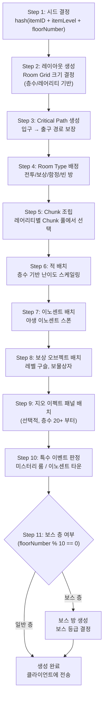

# 아이템계 층 생성 시스템 (Item World Floor Generation System)

## 0. 필수 참고 자료 (Mandatory References)

* Project Definition: `Documents/Terms/Project_Vision_Abyss.md`
* 월드 절차적 생성: `Documents/System/System_World_ProcGen.md` (SYS-WLD-05)
* 아이템 레어리티: `Documents/System/System_Item_Rarity.md`
* 이노센트 시스템: `Documents/System/System_Innocent.md`
* 지오 이펙트: `Documents/System/System_GeoEffect.md`

---

## 구현 현황 (Implementation Status)

> **최근 업데이트:** 2026-03-23
> **문서 상태:** `작성 중 (Draft)`
> **3-Space:** Item World
> **기둥:** 야리코미

| 기능 ID       | 분류   | 기능명 (Feature Name)              | 우선순위 | 구현 상태    | 비고 (Notes)                |
| :------------ | :----- | :--------------------------------- | :------: | :----------- | :-------------------------- |
| IWF-01-A      | 시스템 | 시드 기반 층 생성 파이프라인       |    P1    | ⬜ 제작 필요 | 핵심 생성 로직              |
| IWF-02-A      | 시스템 | Room Grid 레이아웃 생성            |    P1    | ⬜ 제작 필요 | 3x3 ~ 5x5                  |
| IWF-03-A      | 시스템 | Critical Path 알고리즘             |    P1    | ⬜ 제작 필요 | 입구 → 출구 경로 보장       |
| IWF-04-A      | 시스템 | Chunk 조립 시스템                  |    P1    | ⬜ 제작 필요 | 레어리티별 Chunk 풀         |
| IWF-05-A      | 시스템 | 적 배치 및 난이도 스케일링         |    P1    | ⬜ 제작 필요 | 층수 × 배율                 |
| IWF-06-A      | 시스템 | 이노센트 배치                      |    P2    | ⬜ 제작 필요 | 야생 이노센트               |
| IWF-07-A      | 시스템 | 보스 층 생성                       |    P1    | ⬜ 제작 필요 | 10층 단위                   |
| IWF-08-A      | 시스템 | 미스터리 룸 / 이노센트 타운        |    P2    | ⬜ 제작 필요 | 특수 이벤트 층              |
| IWF-09-A      | 시스템 | 지오 이펙트 패널 배치              |    P2    | ⬜ 제작 필요 | 선택적 전략 레이어          |
| IWF-10-A      | 시스템 | 멀티플레이 스케일링                |    P1    | ⬜ 제작 필요 | 1~4인 체력 보정             |
| IWF-11-A      | 시스템 | 재귀 진입 시드 충돌 방지           |    P2    | ⬜ 제작 필요 | 최대 깊이 3                 |
| IWF-12-A      | 시스템 | Mythic 보너스 층 (101~110)         |    P3    | ⬜ 제작 필요 | Mythic 전용 엔드콘텐츠      |

---

## 1. 개요 (Concept)

### 1.1. 설계 의도 (Intent)

아이템계(Item World)는 장비 아이템 내부에 존재하는 **100층 절차적 던전**이다. 플레이어는 아이템을 강화하기 위해 아이템계에 진입하여 층을 클리어한다. 핵심 경험은 "같은 아이템을 반복해도 매번 다른 전략이 필요한" 절차적 던전이다.

아이템계의 존재 이유:

- **야리코미(やりこみ) 충족**: 아이템 하나당 100층, 보유 아이템 수 × 100층 = 사실상 무한한 콘텐츠 볼륨
- **아이템 성장 동기**: 층 클리어마다 아이템 경험치 획득, 이노센트 포획, 레벨 구슬 수집
- **전략적 깊이**: 층마다 달라지는 지형/적 구성/지오 이펙트가 매번 다른 판단을 요구

### 1.2. 설계 근거 (Reasoning)

| 레퍼런스 | 차용 요소 | Project Abyss 적용 |
| :------- | :-------- | :------------------ |
| 디스가이아 시리즈 | 아이템계 30~100층, 레어리티별 층수, 이노센트, 지오 이펙트 | 100층 구조, 레어리티별 최대 층, 이노센트 시스템, 지오 이펙트 패널 |
| 스펠렁키 | Room Grid + Critical Path + Chunk 조립 | Room Grid 기반 레이아웃 + Critical Path 보장 + Chunk 풀 조립 |
| 데드셀 | Concept Graph, Biome별 룸 풀 | 층수 구간별 Room Type 풀, 레어리티별 Chunk 풀 분리 |

### 1.3. 월드 ProcGen과의 차이 (Differentiation)

| 비교 항목 | 월드 ProcGen (SYS-WLD-05) | 아이템계 Floor Gen (본 문서) |
| :-------- | :------------------------ | :--------------------------- |
| 스코프 | 오버월드 전체 맵 | 아이템 내부 던전 (100층) |
| 매크로 구조 | 고정 (핸드크래프트 지역 배치) | 절차적 (시드 기반 전층 생성) |
| 마이크로 구조 | 절차적 (지형 변주) | 절차적 (Room Grid + Chunk 조립) |
| 시드 결정 | 월드 시드 1개 | hash(itemID + itemLevel + floorNumber) |
| 지속성 | 영구 저장 | 진입 시 생성, 탈출 시 파기 |
| 멀티플레이 | 월드 공유 | 파티 리더 아이템에 종속 |

### 1.4. 저주받은 문제 점검 (Cursed Problem Check)

**문제:** 100층이 지루하지 않은가?

**해결 전략:**

1. **10층 단위 보스**: 명확한 중간 목표와 긴장감 제공
2. **미스터리 이벤트**: 5% 확률로 출현하는 예측 불가 이벤트 (상점, 점술사, 특수 전투)
3. **지오 이펙트 변주**: 층마다 달라지는 지형 효과가 전투 전략을 강제 변경
4. **이노센트 타운**: 25층, 50층, 75층에 고정 출현하는 안전지대 겸 보상 허브
5. **Chunk 풀 깊이**: 레어리티가 높을수록 Chunk 풀이 넓어져 반복감 감소

### 1.5. 리스크와 보상 (Risk & Reward)

| 리스크 | 대응 | 보상 |
| :----- | :--- | :--- |
| 100층 클리어에 소요 시간 과다 | 10층 단위 중간 탈출 가능 (Mr. Gency Exit) | 10층마다 아이템 레벨 상승 확정 |
| 파티원 이탈 시 밸런스 붕괴 | 실시간 난이도 재조정 (적 체력 하향) | 남은 인원에게 보상 집중 |
| 재귀 진입 시 복잡도 폭발 | 최대 깊이 3 제한, 깊이별 시드 분리 | 깊은 재귀일수록 희귀 이노센트 출현률 상승 |

---

## 2. 메커닉 (Mechanics)

### 2.1. 생성 파이프라인 (Generation Pipeline)



### 2.2. 단계별 상세 (Step-by-Step Detail)

#### Step 1: 시드 결정 (Seed Determination)

플레이어의 행동: 아이템계 진입 선택 (Verb: Enter)

```
seed = hash(itemID + itemLevel + floorNumber)
```

- 동일 아이템의 동일 층은 항상 같은 맵을 생성한다 (결정적 생성)
- 아이템 레벨이 변경되면 모든 층의 시드가 변경된다
- 재귀 진입 시: `seed = hash(itemID + itemLevel + floorNumber + recursionDepth)`

#### Step 2: 레이아웃 생성 (Layout Generation)

플레이어의 행동: 없음 (서버 측 자동 처리)

Room Grid 크기는 층수와 레어리티에 의해 결정된다.

```
gridWidth  = 3 + floor(floorNumber / 25)   // 최소 3, 최대 5
gridHeight = 3 + floor(floorNumber / 25)   // 최소 3, 최대 5
gridWidth  = clamp(gridWidth, 3, 5)
gridHeight = clamp(gridHeight, 3, 5)
```

각 Grid 셀은 하나의 Room을 담는다. 일부 셀은 빈 상태(Void)로 남겨 비정형 레이아웃을 형성한다. Void 비율은 시드 기반 랜덤으로 10%~30% 범위에서 결정한다.

#### Step 3: Critical Path 생성 (Critical Path Generation)

플레이어의 행동: 없음 (서버 측 자동 처리)

1. Grid 좌측 하단에서 입구(Entrance) 위치 선정
2. Grid 우측 상단에서 출구(Exit) 위치 선정
3. 입구에서 출구까지 인접 셀을 연결하는 경로를 1개 생성 (Random Walk 기반)
4. Critical Path 상의 셀은 Void가 될 수 없다
5. Critical Path 외 셀 중 일부를 추가 연결하여 분기 경로(Branch) 생성

#### Step 4: Room Type 배정 (Room Type Assignment)

플레이어의 행동: 없음 (서버 측 자동 처리)

| Room Type | 배정 규칙 | 설명 |
| :-------- | :-------- | :--- |
| Combat | Critical Path의 60%~80% | 적 조우 필수 |
| Treasure | Branch 경로에 우선 배정 | 보물상자, 레벨 구슬 |
| Trap | 층수 20 이상, 전체의 10%~20% | 함정 지형 중심 |
| Rest | Critical Path에 1~2개 | 체력 회복 가능 |
| Boss | 보스 층(10의 배수)의 출구 방 | 보스 전용 대형 방 |
| Mystery | 미스터리 룸 판정 통과 시 | Branch 끝에 배치 |

#### Step 5: Chunk 조립 (Chunk Assembly)

플레이어의 행동: 없음 (서버 측 자동 처리)

각 Room은 사전 제작된 Chunk(타일맵 조각)를 조립하여 구성한다.

- 횡스크롤 기준 Chunk 크기: 가로 40타일 × 세로 24타일 (1 Room = 1~4 Chunk 결합)
- 레어리티별 Chunk 풀:

| 레어리티 | Chunk 풀 크기 | 특성 |
| :------- | :------------ | :--- |
| Common | 기본 풀 (50종) | 단순 지형, 함정 없음 |
| Uncommon | 기본 풀 + 확장 A (70종) | 이동 플랫폼 추가 |
| Rare | 기본 풀 + 확장 A, B (100종) | 함정, 파괴 가능 지형 추가 |
| Legendary | 전체 풀 (140종) | 복합 함정, 숨겨진 경로 추가 |
| Mythic | 전체 풀 + Mythic 전용 (160종) | 지오 이펙트 내장 Chunk 포함 |

#### Step 6: 적 배치 (Enemy Placement)

플레이어의 행동: 적과 전투 (Verb: Fight)

- Combat Room에 적 스폰 포인트 배치
- 적 수: Room 크기 기반 (소형 3~5, 대형 6~10)
- 적 레벨: `baseLevel = floorNumber * scalingMultiplier * itemLevelBonus`
- 적 종류: 층수 구간별 적 풀에서 시드 기반 선택

#### Step 7: 이노센트 배치 (Innocent Placement)

플레이어의 행동: 이노센트 발견 및 포획 (Verb: Capture)

- 층당 1~3마리 출현
- 출현 위치: Combat Room 또는 Treasure Room에 랜덤 배치
- 이노센트 레벨: `floor(floorNumber * 0.8) + random(0, floorNumber * 0.4)`
- 깊은 층일수록 고레벨/고레어 이노센트 출현 확률 상승

#### Step 8: 보상 오브젝트 (Reward Objects)

플레이어의 행동: 보상 획득 (Verb: Collect)

- **레벨 구슬**: Treasure Room에 1~3개, Combat Room 클리어 보상으로 0~1개
- **보물상자**: Treasure Room에 1~2개, Branch 경로 끝에 1개 보너스
- **보물상자 등급**: 층수에 비례 (1~30: Bronze, 31~60: Silver, 61~90: Gold, 91~100: Platinum)

#### Step 9: 지오 이펙트 패널 배치 (Geo Effect Panel Placement)

플레이어의 행동: 지오 패널 활용/파괴 (Verb: Manipulate)

- 층수 20 이상부터 출현
- Combat Room의 30%~50%에 지오 이펙트 패널 배치
- 패널 종류: 공격력 증가, 방어력 증가, 독, 회복, 무적, 적 강화
- 패널 색상은 시드 기반으로 결정, 연쇄 파괴 전략 유도

#### Step 10: 특수 이벤트 (Special Events)

플레이어의 행동: 이벤트 상호작용 (Verb: Interact)

**미스터리 룸:**
- 각 층 생성 시 5% 확률로 미스터리 룸 1개 추가
- 내용 4종 (균등 확률 25%씩): 상점, 특수 전투, 점술사(다음 층 프리뷰), 병원(전 회복)

**이노센트 타운:**
- 25층, 50층, 75층에 고정 출현
- 포획한 이노센트 관리, 아이템 교환, 중간 저장 기능 제공
- 이노센트 타운 내에서 아이템계 중간 탈출 가능

#### Step 11: 보스 층 처리 (Boss Floor Processing)

플레이어의 행동: 보스 전투 (Verb: Conquer)

- 10의 배수 층(10, 20, 30...100)에서 보스 층 생성
- 보스 방은 일반 Room Grid와 별도로 대형 전용 방(가로 80타일 × 세로 48타일) 생성
- 보스 방 진입 전 Rest Room 1개 보장

보스 등급 체계:

| 층 | 보스 등급 | 특성 |
| :- | :-------- | :--- |
| 10, 20 | 장군 (General) | 단일 보스, 기본 패턴 2~3개 |
| 30, 40, 50 | 왕 (King) | 단일 보스 + 호위병 2~4, 패턴 4~5개 |
| 60, 70, 80 | 신 (God) | 페이즈 전환 2단계, 지오 이펙트 활용 |
| 90 | 대신 (Overlord) | 페이즈 전환 3단계, 전용 지형 변화 |
| 100 | 아이템 신 (Item God) | 페이즈 전환 3단계, 전용 BGM, 전용 연출 |

---

## 3. 규칙 (Rules)

### 3.1. Room Grid 크기 규칙 (Room Grid Size Rules)

```
gridSize = 3 + floor(floorNumber / 25)
gridSize = clamp(gridSize, 3, 5)
```

| 층 구간 | Grid 크기 | 총 셀 수 | Void 제외 유효 Room 수 (평균) |
| :------ | :-------- | :-------- | :---------------------------- |
| 1~24    | 3 x 3     | 9         | 6~8                           |
| 25~49   | 4 x 4     | 16        | 11~14                         |
| 50~74   | 5 x 5     | 25        | 17~22                         |
| 75~100  | 5 x 5     | 25        | 17~22                         |

### 3.2. 레어리티별 최대 층 규칙 (Rarity Floor Cap Rules)

| 레어리티 | 최대 진입 층 | 보스 전투 횟수 | 비고 |
| :------- | :----------- | :------------- | :--- |
| Common | 30 | 3회 (10, 20, 30) | 입문용 |
| Uncommon | 50 | 5회 | 중급 |
| Rare | 70 | 7회 | 상급 |
| Legendary | 100 | 10회 | 최종 보스 아이템 신(Item God) 포함 |
| Mythic | 110 (100 + 보너스 10층) | 11회 | 101~110 보너스 층은 Mythic 전용 |

- 레어리티 상한 층에 도달하면 강제 탈출 처리된다
- 보너스 층(101~110)은 적 레벨이 100층 대비 1.5배로 급상승한다

### 3.3. Chunk 복잡도 규칙 (Chunk Complexity Rules)

| 레어리티 | 함정 밀도 | 파괴 가능 지형 비율 | 숨겨진 경로 확률 | 이동 플랫폼 빈도 |
| :------- | :-------- | :------------------ | :--------------- | :---------------- |
| Common | 0% | 0% | 0% | 0% |
| Uncommon | 5% | 10% | 5% | 15% |
| Rare | 15% | 20% | 10% | 25% |
| Legendary | 25% | 30% | 20% | 35% |
| Mythic | 35% | 40% | 30% | 40% |

### 3.4. 적 스케일링 규칙 (Enemy Scaling Rules)

```
enemyLevel = floorNumber * baseMultiplier * (1 + itemLevel * 0.02)
enemyHP    = baseHP * (enemyLevel / 10) ^ 1.2
enemyATK   = baseATK * (enemyLevel / 10) ^ 1.1
```

- `baseMultiplier`: 1.0 (1~30층), 1.3 (31~60층), 1.6 (61~90층), 2.0 (91~100층), 3.0 (101~110층)
- 아이템 레벨이 높을수록 적 레벨이 미세하게 상승하여 도전감 유지

### 3.5. 이노센트 출현 규칙 (Innocent Spawn Rules)

| 층 구간 | 출현 수/층 | 최대 레벨 | 레어 이노센트 확률 |
| :------ | :--------- | :-------- | :----------------- |
| 1~25    | 1          | 30        | 2%                 |
| 26~50   | 1~2        | 60        | 5%                 |
| 51~75   | 2          | 90        | 10%                |
| 76~100  | 2~3        | 120       | 18%                |
| 101~110 | 3          | 200       | 30%                |

### 3.6. 보스 층 규칙 (Boss Floor Rules)

- 보스 방은 출구 방(Exit Room)을 대체한다
- 보스 방 진입 시 후방 문이 잠기며, 보스 처치 후 개방된다
- 보스 처치 보상: 아이템 레벨 +1, 보스 등급에 비례한 보너스 보상
- 보스 처치 실패 시: 아이템계에서 강제 탈출, 진행 층수의 절반까지 아이템 레벨 반영

### 3.7. 미스터리 룸 규칙 (Mystery Room Rules)

| 이벤트 종류 | 확률 | 내용 |
| :---------- | :--- | :--- |
| 상점 | 25% | 희귀 소모품, Mr. Gency Exit 판매 |
| 특수 전투 | 25% | 고보상 강적 1체 (처치 시 레어 이노센트 확정) |
| 점술사 | 25% | 다음 3개 층의 Room Type, 보스 패턴 1개 미리보기 |
| 병원 | 25% | 파티 전원 HP/MP 전회복, 상태이상 해제 |

- 미스터리 룸은 층당 최대 1개
- 보스 층에서는 미스터리 룸이 출현하지 않는다

### 3.8. 이노센트 타운 규칙 (Innocent Town Rules)

- 25층, 50층, 75층에 고정 출현
- 이노센트 타운은 별도 Room Grid 없이 단일 대형 방으로 생성
- 제공 기능: 이노센트 합성, 이노센트 배치 변경, 소모품 구매, 중간 저장, 중간 탈출
- 이노센트 타운에서 저장 시 다음 진입 때 해당 층부터 재개 가능

### 3.9. 멀티플레이 스케일링 규칙 (Multiplayer Scaling Rules)

- 파티 리더의 아이템에 진입 (리더만 아이템 성장 혜택 획득)
- 파티원은 전투 보상(경험치, 드롭)을 획득

| 파티 인원 | 적 HP 배율 | 적 수 보정 | 보상 배율 |
| :-------- | :--------- | :--------- | :-------- |
| 1인       | 1.0x       | +0         | 1.0x      |
| 2인       | 1.6x       | +1/방      | 1.2x      |
| 3인       | 2.2x       | +2/방      | 1.4x      |
| 4인       | 2.8x       | +3/방      | 1.6x      |

---

## 4. 데이터 및 파라미터 (Parameters)

### 4.1. Room Grid 파라미터 (Room Grid Parameters)

```yaml
room_grid:
  base_size: 3                    # 기본 Grid 크기 (3x3)
  increment_per_floors: 25        # 이 층수마다 Grid 크기 +1
  max_size: 5                     # 최대 Grid 크기 (5x5)
  void_ratio_min: 0.10            # Void 셀 최소 비율
  void_ratio_max: 0.30            # Void 셀 최대 비율
  chunk_tile_width: 40            # Chunk 가로 타일 수
  chunk_tile_height: 24           # Chunk 세로 타일 수
  boss_room_tile_width: 80        # 보스 방 가로 타일 수
  boss_room_tile_height: 48       # 보스 방 세로 타일 수
```

### 4.2. 적 스케일링 파라미터 (Enemy Scaling Parameters)

```yaml
enemy_scaling:
  base_multiplier_by_tier:
    tier_1:                       # 1~30층
      floor_range: [1, 30]
      multiplier: 1.0
    tier_2:                       # 31~60층
      floor_range: [31, 60]
      multiplier: 1.3
    tier_3:                       # 61~90층
      floor_range: [61, 90]
      multiplier: 1.6
    tier_4:                       # 91~100층
      floor_range: [91, 100]
      multiplier: 2.0
    tier_bonus:                   # 101~110층 (Mythic 전용)
      floor_range: [101, 110]
      multiplier: 3.0
  item_level_coefficient: 0.02   # 아이템 레벨 보정 계수
  hp_exponent: 1.2               # HP 스케일링 지수
  atk_exponent: 1.1              # ATK 스케일링 지수
  enemy_count_per_room:
    small_room: [3, 5]           # 소형 Room 적 수 범위
    large_room: [6, 10]          # 대형 Room 적 수 범위
```

### 4.3. 이노센트 출현 파라미터 (Innocent Spawn Parameters)

```yaml
innocent_spawn:
  by_floor_tier:
    tier_1:
      floor_range: [1, 25]
      spawn_count: [1, 1]        # [최소, 최대]
      max_level: 30
      rare_chance: 0.02           # 2%
    tier_2:
      floor_range: [26, 50]
      spawn_count: [1, 2]
      max_level: 60
      rare_chance: 0.05           # 5%
    tier_3:
      floor_range: [51, 75]
      spawn_count: [2, 2]
      max_level: 90
      rare_chance: 0.10           # 10%
    tier_4:
      floor_range: [76, 100]
      spawn_count: [2, 3]
      max_level: 120
      rare_chance: 0.18           # 18%
    tier_bonus:
      floor_range: [101, 110]
      spawn_count: [3, 3]
      max_level: 200
      rare_chance: 0.30           # 30%
  level_formula:
    base: "floor(floorNumber * 0.8)"
    variance: "random(0, floorNumber * 0.4)"
```

### 4.4. 보스 등급 파라미터 (Boss Tier Parameters)

```yaml
boss_tiers:
  general:                        # 장군
    floors: [10, 20]
    hp_multiplier: 5.0
    atk_multiplier: 2.0
    pattern_count: [2, 3]
    escort_count: 0
    phase_count: 1
  king:                           # 왕
    floors: [30, 40, 50]
    hp_multiplier: 10.0
    atk_multiplier: 3.0
    pattern_count: [4, 5]
    escort_count: [2, 4]
    phase_count: 1
  god:                            # 신
    floors: [60, 70, 80]
    hp_multiplier: 20.0
    atk_multiplier: 5.0
    pattern_count: [5, 7]
    escort_count: [3, 6]
    phase_count: 2
  overlord:                       # 대신
    floors: [90]
    hp_multiplier: 35.0
    atk_multiplier: 7.0
    pattern_count: [6, 8]
    escort_count: [4, 8]
    phase_count: 3
  item_god:                       # 아이템 신
    floors: [100]
    hp_multiplier: 50.0
    atk_multiplier: 10.0
    pattern_count: [8, 10]
    escort_count: [6, 10]
    phase_count: 3
    has_custom_bgm: true
    has_custom_cutscene: true
  mythic_guardian:                 # 신화 수호자 (101~110 전용)
    floors: [110]
    hp_multiplier: 75.0
    atk_multiplier: 15.0
    pattern_count: [10, 12]
    escort_count: [8, 12]
    phase_count: 4
    has_custom_bgm: true
    has_custom_cutscene: true
```

### 4.5. 미스터리 룸 파라미터 (Mystery Room Parameters)

```yaml
mystery_room:
  spawn_chance_per_floor: 0.05    # 층당 5%
  max_per_floor: 1                # 층당 최대 1개
  excluded_floors: "boss_floors"  # 보스 층 제외 (10, 20, 30...100)
  event_weights:
    shop: 0.25
    special_combat: 0.25
    fortune_teller: 0.25
    hospital: 0.25
```

### 4.6. 멀티플레이 스케일링 파라미터 (Multiplayer Scaling Parameters)

```yaml
multiplayer_scaling:
  party_size_1:
    enemy_hp_multiplier: 1.0
    enemy_count_bonus: 0
    reward_multiplier: 1.0
  party_size_2:
    enemy_hp_multiplier: 1.6
    enemy_count_bonus: 1          # 방당 +1
    reward_multiplier: 1.2
  party_size_3:
    enemy_hp_multiplier: 2.2
    enemy_count_bonus: 2          # 방당 +2
    reward_multiplier: 1.4
  party_size_4:
    enemy_hp_multiplier: 2.8
    enemy_count_bonus: 3          # 방당 +3
    reward_multiplier: 1.6
```

### 4.7. 레어리티별 Chunk 풀 파라미터 (Chunk Pool Parameters)

```yaml
chunk_pool:
  common:
    pool_size: 50
    trap_density: 0.00
    destructible_ratio: 0.00
    hidden_path_chance: 0.00
    moving_platform_freq: 0.00
  uncommon:
    pool_size: 70
    trap_density: 0.05
    destructible_ratio: 0.10
    hidden_path_chance: 0.05
    moving_platform_freq: 0.15
  rare:
    pool_size: 100
    trap_density: 0.15
    destructible_ratio: 0.20
    hidden_path_chance: 0.10
    moving_platform_freq: 0.25
  legendary:
    pool_size: 140
    trap_density: 0.25
    destructible_ratio: 0.30
    hidden_path_chance: 0.20
    moving_platform_freq: 0.35
  mythic:
    pool_size: 160
    trap_density: 0.35
    destructible_ratio: 0.40
    hidden_path_chance: 0.30
    moving_platform_freq: 0.40
    has_geo_embedded_chunks: true
```

### 4.8. 시드 생성 파라미터 (Seed Generation Parameters)

```yaml
seed_generation:
  hash_algorithm: "xxHash64"      # 빠른 비암호학적 해시
  base_formula: "hash(itemID + itemLevel + floorNumber)"
  recursive_formula: "hash(itemID + itemLevel + floorNumber + recursionDepth)"
  max_recursion_depth: 3
```

### 4.9. 이노센트 타운 파라미터 (Innocent Town Parameters)

```yaml
innocent_town:
  fixed_floors: [25, 50, 75]
  room_tile_width: 60
  room_tile_height: 36
  features:
    - innocent_fusion             # 이노센트 합성
    - innocent_rearrange          # 이노센트 배치 변경
    - consumable_shop             # 소모품 상점
    - mid_save                    # 중간 저장
    - mid_exit                    # 중간 탈출
```

---

## 5. 예외 처리 (Edge Cases)

### 5.1. 파티원 접속 해제 시 층 처리 (Party Member Disconnect)

| 상황 | 처리 |
| :--- | :--- |
| 파티원 1명 접속 해제 | 30초 재접속 대기 → 미복귀 시 AI 동료로 대체, 적 HP 배율 즉시 하향 |
| 파티원 2명 이상 동시 접속 해제 | 60초 대기 → 미복귀 시 남은 인원 기준으로 난이도 재조정 |
| 파티 리더 접속 해제 | 60초 대기 → 미복귀 시 파티원 전원 아이템계에서 강제 탈출, 현재 층까지 진행 보상 지급 |
| 보스 전투 중 접속 해제 | 보스 전투 일시정지 없음, AI 대체 즉시 적용 |

### 5.2. 재귀 진입 시 시드 충돌 방지 (Recursive Entry Seed Collision Prevention)

- 재귀 진입 시 시드 공식에 `recursionDepth` 추가: `hash(itemID + itemLevel + floorNumber + recursionDepth)`
- 깊이 1, 2, 3에서 동일 itemID/floorNumber 조합이라도 서로 다른 맵 생성 보장
- 최대 재귀 깊이 3 초과 시 진입 자체를 차단하며, UI에 "최대 탐사 깊이 도달" 메시지 표시
- 재귀 진입 중 상위 아이템계의 상태는 서버 메모리에 유지 (최대 3개 층 상태 스택)

### 5.3. 아이템 삭제/거래 중 아이템계 진입 상태 (Item Deletion/Trade During Exploration)

| 상황 | 처리 |
| :--- | :--- |
| 탐사 중 아이템 거래 시도 | 거래 차단 — "탐사 중인 아이템은 거래할 수 없습니다" |
| 탐사 중 아이템 분해 시도 | 분해 차단 — "탐사 중인 아이템은 분해할 수 없습니다" |
| 탐사 중 아이템 강화 시도 | 강화 차단 — "탐사 중인 아이템은 외부에서 강화할 수 없습니다" |
| 서버 측 아이템 데이터 손상 | 현재 층 강제 탈출, 마지막 이노센트 타운 저장 지점으로 롤백 |
| 파티 리더가 아이템 장착 해제 | 탐사에 영향 없음 (아이템계 진입 시점의 아이템 상태 스냅샷 사용) |

### 5.4. 100층 초과 보너스 층 - Mythic 전용 (Bonus Floors Beyond 100)

- Mythic 레어리티 아이템만 101~110층 진입 가능
- 보너스 층 특성:
  - 적 레벨 배율 3.0 (100층 대비 1.5배 급상승)
  - Grid 크기 고정 5x5, Void 비율 5% (거의 모든 셀 활성)
  - 지오 이펙트 패널이 모든 Combat Room에 배치
  - 110층 보스: 신화 수호자(Mythic Guardian) — 4페이즈 전투
  - 110층 클리어 보상: Mythic 전용 이노센트, 아이템 레벨 +5 보너스

### 5.5. 네트워크 단절 시 처리 (Network Disconnection)

| 상황 | 처리 |
| :--- | :--- |
| 솔로 플레이 중 네트워크 단절 | 클라이언트 측 로컬 진행 유지, 재접속 시 서버와 동기화 |
| 멀티플레이 중 네트워크 단절 | 5.1항 파티원 접속 해제 규칙 적용 |
| 이노센트 타운에서 저장 직후 단절 | 저장 데이터 보존, 재접속 시 해당 층에서 재개 |
| 보스 처치 직후 단절 | 보스 처치 결과 서버에 즉시 커밋, 재접속 시 보상 수령 가능 |

### 5.6. 동시 입력 충돌 (Simultaneous Input Conflicts)

| 상황 | 처리 |
| :--- | :--- |
| 2명의 파티원이 동시에 출구 상호작용 | 먼저 도달한 플레이어의 입력 우선, 5초 투표 시작 (과반수 동의 시 다음 층) |
| 보스 처치와 Mr. Gency Exit 동시 사용 | 보스 처치 판정 우선, Exit 사용 취소 및 아이템 반환 |
| 이노센트 타운에서 저장과 탈출 동시 선택 | 저장 먼저 실행 후 탈출 처리 (순차) |

---

## 월드 ProcGen과의 비교 (World ProcGen Comparison)

| 비교 항목 | 월드 ProcGen (SYS-WLD-05) | 아이템계 Floor Gen (본 문서) |
| :-------- | :------------------------ | :--------------------------- |
| 문서 ID | SYS-WLD-05 | IWF (본 문서) |
| 생성 스코프 | 오버월드 전체 지역/바이옴 | 아이템 내부 100층 던전 |
| 매크로 구조 | 고정 (핸드크래프트 지역 배치) | 전체 절차적 (시드 기반) |
| 마이크로 구조 | 절차적 (지형 변주, 오브젝트 배치) | 절차적 (Room Grid + Chunk 조립) |
| 시드 체계 | 월드 시드 1개 (서버 설정) | hash(itemID + itemLevel + floorNumber) |
| 지속성 | 영구 저장 (서버 DB) | 진입 시 생성, 탈출 시 파기 |
| 멀티플레이 | 동일 월드 공유 (MMO) | 파티 리더 아이템에 종속 (1~4인) |
| 난이도 스케일링 | 지역별 고정 레벨 밴드 | 층수 × 배율 × 아이템 레벨 보정 |
| 레퍼런스 | 노맨즈스카이, 마크, 테라리아 | 디스가이아, 스펠렁키, 데드셀 |
| 반복 플레이 유인 | 탐험/발견/건축 | 아이템 강화/이노센트 수집/보스 도전 |

---

## 검증 기준 (Verification Checklist)

* [ ] 시드 `hash(itemID + itemLevel + floorNumber)` 동일 입력 시 동일 맵 출력 확인
* [ ] 재귀 진입 시 `recursionDepth` 포함 시드가 기존 시드와 충돌하지 않음 확인
* [ ] Room Grid 크기가 층수별로 3x3 ~ 5x5 범위 내인지 확인
* [ ] Critical Path가 입구에서 출구까지 100% 연결되는지 확인
* [ ] 보스 층(10의 배수)에 보스 방이 정상 생성되는지 확인
* [ ] 이노센트 타운이 25, 50, 75층에 고정 출현하는지 확인
* [ ] 레어리티별 최대 층 제한 (Common 30, Uncommon 50, Rare 70, Legendary 100, Mythic 110) 동작 확인
* [ ] 멀티플레이 적 HP 배율이 파티 인원수에 따라 정확히 적용되는지 확인
* [ ] 파티 리더 접속 해제 시 60초 대기 후 전원 강제 탈출 처리 확인
* [ ] 탐사 중 아이템 거래/분해/강화 차단 로직 동작 확인
* [ ] Mythic 보너스 층(101~110) 진입 시 레어리티 검증 확인
* [ ] 미스터리 룸이 보스 층에서 출현하지 않는지 확인
* [ ] 네트워크 단절 시 솔로/멀티 각 시나리오별 복구 처리 확인
