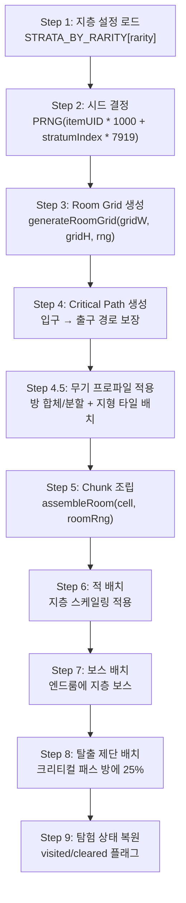

# 아이템계 기억의 지층 생성 시스템 (Item World Memory Strata Generation System)

## 0. 필수 참고 자료 (Mandatory References)

* Project Definition: `Documents/Terms/Project_Vision_Abyss.md`
* 월드 절차적 생성: `Documents/System/System_World_ProcGen.md` (SYS-WLD-05)
* 아이템 레어리티: `Documents/System/System_Equipment_Rarity.md`
* 내러티브 & 세계관: `Documents/Design/Design_Narrative_Worldbuilding.md` (D-12)
* 지층 설정 코드: `game/src/data/StrataConfig.ts` (SSoT)
* 이노센트 시스템: `Documents/System/System_Innocent_Core.md` (Phase 2)

---

## 구현 현황 (Implementation Status)

> **최근 업데이트:** 2026-03-24
> **문서 상태:** `작성 중 (Draft)`
> **3-Space:** Item World
> **기둥:** 야리코미

| 기능 ID       | 분류   | 기능명 (Feature Name)                   | 우선순위 | 구현 상태  | 비고 (Notes)                    |
| :------------ | :----- | :-------------------------------------- | :------: | :--------- | :------------------------------ |
| IWF-01-A      | 시스템 | 시드 기반 지층 생성 파이프라인          |    P1    | ✅ 구현    | StrataConfig + PRNG 기반        |
| IWF-02-A      | 시스템 | 지층별 Room Grid 레이아웃 생성         |    P1    | ✅ 구현    | 4×4 고정, 통합 수직 연결        |
| IWF-03-A      | 시스템 | Critical Path 알고리즘                  |    P1    | ✅ 구현    | 입구 → 출구 경로 보장           |
| IWF-04-A      | 시스템 | Chunk 조립 시스템                       |    P1    | ✅ 구현    | ChunkAssembler 재사용           |
| IWF-05-A      | 시스템 | 적 배치 및 지층별 난이도 스케일링      |    P1    | ✅ 구현    | StratumDef 기반 HP/ATK 배율    |
| IWF-06-A      | 시스템 | 탈출 제단 (Escape Altar)               |    P1    | ✅ 구현    | 안전 귀환 + 진행 보존           |
| IWF-07-A      | 시스템 | 지층별 보스 (기억의 문)                |    P1    | ✅ 구현    | 보스 처치 → 다음 지층 해금      |
| IWF-08-A      | 시스템 | 탐험 상태 영속 (ItemWorldProgress)     |    P1    | ✅ 구현    | visited/cleared/deepestUnlocked |
| IWF-09-A      | 시스템 | 이노센트 배치                           |    P2    | ⬜ 제작 필요 | 야생 이노센트                  |
| IWF-10-A      | 시스템 | 멀티플레이 스케일링                     |    P1    | ⬜ 제작 필요 | 1~4인 체력 보정                |
| IWF-11-A      | 시스템 | 재귀 진입 시드 충돌 방지               |    P2    | ⬜ 제작 필요 | 최대 깊이 3                    |
| IWF-12-A      | 시스템 | 심연 (Abyss) — Ancient 최심층          |    P2    | ⬜ 제작 필요 | 무한 + 닻(Anchor) 시스템       |
| IWF-13-A      | 시스템 | 현실 침식 시각 효과 (Reality Erosion)  |    P2    | ⬜ 제작 필요 | 지층 깊이별 환경 왜곡          |
| IWF-14-A      | 시스템 | 미스터리 룸 / 이벤트                   |    P2    | ⬜ 제작 필요 | 특수 이벤트 방                 |
| IWF-15-A      | 지형   | 얼음 타일 (ID 4)                       |    P1    | ⬜ 제작 필요 | 마찰 ×0.2, 넉백 ×2            |
| IWF-15-B      | 지형   | 가시 타일 (ID 5)                       |    P1    | ⬜ 제작 필요 | HP 10% 고정 피해, 위 넉백      |
| IWF-15-C      | 지형   | 부서지는 바닥 (ID 9)                   |    P1    | ⬜ 제작 필요 | 0.5초 후 붕괴, 5초 재생        |
| IWF-16-A      | 지형   | 거미줄 타일 (ID 6)                     |    P2    | ⬜ 제작 필요 | 속도 ×0.3, 화염 소각           |
| IWF-16-B      | 지형   | 상승 기류 타일 (ID 7)                  |    P2    | ⬜ 제작 필요 | vy -150 지속, 투사체 편향       |
| IWF-16-C      | 지형   | 어둠 타일 (ID 8)                       |    P2    | ⬜ 제작 필요 | 시야 2타일 제한, 스파크 조명    |
| IWF-17-A      | 프로파일 | 무기별 공간 프로파일 적용              |    P1    | ⬜ 제작 필요 | 방 합체/분할 + 지형 배치       |
| IWF-17-B      | 프로파일 | 테마별 지형 배치 규칙                  |    P1    | ⬜ 제작 필요 | T-코드별 지형 확률 테이블       |

---

## 1. 개요 (Concept)

### 1.1. 설계 의도 (Intent)

아이템계(Item World)는 장비 아이템 내부에 존재하는 **기억의 지층(Memory Strata)** 구조의 절차적 던전이다. 인셉션의 "꿈 속의 꿈" 구조에서 영감을 받아, 각 지층은 아이템의 기억이 더 깊어지는 독립된 미니 메트로베니아 맵이다.

> **"아이템의 기억 속으로 다이빙한다. 깊이 들어갈수록 기억은 원초적이 되고, 세계는 더 적대적으로 변한다."**

기존 디스가이아의 "100층 선형 구조"를 대체하는 이유:

| 문제 (100층) | 해법 (기억의 지층) |
| :--- | :--- |
| 선형 반복이 메트로베니아의 비선형 탐험과 충돌 | 각 지층이 비선형 Room Grid — 분기, 비밀방, 루프 |
| 플랫포머에서 "층"이라는 단위가 부자연스러움 | "지층"은 공간의 깊이를 구조적으로 표현 |
| 100개 맵 순차 클리어는 지루함 | 2~4개 지층, 각각이 밀도 있는 탐험 |
| 세션 길이 강제 | 짧은 세션(지층 1 탐험)부터 긴 세션(전 지층 관통)까지 자유 |

### 1.2. 설계 근거 (Reasoning)

| 레퍼런스 | 차용 요소 | Project Abyss 적용 |
| :------- | :-------- | :------------------ |
| 인셉션 (영화) | 꿈의 층위, 시간 팽창, 림보, 킥, 투영체 | 지층 구조, 깊이별 맵 확장, 심연(Abyss), 탈출 제단, 적대도 상승 |
| 디스가이아 시리즈 | 아이템계, 레어리티별 깊이, 이노센트 | 레어리티별 지층 수, 아이템 성장, 이노센트(Phase 2) |
| 할로우 나이트 | 비선형 연결 맵, 깊이 표현 | 각 지층 내 비선형 Room Grid |
| 스펠렁키 | Room Grid + Critical Path + Chunk 조립 | Room Grid 기반 레이아웃 + Critical Path 보장 + Chunk 풀 조립 |
| 에르다의 기억의 두드림 (Echo Strike) | 타격 방식이 시드를 결정 | 에르다가 모루/제단에 Echo를 내려치는 강도와 리듬이 PRNG 시드의 초기값에 영향을 준다. 같은 아이템이라도 에르다가 두드리는 방식에 따라 깨어나는 기억이 달라진다 |

### 1.3. 3대 기둥 정렬

| 기둥 | 기억의 지층에서의 구현 |
| :--- | :--- |
| 메트로베니아 탐험 | 각 지층이 비선형 미니 메트로베니아. 분기 탐험, 비밀방, 되돌아가기 |
| 아이템계 야리코미 | 레어리티 = 지층 수 = 깊이. 여러 번 진입하며 점진적 확장. 무한 파밍 동기 |
| 온라인 멀티플레이 | 깊은 지층은 파티 협동. 탈출 제단 위치 공유. 지층 보스 역할 분담 |

---

## 2. 메커닉 (Mechanics)

### 2.1. 기억의 지층 구조 (Memory Strata Structure)

```
현실 (월드)
  │
  ▼ [아이템계 진입 — "다이빙"]
  │
  ╔══════════════════════════════════════╗
  ║  지층 1: 표층 기억 (Surface Memory)  ║
  ║  ─ 아이템의 가장 최근 기억           ║
  ║  ─ 안정적, 현실에 가까운 환경        ║
  ║  ─ 4×4 Room Grid (표준 16방)        ║
  ╠══════════════════════════════════════╣
  ║      ▼ 보스: 기억의 문 (Gate) ▼     ║
  ╠══════════════════════════════════════╣
  ║  지층 2: 깊은 기억 (Deep Memory)     ║
  ║  ─ 아이템의 핵심 사건                ║
  ║  ─ 환경에 변화 시작 (어둡고 불안정)  ║
  ║  ─ 4×4 Room Grid (구조 변형 시작)   ║
  ╠══════════════════════════════════════╣
  ║      ▼ 보스: 기억의 문 (Gate) ▼     ║
  ╠══════════════════════════════════════╣
  ║  지층 3+: 원초 기억 (Primal Memory)  ║
  ║  ─ 아이템이 만들어진 순간의 기억     ║
  ║  ─ 4×4 Room Grid (심연 침식 변형)   ║
  ╠══════════════════════════════════════╣
  ║      ▼ 최종 보스: 기억의 핵 ▼       ║
  ╠══════════════════════════════════════╣
  ║  ??? 심연 (Abyss) — Ancient 전용    ║
  ║  ─ Phase 2 구현                      ║
  ╚══════════════════════════════════════╝
```

### 2.2. 레어리티별 지층 구성 (Strata by Rarity)

> SSoT: `game/src/data/StrataConfig.ts`

**Grid 크기:** 모든 지층 4×4 고정 (16셀). 레어리티 차이는 **지층 수**로 표현한다.

| 레어리티 | 지층 수 | Grid 크기 | 보스 수 | EXP 배율 (지층별) | 심연 |
| :--- | :---: | :--- | :---: | :--- | :---: |
| Normal | 2 | 4×4 → 4×4 | 1 + 핵 | 1.0x → 1.5x | ✕ |
| Magic | 3 | 4×4 → 4×4 → 4×4 | 2 + 핵 | 1.0x → 1.5x → 2.0x | ✕ |
| Rare | 3 | 4×4 → 4×4 → 4×4 | 2 + 핵 | 1.0x → 1.5x → 2.5x | ✕ |
| Legendary | 4 | 4×4 → 4×4 → 4×4 → 4×4 | 3 + 핵 | 1.0x → 1.5x → 2.5x → 3.5x | ✕ |
| Ancient | 4+심연 | 4×4 → 4×4 → 4×4 → 4×4 + ∞ | 3 + 핵 + 심연 보스 | 1.0x → 1.5x → 2.5x → 3.5x | ✔ |

**4×4 고정 채택 근거:**
- 3×3(9방)은 탐험 선택지 부족, 5×5(25방)은 횡스크롤에서 지루함 유발
- 16방은 지층당 10~15분 세션에 최적 (플레이어 시간 예측 가능)
- Grid 크기 1종으로 생성/밸런싱/테스트 비용 1/3로 절감
- **깊어지는 느낌은 Grid 크기가 아니라 내부 변화로 표현** (§2.2.1 참조)

#### 2.2.1. 지층 깊이별 내부 변화 (Grid 고정, 콘텐츠 변화)

같은 4×4 Grid지만 지층이 깊어질수록 내부가 변한다:

| 지층 | 조명 | 적 밀도 | 환경 변화 | 방 구조 | 느낌 |
| :--- | :--- | :--- | :--- | :--- | :--- |
| 지층 1 | 밝음 | 낮음 (방당 1~2) | 안정적 | 표준 방 16개 | 편안한 탐색 |
| 지층 2 | 어두워짐 | 보통 (방당 2~3) | 함정 등장, 색조 변화 | 일부 방 연결 변형 | 긴장 시작 |
| 지층 3 | 어둡고 불안정 | 높음 (방당 3~4) | 환경 왜곡, 벽 균열 | 분기 증가, 막다른 길 | 미로 속으로 |
| 지층 4 | 심연 침식 | 매우 높음 | 바닥 붕괴, 심연 파티클 | 방 합체/변형 | 세계가 무너짐 |

#### 2.2.2. 무기 카테고리별 공간 프로파일 (Weapon Spatial Profile)

4×4 Grid는 고정하되, **무기 카테고리에 따라 방의 형태와 배치가 달라진다.** 이것이 "아이템의 기억이 다른 공간 경험을 만든다"의 핵심 메커니즘이다.

4×4의 16셀은 **합체(Merge)와 분할(Split)**이 가능하다:
- 합체: 인접 셀 2~4개를 합쳐 큰 방 1개로 (대검, 활)
- 분할: 셀 1개를 내부 벽으로 나눠 좁은 방 2~3개로 (단검)
- 표준: 셀 = 방 1:1 (검, 창)

| 무기 카테고리 | 실제 방 수 | 방 비율 | 천장 높이 | 특수 구조 | 공간 성격 | 에르다의 체감 |
| :--- | :---: | :--- | :--- | :--- | :--- | :--- |
| 검 (Sword) | 16 (표준) | 1:1 정방 | 보통 | 없음 | 균형 잡힌 탐험 | "잘 설계된 작업장이네. 동선이 막히질 않아." |
| 단검 (Dagger) | 20~24 (분할) | 1:2 좁고 긴 | 낮음 | 좁은 틈새, 막다른 길 | 미로 — 빠른 이동, 급습 | "좁은데 환기는 좋다. 소형 공방 같아." |
| 대검 (Greatsword) | 6~8 (합체) | 2:1 넓음 | 높음 | 넓은 전장, 소수 강적 | 전장 — 느린 진행, 무거운 타격 | "넓다. 대형 용광로급 공간. 발걸음 소리가 울려." |
| 도끼 (Axe) | 16 (표준) | 1:1 정방 | 보통 | 파괴 가능 벽/바닥 | 개척 — 길을 만드는 경험 | "벽이 약하네. 이 소재, 담금질이 덜 됐어." |
| 창 (Spear) | 12~14 (수평 합체) | 1:3 횡장 | 보통 | 긴 수평 복도 | 돌진 — 사거리가 의미 있는 공간 | "일자로 뚫려 있다. 수로 같기도 하고." |
| 지팡이 (Staff) | 16 (표준) | 불규칙 | 높음 | 부유 플랫폼, 수직 구조 | 마탑 — 위로 오르는 탐험 | "수직 구조물인데... 이거 지지 구조가 말이 안 되잖아." |
| 활 (Bow) | 8~10 (합체) | 2:1 넓음 | 매우 높음 | 고저차 지형, 엄폐물 | 사냥터 — 높은 곳을 잡는 전투 | "천장이 엄청 높아. 이 아이템, 야외 기억을 갖고 있네." |
| 채찍 (Whip) | 14~16 | 1:1~1:2 혼합 | 높음 | 스윙 포인트, 갭 | 유동 — 매달리고 넘는 이동 | "발판이 왜 이렇게 띄엄띄엄이야... 뛰어다니는 걸 좋아했던 무기인가." |

**설계 원칙:**
> "같은 4×4 Grid, 같은 T-HOME 테마의 부엌이라도, 검의 부엌과 단검의 부엌은 **걷는 경험이 다르다.** 검의 부엌은 넉넉한 조리대 사이를 걷지만, 단검의 부엌은 좁은 선반 틈새를 뛰어다닌다."

**무기별 전투 인카운터 배치:**

| 무기 | 적 배치 | 인카운터 리듬 | 보스 아레나 |
| :--- | :--- | :--- | :--- |
| 검 | 분산 3~4마리 | 균일 간격 | 표준 방 |
| 단검 | 코너 뒤 2~3 밀집 | 급습→급해결 | 좁은 복도 연속 보스 |
| 대검 | 한 번에 5~7 밀려옴 | 파도(wave) | 합체 대형 아레나 |
| 도끼 | 장애물 뒤 3~4 | 파괴→전투 교차 | 파괴로 약점 노출 |
| 창 | 긴 줄 대형 4~5 | 행진(march) | 긴 횡장 복도 |
| 지팡이 | 높은 곳 2~3 강적 | 퍼즐+전투 혼합 | 수직 타워 |
| 활 | 여러 높이 4~6 산개 | 고지 점령전 | 넓고 높은 사냥터 |
| 채찍 | 갭 사이 3~4 | 이동 중 전투 | 스윙으로만 접근 가능 |

#### 2.2.3. 지형 타일 시스템 (Terrain Tile System)

방 내부의 지형 타일이 이동과 전투 경험을 근본적으로 변화시킨다. 모든 지형은 월드와 아이템계 양쪽에서 사용 가능하다.

**타일 ID 체계:**

> SSoT: `game/src/core/Physics.ts`

| ID | 이름 | 이동 효과 | 전투 효과 | 구현 |
| :---: | :--- | :--- | :--- | :---: |
| 0 | **빈 공간** | 자유 이동 | 표준 | ✅ |
| 1 | **솔리드** | 이동 불가 | 넉백 벽 충돌 정지 | ✅ |
| 2 | **물 (Water)** | 속도 ×0.5, 중력 ×0.3, 부유 느낌 | (미정의 — P2) | ✅ |
| 3 | **원웨이 플랫폼** | 위에서 착지, 아래서 통과 | 표준 | ✅ |
| 4 | **얼음 (Ice)** | 마찰 ×0.2, 관성 이동. 감속 극도로 느림 | 넉백 거리 ×2 (적·플레이어 양쪽) | P1 |
| 5 | **가시 (Spike)** | 접촉 시 고정 피해 (최대 HP 10%) + 위로 약 넉백 | 적도 동일 피해. 넉백으로 적을 밀어넣기 가능 | P1 |
| 6 | **거미줄 (Web)** | 속도 ×0.3, 점프 ×0.5. 공중 진입 시 느린 낙하 | 적도 동일 감속. 화염 공격으로 소각(→ID 0) 가능 | P2 |
| 7 | **상승 기류 (Updraft)** | vy에 -150 지속 추가. 점프 없이 상승 | 적 투사체 궤도 상향 편향. 공중 체공 시간 증가 | P2 |
| 8 | **어둠 (Darkness)** | 물리 = 빈 공간과 동일. 시야 반경 2타일로 제한 | 적 텔레그래프 안 보임. 히트 스파크(L9)가 순간 조명 역할 | P2 |
| 9 | **부서지는 바닥 (Crumble)** | 밟으면 0.5초 후 ID 0으로 변환(재생 5초) | 도끼 강공격으로 즉시 파괴. 적도 함께 추락 | P1 |

**지형별 상세 규칙:**

**ID 4 — 얼음:**
- `friction = 0.2` (표준 `1.0`). 가속·감속 모두 적용
- 넉백 벡터에 `×2.0` 배율. 적을 벽까지 밀 수 있음
- 적 AI: 얼음 위에서 이동 패턴 불안정 (미끄러짐 시뮬레이션)
- 시각: 반투명 하늘색 타일, 위를 지나갈 때 미끄러지는 파티클

**ID 5 — 가시:**
- 접촉 판정: 엔티티 하단이 가시 타일 상단과 겹칠 때
- 피해: `max(1, maxHP × 0.10)` 고정. 방어력 무시
- 무적 시간: 피격 후 0.5초 (연속 피해 방지)
- 넉백: vy = -120 (위로 튕김). 가시에서 탈출하는 느낌
- 적용: 솔리드 위에 배치 (바닥 가시) 또는 천장에 배치 (천장 가시)

**ID 6 — 거미줄:**
- 진입 즉시 `speedMult = 0.3`, `jumpMult = 0.5`
- 공중에서 진입 시 `gravity × 0.15` (매우 느린 낙하 = 낙사 방지)
- 화염 속성 공격(스킬/원소) 접촉 시 소각: 타일 ID → 0, 불꽃 파티클 재생
- 소각 후 재생 없음 (영구 제거 = 새 경로 개척)

**ID 7 — 상승 기류:**
- 타일 영역 내 모든 엔티티에 `vy += -150 × dt` 지속 적용
- 점프 입력과 중첩 시 `vy` 합산 (매우 높이 뜀)
- 투사체도 영향받음: 화살, 마법 탄환의 궤도 상향 편향
- 시각: 아래→위 방향 파티클 스트림, 투명 타일

**ID 8 — 어둠:**
- 물리 효과 없음. 순수 시각 효과
- 어둠 타일 영역 진입 시 렌더링 마스크 활성화: 플레이어 중심 반경 32px(2타일)만 표시
- 히트 스파크(SYS-CMB-07 L9)가 발생하면 반경 48px 순간 밝아짐 (200ms)
- 적 피격 플래시(L11)도 순간 조명 역할
- 적의 공격 예비 동작(Tell)이 시야 밖이면 표시 안 됨 → SFX(L14 피격 반응)로만 인지

**ID 9 — 부서지는 바닥:**
- 밟는 순간 흔들림 시작 (시각 피드백 0.5초)
- 0.5초 후 타일 ID → 0 + 파편 파티클 낙하
- 5초 후 재생 (타일 ID → 9 복원, 서서히 나타남)
- 도끼 카테고리 무기의 하방 공격(또는 강공격): 접촉 즉시 파괴 (0.5초 대기 없음)
- 적은 부서지는 바닥을 인식하지 못함 (의도적 — 전략적 함정 유도)

---

**지형 조합 상호작용 매트릭스:**

| 조합 | 효과 | 경험 |
| :--- | :--- | :--- |
| 물 + 얼음 (인접) | 물 표면 위 얼음 = 원웨이 플랫폼처럼 걸을 수 있음 | 물 위를 건너는 숏컷 |
| 물 + 상승 기류 (수직) | 수면 아래 기류 → 플레이어가 수면 위로 솟구침 | 물속 탈출 메커니즘 |
| 어둠 + 가시 | 안 보이는 가시. 착지음(SFX) 변화로만 파악 | 극한 긴장 |
| 얼음 + 가시 (인접) | 미끄러져 가시 위로. 멈출 수 없음 | 경로 계획 강제 |
| 부서지는 바닥 + 물 (하단) | 바닥 부서지면 물에 빠짐 = 느려지지만 안전 | 리스크 선택 |
| 거미줄 + 상승 기류 (수직) | 거미줄이 기류를 차단. 소각하면 기류 활성화 | 환경 퍼즐 |
| 어둠 + 부서지는 바닥 | 어디가 부서질지 모름 | 탐색 긴장 |
| 부서지는 바닥 + 가시 (하단) | 바닥 부서지면 가시 위로 추락 | 트랩 콤보 |
| 얼음 + 상승 기류 | 미끄러지며 떠오름 = 통제 불가 이동 | 혼돈의 재미 |

---

**무기 카테고리별 지형 친화도:**

| 무기 | 유리한 지형 | 불리한 지형 | 창발 전략 |
| :--- | :--- | :--- | :--- |
| 검 | 모두 균일 | 특별히 없음 | 기준 경험 |
| 단검 | 어둠(빠른 회피), 부서지는 바닥(빠른 통과) | 거미줄(속도 무력화) | 어둠 속 급습 |
| 대검 | 얼음(넉백×2로 벽까지), 가시(넉백으로 적 밀어넣기) | 부서지는 바닥(느려서 추락) | 지형을 무기로 활용 |
| 도끼 | 부서지는 바닥(즉시 파괴), 거미줄(소각 가능) | 얼음(감속 느림) | 지형 자체를 변형 |
| 창 | 상승 기류(공중 찌르기 체공) | 좁은 공간(사거리 무의미) | 수직 전투 |
| 지팡이 | 상승 기류(체공+원거리), 어둠(마법 빛) | 거미줄(캐스팅 중 피격) | 안전 거리 확보 |
| 활 | 어둠(탐색 사격으로 조명), 높은 지형 | 물(느린 이동 중 피격) | 히트 스파크 조명 전술 |
| 채찍 | 상승 기류(스윙 연장), 높은 천장 | 얼음(착지 미끄러짐) | 공중 체인 이동 |

---

**테마별 지형 기본 배치 규칙:**

아이템계 지층 생성 시, 테마 코드에 따라 특정 지형의 출현 확률이 변한다.

| 테마 | 기본 지형 | 확률 높음 | 확률 낮음 | 절대 없음 |
| :--- | :--- | :--- | :--- | :--- |
| T-HOME | 솔리드, 원웨이 | 거미줄 (오래된 부엌) | 가시, 어둠 | 상승 기류 |
| T-MILITARY | 솔리드, 원웨이 | 가시 (함정), 어둠 (야간 순찰) | 물, 거미줄 | — |
| T-FORGE | 솔리드 | 얼음 없음. 가시 (불꽃 파편), 부서지는 바닥 (노후 구조물) | 물, 거미줄 | 얼음 |
| T-FOREST | 솔리드, 원웨이 (나뭇가지) | 거미줄, 물 (개울) | 얼음 | — |
| T-SCHOLAR | 솔리드, 원웨이 (선반) | 어둠 (서고 깊숙한 곳), 거미줄 (오래된 책) | 물, 가시 | — |
| T-TRADE | 솔리드, 원웨이 (화물) | 부서지는 바닥 (낡은 창고), 물 (항구) | 어둠 | — |
| T-NOBLE | 솔리드, 원웨이 | 얼음 (대리석 바닥), 어둠 (비밀 통로) | 가시, 거미줄 | — |
| T-UNDEAD | 솔리드 | 가시 (뼈 파편), 어둠 (카타콤), 부서지는 바닥 (관뚜껑) | 물, 얼음 | 상승 기류 |
| T-WAR | 솔리드 | 가시 (잔해), 부서지는 바닥 (포격 흔적), 어둠 (참호) | 거미줄 | — |
| T-SEA | 물 (기본 대량) | 상승 기류 (해류), 얼음 (심해 냉기) | 가시, 어둠 | 거미줄 |
| **기억의 방랑자 보너스** | *(특수 진입 조건)* | 진입 시 테마 주력 지형 출현 확률 +15%. 추가로 해당 방랑자가 보유한 속성 지형(불 → 가시+부서지는 바닥 / 물 → 물+상승 기류 / 번개 → 어둠+얼음)이 복합 배치됨 | — | — |

#### 2.2.4. 에르다 시점의 지층 경험 (Erda's Stratum Perspective)

에르다 ven-Nacht는 아이템의 기억 속을 걷는 동안 대장장이의 직업적 감수성으로 공간을 읽는다. 지층이 깊어질수록 그 시선은 기술적 호기심에서 무게감으로, 다시 침묵으로 변한다. 이 감정 변화는 내레이션, 환경음, 에르다의 표정 스프라이트 변화로 표현한다.

| 지층 | 에르다의 감정 상태 | 대표 독백 | 연출 방향 |
| :--- | :--- | :--- | :--- |
| 지층 1 — 표층 기억 | **코미디 / 직업적 호기심** | "이 구조물 접합부 상태가 좋은데. 누가 만든 거지?" | 밝은 조명, 에르다 눈 반짝이는 이모트. 대사 톤이 가볍고 빠름 |
| 지층 2 — 깊은 기억 | **의문 / 공감** | "이 기억... 누구의 거지? 혼자 이걸 들고 다녔나." | 조명 살짝 어두워짐, 독백 속도가 느려짐. 벽 텍스처에 낡은 흔적 강조 |
| 지층 3 — 원초 기억 | **무게감 / 경계** | "여기 아래에 뭔가 더 있어. 아직 이름도 없는 것이." | 어두운 조명, 에르다 표정 긴장. 환경음에 저주파 웅얼거림 추가 |
| 지층 4 / 심연 — 최심층·Abyss | **진지 / 경외** | "스승님도 이런 곳까지 왔을까. ...왔겠지." | 침식 파티클 극대화. 독백 없이 긴 정적 후 대사. 에르다 걸음 속도 -10% |

**설계 의도:**
- 지층 1의 코미디 독백은 플레이어를 공간에 빠르게 정착시키는 온보딩 역할을 한다
- 지층 4의 침묵과 스승 언급은 에르다의 서사적 동기를 자연스럽게 드러낸다
- 대사 톤 변화가 난이도 상승 경고를 내러티브로 대신한다 (UI 경고 최소화)

---

**지층 깊이별 특수 지형 밀도 변화:**

깊은 지층일수록 특수 지형 출현 확률이 높아져 난이도와 다양성이 증가한다.

| 지층 | 특수 지형 타일 비율 (방 바닥 면적 대비) | 비고 |
| :--- | :---: | :--- |
| 지층 1 | 5~10% | 특수 지형 맛보기. 1~2종만 등장 |
| 지층 2 | 10~20% | 테마 주력 지형 본격 등장 |
| 지층 3 | 20~30% | 조합 지형 등장 시작 (얼음+가시 등) |
| 지층 4 | 30~40% | 복합 지형 + 심연 침식 |

### 2.3. 생성 파이프라인 (Generation Pipeline)



### 2.4. 시드 체계 (Seed System)

```
지층 Grid 시드: PRNG(itemUID * 1000 + stratumIndex * 7919)
방 내부 시드:   PRNG(itemUID * 10000 + col * 100 + row + stratumIndex * 1000000)
적 스폰 시드:   PRNG(itemUID * 999 + col * 77 + row * 33 + i + stratumIndex * 500000)
```

- 동일 아이템의 동일 지층은 항상 같은 맵을 생성한다 (결정적 생성)
- 지층 인덱스가 시드에 포함되어 지층 간 맵 충돌 없음

### 2.5. 적 스케일링 (Enemy Scaling)

```
enemyHP  = baseHP  * (1 + roomDistance * 0.2) * stratumDef.enemyHpScale
enemyATK = baseATK * (1 + roomDistance * 0.2) * stratumDef.enemyAtkScale
enemyCount = 2 + floor(roomDistance * 0.5) + stratumDef.enemyCountBonus
```

| 지층 | HP 배율 | ATK 배율 | 추가 적 수 | 보스 HP 배율 | 보스 ATK 배율 |
| :--- | :--- | :--- | :--- | :--- | :--- |
| 1 (표층) | ×1.0 | ×1.0 | +0 | ×4 | ×2 |
| 2 (깊은) | ×1.5~1.6 | ×1.3~1.4 | +1 | ×6 | ×2.5 |
| 3 (원초) | ×2.2~2.5 | ×1.8~2.0 | +1~2 | ×8~10 | ×3~3.5 |
| 4 (최심) | ×3.5 | ×2.8 | +3 | ×14 | ×4.5 |

### 2.6. 인셉션 메커닉: 킥과 탈출 제단 (Kick & Escape Altar)

**탈출 제단:**
- 비시작/비보스 크리티컬 패스 방에 25% 확률로 스폰
- UP 키로 상호작용 → 안전 귀환
- 귀환 시: 모든 보상 보존 + `lastSafeStratum` 기록
- 다음 진입 시: `lastSafeStratum` 지층에서 재개

**사망 시:**
- 획득 EXP 30% 손실
- `lastSafeStratum = currentStratum - 1` (이전 지층으로 후퇴)
- 아이템계 종료

### 2.7. 탐험 상태 영속 (Persistent Exploration)

> SSoT: `game/src/items/ItemInstance.ts` — `ItemWorldProgress`

```typescript
interface ItemWorldProgress {
  deepestUnlocked: number;           // 해금된 가장 깊은 지층 인덱스
  visitedRooms: Record<number, string[]>; // 지층별 방문 방 목록
  clearedRooms: Record<number, string[]>; // 지층별 클리어 방 목록
  lastSafeStratum: number;           // 마지막 안전 귀환 지층
}
```

- 방 이동 시 자동 persist (visitedRooms/clearedRooms 갱신)
- 보스 처치 시 `deepestUnlocked` 갱신
- 탈출 제단/사망 시 `lastSafeStratum` 갱신
- `SaveManager`를 통해 localStorage에 영속 저장

### 2.8. 세션 유연성 (Session Flexibility)

```
짧은 세션 (10분):  지층 1 탐험 → 비밀방 발견 → 탈출 제단으로 귀환
보통 세션 (25분):  지층 1 → 보스 돌파 → 지층 2 진입 → 탈출 제단 귀환
긴 세션 (50분+):   지층 1→2→3 관통 → 기억의 핵 보스 도전
야리코미 (∞):      Ancient 심연 반복 진입 (Phase 2)
```

---

## 3. 규칙 (Rules)

### 3.1. 지층 진행 규칙 (Stratum Progression Rules)

| 규칙 ID | 규칙 | 예외 |
| :--- | :--- | :--- |
| IWF-R01 | 보스 처치 시 다음 지층이 영구 해금된다 | 없음 |
| IWF-R02 | 해금된 지층까지만 진입 가능 | 없음 |
| IWF-R03 | 재진입 시 lastSafeStratum에서 시작 | 첫 진입은 항상 지층 1 |
| IWF-R04 | 탈출 제단 사용 시 현재 지층이 lastSafeStratum이 된다 | 없음 |
| IWF-R05 | 사망 시 lastSafeStratum이 1 감소한다 (최소 0) | 지층 1에서 사망 시 0 유지 |
| IWF-R06 | 최종 지층 보스 처치 시 아이템 레벨 +1 보너스 | 없음 |
| IWF-R07 | ESC로 아이템계를 포기할 수 있다 (보상 보존 없음) | 탈출 제단 사용 시 보상 보존 |

### 3.2. Room Grid 규칙 (Room Grid Rules)

| 규칙 ID | 규칙 | 예외 |
| :--- | :--- | :--- |
| IWF-R10 | Grid 크기는 StratumDef.gridWidth/Height로 결정 | 없음 |
| IWF-R11 | Critical Path는 항상 입구→출구 연결 보장 (Always Winnable) | 없음 |
| IWF-R12 | 탐험한 방은 재진입 시 visited/cleared 상태 유지 | 없음 |
| IWF-R13 | 클리어한 방 재방문 시 적이 리스폰되지 않음 | 없음 |

### 3.3. 보스 규칙 (Boss Rules)

| 규칙 ID | 규칙 | 예외 |
| :--- | :--- | :--- |
| IWF-R20 | 각 지층의 엔드룸에 보스 1체 | 없음 |
| IWF-R21 | 보스 스케일: StratumDef.bossHpScale/bossAtkScale | 없음 |
| IWF-R22 | 보스 시각 크기: 1.5 + stratumIndex × 0.2 | 없음 |
| IWF-R23 | 보스 처치 보상: 방 클리어 EXP + BOSS_BONUS_EXP × expMultiplier | 없음 |
| IWF-R24 | 보스 처치 후 출구 활성화 → 다음 지층 하강 또는 아이템계 탈출 | 최종 지층은 탈출 |

### 3.4. 탈출 제단 규칙 (Escape Altar Rules)

| 규칙 ID | 규칙 | 예외 |
| :--- | :--- | :--- |
| IWF-R30 | 비시작/비보스 크리티컬 패스 방에 25% 확률로 스폰 | 없음 |
| IWF-R31 | 결정적 배치 (시드 기반 — 같은 방은 항상 같은 결과) | 없음 |
| IWF-R32 | UP 키로 상호작용 | 없음 |
| IWF-R33 | 사용 시 모든 보상 보존 + 안전 귀환 | 없음 |

---

## 4. 데이터 및 파라미터 (Parameters)

### 4.1. 지층 설정 (Strata Config) — SSoT: `StrataConfig.ts`

```yaml
strata_by_rarity:
  normal:   # 2지층, 4×4 고정
    - { grid: 4x4, enemyHp: 40, enemyAtk: 8,  bonus: +0, bossHp: 160, bossAtk: 16, exp: 1.0x }
    - { grid: 4x4, enemyHp: 50, enemyAtk: 10, bonus: +1, bossHp: 200, bossAtk: 20, exp: 1.5x }
  magic:    # 3지층, 4×4 고정
    - { grid: 4x4, enemyHp: 60,  enemyAtk: 12, bonus: +0, bossHp: 240, bossAtk: 24, exp: 1.0x }
    - { grid: 4x4, enemyHp: 75,  enemyAtk: 15, bonus: +1, bossHp: 300, bossAtk: 30, exp: 1.5x }
    - { grid: 4x4, enemyHp: 90,  enemyAtk: 18, bonus: +1, bossHp: 360, bossAtk: 36, exp: 2.0x }
  rare:     # 3지층, 4×4 고정
    - { grid: 4x4, enemyHp: 90,  enemyAtk: 18, bonus: +0, bossHp: 360, bossAtk: 36, exp: 1.0x }
    - { grid: 4x4, enemyHp: 110, enemyAtk: 22, bonus: +1, bossHp: 440, bossAtk: 44, exp: 1.5x }
    - { grid: 4x4, enemyHp: 130, enemyAtk: 25, bonus: +2, bossHp: 520, bossAtk: 50, exp: 2.5x }
  legendary: # 4지층, 4×4 고정
    - { grid: 4x4, enemyHp: 130, enemyAtk: 25, bonus: +0, bossHp: 520, bossAtk: 50, exp: 1.0x }
    - { grid: 4x4, enemyHp: 155, enemyAtk: 30, bonus: +1, bossHp: 620, bossAtk: 60, exp: 1.5x }
    - { grid: 4x4, enemyHp: 180, enemyAtk: 35, bonus: +2, bossHp: 720, bossAtk: 70, exp: 2.5x }
    - { grid: 4x4, enemyHp: 220, enemyAtk: 42, bonus: +3, bossHp: 880, bossAtk: 84, exp: 3.5x }
  ancient:  # 4지층 + 심연, 4×4 고정
    - { grid: 4x4, enemyHp: 180, enemyAtk: 35, bonus: +0, bossHp: 720,  bossAtk: 70,  exp: 1.0x }
    - { grid: 4x4, enemyHp: 220, enemyAtk: 42, bonus: +1, bossHp: 880,  bossAtk: 84,  exp: 1.5x }
    - { grid: 4x4, enemyHp: 270, enemyAtk: 50, bonus: +2, bossHp: 1080, bossAtk: 100, exp: 2.5x }
    - { grid: 4x4, enemyHp: 330, enemyAtk: 60, bonus: +3, bossHp: 1320, bossAtk: 120, exp: 3.5x }
    # Phase 2: 심연 (Abyss) 추가
```

### 4.2. EXP 기본값 (Base EXP Values)

```yaml
exp_base:
  kill: 30           # 몬스터 처치 기본 EXP
  room_clear: 120    # 방 클리어 기본 EXP
  room_pass: 60      # 방 통과 (미클리어) 기본 EXP
  boss_bonus: 600    # 보스 처치 추가 EXP
  # 실제 EXP = base × stratumDef.expMultiplier
```

### 4.3. 사망 페널티 파라미터 (Death Penalty Parameters)

```yaml
death_penalty:
  exp_loss_ratio: 0.30    # 획득 EXP의 30% 손실
  stratum_rollback: 1     # lastSafeStratum이 1 감소
  minimum_stratum: 0      # 최소 귀환 지층
```

### 4.4. 탈출 제단 파라미터 (Escape Altar Parameters)

```yaml
escape_altar:
  spawn_chance: 0.25          # 적격 방당 25% 확률
  eligible_rooms: "critical_path AND NOT start AND NOT end"
  interaction_key: "JUMP (UP)"
```

### 4.5. 멀티플레이 스케일링 파라미터 (Multiplayer Scaling) — Phase 3

```yaml
multiplayer_scaling:
  party_size_2: { hp: 1.6x, count: +1, reward: 1.2x }
  party_size_3: { hp: 2.2x, count: +2, reward: 1.4x }
  party_size_4: { hp: 2.8x, count: +3, reward: 1.6x }
```

---

## 5. 예외 처리 (Edge Cases)

### 5.1. 탐험 상태 관련

| 케이스 | 처리 |
| :--- | :--- |
| worldProgress가 없는 기존 아이템 | `getOrCreateWorldProgress()`가 자동 초기화 |
| SaveData v1 (worldProgress 없음) | v2 로딩 시 worldProgress = undefined → 자동 초기화 |
| 지층 설정보다 높은 deepestUnlocked | `Math.min(lastSafeStratum, deepestUnlocked)`로 클램프 |
| 새로고침 중 아이템계 진행 손실 | 방 이동마다 persistRoomState(), 월드 복귀 시 autoSave() |

### 5.2. 전투 관련

| 케이스 | 처리 |
| :--- | :--- |
| 사망 시 지층 1인 경우 | lastSafeStratum = 0 (지층 1부터 재시작) |
| 보스 처치 중 사망 | 보스 미처치 처리, 사망 페널티 적용 |
| 클리어한 방 재방문 | 적 리스폰 없음, 빈 방 |

### 5.3. 아이템 관련

| 케이스 | 처리 |
| :--- | :--- |
| 탐사 중 아이템 거래/분해 시도 | 차단 — "탐사 중인 아이템은 변경할 수 없습니다" |
| 레어리티 승급 후 지층 수 변경 | 기존 worldProgress 유지, 새 지층은 미해금 상태 |

---

## 월드 ProcGen과의 비교 (World ProcGen Comparison)

| 비교 항목 | 월드 ProcGen (SYS-WLD-05) | 기억의 지층 (본 문서) |
| :--- | :--- | :--- |
| 생성 스코프 | 오버월드 전체 맵 | 아이템 내부 다층 던전 |
| 매크로 구조 | 고정 (핸드크래프트 지역 배치) | 절차적 (레어리티별 지층 수) |
| 마이크로 구조 | 절차적 (지형 변주) | 절차적 (Room Grid + Chunk 조립) |
| 시드 체계 | 월드 시드 1개 | PRNG(itemUID + stratumIndex) |
| 지속성 | 영구 저장 | 영속 탐험 상태 (ItemWorldProgress) |
| 멀티플레이 | 동일 월드 공유 | 파티 리더 아이템에 종속 (1~4인) |
| 깊이 표현 | 구역 레벨 밴드 | 지층 인덱스 × 스케일링 배율 |

---

## 검증 기준 (Verification Checklist)

- [ ] 포탈 진입 → 지층 1 로드 → HUD에 "Stratum 1/N" 표시
- [ ] 엔드룸 보스 처치 → 출구 진입 → "Stratum 2 — Deeper..." 토스트 + 지층 2 로드
- [ ] 지층 2에서 탈출 제단 사용 → 안전 귀환 + 재진입 시 지층 2에서 시작
- [ ] 사망 시 → EXP 30% 감소 + 이전 지층으로 후퇴 + 아이템계 종료
- [ ] 최종 지층 보스 클리어 → 아이템 레벨 +1 + 아이템계 종료
- [ ] 새로고침 후 같은 아이템 재진입 → 탐험 상태(visited/cleared) 유지
- [ ] Normal 아이템 = 2 지층, Legendary 아이템 = 4 지층 확인
- [ ] 미니맵에 지층 깊이 점 표시기 확인
- [ ] 지층별 적 HP/ATK 스케일링이 StrataConfig와 일치
