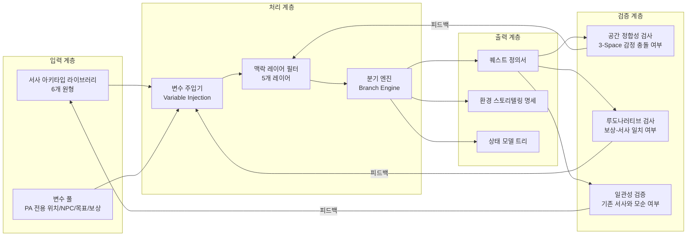
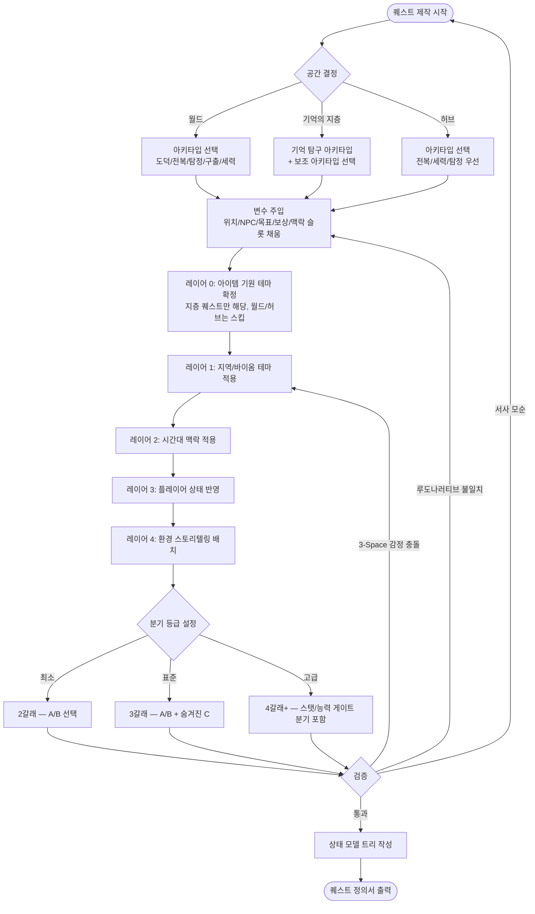
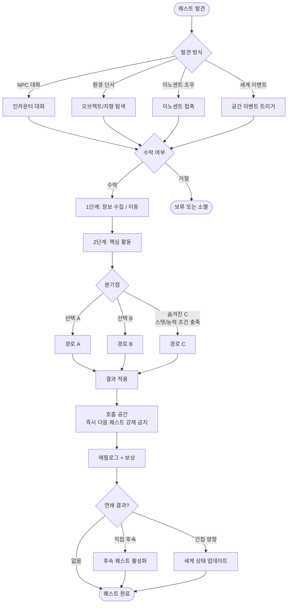
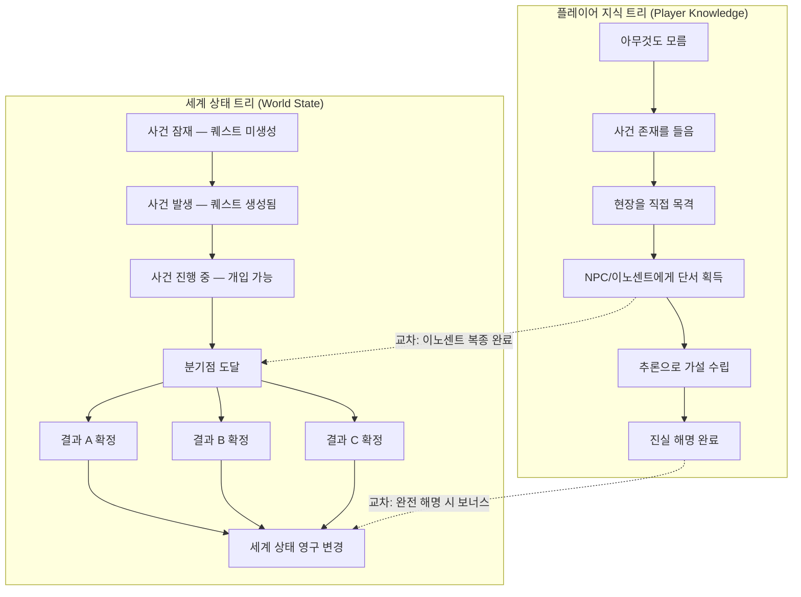
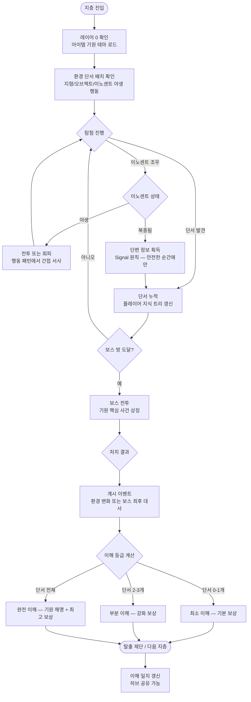
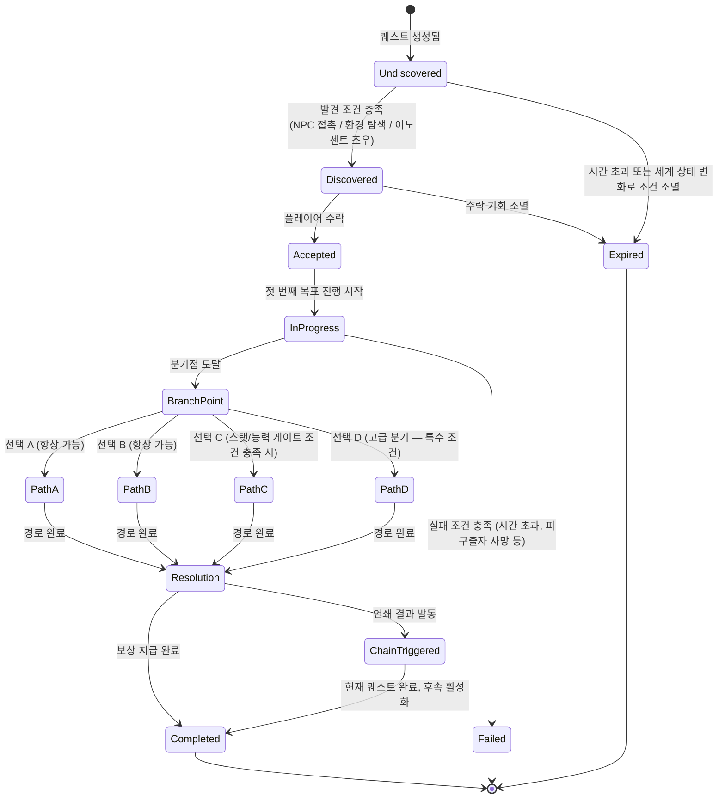

# System_Quest_Narrative: 모듈형 퀘스트 서사 프레임워크

> **⚠️ DEPRECATED:** NPC 퀘스트 프레임워크는 스코프 축소로 삭제되었습니다. PA의 서사는 아이템 내러티브 시스템(System_ItemNarrative_Template.md)으로 전달됩니다. 에르다는 말하지 않는다.

> **문서 ID:** SYS-QST-01
> **문서 상태:** ❌ DEPRECATED
> **3-Space 범위:** ~~World / Item World (Memory Strata) / Hub~~ — 폐기됨
> **최종 수정:** 2026-04-04

---

## 0. 필수 참고 자료 (Mandatory References)

| 문서 | 경로 | 참조 목적 |
| :--- | :--- | :--- |
| Project Vision | `Documents/Terms/Project_Vision_Abyss.md` | 3대 기둥, 핵심 판타지, 금지 규칙 |
| GDD Writing Rules | `Documents/Terms/GDD_Writing_Rules.md` | 문서 구조 포맷 및 작성 규칙 |
| Glossary | `Documents/Terms/Glossary.md` | 공식 용어 사전 |
| 3-Space Architecture | `Documents/Design/Design_Architecture_3Space.md` | 공간 분리 철학 및 순환 구조 |
| Narrative & Worldbuilding | `Documents/Design/Design_Narrative_Worldbuilding.md` | 아이템 서사 원칙, 기원 구조 |
| Memory Strata FloorGen | `Documents/System/System_ItemWorld_FloorGen.md` | 지층 생성 시스템 (SYS-IWF-01) |

### 레퍼런스 자료

| 문서 | 경로 | 참조 목적 |
| :--- | :--- | :--- |
| Witcher3 인사이트 | `Reference/witcher3_인사이트.md` | 퀘스트 구조 원칙, 인카운터 모델, 상태 모델링 |
| SideQuest 역기획서 | `Reference/Reverse_GDD_SideQuest_Narrative_Framework.md` | 서사 아키타입 5종, 변수 치환 시스템 |

---

## 1. 정의 (Definition)

### 1.1. 시스템 정의

**모듈형 퀘스트 서사 프레임워크 (Modular Quest Narrative Framework)**는 서사 아키타입(Narrative Archetype)과 변수 치환(Variable Substitution)을 결합하여, 핸드크래프트 수준의 서사 품질을 유지하면서 대량 생산이 가능한 퀘스트 설계 시스템이다.

> **한 줄 정의:** "아이템이 곧 이야기인 세계에서, 모든 퀘스트는 독립된 씬(Scene)이며 3-Space 어디서든 일관된 서사 품질로 작동한다."

핵심 원칙: 위쳐 3의 "씬이 플롯을 이긴다(Scene Over Plot)" 철학을 PA의 3-Space 구조에 적용한다. 거대한 메인 스토리라인보다 플레이어가 각 공간에서 마주치는 개별 순간들의 누적이 서사를 만든다.

### 1.2. 범위

| 공간 | 퀘스트 유형 | 설명 |
| :--- | :--- | :--- |
| **월드 (World)** | 메인/사이드 퀘스트 | 층위 탐험 중 마주치는 핸드크래프트 서사 |
| **기억의 지층 (Memory Strata)** | 미니 퀘스트 | 아이템의 기원을 탐구하는 환경 서사 퀘스트 |
| **허브 (Hub)** | 소셜 퀘스트 | NPC와의 관계, 거래, 정보 교환 기반 퀘스트 |
| **공간 교차** | 연쇄 퀘스트 | 한 공간에서 시작하여 다른 공간으로 이어지는 퀘스트 |

### 1.3. 핵심 개념 정의

| 개념 | 정의 | PA 특화 적용 |
| :--- | :--- | :--- |
| **서사 아키타입 (Narrative Archetype)** | 반복 가능한 서사 구조의 원형. 6개 유형으로 분류 | 5종 표준 + "기억 탐구" PA 고유 추가 |
| **변수 치환 (Variable Substitution)** | 아키타입 내 슬롯에 구체적 콘텐츠를 주입하는 메커니즘 | 위치/NPC/목표/보상 슬롯에 PA 전용 풀 적용 |
| **맥락 레이어 (Context Layer)** | 변수 치환된 퀘스트에 세계관 정합성을 부여하는 4+1 단계 필터 | 4개 표준 레이어 + "아이템 기원 테마" 레이어 추가 |
| **분기 구조 (Branching Structure)** | 플레이어 선택에 따른 퀘스트 경로 분화 체계 | 최소(2갈래) / 표준(3갈래) / 고급(4갈래+) |
| **인카운터 모델 (Encounter Model)** | 퀘스트 구동이 아닌 장소 자체가 모든 상태에 독립 대응하는 방식 | inkle 방식 채택 — 지층 방문 순서 무관 대응 |
| **상태 모델링 (State Modeling)** | 플레이어 지식 트리와 세계 상태 트리를 분리하여 관리 | 이노센트 상태, 아이템 기원 해금 상태 분리 추적 |

### 1.4. 설계 의도 5관점 분석

| 관점 | 설계 의도 | 기대 효과 |
| :--- | :--- | :--- |
| **서사 품질** | "씬이 플롯을 이긴다" 원칙으로 각 퀘스트 인카운터를 독립적으로 완결성 있게 설계 | 메인 스토리 진행과 무관하게 어떤 퀘스트도 의미 있는 경험 보장 |
| **양산 효율** | 아키타입 × 변수 풀 × 맥락 레이어 조합으로 100개 이상 퀘스트 생산 | 6 아키타입 × 7 위치 층위 × 5 보상 유형 = 210 최소 조합 |
| **루도나러티브 조화** | 퀘스트 보상(장비, 이노센트, 스탯)과 서사 주제가 일치하도록 설계 | 탐험가/장인/모험가 3대 판타지를 서사가 강화 |
| **3-Space 정합성** | 퀘스트가 속한 공간의 감정 상태를 훼손하지 않는 서사 설계 | 월드의 고독한 발견감, 지층의 야리코미 몰입, 허브의 소셜감 각각 유지 |
| **제작 비용** | 아키타입 재사용 + 변수 풀 교체만으로 신규 퀘스트 생산 | 디자이너 1인이 주 1~2개 퀘스트 설계 가능 목표 |

### 1.5. 3-Space 순환 구조와의 연결

이 프레임워크는 PA의 핵심 순환 구조를 서사로 강화한다.

```
월드 탐험 ──→ 아이템 획득 ──→ 기억의 지층 진입 ──→ 장비 강화 ──→ 스탯/능력 게이트 해금 ──→ 새 층위 탐험
    ↑              │                  │                    │                 │                    │
  [서사 훅]    [아이템 기원]      [기억 탐구]           [이노센트]        [퀘스트 개방]         [새 퀘스트]
월드 퀘스트가   아이템이 가진      지층 미니퀘스트로     이노센트 복종      해금된 층위의          연쇄 결과가
탐험 동기를    서사 씨앗을        기원 해명 + 보상       서사가 완성        사이드 퀘스트          다음 퀘스트
제공한다       심어준다           획득                   됨                 개방                   활성화
```

---

## 2. 구조 (Structure)

### 2.1. 전체 아키텍처 파이프라인

4개 핵심 시스템이 파이프라인으로 연결된다.



### 2.2. 6개 서사 아키타입의 3-Space 배치

각 아키타입이 가장 자연스럽게 작동하는 공간을 지정한다.

| 아키타입 | 월드 (World) | 기억의 지층 (Memory Strata) | 허브 (Hub) | 공간 교차 |
| :--- | :---: | :---: | :---: | :--- |
| **도덕적 딜레마** | ★★★ 최적 | ★★ 가능 | ★ 제한적 | 월드에서 결정 → 허브 세력 관계 변화 |
| **기대 전복** | ★★★ 최적 | ★★ 가능 | ★★ 가능 | 허브 심부름 → 지층에서 진실 발견 |
| **탐정 절차** | ★★★ 최적 | ★★★ 최적 | ★★ 가능 | 허브 의뢰 → 지층 단서 → 월드 대면 |
| **구출/호위** | ★★★ 최적 | ★★ 가능 | ★ 제한적 | 월드 위기 → 지층에서 강화 → 귀환 구출 |
| **세력 대결** | ★★★ 최적 | ★ 제한적 | ★★★ 최적 | 허브 세력 갈등 → 월드 실행 → 결과 반영 |
| **기억 탐구** | ★ 제한적 | ★★★ 전용 | ★ 연결 | 월드에서 아이템 획득 → 지층 탐구 → 허브 공유 |

> ★★★ = 최적 공간 / ★★ = 활용 가능 / ★ = 제한적 사용 또는 연결점 역할

### 2.3. PA 고유 아키타입: 기억 탐구 (Memory Investigation)

기억 탐구는 기억의 지층(Memory Strata) 전용 아키타입으로, 아이템의 기원을 환경 단서를 통해 역추적하는 구조이다.

**핵심 원칙:** 컷신과 직접 설명 없이, 지층의 지형 / 몬스터 풀 / 이노센트 반응 / 환경 오브젝트만으로 이야기를 전달한다. 정보의 의도적 생략(Subtraction of Key Information)으로 플레이어가 스스로 추론하도록 유도한다.

**4단계 구조:**

| 단계 | 명칭 | 지층 내 표현 |
| :---: | :--- | :--- |
| 1 | 환경 단서 발견 | 지층 1 — 흩어진 오브젝트, 비일상적 지형 패턴, 야생 이노센트의 행동 이상 |
| 2 | 이노센트 조우 | 지층 2+ — 복종된 이노센트가 단편 정보 제공, 야생 이노센트 행동에서 감정 단서 |
| 3 | 보스 계시 | 지층 보스 — 아이템 기원의 핵심 사건을 상징하는 존재. 대사나 형상이 서사 핵심 |
| 4 | 이해와 귀환 | 탈출 제단 — 조각난 이해의 최종 조립. 이해도에 따라 보상 등급 차등 |

### 2.4. 변수 치환 시스템 구조

아키타입 템플릿 + 변수 슬롯 채움 = 구체적 퀘스트

| 변수 계층 | 변수 유형 | PA 전용 풀 (예시) |
| :--- | :--- | :--- |
| **슬롯 1: 위치** | 공간 × 층위 | 월드 7개 층위 + 지층 6개 바이옴 + 허브 구역 |
| **슬롯 2: NPC** | 역할 유형 | 인간 NPC / 이노센트 / 유령(기원 잔영) / 허브 상인 |
| **슬롯 3: 목표** | 행동 동사 | 탐색 / 획득 / 대면 / 복종 / 조사 / 중재 / 보호 |
| **슬롯 4: 보상** | 유형 | 장비 / 이노센트 / 스탯 게이트 해금 / 세계관 정보 / 평판 |
| **슬롯 5: 맥락** | 주제 테마 | 기원-소환 / 배신 / 집착 / 수호 / 망각 / 귀환 |

### 2.5. 맥락 레이어 시스템 (5 레이어)

표준 4개 레이어에 PA 고유의 레이어 0이 추가된다.

```
레이어 0 (PA 고유): 아이템 기원 테마 ─── 아이템의 카테고리 × 레어리티 × 바이옴 조합
레이어 4: 환경 스토리텔링 ──────────── 시체/오브젝트 배치, 지형 파손, 낙서, 이노센트 배치
레이어 3: 플레이어 상태 ────────────── 평판, 이전 선택, 완료 퀘스트, 복종한 이노센트 수
레이어 2: 시간대 맥락 ──────────────── 메인 스토리 액트 진행도, 세계 위기 수준
레이어 1: 지역 테마 ────────────────── 월드 층위 테마 / 지층 바이옴 테마 / 허브 분위기
```

레이어 0이 가장 먼저 확정되고, 이후 레이어가 그 위에 쌓인다. 모순이 발생하면 상위 레이어(0 → 1 → 2...)로 역추적하여 수정한다.

### 2.6. 인카운터 모델 (Encounter Model)

전통적 퀘스트 수여 방식 대신, 각 장소가 독립적으로 모든 가능한 상태에 대응한다. (inkle의 "Narrative Sorcery" 원칙 PA 적용판)

**핵심 차이:**

| 전통 퀘스트 모델 | 인카운터 모델 (PA 채택) |
| :--- | :--- |
| 퀘스트 수락 전 방문 시 NPC 대사 없음 | 방문 시점의 상태에 따라 항상 적절한 반응 |
| 퀘스트 수락 후에만 세계가 반응 | 플레이어 행동 여부와 무관하게 세계는 변화 |
| 진행도가 NPC의 지식을 결정 | 플레이어 지식 트리와 세계 상태 트리를 분리 관리 |

**PA 인카운터 예시 (기억의 지층 — 전사의 검):**

```
1지층 입구 NPC(유령):
- 첫 방문 + 기원 모름     → "...누군가 들어왔군." (단순 경계)
- 첫 방문 + 아이템 설명 읽음 → "아, 그 검을 가진 자구나. 오래된 것이지."
- 재방문 + 보스 미처치    → "아직 심층까지 가지 못했는가?"
- 재방문 + 보스 처치      → "드디어... 그것이 해방되었구나." (표정 변화)
- 재방문 + 기원 완전 해명  → (유령이 사라지며) "고맙다. 이제 쉴 수 있겠어."
```

**폴백(Fallback) 원칙:** 모든 인카운터에 "아무 상태도 해당하지 않을 때"의 기본 대사를 준비한다. 폴백은 서사적으로 무해하지만 흥미롭지는 않은 중립 대사이다.

---

## 3. 플로우 (Flow)

### 3.1. 퀘스트 제작 파이프라인 (디자이너용)



### 3.2. 플레이어 경험 플로우



> **호흡 공간 원칙:** 위쳐 3의 "Breathing Room" 원칙 적용. 강렬한 도덕적 딜레마 이후에는 즉시 다음 퀘스트를 제시하지 않는다. 허브의 일상적 대화나 지층 탈출 후 침묵의 순간이 감정의 무게를 완성한다.

### 3.3. 상태 모델링 — 플레이어 지식 트리 vs 세계 상태 트리

두 트리는 분리하여 관리한다. 퀘스트 진행도는 두 트리의 교차점에서 계산된다.



**High Water Mark 규칙:** 상태는 항상 상위 상태를 함축한다. PK3(단서 획득)이면 PK1(존재 인지)과 PK2(목격)는 자동으로 참(true)이다.

### 3.4. 기억의 지층 미니 퀘스트 플로우



> **Signal/Noise 원칙 적용:** 전투 중에는 복잡한 서사 정보를 전달하지 않는다. 이노센트의 단편 정보는 전투 후 안전한 구역, 탈출 제단 대기 시간, 지층 간 전환 화면에서만 전달한다.

---

## 4. 상세 명세 (Detail Spec)

### 4.1. 아키타입 1: 도덕적 딜레마 (Moral Dilemma)

**핵심 원칙:** "어느 쪽이든 나쁜 결과" 설계. 양측의 정당성이 균등해야 하며, 명백한 선악 구도를 금지한다. 플레이어가 분노를 느끼는 바로 그 순간 선택지를 제공한다.

**6단계 구조:**

| 단계 | 명칭 | PA 내 구체적 표현 |
| :---: | :--- | :--- |
| 1 | 의뢰 | 한쪽 당사자가 문제 해결을 요청. 표면적으로 명확해 보이는 선악 구도 제시 |
| 2 | 조사 | 현장 탐색. 월드: 물리적 이동 / 지층: 환경 단서 수집 / 허브: NPC 대화 |
| 3 | 진실 발견 | 양측 모두에 잘못/사정이 있음을 발견. 정보의 의도적 생략이 선행되어야 효과적 |
| 4 | 양측 입장 | 각 당사자의 관점을 직접 청취. 대화 시스템 또는 유령/이노센트의 기억 단편 |
| 5 | 선택 | 플레이어가 한쪽을 선택하거나 숨겨진 제3의 길을 찾음 (스탯/능력 게이트 조건) |
| 6 | 결과 | 즉각 결과 + 장기 파급 (세력 관계, 층위 상태, 후속 퀘스트 활성화) |

**변수 슬롯 (PA 전용):**

| 슬롯 | 설명 | PA 예시 값 |
| :--- | :--- | :--- |
| [갈등 유형] | 갈등의 근본 원인 | 이노센트 소유권 분쟁, 아이템 기원 은폐, 층위 지배 세력 교체 |
| [당사자 A] | 한쪽 당사자 | 이노센트 수호자, 아이템 전 주인의 유령, 허브 장인 |
| [당사자 B] | 다른 당사자 | 야생 이노센트 군락, 현 아이템 소지자, 허브 신흥 상인 |
| [숨겨진 진실] | 양측 모두의 복잡한 사정 | A가 먼저 이노센트를 착취했다, B에게도 보호할 기억이 있다 |
| [선택지 A] | A편 행동 | B 토벌, B 추방, A에게 증거 전달 |
| [선택지 B] | B편 행동 | A의 기만 폭로, A를 설득, B에게 자유 부여 |
| [제3의 길] | 숨겨진 선택 (능력/스탯 조건) | 두 이노센트 군락을 화해시키는 제의 수행 |
| [장기 결과] | 세계 상태 영구 변경 | 해당 층위 이노센트 풀 변화, 새 NPC 등장, 세력 지도 갱신 |

**서사 공식:** *"[당사자A]가 [당사자B]에게 [갈등]을 일으켰다. 하지만 [당사자B]도 [숨겨진 진실]을 품고 있다."*

**PA 적용 주의사항:**
- Fire/Ember 구조 적용: 시각적 스펙타클(보스 전투, 특수 효과) 이전에 반드시 감정적 Fire(관계, 갈등, 감정)를 선행한다.
- 이노센트 관련 딜레마는 "복종"이 항상 정답이 아닌 구조로 설계해야 루도나러티브 조화를 달성한다.

---

### 4.2. 아키타입 2: 기대 전복 (Subversion)

**핵심 원칙:** 표면 목표가 충분히 지루하고 평범해야 반전의 임팩트가 극대화된다. "또 심부름이네"라고 느끼는 순간이 반전의 최적 타이밍이다.

**5단계 구조:**

| 단계 | 명칭 | PA 내 구체적 표현 |
| :---: | :--- | :--- |
| 1 | 평범한 의뢰 | 단순해 보이는 아이템 회수, 재료 채집, 심부름 |
| 2 | 진행 | 일상적 퀘스트 수행. 가능하면 지루함을 의도적으로 설계 |
| 3 | 반전 트리거 | 예상치 못한 진실 노출. 대상 물건 조사, NPC 2차 대화, 특정 층위 도달 |
| 4 | 진짜 이야기 | 표면 아래의 감정적/서사적 깊이 노출 |
| 5 | 감정적 결말 | 웃음, 슬픔, 경외 중 하나의 감정으로 마무리 |

**변수 슬롯 (PA 전용):**

| 슬롯 | 설명 | PA 예시 값 |
| :--- | :--- | :--- |
| [표면 목표] | 겉으로 보이는 단순한 목표 | 구 무기 수거, 낡은 방어구 수선 재료 회수, NPC 편지 배달 |
| [숨겨진 진실] | 반전의 핵심 | 이노센트의 유언, 아이템이 실은 저주의 매개체, 배달 편지가 암호 |
| [반전 트리거] | 반전이 발생하는 계기 | 아이템계 진입 시 예상과 다른 기원 테마, 수신자 NPC의 이상 반응 |
| [진짜 이야기] | 감정적 깊이를 가진 서사 | 전쟁에서 죽은 동료를 기억하는 이노센트, 적과 함께 싸운 무기의 기억 |

**서사 공식:** *"단순한 [표면 목표]인 줄 알았지만, 실제로는 [숨겨진 진실]이었다."*

**PA 적용 주의사항:**
- 허브 퀘스트에서 이 아키타입이 효과적이다. 소시지와 기근의 원칙: 허브의 일상적 분위기가 반전의 배경이 되므로, 허브 환경 디테일의 일관성 확보가 전제 조건이다.
- 지층에서 이 아키타입 사용 시, 레이어 0(아이템 기원 테마)이 반전을 암시하지 않도록 주의한다.

---

### 4.3. 아키타입 3: 탐정 절차 (Investigation)

**핵심 원칙:** 최소 3개의 단서가 논리적 추론 체인을 형성해야 한다. 단서만 제공하고 답을 주지 않는 "정보의 의도적 생략" 기법 적용.

**6단계 구조:**

| 단계 | 명칭 | PA 내 구체적 표현 |
| :---: | :--- | :--- |
| 1 | 의뢰 접수 | 사건 개요와 보상 제시. 과도한 설명 금지 — 간결성 원칙 적용 |
| 2 | 현장 조사 | 사건 현장 방문 및 환경 탐색 (위쳐 감각 = PA 탐색 능력 활용 유도) |
| 3 | 단서 수집 | 최소 3개 단서를 물리적으로 수집. 각 단서는 독립적이되 함께 의미를 가짐 |
| 4 | 추론 | 단서를 조합하여 가설 수립. 직접 설명하지 말고 플레이어가 조합하도록 유도 |
| 5 | 대면 | 진범/원인과 직접 대면. "느껴질 때 선택지 제공" 원칙 적용 |
| 6 | 해결 | 전투, 협상, 방면 중 선택. 선택에 따른 세계 상태 변경 |

**변수 슬롯 (PA 전용):**

| 슬롯 | 설명 | PA 예시 값 |
| :--- | :--- | :--- |
| [사건 유형] | 조사할 사건의 종류 | 이노센트 대량 소멸, 층위 몬스터 이상 행동, 아이템 기원 은폐 |
| [현장] | 사건 발생 장소 | 기억의 지층 특정 구역, 허브 장인 구역, 월드 봉인된 방 |
| [단서 1] | 물리적 환경 증거 | 비정상적 이노센트 배치, 지형 손상 패턴, 특수 오브젝트 |
| [단서 2] | 증언/기록 | 이노센트 단편 기억, NPC 대화, 발견된 일지 파편 |
| [단서 3] | 결정적 증거 | 보스 방 직전 환경 패턴, 기원 아이템과의 매핑 |
| [용의자] | 겉보기 유력 원인 | 강력한 야생 이노센트, 외부 침입 흔적, 재귀 진입 부작용 |
| [진범] | 실제 원인/범인 | 아이템 자체의 기억 붕괴, 의뢰인 자신, 예상외 상위 지층 영향 |
| [동기] | 원인 이유 | 기억 분열, 이노센트의 자기 보호, 외부 저주 |

**서사 공식:** *"[현장]에서 [사건]이 발생했다. [단서들]을 추적하여 [진범]과 [동기]를 밝혀라."*

**PA 적용 주의사항:**
- 기억의 지층에서 이 아키타입은 "기억 탐구"와 결합하여 사용할 수 있다. 기억 탐구가 아이템 기원을 탐구한다면, 탐정 절차는 지층 내 현재 사건을 조사한다.
- 40초 법칙: 단서 배치 간격이 40초를 초과하지 않도록 한다.

---

### 4.4. 아키타입 4: 구출/호위 (Rescue/Escort)

**핵심 원칙:** 시간 압박 또는 실패 가능성이 긴장감을 유지한다. 귀환 단계에 추가 이벤트를 삽입하여 서사 깊이를 확보한다.

**6단계 구조:**

| 단계 | 명칭 | PA 내 구체적 표현 |
| :---: | :--- | :--- |
| 1 | 위기 통보 | 긴급한 상황 전달. 핵심 정보만 — 간결성 원칙 (반복 설명 금지) |
| 2 | 이동 | 목적지까지 이동. 이동 중 환경 스토리텔링으로 서사 보충 |
| 3 | 상황 파악 | 현장 도착 후 실제 상황 확인. 통보된 것과 다른 현실이 드러날 수 있음 |
| 4 | 전투/협상 | 위험 요소 해결. 스탯/능력 게이트가 해결 방식을 결정할 수 있음 |
| 5 | 구출 | 피구출자 확보. 구출 대상의 상태/비밀이 추가 서사를 가져올 수 있음 |
| 6 | 귀환 | 안전 지역 복귀. 추적자 등장, 피구출자 비밀 노출 등 추가 이벤트 가능 |

**변수 슬롯 (PA 전용):**

| 슬롯 | 설명 | PA 예시 값 |
| :--- | :--- | :--- |
| [피구출자] | 구출 대상 | 복종 이노센트, 허브 상인, 파티원, 아이템 전 주인 유령 |
| [위험 유형] | 위험의 종류 | 야생 이노센트 습격, 지층 붕괴, 재귀 진입 루프 함정, 외부 침입자 |
| [장소] | 위기 발생 장소 | 기억의 지층 심층부, 월드 봉인 구역, 허브 비밀 통로 |
| [해결 방식] | 선택 가능한 방법 | 정면 전투, 지형 이용 (벽 타기/이단 점프), 협상, 시간 내 탈출 |
| [귀환 이벤트] | 복귀 중 추가 서사 | 추적 몬스터 등장, 피구출자의 숨겨진 목적 노출, 새 아이템 획득 |

**서사 공식:** *"[피구출자]가 [장소]에서 [위험]에 처했다. [방법]으로 구출하여 귀환하라."*

**PA 적용 주의사항:**
- 능력 게이트를 "빠른 길" 대신 "다른 이야기"로 설계한다. 이단 점프 보유 시 다른 경로 → 더 짧은 전투가 아닌 다른 서사 경험.
- 리스크/리턴 분석: 지층 깊은 곳에서의 구출은 탈출 실패 시 진행 손실이라는 고위험 구조를 갖는다.

---

### 4.5. 아키타입 5: 세력 대결 (Faction Conflict)

**핵심 원칙:** 선택의 결과가 세계 상태에 영구 반영되어야 한다. 양쪽 세력을 동등한 매력으로 제시하지 않으면 실질적 선택이 아니게 된다.

**5단계 구조:**

| 단계 | 명칭 | PA 내 구체적 표현 |
| :---: | :--- | :--- |
| 1 | 양 세력 소개 | 허브 또는 월드에서 두 세력의 존재와 표면적 주장 파악 |
| 2 | 각 입장 파악 | 양측의 내부 사정과 논리를 직접 체험. 층위 탐험 또는 지층 공략 중 확인 |
| 3 | 선택 요구 | 플레이어에게 편들기를 강제하는 이벤트 발생. 두 세력 모두 충분히 준비된 상태여야 함 |
| 4 | 세력 지원 | 선택한 세력을 위한 퀘스트 수행 |
| 5 | 결과 | 지역/층위 상태 영구 변화. 세계 지도 갱신, NPC 생존/사망 확정 |

**변수 슬롯 (PA 전용):**

| 슬롯 | 설명 | PA 예시 값 |
| :--- | :--- | :--- |
| [세력 A] | 한쪽 세력 | 장인 길드(허브), 수호 이노센트 군락, 탐험가 파벌 |
| [세력 B] | 다른 세력 | 야생 이노센트 연합, 신흥 상인 집단, 적대 파벌 |
| [갈등 원인] | 충돌의 근본 원인 | 이노센트 서식지, 허브 거래권, 층위 지배 |
| [분쟁 대상] | 핵심 자원/영역 | 레어 이노센트 군락지, 교역로, 봉인 해제 아이템 |
| [플레이어 선택] | 가능한 행동 | 세력 A 지원, 세력 B 지원, 중재(스탯 조건), 양쪽 제거(고급 분기) |
| [장기 결과] | 세계 상태 변화 | 허브 세력도 갱신, 해당 층위 이노센트 타입 변화, 퀘스트라인 개방/폐쇄 |

**서사 공식:** *"[세력A]와 [세력B]가 [분쟁 대상]을 두고 충돌한다. 어느 편에 설 것인가?"*

---

### 4.6. 아키타입 6: 기억 탐구 (Memory Investigation) — PA 고유

**핵심 원칙:** 컷신과 직접 설명 없이 환경 서사만으로 아이템의 기원을 전달한다. 정보는 의도적으로 분산되며, 전체를 모아야 완전한 이야기가 완성된다.

**5단계 구조:**

| 단계 | 명칭 | 지층 내 구현 방법 |
| :---: | :--- | :--- |
| 1 | 기원 암시 | 지층 진입 시 아이템 레어리티에 따른 바이옴 테마. 직접 설명 없이 분위기로만 전달 |
| 2 | 단서 발견 | 지형 이상, 특수 오브젝트, 야생 이노센트의 비정상 행동. 40초 간격 배치 |
| 3 | 이노센트 증언 | 복종된 이노센트의 단편 대사. Signal 원칙 — 안전한 순간에만 전달 |
| 4 | 보스 계시 | 보스의 형상/대사/사망 연출이 기원의 핵심 사건을 상징 |
| 5 | 이해 조립 | 탈출 제단에서 수집한 단서의 자동 요약. 이해 등급에 따른 보상 차등 |

**변수 슬롯 (PA 전용):**

| 슬롯 | 설명 | PA 예시 값 |
| :--- | :--- | :--- |
| [아이템 카테고리] | 기억의 주 테마 결정 | 무기 / 방어구 / 장신구 / 마법 도구 / 일상 도구 |
| [레어리티] | 서사 복잡도 결정 | Normal(단편) / Magic(소사연) / Rare(사건) / Legendary(역사) / Ancient(신화) |
| [기원 사건] | 핵심 역사적 사건 | 전투, 재앙, 의식, 배신, 방랑, 창조 |
| [감정 주제] | 보스가 상징하는 감정 | 분노 / 슬픔 / 집착 / 수호 / 망각 / 귀환 |
| [이해 보상] | 완전 이해 시 추가 보상 | 기원 칭호 획득, 이노센트 특수 능력 해금, 숨겨진 지층 개방 |

**PA 적용 예시 (기억의 지층 — 전장의 창 / Rare 등급):**

| 요소 | 기원 암시 표현 | 직접 설명 여부 |
| :--- | :--- | :--- |
| 지형 | 깨진 성벽, 마른 핏자국, 불탄 나무 잔재 | 없음 |
| 몬스터 풀 | 갑옷 파편 유령, 전투 피로 이노센트, 창에 꿰인 원혼 | 없음 |
| 환경 오브젝트 | 군기 잔해, 투구, 부러진 방패들 | 없음 |
| 복종 이노센트 대사 | "...또 전쟁이냐. 이번엔 언제 끝나지." | 전투 후 안전 구역에서만 |
| 보스 형태 | 동료 전사들의 기억이 합쳐진 복합 원혼 | 없음 |
| 보스 사망 대사 | "...같이 싸운 것들이... 이제야..." | 전투 종료 후 |

---

### 4.7. 맥락 레이어 상세 명세

**레이어 0: 아이템 기원 테마 (PA 고유, 기억의 지층 전용)**

| 아이템 카테고리 | 기본 바이옴 | 주요 몬스터 풀 | 감정 분위기 |
| :--- | :--- | :--- | :--- |
| 무기 (검/창/활) | 전장, 폐허 성채 | 전사 원혼, 피로 이노센트 | 비장, 분노, 슬픔 |
| 방어구 | 성벽, 훈련장 | 수호 이노센트, 갑옷 유령 | 중후, 신뢰, 집착 |
| 장신구 | 귀족 저택, 마탑 | 집착 이노센트, 기억 파편 | 욕망, 우아, 공허 |
| 마법 도구 | 실험실, 봉인된 공간 | 실험체 유령, 지식 이노센트 | 호기심, 위험, 경외 |
| 일상 도구 | 주방, 작업장, 마을 | 소박한 이노센트, 일상 원혼 | 소소함, 따뜻함, 서글픔 |

**레이어 1: 지역/바이옴 테마**

| 위치 유형 | 허용 주제 | 분위기 태그 | 주요 NPC 풀 |
| :--- | :--- | :--- | :--- |
| 월드 — 성채 구역 | 권력, 배신, 의리 | 엄숙, 긴장 | 기사, 귀족, 반란군 |
| 월드 — 황야 구역 | 생존, 야생, 미지 | 황량, 고독 | 방랑자, 야생 생물, 은자 |
| 월드 — 도시 구역 | 정치, 거래, 음모 | 번잡, 부패 | 상인, 도적, 시민 |
| 기억의 지층 — 전장 바이옴 | 전투, 희생, 원한 | 비장, 음울 | 전사 유령, 분노 이노센트 |
| 기억의 지층 — 일상 바이옴 | 소소한 삶, 반전 | 소박, 서글픔 | 일상 이노센트, 생활 유령 |
| 기억의 지층 — 마법 바이옴 | 지식, 실험, 위험 | 경이, 불안 | 지식 이노센트, 실험 원혼 |
| 허브 | 소셜, 거래, 정보 | 활기, 중립 | 장인, 상인, 모험가 |

**레이어 2: 시간대 맥락**

| 메인 스토리 단계 | 세계 상태 | 퀘스트 변형 방향 |
| :--- | :--- | :--- |
| Act 1 (탐험 입문) | 세계 안정, 소규모 갈등 | 소규모 지역 딜레마, 기억 탐구 입문 퀘스트 |
| Act 2 (위기 확산) | 세력 갈등 격화 | 세력 대결 빈도 증가, 구출/호위 긴박화 |
| Act 3 (심연 위기) | 세계적 위협 | 도덕적 딜레마 극대화, 선택 무게 증가 |
| Endgame | 결과 반영 | 이전 선택의 연쇄 결과가 새 퀘스트로 귀환 |

**레이어 3: 플레이어 상태 반영**

| 상태 축 | 높을 때 퀘스트 변형 | 낮을 때 퀘스트 변형 |
| :--- | :--- | :--- |
| 탐험 깊이 (방문 층위 수) | 비선형 경로 퀘스트 증가, 숨겨진 분기 개방 | 직선적 안내 퀘스트 우선 |
| 이노센트 복종 수 | 이노센트 관련 서사 심화, 특수 대사 활성화 | 이노센트 입문 퀘스트 등장 |
| 재귀 진입 경험 | 기억 탐구 고급 분기 개방, 심층 서사 해금 | 기본 기억 탐구 유지 |
| 세력 평판 | 우호 세력 전용 퀘스트 활성화 | 중립 또는 적대 세력 의뢰 등장 |

**레이어 4: 환경 스토리텔링**

| 요소 | PA 전용 용도 | 구체적 예시 |
| :--- | :--- | :--- |
| 이노센트 배치 패턴 | 사건의 정황 암시 | 특정 구역에 야생 이노센트 밀집 → 최근 충격 사건 암시 |
| 지형 손상 | 과거 사건의 흔적 | 벽 균열 방향, 불탄 흔적의 범위 → 사건 규모와 방향 유추 가능 |
| 오브젝트 배치 | 개인 서사의 파편 | 아이 장난감 + 찢어진 군기 → 전쟁 중 민간인 피해 암시 |
| 이노센트 대사 단편 | 직접 설명 없는 증언 | "그 사람은 다시 돌아오겠다고 했는데..." (맥락 없이 배치) |

---

### 4.8. 플레이어 선택 & 분기 설계

> **핵심 정의:** "Project Abyss에서 모든 선택은 다른 콘텐츠를 향한 문이다 — 더 쉬운 길이 아니라, 오직 그 길에서만 경험할 수 있는 무언가로 가는 문."

#### 4.8.1. 선택 설계 5대 원칙

**원칙 1: 양측 균등 (Equal Weight)**

양쪽 선택지 모두 같은 양의 콘텐츠, 같은 수준의 완성도, 같은 강도의 보상 가치를 가져야 한다. 단, 보상의 종류는 달라야 한다. 한쪽에 개발 자원이 집중되는 "스타 파워 효과"는 선택의 균형을 무너뜨리는 가장 일반적인 실패 패턴이다.

| 공간 | 적용 방식 |
| :--- | :--- |
| 월드 | 두 능력 게이트 중 어느 쪽을 먼저 해금해도, 각각의 경로가 동등한 분량의 층위·보스·서사를 가진다 |
| 기억의 지층 | 분기점에서 좌/우 경로 모두 이노센트 출현 수·아이템 풀 가치가 설계 기준 내에서 균등하다 |
| 허브 | 이노센트 처리 선택(조련 vs. 해방)에서 양측 결과의 가치가 다른 종류로 동등하다 |

**원칙 2: 감정 동기화 (Emotional Sync)**

선택지는 플레이어가 감정적으로 선택하고 싶은 바로 그 순간에 제공한다.

| 공간 | 적용 방식 |
| :--- | :--- |
| 월드 | 보스전 직전: NPC가 마지막 선택 요구 — 전투 긴장감과 서사 긴장감 중첩 |
| 기억의 지층 | 지층 보스 처치 직후: 이노센트 처리 선택 — 승리의 쾌감이 선택 무게감 증폭 |
| 허브 | 파티 해산 직후: 파티원 관계 선택 — 협동 감동이 채 가시지 않은 상태에서 제공 |

**원칙 3: 결과 가시성 (Result Visibility)**

너무 미묘한 결과는 존재하지 않는 것과 같다. 세 층위로 설계한다:

1. **즉각적 가시성** — 선택 직후 바로 보이는 차이 (아이템 획득, UI 변화, 대사 반응)
2. **단기 가시성** — 해당 세션 내에서 체감되는 차이 (경로 분기, 보스 행동 변화)
3. **장기 가시성** — 여러 세션에 걸쳐 누적되는 차이 (이노센트 스탯 합산, 월드 서사 상태)

**원칙 4: 결과 텔레그래프 (Consequence Telegraphing)**

결과를 미리 암시하되 완전히 공개하지 않는다. 방법:
- **환경적 힌트** — 경로 입구의 지형, 적 배치, 분위기가 성격을 암시
- **NPC 발언** — 명확한 답 없이 경험 공유 ("거기 길은 좁지만 뭔가 있는 것 같았어")
- **이전 경험 패턴** — 같은 종류의 선택을 반복 경험하며 패턴 학습

**원칙 5: 정의된 캐릭터 (Defined Character)**

PA의 주인공은 탐험가·장인·모험가의 세 정체성을 가진다. 이 세 정체성이 선택 상황에서 내적 갈등을 만들고, 갈등이 선택을 의미 있게 한다.

| 상황 | 내적 갈등 |
| :--- | :--- |
| 이노센트 희생 선택 | 장인(더 강한 장비) vs 모험가(파티원 이노센트 수집 목표 충돌) |
| 능력 게이트 우선순위 | 탐험가(새 층위 탐험 욕구) vs 장인(현재 장비 강화 욕구) |
| 재귀적 진입 여부 | 모험가(파티원 없이 심층 진입 위험) vs 장인(더 깊은 강화 욕구) |

---

#### 4.8.2. 비선형 경로 3원칙

> **핵심 규칙:** "스탯/능력 투자의 보상 = 다른 경험, 콘텐츠 건너뛰기가 아님"

**원칙 A: 거리 인식 (Perception of Distance)** — 두 경로는 충분히 멀리 떨어진 것처럼 느껴져야 한다.

| 적용 공간 | 구현 방법 |
| :--- | :--- |
| 월드 탐험 | 능력 게이트 A와 B는 지도상 서로 다른 방향. 한쪽 선택 시 다른 쪽까지 의미 있는 이동 시간 |
| 기억의 지층 | 분기점에서 좌/우 경로는 Room 2개 이상 거리. 다른 경로는 시야에서 완전히 사라짐 |

**원칙 B: 배타성 인식 (Perception of Exclusivity)** — 선택한 경로에서는 선택하지 않은 경로가 보이지 않아야 한다.

| 적용 공간 | 구현 방법 |
| :--- | :--- |
| 월드 탐험 | 분기점 이후 경로는 시각적으로 다른 테마 환경으로 전환. 선택하지 않은 게이트는 차단 유지 |
| 기억의 지층 | 분기 Room 이후 각 경로는 독립 구역. 두 경로가 시각적으로 겹치지 않도록 최소 Room 간격 강제 |

**원칙 C: 고유성 인식 (Perception of Uniqueness)** — 선택한 경로에만 존재하는 고유 콘텐츠가 있어야 한다.

| 적용 공간 | 고유성 콘텐츠 |
| :--- | :--- |
| 월드 탐험 | ATK 경로: 높은 ATK 게이트 해금·강력한 보스·고ATK 장비 풀 / 능력 경로: 능력 게이트 해금·탐험형 보상 |
| 기억의 지층 | 각 경로 전용 이노센트 1종+, 고유 NPC 유령 서사, 경로별 지형 테마 차이 |
| 양쪽 공통 | "경로 기억 조각" 아이템 — 모두 수집 시 아이템 기원 서사 전모 해금 |

---

#### 4.8.3. PA 고유 선택 체계

| 선택 지점 | 선택지 | 리스크 / 리턴 | 서사적 의미 |
| :--- | :--- | :--- | :--- |
| 지층 경로 선택 | 전투 밀집(이노센트 다수) vs 탐험(서사 NPC) | 사망 리스크 ↔ 파밍 효율 / 레어 아이템 ↔ 서사 해금 | 전사의 길 vs 탐험가의 길 |
| 이노센트 처리 | 조련 / 야생 방치 / 희생 | 스탯 보너스·정화도 / 난이도 변화·군집 형성 / 일회성 폭발·재출현 감소 | 공존 vs 방관 vs 착취 |
| ATK 게이트 투자 | ATK 극대화 / 밸런스 빌드 | ATK 수치에 따라 다른 층위 게이트 해금 순서 결정 | 어떤 탐험가가 될 것인가 |
| 능력 게이트 우선 | 이단 점프 / 벽 타기 / 안개 변신 / 수중 호흡 / 역중력 | 각 능력이 다른 월드 층위 접근 허용 | 캐릭터의 성장 서사 |
| 재귀적 진입 | 진입 / 미진입 (깊이 1~3) | 손실 누적 ↔ 강화 심화 | "홀로 심연을 가다" vs "안전한 귀환" |
| 파티 구성 | 전투 특화 / 탐험 특화 / 혼합 / 솔로 | 파밍 효율 ↔ 발견 확률 ↔ 전 콘텐츠 접근 ↔ 독점 포획 | 모험가 판타지의 핵심 |

---

#### 4.8.4. 인카운터 상태 모델

전통 퀘스트 모델(선형 단계 진행) 대신, 각 장소가 독립적으로 모든 가능한 게임 상태에 대응하는 인카운터 모델을 채택한다.

| 비교 항목 | 퀘스트 모델 | 인카운터 상태 모델 |
| :--- | :--- | :--- |
| 설계 단위 | 선형 단계(Step 1 → 완료) | 상태(State) + 조건(Condition) |
| 반복 진입 대응 | 동일 퀘스트 재시작 | 이전 방문 상태 기억, 다른 대사/결과 |
| 월드 상태 반응 | 퀘스트 플래그만 체크 | 플레이어 지식 트리 + 세계 상태 트리 분리 추적 |
| 절차적 생성 적합성 | 낮음 | 높음 (방 생성과 독립적으로 상태 평가) |

**상태 트리 분리:**

```
플레이어 지식 트리                    세계 상태 트리
├── 아이템 기원 서사 지식 (0~100%)    ├── 이노센트 생태계 (야생/조련/희생/군집)
├── 이노센트 종류 인식               ├── 지층 정화도 (0~100%)
├── 지층 구조 친숙도                 ├── 보스 처치 기록
└── NPC 유령 관계                    └── 서사 단편 해금 상태
```

**방어적 로직 5규칙:**

| 규칙 | 내용 |
| :--- | :--- |
| 불가능 상태도 처리 | "희생한 이노센트를 다시 조련" 같은 조합도 폴백 정의 |
| 고수위 표시(High Water Mark) | "보스 처치"는 "보스 조우 경험"을 자동 포함 |
| 폴백 원칙 | 조건 미충족 시 "유능하되 흥미롭지 않은" 기본 응답 |
| 공간 독립성 | 각 위치(방, 지층, 구역)가 독립적으로 상태 평가 |
| 지식/상태 분리 | NPC·이노센트는 플레이어가 아는 것이 아니라 세계에서 일어난 일에 반응 |

**예시: 화염 이노센트 인카운터 상태 트리**

```
화염 이노센트 인카운터
├── 방문 이력 없음 (첫 진입)
│   └── → 야생 상태, 적대적 행동
├── 방문 이력 있음, 미처리
│   ├── 이노센트 생존 중 → 약간 강화된 행동 패턴
│   └── 이노센트 도주 → 불꽃 흔적, 이노센트 없음, 서사 힌트
├── 조련 완료
│   └── → 비전투 NPC 전환, 재방문 시 대사 변화
├── 희생 완료
│   └── → 재 흔적, 재출현 확률 영구 감소
└── 불가능 상태: 조련 + 희생 동시
    └── → 폴백: 빈 방 처리, 오류 없음
```

---

#### 4.8.5. 분기 등급 체계

| 등급 | 갈래 수 | 조건 | 적합 아키타입 | 제작 비용 지수 |
| :--- | :---: | :--- | :--- | :--- |
| **최소 (Min)** | 2 (A/B) | 무조건 제공 | 구출/호위, 기대 전복 | 1.0 (기준) |
| **표준 (Standard)** | 3 (A/B/Hidden C) | C: 일반 탐색 조건 | 도덕적 딜레마, 탐정 절차 | 1.8 |
| **고급 (Advanced)** | 4+ (A/B/C/D) | C: 스탯 게이트 / D: 능력 게이트 | 세력 대결, 기억 탐구 | 3.0 |

**PA 퀘스트 유형별 분기 등급 배정:**

| 퀘스트/상황 유형 | 분기 등급 | 근거 |
| :--- | :--- | :--- |
| 메인 스토리 분기점 | 표준 (3갈래) | 충분한 자유도, 관리 가능한 비용 |
| 이노센트 처리 | 표준 (3갈래) | 조련/방치/희생 |
| 장비 빌드 방향 | 최소 (2갈래) | ATK 극대화 vs 밸런스 빌드 |
| 지층 경로 선택 | 최소 (2갈래) | 명확한 대조, 낮은 생성 비용 |
| 재귀 진입 결정 | 최소 (2갈래) | 리스크/리턴 긴장감 극대화 |

---

#### 4.8.6. 선택 설계 금지 규칙

| 금지 규칙 | 위반 시 결과 |
| :--- | :--- |
| 명백하게 우월한 선택지를 만들지 않는다 | 모든 플레이어가 같은 선택 → 선택지 붕괴 |
| 스탯/능력 투자가 콘텐츠 건너뛰기로 이어지지 않는다 | 메트로베니아 탐험 동기 붕괴 |
| 선택 결과를 즉각 되돌릴 수 없게 한다 | 선택의 무게감 소멸 |
| 한 선택지에만 서사/콘텐츠를 집중 투자하지 않는다 | 스타 파워 효과, 선택 편중 |
| 전투 중·사망 직후에 서사 선택지를 제공하지 않는다 | 감정 동기화 원칙 위반, 몰입 파괴 |
| 분기 등급을 예산 없이 무한정 올리지 않는다 | 밸런싱 붕괴, 상태 조합 폭발 |

---

### 4.9. 연쇄 결과 시스템

| 연쇄 유형 | 설명 | PA 예시 |
| :--- | :--- | :--- |
| **직접 후속** | 결과가 다음 퀘스트를 즉시 트리거 | 이노센트 군락 구출 → "군락 수호" 퀘스트 즉시 활성화 |
| **간접 영향** | 결과가 다른 퀘스트의 변수를 변경 | 세력 A 지원 → 해당 층위 NPC 구성 변화, 새 의뢰 유형 등장 |
| **누적 효과** | 여러 결과가 축적되어 새 퀘스트 트리거 | 이노센트 복종 50개 달성 → 이노센트 왕 퀘스트 개방 |
| **반향** | 과거 선택이 예상치 못한 곳에서 귀환 | 초반 방면한 야생 이노센트가 심층 지층에서 예상치 못한 동맹으로 등장 |

---

### 4.10. 퀘스트 상태 기계 (Quest State Machine)



---

## 5. 데이터 (Data)

### 5.1. 아키타입 × 변수 슬롯 종합 테이블

| 아키타입 | 슬롯 1 | 슬롯 2 | 슬롯 3 | 슬롯 4 | 슬롯 5 | 슬롯 6 | 슬롯 7 | 슬롯 8 |
| :--- | :--- | :--- | :--- | :--- | :--- | :--- | :--- | :--- |
| 도덕적 딜레마 | 갈등 유형 | 당사자 A | 당사자 B | 숨겨진 진실 | 선택지 A | 선택지 B | 제3의 길 | 장기 결과 |
| 기대 전복 | 표면 목표 | 숨겨진 진실 | 반전 트리거 | 진짜 이야기 | — | — | — | — |
| 탐정 절차 | 사건 유형 | 현장 | 단서 1 | 단서 2 | 단서 3 | 용의자 | 진범 | 동기 |
| 구출/호위 | 피구출자 | 위험 유형 | 장소 | 해결 방식 | 귀환 이벤트 | — | — | — |
| 세력 대결 | 세력 A | 세력 B | 갈등 원인 | 분쟁 대상 | 플레이어 선택 | 장기 결과 | — | — |
| 기억 탐구 | 아이템 카테고리 | 레어리티 | 기원 사건 | 감정 주제 | 이해 보상 | — | — | — |

### 5.2. 위치 변수 풀 (PA 전용, 21개)

| ID | 공간 | 구역/바이옴 | 분위기 태그 | 호환 아키타입 |
| :--- | :--- | :--- | :--- | :--- |
| PA_LOC_01 | 월드 | 성채 구역 — 중앙 홀 | 엄숙, 위엄 | 도덕, 세력, 탐정 |
| PA_LOC_02 | 월드 | 성채 구역 — 지하 감옥 | 공포, 절망 | 구출, 도덕 |
| PA_LOC_03 | 월드 | 황야 구역 — 폐허 마을 | 황량, 비극 | 도덕, 전복, 탐정 |
| PA_LOC_04 | 월드 | 황야 구역 — 봉인 유적 | 신비, 경이 | 탐정, 전복 |
| PA_LOC_05 | 월드 | 도시 구역 — 시장 거리 | 번잡, 음모 | 세력, 도덕 |
| PA_LOC_06 | 월드 | 도시 구역 — 장인 구역 | 활기, 경쟁 | 세력, 전복 |
| PA_LOC_07 | 월드 | 심연 입구 구역 | 공포, 경외 | 모든 아키타입 |
| PA_LOC_08 | 기억의 지층 | 전장 바이옴 | 비장, 음울 | 기억 탐구, 탐정 |
| PA_LOC_09 | 기억의 지층 | 일상 바이옴 (주방/작업장) | 소박, 서글픔 | 기억 탐구, 전복 |
| PA_LOC_10 | 기억의 지층 | 귀족 저택 바이옴 | 우아, 부패 | 기억 탐구, 도덕 |
| PA_LOC_11 | 기억의 지층 | 마탑/실험실 바이옴 | 경이, 불안 | 기억 탐구, 탐정 |
| PA_LOC_12 | 기억의 지층 | 자연 바이옴 (숲/동굴) | 야생, 고요 | 기억 탐구, 구출 |
| PA_LOC_13 | 기억의 지층 | 심연 바이옴 (Ancient 전용) | 원초, 카오스 | 기억 탐구 (고급) |
| PA_LOC_14 | 허브 | 중앙 광장 | 활기, 소셜 | 세력, 전복 |
| PA_LOC_15 | 허브 | 장인 공방 구역 | 전문적, 경쟁 | 세력, 탐정 |
| PA_LOC_16 | 허브 | 상점 구역 | 음모, 정보 | 도덕, 세력 |
| PA_LOC_17 | 허브 | 이노센트 농장 구역 | 평화, 신비 | 도덕, 전복 |
| PA_LOC_18 | 허브 | 주점/휴식 구역 | 활기, 비밀 | 전복, 탐정 |
| PA_LOC_19 | 공간 교차 | 월드 → 지층 | 전환, 긴박 | 구출, 탐정 |
| PA_LOC_20 | 공간 교차 | 허브 → 월드 | 출발, 결의 | 세력, 구출 |
| PA_LOC_21 | 공간 교차 | 지층 → 허브 | 귀환, 안도 | 전복, 기억 탐구 |

### 5.3. NPC 변수 풀 (PA 전용, 20개)

| ID | 역할 | 유형 | 성격 태그 | 호환 아키타입 |
| :--- | :--- | :--- | :--- | :--- |
| PA_NPC_01 | 의뢰인 | 허브 장인 | 자부심, 집착 | 세력, 도덕, 전복 |
| PA_NPC_02 | 의뢰인 | 탐험가 NPC | 호기심, 무모함 | 탐정, 구출, 전복 |
| PA_NPC_03 | 의뢰인 | 허브 상인 | 계산적, 교활 | 세력, 도덕 |
| PA_NPC_04 | 의뢰인 | 기억의 목격자 유령 | 슬픔, 집착 | 기억 탐구, 탐정 |
| PA_NPC_05 | 의뢰인 | 이노센트 수호자 | 헌신, 완고함 | 도덕, 세력 |
| PA_NPC_06 | 피해자/구출 대상 | 복종된 이노센트 | 두려움, 신뢰 | 구출, 도덕 |
| PA_NPC_07 | 피해자/구출 대상 | 허브 시민 | 체념, 희망 | 구출, 전복 |
| PA_NPC_08 | 피해자/구출 대상 | 기원 아이템 전 주인 유령 | 미완성, 귀환 욕구 | 기억 탐구, 구출 |
| PA_NPC_09 | 적대자 | 야생 이노센트 군락 수장 | 야성, 원한 | 도덕, 세력, 구출 |
| PA_NPC_10 | 적대자 | 이노센트 착취 상인 | 탐욕, 합리화 | 도덕, 세력, 탐정 |
| PA_NPC_11 | 적대자 | 타락한 기억의 잔영 | 광기, 집착 | 기억 탐구, 탐정 |
| PA_NPC_12 | 적대자 | 허브 경쟁 세력 | 냉정, 야심 | 세력, 도덕 |
| PA_NPC_13 | 조력자 | 복종 이노센트 (정보원) | 충성, 한정 지식 | 탐정, 기억 탐구 |
| PA_NPC_14 | 조력자 | 허브 정보 브로커 | 중립, 정보 지향 | 탐정, 세력 |
| PA_NPC_15 | 조력자 | 동료 탐험가 (파티원 NPC) | 유대, 전문성 | 구출, 탐정 |
| PA_NPC_16 | 목격자 | 지층 이노센트 방랑자 | 불안, 단편 기억 | 기억 탐구, 탐정 |
| PA_NPC_17 | 목격자 | 허브 오래된 주민 | 기억, 향수 | 전복, 도덕 |
| PA_NPC_18 | 이중 역할 | 의뢰인이자 진범 | 자기합리화, 두려움 | 탐정, 도덕 |
| PA_NPC_19 | 이중 역할 | 피해자이자 진짜 위협 | 상처, 복수심 | 도덕, 전복 |
| PA_NPC_20 | 특수 | 이노센트 왕/군 (보스 NPC) | 고대, 초월 | 기억 탐구 (고급) |

### 5.4. 목표 변수 풀

| 행동 동사 | PA 구체적 목표 예시 | 주요 공간 |
| :--- | :--- | :--- |
| **탐색** | 특정 구역의 이상 원인 조사, 지층 모든 이노센트 발견 | 월드, 지층 |
| **획득** | 지정 아이템 회수, 특수 이노센트 복종, 기원 단서 수집 | 전 공간 |
| **대면** | 지층 보스 처치, 갈등 당사자와 직접 협상 | 지층, 월드 |
| **복종** | 야생 이노센트 군락 복종, 수장급 이노센트 설득 | 지층, 월드 |
| **중재** | 두 세력/이노센트 군락 간 갈등 해소 | 허브, 월드 |
| **보호** | 허브 NPC 또는 복종 이노센트 군락 방어 | 허브, 월드 |
| **탈출** | 붕괴하는 지층에서 대상과 탈출 | 지층 |
| **폭로** | 숨겨진 진실을 당사자에게 전달 | 전 공간 |

### 5.5. 분기 매트릭스

| 아키타입 | 표준 분기 A | 표준 분기 B | 숨겨진 C (일반 조건) | 고급 D (게이트 조건) |
| :--- | :--- | :--- | :--- | :--- |
| 도덕적 딜레마 | 당사자 A 지원 | 당사자 B 지원 | 양측 화해 중재 | 제3자 개입 (ATK 조건) |
| 기대 전복 | 표면 목표 완수 (모름 상태) | 진실 이해 후 선택 | 진실을 숨기는 선택 | — |
| 탐정 절차 | 추론 기반 결정 | 증거 확보 후 결정 | 의뢰인 배신 선택 | 감추어진 4번째 진실 (능력 조건) |
| 구출/호위 | 정면 전투 구출 | 우회로 잠입 구출 | 협상으로 해결 | 능력 게이트 전용 경로 |
| 세력 대결 | 세력 A 지원 | 세력 B 지원 | 중재 협상 | 양측 제거 (복합 스탯 조건) |
| 기억 탐구 | 부분 이해 귀환 | 완전 이해 달성 | 이해 포기 조기 탈출 | 숨겨진 지층 개방 (전체 이노센트 복종) |

### 5.6. PA 전용 퀘스트 조합 12개 예시

| # | 아키타입 | 공간 | NPC | 목표 | PA 핵심 서사 훅 | 연쇄 결과 |
| :---: | :--- | :--- | :--- | :--- | :--- | :--- |
| 1 | 도덕적 딜레마 | 월드 — 성채 | 이노센트 수호자 vs 장인 길드 | 중재 | 장인이 이노센트를 착취하고 있지만, 그 이노센트들이 원래 전쟁 희생자의 기억이어서 강화에 쓰이는 것을 원하고 있다 | 허브 이노센트 농장 구역 개방/폐쇄 |
| 2 | 도덕적 딜레마 | 허브 | 탈출 원하는 이노센트 vs 원 주인 유령 | 결정 | 이노센트를 해방하면 아이템의 기원 서사가 소멸하지만, 이노센트 본인은 자유를 원한다 | 해당 아이템계 기원 테마 영구 변경 |
| 3 | 기대 전복 | 허브 → 지층 | 허브 상인 | 낡은 무기 수거 | 수거 의뢰한 무기를 아이템계에 진입했더니, 무기 안의 이노센트가 상인의 죽은 동생 기억이었다 | 상인 NPC 관계도 대폭 변화 |
| 4 | 기대 전복 | 월드 — 황야 | 촌장 | 마을 몬스터 퇴치 | 몬스터가 실은 마을을 보호하는 이노센트 군락이 변이한 것. 촌장이 원인을 알고 있다 | 탐정 절차 퀘스트 연쇄 활성화 |
| 5 | 탐정 절차 | 기억의 지층 | 지층 이노센트 방랑자 | 이노센트 대량 소멸 원인 조사 | 단서 수집 결과, 재귀적 진입 중 가져온 하위 아이템의 보스가 상위 지층을 침식하고 있었다 | 재귀 진입 경고 시스템 UI 갱신 |
| 6 | 탐정 절차 | 허브 | 정보 브로커 | 허브 내 아이템 도난 사건 | 도난된 아이템이 실은 Ancient 등급이었고, 범인은 그 아이템의 기원 기억을 지우려 했다 | Ancient 아이템 서사 챕터 개방 |
| 7 | 구출/호위 | 기억의 지층 | 복종된 이노센트 | 붕괴하는 3지층에서 이노센트 탈출 | 탈출 중 지층 붕괴 원인이 플레이어 자신의 이전 전투에서 비롯되었음을 이노센트가 암시 | 해당 아이템 기억 손상 상태 추가 |
| 8 | 구출/호위 | 월드 → 지층 | 파티원 NPC | 지층에 갇힌 파티원 구출 | 파티원이 자발적으로 남은 것으로 밝혀짐 — 아이템의 기억이 파티원 자신과 연결되어 있다 | 파티원 관계도 + 기억 탐구 퀘스트 연계 |
| 9 | 세력 대결 | 허브 | 장인 길드 vs 야생 이노센트 연합 | 허브 이노센트 농장 지배권 분쟁 | 야생 이노센트 연합이 허브를 점거하겠다는 것이 아니라, 착취 없는 공존을 원한다는 것이 밝혀짐 | 허브 구조 영구 변경 — 새 공존 구역 생성 |
| 10 | 세력 대결 | 월드 | 탐험가 파벌 A vs 파벌 B | 심연 입구 구역 지배 | 두 파벌 모두 심연의 비밀을 독점하려 하지만, 비밀이 공유될수록 양쪽 모두에게 위험하다 | 메인 스토리 Act 전환 트리거 가능 |
| 11 | 기억 탐구 | 기억의 지층 (Legendary) | 기원 아이템 전 주인 유령 | 왕국 봉인 검의 기원 완전 해명 | 검의 기원이 왕국 멸망과 직결되어 있으며, 이노센트들이 그 죄책감을 품고 있었다 | 월드 층위 봉인 해제 + 신규 층위 개방 |
| 12 | 기억 탐구 (고급) | 기억의 지층 (Ancient) | 이노센트 군(君) | Ancient 장신구의 신화급 기원 해명 | 모든 이노센트를 복종시키면 드러나는 마지막 진실: 이 아이템이 세계 창조에 참여했다는 것 | 심연 바이옴 해금 + 세계관 핵심 서사 공개 |

---

## 6. 검증 기준 (Verification)

### 6.1. 씬 품질 검증 (Scene Quality)

- [ ] 이 퀘스트의 핵심 씬(장면)이 무엇인지 한 줄로 설명할 수 있는가? (씬이 플롯을 이긴다 원칙)
- [ ] 메인 스토리 진행과 무관하게 이 퀘스트 단독으로도 의미 있는 경험을 제공하는가?
- [ ] Fire(감정적 핵심)가 Ember(시각적 스펙타클) 이전에 선행하는가?
- [ ] 강렬한 선택 이후 "호흡 공간(Breathing Room)"이 확보되어 있는가?

### 6.2. 3-Space 정합성 검증

- [ ] 이 퀘스트가 속한 공간의 감정 상태(월드: 고독한 발견 / 지층: 야리코미 몰입 / 허브: 소셜)를 훼손하지 않는가?
- [ ] 월드 퀘스트라면 다인 플레이 요소가 강제되지 않는가?
- [ ] 지층 퀘스트라면 핸드크래프트 서사 의존도가 과도하지 않는가?
- [ ] 허브 퀘스트라면 전투/긴장 요소가 허브의 안전한 분위기를 파괴하지 않는가?

### 6.3. 루도나러티브 조화 검증

- [ ] 퀘스트 보상(장비/이노센트/스탯/평판)이 서사 주제와 일치하는가?
- [ ] 스탯/능력 게이트 분기가 "더 쉬운 길"이 아닌 "다른 이야기"를 제공하는가?
- [ ] 이노센트 복종이 항상 도덕적으로 정당한 선택으로만 설계되어 있지 않은가? (딜레마 보장)
- [ ] 리스크(위험 감수)와 리턴(보상)의 비율이 균형을 이루는가?

### 6.4. 인카운터 모델 검증

- [ ] 모든 가능한 방문 순서에 대해 NPC/이노센트/환경이 적절히 대응하는가?
- [ ] 퀘스트 수락 전 장소 방문 시 "빈 무대"가 드러나지 않는가?
- [ ] 모든 상태 조합에 대한 폴백(Fallback) 대사가 준비되어 있는가?
- [ ] 플레이어 지식 트리와 세계 상태 트리가 분리 관리되고 있는가?

### 6.5. 환경 서사 검증 (기억의 지층 전용)

- [ ] 환경 디테일의 내러티브 일관성이 확보되어 있는가? ("소시지와 기근" 문제 없음)
- [ ] 직접적 텍스트 설명 없이 환경만으로 이야기가 전달되는 씬이 존재하는가?
- [ ] 40초 간격으로 시각적/게임플레이적 이벤트가 배치되어 있는가?
- [ ] 정보의 의도적 생략이 적용되어 있는가? (초반 단서 → 후반 해명 구조)
- [ ] Signal/Noise 원칙이 적용되어 있는가? (전투 중 서사 정보 전달 금지)

### 6.6. 변수 치환 일관성 검증

- [ ] 선택된 변수들이 레이어 0(기원 테마)과 모순되지 않는가?
- [ ] NPC 유형이 해당 공간에 자연스럽게 존재 가능한가?
- [ ] 보상이 해당 공간의 성장 구조(월드: 탐험/능력 / 지층: 이노센트/장비 / 허브: 평판/정보)와 일치하는가?
- [ ] 이 퀘스트가 기존 퀘스트 풀과 반복감을 유발하지 않는가? (아키타입 × 위치 중복 확인)

### 6.7. 분기 구조 검증

- [ ] 분기점이 플레이어가 감정적으로 선택을 "느끼는" 순간에 배치되어 있는가?
- [ ] 양측 선택지의 매력도가 균등하게 설계되어 있는가? (한쪽으로의 편향 방지)
- [ ] 각 분기의 결과가 세계 상태에 실질적인 변화를 가져오는가?
- [ ] 간결성 원칙: 선택 이전에 반복되는 정보 전달이 없는가?

---

*이 문서는 Project Abyss의 서사 시스템 핵심 기획서이다. 모든 퀘스트 설계는 이 프레임워크를 기반으로 하며, 새로운 변수 풀이나 아키타입 추가는 이 문서의 개정을 통해 이루어진다.*
