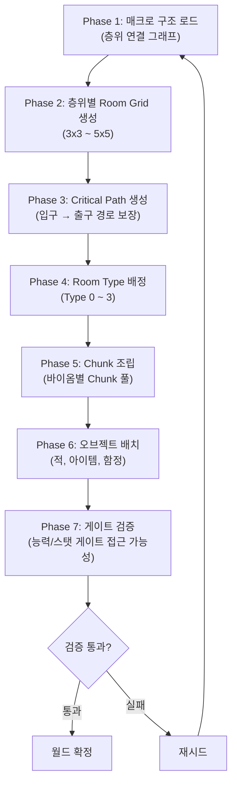
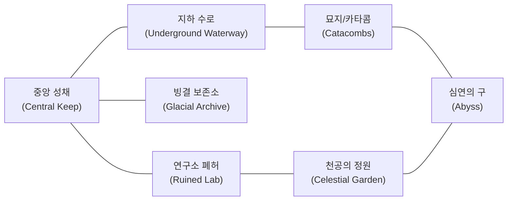

# 월드 절차적 생성 시스템 (World Procedural Generation System)

## 0. 필수 참고 자료 (Mandatory References)

* Project Definition: `Documents/Terms/Project_Vision_Abyss.md`
* 아이템계 Floor Gen: `Documents/System/System_ItemWorld_FloorGen.md` (SYS-IW-02)
* 층위 상세 설계: `Documents/System/System_World_ZoneDesign.md`

---

## 구현 현황 (Implementation Status)

> **최근 업데이트:** 2026-03-23
> **문서 상태:** `작성 중 (Draft)`
> **3-Space:** World
> **기둥:** 탐험

| 기능 ID      | 분류   | 기능명 (Feature Name)              | 우선순위 | 구현 상태    | 비고 (Notes)                  |
| :----------- | :----- | :--------------------------------- | :------: | :----------- | :---------------------------- |
| WPG-01-A     | 시스템 | 매크로 구조 로드                   |    P1    | ⬜ 제작 필요 | 층위 연결 그래프 로드          |
| WPG-02-A     | 시스템 | Room Grid 생성                     |    P1    | ⬜ 제작 필요 | 층위별 3x3~5x5 그리드         |
| WPG-03-A     | 시스템 | Critical Path 생성                 |    P1    | ⬜ 제작 필요 | Always Winnable 보장           |
| WPG-04-A     | 시스템 | Room Type 배정                     |    P1    | ⬜ 제작 필요 | Type 0~3 분류                  |
| WPG-05-A     | 시스템 | Chunk 조립                         |    P1    | ⬜ 제작 필요 | 바이옴별 Chunk 풀              |
| WPG-06-A     | 시스템 | 오브젝트 배치                      |    P2    | ⬜ 제작 필요 | 적, 아이템, 함정               |
| WPG-07-A     | 시스템 | 게이트 검증                        |    P1    | ⬜ 제작 필요 | 능력/스탯 게이트 접근 가능성   |
| WPG-08-A     | 시스템 | 시드 시스템                        |    P1    | ⬜ 제작 필요 | 서버 고정 시드                 |

---

## 1. 개요 (Concept)

### 1-1. 의도 (Intent)

Project Abyss의 월드 생성은 **핸드크래프트의 감성과 절차적 생성의 리플레이성**을 동시에 달성하는 하이브리드 시스템이다. 플레이어는 새로운 던전 구조를 탐험하면서도, 각 층위가 가진 고유한 분위기와 내러티브 흐름은 일관되게 경험한다.

### 1-2. 설계 근거 (Reasoning)

월드 생성을 **매크로(Macro)**와 **마이크로(Micro)** 이중 구조로 분리한다.

| 계층                | 생성 방식      | 대상                                      | 레퍼런스                                 |
| :------------------ | :------------- | :---------------------------------------- | :--------------------------------------- |
| 매크로 (Macro)      | 핸드크래프트   | 층위 배치, 층위 간 연결, 내러티브 흐름     | 월하의 야상곡 (성 구조 고정 배치)         |
| 마이크로 (Micro)    | 절차적 생성    | 층위 내부 Room Grid, Chunk 배치, 오브젝트  | 스펠렁키 (4x4 Grid), 데드셀 (PCG 파이프라인) |

- **매크로 계층**: 7개 층위(중앙 성채, 연구소 폐허, 빙결 보존소, 지하 수로, 묘지/카타콤, 천공의 정원, 심연의 구)의 위치와 연결 관계는 모든 시드에서 동일하다. 탐험의 방향성과 내러티브 흐름을 보장한다.
- **마이크로 계층**: 각 층위 내부의 Room 배치, Room 내 Chunk 조합, 적/아이템/함정 배치는 시드에 의해 절차적으로 생성된다. 리플레이 가치를 제공한다.

### 1-3. 문제-해결 점검 (Cursed Problem Check)

| 문제                                            | 해결 방안                                                                                 |
| :---------------------------------------------- | :---------------------------------------------------------------------------------------- |
| 절차적 생성이 탐험감을 해치지 않는가?            | 매크로 구조는 고정하여 층위 간 이동의 감성을 유지한다. 마이크로만 절차적으로 변형한다.      |
| 모든 시드에서 클리어가 가능한가?                 | Critical Path 알고리즘이 생성 후 경로 유효성을 검증한다. 실패 시 재시드한다.                |

### 1-4. 리스크와 보상 (Risk & Reward)

- **리스크**: Chunk 풀 부족 시 층위 내 반복감 증가. 바이옴별 최소 40개 Chunk를 확보해야 한다.
- **보상**: 절차적 내부 구조로 탐험 동기를 지속적으로 부여한다.

---

## 2. 메커닉 (Mechanics)

### 2-1. 생성 파이프라인 (Generation Pipeline)



### 2-2. Phase 1 — 매크로 구조 로드 (Macro Structure Load)

서버에 저장된 층위 연결 그래프(Zone Connectivity Graph)를 로드한다. 이 그래프는 모든 시드에서 동일하다.



- **Action**: 서버가 시드를 결정하고, 매크로 그래프를 로드한다.
- **Reaction**: 각 층위의 Grid 크기와 바이옴이 확정된다.
- **Effect**: 층위 간 연결 포인트(Portal)의 위치가 고정된다.

### 2-3. Phase 2 — 층위별 Room Grid 생성 (Room Grid Generation)

각 층위는 층위별로 정해진 크기의 2D Grid를 생성한다. Grid의 각 셀이 하나의 Room이다.

- **Action**: 시드 기반 난수 생성기(PRNG)가 Grid 크기 범위 내에서 실제 Grid를 결정한다.
- **Reaction**: Grid의 최상단 행에 입구, 최하단 행에 출구(또는 반대)를 배치한다.
- **Effect**: 비어 있는 Grid 위에 Room이 배치될 준비가 완료된다.

### 2-4. Phase 3 — Critical Path 생성 (Critical Path Generation)

입구에서 출구까지 반드시 도달 가능한 경로를 먼저 생성한다. 스펠렁키의 Critical Path 알고리즘을 기반으로 한다.

- **Action**: 입구 Room에서 시작하여 좌/우/하 방향으로 무작위 이동하며 경로를 확장한다.
- **Reaction**: 경로가 최하단 행에 도달하면 Critical Path가 완성된다.
- **Effect**: Critical Path 위의 모든 Room은 반드시 접근 가능하다. Always Winnable이 보장된다.

### 2-5. Phase 4 — Room Type 배정 (Room Type Assignment)

Critical Path와 비경로 Room에 각각 Type을 배정한다. Room Type은 해당 Room의 출입구 구조를 결정한다.

- **Action**: Critical Path Room은 경로 방향에 맞는 Type(1, 2, 3)을 배정받는다.
- **Reaction**: 비경로 Room은 Type 0(막힌 방) 또는 Type 1(좌우 통로)을 배정받는다.
- **Effect**: 모든 Room의 출입구 구조가 확정된다.

### 2-6. Phase 5 — Chunk 조립 (Chunk Assembly)

각 Room은 내부적으로 Chunk의 격자로 구성된다. 바이옴에 맞는 Chunk 풀에서 무작위로 선택하여 조립한다.

- **Action**: Room의 출입구 위치에 맞는 Chunk를 먼저 배치한다 (문/통로 Chunk).
- **Reaction**: 나머지 영역을 바이옴별 Chunk 풀에서 선택하여 채운다.
- **Effect**: Room 내부의 타일 레이아웃이 완성된다.

### 2-7. Phase 6 — 오브젝트 배치 (Object Placement)

완성된 Room에 적, 아이템 스폰 포인트, 함정을 배치한다.

- **Action**: 층위 난이도에 따른 몬스터 밀도 테이블을 참조하여 적 스폰 포인트를 결정한다.
- **Reaction**: 아이템 스폰 포인트와 함정은 Chunk 내 지정된 슬롯에 배치된다.
- **Effect**: 플레이 가능한 Room이 완성된다.

### 2-8. Phase 7 — 게이트 검증 (Gate Validation)

능력 게이트(Ability Gate)와 스탯 게이트(Stat Gate)가 올바르게 배치되었는지 검증한다.

- **Action**: Critical Path를 따라 모든 게이트를 순회하며 해당 시점에서 플레이어가 통과 가능한지 확인한다.
- **Reaction**: 통과 불가능한 게이트가 Critical Path 위에 존재하면 해당 게이트를 제거하거나 재배치한다.
- **Effect**: Always Winnable 조건이 최종 확정된다.

---

## 3. 규칙 (Rules)

### 3-1. Room Type 정의 (Room Type Definitions)

| Type | 이름              | 출입구 구조               | 용도                                       |
| :--: | :---------------- | :------------------------ | :----------------------------------------- |
|  0   | 막힌 방 (Dead End)| 없음                      | 비경로 Room. Grid 채움용                    |
|  1   | 좌우 통로 (LR)   | 좌측, 우측                | 수평 이동 경로                              |
|  2   | 좌우+하 (LRD)    | 좌측, 우측, 하단          | 하강 분기점. Critical Path의 하강 지점      |
|  3   | 좌우+상 (LRU)    | 좌측, 우측, 상단          | 상승 분기점. 보상 경로 또는 숏컷            |

- Type 0 Room은 Critical Path에 배정되지 않는다.
- Critical Path에서 하강이 발생하는 Room은 반드시 Type 2이다.
- Type 3 Room은 선택적 탐험 경로에만 배치한다.

### 3-2. Critical Path 알고리즘 (Critical Path Algorithm)

다음 단계를 순서대로 실행한다.

1. Grid의 최상단 행에서 무작위로 시작 Room을 선택한다.
2. 현재 Room에서 이동 방향을 결정한다. 확률 분포: 좌(30%), 우(30%), 하(40%).
3. 좌/우 이동 시, Grid 경계에 도달하면 반드시 하강한다.
4. 하강 시, 현재 Room에 Type 2를 배정한다.
5. 최하단 행에 도달하면 경로를 종료한다.
6. 경로 길이가 Grid 셀 수의 40% 미만이면 재생성한다.
7. 완성된 Critical Path의 모든 Room은 "경로 Room"으로 표시한다.

### 3-3. Chunk 구조 (Chunk Structure)

- 1 Chunk = 5x3 타일 = 80x48 픽셀 (16px 타일 기준)
- 1 Room = 12x11 Chunk (가로 12, 세로 11) + 경계 Chunk
- Room의 총 타일 크기: 60x34 타일 (960x544 픽셀)
- Chunk는 바이옴별로 분류된 풀에서 선택한다.

### 3-4. 바이옴별 Chunk 풀 (Biome Chunk Pool)

| 바이옴 ID          | 층위명          | 최소 Chunk 수 | 특수 Chunk                        |
| :------------------ | :-------------- | :-----------: | :-------------------------------- |
| castle_interior     | 중앙 성채       |      40       | 왕좌실, 무기고, 대회랑            |
| arcane              | 연구소 폐허     |      40       | 마법진, 포탈 방, 실험실           |
| ice                 | 빙결 보존소     |      40       | 빙벽, 미끄러운 바닥, 고드름 함정  |
| water               | 지하 수로       |      40       | 수중 통로, 수문, 급류             |
| dark                | 묘지/카타콤     |      40       | 석관, 함정 통로, 은밀한 방        |
| sky                 | 천공의 정원     |      40       | 부유 발판, 강풍 구간, 전망대      |
| void                | 심연의 구       |      50       | 불안정 지형, 공허 구간, 보스 아레나 |

- 각 바이옴의 Chunk 풀은 최소 수량 이상을 확보해야 반복감을 방지한다.
- 특수 Chunk는 해당 바이옴에서만 출현한다.

### 3-5. 적 배치 밀도 규칙 (Monster Density Rules)

층위 난이도(Difficulty)에 따라 Room 내 전투 타일 비율을 결정한다.

| 난이도 | 전투 타일 비율 | 엘리트 출현 확률 | 최대 동시 적 수 |
| :----: | :-----------: | :--------------: | :-------------: |
|   1    |     30%       |       5%         |        4        |
|   2    |     40%       |      10%         |        6        |
|   3    |     50%       |      15%         |        8        |
|   4    |     60%       |      20%         |       10        |
|   5    |     70%       |      30%         |       12        |

- 전투 타일 비율: Room 내 Chunk 중 적 스폰 포인트가 포함된 Chunk의 비율이다.
- Critical Path Room의 적 배치는 비경로 Room 대비 80%로 감소한다 (진행 보장).

### 3-6. 게이트 배치 규칙 (Gate Placement Rules)

| 게이트 종류                   | 배치 위치              | 용도                                  |
| :---------------------------- | :--------------------- | :------------------------------------ |
| 능력 게이트 (Ability Gate)    | 층위 경계에만 배치      | 특정 능력(이중 점프 등) 필요           |
| 스탯 게이트 (Stat Gate)       | 층위 내부에도 배치 가능 | 특정 스탯 임계값(공격력, 방어력) 필요  |

- 능력 게이트는 Critical Path 위에 배치되지 않는다. Critical Path는 기본 능력만으로 통과 가능하다.
- 스탯 게이트는 보상 경로(비경로)에 배치하여 선택적 도전을 제공한다.
- 층위 경계의 능력 게이트는 해당 능력을 획득할 수 있는 층위가 반드시 선행 층위여야 한다.

### 3-7. Always Winnable 검증 (Always Winnable Validation)

생성 완료 후 다음 검증을 실행한다.

1. 시작 지점(중앙 성채 입구)에서 최종 보스(심연의 구)까지 경로가 존재하는지 BFS로 확인한다.
2. 경로 상의 모든 능력 게이트에 대해, 해당 능력의 획득 지점이 경로상 이전에 존재하는지 확인한다.
3. 각 층위 내부의 Critical Path가 Type 0 Room에 의해 차단되지 않았는지 확인한다.
4. 검증 실패 시 현재 시드를 폐기하고 시드 값을 +1 증가시켜 재생성한다.
5. 연속 10회 실패 시 폴백 맵(최소 구조 맵)을 사용한다.

---

## 4. 데이터 및 파라미터 (Parameters)

```yaml
world_procgen:
  # 기본 타일 설정
  tile_size_px: 16
  room_width_tiles: 60      # 1 Room = 60x34 타일 (960x544 px)
  room_height_tiles: 34
  chunk_width_tiles: 5       # 1 Chunk = 5x3 타일 (80x48 px)
  chunk_height_tiles: 3

  # 시드 설정
  seed:
    type: "server_fixed"     # 서버에서 시드 고정
    reseed_max_retry: 10     # 재시드 최대 시도 횟수

  # 층위 정의
  zones:
    central_keep:
      display_name: "중앙 성채 (Central Keep)"
      grid_size: "4x4"
      difficulty: 1
      biome: "castle_interior"
      is_start_zone: true
    magic_lab:
      display_name: "연구소 폐허 (Ruined Lab)"
      grid_size: "4x3"
      difficulty: 3
      biome: "arcane"
      is_start_zone: false
    ice_cavern:
      display_name: "빙결 보존소 (Glacial Archive)"
      grid_size: "3x4"
      difficulty: 3
      biome: "ice"
      is_start_zone: false
    underground_waterway:
      display_name: "지하 수로 (Underground Waterway)"
      grid_size: "5x3"
      difficulty: 2
      biome: "water"
      is_start_zone: false
    catacombs:
      display_name: "묘지/카타콤 (Catacombs)"
      grid_size: "4x4"
      difficulty: 2
      biome: "dark"
      is_start_zone: false
    sky_tower:
      display_name: "천공의 정원 (Celestial Garden)"
      grid_size: "3x5"
      difficulty: 4
      biome: "sky"
      is_start_zone: false
    abyss:
      display_name: "심연의 구 (Abyss)"
      grid_size: "5x5"
      difficulty: 5
      biome: "void"
      is_start_zone: false

  # 적 배치 밀도 (난이도별 전투 타일 비율)
  monster_density:
    difficulty_1: 0.3
    difficulty_2: 0.4
    difficulty_3: 0.5
    difficulty_4: 0.6
    difficulty_5: 0.7

  # 엘리트 출현 확률 (난이도별)
  elite_spawn_rate:
    difficulty_1: 0.05
    difficulty_2: 0.10
    difficulty_3: 0.15
    difficulty_4: 0.20
    difficulty_5: 0.30

  # 최대 동시 적 수 (난이도별)
  max_concurrent_enemies:
    difficulty_1: 4
    difficulty_2: 6
    difficulty_3: 8
    difficulty_4: 10
    difficulty_5: 12

  # Critical Path 설정
  critical_path:
    direction_weight_left: 0.3
    direction_weight_right: 0.3
    direction_weight_down: 0.4
    min_path_ratio: 0.4      # 경로 길이가 Grid 셀 수의 40% 이상이어야 함
    path_enemy_density_modifier: 0.8  # Critical Path Room 적 밀도 감소 계수

  # Chunk 풀 최소 요구 수량
  min_chunk_pool_size:
    default: 40
    void: 50                 # 심연의 구는 50개 이상
```

---

## 5. 예외 처리 (Edge Cases)

### 5-1. 유효하지 않은 맵 생성 시 재시드 (Invalid Map Reseed)

- 생성된 맵이 Always Winnable 검증을 통과하지 못하면 시드 값을 +1 증가시켜 재생성한다.
- 연속 10회 실패 시 폴백 맵(Fallback Map)을 사용한다.
- 폴백 맵은 각 층위의 최소 Grid(3x3)로 구성된 사전 검증 완료 맵이다.
- 폴백 맵 사용 시 서버 로그에 경고를 기록하고, 운영팀에 알림을 전송한다.

### 5-2. 플레이어가 맵 밖으로 나가는 경우 (Out of Bounds)

- Room 경계에 Kill Zone(즉사 영역)을 배치한다.
- Kill Zone 진입 시 플레이어를 해당 Room의 입구 지점으로 즉시 리스폰한다.
- HP 손실 없이 위치만 복구한다 (버그에 의한 이탈로 판단).
- 리스폰 발생 시 클라이언트 로그에 좌표와 Room ID를 기록한다.

### 5-3. 월드 생성 실패 시 폴백 (Generation Failure Fallback)

- 서버 메모리 부족, 타임아웃 등으로 생성 자체가 실패하는 경우 대비한다.
- 생성 타임아웃: 층위당 최대 5초, 전체 월드 최대 30초.
- 타임아웃 초과 시 마지막으로 성공한 월드를 재사용한다.
- 최초 생성 시에는 내장된 기본 월드(Default World)를 사용한다.

---

## 월드 생성과 아이템계 Strata Gen 비교 (World ProcGen vs. Item World Strata Gen)

| 비교 항목           | 월드 절차적 생성 (본 문서)               | 아이템계 Strata Gen (SYS-IW-02)         |
| :------------------ | :--------------------------------------- | :-------------------------------------- |
| 문서 ID             | WPG (본 문서)                            | SYS-IW-02                               |
| 생성 범위           | 전체 월드 (7개 층위)                     | 단일 아이템 내부 던전 (1개 아이템)       |
| 매크로 구조         | 핸드크래프트 (층위 배치 고정)            | 없음 (전체 절차적)                       |
| 마이크로 구조       | 절차적 (Room Grid + Chunk)               | 절차적 (지층 단위 생성)                  |
| 시드 수명           | 서버 설정에 따라 결정                    | 1회 진입 시 생성, 퇴장 시 소멸           |
| Grid 크기           | 층위별 3x3 ~ 5x5                        | 지층별 3x3 ~ 5x5 (레어리티에 따라)      |
| 바이옴              | 층위별 고유 바이옴 (7종)                 | 아이템 속성에 따라 결정                  |
| Critical Path       | 층위 내 + 층위 간 연결 모두 검증         | 지층별 독립 검증                         |
| 난이도 결정         | 층위별 고정 난이도 (1~5)                 | 지층 깊이에 비례                         |
| 게이트 시스템       | 능력 게이트 + 스탯 게이트                | 스탯 게이트만                            |
| 리플레이 주기       | 시드 변경 시                             | 매 진입마다 새로 생성                    |
| 동시 접속           | 다수 플레이어가 동일 월드 공유           | 파티 단위 인스턴스                       |

---

## 검증 기준 (Verification Checklist)

* [ ] 모든 시드에서 시작 지점(중앙 성채)에서 최종 보스(심연의 구)까지 경로가 존재한다
* [ ] Critical Path 위에 능력 게이트가 배치되지 않는다
* [ ] 각 층위의 Room Grid 크기가 파라미터 범위 내이다
* [ ] 바이옴별 Chunk 풀이 최소 수량 이상 확보되어 있다
* [ ] 연속 재시드 10회 초과 시 폴백 맵이 정상 로드된다
* [ ] 시드 변경 시 플레이어 데이터 저장이 변경 전에 완료된다
* [ ] Room Type 배정이 Critical Path의 이동 방향과 일치한다
* [ ] 적 배치 밀도가 층위 난이도 테이블과 일치한다
* [ ] 생성 타임아웃 (전체 30초) 내에 월드 생성이 완료된다
* [ ] Out of Bounds 리스폰이 HP 손실 없이 정상 작동한다
