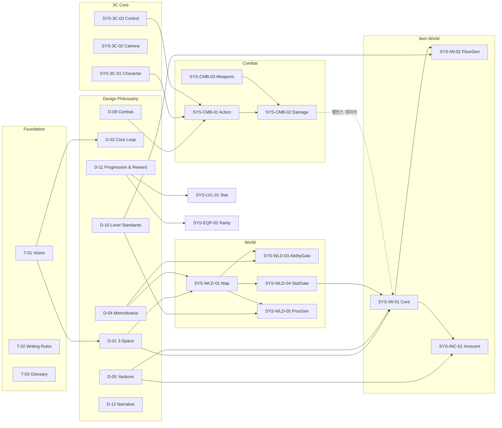

# Project Abyss GDD 문서 인덱스 (Document Index)

> **최근 업데이트:** 2026-04-02
> **문서 상태:** `작성 중 (Draft)`

이 문서는 Project Abyss의 전체 GDD 문서 트리를 정의합니다. 모든 시스템 문서의 위치, 상태, 의존 관계를 추적합니다.

---

## 0. 필수 참고 자료 (Mandatory References)

- Project Vision: `Documents/Terms/Project_Vision_Abyss.md`
- Writing Standards: `Documents/Terms/GDD_Writing_Rules.md`
- Glossary: `Documents/Terms/Glossary.md`
- Game Overview: `Reference/게임 기획 개요.md`

---

## 문서 트리 총괄 (Document Tree Overview)

```mermaid
graph TD
    VISION[Project Vision] --> CORE[Core Systems]
    VISION --> SPACE[2-Space Architecture]

    CORE --> 3C[3C: Character/Camera/Control]
    CORE --> COMBAT[Combat System]
    CORE --> GROWTH[Growth System]

    SPACE --> WORLD[World Systems]
    SPACE --> IW[Item World Systems]

    WORLD --> MAP[World Map Structure]
    WORLD --> GATE[Gating Systems]
    WORLD --> PROCGEN_W[World Procedural Generation]
    WORLD --> SAVEPOINT[Save Point: Forge/Shop]

    IW --> IW_DUNGEON[Item World Dungeon]
    IW --> INNOCENT[Innocent System]
    IW --> PROCGEN_IW[IW Procedural Generation]

    COMBAT --> ACTION[Action System]
    COMBAT --> DAMAGE[Damage System]
    COMBAT --> ENEMY[Enemy AI]

    GROWTH --> STAT[Stat System]
    GROWTH --> EQUIP[Equipment System]
    GROWTH --> SKILL[Skill System]

    3C --> CHAR[Character Design]
    3C --> CAM[Camera System]
    3C --> CTRL[Control Scheme]

    VISION --> COMBAT_D[Combat Philosophy]
    VISION --> PROG[Progression & Reward]
    VISION --> NARR[Narrative & Worldbuilding]
    VISION --> LEVEL[Level Design Standards]
    COMBAT_D --> COMBAT
    PROG --> GROWTH
    LEVEL --> WORLD
    LEVEL --> IW
```

---

## 1. Terms (메타 문서)

| ID | 문서명 | 경로 | 상태 | 설명 |
| :--- | :--- | :--- | :--- | :--- |
| T-01 | Project Vision | `Terms/Project_Vision_Abyss.md` | ✅ 완료 | 3대 기둥, 핵심 판타지, 톤 & 매너, 금지 규칙, 타겟 유저, 플랫폼 전략 |
| T-02 | GDD Writing Rules | `Terms/GDD_Writing_Rules.md` | ✅ 완료 | 5단계 구조, 네이밍, 마크다운 규칙 |
| T-03 | Glossary | `Terms/Glossary.md` | ✅ 완료 | 공식 용어 사전 |
| T-04 | Document Index | `Terms/Document_Index.md` | 🔄 진행 중 | 이 문서 |
| T-05 | GDD Roles | `Terms/GDD_Roles.md` | ✅ 완료 | 수석 게임 디자이너 역할, 책임, 협업 프로토콜 |
| T-06 | Sheets Writing Rules | `Terms/Sheets_Writing_Rules.md` | ✅ 완료 | CSV 데이터 시트 작성 규칙, ID 체계, SSoT |

---

## 2. Design (설계 원칙/철학)

| ID | 문서명 | 경로 | 상태 | 3-Space | 기둥 |
| :--- | :--- | :--- | :--- | :--- | :--- |
| D-01 | 2-Space Architecture | `Design/Design_Architecture_2Space.md` | ✅ 완료 | 전체 | 전체 |
| D-02 | Core Loop Design | `Design/Design_CoreLoop_Circulation.md` | ✅ 완료 | 전체 | 전체 |
| D-03 | Difficulty Philosophy | `Design/Design_Difficulty_Progression.md` | ✅ 완료 | 전체 | 탐험+야리코미 |
| D-04 | Metroidvania Philosophy | `Design/Design_Metroidvania_Philosophy.md` | ✅ 완료 | World | 탐험 |
| D-05 | Yarikomi Philosophy | `Design/Design_Yarikomi_Philosophy.md` | ✅ 완료 | ItemWorld | 야리코미 |
| D-06 | Online Design Principles | `Design/Design_Online_Principles.md` | ⬜ 제작 필요 | 전체 | 멀티플레이 |
| D-07 | Economy Philosophy | `Design/Design_Economy_FaucetSink.md` | ✅ 완료 | 전체 | 전체 |
| D-09 | Combat Design Philosophy | `Design/Design_Combat_Philosophy.md` | ✅ 완료 | World+IW | 탐험+야리코미 |
| D-10 | Level Design Standards | `Design/Design_Level_Standards.md` | ✅ 완료 | World+IW | 탐험+야리코미 |
| D-11 | Progression & Reward Design | `Design/Design_Progression_Reward.md` | ✅ 완료 | 전체 | 전체 |
| D-12 | Narrative & Worldbuilding | `Design/Design_Narrative_Worldbuilding.md` | ✅ 완료 | World+IW | 탐험+야리코미 |
| D-13 | WorldLayout GridVania Analysis | `Design/WorldLayout_GridVania_Analysis.md` | ✅ 완료 | World | 탐험 |
| D-14 | Monetization Strategy | `Design/Design_Monetization_Strategy.md` | ✅ 완료 | 전체 | 전체 |

**D-09 Combat Design Philosophy 범위:**
- 전투 미학: 타격감(Juice)의 3요소 (히트스탑, 화면흔들림, 넉백) 설계 원칙
- 전투 리듬: 공격-회피-반격 순환, 긴장과 이완의 파형 설계
- 적 조우 설계: 전투 아레나 진입/이탈 흐름, 적 조합 철학
- 보스전 철학: 패턴 학습 → 마스터리, 페이즈 전환, 위기/보상 리듬
- 무기 다양성 원칙: 무기 간 차별화 축 (사거리/속도/범위), 플레이스타일 분기
- 난이도와 공정함: "죽음은 플레이어의 실수", 히트박스 정직성, 반응 가능한 공격

**D-11 Progression & Reward Design 범위:**
- 성장 곡선 철학: 초반 급성장 → 중반 안정 → 후반 야리코미 곡선
- 보상 심리: 가변비율 강화(Variable Ratio Reinforcement), 니어미스 효과
- 드랍 설계 원칙: 직접 드랍 vs 제작 소재, 레어리티별 기대감 곡선
- 파워 판타지 밸런스: 강해지는 느낌 vs 도전의 유지, 수치 인플레이션 관리

**D-12 Narrative & Worldbuilding 범위:**
- 핵심 원칙: "아이템이 곧 서사 매체" — 아이템계에 들어가면 아이템의 역사가 몬스터/지형/NPC로 구현
- 아이템 서사 구조: 기원(Creator/Purpose/History/Fate) → 아이템계의 테마 결정
- 레어리티 = 서사 깊이: Normal(일상) → Magic(사연) → Rare(사건) → Legendary(역사) → Ancient(신화)
- 테마 풀 시스템: 무기 카테고리 × 기원 테마 × 레어리티로 절차적 서사 생성
- 환경 서사 7대 원칙: 씬>플롯, 정보 제거, 묵시적 서사, 40초 법칙, 환경 일관성, 시선 차단, Fire/Ember
- 서사 전달: 환경 서사(지형/분위기) 최우선, 유령 NPC 대사(3문장 이하), 플레이버 텍스트
- NPC 대사 설계: 신호/잡음 이론, 이노센트 어투 차별화, "빈 시간" 설계
- 세계관 톤: 고딕 비극(고등급) + 경쾌한 야리코미(저등급) 이중 톤
- 월드-아이템계 수직 서사: 월드(현재) → 아이템계(과거) → 월드 복귀(이해)
- "심연(Abyss)" 미스터리: 모든 Ancient 아이템의 최심층 지층이 같은 곳을 가리킨다

---

## 3. System (시스템 메커닉) — 5단계 구조 필수

### 3.1 Core: 3C (Character / Camera / Control)

| ID | 문서명 | 경로 | 상태 | 3-Space | 기둥 |
| :--- | :--- | :--- | :--- | :--- | :--- |
| SYS-3C-01 | Character Design | `System/System_3C_Character.md` | ✅ 완료 | 전체 | 전체 |
| SYS-3C-02 | Camera System | `System/System_3C_Camera.md` | ✅ 완료 | 전체 | 탐험 |
| SYS-3C-03 | Control Scheme | `System/System_3C_Control.md` | ✅ 완료 | 전체 | 전체 |

**SYS-3C-01 Character Design 범위:**
- 캐릭터 외형/실루엣 원칙
- 캐릭터 물리: 이동 속도, 점프 높이, 중력, 가속/감속 곡선
- 캐릭터 상태 머신 (Idle/Run/Jump/Fall/Dash/Attack/Hit/Death)
- 히트박스/허트박스 정의
- 무기별 캐릭터 모션 차이

**SYS-3C-02 Camera System 범위:**
- 카메라 추적 방식 (Lerp 기반 Smooth Follow)
- 룸 경계 카메라 전환 (Room Transition)
- 전투 시 카메라 쉐이크 파라미터
- 보스전 카메라 연출 (Lock-on, Zoom)
- 아이템계 vs 월드 카메라 규칙 차이
- 멀티플레이 시 카메라 처리 (리더 추적 / 분할)

**SYS-3C-03 Control Scheme 범위:**
- 키보드/게임패드 매핑
- 입력 버퍼링 (Coyote Time, Input Buffer)
- 조작 복잡도 계층 (기본 → 고급 → 마스터)

### 3.2 전투 시스템 (Combat)

| ID | 문서명 | 경로 | 상태 | 3-Space | 기둥 |
| :--- | :--- | :--- | :--- | :--- | :--- |
| SYS-CMB-01 | Action System | `System/System_Combat_Action.md` | ✅ 완료 | World+IW | 탐험+야리코미 |
| SYS-CMB-02 | Damage System | `System/System_Combat_Damage.md` | ✅ 완료 | 전체 | 전체 |
| SYS-CMB-03 | Weapons & Slots | `System/System_Combat_Weapons.md` | ✅ 완료 | 전체 | 야리코미 |
| SYS-CMB-04 | SubWeapon System | `System/System_Combat_SubWeapon.md` | ⬜ 제작 필요 | World+IW | 탐험 |
| SYS-CMB-05 | Elemental Affinity | `System/System_Combat_Elements.md` | ⬜ 제작 필요 | World+IW | 전체 |
| SYS-CMB-06 | Status Effects | `System/System_Combat_StatusEffects.md` | ⬜ 제작 필요 | World+IW | 전체 |
| SYS-CMB-07 | Hit Feedback | `System/System_Combat_HitFeedback.md` | ✅ 완료 | World+IW | 전체 |

**SYS-CMB-01 Action System 범위:**
- 자동 콤보 3타 (무기별 모션 차이)
- 스킬 슬롯 4개 시전 (원터치 발동, 쿨다운, 자동 조준)
- 대시 위치 이탈 회피 (무적 없음, 쿨다운 400ms, 3타 후딜 캔슬)
- 공중 공격, 하방 공격 바운스
- 피격 경직 (Hitstun) + 넉백 + 슈퍼 아머
- 히트스탑 (타격감)

### 3.3 성장 시스템 (Growth)

| ID | 문서명 | 경로 | 상태 | 3-Space | 기둥 |
| :--- | :--- | :--- | :--- | :--- | :--- |
| SYS-LVL-01 | Stat System | `System/System_Growth_Stats.md` | ✅ 완료 | 전체 | 전체 |
| SYS-LVL-02 | Level & Experience | `System/System_Growth_LevelExp.md` | ✅ 완료 | 전체 | 야리코미 |
| SYS-LVL-03 | ~~Skill Tree~~ | `System/System_Growth_SkillTree.md` | ~~DEPRECATED~~ | - | - |
| SYS-LVL-04 | ~~Reincarnation~~ | `System/System_Growth_Reincarnation.md` | ~~DEPRECATED~~ | - | - |

### 3.4 장비 시스템 (Equipment)

| ID | 문서명 | 경로 | 상태 | 3-Space | 기둥 |
| :--- | :--- | :--- | :--- | :--- | :--- |
| SYS-EQP-01 | Equipment Slots | `System/System_Equipment_Slots.md` | ✅ 완료 | 전체 | 야리코미 |
| SYS-EQP-02 | Rarity System | `System/System_Equipment_Rarity.md` | ✅ 완료 | 전체 | 야리코미 |
| SYS-EQP-03 | Item Growth Path | `System/System_Equipment_Growth.md` | ✅ 완료 | IW | 야리코미 |

### 3.5 월드 시스템 (World)

| ID | 문서명 | 경로 | 상태 | 3-Space | 기둥 |
| :--- | :--- | :--- | :--- | :--- | :--- |
| SYS-WLD-01 | World Map Structure | `System/System_World_MapStructure.md` | ✅ 완료 | World | 탐험 |
| SYS-WLD-02 | Zone Design | `System/System_World_ZoneDesign.md` | ✅ 완료 | World | 탐험 |
| SYS-WLD-03 | Ability Gating | `System/System_World_AbilityGating.md` | ✅ 완료 | World | 탐험 |
| SYS-WLD-04 | Stat Gating | `System/System_World_StatGating.md` | ✅ 완료 | World | 탐험+야리코미 |
| SYS-WLD-05 | World ProcGen | `System/System_World_ProcGen.md` | ✅ 완료 | World | 탐험 |
| SYS-WLD-06 | Save & Warp | `System/System_World_SaveWarp.md` | ⬜ 제작 필요 | World | 탐험 |
| SYS-WLD-07 | Secrets & Rewards | `System/System_World_Secrets.md` | ⬜ 제작 필요 | World | 탐험 |

**SYS-WLD-01 World Map Structure 범위:**
- 매크로 구조: 수직 하강 + 가지 경로 토폴로지
- 층위 연결 그래프 (Concept Graph)
- 진행 순서 (Critical Path) vs 자유 탐험
- 역전 성/심연 층위 (엔드게임)

**SYS-WLD-05 World ProcGen 범위:**
- 매크로 = 핸드크래프트 (층위 배치 고정)
- 마이크로 = 절차적 (Room Grid 내 Chunk 조립)
- 시드 시스템 (서버 고정 시드)
- Room Type 0~3 역할 + 출입구 연결
- Chunk 팔레트 (바이옴별)
- Always Winnable 보장 알고리즘

### 3.6 아이템계 시스템 (Item World)

| ID | 문서명 | 경로 | 상태 | 3-Space | 기둥 |
| :--- | :--- | :--- | :--- | :--- | :--- |
| SYS-IW-01 | Item World Core | `System/System_ItemWorld_Core.md` | ✅ 완료 | IW | 야리코미 |
| SYS-IW-02 | IW Strata Generation | `System/System_ItemWorld_FloorGen.md` | ✅ 완료 | IW | 야리코미 |
| SYS-IW-03 | IW Boss System | `System/System_ItemWorld_Boss.md` | ✅ 완료 | IW | 야리코미 |
| SYS-IW-04 | Recursive Entry | `System/System_ItemWorld_Recursion.md` | ✅ 완료 | IW | 야리코미 |
| SYS-IW-05 | Mystery Room & Events | `System/System_ItemWorld_Events.md` | ✅ 완료 | IW | 야리코미 |
| SYS-IW-06 | Geo Effects | `System/System_ItemWorld_GeoEffects.md` | ⬜ 제작 필요 | IW | 야리코미 |

**SYS-IW-02 Strata Generation 범위:**
- 시드: `hash(itemID + itemLevel + stratumNumber)`
- Room Grid 크기 (아이템계 4×4 고정)
- Critical Path 생성 알고리즘
- Chunk 삽입 (레어리티별 복잡도)
- 오브젝트 배치 (적, 이노센트, 보상)
- 월드 ProcGen과의 차이점 명시

### 3.7 아이템 서사 시스템 (Item Narrative)

| ID | 문서명 | 경로 | 상태 | 3-Space | 기둥 |
| :--- | :--- | :--- | :--- | :--- | :--- |
| SYS-INR-01 | Item Narrative Template | `System/System_ItemNarrative_Template.md` | ✅ 완료 | IW | 야리코미 |
| SYS-INR-02 | Environment Pool | `System/System_ItemNarrative_EnvironmentPool.md` | ✅ 완료 | IW | 야리코미 |
| SYS-INR-03 | Monster Pool | `System/System_ItemNarrative_MonsterPool.md` | ✅ 완료 | IW | 야리코미 |

### 3.8 퀘스트 서사 시스템 (Quest Narrative)

| ID | 문서명 | 경로 | 상태 | 3-Space | 기둥 |
| :--- | :--- | :--- | :--- | :--- | :--- |
| SYS-QST-01 | ~~Quest Narrative Framework~~ | `System/System_Quest_Narrative.md` | ❌ DEPRECATED | — | — |

> DEPRECATED: 퀘스트 서사 프레임워크는 스코프 축소로 삭제. 서사는 아이템 내러티브 시스템으로 전달.

### 3.9 대화 시스템 (Dialogue)

| ID | 문서명 | 경로 | 상태 | 3-Space | 기둥 |
| :--- | :--- | :--- | :--- | :--- | :--- |
| SYS-DLG-01 | ~~Dialogue System~~ | `System/System_Dialogue.md` | ❌ DEPRECATED | — | — |

### 3.10 이노센트 시스템 (Innocent)

| ID | 문서명 | 경로 | 상태 | 3-Space | 기둥 |
| :--- | :--- | :--- | :--- | :--- | :--- |
| SYS-INC-01 | Innocent Core | `System/System_Innocent_Core.md` | ✅ 완료 | IW | 야리코미 |
| SYS-INC-02 | ~~Innocent Farm~~ | `System/System_Innocent_Farm.md` | ❌ DEPRECATED | Hub | 야리코미 |
| ~~SYS-INC-03~~ | ~~Dual Innocent~~ | ~~`System/System_Innocent_Dual.md`~~ | ❌ DEPRECATED | — | — |

### 3.11 적 & AI 시스템 (Enemy)

| ID | 문서명 | 경로 | 상태 | 3-Space | 기둥 |
| :--- | :--- | :--- | :--- | :--- | :--- |
| SYS-MON-01 | Enemy AI Behavior | `System/System_Enemy_AI.md` | ✅ 완료 | World+IW | 탐험 |
| SYS-MON-02 | Boss Design | `System/System_Enemy_BossDesign.md` | ✅ 완료 | World+IW | 탐험+야리코미 |
| SYS-MON-03 | Monster Spawning | `System/System_Enemy_Spawning.md` | ⬜ 제작 필요 | World+IW | 전체 |

### 3.12 멀티플레이 시스템 (Multiplayer)

| ID | 문서명 | 경로 | 상태 | 3-Space | 기둥 |
| :--- | :--- | :--- | :--- | :--- | :--- |
| SYS-MP-01 | Multiplayer Architecture | `System/System_Multi_Architecture.md` | ⬜ 제작 필요 | 전체 | 멀티플레이 |
| SYS-MP-02 | Party System | `System/System_Multi_Party.md` | ⬜ 제작 필요 | IW | 멀티플레이 |
| SYS-MP-03 | Network Sync | `System/System_Multi_NetworkSync.md` | ⬜ 제작 필요 | 전체 | 멀티플레이 |
| SYS-MP-04 | Ghost Message | `System/System_Multi_GhostMessage.md` | ⬜ 제작 필요 | World | 멀티플레이 |

### 3.13 경제 시스템 (Economy)

| ID | 문서명 | 경로 | 상태 | 3-Space | 기둥 |
| :--- | :--- | :--- | :--- | :--- | :--- |
| SYS-ECO-01 | Resource Circulation | `System/System_Economy_Resources.md` | ⬜ 제작 필요 | 전체 | 전체 |
| ~~SYS-ECO-02~~ | ~~Trade System~~ | ~~`System/System_Economy_Trade.md`~~ | ❌ DEPRECATED | — | — |

### ~~3.14 허브 시스템 (Hub)~~ — DEPRECATED

> 허브가 폐기되어 대장간/상점은 월드 세이브 포인트로 통합.

| ID | 문서명 | 경로 | 상태 | 3-Space | 기둥 |
| :--- | :--- | :--- | :--- | :--- | :--- |
| ~~SYS-HUB-01~~ | ~~Hub Facilities~~ | ~~`System/System_Hub_Facilities.md`~~ | ❌ DEPRECATED | — | — |
| ~~SYS-HUB-02~~ | ~~NPC & Shop~~ | ~~`System/System_Hub_NPCShop.md`~~ | ❌ DEPRECATED | — | — |

---

## 4. UI (UI/HUD 명세)

| ID | 문서명 | 경로 | 상태 | 3-Space |
| :--- | :--- | :--- | :--- | :--- |
| UI-01 | HUD Layout | `UI/UI_HUD_Layout.md` | ⬜ 제작 필요 | 전체 |
| UI-02 | Inventory UI | `UI/UI_Inventory.md` | ⬜ 제작 필요 | 전체 |
| UI-03 | Map UI | `UI/UI_Map.md` | ⬜ 제작 필요 | World |
| UI-04 | Item World UI | `UI/UI_ItemWorld.md` | ⬜ 제작 필요 | IW |
| UI-05 | ~~Innocent Farm UI~~ | `UI/UI_InnocentFarm.md` | ❌ DEPRECATED | — |
| UI-06 | ~~Party & Matching UI~~ | ~~`UI/UI_PartyMatching.md`~~ | ❌ DEPRECATED | — |

---

## 5. Content (콘텐츠 목록)

| ID | 문서명 | 경로 | 상태 |
| :--- | :--- | :--- | :--- |
| CNT-00 | World Bible | `Content/Content_World_Bible.md` | ✅ 완료 |
| CNT-EXP-001 | 첫 30분 경험 플로우 | `Content/Content_First30Min_ExperienceFlow.md` | ✅ 완료 |
| CNT-ITM-001 | Item Narrative: 할아버지의 부엌칼 | `Content/Content_Item_Narrative_GrandfatherKitchenKnife.md` | ✅ 완료 |
| CNT-ITM-002 | Item Narrative: First Sword | `Content/Content_Item_Narrative_FirstSword.md` | ✅ 완료 |
| CNT-01 | Weapon List | `Content/Content_Weapons_List.md` | ⬜ 제작 필요 |
| CNT-02 | Armor & Accessory List | `Content/Content_Armor_List.md` | ⬜ 제작 필요 |
| CNT-03 | Innocent Catalog | `Content/Content_Innocent_Catalog.md` | ⬜ 제작 필요 |
| CNT-04 | Monster Bestiary | `Content/Content_Monster_Bestiary.md` | ⬜ 제작 필요 |
| CNT-05 | Zone & Biome List | `Content/Content_Zone_List.md` | ⬜ 제작 필요 |
| CNT-06 | Skill List | `Content/Content_Skill_List.md` | ⬜ 제작 필요 |
| CNT-07 | Boss List | `Content/Content_Boss_List.md` | ⬜ 제작 필요 |
| CNT-08 | Room Template Catalog | `Content/Content_RoomTemplate_Catalog.md` | ⬜ 제작 필요 |
| CNT-EXP-002 | 첫 30분 경험 플로우 v2 | `Content/Content_First30Min_v2.md` | 🔄 진행 중 |

---

## 6. CSV 데이터 시트 (Sheets/)

| 시트 | 경로 | 연결 문서 | 상태 |
| :--- | :--- | :--- | :--- |
| Content_Stats_Character_Base.csv | `Sheets/` | SYS-LVL-01 | ✅ 완료 |
| Content_Stats_Weapon_List.csv | `Sheets/` | SYS-CMB-03, CNT-01 | ✅ 완료 |
| Content_Stats_Armor_List.csv | `Sheets/` | SYS-EQP-01, CNT-02 | ⬜ 제작 필요 |
| Content_System_Innocent_Pool.csv | `Sheets/` | SYS-INC-01, CNT-03 | ⬜ 제작 필요 |
| Content_System_Monster_Pool.csv | `Sheets/` | SYS-MON-03, CNT-04 | ⬜ 제작 필요 |
| Content_Level_Zone_Config.csv | `Sheets/` | SYS-WLD-02, CNT-05 | ⬜ 제작 필요 |
| Content_System_Skill_List.csv | `Sheets/` | SYS-LVL-03, CNT-06 | ⬜ 제작 필요 |
| Content_System_IW_BossTable.csv | `Sheets/` | SYS-IW-03, CNT-07 | ⬜ 제작 필요 |
| Content_Level_RoomTemplate.csv | `Sheets/` | SYS-WLD-05, SYS-IW-02, CNT-08 | ✅ 완료 |
| Content_System_LevelExp_Curve.csv | `Sheets/` | SYS-LVL-02 | ⬜ 제작 필요 |
| Content_System_Damage_Formula.csv | `Sheets/` | SYS-CMB-02 | ✅ 완료 |

---

## 7. Research (리서치 문서)

| ID | 문서명 | 경로 | 주제 |
| :--- | :--- | :--- | :--- |
| RES-IDX | Research Index | `Research/RESEARCH_INDEX.md` | 20개 리서치 1줄 요약 |
| RES-DG-00 | Disgaea IW Research Summary | `Research/Disgaea_ItemWorld_Research_Summary.md` | 메타 인덱스 |
| RES-DG-01 | Disgaea IW Core Mechanics | `Research/Disgaea_ItemWorld_CoreMechanics.md` | 아이템계 기본 구조 |
| RES-DG-02 | Disgaea IW Innocent System | `Research/Disgaea_ItemWorld_InnocentSystem.md` | 이노센트 시스템 |
| RES-DG-03 | Disgaea IW Growth Economy | `Research/Disgaea_ItemWorld_GrowthEconomy.md` | 성장/경제 곡선 |
| RES-DG-04 | Disgaea IW Procedural Gen | `Research/Disgaea_ItemWorld_ProceduralGeneration.md` | 절차적 생성 |
| RES-DG-05 | Disgaea IW UX Patterns | `Research/Disgaea_ItemWorld_UXPatterns.md` | UX 설계 패턴 |
| RES-MV-01 | Metroidvania Map & Gate | `Research/Metroidvania_MapStructure_GateDesign.md` | 맵 구조/게이트 설계 |
| RES-CMB-01 | SideScrolling Combat | `Research/SideScrolling_Combat_System_Research.md` | 전투 시스템 |
| RES-NET-01 | Online Coop Netcode | `Research/OnlineCoop_Netcode_Research.md` | 네트워크 아키텍처 |
| RES-PCG-01 | World ProcGen | `Research/ProceduralGeneration_World_Research.md` | 절차적 생성 |
| RES-ECO-01 | Endgame Loop Economy | `Research/EndgameLoop_Economy_Research.md` | 엔드게임 경제 |
| ~~RES-HUB-01~~ | ~~Hub & Social Design~~ | ~~`Research/HubSpace_Social_Design_Research.md`~~ | ~~허브/소셜 — DEPRECATED~~ |
| RES-EQP-01 | Equipment Drop Economy | `Research/Equipment_DropRate_Economy_Research.md` | 장비 드랍 |
| RES-BSS-01 | Boss Design SideScrolling | `Research/BossDesign_SideScrolling_Research.md` | 보스 설계 |
| RES-INC-01 | Innocent Combat Behavior | `Research/Innocent_Combat_Behavior_Research.md` | 이노센트 전투 행동 |
| RES-INC-02 | Innocent Growth Economy | `Research/Innocent_Growth_Economy_Research.md` | 이노센트 경제 |
| RES-INC-03 | Innocent Classification | `Research/Innocent_Classification_Balance_Research.md` | 이노센트 분류 |
| RES-INC-04 | Innocent Multiplayer Social | `Research/Innocent_Multiplayer_Social_Research.md` | 이노센트 멀티 |
| RES-INC-05 | Innocent Narrative | `Research/Innocent_Narrative_Worldbuilding_Research.md` | 이노센트 서사 |
| RES-LVL-01 | Level Progression Shape | `Research/LevelDesign_ProgressionShape_Research.md` | 레벨 진행 형태 |
| RES-BLM-01 | BLAME Biomega WorldDesign | `Research/BLAME_Biomega_WorldDesign_Research.md` | BLAME!/바이오메가 월드 디자인 |
| RES-BLM-02 | BLAME Killy Character | `Research/BLAME_Killy.md` | 킬리 캐릭터 분석 |
| RES-ELE-01 | Elemental System Comparison | `Research/ElementalSystem_Comparison_Research.md` | 원소 시스템 비교 |
| RES-IW-DR-01 | IW Depth Reward Risk Balance | `Research/ItemWorld_DepthReward_RiskBalance_Research.md` | 아이템계 깊이/보상/위험 밸런스 |
| RES-IW-ET-01 | IW Entry Transition | `Research/ItemWorld_EntryTransition_Research.md` | 아이템계 진입 전환 연출 |
| RES-IW-RE-01 | IW Recursive Entry | `Research/ItemWorld_RecursiveEntry_Research.md` | 아이템계 재귀 진입 |
| RES-MV-ST-01 | Metroidvania Stat System Comparison | `Research/Metroidvania_StatSystem_Comparison_Research.md` | 메트로베니아 스탯 시스템 비교 |
| RES-SKL-01 | Skill System ActionRPG | `Research/SkillSystem_ActionRPG_Research.md` | 액션RPG 스킬 시스템 |
| RES-SPK-01 | Spike Feature Competitive Analysis | `Research/SpikeFeature_CompetitiveAnalysis_Research.md` | 스파이크 피처 경쟁 분석 |
| RES-SPK-02 | Spike Review Post Redesign | `Research/SpikeReview_PostRedesign_2026-04-05.md` | 스파이크 리뷰 재설계 후 점검 |

---

## 8. Plan (프로젝트 관리)

| ID | 문서명 | 경로 | 상태 |
| :--- | :--- | :--- | :--- |
| PLN-01 | Development Roadmap | `Plan/Development_Roadmap.md` | 🔄 진행 중 |
| PLN-02 | P1 Status Dashboard | `Plan/Project_Status_Dashboard_P1.md` | 🔄 진행 중 |
| PLN-03 | GameDesign Agent TaskList | `Plan/GameDesign_Agent_TaskList.md` | 🔄 진행 중 |
| PLN-04 | Phase1 Implementation Priority | `Plan/Phase1_Implementation_Priority.md` | 🔄 진행 중 |
| PLN-05 | Prototype ItemWorld Entry FloorCollapse | `Plan/Prototype_ItemWorldEntry_FloorCollapse.md` | 🔄 진행 중 |
| PLN-06 | Roadmap To Demo | `Plan/Roadmap_To_Demo.md` | 🔄 진행 중 |
| PLN-07 | Task Dialogue Implementation | `Plan/Task_Dialogue_Implementation.md` | 🔄 진행 중 |
| PLN-08 | Task NightWork Brief | `Plan/Task_NightWork_Brief.md` | 🔄 진행 중 |

---

## 문서 의존성 맵 (Dependency Map)

---

## 작성 우선순위 (Phase별 작성 순서)

### Phase 0: MVP 기획 보완 — 완료

| 순서 | 문서 | 상태 | 이유 |
| :--- | :--- | :--- | :--- |
| 1 | SYS-LVL-01 Stat System | ✅ | ATK/INT/HP 3스탯 공식 = 데미지 계산 기반 |
| 2 | CSV-01 Character_Base.csv | ✅ | Lv 1~10 스탯 테이블 |
| 3 | CSV-03 Damage_Formula.csv | ✅ | 데미지 공식 계수 |
| 4 | SYS-EQP-01 Equipment Slots | ✅ | 장비 슬롯/착용 규칙 |
| 5 | SYS-EQP-02 Rarity System | ✅ | 5등급 배율, 아이템계 지층 수 연동 |
| 6 | CSV-02 Weapon_List.csv | ✅ | 검 1종, 5레어리티 스탯 |
| 7 | SYS-CMB-03 Weapons & Slots | ✅ | 검 1종 모션/히트박스 정의 |
| 8 | SYS-MON-01 Enemy AI | ✅ | 근접형/원거리형 2패턴 AI |
| 9 | CSV-04 RoomTemplate.csv | ✅ | Room 템플릿 13개 메타데이터 |
| 10 | T-03 Glossary | ✅ | MVP 38용어 정의 |

### Phase 1: MVP 프로토타입 (코딩 중 병행) — 4건

| 순서 | 문서 | 상태 | 이유 |
| :--- | :--- | :--- | :--- |
| 11 | SYS-CMB-07 Hit Feedback | ✅ | M1.3 전투 구현 중 병행 (사쿠라이 8기법 + 11레이어 피드백 체계) |
| 12 | D-04 Metroidvania Philosophy | ✅ | M1.4 맵 생성 중 병행 (이중 게이트 철학, 맵 상호연결성, 탐험 보상 경제) |
| 13 | D-05 Yarikomi Philosophy | ✅ | M1.5 아이템계 중 병행 (중첩 성장, "한 층만 더" 심리학, D5/D7 교훈) |
| 14 | D-11 Progression & Reward | ✅ | M1.6 밸런스 튜닝 전 (성장 3단계 곡선, 보상 심리, 드랍 설계) |

### Phase 2: 알파 (성장/탐험) — 27건

| 순서 | 문서 | 상태 | 이유 |
| :--- | :--- | :--- | :--- |
| 15 | D-12 Narrative & Worldbuilding | ✅ | 콘텐츠 확장 전 세계관 원칙 (환경 서사 7대 원칙 보강 완료) |
| 16 | SYS-WLD-01 Map Structure | ⬜ | 7개 층위 수직 연결 |
| 17 | SYS-WLD-02 Zone Design | ⬜ | 구역별 바이옴 설계 |
| 18 | SYS-WLD-03 Ability Gating | ⬜ | 능력 게이트 설계 |
| 19 | SYS-WLD-04 Stat Gating | ⬜ | 스탯 게이트 설계 |
| 20 | SYS-WLD-06 Save & Warp | ⬜ | 세이브/워프 규칙 |
| 21 | SYS-WLD-07 Secrets & Rewards | ⬜ | 비밀 구역/보상 |
| 22 | SYS-IW-01 IW Core | ✅ | 아이템계 전체 규칙 (진입/진행/탈출/보상/보스/보너스게이지/멀티) |
| 23 | SYS-INC-01 Innocent Core | ⬜ | 이노센트 기본 시스템 |
| 24 | SYS-CMB-04 SubWeapon | ⬜ | 서브웨폰 시스템 |
| 25 | SYS-CMB-05 Elements | ⬜ | 원소 상성 |
| 26 | SYS-CMB-06 Status Effects | ⬜ | 상태이상 |
| 27 | SYS-LVL-02 Level & Experience | ⬜ | 레벨/경험치 곡선 |
| 28 | ~~SYS-LVL-03 Skill Tree~~ | ~~DEPRECATED~~ | ~~스킬 트리 — 무기 내장 스킬로 대체~~ |
| 29 | SYS-EQP-03 Item Growth Path | ⬜ | 장비 성장 경로 |
| 30 | SYS-MON-02 Boss Design | ⬜ | 보스 설계 |
| 31 | SYS-MON-03 Monster Spawning | ⬜ | 몬스터 스폰 |
| 32~37 | CSV-05~10 | ⬜ | Innocent/Monster/Zone/Skill/IWBoss/LevelExp CSV |
| 38~41 | CNT-01,02,05,06 | ⬜ | Weapon/Armor/Zone/Skill 목록 |

### Phase 3: 베타 (멀티+야리코미) — 27건

| 순서 | 문서 | 상태 | 이유 |
| :--- | :--- | :--- | :--- |
| 42~43 | D-06, D-07 | ⬜ | Online/Economy 철학 |
| 44~47 | SYS-MP-01~04 | ⬜ | 멀티플레이 아키텍처/파티/동기화/고스트 |
| 48~49 | SYS-ECO-01~02 | ⬜ | 자원순환/거래 |
| 51~52 | ~~SYS-HUB-01~02~~ | ❌ DEPRECATED | ~~허브 시설/NPC 상점~~ |
| 53~56 | SYS-IW-03~06 | ⬜ (SYS-IW-04 DEPRECATED) | 아이템계 보스/~~재귀~~(삭제)/이벤트/지오 |
| 57~58 | SYS-INC-03 | ⬜ | 듀얼 이노센트 |
| 59 | SYS-LVL-04 Reincarnation | ~~삭제~~ | ~~전생 시스템~~ (스코프 축소로 삭제) |
| 60~65 | UI-01~06 | ⬜ | HUD/인벤토리/맵/아이템계/팜/파티 UI |
| 66~69 | CNT-03,04,07,08 | ⬜ | Innocent/Monster/Boss/RoomTemplate 카탈로그 |

---

## 통계

| 카테고리 | 문서 수 | 완료 | 진행 중 | 대기 |
| :--- | :--- | :--- | :--- | :--- |
| Terms | 6 | 4 | 1 | 1 |
| Design | 12 | 9 | 0 | 3 |
| System | 34 | 20 | 0 | 14 |
| UI | 6 | 0 | 0 | 6 |
| Content | 8 | 0 | 0 | 8 |
| CSV | 11 | 4 | 0 | 7 |
| **합계** | **78** | **38** | **1** | **39** |
