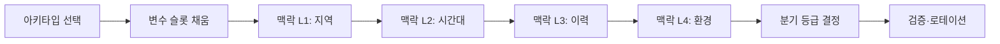

# 게임 내러티브 디자인 가이드 (Game Narrative Design Guide)

> **목적:** `Reference/` 폴더 전수조사 결과를 한 권의 실무 가이드로 통합한 문서.
> **범위:** 인터랙티브 스토리텔링의 본질부터 사이드 퀘스트 양산 공식, 캐릭터 대사 톤 설계, 환경 서사, 호러·코스믹 호러 응용까지 다룬다.
> **사용 대상:** 시나리오 라이터, 퀘스트 디자이너, 시스템 디자이너, 디렉터.
> **작성일:** 2026-05-28

---

## 0. 사용 안내

이 가이드는 다음 원칙으로 구성되었다.

- **이론 → 패턴 → 변수 → 검증** 순서. 한 절을 읽으면 한 가지를 곧바로 실행할 수 있어야 한다.
- 모든 원칙에는 **원천 레퍼런스**를 상대 경로로 표기한다(예: `Reference/Books/Save the Cat Writes for TV.md`).
- 우선순위가 높은 항목은 **굵게** 표시한다.
- 인용된 사례는 위처 3, 폴아웃, 다크 소울, 디스코 엘리시엄, 하데스, 바이올렛 에버가든, 갓 오브 워 등 검증된 작품에 한정한다.

---

## 목차

1. [내러티브의 본질 — 게임은 무엇으로 이야기하는가](#1-내러티브의-본질--게임은-무엇으로-이야기하는가)
2. [게임 글쓰기의 3기둥 — 플롯·캐릭터·로어](#2-게임-글쓰기의-3기둥--플롯캐릭터로어)
3. [스토리 구조와 페이싱 — Save the Cat 15비트와 그 변형](#3-스토리-구조와-페이싱--save-the-cat-15비트와-그-변형)
4. [에피소딕 시리즈 구조 — 시즌·필러·반복 가능한 비트](#4-에피소딕-시리즈-구조--시즌필러반복-가능한-비트)
5. [캐릭터 디자인 — 영웅·빌런·팩션·동반자](#5-캐릭터-디자인--영웅빌런팩션동반자)
6. [감정 각성 캐릭터의 설계 — 바이올렛 모델](#6-감정-각성-캐릭터의-설계--바이올렛-모델)
7. [대사 디자인 — 톤·서브텍스트·선택지](#7-대사-디자인--톤서브텍스트선택지)
8. [월드빌딩 — 6축 설계와 가상 세계의 작동 원리](#8-월드빌딩--6축-설계와-가상-세계의-작동-원리)
9. [환경 스토리텔링 — 4가지 내러티브 공간](#9-환경-스토리텔링--4가지-내러티브-공간)
10. [퀘스트 디자인 — 5가지 서사 아키타입](#10-퀘스트-디자인--5가지-서사-아키타입)
11. [모듈형 퀘스트 양산 — 변수 치환과 맥락 레이어](#11-모듈형-퀘스트-양산--변수-치환과-맥락-레이어)
12. [분기와 결과 — 선택의 무게를 만드는 법](#12-분기와-결과--선택의-무게를-만드는-법)
13. [메커닉으로서의 내러티브 — Mechanics as Metaphor](#13-메커닉으로서의-내러티브--mechanics-as-metaphor)
14. [호러·코스믹 호러 내러티브](#14-호러코스믹-호러-내러티브)
15. [GoT식 앙상블·정치 서사](#15-got식-앙상블정치-서사)
16. [내러티브 검증 — 충돌·반복·맥락 일관성](#16-내러티브-검증--충돌반복맥락-일관성)
17. [부록 A — 변수 풀(위치·NPC·목표)](#부록-a--변수-풀위치npc목표)
18. [부록 B — 핵심 비트 시트 템플릿](#부록-b--핵심-비트-시트-템플릿)
19. [부록 C — 레퍼런스 빠른 검색표](#부록-c--레퍼런스-빠른-검색표)

---

# 1. 내러티브의 본질 — 게임은 무엇으로 이야기하는가

게임 내러티브는 영화·소설의 내러티브와 본질적으로 다르다. 영화 관객은 **목격자**지만, 게임 플레이어는 **행위자**다. Katherine Isbister가 정리한 핵심 차이는 이렇다 — *"any medium other than games, we are only witnesses, not actors, and cannot affect the outcomes of the stories before us."* (출처: `Reference/Books/How Games Move Us.md`)

이 차이가 만드는 세 가지 설계 강제 조건은 다음과 같다.

| 강제 조건 | 영화/소설 | 게임 |
|:---|:---|:---|
| 시간의 주인 | 작가 | 플레이어 |
| 행위의 주체 | 캐릭터 | 플레이어 + 캐릭터 |
| 정보 전달 속도 | 작가 통제 | 플레이어 관심 통제 |
| 결말의 단일성 | 단일 | 잠재적 다중 |
| 감정의 원천 | 동일시 | **공모(complicity)** |

**공모의 원리(Complicity)** — 보드 게임 *Train* 은 플레이어가 기차를 운행해 승객을 운반하는 게임이다. 종점이 아우슈비츠라는 사실은 게임이 끝나갈 무렵에야 드러난다. 플레이어는 자신이 알지 못한 채 행동했음에도, "내가 했다"는 감정에서 빠져나오지 못한다. 이것이 게임만이 만들 수 있는 감정의 핵심이다. 게임 내러티브 디자이너는 이 공모를 설계 도구로 사용해야 한다. (출처: `Reference/Books/How Games Move Us.md`)

### 1.1 내러티브와 메커닉의 관계 — 4가지 모델

1. **메커닉 다음에 내러티브 (Mechanics-First)** — 메커닉을 먼저 정한 뒤 그것에 맞는 이야기를 입힌다. 미사일 커맨드, 테트리스 계열. Extra Credits는 *"How To Start Your Game Narrative — Design Mechanics First"* 에서 이 접근을 권장한다. (출처: `Reference/extracredit_인사이트.md`)
2. **내러티브가 메커닉을 정의 (Narrative-First)** — 이야기 톤이 먼저 결정되고 그 톤을 표현하기 위한 메커닉이 따라온다. 디스코 엘리시엄, 위처 3. Tim Cain은 *Setting → Story → Mechanics* 순서를 권장한다. (출처: `Reference/timcain_인사이트.md`)
3. **메커닉 = 은유 (Mechanics as Metaphor)** — 메커닉 자체가 이야기를 말한다. Papers, Please의 도장 찍기, Spec Ops: The Line의 백린탄, Brothers의 두 컨트롤러 스틱. (출처: `Reference/extracredit_인사이트.md` — "Mechanics as Metaphor I & II")
4. **게임플레이 내러티브 (Gameplay Narrative)** — 플레이가 곧 이야기다. 하데스에서 죽음은 "집으로 돌아옴 = 새 대화" 이다. Disco Elysium에서 스탯 자체가 내면의 목소리로 말한다. (출처: `Reference/noclip_인사이트.md`, "Hades", "Disco Elysium")

**원칙:** 어느 모델을 택하든, 메커닉과 내러티브가 **서로를 보강**해야 한다. 모순되면 *Ludonarrative Dissonance* — 캐릭터는 평화주의자인데 플레이어는 학살한다는 식의 깨짐 — 가 발생한다.

### 1.2 "Bad Writing"의 5가지 증후

Extra Credits 의 *Bad Writing — Why Most Games Tell Bad Stories* 에서 정리된 게임 글쓰기의 흔한 실패. (출처: `Reference/extracredit_인사이트.md`)

1. **컷신에 모든 서사를 몰아넣기** — 게임플레이가 시작되면 이야기가 멈춘다.
2. **정보 덤프(exposition dump)** — NPC가 5분 동안 세계관을 설명한다.
3. **선택의 결과 부재** — "어떤 선택지를 골라도 결과는 같다." 플레이어가 깨닫는 순간 신뢰가 깨진다.
4. **주인공의 침묵(Heroic Mime)** — 플레이어 분신이라는 핑계로 주인공이 어떤 감정도 표현하지 않으면, NPC들의 반응이 공허하게 보인다.
5. **세계가 플레이어를 기다린다** — NPC들이 플레이어가 다가올 때까지 동상처럼 서 있는다. *"디자이너의 손이 보인다."* (출처: `Reference/timcain_인사이트.md`)

이 다섯 가지를 회피하는 것이 게임 라이팅의 출발점이다.

---

# 2. 게임 글쓰기의 3기둥 — 플롯·캐릭터·로어

Extra Credits 의 *The Three Pillars of Game Writing* 은 게임 글쓰기를 세 축으로 분해한다. 어떤 게임이든 이 셋 중 무엇을 강조하느냐로 정체성이 결정된다. (출처: `Reference/extracredit_인사이트.md`)

| 기둥 | 정의 | 강조한 작품 | 적합한 장르 |
|:---|:---|:---|:---|
| **플롯(Plot)** | "다음에 무슨 일이 일어나는가" — 사건의 인과 사슬 | Heavy Rain, Telltale 시리즈 | 어드벤처, 시네마틱 |
| **캐릭터(Character)** | "누구의 이야기인가" — 인물의 변화 호 | 라스트 오브 어스, 갓 오브 워(2018) | 드라마, RPG 동반자 게임 |
| **로어(Lore)** | "이 세계는 어떻게 작동하는가" — 세계 그 자체의 매혹 | 다크 소울, 엘든 링, 헤일로 | 소울라이크, 메트로이드바니아, MMORPG |

**선택의 원칙** — 세 가지를 모두 같은 강도로 추구하면 어느 것도 도드라지지 않는다. **하나를 주축, 둘을 보조**로 둔다.

- 플롯 주축 → 캐릭터는 명확한 호, 로어는 충분한 배경.
- 캐릭터 주축 → 플롯은 캐릭터 변화의 그릇, 로어는 캐릭터 결정을 정당화하는 맥락.
- 로어 주축 → 플롯은 발견의 순서(소울라이크의 "역추리"), 캐릭터는 로어의 표본/조각.

### 2.1 "Show, Don't Tell"의 게임적 변형

원칙은 단순하다 — *플레이어가 보고 행동해서 알게 하라.* 하지만 게임에서는 "보여주기" 자체가 여러 층위로 나뉜다.

| 전달 매체 | 정보 농도 | 플레이어 부담 | 권장 용도 |
|:---|:---:|:---:|:---|
| 컷신 | 매우 높음 | 매우 낮음 | 메인 비트 전환 (Save the Cat의 Catalyst, Midpoint, All Is Lost) |
| 인게임 대화 | 높음 | 낮음 | 캐릭터 관계, 동반자 백스토리 |
| 환경 디테일 (시체, 낙서, 잔해) | 중간 | 중간 | 사건의 흔적, 세계관 분위기 |
| 아이템 설명 텍스트 | 중간 | 높음 | 로어 — 다크 소울식 "조사하는 사람만 발견" |
| 메커닉(시스템 자체) | 낮음 | 매우 낮음 | 세계의 작동 원리 — Papers Please의 도장, Hades의 죽음 |

**Marc Laidlaw 원칙(Half-Life)** — *"문을 통과하라"고 말하지 않고, 다른 길은 모두 막혀 있게 설계하라.* 플레이어가 스스로 발견한 길은 강요된 길보다 100배 강하게 기억된다.

---

# 3. 스토리 구조와 페이싱 — Save the Cat 15비트와 그 변형

Blake Snyder의 **Save the Cat! 15-Beat Sheet**는 영화·TV·게임·소설을 가리지 않고 작동하는 가장 잘 검증된 구조다. (출처: `Reference/Books/Save the Cat Writes for TV.md`)

### 3.1 15비트 시트 (전체 길이를 100%로 표기)

**Act 1 — The Ordinary World (Thesis)**

| 비트 | 위치 | 정의 |
|:---|:---:|:---|
| 1. Opening Image | 0–1% | 변하기 전의 영웅·세계의 "Before 사진". 톤·테마를 한 컷에 박는다. |
| 2. Theme Stated | ~5% | 다른 캐릭터가 영웅의 결함을 짚는 한 줄. "Hope is a dangerous thing." |
| 3. Set-Up | 1–10% | 영웅의 일상(집·일·놀이). 고쳐야 할 것들(Things That Need Fixing) 노출. **정체 = 죽음(Stasis = Death)**. |
| 4. Catalyst | ~10% | 인생을 흔드는 단일 사건. *Gravity*의 우주쓰레기, 해리에게 "넌 마법사다." |
| 5. Debate | 10–20% | 받아들일 것인가, 도망갈 것인가. 사용자(플레이어)의 "Do I really have to go on this dangerous quest?" |

**Act 2 — The Upside-Down World (Antithesis)**

| 비트 | 위치 | 정의 |
|:---|:---:|:---|
| 6. Break into 2 | ~20% | 영웅이 선택하여 새 세계로 진입. 돌이킬 수 없는 결정. |
| 7. B Story | ~22% | 테마를 운반하는 두 번째 서사 — 보통 관계(연인·멘토·친구). |
| 8. Fun & Games | 20–50% | "Promise of the Premise" — 트레일러에 나오는 핵심 즐거움. **가장 긴 비트.** |
| 9. Midpoint | ~50% | 가짜 승리 또는 가짜 패배. 스테이크 상승, A·B 스토리 교차, **시한장치 발동**. |
| 10. Bad Guys Close In | 50–75% | 외부·내부 적이 동시에 압박. |
| 11. All Is Lost | ~75% | 영웅의 최악의 두려움이 실현. *Whiff of Death*가 동반된다. |
| 12. Dark Night of the Soul | 75–80% | 폐허에서의 자성. Theme Stated를 다시 불러옴. 깨달음의 직전. |

**Act 3 — Merged World (Synthesis)**

| 비트 | 위치 | 정의 |
|:---|:---:|:---|
| 13. Break into 3 | ~80% | 새로운 정보·통찰. A·B 스토리 합류. |
| 14. Finale | 80–99% | **Five-Point Finale**: ① 팀 결성 ② 계획 실행 ③ High Tower Surprise(반전) ④ Dig Down Deep(깨달음 활용) ⑤ New Plan 실행. |
| 15. Final Image | 99–100% | Opening Image의 거울상. 얼마나 변했는지를 한 컷에 박는다. |

### 3.2 게임 적용 — 메인 캠페인 비트 매핑

게임 메인 캠페인은 보통 25–80시간이다. 15비트를 다음과 같이 매핑한다.

| 시간대 (40시간 기준) | 비트 | 권장 게임 이벤트 |
|:---|:---|:---|
| 0–30분 | Opening Image, Theme Stated, Set-Up | 인트로 시네마틱, 튜토리얼 마을, 영웅의 약점이 노출되는 첫 전투 |
| 30분–1시간 | Catalyst | 마을 습격, 멘토 살해, 운명적 만남 |
| 1–4시간 | Debate, Break into 2 | 부수 캐릭터들의 권유, 첫 던전 진입 결심 |
| 4–8시간 | B Story | 동반자 합류, 첫 로맨스 이벤트 |
| 8–20시간 | Fun & Games | 메인 메커닉 만개. 사이드 퀘스트 자유 진행. 새 능력 해금. |
| ~20시간 | Midpoint | 거대 보스 1차 격파 또는 절친 배신 발각, **글로벌 시한 도입** |
| 20–30시간 | Bad Guys Close In | 적 세력 진군, 이전 사이드 결정의 부정적 결과 도래 |
| ~30시간 | All Is Lost | 본거지 함락, 핵심 동료 사망 |
| 30–32시간 | Dark Night | 폐허에서의 자유 탐색 구간, 옛 NPC와의 회상 대화 |
| 32–34시간 | Break into 3 | 새로운 능력·아이템·전우 발견 |
| 34–40시간 | Finale | 5단계 종반전 |

### 3.3 페이싱 — 아크·씬·액션의 3중 곡선

Extra Credits 의 *Pacing — How Games Keep Things Exciting* 는 페이싱이 **세 스케일에서 동시에** 작동해야 한다고 정리한다. (출처: `Reference/extracredit_인사이트.md`)

| 스케일 | 길이 | 페이싱 곡선 |
|:---|:---|:---|
| **Arc** | 전체 캠페인 | 15비트 시트 그 자체 |
| **Scene** | 단일 던전·미션 | Set-Up → 갈등 고조 → 클라이맥스 → 해소(보상) |
| **Action** | 한 번의 입력 | 의도 → 입력 → 반응 → 피드백 (1초 이하) |

세 곡선이 어긋나면 — 메인 스토리는 위기인데 사이드 퀘스트는 코미디라면 — 톤 부조화가 발생한다. **메인 스토리의 단계가 사이드 퀘스트의 톤을 변경**해야 한다(맥락 레이어 2, [§11](#11-모듈형-퀘스트-양산--변수-치환과-맥락-레이어) 참조).

### 3.4 사쿠라이의 "클라이맥스부터 시작하라"

마사히로 사쿠라이는 *Start with the Climax* 에서, Opening Image를 단순한 "Before 사진"이 아니라 **게임의 최고 스펙터클**로 만들 것을 권장한다. (출처: `Reference/sakurai_인사이트.md`)

- *파이널 판타지 7* — 오프닝이 라스트 던전 직전 수준의 영상.
- *신 광신화 파르테나의 거울* — 1장 시작 1분 안에 최종 보스 메두사 등장.
- *DOOM 2016* — 첫 5분 안에 임프를 영광 처형으로 죽이는 모든 게임의 핵심을 보여줌.

이는 Save the Cat의 Opening Image를 *최대 출력으로* 사용하는 방법이다. "느린 시작"은 거의 항상 설계 실패다.

---

# 4. 에피소딕 시리즈 구조 — 시즌·필러·반복 가능한 비트

라이브 서비스 게임, 시즌제 콘텐츠, 에피소드형 어드벤처(Telltale, Life Is Strange)는 단일 비트 시트로 다 담을 수 없다. *Save the Cat! Writes for TV* 의 구조를 게임에 가져와야 한다. (출처: `Reference/Books/Save the Cat Writes for TV.md`)

### 4.1 시리즈 DNA — 캐릭터의 "Broken Compass"

TV 시리즈는 영화처럼 "변하고 끝난다"가 아니라 **변하지 않으면서도 갱신된다**. Jamie Nash가 사용하는 도구가 **Broken Compass** — 캐릭터가 "항상 X 한다 / 절대 Y 하지 않는다"는 미션 스테이트먼트다.

- *Breaking Bad* 의 월터 — "항상 가족을 위한다고 자기최면. 절대 자신의 자존심을 인정하지 않는다."
- *Fleabag* — "항상 농담으로 도망친다. 절대 진심을 말하지 않는다."

게임 동반자 NPC를 설계할 때 이 한 줄을 먼저 쓴다. 모든 대사·반응·선택 분기가 그 줄에서 파생된다.

### 4.2 시즌·에피소드의 비트

- **Pilot (1화)** = 영화 한 편의 15비트 시트. 단, Opening Image가 시리즈 전체의 톤을 봉인하는 역할.
- **에피소드 (회당)** = 미니 15비트. *Catalyst*는 매 화 발생하지만, *All Is Lost*는 시즌 단위로 작동.
- **시즌** = 더 큰 15비트. 시즌 마무리에서 *Final Image*는 다음 시즌의 *Opening Image*로 연결된다.

### 4.3 라이브 서비스 게임 적용

| 시간 단위 | 비트 시트 적용 |
|:---|:---|
| 한 시즌(3개월) | 15비트 1주기 |
| 한 패치(2주) | A 스토리 한 챕터(Catalyst → Midpoint → Resolution) |
| 일일 콘텐츠 | Fun & Games의 미니 사이클 (액션 페이싱) |

Final Fantasy XIV가 *1.0 실패 → A Realm Reborn* 를 *Meteor Project* 라는 인게임 이벤트로 봉합한 사례는 *현실의 실패를 서사로 통합*하는 모범 사례다. (출처: `Reference/noclip_인사이트.md`)

---

# 5. 캐릭터 디자인 — 영웅·빌런·팩션·동반자

### 5.1 영웅(주인공)의 4가지 유형

게임 주인공은 영화·소설과 달리 **플레이어가 살아 있는** 존재다. 자유도와 캐릭터성의 비율로 4분면이 나뉜다.

| 유형 | 캐릭터성 | 자유도 | 예시 |
|:---|:---:|:---:|:---|
| Defined Hero | 높음 | 낮음 | 게럴트, 크레토스, 아서 모건 |
| Avatar | 낮음 | 높음 | 스카이림 도브하킨, 폴아웃 보트 거주자 |
| Sculpted Avatar | 중간 | 중간 | 사이버펑크 V, 매스이펙트 셰퍼드 |
| Silent Witness | 낮음 | 낮음 | 다크 소울 잿빛의 모름 |

Tim Cain은 *"나는 스토리를 만들고, 플레이어는 캐릭터를 만든다(I make the story, the player makes the character)"* 를 공언한다. 이는 Sculpted Avatar 접근이다. (출처: `Reference/timcain_인사이트.md`)

**원칙:** 어느 유형이든 **결함(Flaw)** 이 명시되어야 한다. 결함이 없는 영웅은 변할 것이 없고, 변하지 않는 영웅은 이야기를 갖지 못한다.

### 5.2 빌런 디자인 — Tim Cain의 4조건

(출처: `Reference/timcain_인사이트.md`)

1. **믿을 수 있는 목표** — "세상을 지배하겠다"가 아닌, 자신만의 논리.
2. **미리 알려짐(Telegraphed)** — 빌런을 직접 만나기 *전부터* 그의 영향력이 세계에 깔려 있어야 한다.
3. **입체적 동기** — 단일 사건/구체적 인물에서 파생된 동기.
4. **이해 가능** — 플레이어가 공감하거나 최소한 이해할 수 있어야 대화 해결이 가능.

**모범 — Fallout의 Master**
- 슈퍼 뮤턴트 군대로 인류를 "진화"시키려는 목표.
- 플레이어가 슈퍼 뮤턴트의 불임을 증명하면 **자살**한다.
- 전투 빌드뿐 아니라 대화 빌드에도 결말이 열려 있다.

**반례 — Temple of Elemental Evil의 빌런** — 게임 내내 거의 등장하지 않다가 마지막에 나타난다. *Telegraphed* 원칙의 실패.

### 5.3 팩션 디자인 — 4조건

(출처: `Reference/timcain_인사이트.md`, `Reference/Reverse_GDD_SideQuest_Narrative_Framework.md`)

1. **단일체가 아님** — 팩션 내부에 의견 차이가 있다. 강경파·온건파·이탈자.
2. **현실적 목표** — 세계 정복이 아닌 영토·자원·이념의 구체적 지향.
3. **모든 플레이 스타일 수용** — 팩션 안에 전사·외교관·도둑·학자가 공존.
4. **플레이어의 행위에 반응** — 도우면 영향력 확장, 적대하면 보복.

**선/악 도덕성 미터의 함정** — Arcanum에서 시험된 단순 선/악 미터는 실패 사례로 자주 인용된다. 대신 **팩션별 평판 미터** 가 권장된다. 각 팩션이 독립적으로 변하는 것이 정치적 현실에 가깝다.

### 5.4 동반자(Companion) 시스템 — 풀과 회전

(출처: `Reference/timcain_인사이트.md`)

- **풀 크기:** 3–6명.
- **동시 동행:** 2–4명.
- **동반자 퀘스트:** 메인 스토리가 아닌 **세계 탐험**의 내용이어야 한다.
- **선택성:** 동반자 없이도 클리어 가능. 강제 동행은 *Escort Mission* 의 좌절 패턴을 만든다.
- **개성:** 각 동반자는 고유한 (a) 성격, (b) 세계관, (c) 선호 전술, (d) 거부하는 임무 — 위처 3의 *Friends with Benefits*는 게럴트가 어떤 동료를 부르느냐로 결말이 분기된다.

**대조 캐릭터(Foil) 기법 — Witcher 3 Bloody Baron 모범**
남작은 게럴트의 거울이다. *둘 다 잃어버린 가족을 찾고 있지만, 한쪽은 자기 손으로 망쳤고, 다른 한쪽은 운명에 의해 잃었다.* 이런 비교를 통해 영웅의 정체성이 선명해진다. (출처: `Reference/Reverse_GDD_SideQuest_Narrative_Framework.md`)

### 5.5 캐릭터 시트(Rooting Resume)

*Save the Cat! Writes for TV* 의 **Rooting Resume** 는 "왜 시청자가 이 인물을 응원해야 하는지"의 사유 체크리스트다. *Fleabag* 의 파일럿이 모범 예시. (출처: `Reference/Books/Save the Cat Writes for TV.md`)

응원의 사유는 다음 카테고리에서 최소 3개 이상 충족해야 한다.

- **신뢰 고백(Confides in us)** — 4번째 벽을 부수거나 내면 독백.
- **유머·자기비하** — 자신의 결함을 농담으로 다룬다.
- **취약성 노출** — 약점이 명시적으로 보여진다.
- **친절** — 보상이 없는데도 누군가를 돕는다.
- **고난** — 객관적 어려움(돈·관계·평판)이 있다.
- **공개적 굴욕** — 우리 앞에서 망신을 당한다.
- **자기보다 강한 사람에게 도전** — 비대칭 갈등.
- **누군가를 깊이 사랑** — 사랑할 능력이 있다.

게임 동반자나 주요 NPC 첫 만남에서 위 항목 중 3개 이상이 단일 씬에 노출되도록 설계한다.

---

# 6. 감정 각성 캐릭터의 설계 — 바이올렛 모델

"감정을 모르는 캐릭터가 감정을 알아가는 과정"은 게임 동반자, 검의 정령, AI 컴패니언, 로봇 주인공 같은 설정에 자주 쓰인다. *Violet Evergarden* 자막 분석은 이 호의 매우 정교한 설계서를 제공한다. (출처: `Reference/Violet_Evergarden_Analysis_for_Rustborn.md`)

### 6.1 감정 부재 상태의 5가지 언어 패턴

| 패턴 | 특징 | 예시 |
|:---|:---|:---|
| A. 임무·보고 어조 | 모든 발화가 보고서 같다 | "임무 수행 능력은 발군이거든" |
| B. 명령 프레임 | 행동의 근거가 명령뿐 | "다음 명령을 받을 수 있는 건 언제일까요" |
| C. 자기 도구화 | "나는 도구/무기" | "저는 소령의 도구입니다" |
| D. 감정 개념 질문 | "~이 뭔가요?" — 사전 표제어로 묻는다 | "사랑한다는 게 뭔가요?" |
| E. 신체 감각의 비감정적 보고 | 감정을 신체 이상으로 분류 | "이상합니다!" "가슴이 무거워졌습니다." |

### 6.2 감정 각성 곡선 (7단계)

| 단계 | 언어 특징 | 대표 대사 톤 |
|:---|:---|:---|
| 1. 도구 상태 | 임무 어휘, 경어, 감정어 0 | "명령을 내려주세요" |
| 2. 질문 시작 | 감정 개념을 사전 표제어처럼 질문 | "~이 뭔가요?" |
| 3. 타인 관찰 | 타인의 감정을 관찰하지만 공감 없이 보고 | "울고 계십니다" |
| 4. 감각 인식 | 자기 안의 감정을 신체 이상으로 분류 | "이상합니다!" |
| 5. 감정 폭발 | 감정 과부하·통제 불능 | "불타고 있습니다…!" |
| 6. 부분적 이해 | "**조금은** 이해하게 되었습니다" | "조금은 알 것 같아." |
| 7. 감정 수용 | 임무 언어 → 의지 언어 | "I came of my own free will." |

### 6.3 5대 설계 원칙

1. **감정어 대신 물리 용어** — "슬프다" 가 아니라 "날이 무거워."
2. **질문은 정보 요청 형식** — "사랑이 뭐죠"가 아니라 "지금 네가 한 건 나를 위한 거야?"
3. **임무 언어의 잔존과 전환** — 감정을 배워도, 위기 시 도구 정체성이 *방어 기제*로 폭발한다. *극장판: "You deserve to use me! I am the Major's weapon!"*
4. **부분적 이해의 수용** — 완전한 이해를 선언하는 순간 서사가 파탄난다. "**조금**" 이 성숙의 증거.
5. **침묵이 대사다** — 가장 감정적인 순간에 문장이 짧아지거나 멈춘다. *바이올렛이 "소령님…"만 30회 이상 반복하는 장면.*

### 6.4 판단 주체의 전환

> 1화: "필요없어졌다면 처분되어야 합니다… 버려주십시오."
> 9화: "살아 있어도… 괜찮은 것일까요?"

*타인에게 판단을 위탁* → *스스로에게 묻는다.* 판단의 주체가 외부에서 내부로 이동하는 한 줄이 **자아 출현의 증거**다. 게임에서 동반자 캐릭터가 "내가 결정하겠습니다"라고 말하는 순간이 이 전환점이다.

### 6.5 부정→긍정의 역전 구조

```
초반: "...아무것도 느끼지 못해."
중반: "...느끼지 못한다고 했었어. 틀렸던 것 같아."
후반: "느끼고 있어."
```

**최소 대사로 최대 충격.** *바이올렛은 1화에서 "불타고 있지 않습니다"라고 부정한 것을 7화에서 "불타고 있습니다…!" 로 역전한다.*

---

# 7. 대사 디자인 — 톤·서브텍스트·선택지

### 7.1 톤 결정 — 4가지 변수

| 변수 | 스펙트럼 |
|:---|:---|
| 직접성 | "당신이 죽였다" ↔ "그날 새벽, 누군가 정원을 걸었다" |
| 격식 | 경어 ↔ 반말 ↔ 비속어 |
| 감정 노출 | "괜찮습니다" ↔ "내가 무너지고 있어" |
| 정보 농도 | "용은 동쪽에 있다" ↔ "동쪽 하늘이 붉어." |

각 NPC는 위 4축에서 *자신의 좌표* 를 갖는다. 좌표가 흔들리는 순간이 캐릭터 발전의 표시다.

### 7.2 서브텍스트 — 말하지 않은 것의 무게

영화·소설·게임이 공유하는 원칙 — **사람은 말하고 싶은 것의 80%를 말하지 않는다.** 좋은 대사는 *말한 것 + 말하지 않은 것*의 충돌에서 나온다.

- 캐릭터가 "괜찮아"라고 말하는 동안 시선이 칼날을 향한다 → 환경 디테일이 대사를 뒤집는다.
- *In Defense of Imagination* (Extra Credits) — 모든 것을 말하지 않을 때 플레이어의 상상력이 메운다. (출처: `Reference/extracredit_인사이트.md`)

### 7.3 선택지 — Jonas Tyroller의 "재미있는 결정 5조건"

(출처: `Reference/jonastyroller_인사이트.md`)

1. **Options** — 최소 2개의 실질적 선택지.
2. **Impact** — 선택이 실제 차이를 만든다.
3. **Understanding** — 플레이어가 선택지의 의미를 이해할 수 있다.
4. **Meaning** — 선택이 플레이어에게 의미 있다(주제적·정서적·실리적).
5. **Challenge** — 최선이 명백하지 않다.

5가지 중 어느 하나라도 빠지면 그 선택지는 *Illusion of Choice* 가 된다.

### 7.4 도덕 미터 vs 감정·상황 미터

선/악 미터의 한계 — 어떤 행동이 "선"인지 사전 분류해야 한다. 이는 게임이 윤리를 *판단*한다는 잘못된 신호를 준다. 권장 대안:

- **평판 미터(팩션별)** — 위처 3, 폴아웃 뉴베가스.
- **관계 미터(인물별)** — 매스이펙트, 페르소나.
- **감정 미터(주인공 내부 상태)** — 디스코 엘리시엄(스킬 라인 자체가 내면).
- **압박 미터(위기 게이지)** — 다잉 라이트의 야간 위협도.

### 7.5 대화 분기 구조 (4가지)

(David Millard의 위처 3 분석 — 출처: `Reference/Reverse_GDD_SideQuest_Narrative_Framework.md`)

1. **Alternatives** — 과거 행동에 따른 같은 장면의 대화 변형.
2. **Unlocking** — 새로운 정보로 잠금 해제되는 대화 옵션 (괴수 도감, 용어집).
3. **Unlocking Alternatives** — 서사 진행에 따라 같은 NPC의 대답이 갱신.
4. **Multiple Unlocking + Parallel Threads** — 여러 하위 퀘스트를 자유 순서로 풀고, 모두 완료 시 상위 진행.

위처 3는 메인 캠페인에서만 약 **36개의 결말 상태 조합과 3개 대체 엔딩**을 가진다. 이 규모는 변수 치환 + 결말 슬라이드 시스템이 없으면 불가능하다.

---

# 8. 월드빌딩 — 6축 설계와 가상 세계의 작동 원리

Richard Bartle의 *Designing Virtual Worlds* 는 가상 세계를 6개의 축으로 분해한다. 단일 RPG이든 MMORPG이든 6축 중 어느 하나도 정의되지 않으면 세계는 표면적이다. (출처: `Reference/Books/Designing Virtual Worlds.md`, `Reference/Books/Core Design Books Summary.md`)

| 축 | 정의 | 핵심 질문 |
|:---|:---|:---|
| Physics | 물리 법칙 | 중력·시간·생사·마법은 어떻게 작동하는가? |
| Interaction | 상호작용 | 캐릭터는 사물·NPC·플레이어와 어떻게 관계하는가? |
| Economy | 경제 | 자원의 생성·소비·교환이 어떻게 일어나는가? |
| Politics | 정치 | 권력은 누가 어떻게 차지하는가? |
| Society | 사회 | 집단의 구조·계급·결속은? |
| Culture | 문화 | 의례·종교·언어·예술은? |

각 축마다 **3가지 이상의 구체적 사실**을 적어내면 세계관 시트가 완성된다.

### 8.1 Bartle Taxonomy — 4가지 플레이어 동기

플레이어는 동일한 세계에서도 다른 것을 본다. 4유형이 모두 즐길 수 있는 세계여야 라이브 게임이 작동한다. (출처: `Reference/Books/Core Design Books Summary.md`)

| 유형 | 동기 | 행동 | 내러티브 보상 |
|:---|:---|:---|:---|
| **Achiever** | 목표 달성·수치 성장 | 레벨업·컬렉션·도전 | 명예·칭호·기록 |
| **Explorer** | 세계 발견·시스템 이해 | 맵 탐험·히든 퀘스트·실험 | 로어·비밀 방·숨은 NPC |
| **Socializer** | 사람과의 상호작용 | 채팅·길드·교류 | 동반자 관계·결혼·길드 서사 |
| **Killer** | 경쟁·지배 | PvP·랭킹·영역 다툼 | 적대 NPC 처단·악명·라이벌 서사 |

**죽음의 나선 회피** — Killer가 너무 많아지면 Socializer가 떠나고, 이어 Achiever가 떠나고, 남은 Killer는 표적이 사라져 떠난다. 세계 거버넌스 — *법·제재·세이프존* — 가 균형 유지의 도구다.

### 8.2 4축 설계 체크리스트

| 항목 | 점검 |
|:---|:---|
| 이 세계의 "어제"가 무엇이었나 (역사) | □ |
| 이 세계의 "내일"이 무엇인가 (위기·예언) | □ |
| 가장 큰 갈등 3가지가 무엇인가 | □ |
| 화폐는 무엇이고 어디서 나오나 | □ |
| 가장 흔한 죽음의 원인은 무엇인가 | □ |
| 신·종교·금기는 무엇인가 | □ |
| 식사·잠·노동의 일상은 어떻게 작동하나 | □ |
| 글을 읽을 수 있는 인구 비율은? | □ |

이 8가지 질문에 즉답이 안 되면 NPC 대사가 점차 같은 톤으로 수렴한다.

---

# 9. 환경 스토리텔링 — 4가지 내러티브 공간

Christopher Totten의 *An Architectural Approach to Level Design* 는 게임 공간을 4가지 내러티브 유형으로 분류한다. (출처: `Reference/Books/An Architectural Approach to Level Design.md`)

### 9.1 4가지 내러티브 공간

| 유형 | 기능 | 사례 |
|:---|:---|:---|
| **Evocative Space** | 외부 서사(영화·소설·역사)의 분위기를 환기 | Bioshock의 Rapture(아인 랜드 분위기), Dark Souls의 Anor Londo(고딕 대성당) |
| **Staging Space** | 다음에 일어날 이벤트를 무대화 | Half-Life 2 City 17의 광장(저항 봉기 전), Last of Us 박물관(추격전 전) |
| **Embedded Space** | 과거 사건을 공간에 새겨 놓는다 | Fallout의 욕조 백골 + 토스터 + 와인병 = "동반 자살", Dark Souls 아이템 설명 |
| **Resource-Providing Space** | 보상·정보·자원을 제공해 서사적 인센티브를 부여 | 위처 3의 환경 단서, 메트로이드의 능력 캡슐 |

설계할 때 각 공간을 **하나의 유형으로 선언**한다. 두 유형이 섞이면 플레이어는 무엇을 봐야 하는지 혼동한다.

### 9.2 환경 스토리텔링 — 4가지 도구

(출처: `Reference/Reverse_GDD_SideQuest_Narrative_Framework.md` 의 Layer 4)

| 요소 | 용도 | 예시 |
|:---|:---|:---|
| 터미널·문서 | 배경 정보·단서 | 연구 일지·편지·경고문 |
| 시체 배치 | 사건 정황 전달 | 전투 흔적·의식 제물·자살 |
| 환경 변화 | 결과 시각화 | 불탄 건물·핏자국·바리케이드 |
| 소품 | 감정적 디테일 | 아이 장난감·결혼반지·가족사진 |

### 9.3 환경 스토리텔링의 5가지 함정

1. **과도한 텍스트** — 게임은 책이 아니다. 한 방에 5개 이상의 노트가 있으면 플레이어는 읽기를 포기한다.
2. **반복되는 시체** — 같은 자세의 시체가 두 번 나오면 그것은 더 이상 사건이 아니라 데코다.
3. **앞뒤 안 맞는 배치** — 비전투 NPC의 시체 옆에 무기가 있으면 환경의 신뢰가 깨진다.
4. **단서가 너무 명백하거나 너무 모호** — 위처 3의 위처 감각은 단서를 *발견 가능*하게 만들었다. 빛나는 단서는 좋지만, *왜 빛나는지*가 다이제틱해야 한다.
5. **세이브·체크포인트와 환경의 부조화** — 비극의 한가운데에 세이브 포인트의 따뜻한 모닥불이 있으면 *Ludonarrative Dissonance*.

### 9.4 환경 → 게임플레이로 이어지는 통합 설계

*Disco Elysium* 의 교회 구역은 **수직 슬라이스**의 모범 사례다 — 모든 메커닉(대화·주사위·환경 스토리텔링)을 그 한 구역에서 검증하고, 결과적으로 그 구역이 최종 콘텐츠의 일부가 된다. (출처: `Reference/noclip_인사이트.md`)

*Outer Wilds* 의 행성들은 **물리 자체가 이야기를 한다** — 태양이 폭발하고, 행성이 물에 잠긴다. 텍스트 로그가 아니라 *물리적 사건*이 비밀을 전달한다.

---

# 10. 퀘스트 디자인 — 5가지 서사 아키타입

위처 3과 폴아웃 4의 역분석에서 추출된 5가지 서사 아키타입은 게임 퀘스트 거의 모두를 포괄한다. (출처: `Reference/Reverse_GDD_SideQuest_Narrative_Framework.md`)

### 10.1 아키타입 1 — 도덕적 딜레마 (Moral Dilemma)

**원형:** 위처 3 *Bloody Baron*. 6단계 구조.

| 단계 | 설명 |
|:---:|:---|
| 1. 의뢰 | 한쪽 당사자가 문제 해결을 요청 |
| 2. 조사 | 표면적 사실 수집 |
| 3. 진실 발견 | 양측 모두에게 사정이 있음을 깨달음 |
| 4. 양측 입장 | 각 당사자의 관점을 직접 청취 |
| 5. 선택 | 플레이어가 한쪽을 선택하거나 제3의 길 |
| 6. 결과 | 즉각적 결과 + 장기 파급 |

**서사 공식:** *"X가 Y에게 Z를 했다. 하지만 Y도 W를 했다. 누구 편을 들 것인가?"*

**필수 — 양측의 정당성이 균등**해야 한다. 명백한 선악은 금지.

### 10.2 아키타입 2 — 기대 전복 (Subversion)

**원형:** 위처 3 *프라이팬 퀘스트*. 단순 물건 찾기 → 유령의 사연. 5단계 구조.

| 단계 | 설명 |
|:---:|:---|
| 1. 평범한 의뢰 | 누가 봐도 단순한 심부름 |
| 2. 진행 | 일상 퀘스트 수행 |
| 3. 반전 | 예상치 못한 진실 |
| 4. 진짜 이야기 | 표면 아래의 감정적·서사적 깊이 |
| 5. 감정적 결말 | 웃음·슬픔·경외 중 하나 |

**설계 핵심:** 표면 목표가 **충분히 지루**해야 반전의 임팩트가 살아난다. 플레이어가 "또 심부름이네"라고 느끼는 순간이 반전의 최적 타이밍.

### 10.3 아키타입 3 — 탐정 절차 (Investigation)

**원형:** 위처 3 *위처 계약*. 6단계 구조.

| 단계 | 설명 |
|:---:|:---|
| 1. 의뢰 접수 | 사건 개요·보상 |
| 2. 현장 조사 | 환경 탐색 |
| 3. 단서 수집 | **최소 3개** 단서 |
| 4. 추론 | 단서 조합으로 가설 |
| 5. 대면 | 진범·원인과 직접 대면 |
| 6. 해결 | 전투·협상·방면 |

**필수 — 단서 3개가 논리적 추론 체인**을 형성해야 한다. 한 단서가 빠져도 결론이 나오면, 다른 단서는 장식이다.

### 10.4 아키타입 4 — 구출/호위 (Rescue/Escort)

**원형:** 폴아웃 4 *Kidnapping/Rescue* + 핸드크래프트 혼합. 6단계 구조.

| 단계 | 설명 |
|:---:|:---|
| 1. 위기 통보 | 긴급 상황 전달 |
| 2. 이동 | 환경 스토리텔링 활용 |
| 3. 상황 파악 | 현장 도착 후 실제 상황 |
| 4. 전투·협상 | 위험 요소 해결 |
| 5. 구출 | 피구출자 확보 |
| 6. 귀환 | 안전 지역 복귀(추가 이벤트 가능) |

**폴아웃 4의 한계 극복:** 귀환 단계에 **추가 이벤트**(피구출자 비밀 노출, 추적자 출현)를 삽입해야 서사가 닫히지 않는다.

### 10.5 아키타입 5 — 세력 대결 (Faction Conflict)

**원형:** 폴아웃 4의 4팩션 시스템(Institute/Brotherhood/Railroad/Minutemen). 5단계 구조.

| 단계 | 설명 |
|:---:|:---|
| 1. 양 세력 소개 | 표면적 주장 |
| 2. 각 입장 파악 | 내부 사정·논리 직접 경험 |
| 3. 선택 요구 | 편들기 강제 이벤트 |
| 4. 세력 지원 | 활동 수행 |
| 5. 결과 | 지역·세계 상태 영구 변경 |

**필수 — 결과가 월드 상태에 영구 반영**되어야 한다. 사이드 NPC의 생사·점령지·교역로가 바뀐다.

### 10.6 분포 — 100개 퀘스트의 권장 비율

| 아키타입 | 권장 비율 | 100개 시 |
|:---|:---:|:---:|
| 도덕적 딜레마 | 25% | 25 |
| 기대 전복 | 20% | 20 |
| 탐정 절차 | 20% | 20 |
| 구출/호위 | 15% | 15 |
| 세력 대결 | 15% | 15 |
| 기타·단순 | 5% | 5 |

위처 3은 실제로 *도덕 26% / 탐정 22% / 전복 17%* 의 분포를 보였다. 패턴 중첩률(한 퀘스트가 2개 이상의 아키타입을 겹치는 비율)은 **~40%**.

### 10.7 Chris Avellone의 4대 원칙 (사이드 퀘스트)

(출처: `Reference/Reverse_GDD_SideQuest_Narrative_Framework.md`)

1. 사이드 퀘스트는 **메인 플롯·지역을 보강**해야 한다.
2. 사이드의 스테이크가 메인의 스테이크를 **넘어서면 안 된다**.
3. 완료 시간은 약 **15분**을 목표로.
4. **핵심 메카닉**을 활용해야 하며, 전용 기능 도입은 지양.

### 10.8 CDPR(위처 3)의 퀘스트 디자인 5원칙

(출처: `Reference/Reverse_GDD_SideQuest_Narrative_Framework.md`)

1. **모든 퀘스트는 이야기를 해야 한다.**
2. **"No Fetch Quest"** — 단순 심부름조차 이야기로 포장되어야 한다.
3. **대화는 게임플레이다** — 대사 선택이 결과를 만든다.
4. **관객을 신뢰한다** — 모든 것을 설명하지 않는다.
5. **환경 기반 단서** — 위처 감각으로 환경 인터랙션 극대화.

Bloody Baron 퀘스트의 초기 스크립트는 **40페이지**(대사 미포함)였다. 핵심 NPC 한 명에게 **5,000단어** 이상의 배경 서사를 부여하는 것이 CDPR의 표준.

---

# 11. 모듈형 퀘스트 양산 — 변수 치환과 맥락 레이어

100개 이상의 퀘스트를 핸드크래프트만으로 만드는 것은 비현실적이다. 위처 3의 105시간/퀘스트 × 100 = **10,500시간**. 폴아웃 4 Radiant 의 7시간 × 100 = 700시간(품질 D). 모듈형 프레임워크는 32시간/퀘스트 × 100 = **3,200시간** 으로 위처 3 품질의 84%를 노린다. (출처: `Reference/Reverse_GDD_SideQuest_Narrative_Framework.md`)

### 11.1 변수 치환 시스템 — 5레이어

| 레이어 | 변수 유형 | 예시 |
|:---|:---|:---|
| Layer 1: 위치 | 환경 유형 | 도시·숲·던전·황무지·해안·산악 (총 30개 변수) |
| Layer 2: NPC | 역할 | 의뢰인·피해자·적대자·조력자·증인 (총 25개 변수) |
| Layer 3: 목표 | 행동 동사 | Kill·Fetch·Investigate·Negotiate·Defend·Sabotage (총 30개 변수) |
| Layer 4: 보상 | 유형 | 아이템·정보·관계 변화·지역 상태 변화 |
| Layer 5: 맥락 | 테마 | 전쟁·역병·정치·복수·사랑·생존 |

이론적 조합: **2,340개**. 일관성·다양성·제작성 필터 후 실질 **955개** — 목표 100개의 9.5배 여유.

### 11.2 맥락 레이어 — 4단계 필터

폴아웃 4 Radiant 의 *"방금 클리어한 던전 재방문"* 같은 맥락 충돌을 막는 핵심.

| Layer | 필터 | 작동 방식 |
|:---|:---|:---|
| L1: 지역 테마 | 전쟁지대·교역도시·야생·폐허 | 해당 테마와 호환되는 갈등 유형만 허용 |
| L2: 시간대 맥락 | Act 1·2·3·Endgame | 메인 진행도에 따라 톤·세력·보상 변형 |
| L3: 플레이어 평판·선택 이력 | 정의·폭력·학식·세력 평판 | 평판 별로 의뢰·결말 변형 |
| L4: 환경 스토리텔링 | 터미널·시체·환경 변화·소품 | 변수 치환 결과를 다이제틱하게 봉합 |

### 11.3 100개 퀘스트 양산 — 7단계 워크플로우



### 11.4 반복감 방지 5대 규칙

1. **연속 동일 아키타입 금지** — 3회 연속 금지.
2. **지역당 아키타입 분산** — 각 지역에 최소 3개 아키타입.
3. **변수 슬롯 재사용 제한** — 핵심 변수 2개 동일 조합 최대 2회.
4. **전복 퀘스트 간격** — 기대 전복은 최소 2개 퀘스트 간격.
5. **서사 깊이 교차** — 무거운 퀘스트 뒤 가벼운 퀘스트.

### 11.5 충돌 검사 매트릭스

| 충돌 유형 | 예시 | 방지 규칙 |
|:---|:---|:---|
| 지리적 불일치 | 사막에 늪지 몬스터 | 위치-적 호환성 테이블 |
| NPC 역할 모순 | 의뢰인 = 진범 | 탐정 아키타입에서만 허용 + 플래그 |
| 시간적 불일치 | Act 1에 Act 3 세력 등장 | 시간대 레이어로 자동 차단 |
| 톤 불일치 | 코미디 반전 + 전쟁지대 | 분위기 태그 호환성 |
| 보상 불균형 | T1 퀘스트에 T4 보상 | 난이도-보상 매트릭스 강제 |

---

# 12. 분기와 결과 — 선택의 무게를 만드는 법

### 12.1 분기 3등급

| 등급 | 갈래 | 적용 아키타입 | 비용 | 서사 깊이 |
|:---|:---:|:---|:---:|:---:|
| 최소 | 2 (A/B) | 구출·전복 | 낮음 | 기본 |
| 표준 | 3 (A/B/Hidden C) | 딜레마·탐정 | 중간 | 깊음 |
| 고급 | 4+ | 세력 대결·연쇄 | 높음 | 최고 |

"Hidden C" 는 1차 플레이에서 보이지 않는, 발견 시 가장 만족스러운 결말이다. 위처 3의 *늪지의 숙녀들* 결말이 대표.

### 12.2 연쇄 결과 — 4가지 유형

| 유형 | 설명 | 사례 |
|:---|:---|:---|
| 직접 후속 | 결과가 다음 퀘스트를 직접 트리거 | Baron → 늪지의 숙녀들 |
| 간접 영향 | 결과가 다른 퀘스트 변수 변경 | 마을 구출 → 해당 마을 상점 활성화 |
| 누적 효과 | 여러 결과가 임계치 넘으면 새 퀘스트 | 세력 평판 임계치 → 세력 퀘스트라인 |
| 반향 | 과거 선택이 예상치 못한 곳에서 귀환 | 초반 방면한 도적이 후반 재등장 |

### 12.3 "Echo Quest" — 반향 시스템 설계

플레이어가 시작 마을에서 도적단의 청년을 죽이는 선택을 한다 → 후반부에 그 청년의 어머니가 적대 NPC로 등장. 마틀이 강력한 이유는 **시간 지연**이다. 5–15시간 뒤에 결과가 도착할 때 가장 충격적이다.

| 시간 지연 | 효과 | 권장 빈도 |
|:---|:---|:---|
| 즉각 (~10분) | 즉시 만족 | 모든 분기 |
| 단기 (1–3시간) | "내 결정이 무게가 있구나" | 표준 분기 70% |
| 중기 (5–15시간) | 강력한 인상 | 표준 분기 30% |
| 장기 (캠페인 후반) | 잊을 수 없는 충격 | 메인 분기 10–20% |

### 12.4 결말 슬라이드 (Endgame Epilogue)

폴아웃·뉴베가스의 표준. 메인 + 완료된 사이드 퀘스트 결과를 텍스트·이미지·내레이션으로 정리.

- 완료된 퀘스트: 명시적 결과.
- **놓친 퀘스트:** "당신이 몰랐던 일들이 일어났다" 형태 — *리플레이 유도*. (출처: `Reference/timcain_인사이트.md`)

---

# 13. 메커닉으로서의 내러티브 — Mechanics as Metaphor

게임만이 할 수 있는 표현 — 메커닉 자체가 이야기를 한다. Extra Credits 의 *Mechanics as Metaphor* 시리즈가 이 분야의 표준 자료다. (출처: `Reference/extracredit_인사이트.md`)

### 13.1 5가지 모범 사례

| 게임 | 메커닉 | 은유 |
|:---|:---|:---|
| Papers, Please | 도장 찍기 + 시간 압박 + 가족 부양 | 관료제·국경의 폭력 |
| Spec Ops: The Line | 백린탄 발사 | 전쟁의 합리화·도덕적 마비 |
| Brothers: A Tale of Two Sons | 한 컨트롤러의 두 스틱 | 형제의 의존성 |
| Hades | 죽음 = 집으로 돌아옴 + 새 대화 | 헬레니즘적 운명의 받아들임·가족 화해 |
| Disco Elysium | 스탯이 내면의 목소리로 직접 발화 | 정체성의 다층성 |

### 13.2 게임플레이 = 스토리 진행 (Hades 모델)

(출처: `Reference/noclip_인사이트.md`)

- 죽음이 페널티가 아니라 **서사 진행 트리거**.
- 모든 NPC가 죽음에 반응하며 스토리가 조금씩 진행.
- 보스 처치 = 스토리 단편 해금.
- **전투 회피 = 스토리 정체.** 플레이어가 행위하지 않으면 이야기도 멈춘다.

### 13.3 메커닉 통합 체크리스트

새 시스템을 도입할 때마다 점검한다.

- □ 이 메커닉이 이야기의 무엇을 말하는가?
- □ 메커닉이 캐릭터의 성격·세계의 작동·테마 중 무엇과 일치하는가?
- □ 이 메커닉을 제거하면 이야기가 변하는가? *No 라면 무관한 시스템.*
- □ 이 메커닉이 다른 게임에 들어가도 똑같이 작동하는가? *Yes 라면 일반 메커닉. No 일수록 우리 게임 고유의 표현.*

### 13.4 "정직한 인터페이스(Honest UI)" 원칙

다이제틱 UI — 게임 세계 안에 존재하는 UI — 는 환경 스토리텔링의 일부다. *Dead Space*의 HP 게이지(척추 발광)는 캐릭터의 취약성을 말한다. *메트로 시리즈*의 시계는 산소 잔량을 말한다.

플레이어에게 정보를 줄 때 *"왜 캐릭터가 이 정보를 알 수 있는가"*를 물으면 다이제틱 UI를 설계할 수 있다.

---

# 14. 호러·코스믹 호러 내러티브

> **ECHORIS 적용 주의(DEC-047):** ECHORIS의 톤은 코스믹 호러가 아니다 — 고독(메가 스트럭처 적막) + 인물 서사 + 위로. 아래 §14는 범용 호러 작법 레퍼런스로 보존하되, ECHORIS에는 '우주적 공포'가 아니라 '응답 없는 고독·잊혀짐' 연출로만 차용한다. 인간 척도 불온함(언캐니)만 유지.

*Save the Cat! Writes Horror* 는 호러의 구성 블록을 분해한다. (출처: `Reference/Books/Save the Cat Writes Horror.md`)

### 14.1 호러의 3가지 빌딩 블록

| 블록 | 정의 | 게임 사례 |
|:---|:---|:---|
| **The Monster** | 적대 존재 — 신체적·심리적·초자연적 | Resident Evil의 좀비, Amnesia의 동물 |
| **The House** | 격리 공간 — 도망갈 수 없는 곳 | Spencer 저택, Brookhaven Asylum |
| **The Sin** | 원인 — 누군가 무엇을 잘못해서 이 사태가 시작되었다 | 엄빌라 회사의 실험, 일라이의 욕망 |

이 세 요소가 다 갖춰지지 않으면 호러는 *액션*이 된다. 액션은 액션대로 좋지만 호러는 아니다.

### 14.2 코스믹 호러 — 4가지 원칙

(출처: `Reference/Books/At the Mountains of Madness.md`, `Reference/Books/The King in Yellow.md`, `Reference/extracredit_인사이트.md` "Why Games Do Cthulhu Wrong")

1. **이해 불가능성** — 적은 인간의 도덕·이성·논리 바깥에 있다. *왜* 그것이 그렇게 하는지를 설명하면 호러가 사라진다.
2. **무력함** — 주인공은 그것을 막을 수 없다. 막더라도 다음 것이 온다.
3. **점진적 발견** — 진실은 한 번에 드러나지 않는다. 조각조각 끼워지며 점점 더 끔찍해진다.
4. **이성의 배신** — 알수록 미친다. 지식이 무기가 아니라 *부담*이다.

**왜 코스믹 호러는 게임에서 자주 망하는가?** — 대부분 ① 적을 보여주고, ② 결국 무찌르게 한다. 둘 다 코스믹 호러의 본질을 깬다. *Sunless Sea*, *Outer Wilds* 처럼 *발견의 게임플레이* 가 코스믹 호러의 본질에 가깝다.

### 14.3 호러 주인공 — Extra Credits "Horror Protagonists"

(출처: `Reference/extracredit_인사이트.md`)

평범한 주인공이 더 무섭다. 슈퍼히어로는 자기 힘으로 위협을 해소할 수 있으므로 *플레이어의 공포가 캐릭터로 전이되지 않는다*. *Amnesia*의 다니엘은 평범한 인간이며 손전등 외에 무기가 없다. 그래서 그의 공포가 곧 우리의 공포다.

### 14.4 호러 페이싱 — Shiver with Anticipation

호러는 **긴장-해소-더 큰 긴장**의 사이클이다. 긴장만 유지하면 지치고, 공포를 남발하면 루틴해진다. (출처: `Reference/extracredit_인사이트.md`)

- 1단계: 위협의 암시(소리·그림자).
- 2단계: 안전한 공간(저장 지점·치유).
- 3단계: 위협의 실체(추격·전투).
- 4단계: **거짓 안전** — 안전 공간이 침범당한다(Resident Evil 2의 라쿤시 경찰서 핥기).
- 5단계: 새로운 위협.

### 14.5 모성·임신 공포 — *Prometheus* / *Alien* 모델

(출처: `Reference/Books/Gazing upon the Mother - Giving Birth Anxieties.md`)

*Alien* 프랜차이즈가 작동하는 핵심은 **출산·재생산·신체 자율성의 불안**이다. Trilobite(외계 모체)가 등장하는 *Prometheus* 의 출산 장면은 남성 응시(male gaze)에 균열을 낸다. 호러 게임에서 모체·임신·자궁 이미지를 사용할 때 다음을 의식해야 한다.

- **신체 자율성 침해** 가 가장 강력한 공포 발생원이다.
- **변형(metamorphosis)** — 자신의 몸이 변하는 것이 외부 위협보다 강력하다.
- **누가 보는가** — 카메라의 시선이 곧 도덕적 입장이다.

---

# 15. GoT식 앙상블·정치 서사

*Game of Thrones — Quality Television and the Cultural Logic of Gentrification* 은 GoT의 성공 요소를 분석한다. 게임 앙상블·정치 서사에 직접 적용 가능한 원칙이 추출된다. (출처: `Reference/Books/Game of Thrones - Quality Television and the Cultural Turn.md`)

### 15.1 앙상블 서사의 5가지 도구

1. **POV 다중화** — 시점이 여럿이면 어떤 캐릭터든 죽일 수 있다.
2. **메인 캐릭터 살해권** — 1시즌에 네드 스타크를 죽임으로써 *어떤 캐릭터도 안전하지 않다* 는 규칙을 봉인.
3. **지리적 분산** — 인물들이 서로 다른 대륙에 있으면 각자의 이야기 페이싱이 가능.
4. **위기 동기화** — 시즌 종반에 각 라인의 위기가 동시 발생.
5. **카메오 vs 핵심** — "이 캐릭터는 이번 시즌의 카메오인가 핵심인가" 가 명시되어 있어야 시청자의 정서 투자량이 조절된다.

### 15.2 정치 서사의 4가지 원칙

1. **목표보다 수단** — 모든 인물이 "왕좌"를 원할 때, 차이는 *왜* 가 아니라 *어떻게* 에서 나온다.
2. **이중성** — 영웅과 빌런이 같은 행동을 한다(아리아와 산다스 가의 처형). 차이는 결과의 *해석*에 있다.
3. **느린 정의·빠른 보복** — 정의는 시즌을 넘겨 도착하고, 보복은 즉시 일어난다.
4. **체제 자체가 적대자** — 단일 빌런이 죽어도 문제가 해소되지 않는다.

### 15.3 라이브 서비스 게임에 적용

GoT 모델은 시즌제·라이브 콘텐츠와 잘 맞는다. 7시즌의 GoT 구조를 라이브 게임 4–6시즌으로 압축하면:

| 시즌 | 비트 | 핵심 사건 |
|:---|:---|:---|
| 1 | Set-Up + Catalyst | "안전해 보이는 세계"의 균열 |
| 2 | Break into 2 + Fun & Games | 세력 분기, 플레이어 선택 강제 |
| 3 | Midpoint | 거대 사건(*Red Wedding*) |
| 4 | Bad Guys Close In + All Is Lost | 절망 |
| 5 | Dark Night + Break into 3 | 재정비 |
| 6 | Finale | 종결 |

---

# 16. 내러티브 검증 — 충돌·반복·맥락 일관성

### 16.1 NPC 생존·사망 추적

| 규칙 | 설명 |
|:---|:---|
| 영구 사망 | 사망한 NPC는 이후 퀘스트에 등장 불가 |
| 상태 전이 | 우호/적대 상태는 결과에 따라 영구 변경 |
| 위치 이동 | 추방·이주된 NPC는 새 위치에서만 등장 |
| 정보 일관성 | NPC가 아는 정보는 이전 결과를 반영 |

### 16.2 메인 스토리 충돌 방지

| 규칙 | 설명 |
|:---|:---|
| 메인 NPC 보호 | 메인 스토리 필수 NPC는 사이드에서 사망 불가 |
| 타임라인 준수 | 사이드 결과가 메인 전제를 파괴하지 않음 |
| 세력 보호 | 메인에서 활용하는 세력은 사이드에서 괴멸 불가 |
| 지역 접근성 | 메인 진행 전 잠금 지역의 퀘스트 비활성화 |

### 16.3 톤 일관성 점검

각 퀘스트는 *지역 테마 × 시간대 × 플레이어 평판* 의 좌표를 가진다. 좌표가 어긋난 퀘스트(전쟁지대의 코미디 반전 퀘스트 등)는 톤 부조화 플래그를 받는다. **자동 제거가 아니라 의도성 검토**가 목적이다.

### 16.4 내러티브 깊이 점수 (NDS)

(출처: `Reference/Reverse_GDD_SideQuest_Narrative_Framework.md`)

| 지표 | 가중치 | 위처3 | 폴아웃4 | 권장 목표 |
|:---|:---:|:---:|:---:|:---:|
| 분기 밀도 | 0.25 | 2.8/4 | 1.2/4 | 2.0/4 |
| 결말 다양성 | 0.20 | 2.4/4 | 1.5/4 | 2.0/4 |
| 메인 영향도 | 0.20 | 0.65 | 0.35 | 0.45 |
| 서사 고유성 | 0.20 | 0.92 | 0.45 | 0.75 |
| 비용 효율 | 0.15 | 0.55 | 0.70 | 0.80 |
| **NDS 종합** | — | **6.9** | **4.2** | **5.8** |

목표: 위처 3의 84% 서사 깊이 / 폴아웃 4의 1.4배 비용 효율.

### 16.5 플레이테스트 시나리오

각 퀘스트 출시 전 다음 4가지 페르소나로 검증한다.

| 페르소나 | 검증 항목 |
|:---|:---|
| Achiever | 보상이 명확하고 만족스러운가 |
| Explorer | 환경 단서가 발견 가능하고 합리적인가 |
| Socializer | NPC 관계가 정서적으로 의미 있는가 |
| Killer | 전투 빌드로 명확한 도전이 있는가 |

---

# 부록 A — 변수 풀(위치·NPC·목표)

> 모듈형 양산을 위한 핵심 사전. 자세한 30개 위치, 25개 NPC, 30개 목표 변수의 전체 표는 `Reference/Reverse_GDD_SideQuest_Narrative_Framework.md` §5.2–5.4 참조.

### A.1 위치 변수 (30개) — 환경×하위×분위기

| 환경 | 하위 유형 예시 | 분위기 태그 |
|:---|:---|:---|
| 도시 | 시장·빈민가·귀족 구역·하수도·성벽 | 번잡·부패·위엄·음습·긴장 |
| 숲 | 밝은 숲·어두운 숲·늪지·숲속 마을·사냥터 | 고요·위험·음산·평화·야생 |
| 던전 | 폐광·고대 유적·지하 감옥·하수구·동굴 | 폐쇄·신비·공포·역겨움·미지 |
| 황무지 | 사막·화산지대·전장 잔해·폐허 도시·염전 | 황량·위험·비극·절망·고독 |
| 해안 | 항구·절벽·난파선·해적 은신처·등대 | 자유·위험·비극·긴장·고립 |
| 산악 | 고갯길·수도원·채굴장·정상·빙하 | 경외·고요·산업·도전·극한 |

### A.2 NPC 변수 (25개) — 역할×유형×성격

| 역할 | 유형 예시 | 성격 태그 |
|:---|:---|:---|
| 의뢰인 | 촌장·상인·어머니·군인·학자 | 절박·교활·당당·호기심 |
| 피해자 | 실종자·포로·환자·추방자·고아 | 두려움·체념·분노·순수 |
| 적대자 | 도적단장·마법사·귀족·몬스터·광신도 | 잔인·광기·오만·야생 |
| 조력자 | 용병·약사·밀수업자·사제·첩보원 | 이기적·친절·경건·비밀 |
| 증인 | 농부·아이·주정뱅이·경비병·부랑자 | 겁먹은·순수·무신뢰·관찰력 |

### A.3 목표 변수 (30개) — 동사×변형×서사 잠재력

| 동사 | 변형 예시 | 서사 잠재력 |
|:---|:---|:---|
| Kill | 암살·사냥·처형·자위·결투 | 도덕적 정당성·생태계·군중 반응 |
| Fetch | 회수·채집·환수·발굴·확보 | 물건의 사연·시간 압박·소유권 |
| Investigate | 살인 수사·실종 추적·괴현상·음모·유적 해독 | 미스터리·정치·공포·지적 만족 |
| Negotiate | 중재·설득·협박·거래·동맹 | 외교·감정 호소·도덕 딜레마 |
| Defend | 거점 방어·호위·시간 벌기·함정·대피 | 전술·동행·절박·이타 |
| Sabotage | 시설 파괴·보급 차단·첩보·내부 공작·증거 조작 | 파괴 쾌감·전략·배신 |

---

# 부록 B — 핵심 비트 시트 템플릿

### B.1 단일 퀘스트 비트 시트 (15분 분량)

```
PROJECT: ________
QUEST ID: ________
ARCHETYPE: ☐ 딜레마 ☐ 전복 ☐ 탐정 ☐ 구출 ☐ 세력
LOCATION: __________ (Layer 1 태그: ________)
ACT TIMING: ☐ Act1 ☐ Act2 ☐ Act3 ☐ Endgame

[1] OPENING IMAGE — 한 컷으로 톤 봉인:

[2] CATALYST — 의뢰 도착 또는 환경 단서:

[3] PROMISE OF THE PREMISE — 플레이어가 무엇을 할 게임이라고 약속하는가:

[4] MIDPOINT — 표면 목표의 진실이 뒤집히는 순간:

[5] BRANCH POINT — 플레이어 선택 (등급: ☐ 최소 ☐ 표준 ☐ 고급):
  Path A:
  Path B:
  Path C (Hidden):

[6] RESOLUTION — 각 경로의 즉시 결과:

[7] CHAIN EFFECT — 후속 트리거 (시간 지연: ☐ 즉각 ☐ 단기 ☐ 중기 ☐ 장기):

[8] FINAL IMAGE — Opening의 거울상:

CONTEXT LAYERS 점검:
  L1 지역 테마와 일치 ☐
  L2 시간대(Act) 충돌 없음 ☐
  L3 평판·이력 반영 ☐
  L4 환경 디테일 3개 이상 배치 ☐
```

### B.2 캐릭터 시트 (Rooting Resume + Broken Compass)

```
NAME: ________
ROLE: ☐ 주인공 ☐ 동반자 ☐ 빌런 ☐ 팩션 리더 ☐ 사이드 NPC

BROKEN COMPASS:
  항상 ____________________ 한다.
  절대 ____________________ 하지 않는다.

FLAW (결함):
SHARD OF GLASS (결함의 기원 사건):

ROOTING RESUME (3개 이상):
  ☐ 우리에게 비밀을 털어놓는다
  ☐ 자기비하 유머
  ☐ 취약성 노출
  ☐ 친절(보상 없는)
  ☐ 객관적 고난
  ☐ 공개적 굴욕
  ☐ 자기보다 강한 자에 도전
  ☐ 깊이 사랑할 수 있는 능력

TONE COORDINATES:
  직접성 (1–5): ____
  격식 (1–5): ____
  감정 노출 (1–5): ____
  정보 농도 (1–5): ____

THEME RELATIONSHIP:
  이 캐릭터는 게임 테마의 어느 측면을 구현하는가?
```

### B.3 메인 캠페인 15비트 매핑 (40시간 기준)

```
GAME: ________
TOTAL LENGTH: ______ 시간

[01] OPENING IMAGE (0–1%)
[02] THEME STATED (5%)
[03] SET-UP (1–10%)
[04] CATALYST (10%)
[05] DEBATE (10–20%)
[06] BREAK INTO 2 (20%)
[07] B STORY (22%)
[08] FUN & GAMES (20–50%) — 메인 메커닉 만개 구간:
[09] MIDPOINT (50%) — 글로벌 시한 도입:
[10] BAD GUYS CLOSE IN (50–75%)
[11] ALL IS LOST (75%) — 본거지 함락/핵심 동료 사망:
[12] DARK NIGHT (75–80%)
[13] BREAK INTO 3 (80%)
[14] FINALE (80–99%) — 5단계 종반전
[15] FINAL IMAGE (99–100%) — Opening의 거울:
```

---

# 부록 C — 레퍼런스 빠른 검색표

> 사용법: 작업 주제를 왼쪽 칸에서 찾고, 우선 읽기 순서대로 오른쪽 자료를 본다.

| 주제 | 1순위 레퍼런스 | 2순위 |
|:---|:---|:---|
| 메인 스토리 구조 | `Reference/Books/Save the Cat Writes for TV.md` | 본 가이드 §3 |
| 사이드 퀘스트 양산 | `Reference/Reverse_GDD_SideQuest_Narrative_Framework.md` | 본 가이드 §10–§11 |
| 빌런·팩션·동반자 | `Reference/timcain_인사이트.md` | 본 가이드 §5 |
| 감정 각성 캐릭터 | `Reference/Violet_Evergarden_Analysis_for_Rustborn.md` | 본 가이드 §6 |
| 환경 스토리텔링 | `Reference/Books/An Architectural Approach to Level Design.md` | 본 가이드 §9 |
| 메커닉=내러티브 | `Reference/extracredit_인사이트.md` | `Reference/noclip_인사이트.md` |
| 호러 구조 | `Reference/Books/Save the Cat Writes Horror.md` | 본 가이드 §14 |
| 코스믹 호러 | `Reference/Books/At the Mountains of Madness.md`, `Reference/Books/The King in Yellow.md` | `Reference/Books/Gazing upon the Mother - Giving Birth Anxieties.md` |
| 가상 세계 6축 | `Reference/Books/Designing Virtual Worlds.md` | `Reference/Books/Core Design Books Summary.md` |
| 페이싱·텐션 | `Reference/extracredit_인사이트.md`, `Reference/sakurai_인사이트.md` | `Reference/jonastyroller_인사이트.md` |
| 앙상블·정치 서사 | `Reference/Books/Game of Thrones - Quality Television and the Cultural Turn.md` | 본 가이드 §15 |
| 다이얼로그 톤 | `Reference/Violet_Evergarden_Analysis_for_Rustborn.md` | 본 가이드 §7 |
| 다이제틱 UI·HUD | `Reference/sakurai_인사이트.md` | `Reference/noclip_인사이트.md` |
| 라이브 서비스 서사 | `Reference/noclip_인사이트.md` (FFXIV ARR) | 본 가이드 §4, §15 |
| 절차적 + 핸드크래프트 | `Reference/timcain_인사이트.md`, `Reference/noclip_인사이트.md` | `Reference/extracredit_인사이트.md` |

---

# 닫는 글 — 게임 내러티브 디자이너가 잊지 말아야 할 7가지

1. **플레이어는 목격자가 아니라 행위자다.** 공모를 설계 도구로 써라.
2. **메커닉이 곧 이야기다.** 메커닉을 빼고 이야기를 쓰면, 그 이야기는 영화여야 한다.
3. **3기둥 중 하나를 골라라.** 플롯·캐릭터·로어를 모두 같은 강도로 쓰면 어느 것도 빛나지 않는다.
4. **결함이 없는 영웅은 변할 것이 없다.** 변하지 않는 영웅은 이야기가 없다.
5. **"조금" 이 성숙의 증거다.** 완전한 이해를 선언하는 순간 서사가 파탄난다.
6. **양측의 정당성은 균등해야 한다.** 명백한 선악은 도덕적 딜레마가 아니다.
7. **반복감은 다양성의 부재가 아니라 맥락의 부재다.** 같은 변수라도 다른 맥락이면 새 이야기다.

---

*문서 끝. 본 가이드는 `Reference/` 폴더의 자료 전수조사를 토대로 작성되었으며, 분기마다 사용처 시나리오·플레이테스트 결과에 따라 갱신될 예정이다.*
