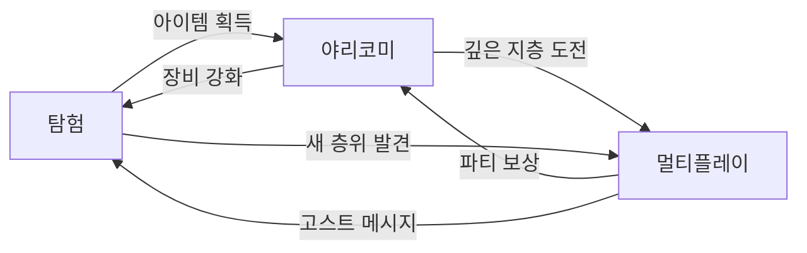
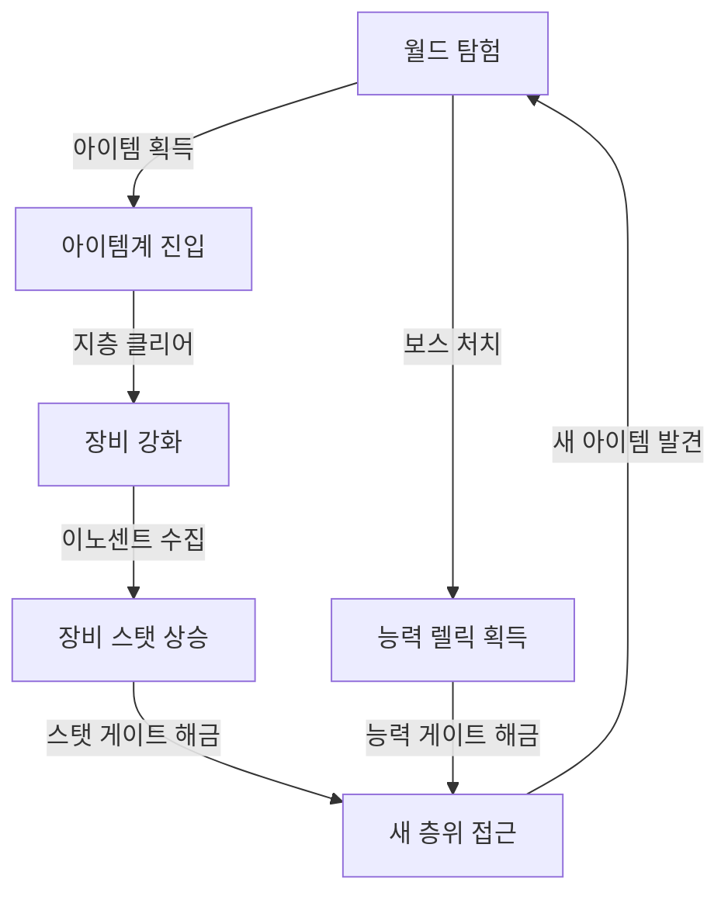

# Project Abyss 프로젝트 비전 (Project Vision)

## 구현 현황 (Implementation Status)

> **최근 업데이트:** 2026-03-23
> **문서 상태:** `작성 중 (Draft)`

---

## 0. 필수 참고 자료 (Mandatory References)

- Game Overview: `Reference/게임 기획 개요.md`
- Document Index: `Documents/Terms/Document_Index.md`
- Glossary: `Documents/Terms/Glossary.md`

---

## 1. 프로젝트 정의 (Project Definition)

| 항목       | 내용                                                                             |
| :--------- | :------------------------------------------------------------------------------- |
| 프로젝트명 | Project Abyss (가칭)                                                             |
| 장르       | 웹 기반 횡스크롤 온라인 액션 RPG (메트로베니아 + 야리코미)                       |
| 플랫폼     | 웹 브라우저 (PC)                                                                 |
| 타겟 유저  | 탐험과 파밍을 즐기는 코어-미드코어 게이머                                        |
| 세션 목표  | 평균 45분 이상                                                                   |
| 레퍼런스   | 월하의 야상곡(탐험/전투) + 디스가이아(아이템계/야리코미) + 스펠렁키(절차적 생성) |

### 한 줄 요약 (Elevator Pitch)

> "빌더가 남긴 거대한 수직 구조물을 탐험하고, 획득한 아이템의 금속 결 속으로 들어가 끝없이 강화하며, 다른 플레이어와 함께 싸우는 횡스크롤 온라인 액션 RPG"

### 주인공 (Protagonist)

| 항목 | 내용 |
| :--- | :--- |
| 이름 | 에르다 벤-나흐트 (Erda ven-Nacht) — 게임 후반까지 미공개 |
| 정체 | 정체불명의 여성. 직업은 격벽 측량사(Bulkhead Surveyor). 플레이어는 그녀가 누구인지, 왜 내려가는지 모른다 |
| 외형 | 여성, 나이 불명. 청록 작업복(오버올) + 주황 앞치마 + 용접 고글 + 산업용 부츠. 메가스트럭처 거주민의 복장. 오른손에 항상 에코를 들고 있다 |
| 에코 (도구/무기) | "에코(Echo)" — GBE(BLAME!) 오마주. (1) 격벽 관통/균열 탐지, (2) 아이템계 진입, (3) 원소 인챈트, (4) 강력한 단발 전투 타격. 정체는 최종장에서 에르다와 함께 밝혀진다 |
| 캐릭터 레퍼런스 | 킬리(BLAME!) — 고독한 여행자. 대사 극소. 목적 하나만 있다 |
| 서사 방식 | 대사 없이 행동으로 전달. 플레이어가 행동 패턴에서 의미를 읽는다 |
| 감정 핵심 | "말하지 않는 사람이 세계의 가장 깊은 곳까지 내려가는 이야기" |

---

## 2. 3대 기둥 (Three Design Pillars)

모든 설계 결정은 다음 3대 기둥 중 최소 1개에 정렬되어야 한다. 어느 기둥에도 해당하지 않는 기능은 프로젝트에 포함하지 않는다.

### 기둥 1: 메트로베니아 탐험 (Metroidvania Exploration)

| 항목        | 정의                                                                               |
| :---------- | :--------------------------------------------------------------------------------- |
| 핵심 판타지 | 탐험가 — 능력을 하나씩 얻으며 갈 수 없던 곳을 뚫어 세계의 비밀을 밝혀낸다         |
| 핵심 경험   | "저 절벽 위에 뭔가 보이는데 아직 못 간다" → 능력 획득 → "드디어 올라갈 수 있다!" |
| 설계 원칙   | 능력 게이트 + 스탯 게이트 이중 구조, 비선형 탐험, 재방문 보상                      |
| 검증 질문   | "이 시스템이 재방문/탐험 동기를 강화하는가?"                                       |
| 2-Space     | World                                                                              |

### 기둥 2: 아이템계 야리코미 (Item World Yarikomi)

| 항목        | 정의                                                                                                          |
| :---------- | :------------------------------------------------------------------------------------------------------------ |
| 핵심 판타지 | 장인 — 아이템 속에 들어가 이노센트를 사냥하고, 세상에 하나뿐인 최강 장비를 만든다                            |
| 핵심 경험   | "이 검의 모든 지층을 클리어하면 Ancient으로 승급할 수 있다" → 지층 클리어 → "이노센트 3마리 잡고 레어리티 승급!" |
| 설계 원칙   | 장비 내부 던전, 이노센트 시스템, 순환 진입(아이템계 → 월드 → 더 좋은 아이템계), 무한 성장 루프                |
| 검증 질문   | "이 시스템이 반복 플레이의 깊이와 보상감을 제공하는가?"                                                       |
| 2-Space     | Item World                                                                                                    |

### 기둥 3: 온라인 멀티플레이 (Online Multiplayer)

| 항목        | 정의                                                                                      |
| :---------- | :---------------------------------------------------------------------------------------- |
| 핵심 판타지 | 모험가 — 친구와 함께 끝없는 심연의 던전에 도전하고, 위기를 함께 극복한다                 |
| 핵심 경험   | "혼자선 최심층 지층 보스를 못 잡는다" → 파티 구성 → "탱커가 어그로 잡는 사이에 서포터가 버프!" |
| 설계 원칙   | 혼자서도 재미있고 함께하면 더 재미있는 설계, 역할 분담, URL 링크 공유로 아이템계 직접 합류 |
| 검증 질문   | "이 시스템이 혼자서도 재미있고 함께하면 더 재미있는가?"                                   |
| 2-Space     | Item World (URL 링크 공유로 직접 합류)                                                    |

### 기둥 간 상호 강화 (Pillar Synergy)



- **탐험 → 야리코미:** 월드에서 획득한 아이템이 아이템계 진입의 소재
- **야리코미 → 탐험:** 아이템계에서 강화한 장비의 스탯이 월드의 스탯 게이트를 해금
- **야리코미 → 멀티:** 깊은 지층은 파티 플레이로 설계
- **멀티 → 야리코미:** 파티 클리어 시 보상 보너스
- **탐험 → 멀티:** 월드의 고스트 메시지(비동기 멀티)
- **멀티 → 탐험:** 2인 협동 탐험 시 전용 퍼즐/보상

---

## 3. 2-Space 분리 모델 (월드 + 아이템계)

게임 세계를 2개 공간으로 분리하여, 각 공간이 고유한 규칙과 목적을 갖도록 설계한다. 이 분리가 "메트로베니아의 탐험감"과 "온라인 멀티플레이"가 양립하는 핵심 해법이다.

> **변경 이력 (2026-04-04):** 허브(Hub)는 독립 공간에서 폐기. 대장간/상점은 월드 세이브 포인트에 통합. 파티 합류는 URL 링크 공유로 아이템계 직접 진입.

| 항목        | 월드 (World)                                    | 아이템계 (Item World)           |
| :---------- | :---------------------------------------------- | :------------------------------ |
| 핵심 목적   | 탐험, 능력 획득, 스토리, 대장간/상점 (세이브 포인트) | 아이템 강화, 야리코미           |
| 인원        | 솔로(1인)                                       | 1-4인                         |
| 맵 유형     | 핸드크래프트 + 절차적 혼합                      | 완전 절차적 생성                |
| 진행 방식   | 능력 게이트 (메트로베니아)                      | 지층 클리어 (레어리티별 2-4 지층) |
| 사망 페널티 | 세이브 포인트 복귀                              | 진행 지층 손실                    |
| 고유 자원   | 능력 렐릭, 맵 데이터, 월드 소재                 | 이노센트, 아이템 EXP, 레벨 구슬 |
| 기둥 정렬   | 탐험                                            | 야리코미 + 멀티플레이           |

### 왜 2-Space인가?

| 문제                                                 | 해법                                                                |
| :--------------------------------------------------- | :------------------------------------------------------------------ |
| 메트로베니아의 탐험감과 온라인 멀티가 양립 가능한가? | 월드는 개인 탐험(솔로), 아이템계는 협동(1-2인, URL 링크 합류. Phase 4+에서 최대 4인)      |
| 야리코미(무한 파밍)가 탐험의 가치를 훼손하지 않는가? | 순환 구조: 더 깊은 아이템계를 위해 더 넓은 월드를 탐험해야 함       |

---

## 4. 순환 구조 (Core Loop)



### 순환 동력 분석

| 순환 요소              | 동력                            | 효과               |
| :--------------------- | :------------------------------ | :----------------- |
| 월드 → 아이템계       | 새 장비 획득, 더 강한 장비 필요 | 아이템계 진입 동기 |
| 아이템계 → 장비 강화  | 지층 클리어, 이노센트 수집      | 파밍/야리코미 만족 |
| 장비 강화 → 월드      | 스탯 게이트 해금                | 새 층위 탐험 동기  |
| 월드 탐험 → 능력 획득 | 보스 처치, 렐릭 발견            | 이동 범위 확대     |

### 이중 게이트 (Dual Gate)

월드 진행은 **능력 게이트**와 **스탯 게이트** 두 가지 축으로 제어된다.

| 게이트 유형 | 해금 조건             | 역할                                                   |
| :---------- | :-------------------- | :----------------------------------------------------- |
| 능력 게이트 | 보스 처치 / 렐릭 발견 | 전통적 메트로베니아 진행 (이단 점프, 벽 타기, 변신 등) |
| 스탯 게이트 | 장비 스탯 도달        | 아이템계 야리코미와 월드 탐험을 연결하는 핵심 고리     |

스탯 게이트의 존재가 이 게임의 독창적 요소이다. 능력 게이트만으로는 "메트로베니아 클론"이 되고, 스탯 게이트가 있어야 "아이템계에서 장비를 강화할 동기"가 생긴다.

---

## 5. 톤 & 매너 (Tone & Manner)

> **상세 아트 디렉션:** `Documents/Design/Design_Art_Direction.md` 참조

### 시각 (Visual)

| 항목        | 방향                                                                   |
| :---------- | :--------------------------------------------------------------------- |
| 아트 스타일 | 메가스트럭처 + 판타지, 스프라이트 기반 픽셀아트 2D                     |
| 색조        | 청록(배경/심연) + 주황(구조물/단조열) 이중 톤. 실루엣 가독성 우선      |
| 월드        | 빌더가 남긴 수직 대공동(The Shaft) — 삼중 레이어(자연/빌더 구조물/현 문명). 레퍼런스: BLAME! + 메이드 인 어비스 |
| 아이템계    | 부식 강판 / 다마스커스 단면 — 무기의 금속 결이 방과 복도가 되는 세계. 이전 주인의 기억이 지층을 이룸 |
| 세이브 포인트 | 메가스트럭처의 벽감(alcove) 안 대장간 — 거대한 차가움 속 유일한 따뜻함 |

### 청각 (Audio)

| 항목         | 방향                                            |
| :----------- | :---------------------------------------------- |
| 월드 BGM     | 산업적 앰비언트 + 잔향 (메가스트럭처의 광활한 공명) |
| 아이템계 BGM | 금속성 긴장 루프 (지층 깊어질수록 유기적 사운드 증가) |
| 세이브 포인트 BGM | 편안한 대장간 테마 — 망치 소리, 화덕 소리가 리듬 |
| 타격음       | 단조 타격음 기반 — 에코의 모든 타격이 "두드리는" 느낌 |

### 스토리 톤 (Story Tone Progression)

```
[Act 1: 코미디] — 아이템계를 부업으로 취급하는 행동, 오렌과의 케미 (에르다는 침묵, 오렌이 혼잣말)
→ [Act 2: 전환] — 아이템 안에서 이전 주인의 삶 목격. "이건 그냥 던전이 아니었어"
→ [Act 3: 진지] — 스승 마르타의 기억, 기억은 고쳐지지 않는다는 깨달음
→ [엔딩: 성장] — 고쳐지지 않아도 실재했다. 나아간다.
```

디스가이아 1 오마주 — "웃기는 이유와 슬픈 이유가 같다." 에르다의 아이템 집착이 Act 1에서는 개그의 재료이고, Act 3에서는 비극의 증거다.

### 감정 곡선 (Emotional Curve)

```
[세이브 포인트: 안전/준비] → [월드 탐험: 기대/긴장] → [탐험: 호기심/발견]
→ [보스: 긴장/도전] → [아이템계: 집중/파밍 쾌감] → [깊은 지층: 스릴/위험]
→ [모든 지층 클리어: 성취/환희] → [세이브 포인트 복귀: 안도/정비]
```

---

## 6. 핵심 금지 규칙 (Never-Do Rules)

프로젝트의 정체성을 지키기 위해 절대 하지 않는 것:

| 금지 규칙                     | 이유                                                            |
| :---------------------------- | :-------------------------------------------------------------- |
| Pay-to-Win 과금               | 야리코미의 성취감을 돈으로 대체하면 핵심 판타지(장인) 붕괴      |
| PvP 강제                      | 탐험/협동이 핵심. 강제 PvP는 캐주얼 유저 이탈 유발              |
| 전체 월드 멀티플레이          | 월드는 솔로 한정. 탐험의 고독감과 발견의 쾌감 보존             |
| VIP/월정액 스탯 부스트        | 모든 플레이어가 동일 조건에서 성장                              |
| 에너지/피로도 시스템          | 야리코미(무한 파밍)가 핵심인데 플레이 시간을 제한하는 것은 모순 |

---

## 7. 타겟 유저 프로파일 (Target User Profile)

### Primary: 탐험형 파머 (Explorer-Farmer)

| 항목        | 특성                                                       |
| :---------- | :--------------------------------------------------------- |
| 나이        | 25-35세                                                    |
| 게임 경험   | 월하의 야상곡/할로우 나이트 클리어, 디아블로/POE 시즌 경험 |
| 플레이 패턴 | 평일 1-2시간, 주말 4시간+                                  |
| 핵심 동기   | "내가 직접 키운 장비"에 대한 애착, 숨겨진 층위 발견의 쾌감 |
| 이탈 요인   | 과금 장벽, 반복 콘텐츠의 무의미함, PvP 강제                |

### Secondary: 소셜 수집가 (Social Collector)

| 항목        | 특성                                            |
| :---------- | :---------------------------------------------- |
| 나이        | 20-30세                                         |
| 게임 경험   | 메이플스토리/그라블루 경험, 수집/커뮤니티 활동  |
| 플레이 패��� | 매일 30분-1��간 (허브 접속 포함)                 |
| 핵심 동기   | 이노센트 수집/합성, 장비 자랑                   |
| 이탈 요인   | 혼자 하기 어려운 콘텐츠, 복잡한 조작            |

---

## 8. 플랫폼 전략 (Platform Strategy)

| 플랫폼             | 지원 범위 | 조작 방식                   |
| :----------------- | :-------- | :-------------------------- |
| PC 웹 브라���저     | 풀 지원   | 키보드+마우스 / 게임패드    |

### 조작 설계 원칙

직관적이고 접근성 높은 조작 체계를 제공한다. 스킬 슬롯 기반으로 설계하여 모든 콘텐츠를 쾌적하게 플레이할 수 있도록 한다.

| 원칙                | 설명                                                                        |
| :------------------ | :-------------------------------------------------------------------------- |
| 스킬 슬롯 기반 전투 | 기본 공격 + 4-6개 스킬 슬롯. 복잡한 콤보 입력 대신 스킬 버튼으로 전투       |
| 조작 단순화         | 백스텝 등 정밀 타이밍 조작 제거. 스킬 쿨다운 기반 전투로 대체              |
| 자동 조준 보조      | 가장 가까운 적 방향으로 스킬 자동 조준                                      |

---

## 9. 기술 스택 요약 (Tech Stack Summary)

| 계층       | 기술                          | 용도                          |
| :--------- | :---------------------------- | :---------------------------- |
| 클라이언트 | PixiJS v8 + TypeScript + Vite | 2D 렌더링, 메인 언어, 빌드    |
| 타일맵     | @pixi/tilemap                 | 맵 렌더링                     |
| 오디오     | Howler.js                     | BGM, SFX                      |
| 서버       | Node.js + WebSocket           | 게임 서버, 실시간 통신        |
| DB         | PostgreSQL + Redis            | 메인 DB, 캐시/세션            |
| 맵 에디터  | Tiled Map Editor              | Room 템플릿, Chunk 제작       |
| 향후       | Rust 마이그레이션 검토        | 유저 증가 시 고성능 서버 전환 |

---

## 10. 성공 지표 (KPI)

| 지표              | 목표                   | 측정               |
| :---------------- | :--------------------- | :----------------- |
| 세션 시간         | 평균 45분+             | 클라이언트 로그    |
| D7 잔존율         | 30%+                   | 7일 후 재접속      |
| 아이템계 진입률   | 첫 아이템계 진입 80%+  | 튜토리얼 후 전환율 |
| 멀티플레이 참여율 | 주 1회 이상 파티 50%+  | URL 링크 합류 로그 |
| 월드 탐험률       | 평균 60%+              | 맵 데이터          |

---

## 11. 개발 Phase (Development Roadmap)

| Phase   | 이름       | 목표 질문                           | 핵심 과제                                              |
| :------ | :--------- | :---------------------------------- | :----------------------------------------------------- |
| Phase 1 | 프로토타입 | 핵심 루프가 재미있는가?             | 이동/전투, 타일맵, 절차적 방 생성, 아이템계 미니(1지층) |
| Phase 2 | 알파       | 성장/탐험 쾌감이 있는가?            | 장비/이노센트, 스탯+능력 게이트, 월드 연결, 보스       |
| Phase 3 | 베타       | 파티 플레이/무한 파밍이 작동하는가? | WebSocket 멀티, 아이템계 전 지층, URL 링크 파티 합류   |

---

## 검증 기준 (Verification Checklist)

- [ ] 모든 시스템 문서가 3대 기둥 중 최소 1개에 정렬되어 있는가?
- [ ] 모든 시스템 문서가 2-Space(World/ItemWorld) 중 작동 공간을 명시하는가?
- [ ] 순환 구조의 각 연결이 구체적 메커닉으로 뒷받침되는가?
- [ ] 핵심 금지 규칙이 모든 기획 결정에서 준수되는가?
- [ ] 이중 게이트(능력+스탯)가 탐험↔야리코미 순환을 강화하는가?
- [ ] PC 웹 브라우저 조작 설계 원칙이 명���히 정의되어 있는가?
- [ ] 타겟 유저 프로파일의 이탈 요인이 설계에 반영되어 있는가?
