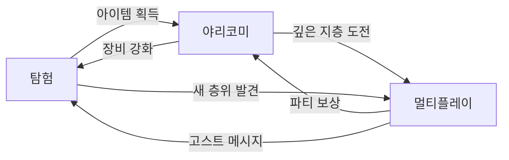

# ECHORIS 프로젝트 비전 (Project Vision)

## 구현 현황 (Implementation Status)

> **최근 업데이트:** 2026-04-19
> **문서 상태:** `작성 중 (Draft) — v2`
> **개정 사유:** Phase 1 졸업(DEC-021), 무기 7종 체계(DEC-026), 플레이테스트 검증, 리서치 60+건, 시스템 GDD 40+건 결과 반영. 게임플레이 비전(§5-9) 신규 삽입.

---

## 0. 필수 참고 자료 (Mandatory References)

- Game Overview: `Reference/게임 기획 개요.md`
- Document Index: `Documents/Terms/Document_Index.md`
- Glossary: `Documents/Terms/Glossary.md`

---

## 1. 프로젝트 정의 (Project Definition)

| 항목       | 내용                                                                             |
| :--------- | :------------------------------------------------------------------------------- |
| 프로젝트명 | ECHORIS                                                                          |
| 장르       | 웹 기반 횡스크롤 온라인 액션 RPG (메트로베니아 + 야리코미)                       |
| 플랫폼     | 웹 브라우저 (PC)                                                                 |
| 타겟 유저  | 탐험과 파밍을 즐기는 코어-미드코어 게이머                                        |
| 세션 목표  | 평균 45분 이상                                                                   |
| 레퍼런스   | BLAME!/메이드 인 어비스(세계관/스케일) + 월하의 야상곡(탐험/전투) + 디스가이아(아이템계/야리코미) + 스펠렁키(절차적 생성) |

### 한 줄 요약 (Elevator Pitch)

> "거대 빌더가 누비는 수직 구조물을 탐험하고, 말을 거는 무기 속으로 들어가 끝없이 강화하며, 다른 플레이어와 함께 싸우는 횡스크롤 온라인 액션 RPG"

### 주인공 (Protagonist)

| 항목 | 내용 |
| :--- | :--- |
| 이름 | 에르다 벤-나흐트 (Erda ven-Nacht) -- 게임 후반까지 미공개 |
| 정체 | 정체불명의 여성. 직업은 격벽 측량사(Bulkhead Surveyor). 플레이어는 그녀가 누구인지, 왜 내려가는지 모른다 |
| 외형 | 여성, 나이 불명. 청록 작업복(오버올) + 주황 앞치마 + 용접 고글 + 산업용 부츠. 메가스트럭처 거주민의 복장. 오른손에 항상 에코를 들고 있다 |
| 에코 (도구/무기) | "에코(Echo)" -- GBE(BLAME!) 오마주. (1) 격벽 관통/균열 탐지, (2) 아이템계 진입, (3) 원소 인챈트, (4) 강력한 단발 전투 타격. 정체는 최종장에서 에르다와 함께 밝혀진다 |
| 캐릭터 레퍼런스 | 킬리(BLAME!) -- 고독한 여행자. 대사 극소. 목적 하나만 있다 |
| 서사 방식 | 에르다 대사 0줄. 무기가 Ego를 가지고 에르다에게 말한다. 에르다는 행동으로 답한다 (Transistor Red 패턴) |
| 감정 핵심 | "말하지 않는 사람과 말을 거는 검이, 세계의 가장 깊은 곳까지 내려가는 이야기" |

---

## 2. 3대 기둥 (Three Design Pillars)

모든 설계 결정은 다음 3대 기둥 중 최소 1개에 정렬되어야 한다. 어느 기둥에도 해당하지 않는 기능은 프로젝트에 포함하지 않는다.

### 기둥 1: 메트로베니아 탐험 (Metroidvania Exploration)

| 항목        | 정의                                                                               |
| :---------- | :--------------------------------------------------------------------------------- |
| 핵심 판타지 | 탐험가 -- 능력을 하나씩 얻으며 갈 수 없던 곳을 뚫어 세계의 비밀을 밝혀낸다         |
| 핵심 경험   | "저 절벽 위에 뭔가 보이는데 아직 못 간다" -> 능력 획득 -> "드디어 올라갈 수 있다!" |
| 설계 원칙   | 능력 게이트 + 스탯 게이트 이중 구조, 비선형 탐험, 재방문 보상                      |
| 검증 질문   | "이 시스템이 재방문/탐험 동기를 강화하는가?"                                       |
| 2-Space     | World                                                                              |

### 기둥 2: 아이템계 야리코미 (Item World Yarikomi)

| 항목        | 정의                                                                                                          |
| :---------- | :------------------------------------------------------------------------------------------------------------ |
| 핵심 판타지 | 장인 -- 아이템 속에 들어가 기억 단편를 사냥하고, 세상에 하나뿐인 최강 장비를 만든다. 300무기 x 5레어리티 = 1,500개의 고유한 아이템계 |
| 핵심 경험   | "이 검의 모든 지층을 클리어하면 Ancient으로 승급할 수 있다" -> 지층 클리어 -> "기억 단편 3마리 잡고 레어리티 승급!" |
| 설계 원칙   | 장비 내부 던전, 기억 단편 시스템, 순환 진입(아이템계 -> 월드 -> 더 좋은 아이템계), 무한 성장 루프                |
| 검증 질문   | "이 시스템이 반복 플레이의 깊이와 보상감을 제공하는가?"                                                       |
| 2-Space     | Item World                                                                                                    |

### 기둥 3: 온라인 멀티플레이 (Online Multiplayer)

| 항목        | 정의                                                                                      |
| :---------- | :---------------------------------------------------------------------------------------- |
| 핵심 판타지 | 모험가 -- 친구와 함께 끝없는 심연의 던전에 도전하고, 위기를 함께 극복한다                 |
| 핵심 경험   | "혼자선 최심층 지층 보스를 못 잡는다" -> 파티 구성 -> "탱커가 어그로 잡는 사이에 서포터가 버프!" |
| 설계 원칙   | 혼자서도 재미있고 함께하면 더 재미있는 설계, 역할 분담, URL 링크 공유로 아이템계 직접 합류 |
| 검증 질문   | "이 시스템이 혼자서도 재미있고 함께하면 더 재미있는가?"                                   |
| 2-Space     | Item World (1-2인 Phase 3, 최대 4인 Phase 4+)                                            |

### 기둥 간 상호 강화 (Pillar Synergy)



- **탐험 -> 야리코미:** 월드에서 획득한 아이템이 아이템계 진입의 소재
- **야리코미 -> 탐험:** 아이템계에서 강화한 장비의 스탯이 월드의 스탯 게이트를 해금
- **야리코미 -> 멀티:** 깊은 지층은 파티 플레이로 설계
- **멀티 -> 야리코미:** 파티 클리어 시 보상 보너스
- **탐험 -> 멀티:** 월드의 고스트 메시지(비동기 멀티)
- **멀티 -> 탐험:** 2인 협동 탐험 시 전용 퍼즐/보상

---

## 3. 2-Space 분리 모델 (월드 + 아이템계)

게임 세계를 2개 공간으로 분리하여, 각 공간이 고유한 규칙과 목적을 갖도록 설계한다. 이 분리가 "메트로베니아의 탐험감"과 "온라인 멀티플레이"가 양립하는 핵심 해법이다.

| 항목        | 월드 (World)                                    | 아이템계 (Item World)           |
| :---------- | :---------------------------------------------- | :------------------------------ |
| 핵심 목적   | 탐험, 능력 획득, 스토리, 대장간/상점 (세이브 포인트) | 아이템 강화, 야리코미           |
| 인원        | 솔로(1인)                                       | 1-2인 (Phase 3) / 최대 4인 (Phase 4+) |
| 맵 유형     | 핸드크래프트 + 절차적 혼합                      | 완전 절차적 생성                |
| 진행 방식   | 능력 게이트 (메트로베니아)                      | 지층 클리어 (레어리티별 2-4 지층) |
| 사망 페널티 | 세이브 포인트 복귀                              | 진행 지층 손실                    |
| 고유 자원   | 능력 렐릭, 맵 데이터, 월드 소재                 | 기억 단편, 아이템 EXP, 레벨 구슬 |
| 기둥 정렬   | 탐험                                            | 야리코미 + 멀티플레이           |

### 왜 2-Space인가?

| 문제                                                 | 해법                                                                |
| :--------------------------------------------------- | :------------------------------------------------------------------ |
| 메트로베니아의 탐험감과 온라인 멀티가 양립 가능한가? | 월드는 개인 탐험(솔로), 아이템계는 협동(1-2인, URL 링크 합류)       |
| 야리코미(무한 파밍)가 탐험의 가치를 훼손하지 않는가? | 순환 구조: 더 깊은 아이템계를 위해 더 넓은 월드를 탐험해야 함       |

---

## 4. 순환 구조 (Core Loop)


### 3단계 루프 구조 (Micro/Meso/Macro)

| 루프 | 주기 | 핵심 행동 | 보상 |
| :--- | :--- | :--- | :--- |
| **마이크로** (전투) | 5-30초 | 적 처치, 콤보 완성, 회피 | 드랍, EXP, 히트스탑 쾌감 |
| **메조** (지층/구역) | 5-15분 | 지층 클리어, 보스 처치 | 영구 스탯 보너스, 기억 단편, 레어리티 승급 기회 |
| **매크로** (진행) | 1-10시간 | 스탯 게이트 돌파, 새 층위 도달 | 새 바이옴, 능력 렐릭, 서사 단편 |

### 순환 동력 분석

| 순환 요소              | 동력                            | 효과               |
| :--------------------- | :------------------------------ | :----------------- |
| 월드 -> 아이템계       | 새 장비 획득, 더 강한 장비 필요 | 아이템계 진입 동기 |
| 아이템계 -> 장비 강화  | 지층 클리어, 기억 단편 수집      | 파밍/야리코미 만족 |
| 장비 강화 -> 월드      | 스탯 게이트 해금                | 새 층위 탐험 동기  |
| 월드 탐험 -> 능력 획득 | 보스 처치, 렐릭 발견            | 이동 범위 확대     |

### 이중 게이트 (Dual Gate)

월드 진행은 **능력 게이트**와 **스탯 게이트** 두 가지 축으로 제어된다.

| 게이트 유형 | 해금 조건             | 역할                                                   |
| :---------- | :-------------------- | :----------------------------------------------------- |
| 능력 게이트 | 보스 처치 / 렐릭 발견 | 전통적 메트로베니아 진행 (이단 점프, 벽 타기, 변신 등) |
| 스탯 게이트 | 장비 스탯 도달        | 아이템계 야리코미와 월드 탐험을 연결하는 핵심 고리     |

스탯 게이트의 존재가 이 게임의 독창적 요소이다. 능력 게이트만으로는 "메트로베니아 클론"이 되고, 스탯 게이트가 있어야 "아이템계에서 장비를 강화할 동기"가 생긴다.

---

## 5. 월드 구조 & 레벨 디자인 (World Structure & Level Design)

> **상세 명세:** `Documents/System/System_World_MapStructure.md`
> **기둥 정렬:** 탐험 (주), 야리코미 (부)

### 설계 철학

> "세계는 능력보다 먼저 존재한다. 플레이어가 능력을 얻기 전에, 그 능력이 필요한 장소를 이미 보았어야 한다."
> -- Hollow Knight 원칙

ECHORIS의 월드는 **대공동(The Shaft)**이라 불리는 거대한 수직 구조물이다. 거대 빌더(Giant Builder)가 현재도 세계를 누비며 구조물을 변형시키고 있다. 에르다는 중앙 성채(Tier 2)에서 출발하여, 심연 전쟁의 상흔이 남은 7개 층위를 아래로 하강한다. 왜 내려가는지는 플레이어에게 설명되지 않는다 -- 에르다의 행동만이 단서다.

### 7개 층위 (Vertical Descent)

```
  [생태 구역 + 대장간] (진입 시퀀스)
     |
  ┌──────────────────────────────────────────┐
  │  Tier 2: 중앙 성채 / Concordia -- HUB    │
  │  (세이브 포인트, 대장간, NPC, 상점)       │
  └──────────────────────────────────────────┘
     |
  ── 격벽 1: 이단 점프 (Double Jump) ──
     |
  Tier 3: 기록 침전소 / Necropolis
     |
  ── 격벽 2: 벽 타기 (Wall Climb) ──
     |
  Tier 4: 지하 수로 / Veinway
     |
  ── 격벽 3: 안개 변신 (Mist Form) ──
     |
  Tier 5: 연구소 폐허 / Memoria Arcana
     |
  ── 격벽 4: 수중 호흡 (Water Breathing) ──
     |
  Tier 6: 빙결 보존소 / Cryo-Archive
     |
  ══ 대격벽 (Great Bulkhead) ══
     |
  Tier 7: 심연의 구 / Abyss Sphere

  ── 후반부 역중력 해금 ──
     |
  Tier 1: 천공의 정원 / Canopy (상승 경로)
```

### 레벨 디자인 원칙

| 원칙 | 설명 | 근거 |
| :--- | :--- | :--- |
| 수직 척추 + 횡방향 가지 | 층위 간 이동은 수직 선형, 각 층위 내부는 좌우 메트로베니아 탐험 | 수직 하강의 긴장감과 비선형 탐험 자유도를 양립 |
| 핸드크래프트 랜드마크 + 절차적 Chunk | 보스방/서사 오브젝트는 고정, Room 내부 Chunk만 절차적 변화 | 역사적 장소감을 유지하면서 재방문 신선함 확보 |
| 필드 제단 배치 | 각 층위에 제단(에코로 무기를 두드려 아이템계 진입)을 배치 | 탐험 도중 자연스러운 아이템계 진입 동기 제공. 순환 구조의 물리적 연결점 |
| 교수 쌍(Teaching Pair) | 게이트(문제)와 해답은 시야각 안에 함께 배치하거나 UI가 해답 위치를 가리킴 (DEC-025) | 2026-04-17 플레이테스트: 게이트와 해답이 분리되면 "납치감" 발생 |
| 격벽 기반 능력 게이트 | 층위 간 경계에 물리적 격벽을 배치. 특정 능력 없이는 하강 불가 | 메가스트럭처 세계관이 게이트를 자연스럽게 정당화 |

### 에르다의 감정 아크와 층위 하강

각 층위는 단순한 바이옴이 아니라 심연 전쟁(Era 3)의 상흔이 남은 역사적 장소다. 에르다는 과묵하게 하강하고, 검이 때로 말을 건넨다. 층위가 깊어질수록 환경 자체가 이야기한다:

- **T2-T3:** 비교적 안전한 영역. 에르다의 행동에서 일상적 측량 작업의 연장선이 느껴진다
- **T4-T5:** 구조물의 상흔이 심해진다. 아이템 내부의 기억이 이전 주인의 삶을 보여주기 시작
- **T6-T7:** 심연에 가까워질수록 구조물이 변형된다. 에르다의 하강 목적이 환경 단서로 드러난다
- **T1 (반전):** 후반부 상승. 정상에서 세계를 내려다보며 시야 확장

---

## 6. 장비 & 300무기 비전 (Equipment & 300 Weapons Vision)

> **상세 명세:** `Documents/System/System_Combat_Weapons.md`, `Documents/System/System_Equipment_Slots.md`, `Documents/System/System_Equipment_Growth.md`
> **리서치:** `Documents/Research/WeaponDiversity_300Weapons_Research.md`, `Documents/Research/ItemTypes_FullSurvey_Research.md`
> **기둥 정렬:** 야리코미 (주), 탐험 (부), 멀티플레이 (부)

### 설계 철학

> "300개의 무기가 있으면, 300개의 플레이 스타일이 있어야 한다."
> "무기 하나를 고르는 순간, 그 플레이어의 전투 언어가 결정된다."

무기는 ATK 수치 컨테이너가 아니다. 카테고리가 전투 리듬을, 시그니처 메커닉이 포지셔닝 전략을, 패시브가 빌드 다양성을 결정한다.

### 7종 무기 체계 (DEC-026)

근접 5종(사거리x속도 5분할) + 원거리 2종(물리/파동 축 분화):

| 무기 | 타수 | 시그니처 메커닉 | 핵심 판타지 | 스케일링 |
| :--- | :--: | :--- | :--- | :--- |
| **Blade** (단조 공방 한손 절삭기) | 3 | 3타 피니셔 강화 | 쉬지 않고 베면 점점 강해지는 단조 장인 | ATK |
| **Cleaver** (격벽 파쇄도) | 2 | 80px 전방 충격파 | 한 방이 모든 것을 결정하는 격벽 파쇄자 | ATK |
| **Shiv** (외과 단도) | 4 | 배후 강타 x3.0 | 그림자에서 나타나 급소를 찌르는 암살자 | ATK |
| **Harpoon** (빌더 리바 장창) | 3 | 관통 최대 3체 | 먼 거리의 적을 한 줄로 꿰뚫는 작살꾼 | ATK |
| **Chain** (강철 사슬) | 3 | 끝단 12px 히트 x2.0 | 사슬 끝에 숨겨진 치명적 일격의 사냥꾼 | ATK |
| **Railbow** (전자기 가속 투척기) | 3 | 대시 후 정확도 100% + x1.2 | 카이팅 샷으로 안전 거리에서 딜을 쌓는 저격수 | ATK |
| **Emitter** (파동 방출 장비) | 3 | 인챈트 효과 x1.5, INT 스케일링 | 원소의 힘을 증폭하는 파동 연구자 | INT (유일) |

### 300무기 확장 구조

| 분류 | 수량 | 설명 | 드랍 방식 |
| :--- | ---: | :--- | :--- |
| **일반 무기** | 278 | 레어리티 롤 (Normal-Ancient), 7축 패시브 프레임워크 | 아이템계/월드 드랍 |
| **로어 무기** | 22 | 핸드 플레이스먼트, 고정 레어리티, 엘든링 스타일 배치 | 월드 특정 위치에 수작업 배치 |

**7축 패시브 프레임워크 (A-G):**

| 축 | 이름 | 비율 | 예시 |
| :--- | :--- | :--: | :--- |
| A | 크리티컬 | 18% | 치명타율 +N%, 치명타 시 HP 회복 |
| B | 온힛 | 21% | 공격 적중 시 화염 방출, 빙결 확률 |
| C | 상태변환 | 12% | 상태이상 적 공격 시 추가 데미지 |
| D | 킬보너스 | 8% | 처치 시 ATK +N (3초), 연쇄 처치 보상 |
| E | 콤보 | 19% | N타 완성 시 충격파, 콤보 유지 보너스 |
| F | 이동 | 12% | 대시 후 공격 강화, 공중 공격 범위 증가 |
| G | 환경/팀 | 10% | 파티원 근처 시 ATK 상승, 바이옴 적응 |

> B(온힛)/E(콤보)/A(크리티컬)이 58%를 차지한다. 플레이어가 가장 체감하는 축에 집중.

**로어 무기 22종 -- 핸드 플레이스먼트:**
엘든링 스타일로 월드에 직접 배치. 에르다 측량대 시리즈 5종(나침반/수첩/표식기/연추선/경위의)이 첫 세트. 대공동 측량 서사와 직접 연결. 데이터는 CSV+MD 하이브리드 (DEC-023): `Sheets/Content_Stats_Weapon_Lore.csv` + `Sheets/LoreTexts/{WeaponID}.md`.

**Phase별 무기 로드맵:**

| Phase | 무기 수 | 초점 |
| :--- | ---: | :--- |
| Phase 2 (알파) | 5 | Blade MVP 5종 |
| Phase 3 (베타) | 100 | MVP(star) 패시브 풀 |
| Phase 4 (런칭) | 300 | 확장(star) 포함, 보스 무기 16종 |
| Phase 4+ (시즌) | 500+ | PoE 스타일 시즌 업데이트 |

### 장비 10슬롯 체계 (DEC-026)

| 카테고리 | 슬롯명 | 세계관 해석 |
| :--- | :--- | :--- |
| 무기 | weapon + sub_weapon | 주무기 + 보조무기 |
| 방어구 | **Visor / Plate / Gauntlet / Greaves / Rig** | Rig = 배면 장착 모듈 (Cloak에서 리네이밍) |
| 장신구 | **Sigil x2 / Seal x1** | Sigil = 빌더 문양 인장, Seal = 상위 빌더 권한 봉인체 |

### 장비 성장 3축

> "장비는 드랍된 순간이 아니라, 플레이어가 직접 아이템계를 정복하며 성장시킨 순간에 진정한 가치를 갖는다."

| 축 | 메커닉 | 동력 |
| :--- | :--- | :--- |
| 아이템 레벨 (0-99) | 지층 탐험 EXP로 레벨업, 기본 스탯 선형 증가 | "한 층 더 내려가면 레벨이 오른다" |
| 보스 영구 보너스 | 아이템계 보스 처치 시 스탯 영구 증가 (취소 불가) | "이번에 왕을 잡으면 ATK +5 영구" |
| 레어리티 승급 | 전 지층 클리어 + 재료 소모 + 확률 판정 (피티 보장) | "이 검을 한 번 더 벼리면 다음 등급으로" |

스탯 공식: `FinalStat = BaseStat x (1 + level x 0.05) + permanentBonus + Memory ShardBonus`

### 기억 단편 시스템

아이템에 거주하며 보너스 스탯을 부여하는 존재. 야생(Wild) -> 복종(Subdued) 전환이 핵심.

| 분류 | 기능 | 획득 |
| :--- | :--- | :--- |
| atk 기억 단편 | ATK 보너스 | 아이템계 지층 |
| def 기억 단편 | DEF 보너스 | 아이템계 지층 |
| hp 기억 단편 | HP 보너스 | 아이템계 지층 |

> exp%/luck 기억 단편는 삭제됨 (2026-04-14). 3종만 유지.

### 레어리티 체계

| 등급      | 색상         | 스탯 배율 | 기억 단편 슬롯 | 아이템계 지층 수 |
| :-------- | :----------- | :-------: | :-----------: | :---: |
| Normal    | 흰색 #FFFFFF | x1.0      | 2             | 2 |
| Magic     | 파란 #6969FF | x1.3      | 3             | 3 |
| Rare      | 노란 #FFFF00 | x1.7      | 4             | 3 |
| Legendary | 주황 #FF8000 | x2.2      | 6             | 4 |
| Ancient   | 초록 #00FF00 | x3.0      | 8             | 4 + 심연 |

---

## 7. 적 & 보스 생태계 (Enemy & Boss Ecosystem)

> **상세 명세:** `Documents/System/System_Enemy_BossDesign.md`, `Documents/Research/EnemyDesign_MobArchetype_Research.md`
> **기둥 정렬:** 탐험 (주), 야리코미 (부)

### 설계 철학

> "지층이 깊어질수록 아키타입을 추가하지 않고 조합한다."
> "처음 마주쳤을 때 압도당하고, 세 번 만나면 패턴이 보이고, 처치하는 순간 이 존재가 왜 여기 있었는지를 이해한다."

적 수량 증가보다 아키타입 조합 변화가 난이도의 핵심 튜닝 수단이다. Dead Cells 레퍼런스: 방 1개당 3-7개 적, 난이도는 수(count)보다 조합(composition)으로 조절.

### 일반 적 아키타입 (9종)

| 아키타입 | 위협 축 | 플레이어에게 가르치는 것 |
| :--- | :--- | :--- |
| 근접 돌격형 | 수평 공간 관리 | 거리 유지, 콤보 타이밍 |
| 원거리 사격형 | 엄폐/이동 강제 | 우선순위 판단 |
| 방어/방패형 | 측면 공격 필요 | 포지셔닝, 배후 강타(Shiv 특화) |
| 비행형 | 수직 공간 활성화 | 공중 전투, 점프 공격 |
| 군집형 | 자원 소비 강제 | AoE 활용, 범위 무기 가치 |
| 엘리트형 | 위기 고조 | 패턴 읽기 숙달 |
| 자폭형 | 즉각 반응 강제 | 우선 처리 판단 |
| 소환형 | 지속적 압박 | 소스 우선 처리 |
| 환경 연동형 | 지형 인식 | 지형 활용 전투 |

### 조우 진행 (지층별)

| 지층 | 구성 원칙 | 예시 |
| :--- | :--- | :--- |
| 지층 1 | 아키타입 고립 도입. 각각 단독으로 등장 | 돌격형 3마리 |
| 지층 2 | 2종 조합 시작 | 돌격형 2 + 사격형 1 |
| 지층 3 | 3종 이상 조합 + 엘리트 혼합 | 돌격형 1 + 비행형 2 + 엘리트 1 |
| 지층 4+ (심연) | 전 아키타입 조합 + 환경 연동 | 군집 + 소환 + 환경 연동 |

### 월드 보스 (12종)

**진행 보스 6종** -- 각 층위 1개. 보스 = 심연 전쟁의 살아있는 증언자. 처치 시 능력 렐릭 드랍.

| 층위 | 보스명 | 분류 | 능력 게이트 보상 |
| :--- | :--- | :--- | :--- |
| T3 기록 침전소 | 수호단의 잔영 | 1:1 듀얼 | 이단 점프 해금 |
| T4 수로 | 수로의 파수꾼 | 기믹 보스 | 벽 타기 해금 |
| T5 연구소 | 폭주한 실험체 | 3페이즈 듀얼 | 안개 변신 해금 |
| T6 빙결 | 냉동 수호자 | 대형 고정 | 수중 호흡 해금 |
| T1 천공 | 관측의 눈 | 기믹+군체 | 역중력 해금 |
| T7 심연 | 카엘 오르스의 기억 | 4페이즈 최종 | -- (엔딩) |

**숨겨진 보스 6종** -- Critical Path 외 탐험 보상. 진행 보스보다 높은 난이도, 고유 아이템 드랍.

### 아이템계 보스 (4등급)

| 등급 | 출현 조건 | 난이도 | 보상 |
| :--- | :--- | :--- | :--- |
| 아이템 장군 | 지층 2 마지막 방 | Normal 기준 | EXP 보너스, 스탯 영구 +1 |
| 아이템 왕 | 지층 3 마지막 방 | 장군의 1.5배 | 기억 단편 슬롯 +1, 스탯 영구 +3 |
| 아이템 신 | 지층 4 마지막 방 | 왕의 2배 | 승급 재료, 스탯 영구 +5 |
| 아이템 대신 | 심연 최심층 | 신의 3배 | Ancient 전용 Anchor 패스 |

### 기억 단편 (야생)

아이템계 지층에서 조우하는 야생 기억 단편는 전투 대상이면서 보상이다. 도주형 행동 패턴: 플레이어를 감지하면 도주. 처치 시 복종 기억 단편로 전환되어 장비에 귀속.

---

## 8. 첫 30분 & 온보딩 (First 30 Minutes & Onboarding)

> **상세 명세:** `Documents/Content/Content_First30Min_ExperienceFlow.md`
> **리서치:** `Documents/Research/ItemWorldEntry_NaturalOnboarding_Research.md`, `Documents/Research/Zelda_Onboarding_Evolution_Research.md`
> **기둥 정렬:** 야리코미 (주), 탐험 (부)

### 설계 철학

> "말하지 않는 사람과 말을 거는 검. 검이 안내하고, 에르다가 행동으로 답한다. 플레이어는 둘의 관계를 통해 세계와 규칙을 이해한다."

첫 30분에서 에르다 대사는 0줄. NPC, 퀘스트, 튜토리얼 텍스트 없음. 단, 검(Rustborn)이 Ego를 가지고 에르다에게 말을 건넨다. 에르다의 행동과 검의 대사를 통해 세계와 규칙을 이해한다.

### 30분 종료 시 5가지 체득

1. 이동, 점프, 대시, 공격의 조작감
2. "검 속에 들어갈 수 있다"는 핵심 판타지 (스파이크)
3. "아이템계에서 싸우면 장비가 강해진다"는 핵심 루프
4. "강해지면 못 가던 곳을 갈 수 있다"는 스탯 게이트
5. "이것을 반복하면 더 깊이 갈 수 있다"는 루프 인식

### 감정 곡선

```
[고요/경외]    발코니에서 심연을 내려다봄
-> [호기심]      걷기 시작. 이 사람은 누구인가
-> [학습]        점프, 대시, 전투를 환경에서 배움
-> [좌절]        ATK 게이트 -- 못 뚫음. 돌아감
-> [발견]        텅 빈 바닥의 검. 줍는다
-> [충격/경외]   바닥 붕괴. 아래로 떨어짐
-> [긴장]        낯선 공간. 기억의 풍경. 전투
-> [도전/몰입]   보스전. 사망. 재도전. 패턴 학습
-> [성취]        보스 처치. "ATK +8" -- 강해졌다
-> [쾌감]        이전에 걸리던 적이 더 빨리 죽는다!
-> [돌파감]      ATK 게이트 파괴. 새 공간!
-> [이해/갈망]   바닥에 또 아이템. "아, 이 루프구나"
```

### Sacred Pickup 5조건 (아이템계 진입의 자연스러움)

2026-04-17 플레이테스트에서 "납치감" 피드백 수신. 11개 레퍼런스 게임 분석 결과, 자연스러운 차원 진입에는 5가지 조건이 필요:

| 조건 | 설명 | ECHORIS 구현 |
| :--- | :--- | :--- |
| 동기 (Motivation) | "이 안에 뭔가 있다"는 호기심 | 무기 획득 시 맥동 1회 (GlowFilter + alpha tween) |
| 동의 (Consent) | 플레이어의 명시적 행동 | E키로 제단에 무기를 올려놓는 행위 |
| 예고 (Preview) | 진입 전 "안이 어떤 곳인지" 힌트 | 미니 프리뷰 (지층 수/난이도 표시) |
| 안전망 (Safety Net) | 실패 시 복구 수단 | ESC 즉시 귀환, 첫 진입 사망 특례 (보스 HP 유지) |
| 학습 (Learning) | 첫 경험에서 규칙을 이해 | 1지층 짧은 체험 (4x4 Room, 2-3분) |

> 핵심 발견: 디스가이아는 아이템계를 챕터 3(3-5시간 후)에 해금. Dead Cells/Hades는 0-15초에 진입하지만 구조적으로 5조건 충족. 시간이 아니라 구조가 문제다.

### 심볼 프롬프트 예외 (DEC-025)

에르다 대사 0줄 유지. 검 Ego 대사는 허용. 심볼 프롬프트 3개 모멘트도 유지:

1. **첫 인벤토리 상호작용** -- 첫 픽업 시 1회 강조 (3초)
2. **첫 제단(아이템계) 진입** -- E키 아이콘 + 제단 동작 아이콘
3. **첫 스탯 게이트 조우** -- 자물쇠 아이콘 + 수치 비교 표시

언어 텍스트 금지. 키 아이콘 + 동작 아이콘(검/자물쇠/망치 등)만 허용. 다국어 비용 0.

---

## 9. 성장 피드백 & 도파민 (Growth Feedback & Dopamine)

> **리서치:** `Documents/Research/ItemWorld_DepthReward_RiskBalance_Research.md`, `Documents/Research/Retention_Hour1to10_Research.md`
> **플레이테스트:** `Documents/Feedback/Playtest_2026-04-17.md`
> **기둥 정렬:** 야리코미 (주), 탐험 (부)

### 설계 철학

> "성장이 존재하지만 인지되지 않으면 성장이 없는 것과 같다."

2026-04-17 플레이테스트 핵심 발견: 스파이크 컨셉은 검증됨(4/5 긍정), 그러나 성장 피드백 루프가 닫혀 있지 않았다. 강화는 일어나지만 플레이어가 그것을 **인지하지 못했다**.

### 4계층 피드백 시스템

| 계층 | 채널 | 구현 | 체감 타이밍 |
| :--- | :--- | :--- | :--- |
| 수치 | ATK +N 팝업, 데미지 넘버 | HUD 좌측 ATK 상시 표시, 강화 직후 before/after 비교 | 즉시 |
| 청각 | 히트 SFX, 레벨업 징글 | 단조 타격음 기반. 강화 전후 타격음 변화 | 즉시 |
| 시각 | 히트스탑, 화면 흔들림, 파티클 | 킬 시 0.08s 히트스탑 + 파티클 3개 (P0 액션아이템 A11) | 즉시 |
| 마일스톤 | 게이트 돌파, 레어리티 승급 | 돌파 연출 (벽 파괴 애니메이션), 승급 시 장비 광택 변화 | 메조 루프 |

### 플레이테스트 P0 액션 아이템 (5건)

| ID | 내용 | 피드백 계층 |
| :--- | :--- | :--- |
| A1 | 아이템계 다이브 시퀀스 (바닥 붕괴 3초 연출) | 시각 |
| A2 | 데미지 팝업 + SFX | 수치 + 청각 |
| A3 | 제단 affordance (빛 발산, 상호작용 가능 힌트) | 시각 |
| A8 | 게이트 해답 아이콘 (게이트 -> 제단 방향 표시) | 시각 |
| A11 | 킬 히트스탑 + 파티클 | 시각 + 청각 |

### 톱니파 긴장 곡선 (아이템계)

아이템계의 각 지층은 톱니파(sawtooth) 패턴으로 긴장과 이완을 반복한다:

```
긴장도
  ^
  |    /|    /|    /|
  |   / |   / |   / |
  |  /  |  /  |  /  |
  | /   | /   | /   |
  |/    |/    |/    |
  +-----|-----|-------> 진행
   지층1  지층2  지층3
```

각 지층 진입 시 긴장 상승, 보스 처치 시 이완. 손실 회피 계수 lambda=2.25를 적용하여 탈출 기대값을 설계: 플레이어가 "한 층만 더" 결정을 내릴 때 보상이 위험보다 2.25배 이상 느껴져야 진행을 선택한다.

### 도파민 아이디어 (D1-D8)

| ID | 내용 | 피드백 계층 |
| :--- | :--- | :--- |
| D1 | ATK 변화 before/after UI | 수치 |
| D2 | 강화 완료 시 무기 광택 이펙트 | 시각 |
| D3 | 누적 처치 수 카운터 (무기별) | 마일스톤 |
| D4 | 기억 단편 복종 시 전용 SFX | 청각 |
| D5 | 레어리티 승급 시 화면 전체 플래시 | 시각 |
| D6 | 게이트 돌파 시 슬로모션 + 파편 | 시각 |
| D7 | 보스 처치 시 "영구 스탯 +N" 대형 팝업 | 수치 |
| D8 | 월드 귀환 시 "강해진 자신"으로 기존 적 빠르게 처리하는 쾌감 | 수치 + 시각 |

---

## 10. 톤 & 매너 (Tone & Manner)

> **상세 아트 디렉션:** `Documents/Design/Design_Art_Direction.md` 참조

### 시각 (Visual)

| 항목        | 방향                                                                   |
| :---------- | :--------------------------------------------------------------------- |
| 아트 스타일 | 메가스트럭처 + 판타지, 스프라이트 기반 픽셀아트 2D                     |
| 색조        | 청록(배경/심연) + 주황(구조물/단조열) 이중 톤. 실루엣 가독성 우선      |
| 월드        | 거대 빌더가 누비는 수직 대공동(The Shaft) -- 삼중 레이어(자연/빌더 구조물/현 문명). 레퍼런스: BLAME! + 메이드 인 어비스 |
| 아이템계    | 부식 강판 / 다마스커스 단면 -- 무기의 금속 결이 방과 복도가 되는 세계. 팔레트 반전: 주황 배경 + 청록 디테일 |
| 팔레트 스왑 | Dead Cells 그레이스케일 팔레트 스왑 -- 프로덕션 기본값 (DEC-022). 바이옴별 BG+WALL 보색 페어 구조 |
| 세이브 포인트 | 메가스트럭처의 벽감(alcove) 안 대장간 -- 거대한 차가움 속 유일한 따뜻함 |

### 청각 (Audio)

| 항목         | 방향                                            |
| :----------- | :---------------------------------------------- |
| 월드 BGM     | 산업적 앰비언트 + 잔향 (메가스트럭처의 광활한 공명) |
| 아이템계 BGM | 금속성 긴장 루프 (지층 깊어질수록 유기적 사운드 증가) |
| 세이브 포인트 BGM | 편안한 대장간 테마 -- 망치 소리, 화덕 소리가 리듬 |
| 타격음       | 단조 타격음 기반 -- 에코의 모든 타격이 "두드리는" 느낌. 강화 전후 타격음 변화로 성장 체감 |

### 스토리 톤 (Story Tone Progression)

```
에르다는 과묵하게 행동한다. 무기가 Ego를 가지고 에르다에게 말을 건넨다.
에르다는 행동으로 답하고, 플레이어는 둘의 관계와 환경 단서에서 서사를 읽는다.
아이템 내부에는 살아있는 세계가 있으며, 검의 Ego가 그 세계의 맥락을 전달한다.
층위가 깊어질수록 세계의 무게가 달라지고, 검의 말과 에르다의 행동이 변한다.
```

BLAME! 킬리 오마주 + Transistor Red 패턴 -- 과묵한 여행자와 말하는 무기가 거대 구조물을 내려간다. 에르다가 말하지 않기 때문에, 검의 말 한마디와 에르다의 행동 하나하나가 의미를 갖는다.

### 감정 곡선 (Emotional Curve)

```
[세이브 포인트: 안전/준비] -> [월드 탐험: 기대/긴장] -> [탐험: 호기심/발견]
-> [보스: 긴장/도전] -> [아이템계: 집중/파밍 쾌감] -> [깊은 지층: 스릴/위험]
-> [모든 지층 클리어: 성취/환희] -> [세이브 포인트 복귀: 안도/정비]
```

---

## 11. 핵심 금지 규칙 (Never-Do Rules)

프로젝트의 정체성을 지키기 위해 절대 하지 않는 것:

### 수익화/시스템 금지

| 금지 규칙                     | 이유                                                            |
| :---------------------------- | :-------------------------------------------------------------- |
| Pay-to-Win 과금               | 야리코미의 성취감을 돈으로 대체하면 핵심 판타지(장인) 붕괴      |
| PvP 강제                      | 탐험/협동이 핵심. 강제 PvP는 캐주얼 유저 이탈 유발              |
| 전체 월드 멀티플레이          | 월드는 솔로 한정. 탐험의 고독감과 발견의 쾌감 보존             |
| VIP/월정액 스탯 부스트        | 모든 플레이어가 동일 조건에서 성장                              |
| 에너지/피로도 시스템          | 야리코미(무한 파밍)가 핵심인데 플레이 시간을 제한하는 것은 모순 |
| 코스메틱 수익화               | DLC 확장팩만 허용. 코스메틱 수익화 재도입 금지 (DEC-011)        |

### 설계/UX 금지

| 금지 규칙                     | 이유                                                            |
| :---------------------------- | :-------------------------------------------------------------- |
| 언어 텍스트 튜토리얼          | 에르다 대사 0줄 유지. 검 Ego 대사는 허용. 심볼 프롬프트 3개 모멘트 유지 (DEC-025, DEC-033) |
| 별도 키 가이드 패널           | 분산 키 레이블만 사용. 별도 패널 금지                          |
| 제단-게이트 LDtk 레벨 재배치 | 현재 배치 완벽 확인(2026-04-18). UI 연결로만 해결             |
| 팔레트 스왑 URL 플래그 재도입 | 프로덕션 기본값 유지 (DEC-022)                                 |
| 로어 무기 TOML 단일 파일      | CSV+MD 하이브리드 고정 (DEC-023)                               |
| 코옵 시너지 4종 이상          | 원소퓨전/저주부활/자동패시브 3종만 (DEC-018)                   |
| drawUniformWalls 타일 색상 덮어쓰기 | seal 벽만 예외. LDtk 타일 as-is                         |
| Flask 레어리티별 차등          | 아이템계 고정 3개. 업그레이드 요소로만 전환                   |

### 삭제 확정 (17건, 재도입 금지)

자동사냥, 거래소, 모바일, 시즌리셋, 스킬트리, 기억 단편팜, 아이템전생, 패링, 허브(3->2-Space), NPC퀘스트, 대화시스템, 풍원소, 광원소, 도끼, 창, 채찍, 재귀진입(중첩)

---

## 12. 타겟 유저 & KPI (Target User & Success Metrics)

### Primary: 탐험형 파머 (Explorer-Farmer)

| 항목        | 특성                                                       |
| :---------- | :--------------------------------------------------------- |
| 나이        | 25-35세                                                    |
| 게임 경험   | 월하의 야상곡/할로우 나이트 클리어, 디아블로/POE 시즌 경험 |
| 플레이 패턴 | 평일 1-2시간, 주말 4시간+                                  |
| 핵심 동기   | "내가 직접 키운 장비"에 대한 애착, 숨겨진 층위 발견의 쾌감 |
| 이탈 요인   | 과금 장벽, 반복 콘텐츠의 무의미함, PvP 강제                |

### Secondary: 소셜 수집가 (Social Collector)

| 항목        | 특성                                            |
| :---------- | :---------------------------------------------- |
| 나이        | 20-30세                                         |
| 게임 경험   | 메이플스토리/그라블루 경험, 수집/커뮤니티 활동  |
| 플레이 패턴 | 매일 30분-1시간                                 |
| 핵심 동기   | 기억 단편 수집/합성, 장비 자랑                   |
| 이탈 요인   | 혼자 하기 어려운 콘텐츠, 복잡한 조작            |

### 성공 지표 (KPI)

| 지표              | 목표                   | 측정               |
| :---------------- | :--------------------- | :----------------- |
| 세션 시간         | 평균 45분+             | 클라이언트 로그    |
| D7 잔존율         | 30%+                   | 7일 후 재접속      |
| 아이템계 진입률   | 첫 아이템계 진입 80%+  | 튜토리얼 후 전환율 |
| 멀티플레이 참여율 | 주 1회 이상 파티 50%+  | URL 링크 합류 로그 |
| 월드 탐험률       | 평균 60%+              | 맵 데이터          |
| **자발적 재진입률** | **아이템계 2회+ 진입 70%+** | **첫 클리어 후 자발적 재진입 추적** |
| **강화 가시성**   | **ATK+N UI 노출률 90%+** | **강화 직후 UI 표시 인지 여부** |

---

## 13. 개발 Phase & 기술 스택 (Development Roadmap & Tech Stack)

### 개발 Phase

| Phase   | 이름       | 목표 질문                           | 핵심 과제                                              | 상태 |
| :------ | :--------- | :---------------------------------- | :----------------------------------------------------- | :--- |
| Phase 1 | 프로토타입 | 핵심 루프가 재미있는가?             | 이동/전투, 타일맵, 절차적 방 생성, 아이템계 미니(1지층) | **졸업 (DEC-021, N=5 4/5 긍정)** |
| Phase 2 | 알파       | 성장/탐험 쾌감이 있는가?            | 장비/기억 단편, 스탯+능력 게이트, 월드 연결, 보스       | **진행 중** |
| Phase 3 | 베타       | 파티 플레이/무한 파밍이 작동하는가? | WebSocket 멀티, 아이템계 전 지층, URL 링크 파티 합류   | 대기 |
| Phase 4 | 런칭       | 장기 운영 가능한가?                 | 시즌, 이벤트, DLC 확장팩                               | 대기 |

### 기술 스택

| 계층       | 기술                          | 용도                          |
| :--------- | :---------------------------- | :---------------------------- |
| 클라이언트 | PixiJS v8 + TypeScript + Vite | 2D 렌더링, 메인 언어, 빌드    |
| 타일맵     | @pixi/tilemap                 | 맵 렌더링                     |
| 오디오     | Howler.js                     | BGM, SFX                      |
| 서버       | Node.js + WebSocket           | 게임 서버, 실시간 통신        |
| DB         | Cloudflare D1                 | 메인 DB (세이브 데이터 권위)  |
| 캐시       | localStorage                  | 클라이언트 캐시               |
| 맵 에디터  | LDtk                          | Multi-World 단일 파일, Room 제작 |

### 조작 설계 원칙

| 조작 | 키 | 설명 |
| :--- | :--- | :--- |
| 이동 | Arrow Keys | 좌우 이동 + 위/아래 (사다리) |
| 점프 | Z | 기본 조작 |
| 공격 | X | 무기 콤보 (타수는 무기 카테고리에 의존) |
| 대시 | C | 기본 능력 (렐릭이 아닌 기본 조작) |
| Flask | R | 회복 (아이템계 고정 3개) |
| 인벤토리 | I | 장비 관리 |
| 맵 | M | 미니맵 (아이템계에서는 비활성) |

---

## 검증 기준 (Verification Checklist)

- [ ] 모든 시스템 문서가 3대 기둥 중 최소 1개에 정렬되어 있는가?
- [ ] 모든 시스템 문서가 2-Space(World/ItemWorld) 중 작동 공간을 명시하는가?
- [ ] 순환 구조의 각 연결이 구체적 메커닉으로 뒷받침되는가?
- [ ] 핵심 금지 규칙이 모든 기획 결정에서 준수되는가?
- [ ] 이중 게이트(능력+스탯)가 탐험<->야리코미 순환을 강화하는가?
- [ ] 300무기 비전이 7축 프레임워크로 뒷받침되는가?
- [ ] 첫 30분 온보딩이 Sacred Pickup 5조건을 충족하는가?
- [ ] 성장 피드백 4계층이 모두 구현 계획에 포함되어 있는가?
- [ ] 타겟 유저 프로파일의 이탈 요인이 설계에 반영되어 있는가?
- [ ] DEC-001~026 결정 사항과 충돌하는 서술이 없는가?
