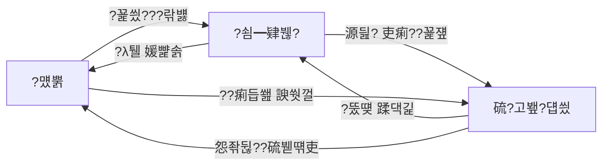

# ECHORIS ?꾨줈?앺듃 鍮꾩쟾 (Project Vision)

## 援ы쁽 ?꾪솴 (Implementation Status)

> **理쒓렐 ?낅뜲?댄듃:** 2026-04-19
> **臾몄꽌 ?곹깭:** `?묒꽦 以?(Draft) ??v2`
> **媛쒖젙 ?ъ쑀:** Phase 1 議몄뾽(DEC-021), 臾닿린 7醫?泥닿퀎(DEC-026), ?뚮젅?댄뀒?ㅽ듃 寃€利? 由ъ꽌移?60+嫄? ?쒖뒪??GDD 40+嫄?寃곌낵 諛섏쁺. 寃뚯엫?뚮젅??鍮꾩쟾(짠5-9) ?좉퇋 ?쎌엯.

---

## 0. ?꾩닔 李멸퀬 ?먮즺 (Mandatory References)

- Game Overview: `Reference/寃뚯엫 湲고쉷 媛쒖슂.md`
- Document Index: `Documents/Terms/Document_Index.md`
- Glossary: `Documents/Terms/Glossary.md`

---

## 1. ?꾨줈?앺듃 ?뺤쓽 (Project Definition)

| ??ぉ       | ?댁슜                                                                             |
| :--------- | :------------------------------------------------------------------------------- |
| ?꾨줈?앺듃紐?| ECHORIS                                                                          |
| ?λⅤ       | ??湲곕컲 ?≪뒪?щ· ?⑤씪???≪뀡 RPG (硫뷀듃濡쒕쿋?덉븘 + ?쇰━肄붾?)                       |
| ?뚮옯??    | ??釉뚮씪?곗? (PC)                                                                 |
| ?€寃??좎?  | ?먰뿕怨??뚮컢??利먭린??肄붿뼱-誘몃뱶肄붿뼱 寃뚯씠癒?                                       |
| ?몄뀡 紐⑺몴  | ?됯퇏 45遺??댁긽                                                                   |
| ?덊띁?곗뒪   | BLAME!/硫붿씠?????대퉬???멸퀎愿€/?ㅼ??? + ?뷀븯???쇱긽怨??먰뿕/?꾪닾) + ?붿뒪媛€?댁븘(?꾩씠?쒓퀎/?쇰━肄붾?) + ?ㅽ렆?곹궎(?덉감???앹꽦) |

### ??以??붿빟 (Elevator Pitch)

> **(DEC-046, 2026-05-24 ?ъ젙??** "嫄곕? 鍮뚮뜑媛€ ?꾨퉬???섏쭅 援ъ“臾쇱쓣 ?먰뿕?섍퀬, 留먯쓣 嫄곕뒗 臾닿린 ?띿쑝濡??ㅼ뼱媛€ ???щ엺???딇?吏??몄깮??蹂듭썝?섎ʼn, ?ㅻⅨ ?뚮젅?댁뼱?€ ?④퍡 ?몄슦???≪뒪?щ· ?⑤씪???≪뀡 RPG"
>
> ?댁쟾 ?뺤쓽??*"?앹뾾??媛뺥솕?섎ʼn"* ??*"???щ엺???딇?吏??몄깮??蹂듭썝?섎ʼn"* 濡??€泥? 媛뺥솕 ?섏쟾 ?뺤껜???먭린 ??DEC-046 / `Documents/System/System_Memory_Core.md` 李몄“.

### 二쇱씤怨?(Protagonist)

| ??ぉ | ?댁슜 |
| :--- | :--- |
| ?대쫫 | ?먮Ⅴ??踰??섑쓲??(Erda ven-Nacht) -- 寃뚯엫 ?꾨컲源뚯? 誘멸났媛?|
| ?뺤껜 | ?뺤껜遺덈챸???ъ꽦. 吏곸뾽?€ 寃⑸꼍 痢〓웾??Bulkhead Surveyor). ?뚮젅?댁뼱??洹몃?媛€ ?꾧뎄?몄?, ???대젮媛€?붿? 紐⑤Ⅸ??|
| ?명삎 | ?ъ꽦, ?섏씠 遺덈챸. 泥?줉 ?묒뾽蹂??ㅻ쾭?? + 二쇳솴 ?욎튂留?+ ?⑹젒 怨좉? + ?곗뾽??遺€痢? 硫붽??ㅽ듃??쿂 嫄곗＜誘쇱쓽 蹂듭옣. ?ㅻⅨ?먯뿉 ??긽 ?먯퐫瑜??ㅺ퀬 ?덈떎 |
| ?먯퐫 (?꾧뎄/臾닿린) | "?먯퐫(Echo)" -- GBE(BLAME!) ?ㅻ쭏二? (1) 寃⑸꼍 愿€??洹좎뿴 ?먯?, (2) ?꾩씠?쒓퀎 吏꾩엯, (3) ?먯냼 ?몄콌?? (4) 媛뺣젰???⑤컻 ?꾪닾 ?€寃? ?뺤껜??理쒖쥌?μ뿉???먮Ⅴ?ㅼ? ?④퍡 諛앺?吏꾨떎 |
| 罹먮┃???덊띁?곗뒪 | ?щ━(BLAME!) -- 怨좊룆???ы뻾?? ?€??洹뱀냼. 紐⑹쟻 ?섎굹留??덈떎 |
| ?쒖궗 諛⑹떇 | ?먮Ⅴ???€??0以? 臾닿린媛€ Ego瑜?媛€吏€怨??먮Ⅴ?ㅼ뿉寃?留먰븳?? ?먮Ⅴ?ㅻ뒗 ?됰룞?쇰줈 ?듯븳??(Transistor Red ?⑦꽩) |
| 媛먯젙 ?듭떖 | "留먰븯吏€ ?딅뒗 ?щ엺怨?留먯쓣 嫄곕뒗 寃€?? ?멸퀎??媛€??源딆? 怨녠퉴吏€ ?대젮媛€???댁빞湲? |

> **?듭떖 ?ㅽ넗由?SSoT:** `Documents/Content/Content_Story_Synopsis.md` (CNT-STR-001) 李몄“.
> **?꾨줈?앺듃 ?대쫫???댁썝쨌?섎? SSoT:** `Documents/Content/Content_Project_Name_Etymology.md` (CNT-NME-001) 李몄“. "Echo + Iris ??the eye that sees the echoes of the past." (Fina, 2026-05-24)

---

## 2. 3?€ 湲곕뫁 (Three Design Pillars)

紐⑤뱺 ?ㅺ퀎 寃곗젙?€ ?ㅼ쓬 3?€ 湲곕뫁 以?理쒖냼 1媛쒖뿉 ?뺣젹?섏뼱???쒕떎. ?대뒓 湲곕뫁?먮룄 ?대떦?섏? ?딅뒗 湲곕뒫?€ ?꾨줈?앺듃???ы븿?섏? ?딅뒗??

### 湲곕뫁 1: 硫뷀듃濡쒕쿋?덉븘 ?먰뿕 (Metroidvania Exploration)

| ??ぉ        | ?뺤쓽                                                                               |
| :---------- | :--------------------------------------------------------------------------------- |
| ?듭떖 ?먰?吏€ | ?먰뿕媛€ -- ?λ젰???섎굹???살쑝硫?媛????녿뜕 怨녹쓣 ?レ뼱 ?멸퀎??鍮꾨???諛앺??몃떎         |
| ?듭떖 寃쏀뿕   | "?€ ?덈꼍 ?꾩뿉 萸붽? 蹂댁씠?붾뜲 ?꾩쭅 紐?媛꾨떎" -> ?λ젰 ?띾뱷 -> "?쒕뵒???щ씪媛????덈떎!" |
| ?ㅺ퀎 ?먯튃   | ?λ젰 寃뚯씠??+ ?ㅽ꺈 寃뚯씠???댁쨷 援ъ“, 鍮꾩꽑???먰뿕, ?щ갑臾?蹂댁긽                      |
| 寃€利?吏덈Ц   | "???쒖뒪?쒖씠 ?щ갑臾??먰뿕 ?숆린瑜?媛뺥솕?섎뒗媛€?"                                       |
| 2-Space     | World                                                                              |

### 湲곕뫁 2: ?꾩씠?쒓퀎 ?쇰━肄붾? (Item World Yarikomi) ??DEC-046 ?ъ젙??

| ??ぉ        | ?뺤쓽                                                                                                          |
| :---------- | :------------------------------------------------------------------------------------------------------------ |
| ?듭떖 ?먰?吏€ | **?뚯긽媛€ (Recoverer)** -- ?꾩씠???띿뿉 ?ㅼ뼱媛€ 100?????딇?吏????щ엺???몄깮??蹂듭썝?쒕떎. 300臾닿린 = 300紐낆쓽 ?몄깮 = Identity Archive??1,200+ 臾몄옣 而щ젆??|
| ?듭떖 寃쏀뿕   | "??痢〓웾?ъ쓽 ?몄깮???앷퉴吏€ 蹂닿퀬 ?띕떎" -> 吏€痢??대━??-> "Fire 紐⑤찘??臾몄옣 ?닿툑" -> "?ㅼ쓬??耳€?대툝 ?대컲???댁빞湲? |
| ?ㅺ퀎 ?먯튃   | ?λ퉬 ?대? ?섏쟾, **Memory Recovery ?쒖뒪??(媛뺥솕 ??蹂듭썝 ?꾪솚)**, ?몃Ъ 而щ젆??Identity Archive), Re-Dive ?낆껜??|
| 寃€利?吏덈Ц   | "???쒖뒪?쒖씠 *?섏튂 ?쇰━肄붾?* 媛€ ?꾨땶 *?쒖궗 ?쇰━肄붾?* ??源딆씠瑜??쒓났?섎뒗媛€?" |
| 2-Space     | Item World                                                                                                    |

> **2026-05-24 蹂€寃?(DEC-046):** "?μ씤" ??"?뚯긽媛€", "湲곗뼲 ?⑦렪 ?щ깷" ??"?딇?吏??몄깮 蹂듭썝", "理쒓컯 ?λ퉬 ?쒖옉" ??"???щ엺???몄깮 ?꾩꽦", "Ancient ?밴툒" ??"吏꾨챸 ?뺤젙". ?붿뒪媛€?댁븘 ?쇰━肄붾? 硫붿빱??梨꾪깮?€ ?먭린.

### 湲곕뫁 3: ?⑤씪??硫€?고뵆?덉씠 (Online Multiplayer)

| ??ぉ        | ?뺤쓽                                                                                      |
| :---------- | :---------------------------------------------------------------------------------------- |
| ?듭떖 ?먰?吏€ | 紐⑦뿕媛€ -- 移쒓뎄?€ ?④퍡 ?앹뾾???ъ뿰???섏쟾???꾩쟾?섍퀬, ?꾧린瑜??④퍡 洹밸났?쒕떎                 |
| ?듭떖 寃쏀뿕   | "?쇱옄??理쒖떖痢?吏€痢?蹂댁뒪瑜?紐??〓뒗?? -> ?뚰떚 援ъ꽦 -> "?깆빱媛€ ?닿렇濡??〓뒗 ?ъ씠???쒗룷?곌? 踰꾪봽!" |
| ?ㅺ퀎 ?먯튃   | ?쇱옄?쒕룄 ?щ??덇퀬 ?④퍡?섎㈃ ???щ??덈뒗 ?ㅺ퀎, ??븷 遺꾨떞, URL 留곹겕 怨듭쑀濡??꾩씠?쒓퀎 吏곸젒 ?⑸쪟 |
| 寃€利?吏덈Ц   | "???쒖뒪?쒖씠 ?쇱옄?쒕룄 ?щ??덇퀬 ?④퍡?섎㈃ ???щ??덈뒗媛€?"                                   |
| 2-Space     | Item World (1-2??Phase 3, 理쒕? 4??Phase 4+)                                            |

### 湲곕뫁 媛??곹샇 媛뺥솕 (Pillar Synergy)


```mermaid
graph LR
    EXPLORE[?먰뿕] -->|?꾩씠???띾뱷| YARIKOMI[?쇰━肄붾?]
    YARIKOMI -->|?λ퉬 媛뺥솕| EXPLORE
    YARIKOMI -->|源딆? 吏€痢??꾩쟾| MULTI[硫€?고뵆?덉씠]
    MULTI -->|?뚰떚 蹂댁긽| YARIKOMI
    EXPLORE -->|??痢듭쐞 諛쒓껄| MULTI
    MULTI -->|怨좎뒪??硫붿떆吏€| EXPLORE
```

- **?먰뿕 -> ?쇰━肄붾?:** ?붾뱶?먯꽌 ?띾뱷???꾩씠?쒖씠 ?꾩씠?쒓퀎 吏꾩엯???뚯옱
- **?쇰━肄붾? -> ?먰뿕:** ?꾩씠?쒓퀎?먯꽌 媛뺥솕???λ퉬???ㅽ꺈???붾뱶???ㅽ꺈 寃뚯씠?몃? ?닿툑
- **?쇰━肄붾? -> 硫€??** 源딆? 吏€痢듭? ?뚰떚 ?뚮젅?대줈 ?ㅺ퀎
- **硫€??-> ?쇰━肄붾?:** ?뚰떚 ?대━????蹂댁긽 蹂대꼫??
- **?먰뿕 -> 硫€??** ?붾뱶??怨좎뒪??硫붿떆吏€(鍮꾨룞湲?硫€??
- **硫€??-> ?먰뿕:** 2???묐룞 ?먰뿕 ???꾩슜 ?쇱쫹/蹂댁긽

---

## 3. 2-Space 遺꾨━ 紐⑤뜽 (?붾뱶 + ?꾩씠?쒓퀎)

寃뚯엫 ?멸퀎瑜?2媛?怨듦컙?쇰줈 遺꾨━?섏뿬, 媛?怨듦컙??怨좎쑀??洹쒖튃怨?紐⑹쟻??媛뽯룄濡??ㅺ퀎?쒕떎. ??遺꾨━媛€ "硫뷀듃濡쒕쿋?덉븘???먰뿕媛?怨?"?⑤씪??硫€?고뵆?덉씠"媛€ ?묐┰?섎뒗 ?듭떖 ?대쾿?대떎.

| ??ぉ        | ?붾뱶 (World)                                    | ?꾩씠?쒓퀎 (Item World)           |
| :---------- | :---------------------------------------------- | :------------------------------ |
| ?듭떖 紐⑹쟻   | ?먰뿕, ?λ젰 ?띾뱷, ?ㅽ넗由? ?€?κ컙/?곸젏 (?몄씠釉??ъ씤?? | ?꾩씠??媛뺥솕, ?쇰━肄붾?           |
| ?몄썝        | ?붾줈(1??                                       | 1-2??(Phase 3) / 理쒕? 4??(Phase 4+) |
| 留??좏삎     | ?몃뱶?щ옒?꾪듃 + ?덉감???쇳빀                      | ?꾩쟾 ?덉감???앹꽦                |
| 吏꾪뻾 諛⑹떇   | ?λ젰 寃뚯씠??(硫뷀듃濡쒕쿋?덉븘)                      | 吏€痢??대━??(?덉뼱由ы떚蹂?2-4 吏€痢? |
| ?щ쭩 ?섎꼸??| ?몄씠釉??ъ씤??蹂듦?                              | 吏꾪뻾 吏€痢??먯떎                    |
| 怨좎쑀 ?먯썝   | ?λ젰 ?먮┃, 留??곗씠?? ?붾뱶 ?뚯옱                 | 湲곗뼲 ?⑦렪, ?꾩씠??EXP, ?덈꺼 援ъ뒳 |
| 湲곕뫁 ?뺣젹   | ?먰뿕                                            | ?쇰━肄붾? + 硫€?고뵆?덉씠           |

### ??2-Space?멸??

| 臾몄젣                                                 | ?대쾿                                                                |
| :--------------------------------------------------- | :------------------------------------------------------------------ |
| 硫뷀듃濡쒕쿋?덉븘???먰뿕媛먭낵 ?⑤씪??硫€?곌? ?묐┰ 媛€?ν븳媛€? | ?붾뱶??媛쒖씤 ?먰뿕(?붾줈), ?꾩씠?쒓퀎???묐룞(1-2?? URL 留곹겕 ?⑸쪟)       |
| ?쇰━肄붾?(臾댄븳 ?뚮컢)媛€ ?먰뿕??媛€移섎? ?쇱넀?섏? ?딅뒗媛€? | ?쒗솚 援ъ“: ??源딆? ?꾩씠?쒓퀎瑜??꾪빐 ???볦? ?붾뱶瑜??먰뿕?댁빞 ??      |

---

## 4. ?쒗솚 援ъ“ (Core Loop)

```mermaid
graph TD
    A[?붾뱶 ?먰뿕] -->|?꾩씠???띾뱷| B[?꾩씠?쒓퀎 吏꾩엯]
    B -->|吏€痢??대━?? C[?λ퉬 媛뺥솕]
    C -->|湲곗뼲 ?⑦렪 ?섏쭛| D[?λ퉬 ?ㅽ꺈 ?곸듅]
    D -->|?ㅽ꺈 寃뚯씠???닿툑| E[??痢듭쐞 ?묎렐]
    E -->|???꾩씠??諛쒓껄| A

    A -->|蹂댁뒪 泥섏튂| F[?λ젰 ?먮┃ ?띾뱷]
    F -->|?λ젰 寃뚯씠???닿툑| E
```

### 3?④퀎 猷⑦봽 援ъ“ (Micro/Meso/Macro)

| 猷⑦봽 | 二쇨린 | ?듭떖 ?됰룞 | 蹂댁긽 |
| :--- | :--- | :--- | :--- |
| **留덉씠?щ줈** (?꾪닾) | 5-30珥?| ??泥섏튂, 肄ㅻ낫 ?꾩꽦, ?뚰뵾 | ?쒕엻, EXP, ?덊듃?ㅽ깙 苡뚭컧 |
| **硫붿“** (吏€痢?援ъ뿭) | 5-15遺?| 吏€痢??대━?? 蹂댁뒪 泥섏튂 | ?곴뎄 ?ㅽ꺈 蹂대꼫?? 湲곗뼲 ?⑦렪, ?덉뼱由ы떚 ?밴툒 湲고쉶 |
| **留ㅽ겕濡?* (吏꾪뻾) | 1-10?쒓컙 | ?ㅽ꺈 寃뚯씠???뚰뙆, ??痢듭쐞 ?꾨떖 | ??諛붿씠?? ?λ젰 ?먮┃, ?쒖궗 ?⑦렪 |

### ?쒗솚 ?숇젰 遺꾩꽍

| ?쒗솚 ?붿냼              | ?숇젰                            | ?④낵               |
| :--------------------- | :------------------------------ | :----------------- |
| ?붾뱶 -> ?꾩씠?쒓퀎       | ???λ퉬 ?띾뱷, ??媛뺥븳 ?λ퉬 ?꾩슂 | ?꾩씠?쒓퀎 吏꾩엯 ?숆린 |
| ?꾩씠?쒓퀎 -> ?λ퉬 媛뺥솕  | 吏€痢??대━?? 湲곗뼲 ?⑦렪 ?섏쭛      | ?뚮컢/?쇰━肄붾? 留뚯” |
| ?λ퉬 媛뺥솕 -> ?붾뱶      | ?ㅽ꺈 寃뚯씠???닿툑                | ??痢듭쐞 ?먰뿕 ?숆린  |
| ?붾뱶 ?먰뿕 -> ?λ젰 ?띾뱷 | 蹂댁뒪 泥섏튂, ?먮┃ 諛쒓껄            | ?대룞 踰붿쐞 ?뺣?     |

### ?댁쨷 寃뚯씠??(Dual Gate)

?붾뱶 吏꾪뻾?€ **?λ젰 寃뚯씠??*?€ **?ㅽ꺈 寃뚯씠??* ??媛€吏€ 異뺤쑝濡??쒖뼱?쒕떎.

| 寃뚯씠???좏삎 | ?닿툑 議곌굔             | ??븷                                                   |
| :---------- | :-------------------- | :----------------------------------------------------- |
| ?λ젰 寃뚯씠??| 蹂댁뒪 泥섏튂 / ?먮┃ 諛쒓껄 | ?꾪넻??硫뷀듃濡쒕쿋?덉븘 吏꾪뻾 (?대떒 ?먰봽, 踰??€湲? 蹂€???? |
| ?ㅽ꺈 寃뚯씠??| ?λ퉬 ?ㅽ꺈 ?꾨떖        | ?꾩씠?쒓퀎 ?쇰━肄붾??€ ?붾뱶 ?먰뿕???곌껐?섎뒗 ?듭떖 怨좊━     |

?ㅽ꺈 寃뚯씠?몄쓽 議댁옱媛€ ??寃뚯엫???낆갹???붿냼?대떎. ?λ젰 寃뚯씠?몃쭔?쇰줈??"硫뷀듃濡쒕쿋?덉븘 ?대줎"???섍퀬, ?ㅽ꺈 寃뚯씠?멸? ?덉뼱??"?꾩씠?쒓퀎?먯꽌 ?λ퉬瑜?媛뺥솕???숆린"媛€ ?앷릿??

---

## 5. ?붾뱶 援ъ“ & ?덈꺼 ?붿옄??(World Structure & Level Design)

> **?곸꽭 紐낆꽭:** `Documents/System/System_World_MapStructure.md`
> **湲곕뫁 ?뺣젹:** ?먰뿕 (二?, ?쇰━肄붾? (遺€)

### ?ㅺ퀎 泥좏븰

> "?멸퀎???λ젰蹂대떎 癒쇱? 議댁옱?쒕떎. ?뚮젅?댁뼱媛€ ?λ젰???산린 ?꾩뿉, 洹??λ젰???꾩슂???μ냼瑜??대? 蹂댁븯?댁빞 ?쒕떎."
> -- Hollow Knight ?먯튃

ECHORIS???붾뱶??**?€怨듬룞(The Shaft)**?대씪 遺덈━??嫄곕????섏쭅 援ъ“臾쇱씠?? 嫄곕? 鍮뚮뜑(Giant Builder)媛€ ?꾩옱???멸퀎瑜??꾨퉬硫?援ъ“臾쇱쓣 蹂€?뺤떆?ㅺ퀬 ?덈떎. ?먮Ⅴ?ㅻ뒗 以묒븰 ?깆콈(Tier 2)?먯꽌 異쒕컻?섏뿬, ?ъ뿰 ?꾩웳???곹쓷???⑥? 7媛?痢듭쐞瑜??꾨옒濡??섍컯?쒕떎. ???대젮媛€?붿????뚮젅?댁뼱?먭쾶 ?ㅻ챸?섏? ?딅뒗??-- ?먮Ⅴ?ㅼ쓽 ?됰룞留뚯씠 ?⑥꽌??

### 7媛?痢듭쐞 (Vertical Descent)

```
  [?앺깭 援ъ뿭 + ?€?κ컙] (吏꾩엯 ?쒗€€??
     |
  ?뚢??€?€?€?€?€?€?€?€?€?€?€?€?€?€?€?€?€?€?€?€?€?€?€?€?€?€?€?€?€?€?€?€?€?€?€?€?€?€?€?€?€??
  ?? Tier 2: 以묒븰 ?깆콈 / Concordia -- HUB    ??
  ?? (?몄씠釉??ъ씤?? ?€?κ컙, NPC, ?곸젏)       ??
  ?붴??€?€?€?€?€?€?€?€?€?€?€?€?€?€?€?€?€?€?€?€?€?€?€?€?€?€?€?€?€?€?€?€?€?€?€?€?€?€?€?€?€??
     |
  ?€?€ 寃⑸꼍 1: ?대떒 ?먰봽 (Double Jump) ?€?€
     |
  Tier 3: 湲곕줉 移⑥쟾??/ Necropolis
     |
  ?€?€ 寃⑸꼍 2: 踰??€湲?(Wall Climb) ?€?€
     |
  Tier 4: 吏€???섎줈 / Veinway
     |
~~  ?€?€ 寃⑸꼍 3: ?덇컻 蹂€??(Mist Form) ?€?€~~ **DEPRECATED 2026-05-18 (?덇컻 蹂€???먭린 ??SotN 移댄뵾)**
     |
  Tier 5: ?곌뎄???먰뿀 / Memoria Arcana
     |
  ?€?€ 寃⑸꼍 4: ?섏쨷 ?명씉 (Water Breathing) ?€?€
     |
  Tier 6: 鍮숆껐 蹂댁〈??/ Cryo-Archive
     |
  ?먥븧 ?€寃⑸꼍 (Great Bulkhead) ?먥븧
     |
  Tier 7: ?ъ뿰??援?/ Abyss Sphere

  ?€?€ ?꾨컲遺€ ??쨷???닿툑 ?€?€
     |
  Tier 1: 泥쒓났???뺤썝 / Canopy (?곸듅 寃쎈줈)
```

### ?덈꺼 ?붿옄???먯튃

| ?먯튃 | ?ㅻ챸 | 洹쇨굅 |
| :--- | :--- | :--- |
| ?섏쭅 泥숈텛 + ?〓갑??媛€吏€ | 痢듭쐞 媛??대룞?€ ?섏쭅 ?좏삎, 媛?痢듭쐞 ?대???醫뚯슦 硫뷀듃濡쒕쿋?덉븘 ?먰뿕 | ?섏쭅 ?섍컯??湲댁옣媛먭낵 鍮꾩꽑???먰뿕 ?먯쑀?꾨? ?묐┰ |
| ?몃뱶?щ옒?꾪듃 ?쒕뱶留덊겕 + ?덉감??Chunk | 蹂댁뒪諛??쒖궗 ?ㅻ툕?앺듃??怨좎젙, Room ?대? Chunk留??덉감??蹂€??| ??궗???μ냼媛먯쓣 ?좎??섎㈃???щ갑臾??좎꽑???뺣낫 |
| ?꾨뱶 ?쒕떒 諛곗튂 | 媛?痢듭쐞???쒕떒(?먯퐫濡?臾닿린瑜??먮뱶???꾩씠?쒓퀎 吏꾩엯)??諛곗튂 | ?먰뿕 ?꾩쨷 ?먯뿰?ㅻ윭???꾩씠?쒓퀎 吏꾩엯 ?숆린 ?쒓났. ?쒗솚 援ъ“??臾쇰━???곌껐??|
| 援먯닔 ??Teaching Pair) | 寃뚯씠??臾몄젣)?€ ?대떟?€ ?쒖빞媛??덉뿉 ?④퍡 諛곗튂?섍굅??UI媛€ ?대떟 ?꾩튂瑜?媛€由ы궡 (DEC-025) | 2026-04-17 ?뚮젅?댄뀒?ㅽ듃: 寃뚯씠?몄? ?대떟??遺꾨━?섎㈃ "?⑹튂媛? 諛쒖깮 |
| 寃⑸꼍 湲곕컲 ?λ젰 寃뚯씠??| 痢듭쐞 媛?寃쎄퀎??臾쇰━??寃⑸꼍??諛곗튂. ?뱀젙 ?λ젰 ?놁씠???섍컯 遺덇? | 硫붽??ㅽ듃??쿂 ?멸퀎愿€??寃뚯씠?몃? ?먯뿰?ㅻ읇寃??뺣떦??|

### ?먮Ⅴ?ㅼ쓽 媛먯젙 ?꾪겕?€ 痢듭쐞 ?섍컯

媛?痢듭쐞???⑥닚??諛붿씠?댁씠 ?꾨땲???ъ뿰 ?꾩웳(Era 3)???곹쓷???⑥? ??궗???μ냼?? ?먮Ⅴ?ㅻ뒗 怨쇰У?섍쾶 ?섍컯?섍퀬, 寃€???뚮줈 留먯쓣 嫄대꽙?? 痢듭쐞媛€ 源딆뼱吏덉닔濡??섍꼍 ?먯껜媛€ ?댁빞湲고븳??

- **T2-T3:** 鍮꾧탳???덉쟾???곸뿭. ?먮Ⅴ?ㅼ쓽 ?됰룞?먯꽌 ?쇱긽??痢〓웾 ?묒뾽???곗옣?좎씠 ?먭뺨吏꾨떎
- **T4-T5:** 援ъ“臾쇱쓽 ?곹쓷???ы빐吏꾨떎. ?꾩씠???대???湲곗뼲???댁쟾 二쇱씤???띠쓣 蹂댁뿬二쇨린 ?쒖옉
- **T6-T7:** ?ъ뿰??媛€源뚯썙吏덉닔濡?援ъ“臾쇱씠 蹂€?뺣맂?? ?먮Ⅴ?ㅼ쓽 ?섍컯 紐⑹쟻???섍꼍 ?⑥꽌濡??쒕윭?쒕떎
- **T1 (諛섏쟾):** ?꾨컲遺€ ?곸듅. ?뺤긽?먯꽌 ?멸퀎瑜??대젮?ㅻ낫硫??쒖빞 ?뺤옣

---

## 6. ?λ퉬 & 300臾닿린 鍮꾩쟾 (Equipment & 300 Weapons Vision)

> **?곸꽭 紐낆꽭:** `Documents/System/System_Combat_Weapons.md`, `Documents/System/System_Equipment_Slots.md`, `Documents/System/System_Equipment_Growth.md`
> **由ъ꽌移?** `Documents/Research/WeaponDiversity_300Weapons_Research.md`, `Documents/Research/ItemTypes_FullSurvey_Research.md`
> **湲곕뫁 ?뺣젹:** ?쇰━肄붾? (二?, ?먰뿕 (遺€), 硫€?고뵆?덉씠 (遺€)

### ?ㅺ퀎 泥좏븰

> "300媛쒖쓽 臾닿린媛€ ?덉쑝硫? 300媛쒖쓽 ?뚮젅???ㅽ??쇱씠 ?덉뼱???쒕떎."
> "臾닿린 ?섎굹瑜?怨좊Ⅴ???쒓컙, 洹??뚮젅?댁뼱???꾪닾 ?몄뼱媛€ 寃곗젙?쒕떎."

臾닿린??ATK ?섏튂 而⑦뀒?대꼫媛€ ?꾨땲?? 移댄뀒怨좊━媛€ ?꾪닾 由щ벉?? ?쒓렇?덉쿂 硫붿빱?됱씠 ?ъ??붾떇 ?꾨왂?? ?⑥떆釉뚭? 鍮뚮뱶 ?ㅼ뼇?깆쓣 寃곗젙?쒕떎.

### 7醫?臾닿린 泥닿퀎 (DEC-026)

洹쇱젒 5醫??ш굅由촼?띾룄 5遺꾪븷) + ?먭굅由?2醫?臾쇰━/?뚮룞 異?遺꾪솕):

| 臾닿린 | ?€??| ?쒓렇?덉쿂 硫붿빱??| ?듭떖 ?먰?吏€ | ?ㅼ??쇰쭅 |
| :--- | :--: | :--- | :--- | :--- |
| **Blade** (?⑥“ 怨듬갑 ?쒖넀 ?덉궘湲? | 3 | 3?€ ?쇰땲??媛뺥솕 | ?ъ? ?딄퀬 踰좊㈃ ?먯젏 媛뺥빐吏€???⑥“ ?μ씤 | ATK |
| **Cleaver** (寃⑸꼍 ?뚯뇙?? | 2 | 80px ?꾨갑 異⑷꺽??| ??諛⑹씠 紐⑤뱺 寃껋쓣 寃곗젙?섎뒗 寃⑸꼍 ?뚯뇙??| ATK |
| **Shiv** (?멸낵 ?⑤룄) | 4 | 諛고썑 媛뺥? x3.0 | 洹몃┝?먯뿉???섑???湲됱냼瑜?李뚮Ⅴ???붿궡??| ATK |
| **Harpoon** (鍮뚮뜑 由щ컮 ?μ갹) | 3 | 愿€??理쒕? 3泥?| 癒?嫄곕━???곸쓣 ??以꾨줈 轅곕슟???묒궡袁?| ATK |
| **Chain** (媛뺤쿋 ?ъ뒳) | 3 | ?앸떒 12px ?덊듃 x2.0 | ?ъ뒳 ?앹뿉 ?④꺼吏?移섎챸???쇨꺽???щ깷袁?| ATK |
| **Railbow** (?꾩옄湲?媛€???ъ쿃湲? | 3 | ?€?????뺥솗??100% + x1.2 | 移댁씠???룹쑝濡??덉쟾 嫄곕━?먯꽌 ?쒖쓣 ?볥뒗 ?€寃⑹닔 | ATK |
| **Emitter** (?뚮룞 諛⑹텧 ?λ퉬) | 3 | ?몄콌???④낵 x1.5, INT ?ㅼ??쇰쭅 | ?먯냼???섏쓣 利앺룺?섎뒗 ?뚮룞 ?곌뎄??| INT (?좎씪) |

### 300臾닿린 ?뺤옣 援ъ“

| 遺꾨쪟 | ?섎웾 | ?ㅻ챸 | ?쒕엻 諛⑹떇 |
| :--- | ---: | :--- | :--- |
| **?쇰컲 臾닿린** | 278 | ?덉뼱由ы떚 濡?(Normal-Ancient), 7異??⑥떆釉??꾨젅?꾩썙??| ?꾩씠?쒓퀎/?붾뱶 ?쒕엻 |
| **濡쒖뼱 臾닿린** | 22 | ?몃뱶 ?뚮젅?댁뒪癒쇳듃, 怨좎젙 ?덉뼱由ы떚, ?섎뱺留??ㅽ???諛곗튂 | ?붾뱶 ?뱀젙 ?꾩튂???섏옉??諛곗튂 |

**7異??⑥떆釉??꾨젅?꾩썙??(A-G):**

| 異?| ?대쫫 | 鍮꾩쑉 | ?덉떆 |
| :--- | :--- | :--: | :--- |
| A | ?щ━?곗뺄 | 18% | 移섎챸?€??+N%, 移섎챸?€ ??HP ?뚮났 |
| B | ?⑦옕 | 21% | 怨듦꺽 ?곸쨷 ???붿뿼 諛⑹텧, 鍮숆껐 ?뺣쪧 |
| C | ?곹깭蹂€??| 12% | ?곹깭?댁긽 ??怨듦꺽 ??異붽? ?곕?吏€ |
| D | ?щ낫?덉뒪 | 8% | 泥섏튂 ??ATK +N (3珥?, ?곗뇙 泥섏튂 蹂댁긽 |
| E | 肄ㅻ낫 | 19% | N?€ ?꾩꽦 ??異⑷꺽?? 肄ㅻ낫 ?좎? 蹂대꼫??|
| F | ?대룞 | 12% | ?€????怨듦꺽 媛뺥솕, 怨듭쨷 怨듦꺽 踰붿쐞 利앷? |
| G | ?섍꼍/?€ | 10% | ?뚰떚??洹쇱쿂 ??ATK ?곸듅, 諛붿씠???곸쓳 |

> B(?⑦옕)/E(肄ㅻ낫)/A(?щ━?곗뺄)??58%瑜?李⑥??쒕떎. ?뚮젅?댁뼱媛€ 媛€??泥닿컧?섎뒗 異뺤뿉 吏묒쨷.

**濡쒖뼱 臾닿린 22醫?-- ?몃뱶 ?뚮젅?댁뒪癒쇳듃:**
Archived note: DEC-023 weapon lore CSV/runtime path was retired. Existing lore markdown lives under `Documents/Content/_archive/LoreWeapons_DEC023/` and is no longer part of the runtime data pipeline.

**Phase蹂?臾닿린 濡쒕뱶留?**

| Phase | 臾닿린 ??| 珥덉젏 |
| :--- | ---: | :--- |
| Phase 2 (?뚰뙆) | 5 | Blade MVP 5醫?|
| Phase 3 (踰좏?) | 100 | MVP(star) ?⑥떆釉??€ |
| Phase 4 (?곗묶) | 300 | ?뺤옣(star) ?ы븿, 蹂댁뒪 臾닿린 16醫?|
| Phase 4+ (?쒖쫵) | 500+ | PoE ?ㅽ????쒖쫵 ?낅뜲?댄듃 |

### ?λ퉬 10?щ’ 泥닿퀎 (DEC-026)

| 移댄뀒怨좊━ | ?щ’紐?| ?멸퀎愿€ ?댁꽍 |
| :--- | :--- | :--- |
| 臾닿린 | weapon + sub_weapon | 二쇰Т湲?+ 蹂댁“臾닿린 |
| 諛⑹뼱援?| **Visor / Plate / Gauntlet / Greaves / Rig** | Rig = 諛곕㈃ ?μ갑 紐⑤뱢 (Cloak?먯꽌 由щ꽕?대컢) |
| ?μ떊援?| **Sigil x2 / Seal x1** | Sigil = 鍮뚮뜑 臾몄뼇 ?몄옣, Seal = ?곸쐞 鍮뚮뜑 沅뚰븳 遊됱씤泥?|

### ?λ퉬 蹂듭썝 ?⑥씪 異?(DEC-046 ?ъ젙??

> **(DEC-046, 2026-05-24)** "?λ퉬???쒕엻???쒓컙???꾨땲?? ?뚮젅?댁뼱媛€ 吏곸젒 ?꾩씠???????щ엺???몄깮???앷퉴吏€ 蹂듭썝???쒓컙??蹂몃옒???섏씠 源⑥뼱?쒕떎."
>
> ?댁쟾??*3異??깆옣 (?덈꺼 / 蹂댁뒪 蹂대꼫??/ ?덉뼱由ы떚 ?밴툒)* ?€ ?먭린. **?⑥씪 吏꾪뻾 寃뚯씠吏€ Memory Recovery (0-100%)** 濡??듯빀.

| 異?| 硫붿빱??| ?숇젰 |
| :--- | :--- | :--- |
| **Memory Recovery (0-100%)** | 蹂댁뒪 泥섏튂 ??25% ?⑥쐞 ?먰봽 + ?쇰컲 ?쒕룞 ?먯쭊 ?꾩쟻 | "???щ엺???ㅼ쓬 ?섏씠吏€瑜?蹂닿퀬 ?띕떎" |
| **?대쫫 吏꾪솕 (5 Stage)** | Recovery ?④퀎???곕씪 ?대쫫??蹂€?? Unknown ??Survey Tool ??Guild Survey Tool ??The Last Wedge ??Surveyor's Echo Wedge | "?뺤껜瑜?諛앺??몃떎" |
| **Memory Fragment 而щ젆??* | 蹂댁뒪 泥섏튂 ????臾몄옣???곴뎄 ?닿툑. Identity Archive???깅줉 | "?ㅼ쓬 ?몃Ъ???댁빞湲곕? 蹂닿퀬 ?띕떎" |

?ㅽ꺈 怨듭떇 (DEC-046): `effectiveStat = baseStat 횞 (0.4 + Recovery 횞 0.006) 횞 rarityMultiplier 횞 (1 + reDive 횞 0.05)`

> ?먭린????ぉ: ?꾩씠???덈꺼 0-99, ?꾩씠??EXP, 蹂댁뒪 ?곴뎄 ATK +N, ?덉뼱由ы떚 ?밴툒 (?쇳떚), Memory Shard 5??湲곗쭏 ?⑦렪 ?쒖뒪??

### Memory Fragment + Identity Trait ?쒖뒪??(DEC-046)

> **2026-05-24 蹂€寃?** ?댁쟾??"湲곗뼲 ?⑦렪 (Memory Shard) ??atk/def/hp 蹂대꼫?? Wild/Subdued ?꾪솚, 5??湲곗쭏" 硫붿빱?됱? ?먭린. 紐⑤뱺 蹂댁뒪 蹂댁긽?€ **Memory Fragment (??臾몄옣)** ?€ **Identity Trait (?뺤껜??寃? ?⑦렪 ?④낵)** ??臾띠쓬?쇰줈 ?듯빀.

| 遺꾨쪟 | 湲곕뒫 | ?띾뱷 |
| :--- | :--- | :--- |
| **Memory Fragment (臾몄옣)** | Identity Archive???곴뎄 ?깅줉?섎뒗 ??臾몄옣. 蹂댁긽??*?쒖궗?? 蹂몄껜 | ?꾩씠?쒓퀎 吏€痢?蹂댁뒪 泥섏튂 ??1媛쒖뵫 |
| **Identity Trait (?뺤껜??寃?** | Fragment??洹€?띾맂 臾닿린??蹂몄쭏???④낵. 臾닿린??紐⑤뱺 ?ㅽ궗쨌?④낵??寃곗쓽 ??| Fragment ?닿툑 利됱떆 ?먮룞 媛€??|
| **Network Fragment (愿€怨??⑦렪)** | ???몃Ъ 紐⑤몢 100% 蹂듭썝 ???닿툑?섎뒗 ???щ엺??愿€怨?1李??먮즺 | ?몃Ъ 移댄뀒怨좊━ 100% 蹂듭썝 |
| **Re-Dive Fragment** | 媛숈? ?몄깮???ㅻⅨ ?댁꽍 ?⑦렪 | 100% Recovery ???ъ쭊????|

> ?먭린: atk/def/hp 湲곗뼲 ?⑦렪 3醫? 5??湲곗쭏 (Forge/Iron/Rust/Spark/Shadow), Active/Passive ?щ’ ??븷, ?⑦렪 ?꾩씠/?⑹꽦/遺꾪빐.

### ?덉뼱由ы떚 泥닿퀎

| ?깃툒      | ?됱긽         | ?ㅽ꺈 諛곗쑉 | 湲곗뼲 ?⑦렪 ?щ’ | ?꾩씠?쒓퀎 吏€痢???|
| :-------- | :----------- | :-------: | :-----------: | :---: |
| Normal    | ?곗깋 #FFFFFF | x1.0      | 2             | 2 |
| Magic     | ?뚮? #6969FF | x1.3      | 3             | 3 |
| Rare      | ?몃? #FFFF00 | x1.7      | 4             | 3 |
| Legendary | 二쇳솴 #FF8000 | x2.2      | 6             | 4 |
| Ancient   | 珥덈줉 #00FF00 | x3.0      | 8             | 4 + ?ъ뿰 |

---

## 7. ??& 蹂댁뒪 ?앺깭怨?(Enemy & Boss Ecosystem)

> **?곸꽭 紐낆꽭:** `Documents/System/System_Enemy_BossDesign.md`, `Documents/Research/EnemyDesign_MobArchetype_Research.md`
> **湲곕뫁 ?뺣젹:** ?먰뿕 (二?, ?쇰━肄붾? (遺€)

### ?ㅺ퀎 泥좏븰

> "吏€痢듭씠 源딆뼱吏덉닔濡??꾪궎?€?낆쓣 異붽??섏? ?딄퀬 議고빀?쒕떎."
> "泥섏쓬 留덉＜爾ㅼ쓣 ???뺣룄?뱁븯怨? ??踰?留뚮굹硫??⑦꽩??蹂댁씠怨? 泥섏튂?섎뒗 ?쒓컙 ??議댁옱媛€ ???ш린 ?덉뿀?붿?瑜??댄빐?쒕떎."

???섎웾 利앷?蹂대떎 ?꾪궎?€??議고빀 蹂€?붽? ?쒖씠?꾩쓽 ?듭떖 ?쒕떇 ?섎떒?대떎. Dead Cells ?덊띁?곗뒪: 諛?1媛쒕떦 3-7媛??? ?쒖씠?꾨뒗 ??count)蹂대떎 議고빀(composition)?쇰줈 議곗젅.

### ?쇰컲 ???꾪궎?€??(9醫?

| ?꾪궎?€??| ?꾪삊 異?| ?뚮젅?댁뼱?먭쾶 媛€瑜댁튂??寃?|
| :--- | :--- | :--- |
| 洹쇱젒 ?뚭꺽??| ?섑룊 怨듦컙 愿€由?| 嫄곕━ ?좎?, 肄ㅻ낫 ?€?대컢 |
| ?먭굅由??ш꺽??| ?꾪룓/?대룞 媛뺤젣 | ?곗꽑?쒖쐞 ?먮떒 |
| 諛⑹뼱/諛⑺뙣??| 痢〓㈃ 怨듦꺽 ?꾩슂 | ?ъ??붾떇, 諛고썑 媛뺥?(Shiv ?뱁솕) |
| 鍮꾪뻾??| ?섏쭅 怨듦컙 ?쒖꽦??| 怨듭쨷 ?꾪닾, ?먰봽 怨듦꺽 |
| 援곗쭛??| ?먯썝 ?뚮퉬 媛뺤젣 | AoE ?쒖슜, 踰붿쐞 臾닿린 媛€移?|
| ?섎━?명삎 | ?꾧린 怨좎“ | ?⑦꽩 ?쎄린 ?숇떖 |
| ?먰룺??| 利됯컖 諛섏쓳 媛뺤젣 | ?곗꽑 泥섎━ ?먮떒 |
| ?뚰솚??| 吏€?띿쟻 ?뺣컯 | ?뚯뒪 ?곗꽑 泥섎━ |
| ?섍꼍 ?곕룞??| 吏€???몄떇 | 吏€???쒖슜 ?꾪닾 |

### 議곗슦 吏꾪뻾 (吏€痢듬퀎)

| 吏€痢?| 援ъ꽦 ?먯튃 | ?덉떆 |
| :--- | :--- | :--- |
| 吏€痢?1 | ?꾪궎?€??怨좊┰ ?꾩엯. 媛곴컖 ?⑤룆?쇰줈 ?깆옣 | ?뚭꺽??3留덈━ |
| 吏€痢?2 | 2醫?議고빀 ?쒖옉 | ?뚭꺽??2 + ?ш꺽??1 |
| 吏€痢?3 | 3醫??댁긽 議고빀 + ?섎━???쇳빀 | ?뚭꺽??1 + 鍮꾪뻾??2 + ?섎━??1 |
| 吏€痢?4+ (?ъ뿰) | ???꾪궎?€??議고빀 + ?섍꼍 ?곕룞 | 援곗쭛 + ?뚰솚 + ?섍꼍 ?곕룞 |

### ?붾뱶 蹂댁뒪 (12醫?

**吏꾪뻾 蹂댁뒪 6醫?* -- 媛?痢듭쐞 1媛? 蹂댁뒪 = ?ъ뿰 ?꾩웳???댁븘?덈뒗 利앹뼵?? 泥섏튂 ???λ젰 ?먮┃ ?쒕엻.

| 痢듭쐞 | 蹂댁뒪紐?| 遺꾨쪟 | ?λ젰 寃뚯씠??蹂댁긽 |
| :--- | :--- | :--- | :--- |
| T3 湲곕줉 移⑥쟾??| ?섑샇?⑥쓽 ?붿쁺 | 1:1 ?€??| ?대떒 ?먰봽 ?닿툑 |
| T4 ?섎줈 | ?섎줈???뚯닔袁?| 湲곕? 蹂댁뒪 | 踰??€湲??닿툑 |
| T5 ?곌뎄??| ??＜???ㅽ뿕泥?| 3?섏씠利??€??| ?덇컻 蹂€???닿툑 | **DEPRECATED 2026-05-18 (?덇컻 蹂€???먭린 ??SotN 移댄뵾)**
| T6 鍮숆껐 | ?됰룞 ?섑샇??| ?€??怨좎젙 | ?섏쨷 ?명씉 ?닿툑 |
| T1 泥쒓났 | 愿€痢≪쓽 ??| 湲곕?+援곗껜 | ??쨷???닿툑 |
| T7 ?ъ뿰 | 移댁뿕 ?ㅻⅤ?ㅼ쓽 湲곗뼲 | 4?섏씠利?理쒖쥌 | -- (?붾뵫) |

**?④꺼吏?蹂댁뒪 6醫?* -- Critical Path ???먰뿕 蹂댁긽. 吏꾪뻾 蹂댁뒪蹂대떎 ?믪? ?쒖씠?? 怨좎쑀 ?꾩씠???쒕엻.

### ?꾩씠?쒓퀎 蹂댁뒪 (4?깃툒)

| ?깃툒 | 異쒗쁽 議곌굔 | ?쒖씠??| 蹂댁긽 |
| :--- | :--- | :--- | :--- |
| ?꾩씠???κ뎔 | 吏€痢?2 留덉?留?諛?| Normal 湲곗? | EXP 蹂대꼫?? ?ㅽ꺈 ?곴뎄 +1 |
| ?꾩씠????| 吏€痢?3 留덉?留?諛?| ?κ뎔??1.5諛?| 湲곗뼲 ?⑦렪 ?щ’ +1, ?ㅽ꺈 ?곴뎄 +3 |
| ?꾩씠????| 吏€痢?4 留덉?留?諛?| ?뺤쓽 2諛?| ?밴툒 ?щ즺, ?ㅽ꺈 ?곴뎄 +5 |
| ?꾩씠???€??| ?ъ뿰 理쒖떖痢?| ?좎쓽 3諛?| Ancient ?꾩슜 Anchor ?⑥뒪 |

### 湲곗뼲 ?⑦렪 (?쇱깮)

?꾩씠?쒓퀎 吏€痢듭뿉??議곗슦?섎뒗 ?쇱깮 湲곗뼲 ?⑦렪???꾪닾 ?€?곸씠硫댁꽌 蹂댁긽?대떎. ?꾩＜???됰룞 ?⑦꽩: ?뚮젅?댁뼱瑜?媛먯??섎㈃ ?꾩＜. 泥섏튂 ??蹂듭쥌 湲곗뼲 ?⑦렪濡??꾪솚?섏뼱 ?λ퉬??洹€??

---

## 8. 泥?30遺?& ?⑤낫??(First 30 Minutes & Onboarding)

> **?곸꽭 紐낆꽭:** `Documents/Content/Content_First30Min_ExperienceFlow.md`
> **由ъ꽌移?** `Documents/Research/ItemWorldEntry_NaturalOnboarding_Research.md`, `Documents/Research/Zelda_Onboarding_Evolution_Research.md`
> **湲곕뫁 ?뺣젹:** ?쇰━肄붾? (二?, ?먰뿕 (遺€)

### ?ㅺ퀎 泥좏븰

> "留먰븯吏€ ?딅뒗 ?щ엺怨?留먯쓣 嫄곕뒗 寃€. 寃€???덈궡?섍퀬, ?먮Ⅴ?ㅺ? ?됰룞?쇰줈 ?듯븳?? ?뚮젅?댁뼱???섏쓽 愿€怨꾨? ?듯빐 ?멸퀎?€ 洹쒖튃???댄빐?쒕떎."

泥?30遺꾩뿉???먮Ⅴ???€?щ뒗 0以? NPC, ?섏뒪?? ?쒗넗由ъ뼹 ?띿뒪???놁쓬. ?? 寃€(Rustborn)??Ego瑜?媛€吏€怨??먮Ⅴ?ㅼ뿉寃?留먯쓣 嫄대꽙?? ?먮Ⅴ?ㅼ쓽 ?됰룞怨?寃€???€?щ? ?듯빐 ?멸퀎?€ 洹쒖튃???댄빐?쒕떎.

### 30遺?醫낅즺 ??5媛€吏€ 泥대뱷

1. ?대룞, ?먰봽, ?€?? 怨듦꺽??議곗옉媛?
2. "寃€ ?띿뿉 ?ㅼ뼱媛????덈떎"???듭떖 ?먰?吏€ (?ㅽ뙆?댄겕)
3. "?꾩씠?쒓퀎?먯꽌 ?몄슦硫??λ퉬媛€ 媛뺥빐吏꾨떎"???듭떖 猷⑦봽
4. "媛뺥빐吏€硫?紐?媛€??怨녹쓣 媛????덈떎"???ㅽ꺈 寃뚯씠??
5. "?닿쾬??諛섎났?섎㈃ ??源딆씠 媛????덈떎"??猷⑦봽 ?몄떇

### 媛먯젙 怨≪꽑

```
[怨좎슂/寃쎌쇅]    諛쒖퐫?덉뿉???ъ뿰???대젮?ㅻ큵
-> [?멸린??      嫄룰린 ?쒖옉. ???щ엺?€ ?꾧뎄?멸?
-> [?숈뒿]        ?먰봽, ?€?? ?꾪닾瑜??섍꼍?먯꽌 諛곗?
-> [醫뚯젅]        ATK 寃뚯씠??-- 紐??レ쓬. ?뚯븘媛?
-> [諛쒓껄]        ??鍮?諛붾떏??寃€. 以띾뒗??
-> [異⑷꺽/寃쎌쇅]   諛붾떏 遺뺢눼. ?꾨옒濡??⑥뼱吏?
-> [湲댁옣]        ??꽑 怨듦컙. 湲곗뼲???띻꼍. ?꾪닾
-> [?꾩쟾/紐곗엯]   蹂댁뒪?? ?щ쭩. ?щ룄?? ?⑦꽩 ?숈뒿
-> [?깆랬]        蹂댁뒪 泥섏튂. "ATK +8" -- 媛뺥빐議뚮떎
-> [苡뚭컧]        ?댁쟾??嫄몃━???곸씠 ??鍮⑤━ 二쎈뒗??
-> [?뚰뙆媛?      ATK 寃뚯씠???뚭눼. ??怨듦컙!
-> [?댄빐/媛덈쭩]   諛붾떏?????꾩씠?? "?? ??猷⑦봽援щ굹"
```

### Sacred Pickup 5議곌굔 (?꾩씠?쒓퀎 吏꾩엯???먯뿰?ㅻ윭?€)

2026-04-17 ?뚮젅?댄뀒?ㅽ듃?먯꽌 "?⑹튂媛? ?쇰뱶諛??섏떊. 11媛??덊띁?곗뒪 寃뚯엫 遺꾩꽍 寃곌낵, ?먯뿰?ㅻ윭??李⑥썝 吏꾩엯?먮뒗 5媛€吏€ 議곌굔???꾩슂:

| 議곌굔 | ?ㅻ챸 | ECHORIS 援ы쁽 |
| :--- | :--- | :--- |
| ?숆린 (Motivation) | "???덉뿉 萸붽? ?덈떎"???멸린??| 臾닿린 ?띾뱷 ??留λ룞 1??(GlowFilter + alpha tween) |
| ?숈쓽 (Consent) | ?뚮젅?댁뼱??紐낆떆???됰룞 | E?ㅻ줈 ?쒕떒??臾닿린瑜??щ젮?볥뒗 ?됱쐞 |
| ?덇퀬 (Preview) | 吏꾩엯 ??"?덉씠 ?대뼡 怨녹씤吏€" ?뚰듃 | 誘몃땲 ?꾨━酉?(吏€痢????쒖씠???쒖떆) |
| ?덉쟾留?(Safety Net) | ?ㅽ뙣 ??蹂듦뎄 ?섎떒 | ESC 利됱떆 洹€?? 泥?吏꾩엯 ?щ쭩 ?밸? (蹂댁뒪 HP ?좎?) |
| ?숈뒿 (Learning) | 泥?寃쏀뿕?먯꽌 洹쒖튃???댄빐 | 1吏€痢?吏㏃? 泥댄뿕 (4x4 Room, 2-3遺? |

> ?듭떖 諛쒓껄: ?붿뒪媛€?댁븘???꾩씠?쒓퀎瑜?梨뺥꽣 3(3-5?쒓컙 ?????닿툑. Dead Cells/Hades??0-15珥덉뿉 吏꾩엯?섏?留?援ъ“?곸쑝濡?5議곌굔 異⑹”. ?쒓컙???꾨땲??援ъ“媛€ 臾몄젣??

### ?щ낵 ?꾨＼?꾪듃 ?덉쇅 (DEC-025)

?먮Ⅴ???€??0以??좎?. 寃€ Ego ?€?щ뒗 ?덉슜. ?щ낵 ?꾨＼?꾪듃 3媛?紐⑤찘?몃룄 ?좎?:

1. **泥??몃깽?좊━ ?곹샇?묒슜** -- 泥??쎌뾽 ??1??媛뺤“ (3珥?
2. **泥??쒕떒(?꾩씠?쒓퀎) 吏꾩엯** -- E???꾩씠肄?+ ?쒕떒 ?숈옉 ?꾩씠肄?
3. **泥??ㅽ꺈 寃뚯씠??議곗슦** -- ?먮Ъ???꾩씠肄?+ ?섏튂 鍮꾧탳 ?쒖떆

?몄뼱 ?띿뒪??湲덉?. ???꾩씠肄?+ ?숈옉 ?꾩씠肄?寃€/?먮Ъ??留앹튂 ??留??덉슜. ?ㅺ뎅??鍮꾩슜 0.

---

## 9. ?깆옣 ?쇰뱶諛?& ?꾪뙆誘?(Growth Feedback & Dopamine)

> **由ъ꽌移?** `Documents/Research/ItemWorld_DepthReward_RiskBalance_Research.md`, `Documents/Research/Retention_Hour1to10_Research.md`
> **?뚮젅?댄뀒?ㅽ듃:** `Documents/Feedback/Playtest_2026-04-17.md`
> **湲곕뫁 ?뺣젹:** ?쇰━肄붾? (二?, ?먰뿕 (遺€)

### ?ㅺ퀎 泥좏븰

> "?깆옣??議댁옱?섏?留??몄??섏? ?딆쑝硫??깆옣???녿뒗 寃껉낵 媛숇떎."

2026-04-17 ?뚮젅?댄뀒?ㅽ듃 ?듭떖 諛쒓껄: ?ㅽ뙆?댄겕 而⑥뀎?€ 寃€利앸맖(4/5 湲띿젙), 洹몃윭???깆옣 ?쇰뱶諛?猷⑦봽媛€ ?ロ? ?덉? ?딆븯?? 媛뺥솕???쇱뼱?섏?留??뚮젅?댁뼱媛€ 洹멸쾬??**?몄??섏? 紐삵뻽??*.

### 4怨꾩링 ?쇰뱶諛??쒖뒪??

| 怨꾩링 | 梨꾨꼸 | 援ы쁽 | 泥닿컧 ?€?대컢 |
| :--- | :--- | :--- | :--- |
| ?섏튂 | ATK +N ?앹뾽, ?곕?吏€ ?섎쾭 | HUD 醫뚯륫 ATK ?곸떆 ?쒖떆, 媛뺥솕 吏곹썑 before/after 鍮꾧탳 | 利됱떆 |
| 泥?컖 | ?덊듃 SFX, ?덈꺼??吏뺢? | ?⑥“ ?€寃⑹쓬 湲곕컲. 媛뺥솕 ?꾪썑 ?€寃⑹쓬 蹂€??| 利됱떆 |
| ?쒓컖 | ?덊듃?ㅽ깙, ?붾㈃ ?붾뱾由? ?뚰떚??| ????0.08s ?덊듃?ㅽ깙 + ?뚰떚??3媛?(P0 ?≪뀡?꾩씠??A11) | 利됱떆 |
| 留덉씪?ㅽ넠 | 寃뚯씠???뚰뙆, ?덉뼱由ы떚 ?밴툒 | ?뚰뙆 ?곗텧 (踰??뚭눼 ?좊땲硫붿씠??, ?밴툒 ???λ퉬 愿묓깮 蹂€??| 硫붿“ 猷⑦봽 |

### ?뚮젅?댄뀒?ㅽ듃 P0 ?≪뀡 ?꾩씠??(5嫄?

| ID | ?댁슜 | ?쇰뱶諛?怨꾩링 |
| :--- | :--- | :--- |
| A1 | ?꾩씠?쒓퀎 ?ㅼ씠釉??쒗€€??(諛붾떏 遺뺢눼 3珥??곗텧) | ?쒓컖 |
| A2 | ?곕?吏€ ?앹뾽 + SFX | ?섏튂 + 泥?컖 |
| A3 | ?쒕떒 affordance (鍮?諛쒖궛, ?곹샇?묒슜 媛€???뚰듃) | ?쒓컖 |
| A8 | 寃뚯씠???대떟 ?꾩씠肄?(寃뚯씠??-> ?쒕떒 諛⑺뼢 ?쒖떆) | ?쒓컖 |
| A11 | ???덊듃?ㅽ깙 + ?뚰떚??| ?쒓컖 + 泥?컖 |

### ?깅땲??湲댁옣 怨≪꽑 (?꾩씠?쒓퀎)

?꾩씠?쒓퀎??媛?吏€痢듭? ?깅땲??sawtooth) ?⑦꽩?쇰줈 湲댁옣怨??댁셿??諛섎났?쒕떎:

```
湲댁옣??
  ^
  |    /|    /|    /|
  |   / |   / |   / |
  |  /  |  /  |  /  |
  | /   | /   | /   |
  |/    |/    |/    |
  +-----|-----|-------> 吏꾪뻾
   吏€痢?  吏€痢?  吏€痢?
```

媛?吏€痢?吏꾩엯 ??湲댁옣 ?곸듅, 蹂댁뒪 泥섏튂 ???댁셿. ?먯떎 ?뚰뵾 怨꾩닔 lambda=2.25瑜??곸슜?섏뿬 ?덉텧 湲곕?媛믪쓣 ?ㅺ퀎: ?뚮젅?댁뼱媛€ "??痢듬쭔 ?? 寃곗젙???대┫ ??蹂댁긽???꾪뿕蹂대떎 2.25諛??댁긽 ?먭뺨?몄빞 吏꾪뻾???좏깮?쒕떎.

### ?꾪뙆誘??꾩씠?붿뼱 (D1-D8)

| ID | ?댁슜 | ?쇰뱶諛?怨꾩링 |
| :--- | :--- | :--- |
| D1 | ATK 蹂€??before/after UI | ?섏튂 |
| D2 | 媛뺥솕 ?꾨즺 ??臾닿린 愿묓깮 ?댄럺??| ?쒓컖 |
| D3 | ?꾩쟻 泥섏튂 ??移댁슫??(臾닿린蹂? | 留덉씪?ㅽ넠 |
| D4 | 湲곗뼲 ?⑦렪 蹂듭쥌 ???꾩슜 SFX | 泥?컖 |
| D5 | ?덉뼱由ы떚 ?밴툒 ???붾㈃ ?꾩껜 ?뚮옒??| ?쒓컖 |
| D6 | 寃뚯씠???뚰뙆 ???щ줈紐⑥뀡 + ?뚰렪 | ?쒓컖 |
| D7 | 蹂댁뒪 泥섏튂 ??"?곴뎄 ?ㅽ꺈 +N" ?€???앹뾽 | ?섏튂 |
| D8 | ?붾뱶 洹€????"媛뺥빐吏??먯떊"?쇰줈 湲곗〈 ??鍮좊Ⅴ寃?泥섎━?섎뒗 苡뚭컧 | ?섏튂 + ?쒓컖 |

---

## 10. ??& 留ㅻ꼫 (Tone & Manner)

> **?곸꽭 ?꾪듃 ?붾젆??** `Documents/Design/Design_Art_Direction.md` 李몄“

### ?쒓컖 (Visual)

| ??ぉ        | 諛⑺뼢                                                                   |
| :---------- | :--------------------------------------------------------------------- |
| ?꾪듃 ?ㅽ???| 硫붽??ㅽ듃??쿂 + ?먰?吏€, ?ㅽ봽?쇱씠??湲곕컲 ?쎌??꾪듃 2D                     |
| ?됱“        | 泥?줉(諛곌꼍/?ъ뿰) + 二쇳솴(援ъ“臾??⑥“?? ?댁쨷 ?? ?ㅻ（??媛€?낆꽦 ?곗꽑      |
| ?붾뱶        | 嫄곕? 鍮뚮뜑媛€ ?꾨퉬???섏쭅 ?€怨듬룞(The Shaft) -- ?쇱쨷 ?덉씠???먯뿰/鍮뚮뜑 援ъ“臾???臾몃챸). ?덊띁?곗뒪: BLAME! + 硫붿씠?????대퉬??|
| ?꾩씠?쒓퀎    | 遺€??媛뺥뙋 / 湲곗뼲??吏€痢??⑤㈃ -- 臾닿린 ?덉뿉 ?뺤텞??湲곗뼲 痢듭씠 諛⑷낵 蹂듬룄媛€ ?섎뒗 ?멸퀎. ?붾젅??諛섏쟾: 二쇳솴 諛곌꼍 + 泥?줉 ?뷀뀒??|
| ?붾젅???ㅼ솑 | Dead Cells 洹몃젅?댁뒪耳€???붾젅???ㅼ솑 -- ?꾨줈?뺤뀡 湲곕낯媛?(DEC-022). 諛붿씠?대퀎 BG+WALL 蹂댁깋 ?섏뼱 援ъ“ |
| ?몄씠釉??ъ씤??| 硫붽??ㅽ듃??쿂??踰쎄컧(alcove) ???€?κ컙 -- 嫄곕???李④??€ ???좎씪???곕쑜??|

### 泥?컖 (Audio)

| ??ぉ         | 諛⑺뼢                                            |
| :----------- | :---------------------------------------------- |
| ?붾뱶 BGM     | ?곗뾽???곕퉬?명듃 + ?뷀뼢 (硫붽??ㅽ듃??쿂??愿묓솢??怨듬챸) |
| ?꾩씠?쒓퀎 BGM | 湲덉냽??湲댁옣 猷⑦봽 (吏€痢?源딆뼱吏덉닔濡??좉린???ъ슫??利앷?) |
| ?몄씠釉??ъ씤??BGM | ?몄븞???€?κ컙 ?뚮쭏 -- 留앹튂 ?뚮━, ?붾뜒 ?뚮━媛€ 由щ벉 |
| ?€寃⑹쓬       | ?⑥“ ?€寃⑹쓬 湲곕컲 -- ?먯퐫??紐⑤뱺 ?€寃⑹씠 "?먮뱶由щ뒗" ?먮굦. 媛뺥솕 ?꾪썑 ?€寃⑹쓬 蹂€?붾줈 ?깆옣 泥닿컧 |

### ?ㅽ넗由???(Story Tone Progression)

```
?먮Ⅴ?ㅻ뒗 怨쇰У?섍쾶 ?됰룞?쒕떎. 臾닿린媛€ Ego瑜?媛€吏€怨??먮Ⅴ?ㅼ뿉寃?留먯쓣 嫄대꽙??
?먮Ⅴ?ㅻ뒗 ?됰룞?쇰줈 ?듯븯怨? ?뚮젅?댁뼱???섏쓽 愿€怨꾩? ?섍꼍 ?⑥꽌?먯꽌 ?쒖궗瑜??쎈뒗??
?꾩씠???대??먮뒗 ?댁븘?덈뒗 ?멸퀎媛€ ?덉쑝硫? 寃€??Ego媛€ 洹??멸퀎??留λ씫???꾨떖?쒕떎.
痢듭쐞媛€ 源딆뼱吏덉닔濡??멸퀎??臾닿쾶媛€ ?щ씪吏€怨? 寃€??留먭낵 ?먮Ⅴ?ㅼ쓽 ?됰룞??蹂€?쒕떎.
```

BLAME! ?щ━ ?ㅻ쭏二?+ Transistor Red ?⑦꽩 -- 怨쇰У???ы뻾?먯? 留먰븯??臾닿린媛€ 嫄곕? 援ъ“臾쇱쓣 ?대젮媛꾨떎. ?먮Ⅴ?ㅺ? 留먰븯吏€ ?딄린 ?뚮Ц?? 寃€??留??쒕쭏?붿? ?먮Ⅴ?ㅼ쓽 ?됰룞 ?섎굹?섎굹媛€ ?섎?瑜?媛뽯뒗??

### 媛먯젙 怨≪꽑 (Emotional Curve)

```
[?몄씠釉??ъ씤?? ?덉쟾/以€鍮? -> [?붾뱶 ?먰뿕: 湲곕?/湲댁옣] -> [?먰뿕: ?멸린??諛쒓껄]
-> [蹂댁뒪: 湲댁옣/?꾩쟾] -> [?꾩씠?쒓퀎: 吏묒쨷/?뚮컢 苡뚭컧] -> [源딆? 吏€痢? ?ㅻ┫/?꾪뿕]
-> [紐⑤뱺 吏€痢??대━?? ?깆랬/?섑씗] -> [?몄씠釉??ъ씤??蹂듦?: ?덈룄/?뺣퉬]
```

---

## 11. ?듭떖 湲덉? 洹쒖튃 (Never-Do Rules)

?꾨줈?앺듃???뺤껜?깆쓣 吏€?ㅺ린 ?꾪빐 ?덈? ?섏? ?딅뒗 寃?

### ?섏씡???쒖뒪??湲덉?

| 湲덉? 洹쒖튃                     | ?댁쑀                                                            |
| :---------------------------- | :-------------------------------------------------------------- |
| Pay-to-Win 怨쇨툑               | ?쇰━肄붾????깆랬媛먯쓣 ?덉쑝濡??€泥댄븯硫??듭떖 ?먰?吏€(?μ씤) 遺뺢눼      |
| PvP 媛뺤젣                      | ?먰뿕/?묐룞???듭떖. 媛뺤젣 PvP??罹먯＜???좎? ?댄깉 ?좊컻              |
| ?꾩껜 ?붾뱶 硫€?고뵆?덉씠          | ?붾뱶???붾줈 ?쒖젙. ?먰뿕??怨좊룆媛먭낵 諛쒓껄??苡뚭컧 蹂댁〈             |
| VIP/?붿젙???ㅽ꺈 遺€?ㅽ듃        | 紐⑤뱺 ?뚮젅?댁뼱媛€ ?숈씪 議곌굔?먯꽌 ?깆옣                              |
| ?먮꼫吏€/?쇰줈???쒖뒪??         | ?쇰━肄붾?(臾댄븳 ?뚮컢)媛€ ?듭떖?몃뜲 ?뚮젅???쒓컙???쒗븳?섎뒗 寃껋? 紐⑥닚 |
| 肄붿뒪硫뷀떛 ?섏씡??              | DLC ?뺤옣?⑸쭔 ?덉슜. 肄붿뒪硫뷀떛 ?섏씡???щ룄??湲덉? (DEC-011)        |

### ?ㅺ퀎/UX 湲덉?

| 湲덉? 洹쒖튃                     | ?댁쑀                                                            |
| :---------------------------- | :-------------------------------------------------------------- |
| ?몄뼱 ?띿뒪???쒗넗由ъ뼹          | ?먮Ⅴ???€??0以??좎?. 寃€ Ego ?€?щ뒗 ?덉슜. ?щ낵 ?꾨＼?꾪듃 3媛?紐⑤찘???좎? (DEC-025, DEC-033) |
| 蹂꾨룄 ??媛€?대뱶 ?⑤꼸           | 遺꾩궛 ???덉씠釉붾쭔 ?ъ슜. 蹂꾨룄 ?⑤꼸 湲덉?                          |
| ?쒕떒-寃뚯씠??LDtk ?덈꺼 ?щ같移?| ?꾩옱 諛곗튂 ?꾨꼍 ?뺤씤(2026-04-18). UI ?곌껐濡쒕쭔 ?닿껐             |
| ?붾젅???ㅼ솑 URL ?뚮옒洹??щ룄??| ?꾨줈?뺤뀡 湲곕낯媛??좎? (DEC-022)                                 |
| 濡쒖뼱 臾닿린 TOML ?⑥씪 ?뚯씪      | CSV+MD ?섏씠釉뚮━??怨좎젙 (DEC-023)                               |
| 肄붿샃 ?쒕꼫吏€ 4醫??댁긽          | ?먯냼?⑥쟾/?€二쇰????먮룞?⑥떆釉?3醫낅쭔 (DEC-018)                   |
| drawUniformWalls ?€???됱긽 ??뼱?곌린 | seal 踰쎈쭔 ?덉쇅. LDtk ?€??as-is                         |
| Flask ?덉뼱由ы떚蹂?李⑤벑          | ?꾩씠?쒓퀎 怨좎젙 3媛? ?낃렇?덉씠???붿냼濡쒕쭔 ?꾪솚                   |

### ??젣 ?뺤젙 (17嫄? ?щ룄??湲덉?)

?먮룞?щ깷, 嫄곕옒?? 紐⑤컮?? ?쒖쫵由ъ뀑, ?ㅽ궗?몃━, 湲곗뼲 ?⑦렪?? ?꾩씠?쒖쟾?? ?⑤쭅, ?덈툕(3->2-Space), NPC?섏뒪?? ?€?붿떆?ㅽ뀥, ?띿썝?? 愿묒썝?? ?꾨겮, 李? 梨꾩컢, ?ш?吏꾩엯(以묒꺽)

---

## 12. ?€寃??좎? & KPI (Target User & Success Metrics)

### Primary: ?먰뿕???뚮㉧ (Explorer-Farmer)

| ??ぉ        | ?뱀꽦                                                       |
| :---------- | :--------------------------------------------------------- |
| ?섏씠        | 25-35??                                                   |
| 寃뚯엫 寃쏀뿕   | ?뷀븯???쇱긽怨??좊줈???섏씠???대━?? ?붿븘釉붾줈/POE ?쒖쫵 寃쏀뿕 |
| ?뚮젅???⑦꽩 | ?됱씪 1-2?쒓컙, 二쇰쭚 4?쒓컙+                                  |
| ?듭떖 ?숆린   | "?닿? 吏곸젒 ?ㅼ슫 ?λ퉬"???€???좎갑, ?④꺼吏?痢듭쐞 諛쒓껄??苡뚭컧 |
| ?댄깉 ?붿씤   | 怨쇨툑 ?λ꼍, 諛섎났 肄섑뀗痢좎쓽 臾댁쓽誘명븿, PvP 媛뺤젣                |

### Secondary: ?뚯뀥 ?섏쭛媛€ (Social Collector)

| ??ぉ        | ?뱀꽦                                            |
| :---------- | :---------------------------------------------- |
| ?섏씠        | 20-30??                                        |
| 寃뚯엫 寃쏀뿕   | 硫붿씠?뚯뒪?좊━/洹몃씪釉붾（ 寃쏀뿕, ?섏쭛/而ㅻ??덊떚 ?쒕룞  |
| ?뚮젅???⑦꽩 | 留ㅼ씪 30遺?1?쒓컙                                 |
| ?듭떖 ?숆린   | 湲곗뼲 ?⑦렪 ?섏쭛/?⑹꽦, ?λ퉬 ?먮옉                   |
| ?댄깉 ?붿씤   | ?쇱옄 ?섍린 ?대젮??肄섑뀗痢? 蹂듭옟??議곗옉            |

### ?깃났 吏€??(KPI)

| 吏€??             | 紐⑺몴                   | 痢≪젙               |
| :---------------- | :--------------------- | :----------------- |
| ?몄뀡 ?쒓컙         | ?됯퇏 45遺?             | ?대씪?댁뼵??濡쒓렇    |
| D7 ?붿〈??        | 30%+                   | 7?????ъ젒??     |
| ?꾩씠?쒓퀎 吏꾩엯瑜?  | 泥??꾩씠?쒓퀎 吏꾩엯 80%+  | ?쒗넗由ъ뼹 ???꾪솚??|
| 硫€?고뵆?덉씠 李몄뿬??| 二?1???댁긽 ?뚰떚 50%+  | URL 留곹겕 ?⑸쪟 濡쒓렇 |
| ?붾뱶 ?먰뿕瑜?      | ?됯퇏 60%+              | 留??곗씠??         |
| **?먮컻???ъ쭊?낅쪧** | **?꾩씠?쒓퀎 2?? 吏꾩엯 70%+** | **泥??대━?????먮컻???ъ쭊??異붿쟻** |
| **媛뺥솕 媛€?쒖꽦**   | **ATK+N UI ?몄텧瑜?90%+** | **媛뺥솕 吏곹썑 UI ?쒖떆 ?몄? ?щ?** |

---

## 13. 媛쒕컻 Phase & 湲곗닠 ?ㅽ깮 (Development Roadmap & Tech Stack)

### 媛쒕컻 Phase

| Phase   | ?대쫫       | 紐⑺몴 吏덈Ц                           | ?듭떖 怨쇱젣                                              | ?곹깭 |
| :------ | :--------- | :---------------------------------- | :----------------------------------------------------- | :--- |
| Phase 1 | ?꾨줈?좏???| ?듭떖 猷⑦봽媛€ ?щ??덈뒗媛€?             | ?대룞/?꾪닾, ?€?쇰㏊, ?덉감??諛??앹꽦, ?꾩씠?쒓퀎 誘몃땲(1吏€痢? | **議몄뾽 (DEC-021, N=5 4/5 湲띿젙)** |
| Phase 2 | ?뚰뙆       | ?깆옣/?먰뿕 苡뚭컧???덈뒗媛€?            | ?λ퉬/湲곗뼲 ?⑦렪, ?ㅽ꺈+?λ젰 寃뚯씠?? ?붾뱶 ?곌껐, 蹂댁뒪       | **吏꾪뻾 以?* |
| Phase 3 | 踰좏?       | ?뚰떚 ?뚮젅??臾댄븳 ?뚮컢???묐룞?섎뒗媛€? | WebSocket 硫€?? ?꾩씠?쒓퀎 ??吏€痢? URL 留곹겕 ?뚰떚 ?⑸쪟   | ?€湲?|
| Phase 4 | ?곗묶       | ?κ린 ?댁쁺 媛€?ν븳媛€?                 | ?쒖쫵, ?대깽?? DLC ?뺤옣??                              | ?€湲?|

### 湲곗닠 ?ㅽ깮

| 怨꾩링       | 湲곗닠                          | ?⑸룄                          |
| :--------- | :---------------------------- | :---------------------------- |
| ?대씪?댁뼵??| PixiJS v8 + TypeScript + Vite | 2D ?뚮뜑留? 硫붿씤 ?몄뼱, 鍮뚮뱶    |
| ?€?쇰㏊     | @pixi/tilemap                 | 留??뚮뜑留?                    |
| ?ㅻ뵒??    | Howler.js                     | BGM, SFX                      |
| ?쒕쾭       | Node.js + WebSocket           | 寃뚯엫 ?쒕쾭, ?ㅼ떆媛??듭떊        |
| DB         | Cloudflare D1                 | 硫붿씤 DB (?몄씠釉??곗씠??沅뚯쐞)  |
| 罹먯떆       | localStorage                  | ?대씪?댁뼵??罹먯떆               |
| 留??먮뵒?? | LDtk                          | Multi-World ?⑥씪 ?뚯씪, Room ?쒖옉 |

### 議곗옉 ?ㅺ퀎 ?먯튃

| 議곗옉 | ??| ?ㅻ챸 |
| :--- | :--- | :--- |
| ?대룞 | Arrow Keys | 醫뚯슦 ?대룞 + ???꾨옒 (?щ떎由? |
| ?먰봽 | Z | 湲곕낯 議곗옉 |
| 怨듦꺽 | X | 臾닿린 肄ㅻ낫 (?€?섎뒗 臾닿린 移댄뀒怨좊━???섏〈) |
| ?€??| C | 湲곕낯 ?λ젰 (?먮┃???꾨땶 湲곕낯 議곗옉) |
| Flask | R | ?뚮났 (?꾩씠?쒓퀎 怨좎젙 3媛? |
| ?몃깽?좊━ | I | ?λ퉬 愿€由?|
| 留?| M | 誘몃땲留?(?꾩씠?쒓퀎?먯꽌??鍮꾪솢?? |

---

## 寃€利?湲곗? (Verification Checklist)

- [ ] 紐⑤뱺 ?쒖뒪??臾몄꽌媛€ 3?€ 湲곕뫁 以?理쒖냼 1媛쒖뿉 ?뺣젹?섏뼱 ?덈뒗媛€?
- [ ] 紐⑤뱺 ?쒖뒪??臾몄꽌媛€ 2-Space(World/ItemWorld) 以??묐룞 怨듦컙??紐낆떆?섎뒗媛€?
- [ ] ?쒗솚 援ъ“??媛??곌껐??援ъ껜??硫붿빱?됱쑝濡??룸컺移⑤릺?붽??
- [ ] ?듭떖 湲덉? 洹쒖튃??紐⑤뱺 湲고쉷 寃곗젙?먯꽌 以€?섎릺?붽??
- [ ] ?댁쨷 寃뚯씠???λ젰+?ㅽ꺈)媛€ ?먰뿕<->?쇰━肄붾? ?쒗솚??媛뺥솕?섎뒗媛€?
- [ ] 300臾닿린 鍮꾩쟾??7異??꾨젅?꾩썙?щ줈 ?룸컺移⑤릺?붽??
- [ ] 泥?30遺??⑤낫?⑹씠 Sacred Pickup 5議곌굔??異⑹”?섎뒗媛€?
- [ ] ?깆옣 ?쇰뱶諛?4怨꾩링??紐⑤몢 援ы쁽 怨꾪쉷???ы븿?섏뼱 ?덈뒗媛€?
- [ ] ?€寃??좎? ?꾨줈?뚯씪???댄깉 ?붿씤???ㅺ퀎??諛섏쁺?섏뼱 ?덈뒗媛€?
- [ ] DEC-001~026 寃곗젙 ?ы빆怨?異⑸룎?섎뒗 ?쒖닠???녿뒗媛€?
