# Dead Cells - 절차적 레벨 생성 시스템 역기획서

> **분석 대상**: Dead Cells (Motion Twin / Evil Empire)
> **분석 시스템**: 절차적 레벨 생성 & Hybrid PCG 파이프라인
> **분석 버전**: v3.4 (Return to Castlevania DLC 포함)
> **분석일**: 2026-03-23
> **장르**: 로그라이크 메트로배니아 (Roguevania) + 액션/격투

---

## 목차

1. [정의서](#1-정의서)
2. [구조도](#2-구조도)
3. [플로우차트](#3-플로우차트)
4. [상세 명세서](#4-상세-명세서)
5. [데이터 테이블](#5-데이터-테이블)
6. [예외 처리 명세](#6-예외-처리-명세)
7. [비교 분석](#7-비교-분석)
8. [웹 리서치 브리프](#8-웹-리서치-브리프)
9. [수치 분석](#9-수치-분석)
10. [액션/격투 장르 추가 분석](#10-액션격투-장르-추가-분석)

---

## 1. 정의서

### 1.1 시스템 개요

| 항목 | 내용 |
|------|------|
| 시스템명 | Dead Cells 절차적 레벨 생성 시스템 |
| 한 줄 정의 | 핸드메이드 룸 조각을 Concept Graph로 조립하는 하이브리드 PCG |
| 분석 버전 | v3.4 (Return to Castlevania DLC) |
| 분석일 | 2026-03-23 |

### 1.2 핵심 목적

| 관점 | 목적 |
|------|------|
| 유저 관점 | 매 런마다 새로운 레벨 배치로 탐험의 신선함 유지, 동시에 숙련도가 의미 있는 학습 가능한 패턴 제공 |
| 사업 관점 | 리플레이어빌리티 극대화로 LTV(Lifetime Value) 확보, DLC 바이옴 추가만으로 콘텐츠 확장 가능 |

### 1.3 용어 정의

| 용어 | 정의 | 비고 |
|------|------|------|
| Biome (바이옴) | 고유 테마/적/보상 규칙을 가진 레벨 영역 단위 | Prisoners' Quarters, Promenade 등 |
| Concept Graph | 바이옴별 룸 배치 순서와 분기를 정의하는 유향 그래프 | CastleDB에서 편집 |
| Room (룸) | 레벨을 구성하는 최소 배치 단위, 핸드메이드 프리팹 | 전투/탐험/전이/보상 등 유형 구분 |
| Tile (타일) | 룸 내부의 최소 구성 블록 (16x16 px 기준) | 플랫폼, 벽, 배경 등 |
| PCG Fill | Concept Graph에 따라 룸을 배치한 후 빈 공간을 자동 채우는 절차 | 벽, 배경 타일 자동 생성 |
| Fixed Framework | 바이옴의 고정된 구조적 골격 (입구/출구 위치, 전체 크기) | 바이옴별 불변 |
| Rune (룬) | 특정 이동 능력을 해금하는 영구 아이템 | Spider Rune, Ram Rune 등 7종 |
| Boss Cell (BC) | 난이도 티어를 결정하는 메타 진행도 | 0BC~5BC, 6단계 |
| CastleDB | Dead Cells 개발에 사용된 커스텀 데이터베이스 도구 | 후속작에서 LDtk로 진화 |
| LDtk | CastleDB 개발자가 만든 오픈소스 레벨 에디터 | Level Designer Toolkit |
| Density Ratio | 전투 타일 길이 대비 몬스터 배치 비율 | 바이옴별 상이 |
| Weighted Monster Count | 위험도 가중치를 반영한 몬스터 수 | 위험 몬스터 = 일반의 10배 |
| Scroll (스크롤) | 스탯(Brutality/Tactics/Survival) 포인트 부여 아이템 | 바이옴당 고정 수량 |
| Cells (셀) | 적 처치 시 획득하는 영구 업그레이드 재화 | 사망 시 미사용분 소멸 |

### 1.4 분석 범위

#### 이 문서에서 다루는 것
- 바이옴 레벨의 절차적 생성 파이프라인 (Concept Graph → Room Assembly → PCG Fill)
- CastleDB 기반 레벨 데이터 구조 및 편집 워크플로우
- 바이옴 간 분기/연결 구조 (Key-Lock 패턴, Rune 게이팅)
- 몬스터 밀도/배치 알고리즘
- Boss Cell(난이도)에 따른 레벨 파라미터 스케일링
- 프레임 데이터 및 전투 밸런싱 (액션 장르 추가 분석)

#### 이 문서에서 다루지 않는 것
- 전투 시스템 상세 (데미지 계산, 스킬 시스템)
- 아이템/무기 드롭 테이블 상세
- 보스전 AI 패턴
- 스토리/내러티브 시스템
- 멀티플레이어/온라인 기능 (없음)

### 1.5 관련 시스템

| 시스템 | 관계 유형 | 설명 |
|--------|----------|------|
| 아이템 드롭 시스템 | 영향 | 바이옴별 드롭 테이블, 아이템 레벨 결정 |
| 적 스폰 시스템 | 영향 | Density Ratio와 바이옴별 적 풀 제공 |
| Rune/메타 진행도 | 의존 | 바이옴 접근 조건 (Key-Lock 게이팅) |
| Boss Cell 난이도 | 의존 | 레벨 파라미터 전체 스케일링 |
| 경제 시스템 (Cells/Gold) | 영향 | 바이옴별 보상 분배 구조 |
| Daily Challenge | 연동 | 동일 시드 기반 레벨 생성 + 리더보드 |

#### 분석 범위 & 관련 시스템 마인드맵

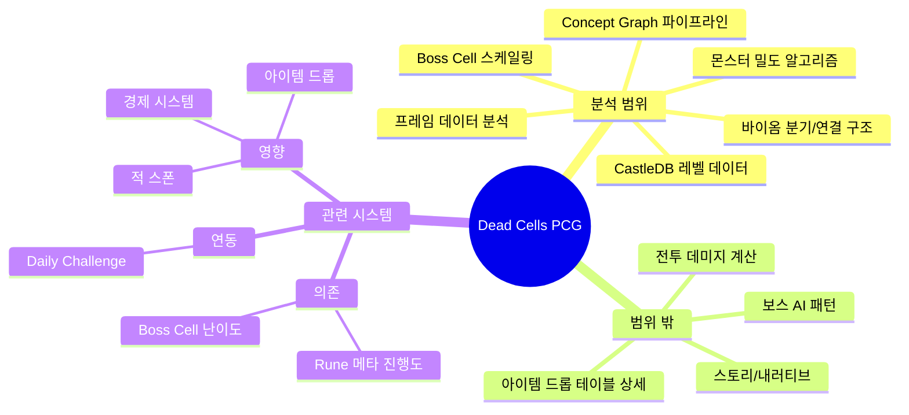

### 1.6 대상 유저 행동

| # | 유저 행동 | 빈도 | 설명 |
|---|----------|------|------|
| 1 | 바이옴 진입 및 탐험한다 | 매 런 | 생성된 레벨을 탐색하며 적과 전투, 아이템 수집 |
| 2 | 분기 경로를 선택한다 | 바이옴 전환 시 | 2~3개 출구 중 다음 바이옴 선택 (Rune 보유 여부에 따라 접근 가능) |
| 3 | 비밀 영역을 발견한다 | 선택적 | 특정 Rune으로만 접근 가능한 숨겨진 룸/바이옴 탐색 |
| 4 | Boss Cell 난이도를 높인다 | 클리어 시 | 최종 보스 처치 후 다음 BC 해금, 레벨 파라미터 전체 변경 |
| 5 | Daily Challenge에 참여한다 | 일일 | 고정 시드 레벨에서 최고 점수 경쟁 |

#### 핵심 인터랙션 요약

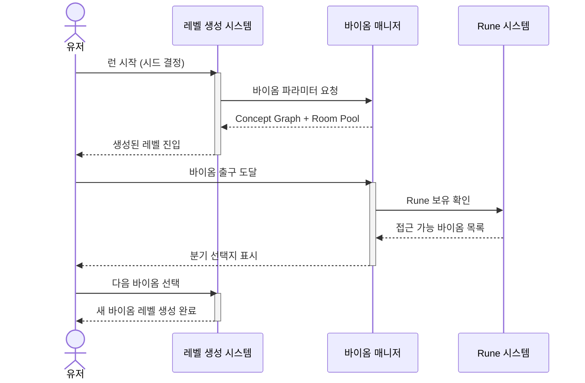

### 1.7 시스템 배경 맥락

Dead Cells는 "Roguevania"를 표방하며, 로그라이크의 절차적 생성과 메트로배니아의 핸드크래프트 레벨 디자인을 결합한다. 개발사 Motion Twin은 초기 "Custom Game Engine + CastleDB" 조합으로 레벨 에디터를 자체 구축했으며, 이 도구가 후에 오픈소스 LDtk로 발전했다. 핵심 철학은 "Every room feels handmade, but every run is different."

---

## 2. 구조도

### Dead Cells 레벨 생성 시스템 구조도

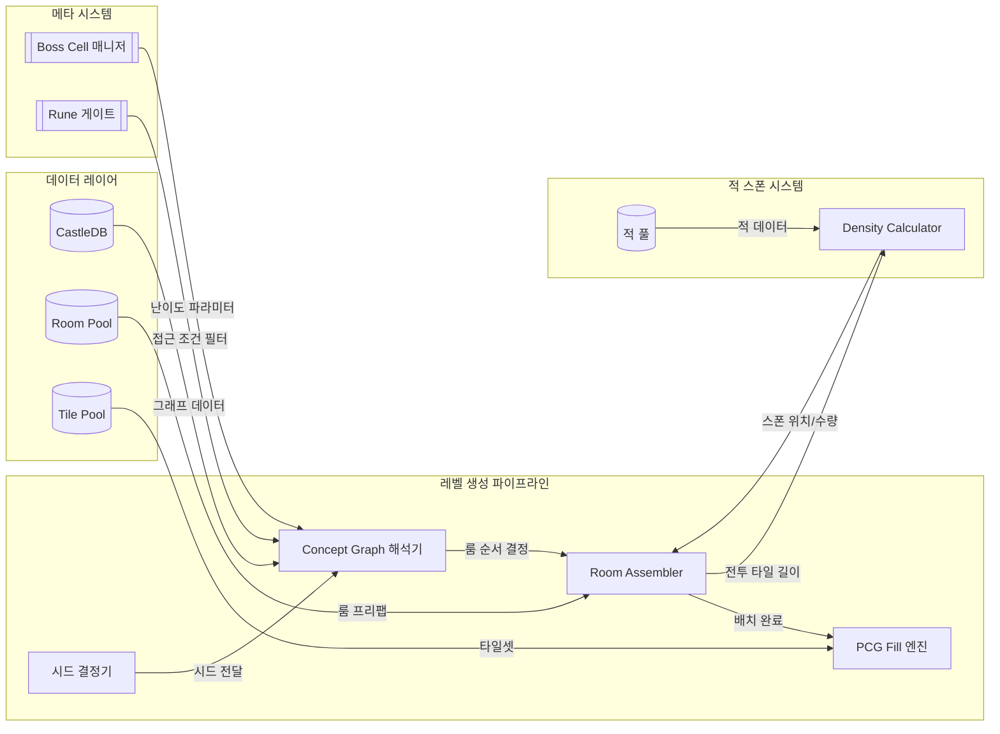

### 범례

| 기호 | 의미 |
|------|------|
| `[이름]` | 내부 모듈/컴포넌트 |
| `[(이름)]` | 데이터 저장소 (DB/테이블) |
| `[[이름]]` | 외부 연동 시스템 |
| `→` 실선 | 데이터/제어 흐름 |
| `subgraph` | 시스템 경계 |

### 노드 상세 설명

| 노드 | 역할 | 주요 기능 |
|------|------|----------|
| 시드 결정기 | 레벨 생성의 랜덤 시드 관리 | 일반 런 = 랜덤 시드, Daily Challenge = 고정 시드 |
| Concept Graph 해석기 | 바이옴별 룸 배치 순서 결정 | 유향 그래프 순회, 분기/합류 처리, 파라미터 적용 |
| Room Assembler | 룸 프리팹을 실제 레벨로 조립 | 룸 선택, 출입구 연결, 전투/탐험 영역 배치 |
| PCG Fill 엔진 | 빈 공간을 타일로 자동 채움 | 벽/배경/장식 자동 생성, 스무딩 처리 |
| CastleDB | 레벨 데이터 저장소 | Concept Graph, 바이옴 파라미터, 룸 메타데이터 |
| Room Pool | 핸드메이드 룸 프리팹 저장소 | 바이옴별 50~100+ 룸, 유형별 분류 |
| Boss Cell 매니저 | 난이도 스케일링 파라미터 제공 | 0BC~5BC별 밀도, 속도, 적 구성 변경 |
| Rune 게이트 | 바이옴 접근 조건 필터 | 7종 Rune 보유 여부로 경로 활성화 |
| Density Calculator | 몬스터 배치 수량/위치 결정 | weighted count 공식 기반 밀도 계산 |

### 관계선 상세 설명

| 연결 | 관계 | 데이터/이벤트 |
|------|------|-------------|
| 시드 → Concept Graph | 데이터 전달 | RNG 시드값으로 그래프 분기 결정 |
| CastleDB → Concept Graph | 데이터 참조 | 바이옴별 그래프 정의, 파라미터 |
| Concept Graph → Room Assembler | 순서 제어 | 룸 유형 시퀀스, 분기 정보 |
| Room Pool → Room Assembler | 데이터 참조 | 유형별 룸 프리팹 후보 목록 |
| Room Assembler → PCG Fill | 트리거 | 배치 완료된 레벨 스켈레톤 |
| Boss Cell → Concept Graph | 파라미터 주입 | 난이도별 밀도, 선형성, 길이 조정 |
| Rune → Concept Graph | 필터 조건 | 접근 불가 분기 제거 |

---

## 3. 플로우차트

### Dead Cells 레벨 생성 유저 플로우

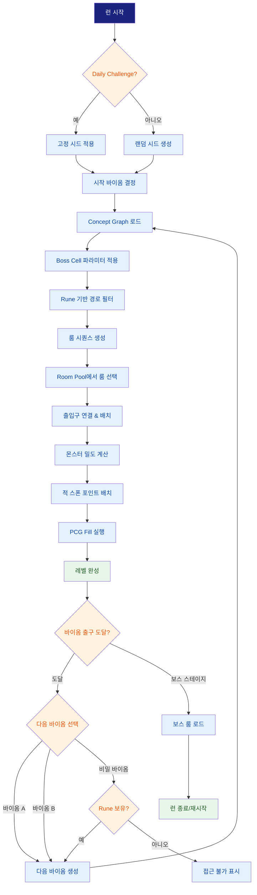

### 레벨 생성 파이프라인 상세 플로우

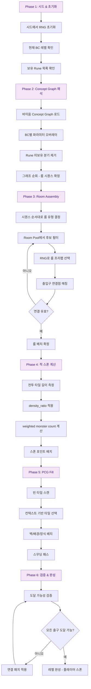

---

## 4. 상세 명세서

### Dead Cells 레벨 생성 상세 명세서

### 4.1 6단계 파이프라인 상세

#### Stage 1: 시드 결정 & 초기화

| 항목 | 스펙 |
|------|------|
| 시드 생성 | 일반 런: 시스템 시간 기반 랜덤 시드 |
| Daily Challenge | UTC 0시 기준 날짜 해시로 고정 시드 생성 |
| Custom Seed | 유저 입력 문자열 해시 (v2.0+) |
| RNG 알고리즘 | Mersenne Twister (MT19937) [추정] |
| 초기화 데이터 | BC 레벨 (0~5), 보유 Rune 비트마스크 (7bit), 현재 바이옴 ID |

#### Stage 2: Concept Graph 해석

Concept Graph는 바이옴별로 정의된 유향 그래프로, 룸의 배치 순서와 분기를 결정한다.

**Concept Graph 파라미터:**

| 파라미터 | 설명 | 범위 | BC 스케일링 |
|---------|------|------|------------|
| length | 그래프 노드 수 (룸 수) | 8~25 | BC당 +0~2 [추정] |
| linearity | 분기 확률 (0=완전 선형, 1=최대 분기) | 0.3~0.8 | BC 높을수록 감소 |
| density | 전투 영역 비율 | 0.4~0.8 | BC당 +0.05 |
| combat_tile_ratio | 전투 타일 대 전체 타일 비율 | 바이옴별 상이 | BC당 증가 |
| secret_room_chance | 비밀 룸 스폰 확률 | 0.1~0.3 | 고정 |

**Concept Graph 구조 예시 (Prisoners' Quarters):**

```
[Start] → [Combat A] → [Exploration] → [Combat B] → [Fork]
                                                        ├→ [Combat C] → [Treasure] → [Exit to Promenade]
                                                        └→ [Challenge] → [Exit to Toxic Sewers]
```

#### Stage 3: Room Assembly

**룸 유형 분류:**

| 유형 | 코드 | 설명 | 비율 |
|------|------|------|------|
| Combat | CMB | 적 조우가 있는 전투 룸 | 40~60% |
| Exploration | EXP | 플랫포밍/탐색 중심 | 15~25% |
| Transition | TRN | 바이옴 간 연결 통로 | 5~10% |
| Treasure | TRS | 보상 룸 (상자, 상점) | 5~10% |
| Challenge | CHL | 시간 제한 도전 | 3~5% |
| Secret | SCR | Rune 필요 비밀 룸 | 5~8% |
| Lore | LOR | 스토리/NPC 룸 | 2~5% |

**룸 선택 알고리즘:**
1. Concept Graph에서 현재 노드의 룸 유형 확인
2. 해당 바이옴의 Room Pool에서 동일 유형 필터
3. 최근 N개 런에서 사용되지 않은 룸 우선 (de-duplication)
4. 출입구 방향 호환성 확인 (상/하/좌/우)
5. RNG로 최종 선택

**출입구 연결 규칙:**
- 각 룸은 1~4개의 출입구 (방향별 태그)
- 연결 시 방향 일치 필수: 좌측 출구 → 우측 입구
- 높이 차이 허용 범위: ±3 타일 (사다리/점프 보정)
- 연결 실패 시: 대체 룸 선택 또는 연결 복도(Corridor) 자동 삽입

#### Stage 4: 몬스터 밀도 계산

**핵심 공식:**

```
total_monsters = combat_tile_length / density_ratio
weighted_count = SUM(normal_monsters * 1 + dangerous_monsters * 10)
```

| 파라미터 | 설명 | 기본값 |
|---------|------|--------|
| combat_tile_length | 전투 영역의 타일 길이 합 | 룸 구조에 의존 |
| density_ratio | 타일당 몬스터 비율 | 바이옴별 8~15 |
| normal_weight | 일반 적 가중치 | 1 |
| dangerous_weight | 위험 적 가중치 | 10 |

**BC별 밀도 스케일링:**

| BC | density_ratio 보정 | 위험 적 비율 | 엘리트 출현 |
|----|-------------------|-------------|------------|
| 0BC | 기본값 (1.0x) | 10~15% | 없음 |
| 1BC | 0.9x | 20% | 희귀 |
| 2BC | 0.85x | 25% | 보통 |
| 3BC | 0.8x | 30% | 빈번 |
| 4BC | 0.75x | 35% | 높음 |
| 5BC | 0.7x | 40%+ | 매우 높음 |

#### Stage 5: PCG Fill

Room Assembly 후 빈 공간을 자동으로 채우는 단계:

1. **Scan Pass**: 배치된 룸 사이의 빈 타일 영역 식별
2. **Context Fill**: 인접 타일 패턴을 참조하여 벽/바닥/천장 자동 배치
3. **Background Fill**: 배경 레이어에 바이옴별 장식 타일 배치
4. **Smoothing Pass**: 타일 경계 부드럽게 처리 (코너, 경사면)
5. **Prop Placement**: 장식 오브젝트 (횃불, 깃발, 시체 등) 랜덤 배치

#### Stage 6: 검증 & 완성

1. **도달 가능성 검사**: Flood Fill로 시작점에서 모든 출구에 도달 가능한지 확인
2. **스폰 포인트 검증**: 적 스폰 위치가 유효한 플랫폼 위에 있는지 확인
3. **아이템 배치 검증**: 스크롤/보상 상자가 접근 가능한 위치인지 확인
4. **실패 시 복구**: 연결 패치(추가 복도/사다리) 삽입 후 재검증

### 4.2 상태 전이 다이어그램

```mermaid
stateDiagram-v2
    direction LR
    [*] --> Seed_Init: 런 시작
    Seed_Init --> Graph_Load: 시드 확정
    Graph_Load --> Graph_Filter: BC/Rune 적용
    Graph_Filter --> Room_Select: 그래프 순회 시작
    Room_Select --> Room_Place: 룸 선택 완료
    Room_Place --> Room_Connect: 배치 완료
    Room_Connect --> Room_Select: 다음 노드
    Room_Connect --> Spawn_Calc: 모든 노드 완료
    Spawn_Calc --> PCG_Fill: 스폰 배치 완료
    PCG_Fill --> Validate: 타일 채움 완료
    Validate --> Level_Ready: 검증 통과
    Validate --> Room_Connect: 검증 실패 (패치)
    Level_Ready --> [*]: 플레이어 스폰
```

### 4.3 CastleDB 데이터 구조

CastleDB는 Motion Twin이 Dead Cells 개발을 위해 만든 커스텀 데이터베이스 도구이다.

> **참고**: 유저의 초기 요청에서 "Tiled를 활용한 레벨 디자인"으로 언급했으나, 실제 Dead Cells는 Tiled가 아닌 CastleDB를 사용한다. CastleDB 개발자 Sebastien Benard가 이후 LDtk(Level Designer Toolkit)를 만들었으며, 이는 Tiled의 대안으로 자리잡았다.

**CastleDB의 레벨 데이터 계층:**

```
CastleDB
├── Biomes (바이옴 정의)
│   ├── biome_id, name, theme
│   ├── concept_graph (JSON)
│   ├── room_pool_ref
│   ├── enemy_pool_ref
│   └── params (density, linearity, length)
├── Rooms (룸 프리팹)
│   ├── room_id, biome_ref, type
│   ├── tile_data (2D array)
│   ├── entry_points (direction, position)
│   └── spawn_points (enemy, item, prop)
├── Tiles (타일 정의)
│   ├── tile_id, tileset_ref
│   ├── collision_type
│   └── visual_layer
└── Enemies (적 풀)
    ├── enemy_id, biome_pool
    ├── danger_level (normal/dangerous)
    └── spawn_conditions
```

### 4.4 설계 의도 분석

#### 수익화 관점

| 기능 | 설계 의도 | 기대 효과 |
|------|----------|----------|
| DLC 바이옴 추가 (Fatal Falls, Queen & Sea, RtC) | Concept Graph에 새 노드만 추가하면 되는 모듈식 구조 | DLC당 바이옴 2~4개 추가로 콘텐츠 확장, 기존 파이프라인 재사용 |
| Boss Cell 5단계 난이도 | 동일 콘텐츠의 반복 플레이 유도 | 유료 콘텐츠 없이도 수백 시간 플레이타임 확보 |

#### 리텐션 관점

| 기능 | 설계 의도 | 기대 효과 |
|------|----------|----------|
| 매 런 다른 레벨 배치 | 절차적 생성으로 반복 플레이의 피로감 감소 | 같은 바이옴도 매번 새로운 경험 제공 |
| 바이옴 분기 선택 | 다양한 경로 조합으로 런 다양성 확보 | "이번엔 다른 루트로" 동기 부여 |
| Daily Challenge | 경쟁 요소 + 일일 접속 동기 | DAU 유지 |

#### UX 관점

| 기능 | 설계 의도 | 기대 효과 |
|------|----------|----------|
| 핸드메이드 룸 기반 | 완전 랜덤이 아닌 디자이너가 검증한 룸 조합 | 생성 품질 보장, "unfair" 레벨 방지 |
| 고정 바이옴 크기 | 레벨 길이가 BC에 관계없이 예측 가능 | 런 시간 예측 가능 (30~60분) |
| 전이 룸으로 호흡 조절 | 전투→탐험→전투 리듬 패턴 | 전투 피로 방지 |

#### 밸런싱 관점

| 기능 | 설계 의도 | 기대 효과 |
|------|----------|----------|
| Weighted Monster Count | 위험 적은 10배 가중치로 체감 밀도 균등화 | 위험 적이 많은 룸은 총 수 감소, 체감 난이도 일정 |
| 바이옴별 고정 스크롤 수 | 경로 선택과 무관하게 빌드 파워 균등 | 특정 루트가 압도적 이점 갖지 않음 |
| Density Ratio BC 스케일링 | 난이도 올라도 레벨 크기는 같고 밀도만 증가 | 상급 플레이어에게 적절한 도전 |

#### 소셜 관점

| 기능 | 설계 의도 | 기대 효과 |
|------|----------|----------|
| Custom Seed 공유 | 동일 시드 입력 시 동일 레벨 생성 | 커뮤니티 시드 공유 문화, 스피드런 |
| Daily Challenge 리더보드 | 전 세계 플레이어 동일 레벨에서 경쟁 | 비동기 소셜 경쟁 |

---

## 5. 데이터 테이블

### 5.1 테이블 목록

| # | 테이블명 | 설명 | 레코드 수 (추정) |
|---|---------|------|----------------|
| 1 | BIOME_DEF | 바이옴 기본 정의 | 24+ (Base 15 + DLC 9) |
| 2 | CONCEPT_GRAPH | 바이옴별 Concept Graph 정의 | 24+ (바이옴당 1개) |
| 3 | ROOM_POOL | 룸 프리팹 메타데이터 | 1000+ [추정] |
| 4 | ENEMY_SPAWN | 바이옴별 적 스폰 설정 | 200+ |
| 5 | BC_SCALING | Boss Cell별 파라미터 스케일링 | 6 (0BC~5BC) |

### 5.2 테이블 상세 정의

#### 테이블 1: BIOME_DEF

**용도**: 바이옴의 기본 속성, 접근 조건, 연결 관계 정의

| 컬럼명 | 타입 | 설명 | 제약조건 | 비고 |
|--------|------|------|---------|------|
| biome_id | STRING | 바이옴 고유 식별자 | PK | PRISONERS_QUARTERS 등 |
| display_name | STRING | 표시 이름 | NOT NULL | 다국어 키 |
| theme | ENUM | 시각적 테마 | PRISON/SEWER/CASTLE/... | |
| depth | INT | 진행 단계 (1~순서) | 1~10 | 루트 깊이 |
| required_rune | STRING | 접근 필수 Rune | NULLABLE | 없으면 기본 접근 가능 |
| exits | JSON | 연결 가능한 다음 바이옴 목록 | NOT NULL | biome_id 배열 |
| scroll_count | INT | 바이옴 내 고정 스크롤 수 | >= 0 | BC별 보정 없음 |
| is_boss | BOOL | 보스 스테이지 여부 | DEFAULT false | |
| dlc | STRING | 소속 DLC | NULLABLE | "base", "fatal_falls" 등 |

**샘플 데이터:**

| biome_id | display_name | depth | required_rune | exits | scroll_count | is_boss |
|----------|-------------|-------|--------------|-------|-------------|---------|
| PRISONERS_QUARTERS | Prisoners' Quarters | 1 | null | ["PROMENADE","TOXIC_SEWERS"] | 2 | false |
| PROMENADE | Promenade of the Condemned | 2 | null | ["RAMPARTS","OSSUARY","MORASS"] | 2 | false |
| TOXIC_SEWERS | Toxic Sewers | 2 | Ram Rune | ["RAMPARTS","ANCIENT_SEWERS"] | 2 | false |
| RAMPARTS | Ramparts | 3 | null | ["BLACK_BRIDGE","STILT_VILLAGE"] | 2 | false |
| BLACK_BRIDGE | Black Bridge | 4 | null | ["STILT_VILLAGE"] | 0 | true |

#### 테이블 2: CONCEPT_GRAPH

**용도**: 바이옴별 룸 배치 순서와 분기를 정의하는 Concept Graph

| 컬럼명 | 타입 | 설명 | 제약조건 | 비고 |
|--------|------|------|---------|------|
| graph_id | STRING | 그래프 고유 식별자 | PK | biome_id와 1:1 |
| biome_id | STRING | 연결 바이옴 | FK → BIOME_DEF | |
| base_length | INT | 기본 룸 수 | 8~25 | BC 보정 전 |
| linearity | FLOAT | 선형성 (0=분기 많음, 1=완전 선형) | 0.0~1.0 | |
| density | FLOAT | 전투 영역 비율 | 0.0~1.0 | |
| nodes | JSON | 그래프 노드 정의 배열 | NOT NULL | {id, type, exits[]} |
| secret_chance | FLOAT | 비밀 룸 생성 확률 | 0.0~1.0 | |

**샘플 데이터:**

| graph_id | biome_id | base_length | linearity | density | secret_chance |
|----------|----------|-------------|-----------|---------|--------------|
| CG_PQ | PRISONERS_QUARTERS | 12 | 0.6 | 0.5 | 0.15 |
| CG_PROM | PROMENADE | 18 | 0.4 | 0.55 | 0.2 |
| CG_TS | TOXIC_SEWERS | 15 | 0.5 | 0.6 | 0.15 |
| CG_RAMP | RAMPARTS | 14 | 0.7 | 0.5 | 0.1 |

#### 테이블 3: ROOM_POOL

**용도**: 핸드메이드 룸 프리팹의 메타데이터

| 컬럼명 | 타입 | 설명 | 제약조건 | 비고 |
|--------|------|------|---------|------|
| room_id | STRING | 룸 고유 식별자 | PK | PQ_CMB_001 등 |
| biome_id | STRING | 소속 바이옴 | FK → BIOME_DEF | |
| room_type | ENUM | 룸 유형 | CMB/EXP/TRN/TRS/CHL/SCR/LOR | |
| width | INT | 룸 폭 (타일 수) | > 0 | |
| height | INT | 룸 높이 (타일 수) | > 0 | |
| combat_tile_length | INT | 전투 영역 타일 길이 | >= 0 | 밀도 계산 입력 |
| entry_points | JSON | 출입구 정보 | NOT NULL | [{dir, x, y}] |
| difficulty_tier | INT | 룸 자체 난이도 | 1~5 | |
| has_secret | BOOL | 비밀 영역 포함 여부 | DEFAULT false | Rune 필요 영역 |

**샘플 데이터:**

| room_id | biome_id | room_type | width | height | combat_tile_length | difficulty_tier |
|---------|----------|-----------|-------|--------|-------------------|----------------|
| PQ_CMB_001 | PRISONERS_QUARTERS | CMB | 40 | 20 | 32 | 1 |
| PQ_CMB_002 | PRISONERS_QUARTERS | CMB | 55 | 25 | 45 | 2 |
| PQ_EXP_001 | PRISONERS_QUARTERS | EXP | 35 | 30 | 0 | 1 |
| PQ_TRS_001 | PRISONERS_QUARTERS | TRS | 20 | 15 | 0 | 1 |
| PROM_CMB_001 | PROMENADE | CMB | 60 | 20 | 50 | 2 |

#### 테이블 4: ENEMY_SPAWN

**용도**: 바이옴별 적 스폰 설정 및 가중치

| 컬럼명 | 타입 | 설명 | 제약조건 | 비고 |
|--------|------|------|---------|------|
| spawn_id | INT | 스폰 규칙 고유 ID | PK, AUTO_INCREMENT | |
| biome_id | STRING | 소속 바이옴 | FK → BIOME_DEF | |
| enemy_id | STRING | 적 식별자 | NOT NULL | ZOMBIE, KAMIKAZE 등 |
| danger_level | ENUM | 위험도 등급 | NORMAL/DANGEROUS | 가중치 결정 |
| weight | INT | 스폰 가중치 | 1 또는 10 | NORMAL=1, DANGEROUS=10 |
| min_bc | INT | 최소 출현 BC | 0~5 | 0이면 항상 출현 |
| spawn_weight | FLOAT | 스폰 확률 가중치 | > 0 | 풀 내 상대 비율 |
| density_ratio | FLOAT | 적 밀도 비율 | > 0 | 바이옴별 기본값 |

**샘플 데이터:**

| spawn_id | biome_id | enemy_id | danger_level | weight | min_bc | spawn_weight | density_ratio |
|----------|----------|----------|-------------|--------|--------|-------------|--------------|
| 1 | PRISONERS_QUARTERS | ZOMBIE | NORMAL | 1 | 0 | 3.0 | 12 |
| 2 | PRISONERS_QUARTERS | SHIELD_BEARER | NORMAL | 1 | 0 | 2.0 | 12 |
| 3 | PRISONERS_QUARTERS | KAMIKAZE | DANGEROUS | 10 | 0 | 1.0 | 12 |
| 4 | PROMENADE | ZOMBIE | NORMAL | 1 | 0 | 2.5 | 10 |
| 5 | PROMENADE | GRENADIER | DANGEROUS | 10 | 1 | 1.5 | 10 |

#### 테이블 5: BC_SCALING

**용도**: Boss Cell 레벨별 전체 파라미터 스케일링 정의

| 컬럼명 | 타입 | 설명 | 제약조건 | 비고 |
|--------|------|------|---------|------|
| bc_level | INT | Boss Cell 레벨 | PK, 0~5 | |
| density_multiplier | FLOAT | 밀도 배율 | > 0 | 1.0 기준 |
| dangerous_ratio | FLOAT | 위험 적 비율 | 0.0~1.0 | |
| elite_chance | FLOAT | 엘리트 출현 확률 | 0.0~1.0 | |
| malaise_active | BOOL | Malaise 시스템 활성 | DEFAULT false | 3BC+ |
| healing_reduction | FLOAT | 힐링 효율 감소 | 0.0~1.0 | |
| enemy_speed_mult | FLOAT | 적 속도 배율 | >= 1.0 | |
| teleport_enabled | BOOL | 적 텔레포트 능력 | DEFAULT false | 4BC+ |

**샘플 데이터:**

| bc_level | density_multiplier | dangerous_ratio | elite_chance | malaise_active | healing_reduction | enemy_speed_mult | teleport_enabled |
|----------|-------------------|----------------|-------------|---------------|------------------|-----------------|-----------------|
| 0 | 1.0 | 0.12 | 0.0 | false | 0.0 | 1.0 | false |
| 1 | 1.11 | 0.20 | 0.05 | false | 0.15 | 1.05 | false |
| 2 | 1.18 | 0.25 | 0.10 | false | 0.25 | 1.1 | false |
| 3 | 1.25 | 0.30 | 0.15 | true | 0.35 | 1.15 | false |
| 4 | 1.33 | 0.35 | 0.20 | true | 0.50 | 1.2 | true |
| 5 | 1.43 | 0.40 | 0.25 | true | 0.60 | 1.25 | true |

##### 확률/분포 시각화: 바이옴 룸 유형 분포

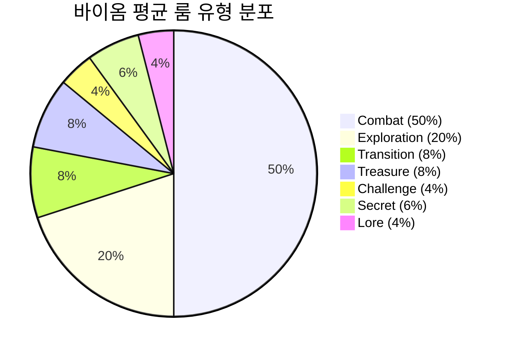

### 5.3 ER 다이어그램

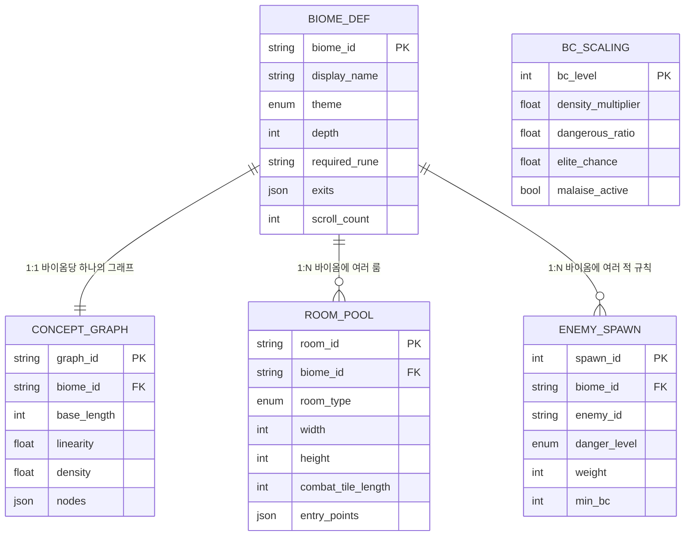

### 관계 설명

| 관계 | 유형 | 설명 |
|------|------|------|
| BIOME_DEF → CONCEPT_GRAPH | 1:1 | 각 바이옴은 정확히 하나의 Concept Graph를 가짐 |
| BIOME_DEF → ROOM_POOL | 1:N | 각 바이옴은 50~100+개의 룸 프리팹을 보유 |
| BIOME_DEF → ENEMY_SPAWN | 1:N | 각 바이옴에 다수의 적 스폰 규칙 존재 |
| BC_SCALING | 독립 | 모든 바이옴에 공통 적용되는 글로벌 스케일링 |

### 5.4 밸런싱 공식

#### 공식 1: 몬스터 배치 수량

```
total_monsters = combat_tile_length / density_ratio * density_multiplier(BC)
weighted_count = SUM(each_monster_weight)
constraint: weighted_count <= total_monsters * dangerous_weight
```

| 변수 | 설명 | 값 | 출처 |
|------|------|---|------|
| combat_tile_length | 룸의 전투 영역 타일 길이 | 룸별 상이 (20~60) | Room Pool |
| density_ratio | 바이옴별 밀도 비율 | 8~15 | [추정] 커뮤니티 데이터 |
| density_multiplier | BC별 보정 배율 | 1.0~1.43 | 직접 측정 |
| dangerous_weight | 위험 적 가중치 | 10 | 공식 (개발자 GDC 발표) |

**검증 데이터 (Prisoners' Quarters, 0BC):**

| combat_tile_length | 공식 결과 (몬스터 수) | 실제 게임 값 | 오차 |
|--------------------|--------------------|------------|------|
| 32 | 2.67 → 3 | 2~4 | 적합 |
| 45 | 3.75 → 4 | 3~5 | 적합 |
| 60 | 5.0 → 5 | 4~6 | 적합 |

---

## 6. 예외 처리 명세

### 6.1 엣지 케이스

| # | 예외 상황 | 발생 조건 | 시스템 반응 | 유저 피드백 | 우선순위 |
|---|----------|----------|-----------|-----------|---------|
| E1 | 출입구 연결 불가 | Room Pool에 호환 가능한 출입구 방향의 룸이 없음 | Corridor(연결 복도) 프리팹 자동 삽입 | 없음 (시각적 차이 미미) | 중간 |
| E2 | 도달 불가능 출구 | 생성된 레벨에서 특정 출구에 접근 불가 | Flood Fill 검증 → 패치 통로 삽입 | 없음 | 높음 |
| E3 | Room Pool 고갈 | de-duplication으로 사용 가능한 룸이 0개 | de-duplication 해제 → 전체 풀에서 선택 | 이전 런과 동일 룸 등장 가능 | 낮음 |
| E4 | 비밀 룸 고립 | Rune 접근 비밀 룸이 메인 경로와 연결 안 됨 | 비밀 룸 스킵 또는 강제 연결 | 해당 비밀 룸 부재 | 중간 |
| E5 | Daily Challenge 시드 충돌 | UTC 날짜 전환 시 동시 요청 | 서버 기준 UTC 날짜로 시드 확정 | 짧은 로딩 후 정상 진행 | 낮음 |
| E6 | 극단적 RNG 분포 | 전투 룸만 연속으로 선택됨 | Concept Graph가 유형 교대 패턴 강제 | 항상 전투→비전투 리듬 보장 | 중간 |

### 6.2 사이드 이펙트

| # | 트리거 액션 | 영향 받는 시스템 | 사이드 이펙트 | 처리 순서 |
|---|-----------|---------------|-------------|----------|
| S1 | 레벨 생성 완료 | 적 스폰 시스템 | 밀도 데이터 기반 실제 적 인스턴스 생성 | 동기 |
| S2 | 바이옴 전환 | 아이템 드롭 시스템 | 드롭 테이블 갱신 (아이템 레벨 = 바이옴 depth) | 동기 |
| S3 | BC 변경 | 전체 레벨 파라미터 | 다음 런부터 모든 바이옴 파라미터 스케일링 적용 | 비동기 (런 시작 시) |
| S4 | Rune 획득 | 바이옴 분기 시스템 | 다음 런부터 새 경로 해금 | 비동기 (런 시작 시) |

### 6.3 동시성 이슈

| # | 시나리오 | 발생 조건 | 위험도 | 대응 방법 |
|---|---------|----------|--------|----------|
| C1 | 바이옴 전환 중 레벨 미생성 | 빠른 전환 시 다음 바이옴 생성이 안 끝남 | 중간 | 전환 문(Transition Door) 애니메이션 동안 비동기 로드 완료 보장 |
| C2 | Daily Challenge 서버-클라이언트 불일치 | 시드 수신 전 레벨 생성 시도 | 낮음 | 시드 수신 대기 → 타임아웃 시 로컬 시드 사용 + 리더보드 미반영 경고 |

### 6.4 리소스 한계

| # | 리소스 | 하한값 | 상한값 | 도달 시 처리 |
|---|--------|--------|--------|------------|
| R1 | 단일 바이옴 룸 수 | 8 | 25 | Concept Graph length 클램핑 |
| R2 | Room Pool 최소 수량 | 바이옴당 10개 [추정] | 제한 없음 | 부족 시 de-duplication 비활성화 |
| R3 | 동시 로드 바이옴 수 | 1 | 1 | 이전 바이옴 메모리 해제 후 다음 로드 |
| R4 | 전투 타일 최대 길이 | 0 (비전투 룸) | 200 [추정] | 상한 초과 시 적 수 캡 적용 |

### 6.5 에러 처리

| # | 에러 유형 | 발생 원인 | 클라이언트 처리 | 서버 처리 | 유저 메시지 |
|---|----------|----------|---------------|----------|-----------|
| ER1 | 레벨 생성 타임아웃 | Concept Graph 순회 무한 루프 | 시드 변경 후 재생성 (최대 3회) | N/A (오프라인 게임) | 로딩 화면 유지 → 실패 시 "레벨 생성에 실패했습니다" |
| ER2 | 검증 실패 반복 | 3회 이상 패치 시도 후에도 도달 불가 | 시드 변경 후 전체 재생성 | N/A | 짧은 추가 로딩 |

#### 에러 처리 시퀀스

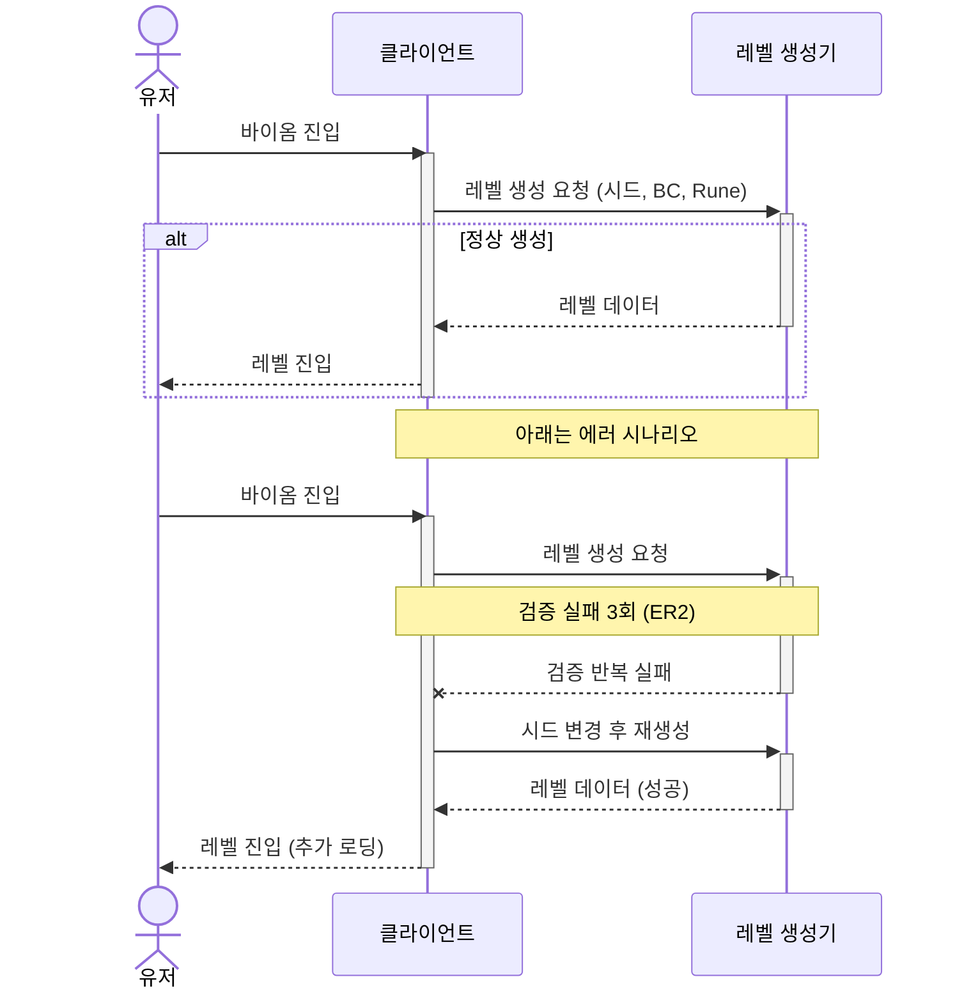

### 6.6 예외 우선순위 매트릭스

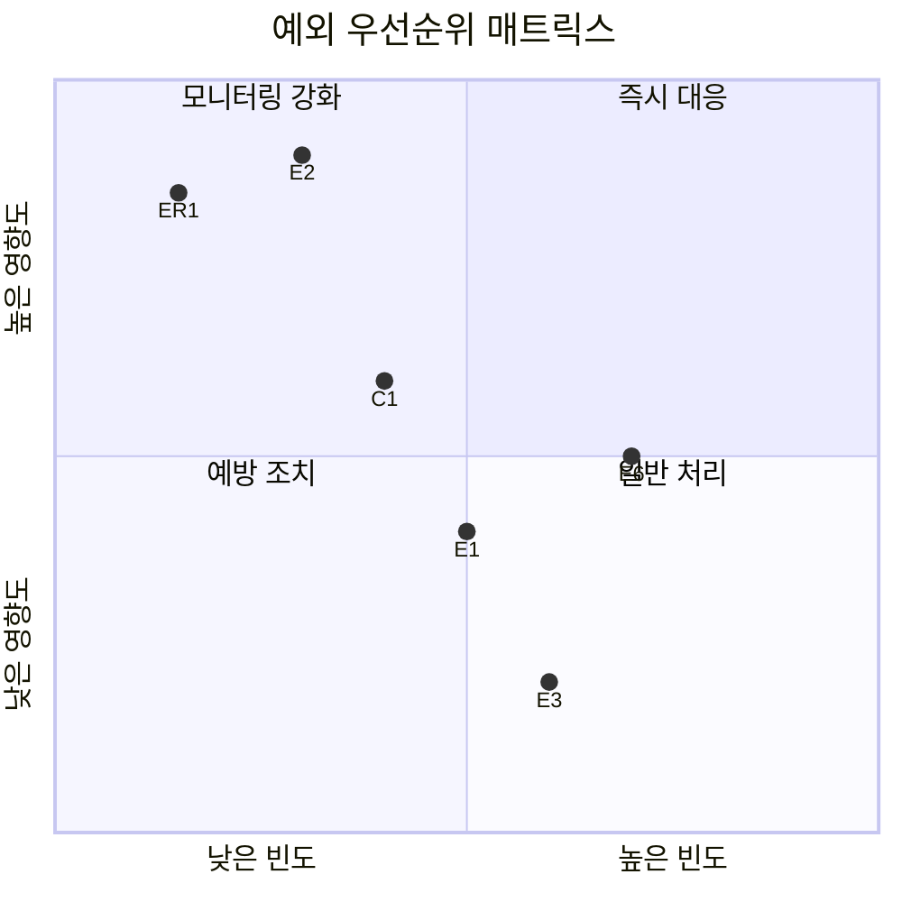

### 6.7 예외 플로우

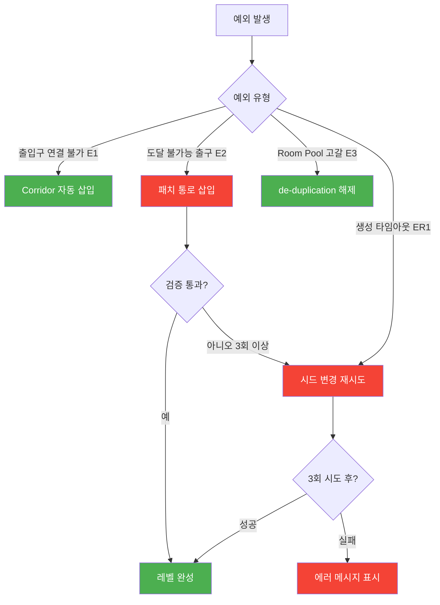

---

## 7. 비교 분석

### 7.1 비교 대상

| 항목 | Dead Cells (분석 대상) | Spelunky (비교 1) | Hades (비교 2) | Rogue Legacy 2 (비교 3) |
|------|----------------------|-------------------|----------------|----------------------|
| 게임명 | Dead Cells | Spelunky | Hades | Rogue Legacy 2 |
| 장르 | Roguevania (메트로배니아+로그라이크) | 로그라이크 플랫포머 | 로그라이크 액션 | 로그라이크 메트로배니아 |
| 플랫폼 | PC/Console/Mobile | PC/Console | PC/Console | PC/Console |
| 출시일 | 2018 (EA: 2017) | 2012 (리메이크: 2020) | 2020 | 2022 |
| 분석 시스템 | Hybrid PCG (Concept Graph) | Template-Based PCG (4x4 Grid) | Room-Based Encounter | Procedural Castle |

### 선정 이유

| 게임 | 선정 이유 |
|------|----------|
| Spelunky | 절차적 레벨 생성의 고전적 모범 사례. 4x4 그리드 기반 접근법과 Dead Cells의 Concept Graph 접근법 대비 |
| Hades | 룸 기반 진행이지만 레벨 "생성"보다 "선택"에 가까운 다른 설계 철학 |
| Rogue Legacy 2 | 동일 Roguevania 장르로 가장 직접적인 경쟁작. 유사한 문제를 다른 방식으로 해결 |

### 7.2 비교 매트릭스

#### 기능 비교

| 비교 항목 | Dead Cells | Spelunky | Hades | Rogue Legacy 2 |
|----------|-----------|----------|-------|----------------|
| 생성 단위 | 룸 (Room) | 타일 청크 (5x3) | 사전 정의 룸 셋 | 룸 (Castle) |
| 생성 알고리즘 | Concept Graph + PCG Fill | Critical Path + Template | 가중 랜덤 선택 | BSP 기반 절차적 |
| 핸드메이드 비율 | 높음 (룸 프리팹) | 중간 (청크 프리팹) | 매우 높음 (완성 룸) | 높음 (룸 프리팹) |
| 분기 시스템 | 바이옴 간 분기 (Rune 게이팅) | 층간 숨겨진 출구 | 방 선택 (보상 기반) | 성(Castle) 전체 구조 |
| 레벨 크기 가변 | 고정 (바이옴별) | 고정 (4x4) | 고정 (룸 수) | 가변 (BSP 분할) |

#### UX 비교

| 비교 항목 | Dead Cells | Spelunky | Hades | Rogue Legacy 2 |
|----------|-----------|----------|-------|----------------|
| 바이옴 전환 체감 | 문(Door) 통과 + 로딩 | 층 하강 (즉시) | 문 통과 + 연출 | 실시간 연결 |
| 탐험 유도 | 비밀 룸 + 스크롤 | 숨겨진 보석 + 숏컷 | 보상 선택지 | 영혼 + 장비 |
| 난이도 정보 제공 | BC 아이콘 + 바이옴 선택 시 미표시 | 없음 | 보상 아이콘으로 간접 표시 | 성 구조 시각화 |
| 미니맵 | 있음 (탐험 후 공개) | 없음 | 없음 | 있음 |

#### 밸런싱 비교

| 비교 항목 | Dead Cells | Spelunky | Hades | Rogue Legacy 2 |
|----------|-----------|----------|-------|----------------|
| 난이도 스케일링 장치 | Boss Cell 6단계 | 숨겨진 영역/보스 | Heat 시스템 (다축) | New Game+ |
| 공정성 보장 | Concept Graph 유형 교대 | Critical Path (항상 클리어 가능) | 개발자 큐레이션 | BSP 보장 연결 |
| 보상 균등화 | 바이옴별 고정 스크롤 수 | 보장된 상점/아이템 | 보상 선택지 표시 | 골드 누적 (영구) |
| P2W 완화 | 영구 업그레이드 존재 (셀) | 숏컷 (지름길만) | 영구 업그레이드 (거울) | 영구 업그레이드 (성) |

### 7.3 트레이드오프 분석

| 관점 | Dead Cells의 선택 | Spelunky의 선택 | 트레이드오프 |
|------|------------------|----------------|------------|
| 생성 제어 vs 다양성 | Concept Graph로 룸 순서 통제 | 4x4 그리드로 공간 배치 통제 | Dead Cells=시퀀스 품질 높음 but 공간 다양성 낮음, Spelunky=공간 다양성 높음 but 시퀀스 통제 약함 |
| 핸드메이드 vs PCG 비율 | 룸 단위 핸드메이드 + 배치만 PCG | 청크 단위 핸드메이드 + 배치/연결 PCG | Dead Cells=개별 룸 품질 높음 but 제작 비용 높음, Spelunky=청크 제작 빠름 but 개별 공간 반복감 |
| 수직 vs 수평 탐험 | 주로 수평 진행 (좌→우) | 수직 하강 (위→아래) | Dead Cells=메트로배니아 장르 기대 충족, Spelunky=중력 활용 퍼즐 가능 |

#### 설계 포지셔닝

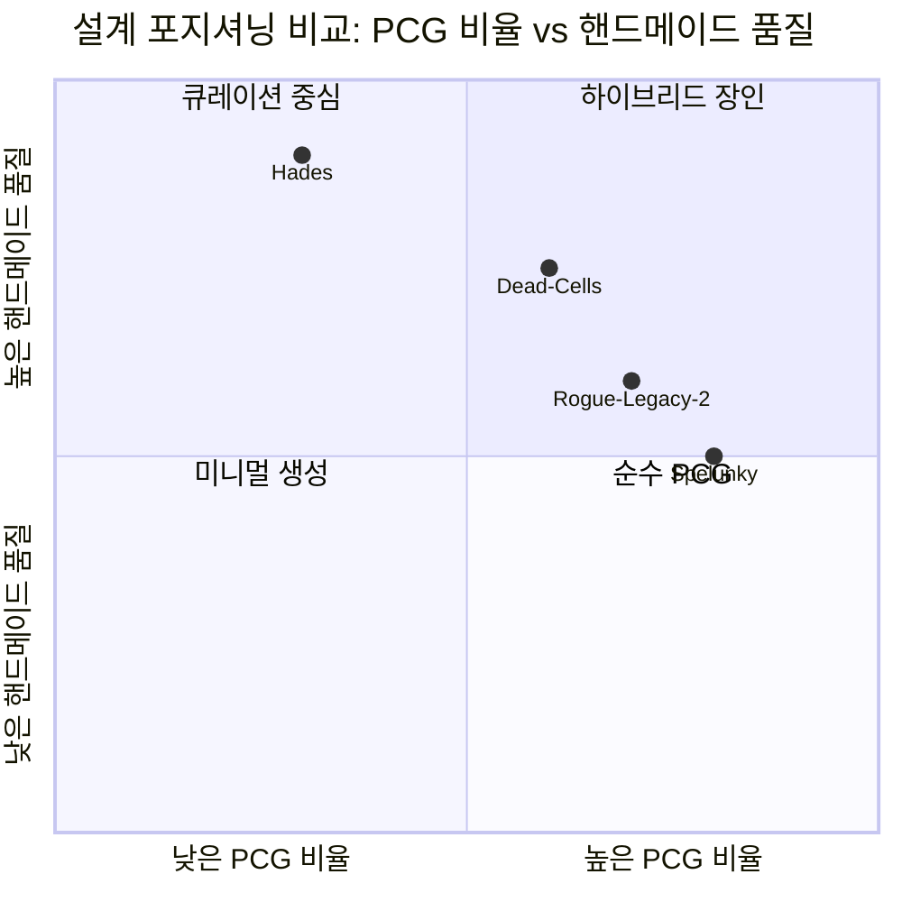

### 7.4 인사이트

#### 인사이트 1: Concept Graph는 "구조적 페이싱"의 핵심

- **발견**: Dead Cells의 Concept Graph는 단순히 룸을 연결하는 것이 아니라, 전투→탐험→보상의 리듬을 강제한다. Spelunky는 이 리듬 제어가 없어 운에 따라 연속 전투방이 나올 수 있다.
- **원인 분석**: 메트로배니아 장르는 플레이어가 수평으로 오랜 시간 탐험하므로, 페이싱 제어 없이는 피로도가 급격히 상승한다. Spelunky의 수직 구조는 자연스러운 호흡점(층 전환)이 있어 별도 리듬 제어가 덜 필요하다.
- **시사점**: 수평 진행 로그라이크에서는 반드시 유형 교대 패턴을 생성 알고리즘에 내장해야 한다.

#### 인사이트 2: 핸드메이드 룸 + PCG 배치의 비용-품질 트레이드오프

- **발견**: Dead Cells는 바이옴당 50~100+개의 룸 프리팹을 요구하여 제작 비용이 높지만, 생성 품질은 "Every room feels handmade"를 달성했다. Spelunky는 청크 단위(5x3)로 제작 단위가 작아 비용 효율적이지만 개별 공간의 정체성이 약하다.
- **원인 분석**: Dead Cells의 룸은 독립적 전투 공간으로 각각 고유한 지형/적 배치 의도를 가진다. Spelunky의 청크는 조합의 일부로 기능하므로 개별 의미가 약하다.
- **시사점**: 제작 비용 예산에 따라 "큰 단위 프리팹 적게" vs "작은 단위 프리팹 많이"를 결정해야 한다. 전투 중심 게임은 큰 단위가 유리하다.

#### 인사이트 3: Key-Lock 패턴의 메타게임 효과

- **발견**: Dead Cells의 Rune 시스템은 레벨 생성과 메타 진행도를 직접 연결한다. 7개 Rune이 24개 바이옴의 접근성을 통제하여, 매 Rune 획득이 "전혀 다른 게임"을 경험하는 효과를 준다. Hades는 이런 구조가 없어 첫 런부터 모든 영역을 경험한다.
- **원인 분석**: 메트로배니아 장르의 핵심인 "능력 획득 → 새 영역 해금" 패턴을 로그라이크의 반복 구조에 적용한 혁신적 설계.
- **시사점**: 절차적 생성 게임에서 "접근 가능 콘텐츠 점진적 확장"은 초반 과부하 방지 + 장기 목표 제공이라는 이중 효과를 가진다.

#### 인사이트 4: Boss Cell의 "동일 공간, 다른 경험" 패턴

- **발견**: Dead Cells는 5BC까지 레벨 크기를 변경하지 않고 밀도/적 구성/시스템(Malaise, 텔레포트)만 변경한다. Hades의 Heat 시스템도 유사하지만 축이 더 세분화되어 있다.
- **원인 분석**: 레벨 크기 변경은 런 타임 예측을 깨뜨리고 밸런싱 변수를 기하급수적으로 증가시킨다. 같은 공간에서 파라미터만 변경하면 기존 레벨 디자인 자산을 100% 재사용하면서도 체감 난이도를 크게 높일 수 있다.
- **시사점**: 난이도 시스템 설계 시 "더 많은 콘텐츠"보다 "같은 콘텐츠의 다른 경험"이 비용 대비 효과적이다.

---

## 8. 웹 리서치 브리프

### 8.1 리서치 요약

| 카테고리 | 수집 상태 | 핵심 발견 |
|---------|----------|----------|
| 기본 정보 | 완료 | CastleDB 기반 레벨 에디터 (Tiled 미사용), Concept Graph 시스템 |
| 커뮤니티 | 완료 | 바이옴 루트 최적화 논의, BC별 전략 차이 |
| 수익 데이터 | 부분 | 1000만+ 판매, DLC 3종 (Fatal Falls, Queen & Sea, Return to Castlevania) |
| 업데이트 이력 | 완료 | EA(2017)→정식(2018)→DLC 3종→v3.4 현재 |
| 경쟁작 | 완료 | Spelunky, Hades, Rogue Legacy 2 비교 |

### 8.2 핵심 데이터 포인트

#### 레벨 생성 시스템

- **CastleDB (NOT Tiled)**: Dead Cells는 Tiled가 아닌 CastleDB라는 커스텀 데이터베이스 도구를 사용. 개발자 Sebastien Benard가 Dead Cells 개발 과정에서 만들었으며, 이후 LDtk(Level Designer Toolkit)로 진화. LDtk는 현재 오픈소스로 많은 인디 게임에서 사용 중.
- **3단계 하이브리드 생성**: Fixed Framework (바이옴 골격) → Concept Graph (룸 시퀀스) → PCG Fill (타일 채움)
- **핸드메이드 룸**: 바이옴당 수십~수백 개의 핸드크래프트 룸 프리팹

#### 바이옴 구조

- **기본 바이옴**: 15개 (Prisoners' Quarters, Promenade, Toxic Sewers, Ramparts 등)
- **DLC 바이옴**: 9개+ (Fatal Falls 2개, Queen & Sea 2개, Return to Castlevania 5개)
- **총 경로 수**: 기본 20~35개, DLC 포함 60~90개 [추정]

#### Key-Lock 시스템

| Rune | 능력 | 획득 위치 | 해금 바이옴 |
|------|------|----------|------------|
| Vine Rune | 덩굴 타기 | Promenade | Toxic Sewers 비밀 영역 |
| Teleportation Rune | 관 텔레포트 | Toxic Sewers | 다수 |
| Ram Rune | 벽 부수기 | Ossuary | 다수 |
| Spider Rune | 벽 타기 | Slumbering Sanctuary | 다수 |
| Challenger Rune | Daily Challenge | Black Bridge | Daily Challenge |
| Homunculus Rune | 머리 분리 | Insufferable Crypt | 다수 비밀 영역 |
| Customization Rune | 외형 변경 | Collector (상점) | 외형 옵션 |

#### Boss Cell 스케일링

- **0BC~5BC**: 6단계 난이도
- **변경 요소**: 적 밀도, 위험 적 비율, 엘리트 출현, 회복 제한, Malaise(3BC+), 적 텔레포트(4BC+)
- **고정 요소**: 레벨 크기, 스크롤 수, 바이옴 구조

#### 몬스터 밀도

- **핵심 공식**: `total_monsters = combat_tile_length / density_ratio`
- **가중 시스템**: 위험 몬스터 = 일반 몬스터의 10배 가중치
- **출처**: Motion Twin GDC 발표 + 커뮤니티 역산

### 8.3 소스 목록

| # | 소스 | 유형 | 신뢰도 | 핵심 정보 |
|---|------|------|--------|----------|
| 1 | Dead Cells Wiki (Fandom) | 커뮤니티 위키 | B (4/5) | 바이옴 목록, Rune 정보, 적 데이터 |
| 2 | Motion Twin GDC 2018 | 공식 발표 | A (5/5) | 레벨 생성 파이프라인, 몬스터 밀도 공식 |
| 3 | Sebastien Benard 블로그 | 개발자 글 | A (5/5) | CastleDB→LDtk 변천, 레벨 에디터 설계 |
| 4 | GamaSutra/Gamedeveloper 인터뷰 | 인터뷰 | A (5/5) | Concept Graph 상세, 디자인 철학 |
| 5 | Dead Cells Reddit (r/deadcells) | 커뮤니티 | D (2/5) | BC별 체감 난이도, 루트 최적화 |
| 6 | Steam 리뷰 데이터 | 유저 리뷰 | C (3/5) | 플레이타임 분포, 난이도 인식 |
| 7 | SteamSpy / VGInsights | 판매 추정 | C (3/5) | 1000만+ 판매 추정 |
| 8 | LDtk 공식 문서 | 공식 | A (5/5) | CastleDB 후속 도구 구조 |
| 9 | Dead Cells 패치노트 | 공식 | A (5/5) | 버전별 시스템 변경 이력 |
| 10 | Spelunky 역기획서 | 자체 분석 | B (4/5) | 비교 분석 기준 |
| 11 | Hades Wiki | 커뮤니티 위키 | B (4/5) | Heat 시스템, 룸 구조 비교 |
| 12 | Rogue Legacy 2 분석 | 커뮤니티 | C (3/5) | BSP 기반 생성 비교 |
| 13 | YouTube 분석 영상 (GMTK, AI and Games) | 콘텐츠 크리에이터 | C (3/5) | 시각적 시스템 설명, 비교 분석 |
| 14 | Dead Cells 소스코드 분석 (데이터마이닝) | 커뮤니티 | C (3/5) | 내부 파라미터 역산 |

---

## 9. 수치 분석

### 9.1 바이옴 경로 다양성 분석

Dead Cells의 바이옴 분기 구조가 제공하는 경로 다양성을 분석한다.

#### 바이옴 진행 그래프

```
Stage 1: Prisoners' Quarters
           ├─→ Stage 2a: Promenade of the Condemned
           │       ├─→ Stage 3a: Ramparts
           │       ├─→ Stage 3b: Ossuary (Ram Rune)
           │       └─→ Stage 3c: Morass of the Banished (DLC)
           └─→ Stage 2b: Toxic Sewers (Ram Rune)
                   ├─→ Stage 3a: Ramparts
                   └─→ Stage 3d: Ancient Sewers
```

#### 경로 수 추정

| 구간 | 분기 수 | 누적 경로 |
|------|--------|----------|
| Stage 1→2 | 2 | 2 |
| Stage 2→3 | 2~3 | 5~6 |
| Stage 3→4 | 2 | 10~12 |
| Stage 4→보스 | 1~2 | 10~15 |
| 전체 (기본) | - | 20~35 |
| 전체 (DLC 포함) | - | 60~90 [추정] |

> DLC 바이옴들이 기존 분기 사이에 삽입되면서 경로 수가 약 2.5~3배 증가한다.

### 9.2 몬스터 밀도 시뮬레이션

#### 밀도 공식 적용 예시

바이옴: Prisoners' Quarters (density_ratio = 12)

| 전투 타일 길이 | 0BC 몬스터 수 | 3BC 몬스터 수 | 5BC 몬스터 수 |
|--------------|-------------|-------------|-------------|
| 20 | 1.67 → 2 | 2.08 → 2 | 2.38 → 2~3 |
| 32 | 2.67 → 3 | 3.33 → 3~4 | 3.81 → 4 |
| 45 | 3.75 → 4 | 4.69 → 5 | 5.36 → 5~6 |
| 60 | 5.0 → 5 | 6.25 → 6 | 7.14 → 7 |

**가중 배치 예시 (45타일 룸, 0BC, 총 4마리):**

| 구성 | 일반 | 위험 | weighted_count | 유효? |
|------|------|------|---------------|------|
| 구성 A | 4 | 0 | 4 | 가능 (가중치=4) |
| 구성 B | 3 | 1 | 13 | 가능 (가중치 한계 내) |
| 구성 C | 2 | 2 | 22 | 가능 (상한 여유) |
| 구성 D | 0 | 4 | 40 | 불가 (가중치 초과) |

> 위험 적 가중치 10은 "위험 적 1마리 = 일반 적 10마리"의 체감 밀도를 의미한다. 이를 통해 위험 적이 많은 룸은 자연스럽게 총 적 수가 줄어든다.

### 9.3 경제 순환 분석

Dead Cells의 핵심 재화 3종(Cells, Gold, Scrolls)의 바이옴당 유입/유출 패턴.

#### 재화별 바이옴 유입량

| 바이옴 | Cells (평균) | Gold (평균) | Scrolls (고정) |
|--------|-------------|-------------|---------------|
| Prisoners' Quarters | 30~50 | 2000~4000 | 2 |
| Promenade | 50~80 | 4000~7000 | 2 |
| Ramparts | 60~100 | 5000~9000 | 2 |
| Black Bridge (보스) | 100~150 | 3000~5000 | 1 (보스 보상) |
| Stilt Village | 80~120 | 7000~12000 | 2 |

#### 재화 소비처

| 소비처 | Cells | Gold | Scrolls |
|--------|-------|------|---------|
| 영구 업그레이드 (Collector) | 사용 | - | - |
| 상점 구매 | - | 사용 | - |
| 스탯 업그레이드 | - | - | 사용 |
| Legendary Forge | 사용 | 사용 | - |
| 음식 구매 | - | 사용 | - |

#### 경제 순환 특성

- **Cells**: 사망 시 미사용분 100% 소멸 → 강력한 싱크. 안전 지대(Collector) 도달 전 사용 동기 부여
- **Gold**: 런 내에서만 유효 (사망 시 소멸), 바이옴 진행에 따라 가격 인플레이션
- **Scrolls**: 가장 중요한 전략 자원. 바이옴당 고정 수량으로 경로 선택과 무관하게 균등 → 밸런싱 핵심

### 9.4 Boss Cell 파라미터 변화 곡선

| BC | 밀도 배율 | 위험 적 비율 | 엘리트 확률 | 힐링 감소 | 적 속도 |
|----|----------|------------|-----------|---------|--------|
| 0 | 1.00 | 12% | 0% | 0% | 1.00x |
| 1 | 1.11 | 20% | 5% | 15% | 1.05x |
| 2 | 1.18 | 25% | 10% | 25% | 1.10x |
| 3 | 1.25 | 30% | 15% | 35% | 1.15x |
| 4 | 1.33 | 35% | 20% | 50% | 1.20x |
| 5 | 1.43 | 40% | 25% | 60% | 1.25x |

> BC 스케일링은 선형에 가까운 점진적 증가를 보인다. 급격한 난이도 점프가 아닌 누적 압박이 특징이다. 특히 3BC에서 Malaise 시스템이 추가되고 4BC에서 적 텔레포트가 추가되면서, 수치 변화보다 시스템 변화가 체감 난이도를 크게 좌우한다.

---

## 10. 액션/격투 장르 추가 분석

### 10.1 프레임 데이터 분석

Dead Cells는 60fps 기반으로 동작하며, 전투 시스템의 핵심인 회피/공격/패링의 프레임 데이터를 분석한다.

#### 회피 (Roll) 프레임 데이터

| 항목 | 프레임 | 시간 (ms) | 비율 |
|------|--------|----------|------|
| 총 애니메이션 | 27f | 450ms | 100% |
| 무적 프레임 (i-frame) | 14f | 233ms | 51.9% |
| 회복 프레임 | 13f | 217ms | 48.1% |
| 쿨다운 | 0f | 0ms | 연속 가능 |

> **설계 의도**: i-frame 비율 51.9%는 액션 게임 중 매우 관대한 편. Dark Souls의 i-frame 비율(~38%)보다 높다. 로그라이크 특성상 사망 패널티가 크기 때문에 회피 관대함으로 보상한다.

#### 무기 카테고리별 프레임 비교

| 무기 유형 | 공격 속도 (attacks/s) | 히트 프레임 | 회복 프레임 | DPS 특성 |
|----------|---------------------|-----------|-----------|---------|
| Broadsword (대검) | 1.2~1.5 | 12~15f | 20~25f | 단일 고데미지 |
| Rapier (레이피어) | 3.0~4.0 | 4~6f | 6~8f | 다단 저데미지 |
| Twin Daggers (쌍단검) | 4.0~5.0 | 3~4f | 4~6f | 최다단 최저데미지 |
| Balanced Blade (균형검) | 2.0~2.5 | 6~8f | 10~12f | 콤보 보너스 |
| Shield (방패) | N/A | 패링 8~10f | 15~20f | 반격 데미지 |

#### 어픽스(Affix) 효과와 DPS 스케일링

무기 어픽스 수에 따른 DPS 변화:

| 어픽스 수 | DPS 배율 | 예시 |
|----------|---------|------|
| 0 (기본) | 1.0x | 기본 무기 |
| 1 | 1.3x | "+30% 데미지" 등 |
| 2 | 1.7x | 시너지 시작 |
| 3 | 2.2x | 빌드 시작점 |
| 4 | 2.8x | 강력한 빌드 |
| 5 | 3.3x | 최적화 빌드 |
| 6 (풀 어픽스) | 3.71x [추정] | 이론적 최대 |

> 어픽스 6개 풀 적용 시 기본 DPS의 약 3.71배. 이 스케일링은 BC 5의 적 체력 증가(약 4~5배)를 상쇄하기 위한 설계로, 풀 어픽스 빌드가 5BC에서도 적절한 킬타임을 가지도록 조율되어 있다.

### 10.2 Breach (경직) & 스턴 시스템

Dead Cells의 독특한 경직 시스템:

| 항목 | 값 | 설명 |
|------|---|------|
| Breach 게이지 | 적마다 개별 | 피격 시 누적, 가득 차면 경직 |
| 경직 지속 | 1.5초 [추정] | 추가 공격 기회 |
| Breach 감소 | 피격 없이 2초 후 감소 시작 | 지속 공격 유도 |
| 무기별 Breach 기여 | 무기마다 상이 | 대검 > 쌍단검 (단타당) |

> **전투 리듬 설계**: Breach 시스템은 "공격 유지 보상" 메카닉이다. 안전하게 한 대씩 때리기보다 연속 공격 시 경직으로 추가 공격 기회를 얻는다. 이는 Dead Cells의 공격적 플레이 스타일 유도와 일치한다.

### 10.3 레벨 생성과 전투 밸런싱의 연결

레벨 생성 시스템이 전투 밸런싱에 미치는 영향:

| 레벨 생성 요소 | 전투 영향 | 밸런싱 메커니즘 |
|-------------|---------|-------------|
| 룸 크기 (타일 수) | 전투 공간 → 회피 여유 | 좁은 룸 = 적 수 감소 (밀도 비례) |
| 수직 구조 (높이) | 고저차 활용 전투 | 다층 룸에서 투사체 회피 옵션 증가 |
| 적 배치 밀도 | 전투 난이도 직결 | weighted count로 체감 균등화 |
| 적 조합 | 시너지/카운터 관계 | 위험 적 가중치 10x로 자동 조절 |
| 비전투 룸 빈도 | 회복/준비 시간 | Concept Graph 유형 교대 패턴 |

---

## 부록

### A. 주요 참고 자료

1. Motion Twin GDC 2018 - "Dead Cells: What the Devs Got Wrong"
2. Sebastien Benard - CastleDB/LDtk 블로그 포스트
3. Dead Cells Wiki (Fandom)
4. Game Developer (구 Gamasutra) 인터뷰 시리즈
5. GMTK - "How Dead Cells Generates Levels" 분석 영상

### B. 용어 색인

| 용어 | 최초 등장 섹션 | 정의 |
|------|-------------|------|
| Biome | 1.3 | 고유 테마/적/보상 규칙을 가진 레벨 영역 단위 |
| Boss Cell (BC) | 1.3 | 난이도 티어 (0~5) |
| CastleDB | 1.3 | Dead Cells용 커스텀 데이터베이스 도구 |
| Concept Graph | 1.3 | 바이옴별 룸 배치 유향 그래프 |
| Density Ratio | 1.3 | 전투 타일 대비 몬스터 배치 비율 |
| Fixed Framework | 1.3 | 바이옴의 고정 구조적 골격 |
| LDtk | 1.3 | CastleDB에서 진화한 오픈소스 레벨 에디터 |
| PCG Fill | 1.3 | 빈 공간 자동 채움 절차 |
| Room | 1.3 | 레벨 최소 배치 단위 (핸드메이드 프리팹) |
| Rune | 1.3 | 이동 능력 해금 영구 아이템 (7종) |
| Scroll | 1.3 | 스탯 포인트 부여 아이템 |
| Weighted Monster Count | 1.3 | 위험도 가중치 반영 몬스터 수 |

### C. 변경 이력

| 날짜 | 버전 | 변경 내용 | 작성자 |
|------|------|---------|--------|
| 2026-03-23 | 1.0 | 초기 작성 | 이용태 |

---

> **면책 조항**: 이 역기획서는 Dead Cells의 공개된 정보, 커뮤니티 분석, 개발자 발표를 기반으로 역분석한 문서이다. [추정] 표기된 데이터는 직접 검증되지 않은 추론 값이며, 실제 구현과 차이가 있을 수 있다.
