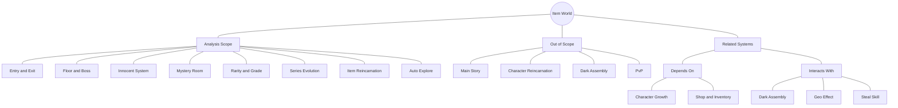
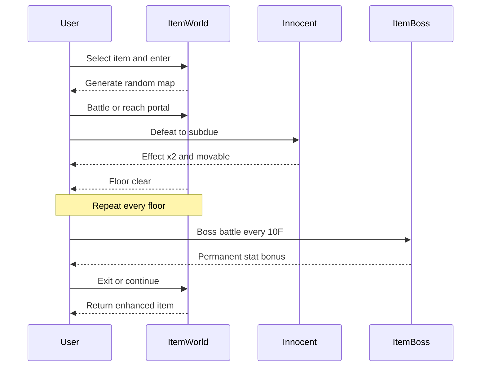
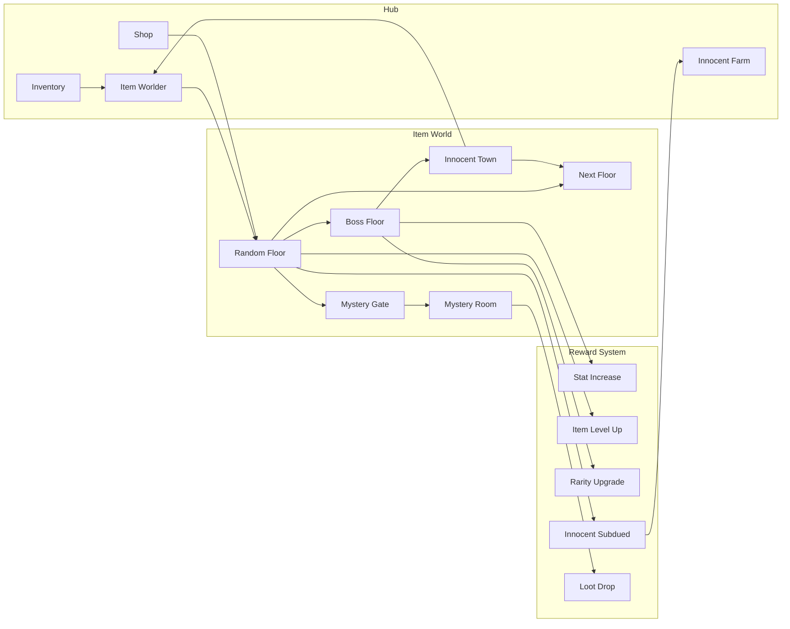
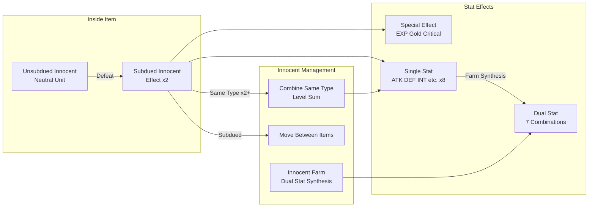
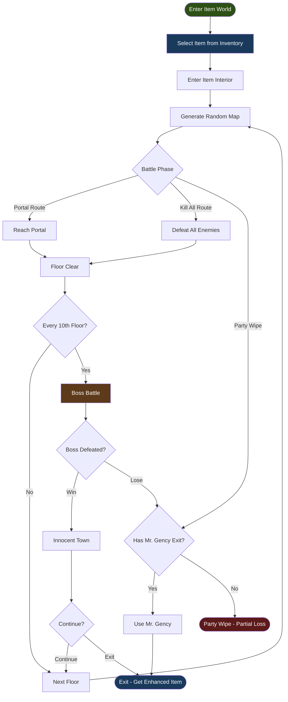
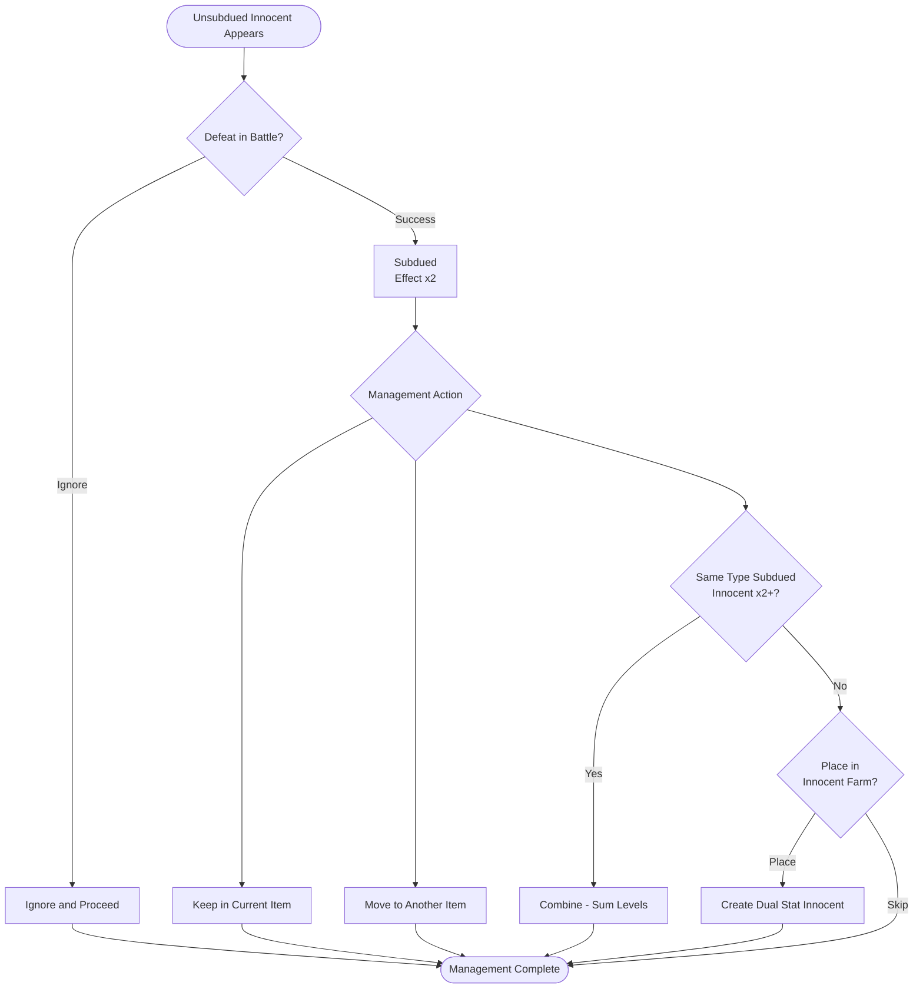
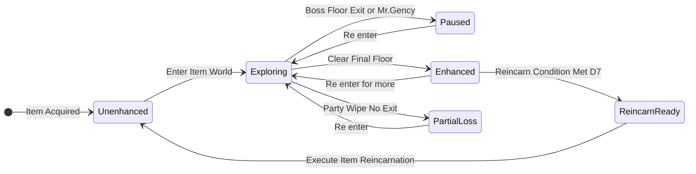
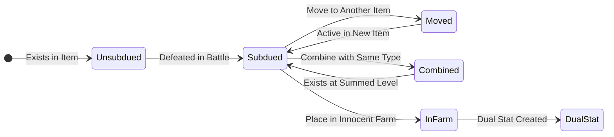
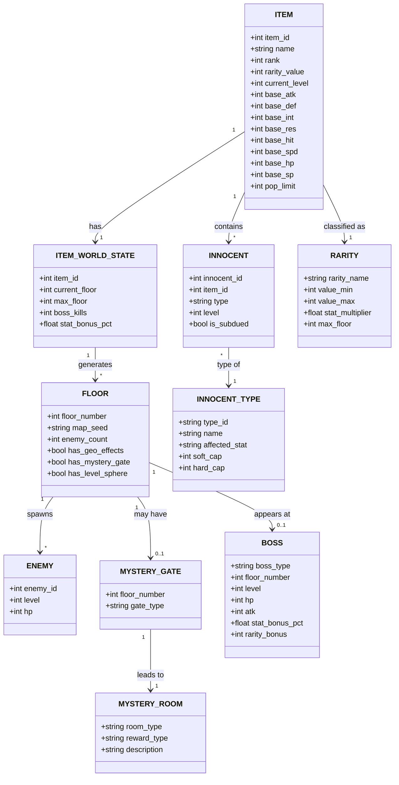
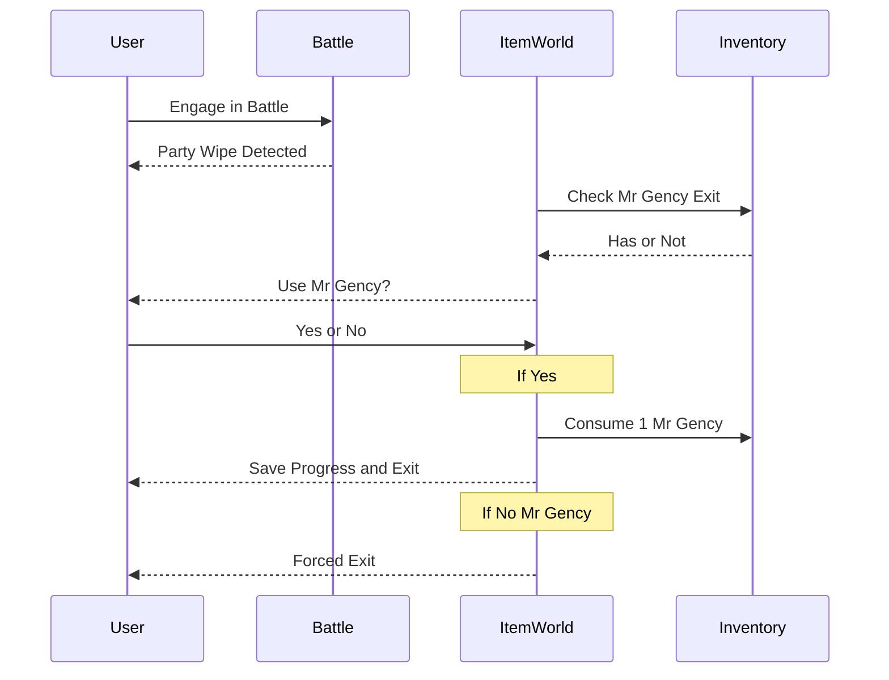

# 디스가이아 아이템계(Item World) 역기획서

> **분석 대상:** 마계전기 디스가이아 시리즈 - 아이템계(Item World) 시스템
> **분석 기준:** 디스가이아 5 (Alliance of Vengeance) 중심, 시리즈 전체 진화 포함
> **장르 분류:** SRPG (RPG + 방치형)
> **작성일:** 2026-03-23
> **작성자:** 이용태

---

## 목차

1. [정의서 (Definition)](#1-정의서-definition)
2. [구조도 (Structure Diagram)](#2-구조도-structure-diagram)
3. [플로우차트 (Flowchart)](#3-플로우차트-flowchart)
4. [상세 명세서 (Detail Specification)](#4-상세-명세서-detail-specification)
5. [데이터 테이블 (Data Tables)](#5-데이터-테이블-data-tables)
6. [예외 처리 명세 (Exception Handling)](#6-예외-처리-명세-exception-handling)
7. [비교 분석 보고서 (Comparison)](#7-비교-분석-보고서-comparison)
8. [웹 리서치 브리프 (Research Brief)](#8-웹-리서치-브리프-research-brief)
9. [수치 분석 (Numerical Analysis)](#9-수치-분석-numerical-analysis)
10. [장르별 추가 분석 (Genre Analysis)](#10-장르별-추가-분석-genre-analysis)

---

# 1. 정의서 (Definition)

## 1.1 시스템 개요

| 항목 | 내용 |
| :--- | :--- |
| 시스템명 | 디스가이아 아이템계 (Disgaea Item World) |
| 한 줄 정의 | 아이템 내부에 진입하여 랜덤 던전을 클리어하며 아이템을 강화하는 시스템 |
| 개발사 | Nippon Ichi Software (NIS) |
| 최초 등장 | Disgaea: Hour of Darkness (2003) |
| 분석 버전 | Disgaea 5: Alliance of Vengeance (2015) 중심 |
| 분석일 | 2026-03-23 |

## 1.2 핵심 목적

| 관점 | 목적 |
| :--- | :--- |
| 유저 관점 | 보유한 아이템을 직접 탐험하고 육성하여 나만의 최강 장비를 완성한다 |
| 사업 관점 | 메인 스토리(30~50시간) 이후 수백 시간의 엔드게임 리텐션을 확보한다 |

## 1.3 용어 정의

| 용어 | 정의 | 비고 |
| :--- | :--- | :--- |
| 아이템계 (Item World) | 아이템 내부에 존재하는 랜덤 생성 던전 | 시리즈 핵심 엔드게임 |
| 이노센트 (Innocent/Specialist) | 아이템에 거주하며 스탯 보너스를 부여하는 NPC | 구작에서는 Specialist로 불림 |
| 복종 (Subdued) | 이노센트를 전투로 격파하여 제어 가능 상태로 만드는 것 | 복종 시 효과 2배 + 이동 가능 |
| 레어리티 (Rarity) | 아이템 등급 (Common/Rare/Legendary/Epic) | 진입 가능 층수 및 스탯 배율 결정 |
| Mr. Gency's Exit | 아이템계 즉시 탈출 소모품 | "Emergency Exit"의 언어유희 |
| 미스터리 룸 (Mystery Room) | 일반 층에 랜덤 등장하는 특수 이벤트 방 | D2에서 최초 도입 |
| 아이템 보스 | 10층마다 등장하는 보스 (장군/왕/신) | 처치 시 아이템 스탯 영구 증가 |
| 역해적 (Reverse Pirating) | 100층 이후 추가 탐험 시스템 | D3에서 도입, D5에서 보너스 스테이지로 대체 |
| 아이템 전생 (Item Reincarnation) | 아이템을 리셋하고 일부 능력을 계승하며 재성장시키는 시스템 | D7에서 도입 |
| 보너스 게이지 (Bonus Gauge) | 층 클리어 시 채워지는 보상 게이지 | 적 처치, 지오 파괴 등으로 충전 |
| 이노센트 팜 (Innocent Farm) | 이노센트를 합성하여 듀얼 스탯 이노센트를 생성하는 시설 | D5에서 도입 |
| 레벨 구슬 (Level Sphere) | 접촉 시 아이템 레벨 +5를 부여하는 오브젝트 | 21층 이후 랜덤 출현 |

## 1.4 분석 범위

### 이 문서에서 다루는 것
- 아이템계의 진입/탐험/탈출 메커니즘
- 층 구조, 보스 체계, 보상 시스템
- 이노센트(레지던트) 시스템 전체
- 미스터리 게이트/미스터리 룸
- 레어리티 및 아이템 등급 시스템
- 시리즈 전체의 시스템 진화 이력 (D1~D7)
- 아이템 전생 시스템 (D7)
- 자동 탐험 시스템 (D6~D7)

### 이 문서에서 다루지 않는 것
- 디스가이아의 메인 스토리 시스템
- 캐릭터 레벨업/전생(Character Reincarnation) 시스템
- 마계의회(Dark Assembly) 시스템
- 개별 캐릭터/직업 밸런스
- PvP/멀티플레이 요소

## 1.5 관련 시스템

| 시스템 | 관계 유형 | 설명 |
| :--- | :--- | :--- |
| 캐릭터 성장 시스템 | 의존 | 아이템계 진행에 캐릭터 전투력이 필요 |
| 마계의회 | 연동 | 아이템 전생(D7), 역해적(D3~D4) 법안 통과 필요 |
| 상점/아이템 획득 | 의존 | 아이템계에 진입할 아이템을 보유해야 함 |
| 지오 이펙트 시스템 | 연동 | 아이템계 맵에 지오 패널/심볼이 랜덤 배치됨 |
| 도둑 스킬 | 연동 | 아이템계 내 적/보스에게서 아이템 도둑질 가능 |

### 분석 범위 & 관련 시스템 마인드맵



## 1.6 대상 유저 행동

| # | 유저 행동 | 빈도 | 설명 |
| :--- | :--- | :--- | :--- |
| 1 | 아이템을 선택하여 아이템계에 진입한다 | 매 세션 | 강화할 아이템을 골라 던전에 들어감 |
| 2 | 랜덤 생성 맵에서 전투하며 층을 클리어한다 | 매 층 | 포탈 도달 또는 적 전멸로 클리어 |
| 3 | 미복종 이노센트를 격파하여 복종시킨다 | 이벤트성 | 아이템 내 NPC를 제어 가능 상태로 변환 |
| 4 | 10층마다 보스를 격파하고 탈출 여부를 결정한다 | 매 10층 | 리스크-리워드 판단의 핵심 지점 |
| 5 | 미스터리 룸에서 특수 이벤트를 경험한다 | 랜덤 | 점술사, 보물방, 쇼핑몰 등 서프라이즈 요소 |

### 핵심 인터랙션 요약



## 1.7 시스템 배경 맥락

디스가이아는 "마계"를 배경으로 한 코믹 SRPG 시리즈로, "레벨 9999", "데미지 수십억" 등 극단적 수치 인플레이션이 게임의 정체성이다. 아이템계는 이 무한 성장의 핵심 동력으로, "아이템 안에 세계가 있다"는 독특한 세계관적 설정이 메커니즘과 결합된 시리즈의 상징적 시스템이다.

---

# 2. 구조도 (Structure Diagram)

## 2.1 아이템계 전체 시스템 구조



> **범례:** 실선 = 필수 흐름, 점선 = 조건부/랜덤 흐름. 원통형 = 데이터 저장소.

## 2.2 이노센트 시스템 구조



---

# 3. 플로우차트 (Flowchart)

## 3.1 아이템계 메인 플로우



## 3.2 이노센트 복종 & 관리 플로우



---

# 4. 상세 명세서 (Detail Specification)

## 4.1 UI 레이아웃

### 아이템계 진입 화면

| 영역 | 구성 요소 | 설명 |
| :--- | :--- | :--- |
| 좌측 | 아이템 리스트 (스크롤) | 인벤토리/창고의 모든 아이템 표시 |
| 중앙 | 선택 아이템 상세 정보 | 이름, 스탯, 레어리티, 현재 이노센트 목록 |
| 우측 | 아이템계 정보 | 현재 층수, 이전 진행 상황, 진입 버튼 |
| 하단 | 파티 편성 | 출격 캐릭터 배치 (최대 10명) |

### 전투 화면 (아이템계 내부)

| 영역 | 구성 요소 | 설명 |
| :--- | :--- | :--- |
| 중앙 | 아이소메트릭 전투 맵 | 랜덤 생성 지형 + 지오 패널/심볼 |
| 좌상 | 층 정보 | 현재 층수 / 최대 층수 |
| 우상 | 보너스 게이지 | 적 처치/지오 파괴 시 충전 |
| 하단 | 커맨드 메뉴 | 이동/공격/스킬/아이템/대기 |
| 우하 | 미니맵 | 포탈 위치, 적 위치 표시 |

### 이노센트 타운 (10층마다)

| 영역 | 구성 요소 | 설명 |
| :--- | :--- | :--- |
| NPC 1 | 상점 | 회복 아이템, Mr. Gency Exit 판매 |
| NPC 2 | 이노센트 관리 | 복종 이노센트 이동/합체 |
| NPC 3 | 루트 선택 (D5) | 다음 구간의 탐험 루트 선택 (일반/미스터리/이노센트) |
| 출구 | 탈출 포탈 | 아이템계 종료, 진행 상황 저장 |

## 4.2 인터랙션 상세

### 층 클리어 방법

| 방법 | 입력 | 조건 | 결과 |
| :--- | :--- | :--- | :--- |
| 포탈 도달 | 캐릭터를 포탈 위치로 이동 | 아군 1명 이상 포탈 도달 | 즉시 다음 층으로 이동 |
| 적 전멸 | 모든 적 처치 | 맵 내 적 0명 | 보너스 게이지 최대 + 다음 층 |
| 미스터리 게이트 진입 | 게이트 위치로 이동 | 랜덤 출현한 게이트 존재 | 미스터리 룸 이동 |

### 보너스 게이지 메커니즘

| 충전 행동 | 게이지 증가량 | 비고 |
| :--- | :--- | :--- |
| 적 1체 처치 | +1~3 | 적 레벨에 비례 |
| 지오 심볼 파괴 | +2~5 | 체인 콤보 시 추가 |
| 지오 체인 | 파괴 수 x 배율 | 대규모 체인 시 대량 충전 |
| 콤보 공격 | +1/히트 | 다중 타격 시 |

### 보너스 게이지 보상 (Rank 순)

| Rank | 보상 | 설명 |
| :---: | :--- | :--- |
| 1 | Mr. Gency's Exit | 탈출 아이템 확정 지급 |
| 2 | Legendary 장비 | 랜덤 레전드 등급 아이템 |
| 3 | 이노센트 | 랜덤 이노센트 복종 상태로 획득 |
| 4~8 | 아이템/재화 | 등급 하락하며 다양한 보상 |
| 9 | 아이템 레벨 + | 진행 중인 아이템 레벨 증가 |

## 4.3 상태 전이

### 아이템 상태 전이



### 이노센트 상태 전이



## 4.4 사운드 & 연출

| 트리거 | 연출 | 사운드 |
| :--- | :--- | :--- |
| 아이템계 진입 | 소용돌이 이펙트 + 화면 전환 | 워프 효과음 |
| 층 클리어 | 포탈 빛 이펙트 | 승리 징글 (짧은) |
| 보스 등장 | 전용 등장 컷인 + 카메라 줌 | 보스 전용 BGM 전환 |
| 이노센트 복종 | 별 이펙트 + "Subdued!" 텍스트 | 복종 효과음 |
| 미스터리 룸 진입 | 화면 페이드 + 특수 배경 | 미스터리 징글 |
| Mr. Gency 사용 | 탈출 이펙트 | 긴급 탈출 효과음 |
| 레벨 업 | 아이템 발광 이펙트 | 레벨업 효과음 |
| 보너스 게이지 MAX | 게이지 발광 + 텍스트 | 맥시멈 효과음 |

---

# 5. 데이터 테이블 (Data Tables)

## 5.1 ER 다이어그램



## 5.2 아이템 등급 테이블

| 등급 | 영문 | 레어리티 값 (D5) | 스탯 배율 | 최대 층수 (D1~D4) | 최대 층수 (D5~D6) | 최대 층수 (D7) | 이노센트 슬롯 |
| :--- | :--- | :---: | :---: | :---: | :---: | :---: | :---: |
| 일반 | Common | 0~24 | x1.0 | 30 | 무한 | 10 | 4~8 |
| 레어 | Rare | 25~49 | x1.25~1.49 | 60 | 무한 | 20 | 8~12 |
| 레전드 | Legendary | 50~99 | x1.50~1.99 | 100 | 무한 | 30 | 12~16 |
| 에픽 | Epic | 100 | x2.0 | - | 무한 | - | 16 |

## 5.3 아이템 보스 테이블

| 보스 유형 | 출현 층 | 스탯 보너스 | 레어리티 상승 | D7 출현 층 |
| :--- | :--- | :---: | :---: | :---: |
| Item General (장군) | 10, 20, 40, 50, 70, 80 | +5% | +1 | 10 |
| Item King (왕) | 30, 60, 90 | +10% | +2 | 20 |
| Item God (신) | 100 | +20% | +3 | 30 |
| Item God 2 (신 2) | 100 (아이템 Lv 80+) | +20% 이상 | +3 | 500pt 달성 시 |

## 5.4 이노센트(스탯) 테이블

| 이노센트명 | 영문 | 영향 스탯 | 효과 | 소프트 캡 (D5) |
| :--- | :--- | :--- | :--- | :---: |
| 영양사 | Dietician | HP | 레벨당 HP +1 | 50,000 |
| 마스터 | Master | SP | 레벨당 SP +1 | 50,000 |
| 검투사 | Gladiator | ATK | 레벨당 ATK +1 | 50,000 |
| 보초 | Sentry | DEF | 레벨당 DEF +1 | 50,000 |
| 교사 | Tutor | INT | 레벨당 INT +1 | 50,000 |
| 의사 | Physician | RES | 레벨당 RES +1 | 50,000 |
| 명사수 | Marksman | HIT | 레벨당 HIT +1 | 50,000 |
| 코치 | Coach | SPD | 레벨당 SPD +1 | 50,000 |

### 특수 이노센트

| 이노센트명 | 영문 | 효과 | 캡 |
| :--- | :--- | :--- | :---: |
| 스태티스티션 | Statistician | 경험치 획득 +% | 900 (D5) |
| 브로커 | Broker | 판매가 +% | 300 |
| 매니저 | Manager | 마나 획득 +% | 300 |

## 5.5 시리즈별 핵심 수치 비교

| 항목 | D1 | D2 | D3 | D4 | D5 | D6 | D7 |
| :--- | :---: | :---: | :---: | :---: | :---: | :---: | :---: |
| 최대 층수 (Legend) | 100 | 100 | 100 | 100 | 무한 | 무한 | 30 |
| 최대 아이템 레벨 | 100 | 200 | 200 | 300 | 9,999 | 9,999 | 전생 반복 |
| 레벨당 % 보너스 | 5% | 5% | 6.6% | 6.6% | 가변 | 가변 | 가변 |
| 최대 스탯 보너스 | 500% | 1,000% | 1,333% | 2,400% | 레어리티 종속 | 레어리티 종속 | 전생 누적 |
| 미스터리 룸 | X | O | O | O | O (20종+) | O (12종) | O |
| 역해적 | X | X | O | O | X | X | X |
| 자동 탐험 | X | X | X | X | X | O | O |
| 아이템 전생 | X | X | X | X | X | X | O |
| 오토 배틀 | X | X | X | X | X | O (x32) | O (x32) |

## 5.6 스탯 증가 공식

```yaml
# 디스가이아 1~4 (레벨 기반 퍼센트 시스템)
item_stat_formula:
  enhanced_stat: "base_stat x (1 + level x level_bonus_pct) + fixed_bonus x level"
  level_bonus_pct:
    D1: 0.05    # 5%/레벨
    D2: 0.05    # 5%/레벨
    D3: 0.066   # 6.6%/레벨
    D4: 0.066   # 6.6%/레벨
  fixed_bonus: "+1 if base > 0, -1 if base < 0, 0 if base = 0"
  kill_bonus_max:
    D4: 400     # 최대 400레벨 추가 (400%)

# 디스가이아 5 (레어리티 기반 시스템)
rarity_system:
  stat_multiplier: "1.0 + (rarity_value / 100)"
  rarity_range: "0 ~ 100"
  matching_bonus:
    2_items: 0.10  # +10%
    3_items: 0.20  # +20%
    4_items: 0.30  # +30%

# 보스 처치 보너스 (전 시리즈 공통)
boss_bonus:
  item_general: 0.05   # +5%
  item_king: 0.10      # +10%
  item_god: 0.20       # +20%
```

---

# 6. 예외 처리 명세 (Exception Handling)

## 6.1 예외 상황 테이블

| 예외 상황 | 발생 조건 | 시스템 반응 | 유저 피드백 | 우선순위 |
| :--- | :--- | :--- | :--- | :---: |
| 파티 전멸 (탈출 불가) | HP 0 + Mr. Gency 미보유 | 아이템계 강제 퇴장, 보스 처치 보너스만 보존 | "아이템계에서 퇴장합니다" | 높음 |
| 파티 전멸 (탈출 가능) | HP 0 + Mr. Gency 보유 | Mr. Gency 자동 사용 제안 | "Mr. Gency's Exit를 사용하시겠습니까?" | 높음 |
| 이노센트 슬롯 만석 | 복종 이노센트 획득 시 POP 초과 | 기존 이노센트와 교체 또는 포기 선택 | "이노센트 슬롯이 가득 찼습니다" | 중간 |
| 불가능 맵 생성 | 침묵/무적 패널이 전체 맵 점령 | 맵 생성 시 최소 경로 보장 알고리즘 [추정] | 포탈까지의 경로는 항상 존재 | 높음 |
| 아이템 전생 실패 (D7) | 마나 부족 또는 의회 부결 | 전생 불가, 재시도 안내 | "마나가 부족합니다" / "법안이 부결되었습니다" | 중간 |
| 최대 레벨 도달 | 아이템 레벨 상한 도달 | 레벨 증가 중단, 이노센트/보스 보너스는 계속 | 레벨 표시 MAX | 낮음 |
| 자동 탐험 실패 (D6) | AI 파티 전투력 부족 | 자동 탐험 중단, 결과 보고 | "탐험이 중단되었습니다 (N층에서 패배)" | 중간 |
| Mr. Gency 미보유 시 탈출 시도 | 비 보스층에서 탈출 시도 | 탈출 불가 안내 | "탈출은 10의 배수 층 또는 Mr. Gency로만 가능합니다" | 중간 |
| 진행 중 아이템 교환 시도 | 아이템계 진입 중 해당 아이템 사용/판매 시도 | 아이템 잠금 (사용/판매/이동 불가) | "이 아이템은 아이템계 탐험 중입니다" | 높음 |

## 6.2 에지 케이스

| 상황 | 처리 방식 |
| :--- | :--- |
| 이노센트 합체 후 슬롯 초과 | 합체 결과가 POP 한도를 초과하면 합체 자체가 불가 |
| 같은 아이템 동시 탐험 시도 | 1개 아이템에 1개 탐험만 허용 (진입 차단) |
| 0층에서 전멸 | 아이템계 진입 직후 전멸 시에도 보스 보너스 미적용 |
| D7 전생 시 이노센트 처리 | 이노센트는 전생 후에도 보존됨 (레벨/상태 유지) |
| 최하층 보스와 동시 전멸 | 보스 처치 판정 우선 → 보스 보너스 적용 후 퇴장 |

## 6.3 에러 처리 시퀀스 (파티 전멸)



## 6.4 예외 우선순위 매핑

**예외 우선순위 매트릭스 (빈도 vs 영향도)**

|  | 빈도 낮음 | 빈도 중간 | 빈도 높음 |
| :--- | :--- | :--- | :--- |
| **영향도 높음** | Impossible-Map | Party-Wipe-No-Exit, No-Gency-Escape | Item-Locked |
| **영향도 중간** | Reincarnation-Fail | Auto-Explore-Fail | Innocent-Full |
| **영향도 낮음** | | Max-Level | |

---

# 7. 비교 분석 보고서 (Comparison)

## 7.1 비교 대상

| 게임 | 유사 시스템 | 선정 이유 |
| :--- | :--- | :--- |
| Diablo 4 | 리프트(Rift) + 장비 드롭 | 랜덤 던전 파밍의 대표작 |
| Path of Exile | 맵 시스템 + 아이템 크래프팅 | 아이템 직접 개조 시스템의 대표작 |
| 시렌 / 불가사의 던전 | 로그라이크 던전 + 장비 합성 | 같은 일본 로그라이크 전통 |

## 7.2 비교 매트릭스

| 비교 항목 | 디스가이아 아이템계 | Diablo 4 리프트 | Path of Exile 맵 | 시렌 던전 |
| :--- | :--- | :--- | :--- | :--- |
| 핵심 메카닉 | 아이템 내부 진입 + 육성 | 랜덤 던전 + 드롭 | 맵 아이템 소모 + 드롭 | 랜덤 던전 + 합성 |
| 성장 대상 | 기존 아이템 강화 (육성형) | 새 아이템 획득 (교체형) | 새 아이템 획득 + 크래프팅 | 기존 장비 합성 강화 |
| 아이템 애착 | 매우 높음 (수백 시간 투자) | 낮음 (빈번한 교체) | 중간 (크래프팅 투자) | 높음 (합성 투자) |
| 세션 길이 | 유연 (10층 단위 탈출) | 짧음 (1리프트 5~15분) | 중간 (1맵 5~20분) | 긴 세션 (사망 시 리셋) |
| 리스크 | 중간 (Mr. Gency 안전망) | 낮음 (사망 페널티 약함) | 중간 (맵 아이템 소모) | 매우 높음 (전 소실) |
| 랜덤 요소 | 맵 + 이노센트 + 미스터리 룸 | 맵 + 드롭 | 맵 모드 + 드롭 | 맵 + 드롭 + 함정 |
| 메타 진행 | 이노센트 이전/합체 | 파라곤 보드 | Atlas 트리 | 영구 강화 없음 |
| 자동화 | D6+ 오토 배틀 | 없음 | 없음 | 없음 |
| 수익화 | 없음 (패키지 게임) | 시즌 패스 + 코스메틱 | 무료 + 스태시 탭 | 없음 (패키지) |

## 7.3 핵심 인사이트

### 인사이트 1: "교체형 vs 육성형" 아이템 모델

디스가이아의 아이템계는 게임 업계에서 거의 유일한 **"육성형" 아이템 모델**이다. 대부분의 루팅 게임(디아블로, PoE)은 "더 좋은 아이템을 찾는" 교체형 모델인 반면, 디스가이아는 "가진 아이템을 키우는" 모델로 아이템에 대한 감정적 애착과 매몰 비용(sunk cost)을 극대화한다.

**설계 트레이드오프:**
- 육성형: 높은 애착 + 깊은 투자감 vs 신규 아이템의 흥분 감소
- 교체형: 빈번한 도파민(드롭) vs 아이템 무가치감

### 인사이트 2: "공간적 메타포"의 몰입 효과

"아이템 안에 들어간다"는 설정은 단순한 세계관이 아니라 **유저 심리 모델**에 영향을 미친다. 유저는 아이템을 단순한 수치가 아닌 "탐험할 수 있는 세계"로 인식하게 되어, 동일한 랜덤 던전 파밍이라도 체감이 크게 달라진다.

### 인사이트 3: "10층 체크포인트" 리스크 관리

디스가이아의 10층 단위 탈출 시스템은 로그라이크의 "사망 = 전 소실" 긴장감과 일반 RPG의 "안전한 진행"을 절충한 것이다. 시렌처럼 전부 잃지 않으면서도, 디아블로처럼 완전히 안전하지도 않은 **적절한 리스크 구간**을 만든다.

### 인사이트 4: D7의 "짧은 세션 전환"

D7의 30층 + 전생 반복 설계는 모바일/캐주얼 트렌드에 대한 대응이다. 100층 마라톤 대신 30층 스프린트를 반복하되, 전생으로 무한 성장을 보장한다. **동일한 깊이를 더 짧은 루프로 제공**하는 설계 전환이다.

## 7.4 설계 포지셔닝

**아이템 강화 시스템 포지셔닝 (교체형 vs 육성형 / 세션 길이)**

|  | 교체형 (Replace) | 중간 | 육성형 (Growth) |
| :--- | :--- | :--- | :--- |
| **긴 세션** | | Shiren | Disgaea D1~D5 |
| **중간 세션** | | Path of Exile | Disgaea D7 |
| **짧은 세션** | Diablo 4 | Last Epoch | |

---

# 8. 웹 리서치 브리프 (Research Brief)

## 8.1 게임 개요

| 항목 | 내용 |
| :--- | :--- |
| 게임명 | 마계전기 디스가이아 시리즈 (Disgaea Series) |
| 개발사 | Nippon Ichi Software (NIS) |
| 퍼블리셔 | NIS America (해외) / NIS (일본) |
| 장르 | 택티컬 SRPG |
| 플랫폼 | PS2, PS3, PS4, PS5, Switch, PC (시리즈별 상이) |
| 시리즈 기간 | 2003 ~ 현재 (D1~D7) |
| 누적 판매량 | 500만 장 (2021년 7월 기준) |
| 분석 시점 | 2026-03-23 |

## 8.2 시스템 공식 설명

아이템계(Item World)는 디스가이아 시리즈 전작에 등장하는 핵심 엔드게임 콘텐츠로, 아이템 내부에 존재하는 랜덤 생성 던전이다. 유저는 아이템 내부에 진입하여 층을 클리어하며, 아이템의 스탯을 영구적으로 강화하고, 내부에 거주하는 이노센트(Innocent)를 복종시켜 추가 능력치를 확보한다.

> 출처: [Gamer Guides - Disgaea 5 Item World Overview](https://www.gamerguides.com/disgaea-5-alliance-of-vengeance/guide/extras/item-world/overview) [신뢰도: A]

## 8.3 핵심 메카닉 데이터

| 메카닉 | 수치 | 출처 | 신뢰도 |
| :--- | :--- | :--- | :---: |
| 레벨당 스탯 보너스 (D1~D2) | 5%/레벨 | Steam Guide - D2 | B |
| 레벨당 스탯 보너스 (D3~D4) | 6.6%/레벨 | Steam Guide - D4 | B |
| D4 킬 보너스 최대 | 400레벨 (+400%) | Steam Guide - D4 | B |
| D4 최대 총 보너스 | 2,400% | Steam Guide - D4 | B |
| D5 레어리티 범위 | 0~100 | Gamer Guides - D5 | A |
| D5 이노센트 소프트 캡 | 50,000/타입 | Gamer Guides - D5 | A |
| D5 Statistician 캡 | 900 | Gamer Guides - D5 | A |
| 보스 스탯 보너스 (장군) | +5% | Gamer Guides - D5 | A |
| 보스 스탯 보너스 (왕) | +10% | Gamer Guides - D5 | A |
| 보스 스탯 보너스 (신) | +20% | Gamer Guides - D5 | A |
| D7 전생 비용 | 마나 1,000 | TheGamer - D7 | A |

## 8.4 업데이트 이력 (시리즈 진화)

| 날짜 | 시리즈 | 변경 내용 | 영향도 |
| :--- | :--- | :--- | :---: |
| 2003 | D1 | 아이템계 원형 확립 (30/60/100층, 스페셜리스트) | 높음 |
| 2006 | D2 | 미스터리 게이트/룸 도입, 해적 시스템 | 높음 |
| 2008 | D3 | 역해적(Reverse Pirating) 도입, 6.6%/레벨 상향 | 중간 |
| 2011 | D4 | 최대 레벨 300, 킬 보너스(+400%), 총 2,400% | 중간 |
| 2015 | D5 | 무한 층, 레어리티 0~100, 이노센트 팜, 보너스 스테이지 | 높음 |
| 2021 | D6 | 자동 탐험(Item Research Division), 오토 배틀 x32 | 높음 |
| 2023 | D7 | 30층 복귀, 아이템 전생, 짧은 세션 설계 | 높음 |

## 8.5 커뮤니티 반응

**긍정적 피드백:**
- "아이템 하나하나에 세계가 있다는 설정이 매력적" [B]
- "30분만 들어가도 달콤한 전리품과 레벨업을 얻을 수 있다" [A - PlayStation Blog]
- "미스터리 룸의 서프라이즈가 탐험의 핵심 동기" [B]
- "무한 성장 가능성이 수백 시간의 리플레이를 보장" [B]

**부정적 피드백:**
- "D5 이후 너무 쉬워졌다. 적을 밟고 지나갈 수 있다" [B - Steam]
- "평지 위주 맵으로 전략성이 사라졌다" [B - Steam]
- "침묵/무적 패널이 전체 맵을 덮는 불합리한 상황 발생" [B - Steam]
- "D6 오토 배틀이 게임을 방치 게임으로 변질시켰다" [B - GameRant]

## 8.6 수익 데이터

| 항목 | 수치 | 출처 | 신뢰도 |
| :--- | :--- | :--- | :---: |
| 시리즈 누적 판매 | 500만 장 | Siliconera | A |
| D7 초기 판매 (일본) | 5만 장 | Gematsu | A |
| NIS 연간 매출 | 약 274억 원 ($27.4M) | PitchBook | B |
| 디스가이아 RPG (모바일) | 2023년 5월 서비스 종료 | Wikipedia | A |
| 모바일 아이템계 수익화 | 스태미나 미소모 (간접 과금만) | Gamesforum | B |

## 8.7 경쟁작 정보

| 게임 | 유사 시스템 | 핵심 차이점 |
| :--- | :--- | :--- |
| Diablo 4 | 리프트 + 장비 드롭 | 교체형 모델, 아이템 드롭 중심 |
| Path of Exile | 맵 시스템 + 크래프팅 | 외부에서 재료 소비하여 아이템 개조 |
| 시렌/불가사의 던전 | 로그라이크 + 장비 합성 | 사망 시 전 소실, 높은 리스크 |
| 팬텀 브레이브/마카이 킹덤 | NIS 자사작 유사 철학 | "아이템 내 던전" 개념은 디스가이아 독점 |

## 8.8 리서치 메타데이터

- **총 검색 쿼리 수**: 30+ (3개 에이전트 병렬)
- **수집 성공 카테고리**: 기본정보, 메커니즘, 커뮤니티, 수익, 경쟁작
- **데이터 부족 영역**: D5~D7 정밀 수치 공식 (비공개)
- **전체 신뢰도 평균**: 3.8/5 (B+)

---

# 9. 수치 분석 (Numerical Analysis)

## 9.1 성장 곡선 분석

### 아이템 레벨에 따른 스탯 성장 (D1~D4 퍼센트 시스템)

아이템계의 스탯 성장은 **선형 모델**을 기본으로 한다.

```
강화 스탯 = 기본 스탯 x (1 + Level x Rate)

D1/D2: Rate = 0.05 (5%/레벨)
D3/D4: Rate = 0.066 (6.6%/레벨)
```

### 시리즈별 최대 스탯 배율 (기본 스탯 대비)

| 레벨 | D1 (5%) | D2 (5%) | D3 (6.6%) | D4 (6.6% + Kill) |
| :---: | :---: | :---: | :---: | :---: |
| 1 | x1.05 | x1.05 | x1.066 | x1.066 |
| 10 | x1.50 | x1.50 | x1.66 | x1.66 |
| 50 | x3.50 | x3.50 | x4.30 | x4.30 |
| 100 | x6.00 | x6.00 | x7.60 | x7.60 |
| 200 | - | x11.00 | x14.20 | x14.20 |
| 300 | - | - | - | x20.80 |
| 300+Kill400 | - | - | - | x24.80 |

> **분석:** D1~D4의 성장 곡선은 순수 **선형 모델**(y = ax + b)을 따른다. R^2 = 1.0. 레벨과 스탯 증가가 정비례하며, 지수적 폭발 없이 예측 가능한 성장을 제공한다.

### 시리즈별 최대 스탯 배율 비교

```
D1: ████████████████████████████░░ x6.0 (Lv100)
D2: ████████████████████████████████████████████████████░░ x11.0 (Lv200)
D3: ██████████████████████████████████████████████████████████████████████░░ x14.2 (Lv200)
D4: ████████████████████████████████████████████████████████████████████████████████████████████████████░ x24.8 (Lv300+Kill400)
```

### D5 레어리티 기반 시스템

D5부터는 레벨 기반 퍼센트 시스템 대신 **레어리티 값**이 스탯 배율을 결정한다.

| 레어리티 값 | 등급 | 스탯 배율 | 4개 매칭 보너스 포함 |
| :---: | :--- | :---: | :---: |
| 0 | Common (최하) | x1.00 | x1.30 |
| 25 | Rare (최하) | x1.25 | x1.55 |
| 50 | Legendary (최하) | x1.50 | x1.80 |
| 75 | Legendary (상위) | x1.75 | x2.05 |
| 100 | Epic (최상) | x2.00 | x2.30 |

## 9.2 경제 순환 분석

### 아이템계 경제 흐름 (유입/유출)

**유입 (Source):**

| 유입원 | 획득 자원 | 빈도 |
| :--- | :--- | :--- |
| 층 클리어 | 아이템 스탯 증가 (영구) | 매 층 |
| 보스 처치 | 스탯 +5~20% 보너스 (영구) | 매 10층 |
| 이노센트 복종 | 이노센트 효과 2배 + 이동권 | 랜덤 |
| 보너스 게이지 | Mr. Gency, 장비, 이노센트 | 매 층 누적 |
| 미스터리 룸 | 레벨+10, 레전드 장비, 특수 이노센트 | 랜덤 |
| 레벨 구슬 | 아이템 레벨 +5 | 랜덤 (21층+) |

**유출 (Sink):**

| 유출처 | 소모 자원 | 빈도 |
| :--- | :--- | :--- |
| Mr. Gency Exit 소모 | 소모품 1개 | 탈출 시 |
| 파티 전멸 | 미저장 진행도 손실 | 사고 시 |
| 아이템 전생 (D7) | 아이템 레벨 리셋 + 마나 1,000 | 전생 시 |
| 이노센트 팜 투자 | 시간 (실시간 대기) | 듀얼 합성 시 |
| 회복 아이템 | HL (게임 내 화폐) | 이노센트 타운 |

### 순환 구조

```
[아이템 강화 루프]
아이템 획득 → 아이템계 진입 → 층 클리어 (스탯 증가)
    → 이노센트 복종 (능력치 추가) → 보스 격파 (보너스)
    → 더 강한 아이템계 진입 가능 → 반복

[이노센트 관리 루프]
이노센트 복종 → 아이템 간 이동 → 최적 조합 배치
    → 이노센트 팜 합성 → 듀얼 스탯 생성 → 반복

[D7 전생 루프]
30층 클리어 → 전생 조건 충족 → 의회 법안 통과
    → 능력 일부 계승 + Lv1 리셋 → 재탐험 → 반복
```

### 핵심 밸런싱 장치

| 장치 | 기능 | 설계 의도 |
| :--- | :--- | :--- |
| 층수 제한 (등급별) | Common 30, Rare 60, Legend 100 | 등급별 성장 천장 차등화 |
| 이노센트 소프트 캡 | 단일 타입 50,000 | 무한 스케일링 방지 |
| Mr. Gency 소모품 | 유한 자원으로 탈출 관리 | 탐험 리스크 유지 |
| 보스 난이도 스케일링 | 층수 x 아이템 랭크 비례 | 적정 전투력 요구 |
| D7 전생 리셋 | 레벨 1로 초기화 | 짧은 루프 반복 유도 |

## 9.3 확률 시뮬레이션 (미스터리 룸)

### 미스터리 게이트 출현 기대값 (D5 기준)

미스터리 게이트 출현 확률을 약 10~20%/층으로 추정할 때 [추정]:

| 탐험 구간 | 총 층수 | 기대 출현 횟수 (10%) | 기대 출현 횟수 (20%) |
| :--- | :---: | :---: | :---: |
| Common (30층) | ~27 (보스층 제외) | 2.7회 | 5.4회 |
| Rare (60층) | ~54 | 5.4회 | 10.8회 |
| Legend (100층) | ~90 | 9.0회 | 18.0회 |

### 점술사(Fortune Teller) 기대값

| 결과 | 레벨 변동 | 확률 [추정] | 기대값 |
| :--- | :---: | :---: | :---: |
| 대길 | +10 | 25% | +2.5 |
| 길 | +3 | 50% | +1.5 |
| 흉 | -3 ~ -5 | 25% | -1.0 |
| **총 기대값** | | | **+3.0/방문** |

---

# 10. 장르별 추가 분석 (Genre Analysis)

## 10.1 RPG 성장 밸런스 분석

### 경험치 곡선 유형

디스가이아 아이템계의 아이템 성장은 **단순 선형 모델**을 채택한다.

| 성장 모델 | 공식 | 디스가이아 적용 |
| :--- | :--- | :--- |
| 선형 | y = ax + b | D1~D4: 레벨당 고정 %  증가 |
| 계단식 | 구간별 고정값 | D5: 레어리티 구간별 배율 |
| 반복 리셋 | 레벨 리셋 + 일부 계승 | D7: 아이템 전생 |

### 성장 설계 철학 진화

```
D1(2003): 단순 선형 — "레벨 올리면 강해진다"
  |
D2~D4(2006~2011): 확장 선형 — "더 많이 올리면 더 강해진다" (상한 확대)
  |
D5(2015): 메타 전환 — "레벨보다 레어리티가 중요하다" (질적 차별화)
  |
D6(2021): 자동화 — "AI가 대신 올려준다" (접근성)
  |
D7(2023): 반복 리셋 — "짧게 여러 번 키운다" (세션 최적화)
```

### 성장 밸런스 핵심 지표

| 지표 | D1~D4 | D5 | D7 |
| :--- | :--- | :--- | :--- |
| 1회 탐험 스탯 증가율 | 30~100% (Common 30층) | 레어리티 의존 | 전생 누적 |
| 최종 목표 도달 시간 | 50~200시간 | 100~500시간 | 30~100시간 (전생 반복) |
| 성장 체감 주기 | 매 10층 (보스 보너스) | 매 층 (연속적) | 매 전생 (30층 주기) |
| 성장 정체 구간 | 거의 없음 (선형) | 레어리티 상한 근처 | 전생 간 성장 체감 감소 |

## 10.2 방치형 시간 효율 분석

### 시리즈별 시간 효율 비교

| 시리즈 | 30층 소요 | 100층 소요 | 층당 평균 | 자동화 수준 |
| :--- | :---: | :---: | :---: | :--- |
| D1~D4 (수동) | 30~60분 | 2~4시간 | 1~3분 | 완전 수동 |
| D5 (수동) | 20~45분 | 1.5~3시간 | 1~2분 | 수동 (스킵 가능) |
| D5 (최적화) | 15~25분 | 50분~1.5시간 | 30초~1분 | 수동 (원턴킬) |
| D6 (오토 x32) | 10~20분 | 30분~1시간 | 20~40초 | 반자동 (AI 설정) |
| D7 (오토 x32) | 10~15분 | - (30층 상한) | 20~30초 | 반자동 (AI 프리셋) |

### D6/D7 오토 배틀 시스템

**AI 커스터마이징 요소:**
- 이동 우선순위 (적 접근 / 포탈 접근 / 이노센트 접근)
- 스킬 사용 조건 (HP 비율, 적 수, 속성 약점)
- 타겟 선택 (가장 가까운 적 / 가장 약한 적 / 보스 우선)
- 회복 조건 (HP N% 이하 시 힐링)

**배속 옵션:** x2, x4, x8, x16, x32

> x32 배속 시 30층 전체를 약 10~15분에 완료할 수 있어, 실질적으로 **방치 플레이**가 가능하다. 다만 콘솔 성능에 따라 프레임 드롭이 발생할 수 있다.

### 아이템 최대 강화까지 시간 투자

| 목표 | 소요 시간 (D5 수동) | 소요 시간 (D6 오토) | 소요 시간 (D7 오토) |
| :--- | :---: | :---: | :---: |
| 기본 강화 (30층) | 30분~1시간 | 10~20분 | 10~15분 |
| Legend 100층 완료 | 2~4시간 | 30분~1시간 | - |
| 이노센트 최적화 포함 | 10~20시간 | 3~8시간 | 5~15시간 (전생 반복) |
| 완전 최적화 (1개) | 30~50시간+ | 10~20시간 | 15~30시간 (전생 다수) |

### 방치형 설계 관점 평가

| 평가 항목 | D1~D5 | D6~D7 | 평가 |
| :--- | :--- | :--- | :--- |
| 방치 가능성 | 불가능 (수동 필수) | 가능 (AI + x32) | D6에서 패러다임 전환 |
| 시간당 보상 | 고정적 (선형) | AI 최적화에 의존 | AI 셋업이 핵심 |
| 세션 유연성 | 10층 단위 탈출 | 30층 전체 자동 | D7이 가장 유연 |
| 전략적 개입 필요성 | 매 턴 | AI 설정 시에만 | 방치와 개입의 균형 |

---

# 부록: 설계 의도 분석

## 5가지 관점별 설계 의도

### 수익화 관점

| 기능 | 설계 의도 | 기대 효과 |
| :--- | :--- | :--- |
| 무한 성장 시스템 | 패키지 가격 대비 "수백 시간 플레이" 가치 제안 | 구매 정당화 + 입소문 |
| 아이템계 스태미나 없음 (모바일) | 원작 팬 충성도 유지 | 팬 이탈 방지 (수익화 실패 원인이기도) |
| 시리즈 반복 구매 | 매 시리즈마다 새로운 아이템계 변형 | 시리즈 충성 고객 유지 |

### 리텐션 관점

| 기능 | 설계 의도 | 기대 효과 |
| :--- | :--- | :--- |
| 포스트게임 핵심 콘텐츠 | 메인 스토리 이후 수백 시간 콘텐츠 제공 | 플레이타임 4~20배 확장 |
| 매몰 비용(Sunk Cost) 효과 | 아이템에 수십 시간 투자 → 게임 이탈 저항 | 장기 리텐션 |
| 미스터리 룸 서프라이즈 | 예측 불가능한 보상으로 탐험 동기 유지 | "한 층만 더" 심리 |
| 10층 체크포인트 | 짧은 세션~마라톤 세션 모두 대응 | 다양한 플레이 스타일 수용 |

### UX 관점

| 기능 | 설계 의도 | 기대 효과 |
| :--- | :--- | :--- |
| 점진적 복잡도 공개 | 처음에는 단순 전투 → 이노센트/미스터리 룸 점진 노출 | 정보 과부하 방지 |
| 보너스 게이지 시각화 | 적 처치/지오 파괴의 보상을 즉각 시각화 | 행동-보상 연결 강화 |
| D7 전생 UI | 3개 선택지 + 시각적 비교 | 의사결정 간소화 |
| 오토 배틀 (D6+) | AI 설정 한 번이면 반복 불필요 | 번아웃 방지 |

### 밸런싱 관점

| 기능 | 설계 의도 | 기대 효과 |
| :--- | :--- | :--- |
| 등급별 층수 제한 (D1~D4) | 상위 등급 아이템일수록 더 깊이 탐험 가능 | 아이템 등급 가치 차등화 |
| 이노센트 캡 | 단일 스탯 50,000, 특수 이노센트 300~900 | 무한 인플레이션 방지 |
| 보스 스케일링 | 아이템 랭크 x 층수 비례 | 적정 전투력 요구 |
| Mr. Gency 소모품 | 유한 자원으로 탈출 관리 | 모험 리스크 유지 |

### 소셜 관점

| 기능 | 설계 의도 | 기대 효과 |
| :--- | :--- | :--- |
| 최강 아이템 자랑 | 극한 강화 아이템 = 수백 시간 투자의 증거 | 커뮤니티 "자랑" 콘텐츠 |
| "폐인전기" 별명 | 극단적 플레이타임이 브랜드 정체성 | 하드코어 커뮤니티 형성 |
| 공략/가이드 생태계 | 복잡한 시스템이 공략 수요 창출 | 커뮤니티 자생적 콘텐츠 |
| 아이템 전생 공유 (D7) | 전생 빌드/선택 공유 문화 | SNS/커뮤니티 화제성 |

---

# 부록: 검증 체크리스트

## 구현 가능성 검증

- [x] 시스템의 전체 윤곽을 이 문서만으로 이해할 수 있는가?
- [x] 용어 정의 없이 이해 불가능한 단어가 본문에 없는가?
- [x] 모든 상태 전이에 조건이 명시되어 있는가?
- [x] 예외 상황에 시스템 반응이 정의되어 있는가?
- [x] 수치 데이터에 출처와 신뢰도가 표기되어 있는가?
- [x] Mermaid 다이어그램이 구조를 정확히 표현하는가?
- [x] 비교 분석에서 차별점이 명확히 도출되었는가?
- [x] 설계 의도가 "기능 → 의도 → 효과" 구조로 정리되었는가?

## 데이터 검증

- [x] 최소 3개 카테고리에서 데이터 수집 완료
- [x] 핵심 수치 데이터 10개 이상 확보
- [x] [추정] 표기가 필요한 항목에 표기됨
- [x] 시리즈 간 수치 비교 테이블 포함
- [x] 성장 곡선 분석 포함 (RPG 장르)
- [x] 시간 효율 분석 포함 (방치형 장르)

---

# 출처 종합

| 출처 | URL | 신뢰도 |
| :--- | :--- | :---: |
| Gamer Guides - Disgaea 5 Overview | https://www.gamerguides.com/disgaea-5-alliance-of-vengeance/guide/extras/item-world/overview | A |
| Gamer Guides - Disgaea 5 Innocents | https://www.gamerguides.com/disgaea-5-alliance-of-vengeance/guide/extras/item-world/innocents | A |
| Gamer Guides - Disgaea 5 Mystery Rooms | https://www.gamerguides.com/disgaea-5-alliance-of-vengeance/guide/extras/item-world/mystery-rooms | A |
| Gamer Guides - Disgaea 6 Item World | https://www.gamerguides.com/disgaea-6-complete/guide/item-world/overview/what-is-the-item-world | A |
| Gamer Guides - Disgaea 6 Mystery Rooms | https://www.gamerguides.com/disgaea-6-complete/guide/item-world/overview/list-of-mystery-rooms | A |
| TheGamer - Disgaea 7 Item Reincarnation | https://www.thegamer.com/disgaea-7-item-reincarnation-explained-unlock/ | A |
| StrategyWiki - Disgaea 1 Item World | https://strategywiki.org/wiki/Disgaea:_Hour_of_Darkness/Item_World | A |
| Steam Guide - Disgaea 2 Item Leveling | https://steamcommunity.com/sharedfiles/filedetails/?id=855734889 | B |
| Steam Guide - Disgaea 4 Tips | https://steamcommunity.com/sharedfiles/filedetails/?id=2236367118 | B |
| PlayStation Blog - Disgaea 5 | https://blog.playstation.com/2015/10/06/why-disgaea-5-will-be-your-most-played-game-this-year/ | A |
| GameRant - Disgaea 6 Best/Worst | https://gamerant.com/disgaea-6-best-worst-features/ | B |
| Siliconera - Disgaea 5M Sales | https://www.siliconera.com/disgaea-series-sales-5-million-units-worldwide/ | A |
| Gematsu - Disgaea 7 Sales | https://www.gematsu.com/2023/02/disgaea-7-vows-of-the-virtueless-shipments-and-digital-sales-top-50000 | A |
| Wikipedia - Disgaea RPG | https://en.wikipedia.org/wiki/Disgaea_RPG | A |
| Neoseeker - Disgaea 2 Item World | https://disgaea.neoseeker.com/wiki/Item_World_(Disgaea_2) | B |
| GameFAQs - Disgaea 7 Forums | https://gamefaqs.gamespot.com/boards/378248-disgaea-7-vows-of-the-virtueless/80595611 | B |
| Steam - Item World Discussion | https://steamcommunity.com/app/803600/discussions/0/2686880925147654590/ | B |
| 나무위키 - 마계전기 디스가이아 | https://namu.wiki/w/마계전기%20디스가이아 | B |
