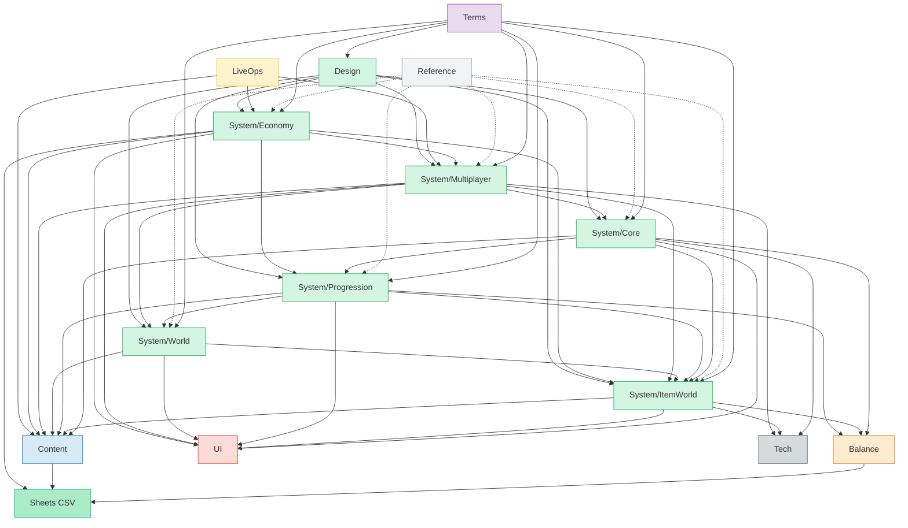
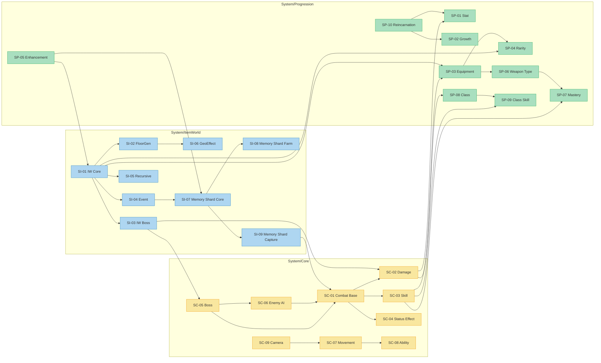
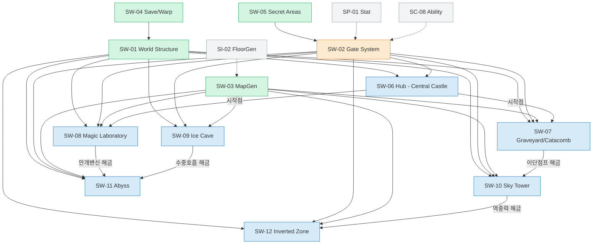
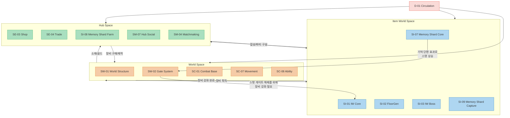
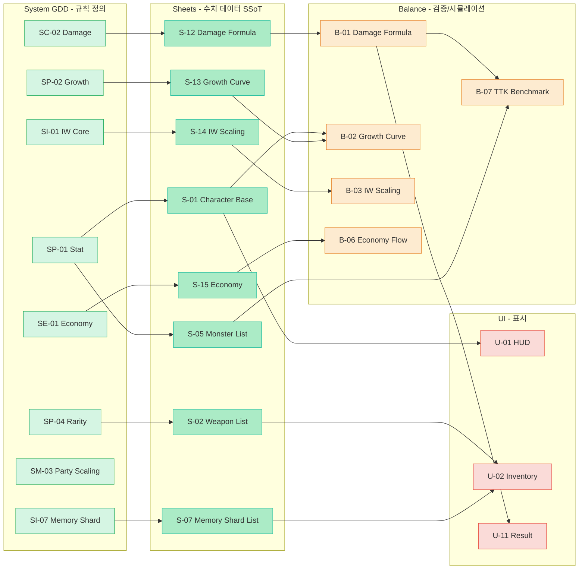
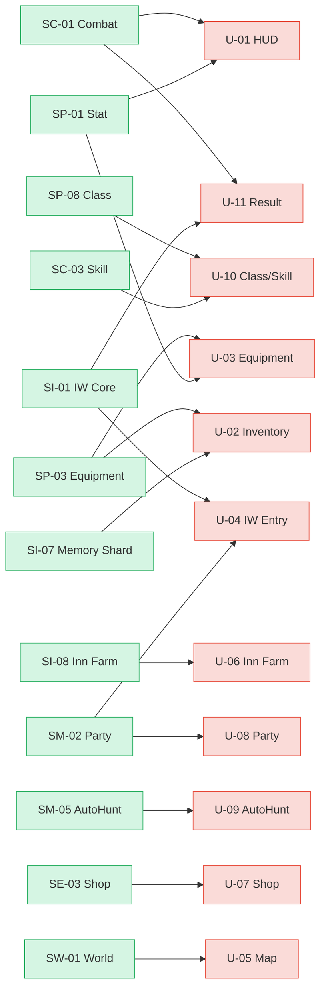
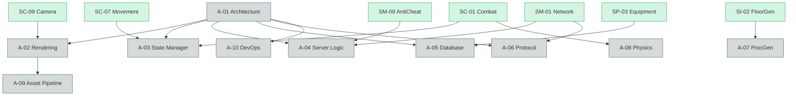

# 문서 의존성 맵 (Document Dependency Map)

> 작성일: 2026-03-23
> 이 문서는 전체 GDD 문서 간의 참조/의존 관계를 시각화합니다.

---

## 1. 전체 구조 의존성 (Top-Level)

모든 문서의 최상위 흐름입니다. Terms가 모든 문서의 기반이 되고, System이 중심축이며, Content/Balance/UI/Tech가 System을 참조합니다.

---

## 2. System 내부 의존성 (Core ↔ ItemWorld ↔ Progression ↔ World ↔ Multiplayer ↔ Economy)

시스템 문서 간의 상세 참조 관계입니다. 화살표 방향은 "참조하는 쪽 → 참조받는 쪽"입니다.

---

## 3. World/Zone 의존성

월드 구조와 개별 존 문서의 관계입니다.

---

## 4. 3-Space 순환 의존성

World ↔ Item World ↔ Hub 순환 구조에서 문서가 어떻게 연결되는지 보여줍니다.

---

## 5. GDD → CSV → Balance 데이터 흐름

수치 데이터가 어떻게 흐르는지 보여줍니다.

---

## 6. Content 문서 의존성

콘텐츠 문서가 어떤 시스템 문서를 참조하는지 보여줍니다.

```mermaid
flowchart TD
    classDef sys fill:#d5f5e3,stroke:#27ae60
    classDef cnt fill:#d6eaf8,stroke:#2980b9

    SC01[SC-01 Combat]:::sys
    SC03[SC-03 Skill]:::sys
    SC05[SC-05 Boss]:::sys
    SI01[SI-01 IW Core]:::sys
    SI06[SI-06 GeoEffect]:::sys
    SI07[SI-07 Memory Shard]:::sys
    SP03[SP-03 Equipment]:::sys
    SP06[SP-06 Weapon Type]:::sys
    SP08[SP-08 Class]:::sys
    SP09[SP-09 Class Skill]:::sys
    SE03[SE-03 Shop]:::sys
    SW03[SW-03 MapGen]:::sys

    C01[C-01 Monster List]:::cnt
    C02[C-02 Boss Detail]:::cnt
    C03[C-03 Weapon List]:::cnt
    C04[C-04 Armor List]:::cnt
    C05[C-05 Accessory List]:::cnt
    C06[C-06 Memory Shard List]:::cnt
    C07[C-07 Skill List]:::cnt
    C08[C-08 Evility List]:::cnt
    C09[C-09 Class List]:::cnt
    C10[C-10 Consumable]:::cnt
    C11[C-11 Room Template]:::cnt
    C12[C-12 GeoEffect List]:::cnt
    C13[C-13 Quest List]:::cnt
    C15[C-15 NPC List]:::cnt

    SC01 --> C01
    SC05 --> C02
    SP06 --> C03
    SP03 --> C04 & C05
    SI07 --> C06
    SC03 & SP09 --> C07
    SP09 --> C08
    SP08 --> C09
    SE03 --> C10 & C15
    SW03 & SI01 --> C11
    SI06 --> C12
    SE03 --> C13
```

---

## 7. UI 문서 의존성

각 UI 화면이 어떤 시스템/데이터를 참조하는지 보여줍니다.

---

## 8. Tech 문서 의존성

기술 문서가 어떤 시스템 문서의 구현 요구사항을 참조하는지 보여줍니다.

---

## 9. Phase별 문서 작성 의존 순서

어떤 문서를 먼저 작성해야 다음 문서를 쓸 수 있는지 보여줍니다.

```mermaid
flowchart TD
    classDef p1 fill:#f9e79f,stroke:#f39c12
    classDef p2 fill:#aed6f1,stroke:#2e86c1
    classDef p3 fill:#a9dfbf,stroke:#27ae60
    classDef p4 fill:#d2b4de,stroke:#8e44ad

    subgraph Phase1 [Phase 1: MVP 핵심 12개]
        T01[T-01 Vision]:::p1
        SC01[SC-01 Combat Base]:::p1
        SC02[SC-02 Damage]:::p1
        SC07[SC-07 Movement]:::p1
        SC09[SC-09 Camera]:::p1
        SI01[SI-01 IW Core]:::p1
        SI02[SI-02 FloorGen]:::p1
        SP01[SP-01 Stat]:::p1
        SP03[SP-03 Equipment]:::p1
        SW01[SW-01 World Structure]:::p1
        SM01[SM-01 Network Arch]:::p1
        A01[A-01 Tech Arch]:::p1
    end

    subgraph Phase2 [Phase 2: 핵심 확장 12개]
        SC05[SC-05 Boss]:::p2
        SC08[SC-08 Ability]:::p2
        SI07[SI-07 Memory Shard]:::p2
        SI08[SI-08 Inn Farm]:::p2
        SP02[SP-02 Growth]:::p2
        SP04[SP-04 Rarity]:::p2
        SW02[SW-02 Gate]:::p2
        SW03[SW-03 MapGen]:::p2
        SM02[SM-02 Party]:::p2
        SE01[SE-01 Economy]:::p2
        B01[B-01 Damage Formula]:::p2
        B02[B-02 Growth Curve]:::p2
        A07[A-07 ProcGen]:::p2
    end

    subgraph Phase3 [Phase 3: 콘텐츠/밸런스]
        CNT[Content 문서 15개]:::p3
        BAL[Balance 나머지 6개]:::p3
        UI[UI 문서 11개]:::p3
        CSV[CSV 시트 20개]:::p3
        ZONE[WLD Zone 7개]:::p3
    end

    subgraph Phase4 [Phase 4: 라이브/확장]
        LIVE[LiveOps 5개]:::p4
        DSG[Design 6개]:::p4
        TECH[Tech 나머지 8개]:::p4
    end

    T01 --> SC01 & SP01 & SW01
    SP01 --> SC02
    SC01 --> SC07
    SC07 --> SC09
    SP01 & SP03 --> SI01
    SI01 --> SI02
    SM01 --> A01

    SC01 --> SC05
    SC07 --> SC08
    SP01 --> SP02
    SP03 --> SP04
    SI01 --> SI07
    SI07 --> SI08
    SC08 & SP01 --> SW02
    SI02 --> SW03
    SM01 --> SM02
    SP03 & SI01 --> SE01
    SC02 --> B01
    SP02 --> B02
    SI02 --> A07

    SC05 & SW02 --> ZONE
    SI07 & SP04 --> CNT
    B01 & B02 --> BAL
    SP03 & SI07 --> UI
    CNT --> CSV

    SE01 & SM02 --> LIVE
    SC01 & SI01 --> DSG
    SM01 --> TECH
```

---

## 범례 (Legend)

| 색상 | 의미 |
| :--- | :--- |
| 보라 | Terms (메타 문서) |
| 연두 | System (시스템 GDD) |
| 파랑 | Content (콘텐츠 목록) |
| 주황 | Balance (밸런스/수식) |
| 빨강 | UI (UI/HUD 명세) |
| 회색 | Tech (기술 아키텍처) |
| 노랑 | LiveOps (라이브 서비스) |
| 민트 | Sheets (CSV 데이터) |
| 연회색 | Reference (레퍼런스) |

| 화살표 | 의미 |
| :--- | :--- |
| 실선 (-->) | 강한 의존 (참조 필수) |
| 점선 (-.->)  | 약한 참조 (선택적) |
