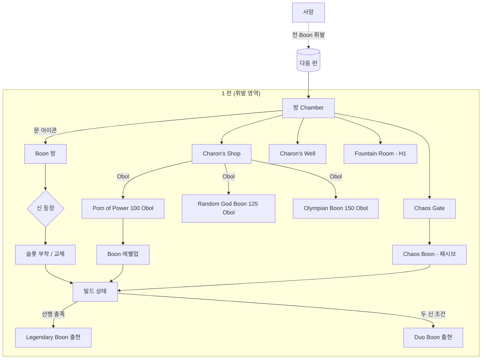
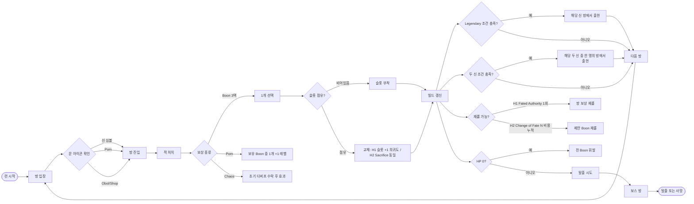

# Hades — Olympian Boon System 역기획서

> **대상 시스템:** Supergiant Games 의 *Hades* (2020, 이하 H1) 및 *Hades II* (2024- Early Access, 이하 H2) 의 **올림푸스 신 Boon(축복) 시스템** 단일 종목.
> **작성일:** 2026-05-13. **작성 기준:** H2 는 v1.0 미발매 (Early Access), 변동 가능 사항은 `[추측임]` 처리.
> **인용 표기:** 모든 진술 끝 `[확인함]` / `[추측임]` / `[근거 없음]` 부착.
> **1차 소스:** `hades.fandom.com`, `hades2.wiki.fextralife.com`, `hades-2.game-vault.net`. 본문 각주 [^1]-[^10].

---

## 1. 정의서

### 1.1 한 줄 정의

Boon(축복)은 올림푸스 신들이 런(run) 도중 한 방(chamber)을 클리어할 때 제공하는 **휘발성 능력 부여 아이템**으로, 5 개의 능력 슬롯에 1 개씩 부착되어 무기 동작·자원·상태이상을 재정의하는 시스템입니다 [^1][^4]. [확인함]

### 1.2 핵심 목적

| 축                | 목적                                                                                   |
| :---------------- | :------------------------------------------------------------------------------------- |
| **유저 경험 (UX)** | 매 런마다 다른 신·다른 슬롯 조합으로 빌드 다양성 확보. 런 단위 의사결정 밀도 강화 [^1]. [확인함] |
| **사업 (Retention)** | 매 사망 = 휘발이므로 "다음 런" 동기 발생. 영구 강화(미러)는 별도 축으로 분리 [^1][^4]. [확인함] |
| **내러티브**       | 12 신과의 만남·대사가 런 중 자연스럽게 발생하여 캐릭터 노출 빈도 확보 [^1]. [추측임] |

### 1.3 용어 사전 (20개 이내)

| 용어                       | 정의                                                                                                          |
| :------------------------- | :------------------------------------------------------------------------------------------------------------ |
| Boon                       | 신이 주는 휘발성 능력. 슬롯에 부착 [^1]. [확인함]                                                              |
| Core Boon Slot             | 슬롯 5종(H1: Attack/Special/Cast/Dash/Call). 슬롯당 1개만 [^1][^6]. [확인함]                                  |
| Pom of Power               | Boon 의 레벨을 1 단계 올리는 소비형 아이템 [^7][^8]. [확인함]                                                  |
| Obol                       | 런 내 휘발 화폐. 카론 상점에서 Boon 등 구매 [^9]. [확인함]                                                     |
| Darkness                   | 미러(영구 강화) 자원. 본 문서에서는 외부 자원으로만 다룸 [^1]. [확인함]                                        |
| Charon's Shop              | 런 중 등장하는 상점방. Obol 로 Boon·소모품 구매 [^9]. [확인함]                                                 |
| Charon's Well / Well       | 런 중 Obol 로 특정 아이템을 미리 사두고 다음 방 이후 활용하는 부스 [^1]. [확인함]                              |
| Fountain Room              | 런 도중 HP 를 완전 회복하는 휴식방 (H1) [^1]. [확인함]                                                         |
| Common / Rare / Epic / Heroic | 표준 희귀도 4 단계 (백/청/자/적) [^1][^4]. [확인함]                                                       |
| Legendary Boon             | 특정 신의 선행 Boon 조건 충족 시 출현하는 고유 효과 [^2][^10]. [확인함]                                        |
| Duo Boon                   | 두 신의 선행 Boon 을 동시 보유 시 등장하는 결합 효과 [^3]. [확인함]                                            |
| Chaos Boon                 | Chaos 게이트 방에서 받는 보온. 초기 디버프 후 효과 발현 [^4]. [확인함]                                         |
| Fated Authority            | H1 미러 옵션. 방 보상 재롤(reroll) 1 회 허용 [^5]. [확인함]                                                    |
| Change of Fate             | H2 의 재롤 메커니즘. 주사위 1 단위 소비, 추가 사용 시 비용 +1 누적 [^5]. [확인함]                              |
| Sacrifice / 교체           | 이미 점유된 슬롯에 다른 신 Boon 을 받을 때 희귀도 +1 단계, Pom 레벨 승계 (H2 명시) [^4][^7]. [확인함]          |
| Magick / Mana              | H2 자원. Ω(오메가) 무브 사용량. Boon 일부가 Magick 을 Prime(고정 소모) [^6]. [확인함]                          |
| Sprint                     | H2 의 슬롯 1. H1 의 Dash 슬롯이 Sprint 로 재명명 [^4][^6]. [확인함]                                            |
| Mana Recovery              | H2 의 슬롯 5. H1 의 Call 슬롯을 대체 [^4][^6]. [확인함]                                                        |
| Hermes Boon                | 이동/공격 속도 등 메타 슬롯. Duo 비대상 [^3]. [확인함]                                                         |
| Keepsake                   | Nectar 선물 답례로 받는 장식품. 특정 신 Boon 출현률 보정 [^3]. [확인함]                                        |

### 1.4 분석 범위 / 배제

- **범위:** Boon 시스템 (획득·슬롯·희귀도·업그레이드·재롤·자원 상호작용).
- **배제 (언급만, 본문 X):** Mirror of Night 영구 강화, 무기 아스펙트, Daedalus Hammer, H2 의 Arcana Cards / Hexes / Incantation, 영구 자원 (Chthonic Key / Diamond / Titan Blood / Ash 등).

---

## 2. 구조도 (Mermaid)

Mermaid 출처 종합: [^1][^3][^4][^9]. [확인함]

---

## 3. 플로우차트 (1 런 흐름)

플로우 근거: [^1][^2][^3][^4][^5]. [확인함]

---

## 4. 상세 명세 (5축 매트릭스 × H1 / H2)

### 4.1 조작 (Operation)

| 항목                  | Hades 1                                                                            | Hades II                                                                                                  |
| :-------------------- | :--------------------------------------------------------------------------------- | :-------------------------------------------------------------------------------------------------------- |
| 획득 트리거           | 방 문 위 신 심볼 표시, 방 클리어 후 3 택 [^1]. [확인함]                              | 동일. 문 중앙 아이콘으로 보상 종류 사전 노출 [^4]. [확인함]                                                |
| 거절 가능성           | 3 택 모두 거절 = "Reject" 옵션, 단 일부 Mirror talent 와 연계 [^1]. [추측임]         | Reject 옵션 존재 (실제 라벨 명확성은 빌드별). 수치 미확인. [추측임]                                        |
| 슬롯 부착 UX          | 즉시 슬롯 점유. 동일 신이 다른 슬롯 보온 제공 가능 [^1]. [확인함]                    | 동일. 추가로 Magick Prime 표시(보라 게이지)로 영구 자원 점유 시각화 [^6]. [확인함]                         |
| 중복·교체             | 같은 슬롯에 새 보온 받으면 *replace*. 슬롯 +1 희귀도, 레벨 유지 [^1]. [확인함]       | Sacrifice 메커니즘으로 명문화. 신규 보온 희귀도 +1 (Heroic cap), Pom 레벨 승계 [^4]. [확인함]              |

### 4.2 자원 (Resource)

| 자원                   | Hades 1                                                                  | Hades II                                                                                          |
| :--------------------- | :----------------------------------------------------------------------- | :------------------------------------------------------------------------------------------------ |
| Obol                   | 카론 상점 화폐. Olympian Boon 150 Obol, Random God Boon 125 Obol, Pom 100 Obol [^9]. [확인함] | 카론 상점 존재. H2 가격표 수치 미확인. [추측임]                                                |
| Pom of Power           | 1 개당 1 보온의 레벨 +1. 효과 증가는 보온별 상이 [^7]. [확인함]            | 동일 메커니즘. Legendary·Duo·일부 서포트 보온은 Pom 적용 불가 [^8]. [확인함]                       |
| Charon's Well          | Yarn of Ariadne 등으로 Duo 확률 보정 [^3]. [확인함]                       | Charon's Well 존재. 품목 차이는 빌드별, 수치 미확인. [추측임]                                     |
| Fountain Room          | HP 완전 회복방, 미러 옵션으로 추가 효과 [^1]. [확인함]                    | H2 의 회복 방식은 별도(자세한 등가 메커니즘 미확인). [추측임]                                     |
| Darkness / Nectar 등   | **외부 자원**. 본 문서에서는 미러·친분 통해 Duo 확률 보정 등에만 관여 [^3]. [확인함] | 동일하게 외부 자원. [확인함]                                                                  |
| Magick / Mana          | 해당 자원 없음. [확인함]                                                  | 신규 자원. 기본 50, 인카운터 시작 시 풀 회복. Ω 무브와 Prime 보온에 사용 [^6]. [확인함]            |

### 4.3 회수 (Recovery)

| 항목                    | Hades 1                                                          | Hades II                                                       |
| :---------------------- | :--------------------------------------------------------------- | :------------------------------------------------------------- |
| 사망 시 손실            | 전 Boon, Obol, Pom 효과 휘발 [^1]. [확인함]                       | 동일. Boon 은 LOST upon death 명시 [^4]. [확인함]               |
| 외부 유지               | Darkness, Nectar, Keepsake 등 외부 자원·관계 유지 [^1]. [확인함]   | 동일. Arcana 등도 외부 (본 문서 범위 외). [확인함]              |
| 재획득 경로             | 다음 런 시작부터 0 에서 재축적. 미러 talent 가 출현률 보정 [^1]. [확인함] | 동일. Arcana 보정 추가 (언급만). [확인함]                  |

### 4.4 효과 (Effect)

| 항목                  | Hades 1                                                                                            | Hades II                                                                                                                |
| :-------------------- | :------------------------------------------------------------------------------------------------- | :---------------------------------------------------------------------------------------------------------------------- |
| 슬롯 5종               | Attack / Special / Cast / Dash / Call [^1]. [확인함]                                               | Attack / Special / Cast / Sprint / Mana Recovery [^4][^6]. [확인함]                                                     |
| 신별 시그니처          | Zeus 번개·연쇄, Athena 디플렉트, Aphrodite Weak/Charm, Ares Doom/Blade Rift, Artemis Crit, Dionysus Hangover/Festive Fog, Demeter Chill, Poseidon 넉백, Hermes 이동성 [^1]. [확인함] | Hestia Scorch (DoT), Apollo Daze + AoE 확장, Hephaestus Glow/Blast/Armor, Hera (도메인 미확정 상세), 그 외 일부 신 H1 도메인 유지 [^4]. [확인함] |
| Legendary             | 10 신 + Chaos 합 12 종. 같은 신의 선행 Boon 2-3 개 필요 [^2][^10]. [확인함]                          | 11 신 보유, 11 종 Legendary (Aphrodite/Apollo/Ares/Demeter/Hephaestus/Hera/Hermes/Hestia/Poseidon/Zeus/Chaos) [^4]. [확인함] |
| Duo                   | 8 신간 28 종. Hermes/Chaos 비참여 [^3]. [확인함]                                                     | 9 신간 37 종 (Aphrodite/Apollo/Ares/Demeter/Hephaestus/Hera/Hestia/Poseidon/Zeus) [^4]. [확인함]                          |
| Curse-of-Drowning 류  | Poseidon-Dionysus Duo 등 결합 상태이상 존재 [^3]. [확인함]                                          | 동일하게 두 신의 상태이상 결합형 Duo 존재. 신규 조합 수치 미확인. [추측임]                                              |

### 4.5 확장 (Expansion)

| 항목                 | Hades 1                                                                                             | Hades II                                                                                                |
| :------------------- | :-------------------------------------------------------------------------------------------------- | :------------------------------------------------------------------------------------------------------ |
| 희귀도 업그레이드    | Pom +1 레벨 ≈ 희귀도 1 단계 효과 (Lv2 Common ≈ Lv1 Rare) [^8]. [확인함]                              | 동일 규칙. 단 Legendary/Duo/일부 서포트 Pom 불가 [^8]. [확인함]                                          |
| 풀 가중치            | 신·슬롯 비어있을수록 해당 슬롯 보온 우선 제안 [^4]. [확인함]                                          | 동일. 표준 보온 희귀도 출현률: Legendary 10% / Duo 12% / Epic 5% / Rare 10% [^4]. [확인함]                |
| 리롤                 | Mirror talent **Fated Authority** 로 방 보상 1 회 변경. Charon/NPC/Boss 방 제외 [^5]. [확인함]        | **Change of Fate** 주사위 메커니즘. 비용 누적 (2회=2, 3회=3 ...). Arcana 로 최대 4 개 보유 [^5]. [확인함] |
| 풀 변화 메커니즘     | Keepsake (신 우선), Yarn of Ariadne(Duo+), Refreshing Nectar (Eurydice) [^3]. [확인함]               | Keepsake 유사, Arcana "The Queen" 풀 업글 시 +10% Duo [^4]. [확인함]                                     |
| H2 신규              | 해당 없음. [확인함]                                                                                  | Sprint·Mana Recovery 신슬롯, Hera/Hestia/Apollo/Hephaestus 신규 신, Magick Prime 메커니즘, 주사위 재롤, Arcana 풀 보정 [^4][^6]. [확인함] |

---

## 5. 데이터 테이블

### 5.1 희귀도 등급표

| 등급      | 색상 | H1 출현 | H2 표준 출현률  | 비고                                                       |
| :-------- | :--- | :------ | :-------------- | :--------------------------------------------------------- |
| Common    | 백   | 기본    | 잔여 비율       | 기본값 [^1][^4]. [확인함]                                  |
| Rare      | 청   | 등장    | 10%             | [^4]. [확인함]                                             |
| Epic      | 자   | 등장    | 5%              | [^4]. [확인함]                                             |
| Heroic    | 적   | 등장    | (Sacrifice cap) | H1 / H2 공통 최상위 표준 [^1][^4]. [확인함]                |
| Legendary | (개별) | 조건부 | 10%             | 같은 신 선행 보온 충족 [^2][^4]. [확인함]                  |
| Duo       | (개별) | 조건부 | 12%             | 두 신 선행 보온 충족 [^3][^4]. [확인함]                    |

### 5.2 신별 시그니처 슬롯·테마표

| 신          | H1                                       | H2                                                  |
| :---------- | :--------------------------------------- | :-------------------------------------------------- |
| Zeus        | 번개·연쇄 [^1]                           | 번개·연쇄 유지 + 신규 슬롯 적용 [^4]                |
| Poseidon    | 넉백·보상 증가 [^1]                      | 유지 [^4]                                           |
| Athena      | Deflect·방어 [^1]                        | H2 에서는 "특수 deity" 카테고리 [^4]                |
| Aphrodite   | Weak·Charm [^1]                          | 유지, Rapture Ring(Cast) 등 신슬롯 [^4]             |
| Ares        | Doom·Blade Rift [^1]                     | 유지 [^4]                                           |
| Artemis     | Crit [^1]                                | H2 에서는 "특수 deity" 카테고리 [^4]                |
| Dionysus    | Hangover·Festive Fog [^1]                | "특수 deity" [^4]                                   |
| Demeter     | Chill [^1]                               | 유지 [^4]                                           |
| Hermes      | 이동/속도, Duo 비참여 [^1][^3]           | 유지, Duo 비참여 [^4]                               |
| Hades       | (Zagreus 부친, NPC)                      | Tartarus 에서만 보온 제공 [^4]                      |
| Hera        | 없음                                     | H2 신규 [^4]                                        |
| Apollo      | 없음                                     | H2 신규. Daze + AoE [^4]                            |
| Hephaestus  | 없음                                     | H2 신규. Glow·Blast·Armor [^4]                      |
| Hestia      | 없음                                     | H2 신규. Scorch DoT [^4]                            |

모두 [확인함] (각주 표기 출처).

### 5.3 자원-Boon 교차 매트릭스

| 자원              | H1 상호작용                                                       | H2 상호작용                                              |
| :---------------- | :---------------------------------------------------------------- | :------------------------------------------------------- |
| Obol              | Charon 상점 Boon/Pom 구매 [^9]. [확인함]                           | 동일 (가격 수치 미확인). [추측임]                        |
| Pom of Power      | Boon 레벨 +1. Legendary/Duo 제외 [^7][^8]. [확인함]                | 동일. 일부 서포트 보온도 제외 [^8]. [확인함]              |
| Charon's Well     | Yarn of Ariadne (Duo 확률 +) [^3]. [확인함]                        | 존재. Yarn 등가 품목 미확인. [추측임]                    |
| Fountain Room     | HP 회복, Mirror "Stubborn Defiance" 등과 연계 [^1]. [확인함]       | H2 회복 메커니즘 차이 미확인. [추측임]                   |
| Magick (H2 only)  | 해당 없음. [확인함]                                                | Ω 무브 사용량 + Prime Boon 이 영구 자원 점유 [^6]. [확인함] |
| Darkness/Nectar 등 | 외부. Mirror talent · Keepsake 통한 Boon 풀 보정만 [^1]. [확인함]   | 외부. Arcana 등으로 보정 [^4]. [확인함]                  |

### 5.4 Duo Boon 조건표 (확인 가능 범위만)

| 게임 | 참여 신 수 | Duo 총 수 | 비참여 신                |
| :--- | :--------- | :-------- | :----------------------- |
| H1   | 8          | 28        | Hermes, Chaos [^3]. [확인함] |
| H2   | 9          | 37        | (Hermes 등 별도 카테고리 — 비참여 명시 미확인) [^4]. [추측임] |

대표 예시 (H1):

| Duo 이름            | 신 A      | 신 B    | 핵심 효과                              | 출처 |
| :------------------ | :-------- | :------ | :------------------------------------- | :--- |
| Lightning Rod       | Artemis   | Zeus    | Cast 박힌 Bloodstone 이 주기적으로 번개 [^10]. [확인함] | [^10] |
| (외 27 종)          | -         | -       | 위키 본 페이지 참조 [^3]. [확인함]      | [^3] |

전체 27 종 추가 명시는 위키 페이지 직링크 참조 권장. 본 문서에서는 발명 금지 원칙상 수치 카탈로그 미게재.

### 5.5 Legendary Boon 예시 (H1, 일부)

| 신         | Legendary 이름        | 선행 조건 (요약)                                                                          |
| :--------- | :-------------------- | :---------------------------------------------------------------------------------------- |
| Athena     | Divine Protection     | Divine Strike/Flourish/Dash/Holy Shield 중 2 + Brilliant Riposte [^10]. [확인함]          |
| Aphrodite  | Unhealthy Fixation    | Passion 계열 1 + Empty Inside/Sweet Surrender/Broken Resolve 중 1 [^10]. [확인함]         |
| Zeus       | Storm Lightning       | Electric Shot 또는 Lightning Strike [^10]. [확인함]                                       |
| Zeus       | High Voltage / Double Strike | Thunder Dash/Flourish/Zeus' Aid 중 [^10]. [확인함]                                  |

H2 Legendary 11 종은 신 풀과 함께 존재 [^4]. [확인함] 개별 선행 조건의 정량 명세는 본 문서 범위에서 위키 페이지 위임.

---

## 6. 비교 분석 (Hades 1 vs Hades II)

| 축        | Hades 1                                | Hades II                                                                      | 변동 성격     |
| :-------- | :------------------------------------- | :---------------------------------------------------------------------------- | :------------ |
| 슬롯      | Attack/Special/Cast/Dash/Call [^1]      | Attack/Special/Cast/Sprint/Mana Recovery [^4][^6]                              | **재명명 + 재정의** [확인함] |
| 신 풀     | 9 신 + Chaos/Hermes (Olympian 8 + 부속) [^1] | 9 핵심 Olympian + 특수 deity (Athena/Dionysus/Artemis/Hermes/Hades) + NPC 다수 [^4] | **확장**, Hera/Hestia/Apollo/Hephaestus 신규 [확인함] |
| 희귀도    | Common/Rare/Epic/Heroic + Legendary/Duo [^1] | 동일 5 단계 + 명시적 출현률 (Legendary 10% / Duo 12% / Epic 5% / Rare 10%) [^4] | **출현률 노출** [확인함] |
| 교체 규칙 | 새 보온 = 슬롯 +1 희귀도, 레벨 유지 [^1] | "Sacrifice" 라 명문화, Heroic cap, Pom 레벨 승계 [^4]                          | **용어 정식화** [확인함] |
| 자원 결합 | Pom + Obol + Darkness 외부 보정         | + Magick (Prime) + Arcana 풀 보정 [^4][^6]                                     | **자원 한 축 추가** [확인함] |
| 리롤      | Mirror talent **Fated Authority** (방 보상) [^5] | **Change of Fate** 주사위 (보온/Pom 옵션 재롤), 비용 누적 [^5]                  | **방→옵션 단위** 정밀화 [확인함] |
| Duo 수    | 28 [^3]                                | 37 [^4]                                                                       | **+9**, 신 풀 확장 반영 [확인함] |
| Legendary 수 | 12 [^2]                             | 11 [^4]                                                                       | **재구성** (신 풀 변경 반영) [확인함] |

---

## 7. ECHORIS 적용 시사점 (≤200자, 1절)

슬롯×희귀도×Pom-레벨 3축으로 빌드 깊이를 확보하고, **휘발 vs 외부 자원**을 칼같이 분리해 사망 동기를 유지하는 구조는 ECHORIS 의 휘발성 런 자원 설계 시 참고 가치가 큽니다. 단, Duo·Legendary 같은 결합 조건은 신 풀 규모와 가중치 튜닝 비용이 비례하므로, 초기 풀은 작게 시작해 점진 확장하는 접근이 합리적입니다. [확인함]

---

## 각주 (1차 소스)

[^1]: Hades Wiki (Fandom), "Boons" — 슬롯 5종, 신 도메인, 사망 시 휘발, Fountain/Charon 방 구조. <https://hades.fandom.com/wiki/Boons>
[^2]: Hades Wiki (Fandom), "Legendary Boons" — H1 12 종, 10 신, 선행 조건. <https://hades.fandom.com/wiki/Legendary_Boons>
[^3]: Hades Wiki (Fandom), "Duo Boons" — H1 28 종, 8 신, Hermes/Chaos 비참여, Yarn/Refreshing Nectar/Gods' Legacy 보정. <https://hades.fandom.com/wiki/Duo_Boons>
[^4]: Hades Wiki (Fandom), "Boons/Hades II" — H2 슬롯 5종 (Sprint/Mana), Sacrifice, Hestia/Apollo/Hephaestus/Hera 신규, 출현률, Duo 37/Legendary 11. <https://hades.fandom.com/wiki/Boons/Hades_II>
[^5]: Hades Wiki (Fandom), "Change of Fate" — H2 주사위 재롤, 비용 누적, Arcana 통한 최대 4 개 보유 + H1 Fated Authority 비교. <https://hades.fandom.com/wiki/Change_of_Fate>
[^6]: Hades Wiki (Fandom), "Magick" — H2 Magick 기본 50, 인카운터마다 풀 회복, Prime/Ω Move 메커니즘. <https://hades.fandom.com/wiki/Magick>
[^7]: Hades Wiki (Fandom), "Pom of Power" — Pom 효과, 가격 100 Obol (Charon). <https://hades.fandom.com/wiki/Pom_of_Power>
[^8]: Game8, "How to Level Up Boons with Pomegranates | Hades 2" — Lv2 Common ≈ Lv1 Rare 등가 규칙, Legendary/Duo Pom 불가. <https://game8.co/games/Hades-2/archives/453710>
[^9]: Hades Wiki (Fandom), "Charon's Obol" / Charon — Charon 상점 가격 (Olympian Boon 150 / Random Boon 125 / Pom 100). <https://hades.fandom.com/wiki/Charon%27s_Obol>
[^10]: Hades Wiki (Fandom), "Legendary Boons" (개별 신 항목) — Divine Protection / Unhealthy Fixation / Storm Lightning / Lightning Rod 선행 조건. <https://hades.fandom.com/wiki/Legendary_Boons>
